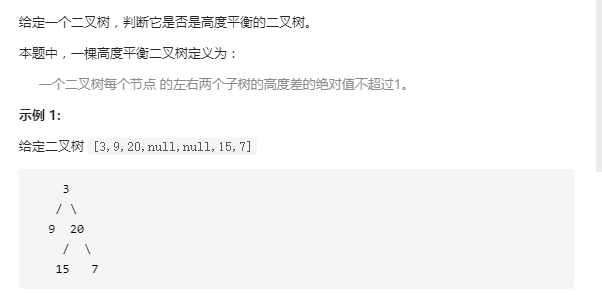
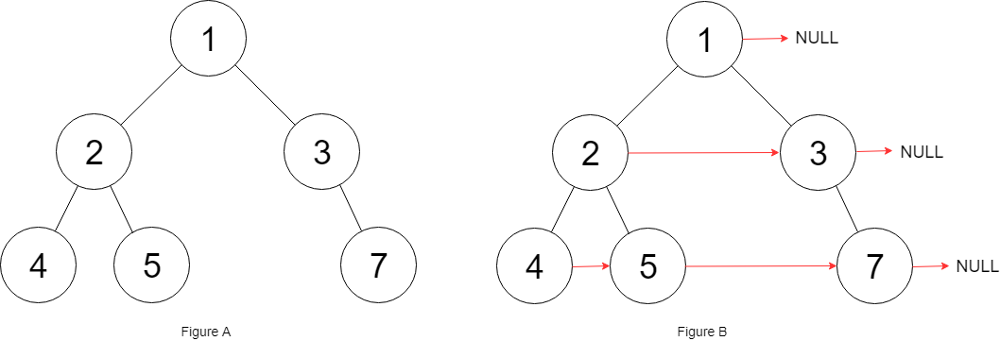

# 递归


# 回溯


# 动态规划

## 一

链接：https://leetcode-cn.com/problems/distinct-subsequences/

* 题目

> 给定一个字符串 S 和一个字符串 T，计算在 S 的子序列中 T 出现的个数
>
> 一个字符串的一个子序列是指，通过删除一些（也可以不删除）字符且不干扰剩余字符相对位置所组成的新字符串
>
> （例如，"ACE" 是 "ABCDE" 的一个子序列，而 "AEC" 不是）

### 1、解法一：递归之分治

S 中的每个字母就是两种可能**选**或**不选**。我们用递归的常规思路，将大问题化成小问题，也就是分治的思想。

如果我们求 S[0，S_len - 1] 中能选出多少个 T[0，T_len - 1]，个数记为 n。那么分两种情况，

1. S[0] == T[0]，需要知道两种情况

> 从 S 中选择当前的字母，此时 S 跳过这个字母, T 也跳过一个字母
> 去求 S[**1**，S_len - 1] 中能选出多少个 T[**1**，T_len - 1]，个数记为 n1


> S 不选当前的字母，此时 S 跳过这个字母， T 不跳过字母
> 去求S[**1**，S_len - 1] 中能选出多少个 T[**0**，T_len - 1]，个数记为 n2

2. S[0] ！= T[0]

> S 只能不选当前的字母，此时S跳过这个字母， T 不跳过字母。
>
> 去求 S[1，S_len - 1] 中能选出多少个 T[0，T_len - 1]，个数记为  n1

也就是说如果求 S[0，S_len - 1] 中能选出多少个 T[0，T_len - 1]，个数记为 n，转换为数学式就是

```java
if(S[0] == T[0]){
    n = n1 + n2;
}else{
    n = n1;
}
```

这当中会有很多重复的递归项，可以借助 map 来保存中间结果，减少递归项，代码如下

```java
public int numDistinct(String s, String t) {
    HashMap<String, Integer> map = new HashMap<>();
    return recursion(s, 0, t, 0, map);
}

public int recursion(String s, int s_start, String t, int t_start, HashMap<String, Integer> map) {
    if (t_start == t.length()) {
        return 1;
    }
    if (s_start == s.length()) {
        return 0;
    }

    String key = s_start + "@" + t_start;
    if (map.containsKey(key)) {
        return map.get(key);
    }

    int count = 0;
    if (s.charAt(s_start) == t.charAt(t_start)) {
        count = recursion(s, s_start + 1, t, t_start + 1, map) +
                recursion(s, s_start + 1, t, t_start, map);
    } else {
        count = recursion(s, s_start + 1, t, t_start, map);
    }

    map.put(key, count);
    return count;
}
```


### 2、解法二：递归之回溯

​		回溯的思想就是朝着一个方向找到一个解，然后再回到之前的状态，改变当前状态，继续尝试得到新的解。可以类比于二叉树的 `DFS` ，一路走到底，然后回到之前的节点继续递归

​		对于这道题，利用回溯就是这样的思路，当`S`串的当前字母和`T`串的当前字母相等，我们就可以选择`S`的当前字母，进入递归。递归出来以后，继续尝试不选择`S`的当前字母，进入递归。

```java
private void numDistinctHelper(String s, int s_start, String t, int t_start) {
    //当前字母相等，选中当前 S 的字母，s_start 后移一个
    //选中当前 S 的字母，意味着和 T 的当前字母匹配，所以 t_start 后移一个
    if (s.charAt(s_start) == t.charAt(t_start)) {
        numDistinctHelper(s, s_start + 1, t, t_start + 1);
    }
    //出来以后，继续尝试不选择当前字母，s_start 后移一个，t_start 不后移
    numDistinctHelper(s, s_start + 1, t, t_start);
}
```

* 递归出口

​        当 t_start == t_len，那么就意味着当前从S中选择的字母组成了T，此时就代表一种选法。我们可以用一个全局变量count，count 计数此时就加一。然后 return，返回到上一层继续寻求解

​		当 s_start == S_len，此时 S 到达了结尾，直接 return


* 遇到了已经求过的解该怎么办呢？

​        我们每次得到一个解后增加全局变量 count，所以我们 **map 的 value 存两次递归后 count 的==增量==**。这样的话，第二次遇到同样的情况的时候，就不用递归了，把当前增量加上就可以了

```java
int count = 0;
public int numDistinct(String s, String t) { 
    HashMap<String, Integer> map = new HashMap<>();
    numDistinctHelper(s, 0, t, 0, map);
    return count;
}

private void numDistinctHelper(String s, int s_start, String t, int t_start, 
			HashMap<String, Integer> map) {
    if (t_start == t.length()) {
        count++; 
        return;
    }
    if (s_start == s.length()) {
        return;
    }
    String key = s_start + "@" + t_start;
    if (map.containsKey(key)) {
        count += map.get(key);
        return; 
    }
    
    int count_pre = count;   // 求增量
    
    //当前字母相等，s_start 后移一个，t_start 后移一个
    if (s.charAt(s_start) == t.charAt(t_start)) {
        numDistinctHelper(s, s_start + 1, t, t_start + 1, map);
    }
    //出来以后，继续尝试不选择当前字母，s_start 后移一个，t_start 不后移
    numDistinctHelper(s, s_start + 1, t, t_start, map);
    
    //将增量存起来
    int count_increment = count - count_pre;
    map.put(key, count_increment); 
}
```


### 3、解法三：动态规划

这里我们用一个二维数组 `dp[m][n]` 对应于从 S[m，S_len] 中能选出多少个 T[n，T_len]

当 m == S_len，意味着S是空串，此时 `dp[S_len][n]`，n 取 0 到 T_len - 1 的值都为 0

当 n == T_len，意味着T是空串，此时 `dp[m][T_len]`，m 取 0 到 S_len 的值都为 1


然后状态转移的话和解法一分析的一样。如果求dp[s][t]。

S[s] == T[t]，当前字符相等，那就对应两种情况，选择S的当前字母和不选择S的当前字母

`dp[s][t] = dp[s+1][t+1] + dp[s+1][t]` 

S[s] != T[t]，只有一种情况，不选择S的当前字母

`dp[s][t] = dp[s+1][t]` 

```java
public int numDistinct(String s, String t) {
    int s_len = s.length();
    int t_len = t.length();

    int[][] dp = new int[s_len + 1][t_len + 1];

    for (int i = 0; i <= s_len; i++) {
        dp[i][t_len] = 1;
    }

    for (int t_i = t_len - 1; t_i >= 0; t_i--) {
        for (int s_j = s_len - 1; s_j >= 0; s_j--) {
            if (s.charAt(s_j) == t.charAt(t_i)) {
                dp[s_j][t_i] = dp[s_j + 1][t_i + 1] + dp[s_j + 1][t_i];
            } else {
                dp[s_j][t_i] = dp[s_j + 1][t_i];
            }
        }
    }

    return dp[0][0];
}
```


## 二、三角形最小路径和

给定一个三角形，找出自顶向下的最小路径和。每一步只能移动到下一行中相邻的结点上。

相邻的结点在这里指的是 下标与上一层结点下标相同或者等于上一层结点下标 + 1 的两个结点

例如，给定三角形：

```json
[
  [2],
  [3,4],
  [6,5,7],
  [4,1,8,3]
]
```

自顶向下的最小路径和为 `11`（即，**2** + **3** + **5** + **1** = 11）

最小路径为：`dp[i][j] = Math.min(dp[i + 1][j], dp[i + 1][j + 1]) + triangle.get(i).get(j);` 

要从底往上推

```java
public int minimumTotal(List<List<Integer>> triangle) {

    int n = triangle.size();
    int[][] dp = new int[n + 1][n + 1];

    for (int i = n - 1; i >= 0; i--) {
        for (int j = 0; j <= i; j++) {
            dp[i][j] = Math.min(dp[i + 1][j], dp[i + 1][j + 1]) + triangle.get(i).get(j);
        }
    }
    return dp[0][0];
}
```


## 三、买股票

* 题目

> 给定一个数组，它的第 i 个元素是一支给定的股票在第 i 天的价格
>
> 设计一个算法来计算你所能获取的最大利润。你最多可以完成 **==两笔==** 交易。
>
> 注意: 你不能同时参与多笔交易（你必须在再次购买前出售掉之前的股票）

* 示例

> 1 5 2 8 3 10

​		第一天买第二天卖，第三天买第四天卖，第五天买第六天卖，三次收益分别是 4，6，7，最高的两次就是 6 + 7 = 13 了，但是我们第二天其实可以不卖出，第四天再卖出，那么收益是 8 - 1 = 7，再加上第五天买入第六天卖出的收益就是 7 + 7 = 14 了。**所以当达到了一个高点时不一定要卖出** 

* 思路

用一个二维数组 `dp[i][k]` 来表示前 `i` 天交易 `k` 次的最大收益

​		首先第 `i` 天可以什么都不操作，今天的最高收益就等于昨天的最高收益：`dp[i][k]=dp[i-1][k]`

​		我们第 `i` 天也可以选择卖出，既然选择卖出，那么在 `0` 到 `i-1` 天就要选择一天买入。那在买入之前已经进行了 `k-1` 次买卖

> 在第 0 天买入，收益就是 `prices[i] - prices[0]`
>
> 在第 1 天买入，收益就是 `prices[i] - prices[1] + dp[0][k-1]`，多加了前一天的最大收益
>
> 在第 2 天买入，收益就是 `prices[i] - prices[2] + dp[1][k-1]`，多加了前一天的最大收益
>
> ......
>
> 在第 `j` 天买入，收益就是 `prices[i] - prices[j] + dp[j-1][k-1]`，多加了前一天的最大收益
> `dp[i][k] = prices[i] - prices[j] + dp[j-1][k-1] = prices[i] - (prices[j] - dp[j-1][k-1])` 

所以就是求 `prices[j] - dp[j-1][k-1]` 的最小值

初始条件对于 `k` 等于 `0` 的情况，收益就是 `0` 了

```java
public int maxProfit(int[] prices) {
    if (prices.length == 0) {
        return 0;
    }

    int[][] dp = new int[prices.length][3];

    for (int k = 1; k <= 2; k++) {
        int min = prices[0];
        for (int i = 1; i < prices.length; i++) {
            min = Math.min(prices[i] - dp[i - 1][k - 1], min);
            dp[i][k] = Math.max(dp[i - 1][k], prices[i] - min);
        }
    }

    return dp[prices.length - 1][2];
}
```


# 二叉树

## 求二叉树的最大深度


```java
class TreeNode {
    int val;
    TreeNode left;
    TreeNode right;

    TreeNode(int x) {
        val = x;
    }
}

// https://leetcode-cn.com/problems/maximum-depth-of-binary-tree/

public class Solution {

    public int maxDepth(TreeNode root) {
        if (root == null) {
            return 0;
        } else {
            int leftLenth = maxDepth(root.left);
            int rightLength = maxDepth(root.right);
            return Math.max(leftLenth, rightLength) + 1;
        }
    }

}
```


## 求二叉树最小深度


* 思路

> 叶子节点的定义是左孩子和右孩子都为 null 时叫做叶子节点
> 当 root 节点左右孩子都为空时，返回 1
> 当 root 节点左右孩子有一个为空时，返回不为空的孩子节点的深度
> 当 root 节点左右孩子都不为空时，返回左右孩子较小深度的节点值

```java
// https://leetcode-cn.com/problems/minimum-depth-of-binary-tree/
public int minDepth(TreeNode root) {
    if (root == null) {
        return 0;
    }

    if (root.left == null && root.right == null) {
        return 1;
    }

    int leftLen = minDepth(root.left);
    int rightLen = minDepth(root.right);

    if (root.left == null || root.right == null) {
        return leftLen + rightLen + 1;
    }

    return Math.min(leftLen, rightLen) + 1;
}
```


## 根据前序、中序遍历生成二叉树


> 利用前序遍历创建二叉树，利用中序遍历来分割左右子树，不断遍历


```java
// https://leetcode-cn.com/problems/construct-binary-tree-from-preorder-and-inorder-traversal/

public class Solution {

    public static void main(String[] args) {
        int[] preorder = {3, 9, 20, 15, 7};
        int[] inorder = {9, 3, 15, 20, 7};

        Solution solution = new Solution();
        TreeNode root = solution.buildTree(preorder, inorder);

        solution.printTree(root);
    }

    public TreeNode buildTree(int[] preorder, int[] inorder) {
        HashMap<Integer, Integer> map = new HashMap<>();

        for (int i = 0; i < inorder.length; i++) {
            map.put(inorder[i], i);
        }

        return buildTreeTFC(preorder, 0, preorder.length - 1, 0, inorder.length - 1, map);
    }

    public TreeNode buildTreeTFC(int[] preOrder, int preLeft, int preRight, int inLeft, int inRigth, HashMap<Integer, Integer> map) {

        if (preLeft > preRight || inLeft > inRigth) {
            return null;
        }

        int rootVal = preOrder[preLeft];
        TreeNode root = new TreeNode(rootVal);

        int rootIndex = map.get(rootVal);

        root.left = buildTreeTFC(preOrder, preLeft + 1, rootIndex - inLeft + preLeft, inLeft, rootIndex - 1, map);
        root.right = buildTreeTFC(preOrder, rootIndex - inLeft + preLeft + 1, preRight, rootIndex + 1, inRigth, map);

        return root;

    }

    public void printTree(TreeNode root) {
        if (root != null) {
            System.out.println(root.val);
            printTree(root.left);
            printTree(root.right);
        }
    }

}
```


## 根据中序、后序遍历生成二叉树


```java
class TreeNode {
    int val;
    TreeNode left;
    TreeNode right;

    TreeNode(int x) {
        val = x;
    }
}

// https://leetcode-cn.com/problems/construct-binary-tree-from-inorder-and-postorder-traversal/

public class Solution {

    public static void main(String[] args) {

        int[] inorder = {9, 3, 15, 20, 7};
        int[] postorder = {9, 15, 7, 20, 3};

        Solution solution = new Solution();
        TreeNode root = solution.buildTree(inorder, postorder);

        solution.printTree(root);
    }

    public TreeNode buildTree(int[] inorder, int[] postorder) {
        HashMap<Integer, Integer> map = new HashMap<>();

        for (int i = 0; i < inorder.length; i++) {
            map.put(inorder[i], i);
        }

        return buildTreeTFC(postorder, 0, postorder.length - 1, 0, inorder.length - 1, map);
    }

    public TreeNode buildTreeTFC(int[] postOrder, int postLeft, int postRight, int inLeft, int inRigth, HashMap<Integer, Integer> map) {
        if (postLeft > postRight || inLeft > inRigth) {
            return null;
        }

        int rootVal = postOrder[postRight];
        TreeNode root = new TreeNode(rootVal);

        int rootIndex = map.get(rootVal);

        int leftNum = rootIndex - inLeft;
        int rightNum = inRigth - rootIndex;

        root.left = buildTreeTFC(postOrder, postLeft, postLeft + leftNum - 1, inLeft, rootIndex - 1, map);
        root.right = buildTreeTFC(postOrder, postRight - rightNum, postRight - 1, rootIndex + 1, inRigth, map);

        return root;
    }

    public void printTree(TreeNode root) {
        if (root != null) {
            System.out.println(root.val);
            printTree(root.left);
            printTree(root.right);
        }
    }

}
```


## 有序链表转换为二叉搜索树


```java
class TreeNode {
    int val;
    TreeNode left;
    TreeNode right;

    TreeNode(int x) {
        val = x;
    }
}

class ListNode {
    int val;
    ListNode next;

    ListNode(int x) {
        val = x;
    }
}

// https://leetcode-cn.com/problems/convert-sorted-list-to-binary-search-tree/

public class Solution {

    public static void main(String[] args) {
        ListNode root = new ListNode(-10);
        ListNode temp = root;

        temp.next = new ListNode(-3);
        temp = temp.next;

        temp.next = new ListNode(0);
        temp = temp.next;

        temp.next = new ListNode(5);
        temp = temp.next;

        temp.next = new ListNode(9);

        Solution solution = new Solution();

        TreeNode node = solution.sortedListToBST(root);

        solution.printTree(node);
    }

    public TreeNode sortedListToBST(ListNode head) {
        if (head == null) {
            return null;
        }

        ListNode mid = findMidNode(head);
        TreeNode root = new TreeNode(mid.val);

        if (head == mid) {
            return root;
        }

        root.left = sortedListToBST(head);
        root.right = sortedListToBST(mid.next);

        return root;
    }

    public ListNode findMidNode(ListNode head) {

        ListNode preNode = null;
        ListNode slowPtr = head;
        ListNode fastPtr = head;

        /**
         * 快慢指针，慢指针每次走一步，快指针每次走两步
         * 这样快指针到终点事，慢指针在中点（中间）
         */
        while (fastPtr != null && fastPtr.next != null) {
            preNode = slowPtr;
            slowPtr = slowPtr.next;
            fastPtr = fastPtr.next.next;
        }

        if (preNode != null) {
            preNode.next = null;
        }

        return slowPtr;
    }

    public void printTree(TreeNode root) {
        if (root == null) {
            return;
        }
        System.out.println(root.val);
        printTree(root.left);
        printTree(root.right);
    }
}
```


## 判断是否为平衡二叉树

平衡二叉树定义

> 一个二叉树每个节点 的左右两个子树的高度差的绝对值不超过 1



* 思路

> 如果左右子树不是平衡二叉树，则返回 -1，若是，则返回较高的子树的最大高度

```java
// https://leetcode-cn.com/problems/balanced-binary-tree/
public boolean isBalanced(TreeNode root) {
    if (depth(root) != -1) {
        return true;
    }
    return false;
}

public int depth(TreeNode root) {
    if (root == null) {
        return 0;
    }
    int leftLength = depth(root.left);
    if (leftLength == -1) {
        return -1;
    }
    int rightLength = depth(root.right);
    if (rightLength == -1) {
        return -1;
    }

    int height = rightLength - leftLength;
    if (height <= 1 && height >= -1) {
        return Math.max(leftLength, rightLength) + 1;
    }
    return -1;
}
```


## 填充 next 指针

链接：https://leetcode-cn.com/problems/populating-next-right-pointers-in-each-node-ii/

给定一个二叉树

```java
struct Node {
  int val;
  Node *left;
  Node *right;
  Node *next;
}
```

​		填充它的每个 next 指针，让这个指针指向其下一个右侧节点。如果找不到下一个右侧节点，则将 next 指针设置为 NULL，初始状态下，所有 next 指针都被设置为 NULL

​		要求：只能使用常量级额外空间


* 思路

​        用一个额外的节点连接每一层

```java
public Node connect(Node root) {

    Node cur = root;
    while (cur != null) {
        Node dummy = new Node();
        Node tail = dummy;

        while (cur != null) {
            if (cur.left != null) {
                tail.next = cur.left;
                tail = tail.next;
            }
            if (cur.right != null) {
                tail.next = cur.right;
                tail = tail.next;
            }
            cur = cur.next;
        }
        cur = dummy.next;
    }

    return root;
}
```


