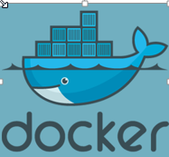
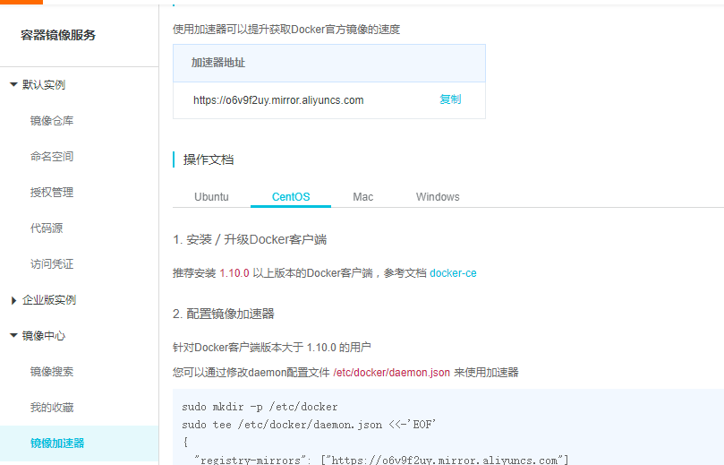
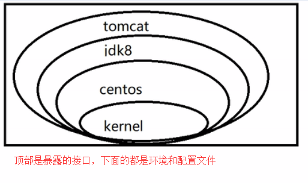
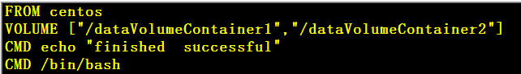
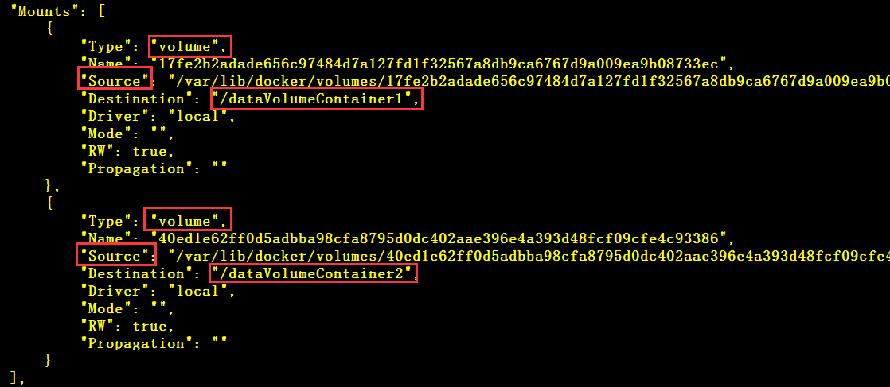

# Docker

## 一、简介

**Docker** 是一个开源的应用容器引擎，是一个轻量级容器技术

​		**Docker** 支持将软件编译成一个镜像，然后在镜像中各种软件做好配置，将镜像发布出去，其他使用者可以直接使用这个镜像；

运行中的这个镜像称为容器，容器启动是非常快速的




## 二、核心概念

docker主机(Host)：安装了Docker程序的机器（Docker直接安装在操作系统之上）

docker客户端(Client)：连接docker主机进行操作

docker仓库(Registry)：用来保存各种打包好的软件镜像

docker镜像(Images)：软件打包好的镜像；放在 docker 仓库中

docker容器(Container)：镜像启动后的实例称为一个容器，容器是独立运行的一个或一组应用


* 使用 Docker的步骤
    1. 安装 Docker
    2. 去 Docker 仓库找到对应软件的镜像
    3. 使用 Docker 运行这个镜像，这个镜像会生成一个 Docker 容器
    4. 对容器的启动停止，就是对软件的启动停止

## 三、安装 Docker

* https://yq.aliyun.com/articles/110806?spm=a2c4e.11153940.0.0.24582a65xJ8Qij

```shell
# step 1: 安装必要的一些系统工具
yum install -y yum-utils device-mapper-persistent-data lvm2
# Step 2: 添加软件源信息
yum-config-manager --add-repo http://mirrors.aliyun.com/docker-ce/linux/centos/docker-ce.repo
# Step 3: 更新并安装 Docker-CE
yum makecache fast
yum -y install docker-ce
# Step 4: 开启Docker服务
service docker start  /  systemctl  start  docker
```

* 启动 docker
    * ==**systemctl  start docker**== 

* **要想从 Docker 中拉取镜像，必须有一个 Docker hub  账号** 
    * 官网创建一个账号
    * 使用 docker  之前需要登录 docker
        * **==docker  login==** 

## 四、阿里云 Docker  加速器

1. 注册一个阿里云账号

    * https://www.aliyun.com/?utm_content=se_1003086080

2. 找到容器镜像服务，选择镜像加速器

    * https://cr.console.aliyun.com/cn-hangzhou/instances/mirrors

    

3. 在 **==/etc/docker/dagemon.json==**  文件中添加以下内容（具体操作可看官网）

    ```
    {
      "registry-mirrors": ["https://o6v9f2uy.mirror.aliyuncs.com"] //注册后获得的加速器地址
    }
    ```

4. 重启加速器

    ```shell
    systemctl daemon-reload
    ```

5. 重启 docker

    ```shell
    systemctl restart docker
    ```

## 五、常用操作

### 1、帮助命令

1、**docker   version** 

* 查看版本号

2、**docker   info** 

* 详细信息

3、**docker   --help** 

* 帮助命令


### 2、镜像命令

1、**docker search  关键字** 

* 从仓库中搜索镜像

2、**docker  pull  镜像名：tag** 

* 拉取镜像
    * tag 多为版本号，默认是 latest

3、**docker  images** 

* 查看本地的镜像

4、**docker  rmi  镜像 ID** 

* 删除镜像


### 3、容器命令

* 运行容器
    * **docker  run  --name  自定义容器名  -d  镜像名：tag** 
    * 例 ：docker  rum  --name  mytomcat  -d  tomcat：latest（默认的可以不写）
        * **-d** ：表示后台运行，并返回容器 ID
        * **--name**：为容器指定一个名字
        * **-i**：以交互式运行容器，通常与 **-t** 同时使用
        * **-t**：为容器重新分配一个伪终端，通常与 **-i** 同时使用
* 退出以交互式方式运行的容器
    * **exit**：直接退出
    * **ctrl  +  P  +  Q**：临时退出
        * 重新进入
            * **docker  attach  容器 ID** 
                * 重新进入容器
            * **docker  exec  -t  容器 ID  操作** 
                * 执行某个指令进入某个环境，然后将在那个环境中操作的结果返回，并不会重新进入容器
* 查看运行中的容器镜像
    * **docker   ps** 
        * **-a**：查看所有容器，包括已经停止运行的
        * **-q**：只显示 **ID** 
* 停止某个容器，加上  -a  可以查看所有的容器，包括停止的
    * **docker  stop  容器名/容器 ID  （-a）** 
    * **docker  kill  容器名/容器 ID**：强制停止
* 启动某个容器
    * **docker  start  容器 ID** 
* 删除容器
    * **docker  rm  容器 ID（容器必须处理停止状态）** 
* **docker  rm  $( docker ps -a -q)**：删除所有容器
    * **-f**：强制删除
* 映射端口，以便外部能够访问
    * **docker   rum  --name   自动义容器名  -d  -p  8888:8080   镜像名：tag** 
        * **-p**：将主机端口映射到容器中的镜像的指定端口
            * 8888 ：主机端口
            * 8080 ：tomcat  容器指定端口
    * **==外部能够访问的话需要关闭虚拟机的防火墙==** 
        * 查看防火墙状态
            * service  firewall   status  
        * 关闭防火墙
            * service    firewall   stop
* 查看容器日志
    * **docker  logs   容器名/容器 ID** 
    * **-t**：加上时间
    * **-f**：动态查看（日志会实时更新到控制台）
* 查看容器内运行的进程
    * **docker  top  容器名/容器ID**

* 查看容器内部细节
    * **docker  inspect  容器 ID**

* 从容器内拷贝文件到宿主机上
    * **docker  cp  容器 ID：容器内路径   目的主机上的路径**

* 提交容器副本使之成为一个新的镜像
    * **docker  commit 容器 ID  目标镜像名**
        * **-m**：提交的描述信息
        * **-a**：作者


## 六、Docker镜像

### 1、什么是镜像

* 镜像是一种轻量级、可执行的独立软件包，用来打包软件运行环境和基于运行环境开发的软件
* 它包含运行某个软件所需的所有内容包括代码、运行时、库、环境变量和配置文件


### 2、什么是 Docker 镜像

* 联合文件系统（**Union FS**）
    * Union 文件系统（ Union FS）是一种**分层、轻量级并且高性能的文件系统**，它支持**==对文件系统的修改作为次提交来一层层的叠加，==**同时可以将不同目录挂载到同一个虚拟文件系统下
    * Union 文件系统是 Docker 镜像的基础
        * 镜像可以通过分层来进行继承，基于基础镜像（没有父镜像），**可以制作各种具体的应用镜像** 
    * 特点
        * 一次同时加载多个文件系统，但从面看起来，只能看到一个文件系统
        * 联合加载会把各层文件系统叠加起来，这样最终的文件系统会包含所有底层的文件和目录

* Docker 镜像加载原理
    * docker 的镜像实际上由一层一层的文件系统组成
    * **bootfs（boot file system）**
        * 主要包含 **bootloader** 和 **kernel**，bootloader 主要是引导加载 kernel，Linux刚启动时会加我 **bfs** 文件系统
        * 在 Docker 镜像的最底层是 bootfs。这一层与我们典型的 Linux/Unⅸ 系统是一样的，包含boot 加载器和内核
        * 当 boot 加载完成之后，整个内核就都在内存中了，此时内存的使用权已由 bootfs 转交给内核，此时系统也会卸载 bootfs
    * **rootfs（root  file  system）** 
        * 在 boot 之上包含的就是典型 Linux 系统中的 /dev、/proc、/bin、/etc 等标准目录和文件
        *  rootfs 就是各种不同的操作系统发行版，比如 Ubuntu, Centos 等等




## 七、容器数据卷

### 1、数据卷

1、作用

* 用来保存数据的做持久化的，类似于 Redis 中的 rdb、aof

2、特点

1）、数据卷可在容器之间共享或重用数据

2）、卷中的更改可以直接生效

3）、数据卷中的更改不会包含在镜像的更新中

4）、数据卷的生命周期一直持续到没有容器使用它为止


3、操作

1）、通过**命令**添加

* **docker  run  -it  -v   /宿主机绝对路径：/容器内的目录    镜像名/镜像 ID** 
    * 会自动创建相应的目录
    * 没有设置权限的情况下，两边的数据任何时候都是同步的，断开连接后再连接也是同步的


2）、通过 **DockerFile** 添加

* 什么是 DockerFIle
    * 用来描述镜像的文件，类似于 hello.java 的 hello.class

步骤

1. 根目录下新建一个文件夹（假设为  myDocker）

2. 在 DockerFile 中使用 **==VOLUME==** 指令来给镜像添加一个或多个数据卷



* 宿主机上对应的默认的容器卷位置
    * 使用 **docker  inspect ** 命令查看




3. 使用 build 命令生成一个镜像
    * **docker  build  -f  /myDocker/DockerFile  -t  tfc/centos .** 
        * **-f**：表是一个文件
        * **-t**：命名空间
        * **.**：在当前目录下
        * **tfc/centos**：起个名字，必须小写


### 2、数据卷容器

1、什么是数据卷容器

* 命名的容器挂载数据卷，其它容器通过挂载这个（父容器）实现数据共享
* 挂载数据卷的容器，称之为数据卷容器

2、作用

* 容器间数据的共享传递

* 步骤

    1. 先启动一个父容器 **dc01**

        *  **docker run -it --name dc03  tfc/centos**

        * 在容器卷中做一些改动，方便观察

    2. 启动两个容器继承 **dc01**

        *  **docker run -it --name dc03 --volumes-from dc01 tfc/centos**

        * 在容器卷中做一些改动，方便观察

    3. 分别查看容器卷中的内容，数据已经共享

* 特点

    * 容器之间配置信息的传递，生命周期一直持续到没有容器使用它为止


## 八、DockerFile

### 1、什么是 DockerFile

* Dockerfile是用来构建 Docker 镜像的**构建文件**，**是由一系列命和参数构成的脚本** 

* 构建过程
    1. 编写 DockerFile 文件
    2. build 生成一个本地镜像
    3. run（启动）


DockerFile 构建过程解析

1、基础内容

* 每条**保留字指令**都必须为大写字母且后面要跟随至少一个参数
* 指令按照从上到下，顺序执行
* #表示注释
* 每条指令都会创建一个新的镜像层，并对镜像进行提交

2、Docker 解析 DockerFile 的大致流程

* docker 从**基础镜像**运行一个容器
    * **FROM ...** 
* 执行一条指令并对容器作出修改
* 执行类似 docker commit 的操作提交一个新的镜像层
* docker 再基于刚提交的镜像运行一个新容器
* 执行 dockerfile 中的下一条指令直到所有指令都执行完成


### 2、保留字指令

1、**FROM**

* 基础镜像，表示当前镜像基于哪个镜像

2、**MAINTAINER** 

* 镜像维护者的姓名和邮箱等信息

3、**RUN** 

* 容器构建的时候需要运行的命令

4、**EXPOSE** 

* 当前容器对外暴露的端口号

5、**WORKDIR** 

* 指定在创建容器后，终端默认登陆进来的工作目录，一个落脚点

6、**ENV** 

* 用来在构建镜像过程中设置环境变量

7、**ADD / COPY** 

* 将宿主机目录下的文件拷贝进镜像
* 且 **ADD** 命令会自动处理 URL 和解压 tar 压缩包，**COPY** 则不行

8、**VOLUME** 

* 容器数据卷，用于数据保存和持久化工作

9、**CMD** 

* 指定一个容器启动时要运行的命令
* Dockerfile 中可以有多个 CMD指令，**但只有最后一个生效**，CMD 会被 docker run 之后的参数替换

10、**ENTRYPOINT** 

* 指定一个容器启动时要运行的命令
* ENTRYPOINT 的目的和 CMD一样，**都是在指定容器启动程序及参数**，但是它不会被替换，而是追加
    * docker run 之后的参数会被当做参数传递给 ENTRYPOINT，之后形成新的命令组合

11、**ONBUILD** 

* 当构建（build） Dockerfile 时，该镜像的父镜像（FROM）的 onbuild 被触发


### 3、案例学习

==1、==Base 镜像（**scratch**）

* Docker hub中 99% 的镜像都是通过**在 base 镜像中安装和配置需要的软件**构建出来的

==2、==自定义镜像 **myCentos**

要求

* 更改登录后的默认路径
* 支持 vim 编辑器和 ifconfig 命令

步骤

1. 编写 **DockerFile**

```dockerfile
FROM centos

ENV mypath /usr/local   		   # 设置环境变量

WORKDIR $mypath                    # 修改登录落脚点

RUN yum install -y vim			   # 安装需要的东西
RUN yum install -y net-tools

EXPOSE 80						   # 修改暴露的端口

CMD echo "=================Successful================="

CMD /bin/bash
```

2. 使用 **build** 命令构建
    * **docker  build  -f  /myDocker/...   -t  mycentos:2.0  .** 
    * -t  后面跟的标签一定要小写

3. 运行测试


==3、== 自定义 Tomcat

1. 创建一个工作目录，位置任意

```jinja2
/myDocker/tomcatTest
```

2. 编写 DockerFile

```dockerfile
FROM centos
MAINTAINER tfc<915033844@qq.com>

COPY c.txt /usr/local/tfcContainer.txt

ADD jdk-8u251-linux-x64.tar.gz /usr/local
ADD apache-tomcat-9.0.34.tar.gz /usr/local

RUN yum install -y vim

ENV myPath /usr/local
WORKDIR $myPath

ENV JAVA_HOME /usr/local/jdk1.8.0_251
ENV CLASSPATH $JAVA_HOME/lib/dt.jar;$JAVA_HOME/lib/tools.jar
ENV CATALINA_HOME /usr/local/apache-tomcat-9.0.34
ENV CATALINA_BASE /usr/local/apache-tomcat-9.0.34
ENV PATH $PATH;$JAVA_HOME/bin;$CATALINA_HOME/lib;$CATALINA_HOME/bin

EXPOSE 8080

CMD /usr/local/apache-tomcat-9.0.34/bin/startup.sh && tail -F /usr/local/apache-tomcat-9.0.34/bin/logs/catalina.out
```

3. 构建，使用 build

```shell
docker build -f /..路径 -t 别名 .
```

4. run，顺带创建两个数据卷

```shell
docker run -d -p 9090:8080 --name myTomcat \
> -v /myDocker/tomcatTest/tomcat_test:/usr/local/apache-tomcat-9.0.34/webapps/test \
> -v /myDocker/tomcatTest/tomcat_logs:/usr/local/apache-tomcat-9.0.34/logs \
> tomcatcentos
```

5. 验证
    * 通过端口访问 tomcat


## 九、Docker 运行 MySql

* 运行

```shell
docker run -p 12345:3306 --name mysql
-v /myDocker/mysql/conf:/etc/mysql/conf.d
-v /myDocker/mysql/logs:/logs
-v /myDocker/mysql/data:/var/lib/mysql
-e MYSQL_ROOT_PASSWORD=123456
-d mysql
```

* 交互

```
docker exec -it ID /bin/bash
```


## 十、Docker 运行 Redis

```shell
docker run -p 6379:6379
-v /myDocker/redis/data:data
-v /myDocker/redis/conf/redis.conf:/usr/local/etc/redis/redis.conf
-d redis redis-server /usr/local/etc/redis/redis.conf --appendonly yes
```

* **/myDocker/redis/conf/redis.conf**：宿主机的配置文件地址

* **/myDocker/redis/conf/redis.conf**：Docker 中 Redis 配置文件地址


* 交互

```shell
docker exec -it ID /bin/bash
```


