# Hibernate

* 基本操作

> 创建 JavaBean
>
> 创建 表

## 一、配置文件

### 1、映射配置文件

**==文件名和位置任意，只要配置时写全路径即可==** 

* 约束

```xml-dtd
<?xml version="1.0" encoding="UTF-8" ?>
<!DOCTYPE hibernate-mapping PUBLIC
        "-//Hibernate/Hibernate Mapping DTD 3.0//EN"
        "http://www.hibernate.org/dtd/hibernate-mapping-3.0.dtd">
```


* 具体配置

```xml
<hibernate-mapping>
    <!--配置类和表对应
        1.类名需要全路径
        2.表名是数据库表名
    -->
    <class name="entity.Account" table="account">
        <!--实体类属性和表字段对应
        1.hibernate要求实体类有一个属性的值唯一(key)
        2.hibernate要求表有字段的值唯一(key)
        -->

        <id name="id" column="id"> <!--配置键的映射-->
            <generator class="native"></generator>  <!--键的增长策略-->
        </id>

        <property name="name" column="name"/> <!--数据库属性和实体类字段-->
        <property name="money" column="money"/>
    </class>
</hibernate-mapping>
```


* 细节

>1、id 标签和 property 标签， column属性可以省略的
>	不写值和name属性值一样的
>
>2、property 标签 type 属性，设置生成表字段的类型
>
>​	不写会自动判断


### 2、核心配置文件

* **==文件名和位置任意，只要加载时写全路径即可==** 

```java
// 加载配置文件
Configuration configuration = new Configuration();
configuration.configure("mapper/hibernateConf.xml");
```

* 约束

```xml-dtd
<?xml version="1.0" encoding="UTF-8" ?>
<!DOCTYPE hibernate-configuration PUBLIC
        "-//Hibernate/Hibernate Configuration DTD 3.0//EN"
        "http://www.hibernate.org/dtd/hibernate-configuration-3.0.dtd">
```


* 具体配置

```xml
<hibernate-configuration>
    <session-factory>
        <!--配置数据库信息(必须的)-->
        <property name="connection.driver_class">com.mysql.cj.jdbc.Driver</property>
        <property name="connection.url">jdbc:mysql://localhost:3306/test?serverTimezone=UTC</property>
        <property name="connection.username">root</property>
        <property name="connection.password">123456</property>

        <!--配置 Hibernate 信息(可选的)-->
        <property name="show_sql">true</property> <!--是否打印 sql 语句-->
        <property name="format_sql">true</property> <!--格式化 sql 语句-->
        <!--自动创建表：
            update：没有就创建，有就略过
        -->
        <property name="hibernate.hbm2ddl.auto">update</property>

        <!--配置映射文件(必须的)-->
        <mapping resource="hbm.xml"/>

    </session-factory>
</hibernate-configuration>
```


* 细节

> 1、配置需要写到 <session-factory> 标签内部


## 二、API

### 1、Configuration

* 加载核心配置文件

```java
Configuration configuration = new Configuration();
configuration.configure();
```


### 2、SessionFactory

* 使用 **Configuration** 来创建 **SessionFactory** 对象时所做的事情

1. 读取核心配置文件中的数据库配置，映射文件配置去创建表

```xml
<property name="hibernate.hbm2ddl.auto">update</property>
```


### 3、Session

* 类似于 JDBC 中的 Connection
* 调用各种方法实现 CRUD 操作
    * 添加：save()
    * 修改：update()
    * 删除：delete()
    * 根据 id 查询：get()

* Session 是单线程对象
    * Session 不能共享，只能自己使用


### 4、Transaction

> 事务对象

* 开启事务

```java
Transaction transaction = session.beginTransaction();
```

* 提交事务

```java
transaction.commit();
```

* 事务回滚

```java
transaction.rollback();
```


### 5、Query

> 使用 Query 对象不需要写 SQL 语句，但需要写 hql 语句
>
> ​	hql：hibernate  query  language，Hibernate 提供的查询语言，与普通的 sql 语句很相似，使用 hql 操作的是实体类而不是数据库

* 使用

```java
Query query = session.createQuery("from entity.Account");
List<Account> accounts = query.list();
for (Account account : accounts) {
    System.out.println(account);
}
```


### 6、Criteria

> 使用这个对象查询躁作，不需要写语句，直接调用方法实现

* 使用

```java
Criteria criteria = session.createCriteria(Account.class);
List<Account> accounts = criteria.list();
for (Account account : accounts) {
    System.out.println(account);
}
```


### 7、SQLQuery

> 使用 hibernate时候，调用底层 sql 实现

```java
// crud 操作
String sql = "select * from account";
NativeQuery sqlQuery = session.createSQLQuery(sql);
List<Object[]> accounts = sqlQuery.list(); // 返回的是数组结构
for (Object[] object : accounts) {
    System.out.println(Arrays.toString(object));
}
```


```java
String sql = "select * from account";
NativeQuery sqlQuery = session.createSQLQuery(sql);
// 设置以对象的形式返回
sqlQuery.addEntity(Account.class);

List<Account> accounts = sqlQuery.list();
for (Account account : accounts) {
    System.out.println(account);
}
```


## 三、键的自增策略

|   名称    |                             作用                             |
| :-------: | :----------------------------------------------------------: |
| increment | 用于long、 short、或int类型，由 Hibernate自动以递增的方式生成唯一标识符，每次增量为1。只有当没有其它进程向同一张表中插入数据时才可以使用，不能在集群环境下使用。适用于代理主键 |
| identity  | 采用底层数据库本身提供的主键生成标识符，条件是数据库支持自动增长数据类型。在DB2、MySL、 MS SQL Server、 Sybase 和 HypersonicSQL数据库中可以使用该生成器，该生成器要求在数据库中把主键定义成为自增长类型。适用于代理主键 |
| sequence  | Hibernate根据底层数据库序列生成标识符。条件是数据库支持序列。适用于代理主键。 |
|  native   | 根据底层数据库对自动生成表示符的能力来选择 identity sequence、hilo三种生成器中的一种，适合跨数据库平台开发。适用于代理主键 |
|   uuid    | Hibernate采用128位的UUD算法来生成标识符。该算法能够在网络环境中生成唯一的字符串标识符，其UD被编码为一个长度为32位的十六进制字符串。这种策略并不流行，因为字符串类型的主键比整数类型的主键占用更多的数据库空间。适用于代理主键 |
| assigned  | 由 Java 程序负责生成标识符，如果不指定 id 元素的 generator 属性，则默认使用该主键生成策略。适用于自然主键 |

* 使用 **uuid** 时，**id** 的类型必须为 **String** 类型

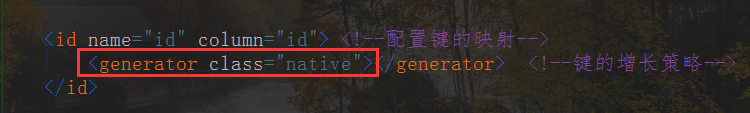


## 四、CRUD

### 1、增加

```java
Account account = new Account(1,"tfc",213,1);
session.save(account);
```


### 2、查找

```java
Account account = session.get(Account.class, 3);
System.out.println(account);
```


### 3、修改

```java
Account account = session.get(Account.class, 3);
account.setName("aaa");
session.update(account);
```


### 4、删除

```java
Account account = session.get(Account.class, 3);
session.delete(account);
```


## 五、一级缓存

* 特点

> 1、hibernate 的一级缓存默认是打开的
>
> 2、hibernate 的一级缓存使用范围，是 session 创建到 session 关闭
>
> 3、hibernate 的一级缓存中，存储数据必须持久态数据


* 验证

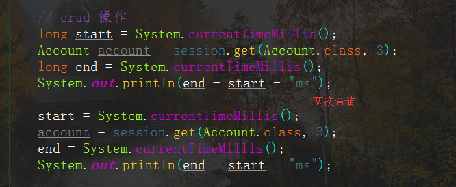

结果

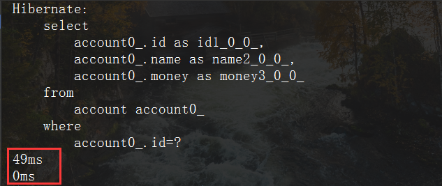


* 过程

> 查询时先到缓存中查询，缓存中没有数据就到数据库中查


## 六、绑定 Session

> thread：Session对象的生命周期与本地线程绑定
>
> ​      jta：Session对象的生命周期与 JTA 事务绑定
>
> managed：Hibernate 委托程序来管理 Session 对象的生命周期

1. 在核心配置文件中配置

```xml
<property name="hibernate.current_session_context_class">thread</property>
```

2. 调用 SessionFactory 中的方法得到

```java
// 与本地线程绑定
Session currentSession = sessionFactory.getCurrentSession();
```

* 与本地线程绑定之后就不需要手动关闭 session 了


## 七、一对多操作

创建实体类：客户-联系人，客户是‘一’，联系人是‘多’

```java
public class Customer {
    private Integer cid;
    private String custName;
    private String custLevel;
    private String custSource;
    private String custPhone;
    private String custMobile;
    
    // 一个客户有多个联系人
    // hibernate 要求使用集合表示多的数据，使用set集合
    private Set<LinkMan> manSet = new HashSet<LinkMan>();
    ...
}

public class LinkMan {
    private Integer lkm_id;
    private String lkm_name;
    private String lkm_gender;
    private String lkm_phone;
    
    // 一个联系人只属于一个客户
    private Customer customer;
    ...
}
```


### 1、映射文件配置

* 客户映射文件

```xml
<hibernate-mapping>

    <class name="entity.Customer" table="customer">
        <id name="cid" column="cid">
            <generator class="native"></generator>
        </id>

        <property name="custName" column="custName"/>
        <property name="custLevel" column="custLevel"/>
        <property name="custSource" column="custSource"/>
        <property name="custPhone" column="custPhone"/>
        <property name="custMobile" column="custMobile"/>

        <!--使用 set 标签配置所有的联系人 manSet
            name：属性值为实体类中 Set 集合的名字
        -->
        <set name="manSet">
            <!--外键，Hibernate 中的外键是双向维护的，‘一’的一方和‘多’的一方都需要维护
                column：属性值为外键的名称，可以随意起
            -->
            <key column="clid"></key>

            <!--客户的所有联系人，class 写联系人实体类的全路径-->
            <one-to-many class="entity.LinkMan"/>
        </set>

    </class>

</hibernate-mapping>
```

* 联系人映射文件

```xml
<hibernate-mapping>

    <class name="entity.LinkMan" table="linkMan">
        <id name="lkm_id" column="lkm_id">
            <generator class="native"></generator>
        </id>

        <property name="lkm_name" column="lkm_name"/>
        <property name="lkm_gender" column="lkm_gender"/>
        <property name="lkm_phone" column="lkm_phone"/>

        <!--联系人所属客户
            name：实体类中客户的名字
            class：客户类的全路径
            column：外键名称(两者一致)
        -->
        <many-to-one name="customer" class="entity.LinkMan" column="clid"/>
    </class>

</hibernate-mapping>
```


### 2、核心配置文件

```xml
<hibernate-configuration>
    <session-factory>
        <!--配置数据库信息(必须的)-->
        <property name="connection.driver_class">com.mysql.cj.jdbc.Driver</property>
        <property name="connection.url">jdbc:mysql://localhost:3306/test?serverTimezone=UTC</property>
        <property name="connection.username">root</property>
        <property name="connection.password">123456</property>

        <!--配置 Hibernate 信息(可选的)-->
        <property name="show_sql">true</property> <!--是否打印 sql 语句-->
        <property name="format_sql">true</property> <!--格式化 sql 语句-->
        <!--自动创建表：
            update：没有就创建，有就略过
        -->
        <property name="hibernate.hbm2ddl.auto">update</property>

        <property name="hibernate.current_session_context_class">thread</property>

        <!--配置映射文件(必须的)-->
        <mapping resource="customer.hbm.xml"/>
        <mapping resource="linkMan.hbm.xml"/>

    </session-factory>
</hibernate-configuration>
```


### 3、一对多级联保存

* 级联保存

> 添加一个客户，为这个客户添加多个联系人


方法一（较复杂）

```java
// 创建客户-联系人对象
Customer customer = new Customer();
customer.setCustName("徐凤年");
customer.setCustLevel("VIP");
customer.setCustSource("北凉王府");
customer.setCustPhone("11111");
customer.setCustMobile("23132312");

LinkMan linkMan = new LinkMan();
linkMan.setLkm_name("离阳");
linkMan.setLkm_gender("男");
linkMan.setLkm_phone("110");

// 设置两者的关系
customer.getManSet().add(linkMan);
linkMan.setCustomer(customer);

session.save(customer);
session.save(linkMan);
```


方法二（简化）

* 首先在客户映射配置文件中加上这么一个配置

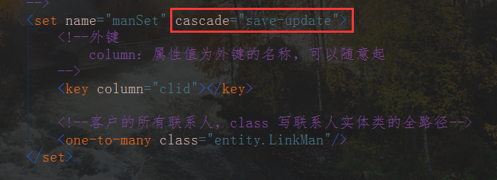


* 把联系人放到客户中就可以了

```java
// 创建客户-联系人对象
Customer customer = new Customer();
customer.setCustName("徐凤年");
customer.setCustLevel("VIP");
customer.setCustSource("北凉王府");
customer.setCustPhone("11111");
customer.setCustMobile("23132312");

LinkMan linkMan = new LinkMan();
linkMan.setLkm_name("离阳");
linkMan.setLkm_gender("男");
linkMan.setLkm_phone("110");

// 设置两者的关系
customer.getManSet().add(linkMan);
//linkMan.setCustomer(customer); 省略

session.save(customer);
// session.save(linkMan); 省略
```


### 4、一对多级联删除

> 删除某个客户，对应的所有联系人也一并删除

1、在客户的映射配置文件中的 **set** 标签中进行配置

```xml
<!--update：级联保存，delete：级联删除-->
<set name="manSet" cascade="save-update,delete">
    ...
</set>
```

2、直接写删除代码即可

```java
Customer customer = session.get(Customer.class, 1);
session.delete(customer);
```

> 过程

（1）先查询所有的客户

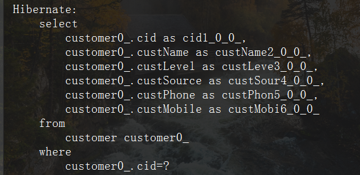

（2）再查询所有的联系人

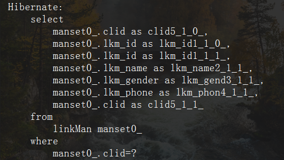

（3）将联系人的外键置为 NULL

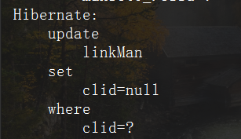

（4）删除

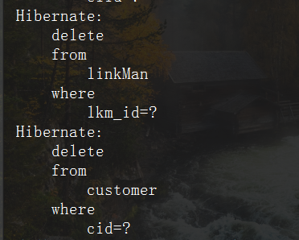


### 5、一对多的修改操作

> 修改联系人所对应的客户

方法

1. 先查询出修改到哪个客户
2. 再查询出需要修改的联系人
3. 设置两者关系，保存即可

```java
Customer customer = session.get(Customer.class, 3);
LinkMan linkMan = session.get(LinkMan.class, 3);

customer.getManSet().add(linkMan);
linkMan.setCustomer(customer);

session.save(customer);
session.save(linkMan);
```

* 问题：效率不高，执行了两次更新
* 原因：**Hibernate** 中的外键默认是双向维护的
* 解决办法
    * 让 **‘一’** 的一方放弃维护外键
    * 国家主席不可能认识所有人，但所有人都认识国家主席

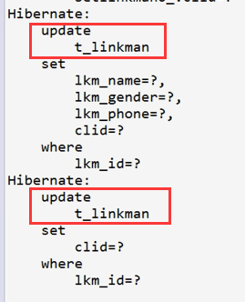


具体实现：在 ’一‘ 的一方的 **set** 标签中添加以下内容

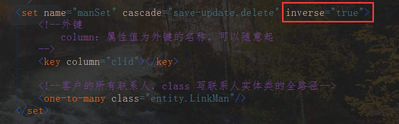


## 八、多对多操作

> 以用户和角色为例
>
> ​	一个用户有多个角色
>
> ​	一个角色可以被多个用户拥有


### 1、创建实体类

```java
public class User {
    private Integer user_id;
    private String user_name;
    private String user_password;
    
    // 一个用户有多个角色
    private Set<Role> roleSet = new HashSet<>();
    ...
}

public class Role {
    private Integer role_id;
    private String role_name;
    private String role_memo;
    
    // 一个角色可以被多个用户拥有
    private Set<Role> userSet = new HashSet<>();
    ...
}
```


### 2、映射文件配置

* 用户映射配置文件

```xml
<hibernate-mapping>

    <class name="manyTOmany.User" table="user">
        <id name="user_id" column="user_id">
            <generator class="native"></generator>
        </id>

        <property name="user_name" column="user_name"/>
        <property name="user_password" column="user_password"/>

        <!--table：第三张表的名字-->
        <set name="roleSet" table="user_role">
            <!-- key：当前配置文件在第三张表中的外键名称-->
            <key column="userId"></key>

            <!--class：角色实体类的全路径
               column：角色表在第三张表中的外键名称
             -->
            <many-to-many class="manyTOmany.Role" column="roleId"/>
        </set>

    </class>

</hibernate-mapping>
```


* 角色映射配置文件

```xml
<hibernate-mapping>

    <class name="manyTOmany.Role" table="role">
        <id name="role_id" column="role_id">
            <generator class="native"></generator>
        </id>

        <property name="role_name" column="role_name"/>
        <property name="role_memo" column="role_memo"/>

        <!-- table: 第三张表的名字 -->
        <set name="userSet" table="user_role">
            <!-- column: 当前配置文件在第三张表中的外键名称 -->
            <key column="roleId"/>

            <!-- class: 用户实体类的全路径
                column: 用户表在第三张表中的外键名称
            -->
            <many-to-many class="manyTOmany.User" column="userId"/>
        </set>
    </class>

</hibernate-mapping>
```

> 在核心配置文件中引入映射配置文件


### 3、多对多级联保存

> 根据用户保存角色

1、在用户映射配置文件中添加配置

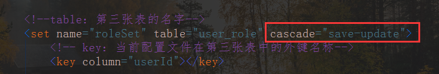

2、代码

```java
/**
 * 创建两个用户，每个用户有两个角色
 */
User user1 = new User();
user1.setUser_name("TFC");
user1.setUser_password("123");

User user2 = new User();
user2.setUser_name("YML");
user2.setUser_password("456");

Role role1 = new Role();
role1.setRole_name("总经理");
role1.setRole_memo("总经理");

Role role2 = new Role();
role2.setRole_name("董事长");
role2.setRole_memo("董事长");

Role role3 = new Role();
role3.setRole_name("秘书");
role3.setRole_memo("秘书");

/**
 * 建立关系：配置过 cascode 就不需要双向建立关系，单向建立即可
 * user1  -- role1、role2
 * user2  -- role1、role3
 */
user1.getRoleSet().add(role1);
user1.getRoleSet().add(role2);

user2.getRoleSet().add(role1);
user2.getRoleSet().add(role3);

// 保存用户
session.save(user1);
session.save(user2);
```


### 4、多对多级联删除

> 删除用户

1、在用户映射配置文件中添加配置

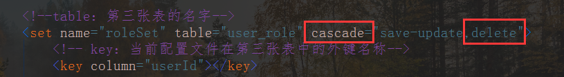

2、代码

```java
User user = session.get(User.class, 1);
session.delete(user);
```

* 注意

> ​	    这种方式删除用户时，会将用户所拥有的角色信息一起删除，导致其他用户拥有的同样的角色信息也被删除了，一般不使用。


### 5、维护多对多的第三张表

> 用户和角色多对多的关系，是通过第三张表来维护的

让某个用户有某个角色

1、根据 **id** 查询用户和角色的信息

2、将角色放到用户的角色列表中

```java
User user = session.get(User.class, 1);
Role role = session.get(Role.class, 1);
user.getRoleSet().add(role);

session.save(user);
```


让某个用户没有某个角色

1、根据 **id** 查询用户和角色的信息

2、从用户角色列表中删除该角色

```java
User user = session.get(User.class, 1);
Role role = session.get(Role.class, 1);
user.getRoleSet().remove(role);

session.save(user);
```


## 九、Hibernate 中的查询方式

### 1、对象导航方式

> 根据 **id** 查询某个客户，再查询客户所拥有的联系人

```java
/**
 * 对象导航方式
 * 查询 id=1 的用户，再查询该用户的联系人
 */
Customer customer = session.get(Customer.class, 1);
Set<LinkMan> manSet = customer.getManSet();
for (LinkMan man : manSet) {
    System.out.println(man);
}
```


### 2、OID 查询

> 根据 **id** 查询某一条记录

```java
Customer customer = session.get(Customer.class, 1);
```


### 3、hql 查询

> **hibernate  query  language**：利用 **Query** 对象来查询，需要写 **hql** 语句
>
> **hql** 操作的是实体类和属性，**sql** 操作的是数据库的表和字段

#### 3.1 查询所有

> **hql** 语句：**from**  实体类名称

```java
Query query = session.createQuery("from Customer");
List<Customer> customers = query.list();
for (Customer customer : customers) {
    System.out.println(customer);
}
```


#### 3.2 条件查询

* **hql** 语句

> **from**  实体类名称  **where**  实体类属性名称 **=？ and**  实体类属性名称 **=？**
> **from**  实体类名称  **where**  实体类属性名称 **like？**

```java
/**
 * 条件查询
 */
String hql = "from Account where id > ?1";
Query query = session.createQuery(hql);
query.setParameter(1, 3);

List<Account> accounts = query.list();
for (Account account : accounts) {
    System.out.println(account);
}
```


#### 3.3 排序查询

* **hql** 语句

> **from**  实体类名称  **order  by**  实体类属性名称 **asc/desc**

```java
/**
 * 排序查询
 */
String hql = "from Account order by id desc";
Query query = session.createQuery(hql);

List<Account> accounts = query.list();
for (Account account : accounts) {
    System.out.println(account);
}
```


#### 3.4 分页查询

> 在 **hql** 语句中，不能写 **limit，hibernate** 的 **Query** 对象封装两个方法实现分页操作

```java
/**
 * 分页查询
 */
String hql = "from Account";
Query query = session.createQuery(hql);

// 设置分页参数
query.setFirstResult(2);  // 分页开始位置
query.setMaxResults(4);   // 每页显示的最大数

List<Account> accounts = query.list();
for (Account account : accounts) {
    System.out.println(account);
}
```


#### 3.5 投影查询（查询列）

* **hql** 语句

> **select**  实体类属性名称1， 实体类属性名称2  **from**  实体类名称 
>
> **select**  后面不能写 * 号

```java
/**
 * 投影查询
 */
String hql = "select name from Account";
Query query = session.createQuery(hql);

// 这里就不能写实体类了，需要具体的类型
List<Object> objects = query.list();
for (Object object : objects) {
    System.out.println(object);
}
```


#### 3.6 聚集函数的使用

常用聚集函数

* **count、sum、avg、max、min**

* **hql** 语句

> **select  count(*)  from** 实体类名称

```java
/**
 * 聚集函数
 */
String hql = "select count(*) from Account";
Query query = session.createQuery(hql);

Object o = query.uniqueResult();
System.out.println(o);
```


#### 3.7 多表查询

**sql** 的多表查询

* 内连接

> select  *  from   customer c，linkman  l  where  c.cid=l.clid
> select  *  from   customer c  **inner  join**  linkman  l  **on**  c.cid=l.clid

* 左外连接

> select  *  from   customer c  **left  out  join**  linkman  l  **on**  c.cid=l.clid

* 右外连接

> select  *  from   customer c  **right  out  join**  linkman  l  **on**  c.cid=l.clid


**hql** 多表查询

* 内连接
    * 返回的 **list** 中是数组

> from  Customer  c  inner  join   c.setLinkMan

* **迫切**内连接
    * 返回的 **list** 中是对象

> from  Customer  c  inner  join  **fetch**  c.setLinkMan

* 左外连接

> from  Customer  c  **left  out  join**   c.setLinkMan

* **迫切**左外连接

> from  Customer  c  **left  out  join  fetch**   c.setLinkMan

* 右外连接

> from  Customer  c  **right  out  join**   c.setLinkMan


### 4、QBC 查询

> 利用 **Criteria** 对象调用方法来查询，不需要写 **sql、hql** 语句，但也是操作实体类属性

#### 4.1 查询所有

```java
/**
 * 查询所有
 */
// 获取 CriteriaQuery 对象
CriteriaBuilder criteriaBuilder = session.getCriteriaBuilder();
CriteriaQuery<Account> criteria = criteriaBuilder.createQuery(Account.class);

// 设置获取到的对象的类型
Root<Account> from = criteria.from(Account.class);

// 添加各种条件
criteria.select(from);

// 获取 Query 对象
Query<Account> query = session.createQuery(criteria);

List<Account> accounts = query.list();
for (Account account : accounts) {
    System.out.println(account);
}
```


## 十、Hibernate 检索策略

### 1、立即查询

> 根据 **id** 查询，调用 **get** 方法，一调用 **get** 方法马上发送语句查询数据库


### 2、延迟查询

> 根据 **id** 查询，调用 **load** 方法，调用 **load** 方法不会马上发送语句查询数据，只有需要对象里面的值时候才会发送语句查询数据库

```java
Customer customer = session.load(Customer.class, 1);

Integer cid = customer.getCid(); // 获取 ID 不会发送 sql 语句

System.out.println(customer.getCustName()); // 获取其他值会发送 sql 语句
```


### 3、延迟查询的分类

#### 3.1 类级别的延迟

> 根据 **id** 查询返回实体类对象，调用 **load** 方法不会马上发送语句


#### 3.2 关联级别延迟

> 查询某个客户，再查询这个客户的所有联系人，**需要用到客户的所有联系人时**才会发送查询联系人的语句，这个过程称为关联级别延迟


#### 3.3 修改延迟查询的方式

在配置文件的 **set** 标签中修改

* **fetch** 属性
    * 值：**select**（默认）
* **lazy** 属性
    * 值：**true**（延迟，这是默认选项）、**false**（不延迟）、**extra**（极其延迟）
    * **extra** 解释：需要什么就发送什么 sql 语句，而不是发送查询所有的 sql 语句


## 十一、批量抓取

* 使用场景

> 查询所有用户，再遍历用户查询所有的用户的联系人

传统方式每查询一个用户的联系人就会发送一次 **sql** 语句，效率低下

```java
String hql = " from Customer";
Query query = session.createQuery(hql);

List<Customer> customers = query.list();
for (Customer customer : customers) {
    Set<LinkMan> linkMans = customer.getManSet();
    for (LinkMan linkMan : linkMans) {
        System.out.println(linkMan);
    }
}
```


* 批量抓取方式

使用：在配置文件中的 **set** 标签中添加 **batch-size** 属性，值越大，性能越高（发送 sql 的语句次数更少）


