# 	----------- 内存与垃圾回收 ------------


# 一、JVM 与 Java 体系结构

## 1 、JVM 的整体结构

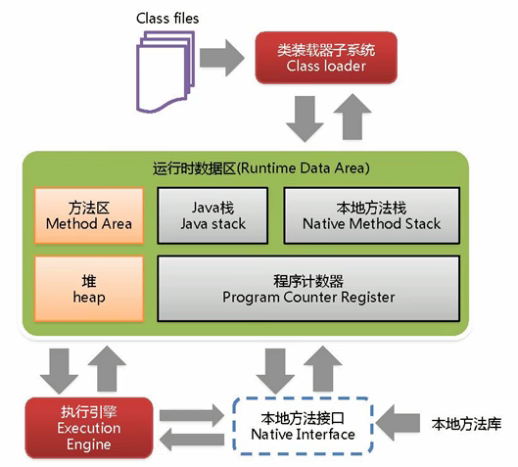


## 2、Java 程序执行过程

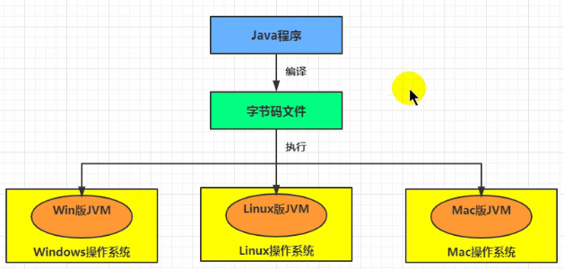


## 3、JVM 的架构模型

**Java** 编译器输入的指令流基本上是一种**==基于栈==的指令集架构** 

另外一种指令集架构则是**==基于寄存器==的指令集架构** 


### 3.1 基于栈的指令集架构

* 设计和实现更简单，适用于资源受限的系统
* 避开了寄存器的分配难题：使用**零地址指令方式分配** 
* 指令流中的指令大部分是零地址指令，其执行过程依赖于操作栈。指令集更小编译器容易实现
* 不需要硬件支持，可移植性更好，更好实现跨平台


> 零地址指令、一地址指令、二地址指令

一地址指令：一个地址、一个操作数

二地址指令：两个地址、一个操作数

零地址指令：没有地址，只有操作数，因为每次操作的都是栈顶指令，不需要地址


### 3.2 基于寄存器的指令集架构

* 典型的应用是 **x86** 的二进制指令集：比如传统的 **PC** 以及 **Android** 的 **Davlik** 虚拟机
* 指令集架构则**完全依赖硬件，可移植性差** 
* 性能优秀和执行更高效花费更少的指令去完成一项操作
* 在大部分情况下，基于寄存器架构的指令集往往都以一地址指令、二地址指令和三地址指令为主，而基于栈式架构的指令集却是以零地址指令为主


## 4、JVM 的声明周期

### 4.1 虚拟机的启动

​	Java 虚拟机的启动是通过**引导类加载器**（ bootstrap class loader）创建一个**初始类**（ initial class）来完成的，这个类是由虚拟机的具体实现指定的


### 4.2 虚拟机的执行

* 一个运行中的 Java 虚拟机有着一个清晰的任务：执行 Java 程序
* 程序开始执行时他才运行，程序结束时他就停止
* **执行一个所谓的 Java 程序的时候，真真正正在执行的是一个叫做 Java 虚拟机的进程** 


### 4.3 虚拟机的退出

有如下几种情况

* 程序正常执行结束
* 程序在执行过程中遇到了异常或错误而异常终止
* 由于操作系统出现错误而导致Java虚拟机进程终止
* 某线程调用 Runtime 类或 System 类的 exit 方法，或 Runtime 的 halt 方法，并且 Java 的安全管理器也允许这次 exit 或 halt 操作
* 除此之外，JNI（ Java Native Interface）规范描述了用 JNI  Invocation  API 来加载或卸载 Java 虚拟机时，Java 虚拟机的退岀情况


# 二、类加载子系统

## 1、内存结构

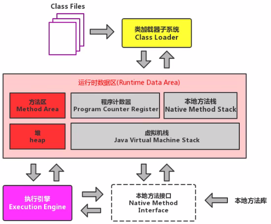


## 2、加载过程

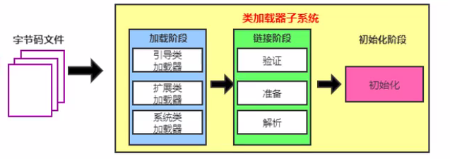

* 类加载器子系统负责从文件系统或者网络中加载 **.class** 文件，**.class** 文件在文件开头有特定的文件标识
* **Classloader** 只负责 **class** 文件的加载，至于它是否可以运行，则由 **Execution Engine**决定
* 加载的类信息存放于一块称为**==方法区==**的内存空间。除了类的信息外，方法区中还会存放运行时常量池信息，可能还包括字符串字面量和数字常量（这部分常量信息是 **Class** 文件中常量池部分的内存映射）

### 2.1 加载阶段（Loading）

1. 通过一个类的全限定名获取定义此类的二进制字节流
2. 将这个字节流所代表的静态存储结构转化为方法的运行时数据结构
3. **在内存中生成一个代表这个类的 ==java.lang.Class== 对象**，作为方法区这个类的各种数据的访问入口


### 2.2 链接阶段（Linking）

1、验证（**Verify**）

* 目的在于确保 **class** 文件的字节流中包含信息符合当前虚拟机要求，保证被加载类的正确性，不会危害虚拟机自身安全
* 主要包括四种验证：文件格式验证、元数据验证、字节码验证、符号引用验证

2、准备（**Prepare**）

* 为**==类变量==**分配内存并且**设置该类变量的默认初始值，即==零值==** 
* 这里不包含用 **final** 修饰的 **static**，因为 **final** 在编译的时候就会分配了，准备阶段会显式初始化
* 这里不会为实例变量分配初始化，类变量会分配在方法区中，而实例变量是会随着对象一起分配到 Java 堆中

3、解析（**Resolve**）

* 将常量池内的**符号引用转换为直接引用**的过程
    * 事实上，解析操作往往会伴随着 JVM 在执行完初始化之后再执行
    * **符号引用**就是用一组符号来描述所引用的目标。**符号引用**的字面量形式明确定义在《Java 虚拟机规范》的**class** 文件格式中
    * **直接引用**就是直接指向目标的指针、相对偏移量或一个间接定位到目标的句柄
* 解析动作主要针对类或接口、字段、类方法、接口方法、方法类型等。对应常量池中的
    * **CONSTANT_Class_info，CONSTANT_Fieldref_info，CONSTANT_Methodref_info** 


### 2.3 初始化（Initialization）

> 初始化阶段就是执行类构造器方法 <c1init>（）的过程

* 此方法不需定义，是 **javac** 编译器自动收集类中的所有**==类变量==**的赋值动作和**==静态代码块==**中的语句合并而来
* 构造器方法中指令按语句在源文件中出现的顺序执行
* 若该类具有父类，**JVM** 会保证子类的 <c1init>（）执行前，父类的 <c1init>（）已经执行完毕
* 虚拟机必须保证一个类的 <c1init>（）方法**在多线程下被同步加锁** 

> <c1init>（）不同于类的构造器，构造器是虚拟机视角下的<init>（）


## 3、类加载器

JVM 支持两种类型的类加载器

* 引导类加载器（**Bootstrap ClassLoader**）
* 自定义类加载器（**User - Defined ClassLoader**）
    * 从概念上来讲，自定义类加载器一般指的是程序中由开发人员自定义的一类类加载器，但是 Java 虚拟机规范却没有这么定义，而是**将所有派生于抽象类 ==Classloader== 的类加载器都划分为自定义类加载器** 


常用的类加载器有三类

1、引导类加载器（C/C++ 编写的，获取不到对象）

> Bootstrap ClassLoader

2、扩展类加载器

> Extension  ClassLoader

3、系统类加载器

> System  ClassLoader

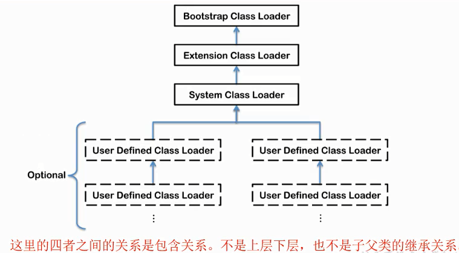


### 3.1 引导类加载器

* 也叫启动类加载器
    * 这个类加载器使用 **C/C++** 语言实现的，嵌套在 **JVM** 内部
    * 它用来加载 **Java** 的核心库（ **JAVA_HOME/jre/lib/rt.jar、resources.jar** 或 **sun.boot.class.path** 路径下的内容），用于提供 **JVM** 自身需要的类
    * 并不继承自 **Java.lang.Classloader**，没有父加载器
    * 加载扩展类和应用程序类加载器，并指定为他们的父类加载器
    * 出于安全考虑， **Bootstrap** 启动类加载器只加载包名为 **java、 javax、 sun** 等开头的类


### 3.2 扩展类加载器

* **Java** 语言编写，由 **sun.misc.Launcher$ExtClassLoader** 实现
* 派生于 **ClassLoader** 类
* 父类加载器为**启动类加载器** 

* 加载内容
    * 从 **java.ext.dirs** 系统属性所指定的目录中加载类库，或从 **JDK** 的安装目录的 **jre/lib/ext** 子目录（扩展目录）下加载类库
    * **如果用户创建的 JAR 放在此目录下，也会自动由扩展类加载器加载** 


### 3.3 系统类加载器

也叫 **应用程序类加载器（AppClassLoader）**

* 由 **Java** 语言编写，由 **sun.misc.Launcher$AppClassLoader** 实现
* 派生于 ClassLoader 类
* 父类加载器为**扩展类加载器** 
* 加载内容
    * 它负责加载环境变量 **classpath** 或系统属性 **java.class.path** 指定路径下的类库
* 该类加载是程序中默认的类加载器
    * 一般来说，**Java** 应用的类都是由它来完成加载


## 4、ClassLoader

获取 ClassLoader 的途径

1、获取当前类的 ClassLoader

> clazz.getClassLoader()

2、获取当前线程上下文的 ClassLoader

> Thread.currentThread().getContextClassLoader()

3、获取系统的 ClassLoader

> ClassLoader.getSystemClassLoader()

4、获取调用者的 ClassLoader

> DriverManager.getCallerClassLoader()


## 5、双亲委派机制

概念

* **Java** 虚拟机对 **class** 文件采用的是按需加载的方式
    * 也就是说当需要使用该类时才会将它的 **class** 文件加载到内存生成 **class** 对象
* 而且加载某个类的 **class** 文件时，**Java** 虚拟机采用的是**双亲委派模式** 
    * 即把请求交由父加载器处理，它是一种**任务委派模式** 


原理

1. **如果一个类加载器收到了类加载请求，它并不会自己先去加载，而是先把这个请求委托给父加载器去执行** 
2. 如果父类加载器还存在其父加载器，则进一步向上委托，依次递归请求最终将到达顶层的启动类加载器
3. 如果父类加载器可以完成类加载任务，就成功返回，倘若父类加载器无法完成此加载任务，子加载器才会尝试自己去加载，这就是**双亲委派模式** 


举例

* 我们自己新建一个 **java.lang.String** 类，看看是否会加载自定义的 **String** 类

自定义 **String** 类

* 在 **java.lang** 包下新建一个 **String** 类

```java
package java.lang;  // 在 java.lang 包下新建一个 String 类

public class String {
    // 看看是否会加载自定义的 String 类
    static {
    System.out.println("自定义 String 类");
    }
}
```

测试

```java
public class TestClassLoader {
    public static void main(String[] args) {
    // 看看 new 的到底是 JDK 自带的还是自定义的
    String s = new String(); // 默认值为 ""
    System.out.println("JDK 自带 String 类");
    System.out.println(s.getClass());
    }
}
```

输出结果

```java
JDK 自带 String 类
class java.lang.String
```

解释

> ​	当 new 一个 String 对象的时候，系统类加载器会将加载任务交给父加载器（扩展类加载器）来完成，同样，扩展类加载器会将加载任务交给父加载器（启动类加载器）来完成，如果不能再向下传递。当启动类加载器收到加载任务后判断是自己可以加载的类型，所以就从核心类库中加载，而不是加载自定义的类


优势

1. 避免类的重复加载
2. 保护程序安全，防止**核心 API** 被随意篡改


## 6、沙箱安全机制

> ​	自定义 String 类，但是在加载自定义 String 类的时候会率先使用引导类加载器加载，而引导类加载器在加载的过程中会先加载 JDK 自带的文件（rt.jar 包中 java.lang.String.class），报错信息说没有 main 方法，就是因为加载的是 rt.jar 包中的 String 类。这样可以保证对 Java 核心源代码的保护，这就是**==沙箱安全机制==** 


## 7、类加载细节

> 如何判断两个 class 对象是否为同一个类

1. 类的全限定类名必须一致
2. 加载这个类的 ClassLoader（指 ClassLoader 实例对象）必须相同


> 类的主动使用和被动使用

区别

* **主动使用**会进行**类的初始化**，**被动使用**不会进行初始化，只会加载

主动使用

1. 创建类的实例
2. 访问某个类或接口的静态变量，或者对该静态变量赋值
3. 调用类的静态方法
4. 反射（比如：Class.forName（"com. atguigu.Test"））
5. 初始化一个类的子类
6. Java 虚拟机启动时被明确标志为需要启动的类
7. JDK 7 提供的动态语言支持


# 三、运行时数据区

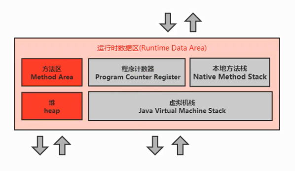


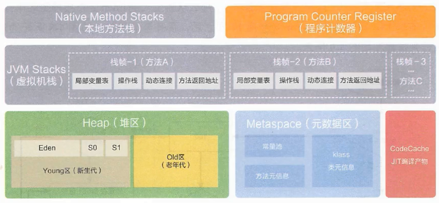


> Java 虚拟机定义了若干种程序运行期间会使用到的**运行时数据区**，其中有一些会随着虚拟机启动而创建，随着虚拟机退出而销毁。另外一些则是与线程一一对应的，这些与线程对应的数据区域会随着线程开始和结束而创建和销毁


举例：灰色的为单独线程私有的，红色的为多个线程共享的

> 每个线程：独立包括程序计数器、栈、本地栈
> 线程间共享：堆、堆外内存（永久代或元空间、代码缓存）

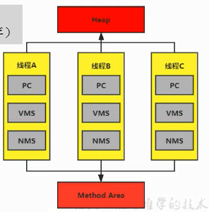


## 1、程序计数器

* 也叫 PC 寄存器

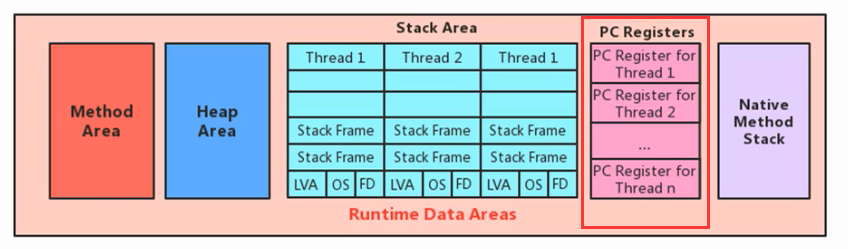

> ​	这里，并非是广义上所指的物理寄存器，或许将其翻译为 **PC 计数器（或指令计数器）**会更加贴切（也称为程序钩子），并且也不容易引起一些不必要的误会。**JVM 中的 PC 寄存器是对物理 PC 寄存器的一种抽象模拟** 


作用

> PC 寄存器用来**存储指向下一条指令的地址，也即将要执行的指令代码**。由执行引擎读取下一条指令

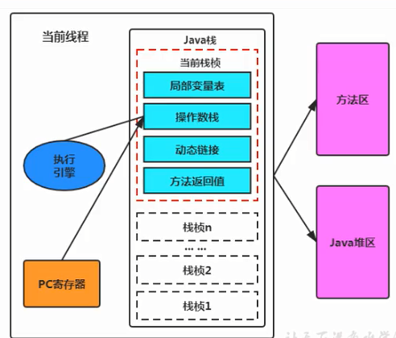

* 是一块很小的内存空间，几乎可以忽略不记。也是运行速度最快的存储区域
* 在 **JVM** 规范中，每个线程都有它自己的程序计数器，是线程私有的，生命周期与线程的生命周期保持一致
* 任何时间一个线程都只有一个方法在执行，也就是所谓的当前方法
    * 程序计数器会存储当前线程正在执行的 **Java** 方法的 **JVM** 指令地址
    * 或者如果是在执行 **native**方法，则是未指定值（ undefined）
* 它是程序控制流的指示器，分支、循环、跳转、异常处理、线程恢复等基础功能都需要依赖这个计数器来完成
* 宇节码解释器工作时就是通过改变这个计数器的值来选取下一条需要执行的字节码指令
* 它是唯一一个在 **Java** 虚拟机规范中没有规定任何 **OutOfMemoryError** 情况的区域


### 1.1 相关问题

> 使用 PC 寄存器存储字节码指令地址有什么用呢？为什么使用 PC 寄存器记录当前线程的执行地址呢？

因为 CPU 需要不停的切换各个线程，这时候切换回来以后，就得知道接着从哪开始继续执行
JVM 的字节码解释器就需要通过改变 PC 寄存器的值来明确下一条应该执行什么样的字节码指令


> PC寄存器为什么会被设定为线程私有？

​	1、我们都知道所谓的多线程在一个特定的时间段内只会执行其中某一个线程的方法，CPU 会不停地做任务切换，这样必然导致经常中断或恢复，如何保证分毫无差呢？**为了能够准确地记录各个线程正在执行的当前字节码指令地址，最好的办法自然是为每一个线程都分配一个 PC 寄存器**，这样一来各个线程之间便可以进行独立计算，从而不会出现相互干扰的情况

​	2、由于 CPU 时间片轮限制，众多线程在并发执行过程中，任何一个确定的时刻，一个处理器或者多核处理器中的一个内核，只会执行某个线程中的一条指令


## 2、虚拟机栈

> 栈是运行时的单位，而堆是存储的单位

* 栈解决程序的运行问题，即程序如何执行，或者说如何处理数据
* 堆解决的是数据存储的问题，即数据怎么放、放在哪儿


> 什么是 Java 虚拟机栈

* **Java** 虚拟机栈，早期也叫 **Java** 栈
* 每个线程在创建时都会创建一个虚拟机栈，其内部保存一个个的==**栈帧**==，对应着一次次的 **Java** 方法调用
* 是线程私有的，声明周期和线程一致

> Java 虚拟机栈的作用

* 主管 Java 程序的运行，它保存方法的局部变量、部分结果，并参与方法的调用和返回

> 栈的优点

* 栈是一种快速有效的分配存储方式，**访问速度仅次于程序计数器** 
* JVM 直接对 Java 栈的操作只有两个
    * 每个方法执行，伴随着进栈（入栈、压栈）
    * 执行结束后的出栈工作
* **对于栈来说不存在垃圾回收问题** 


### 2.1 栈的常见异常

> Java 虚拟机规范允许 Java 栈的大小是动态的或者是固定不变的

​	如果采用固定大小的 **Java** 虚拟机栈，那每一个线程的 **Java** 虚拟机栈容量可以在线程创建的时候独立选定。如果线程请求分配的栈容量超过 **Java** 虚拟机栈允许的最大容量，**Java** 虚拟机将会抛出一个 **StackOverflowError** 异常

​	如果 **Java** 虚拟机栈可以动态扩展，并且在尝试扩展的时候无法中请到足够的内存，或者在创建新的线程时没有足够的内存去创建对应的虚拟机栈，那Java虚拟机将会抛出一个 **OutOfMemoryError** 异常


### 2.2 设置栈的大小

> 我们可以使用参数 ==**-Xss**== 选项来设置线程的最大栈空间，栈的大小直接决定了函数调用的最大可达深度
>
> 单位可以是：K、M、G


* 可以用递归来检验栈的最大可达深度


### 2.3 栈的存储单位

> 每个线程都有自己的栈，栈中的数据都是以**==栈帧（ Stack frame）==**的格式存在
>
> 在这个线程上正在执行的**每个方法都各自对应一个栈帧（ stack Frame）** 
>
> 栈帧是一个内存区块，是一个数据集，维系着方法执行过程中的各种数据信息


### 2.4 栈的运行原理

* JVM 直接对 Java 栈的操作只有两个
    * 就是对栈帧的压栈和出栈，遵循 “先进后出” / “后进先出” 原则
* 在一条活动线程中，一个时间点上，只会有一个活动的栈帧
    * 即只有当前正在执行的方法的栈帧（栈顶栈帧）是有效的，这个栈帧被称为当前栈帧
    * 当前栈帧相对应的方法就是当前方法，定义这个方法的类就是当前类
* 执行引擎运行的所有字节码指令只针对当前栈帧进行操作
* 如果在该方法中调用了其他方法，对应的新的栈帧会被创建出来，放在栈的顶端，成为新的当前帧
* 不同线程中所包含的栈帧是不允许存在相互引用的
    * 即不可能在一个栈帧之中引用另外一个线程的栈帧
* 如果当前方法调用了其他方法，方法返回之际，当前栈帧会传回此方法的执行结果给前一个栈帧，接着，虚拟机会丢弃当前栈帧，使得前一个栈帧重新成为当前栈帧
* **Java** 方法有两种返回函数的方式，不管使用哪种方式，都会导致栈帧被弹出
    * 一种是正常的函数返回，使用 **return** 指令
    * 一种是抛出异常

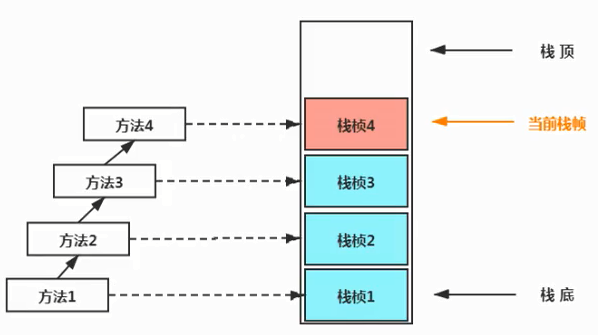


### 2.5 栈帧的结构

> * 局部变量表（Loca1 Variab1es）
> * 操作数栈（ Operand Stack）（或表达式栈）
> * 动态链接（ Dynamic Linking）（或指向运行时常量池的方法引用）
> * 方法返回地址（ Return Address）（或方法正常退出或者异常退出的定义）
> * 一些附加信息

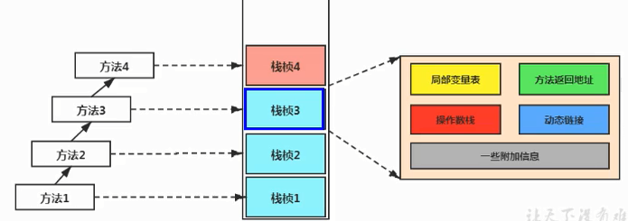

#### 2.5.1 局部变量表

> 局部变量表也被称之为局部变量数组或本地变量表

* **定义为一个字节数组，主要用于存储方法参数和定义在方法体内的局部变量** 
    * 这些数据类型包括各类基本数据类型、对象引用（ reference），以及 **returnAddress** 类型
* 由于局部变量表是建立在线程的栈上，是线程的私有数据，没有涉及共享，因此不存在数据安全问题
* **局部变量表所需的容量大小是在==编译期==确定下来的** 
    * 保存在方法的 **code** 属性的 **maximum local variables** 数据项中
    * 在方法运行期间是不会改变局部变量表的大小的


> 局部变量表的变量槽 **==slot==** 

* 局部变量表是一个数组，每一个数据单元叫一个槽

* 在局部变量表里，32 位以内的类型只占用一个 **slot**（如 **returnAddress**），64位的类型（**long** 和 **double**）占用两个 **slot** 
    * **byte、short、char** 在存储前被转换为 **int, boolean** 也被转换为 **int**，0 表示 **fa1se**，非 0 表示 **true** 
    * **long** 和 **double** 则占据两个 **slot** 
* **JVM** 会为局部变量表中的每一个 **slot** 都分配一个访问索引，通过这个素引即可成功访问到局部变量表中指定的局部变量值
* 当一个实例方法被调用的时候，它的方法参数和方法体内部定义的局部变量将会**按照顺序被复**制到局部变量表中的每一个 **slot** 上
* **如果需要访问局部变量表中一个 64 bit 的局部变量值时，只需要使用前一个索引即可** 
    * 比如：访问 **long** 或 **double** 类型变量
* 如果当前帧是由构造方法或者实例方法创建的，那么**该对象引用 this 将会存放在 index 为 0 的 slot 处**，其余的参数按照参数表顺序继续排列

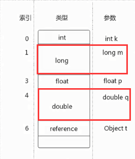

> slot 的重复利用

* 栈帧中的局部变量表中的槽位是可以重用的，如果一个局部变量过了其作用域，那么在其作用域之后申明的新的局部变量就很有可能会复用过期局部变量的槽位，从而达到节省资源的目的


> 静态变量与局部变量的对比

* 我们知道**类变量**有两次初始化的机会
    * 第一次是在 “准备”阶段，执行系统初始化，对**==类变量==**设置零值
    * 另一次则是在 “初始化” 阶段，赋予程序员在代码中定义的初始值
* 和类变量初始化不同的是，局部变量表不存在系统初始化的过程
    * 这意味着**一旦定义了局部变量则必须人为的初始化，否则无法使用** 

```java
public void test02() {
    int num;
    System.out.println(num); 
}
```

* 这样的代码是错误的，**局部变量声明时没有赋值无法使用** 


#### 2.5.2 操作数栈

> 每一个独立的栈帧中除了包含局部变量表以外，还包含一个后进先出的**操作数栈**，也可以称之为表达式栈

* 在方法执行过程中，根据字节码指令，往栈中写入数据或提取数据，即入栈（push）/ 出栈（pop）
    * 某些字节码指令将值压入操作数栈，其余的字节码指令将操作数取出栈。使用它们后再把结果压入栈
    * 比如：执行复制、交换、求和等操作

代码举例

> Java 代码

```java
public void test02() {
    byte i = 15;
    int j = 13;
    int k = i + j;
}
```

> 字节码指令

```java
 0 bipush 15
 2 istore_1
 3 bipush 13
 5 istore_2
 6 iload_1
 7 iload_2
 8 iadd
 9 istore_3
10 return
```


#### 2.5.3 栈顶缓存技术

> ​	前而提过，基于栈式架构的虚拟机所使用的零地址指令更加紧凑，但完成一项操作的时候必然需要使用更多的入栈和出栈指令，这同时也就意味着将需要更多的指令分派（ instruction dispatch ）次数和内存读 / 写次数
>
> ​	由于操作数是存储在内存中的，因此频繁地执行内存读/写操作必然会影响执行速度。为了解决这个问题 HotSpot JVM 的设计者们提出了栈顶缓存（ToS，Top-of- Stack Cashing）技术，将栈顶元素全部**缓存在物理 CPU 的寄存器中**，以此降低对内存的读/写次数，提升执行引擎的执行效率


#### 2.5.4 动态链接

* 指向运行时常量池的方法引用

> 每一个栈帧内部都包含一个指向==**运行时常量池**==中==**该栈帧所属方法**==的引用
>
> 包含这个引用的目的就是为了支持当前方法的代码能够实现动态链接（ Dynamic Linking ）
>
> 比如：**invokedynamic** 指令

* 在 **Java** 源文件被编译到字节码文件中时，所有的变量和方法引用都作为**符号引用**保存在 **class** 文件的常量池里
* 比如：描述一个方法调用了另外的其他方法时，就是通过常量池中指向方法的符号引用来表示的，那么动态链接的作用就是为了将这些符号引用转换为调用方法的直接引用

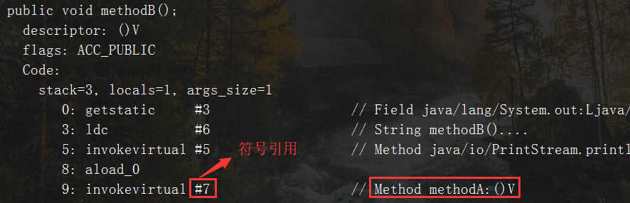


#### 2.5.5 方法的调用

* 绑定

> 绑定是一个**==字段、方法或者类==**在符号引用**==被替换为直接引用==**的过程，这仅仅发生一次


* 静态链接

> ​	当一个字节码文件被装载进 JVM 内部时，如果被调用的目标方法**==在编译期可知且运行期保持不变==**，这种情况下将调用方法的符号引用转换为直接引用的过程称之为静态链接

* 早期绑定

> ​	早期绑定就是指**==被调用的目标方法如果在编译期可知，且运行期保持不变==**时，即可将这个方法与所属的类型进行绑定，这样一来，由于明确了被调用的目标方法究竟是哪一个，囚此也就可以使用静态链接的方式将符号引用转换为直接引用


* 动态链接

> ​	如果被调用的方法**==在编译期无法被确定下来==**，也就是说，只能够在**==程序运行期==**将调用方法的符号引用转换为直接引用，由于这种引用转换过程具备动态性，因此也就被称之为动态链接

* 晚期绑定

> ​	如果被调用的方法**==在编译期无法被确定==**下来，只能够在程序运行期根据实际的类型绑定相关的方法，这种绑定方式也就被称之为晚期绑定


* 非虚方法和虚方法

> 如果方法在编译期就确定了具体的调用版本，这个版木在运行时是不可变的，这样的方法称为**非虚方法** 
>
> 如：静态(static)方法，私有(private)方法，final 方法，实例构造器，父类方法
>
> 其他方法称为**虚方法** 


* 方法的调用指令

> **invokestatic**：调用诤态方法，解析阶段确定唯一方法版本
>
> **invokespecial**：调用<init>方法、私有方法、父类方法，解析阶段确定唯一方法版本
>
> **invokevirtual**：调用所有虚方法
>
> **invokeinterface**：调用接口方法
>
> **invokedynamic**：动态解析出需要调用的方法，然后执行


#### 2.5.6 方法返回地址

> 存放调用该方法的 pc 寄存器的值

一个方法的结束，有两种方式：

* 正常执行完成

* 出现未处理的异常，非正常退出

​	无论通过哪种方式退出，在方法退出后都返回到该方法被调用的位置。方法正常退出时，调用者的 pc 计数器的值作为返回地址，即调用该方法的指令的下一条指令的地址。而通过异常退出的，返回地址是要通过异常表来确定，栈帧中一般不会保存这部分信息


## 3、本地方法接口

> 什么是本地方法？

简单地讲，一个 **Native Method** 就是一个 Java 调用**非 Java 代码**的接口

一个 **Native Method** 是这样一个 Java 方法

* 该方法的实现**由非 Java 语言实现**，比如C

​    这个特征并非 Java 所特有，很多其它的编程语言都有这一机制，比如在C++中，你可以用 extern"c" 告知 c++ 编译器去调用一个 c 的函数

> ​	在定义一个 **native method** 时，并**不提供实现体**（有些像定义一个**Java interface**），因为其实现体是由**非 Java 语言在外面实现的** 

本地接囗的作用是融合不同的编程语言为 Java 所用，它的初衷是融合 C/C++ 程序


举例

```java
public native void method();
```

* 由 **native** 关键字修饰，没有方法体，不能与 **abstract** 连用


### 1、为什么要使用本地方法

> Java 使用起来非常方便，但有些层次的任务用 Java 实现起来不容易，或者我们对程序的效率很在意时，问题就来了


#### 1.1 与 Java 外部环境交互

**有时 Java 应用需要与 Java 外面的环境交互，这是本地方法存在的主要原因** 

你可以想想 **Java** 需要与一些底层系统，如操作系统或某些硬件交换信息时的情况

本地方法正是这样一种交流机制

* 它为我们提供了一个非常简洁的接口而且我们无需去了解 **Java** 应用之外的繁琐的细节


#### 1.2 与操作系统进行交互

​	**JVM** 支持着 **Java** 语言本身和运行时库，它是 **Java** 程序赖以生存的平台，它由一个解释器（解释字节码）和一些连接到本地代码的库组成

​	然而不管怎样，它毕竟不是一个完整的系统，它经常依赖于一些底层系统的支持。这些底层系统常常是强大的操作系统通过使用本地方法，我们得以用 **Java** 实现了 **jre** 的与底层系统的交互，甚至 **JVM** 的一些部分就是用 C 写的，还有，如果我们要使用一些 **Java** 语言本身没有提供封装的操作系统的特性时，我们也需要使用本地方法


#### 1.3 Sun's Java

**Sun** 的解释器是用 C 实现的，这使得它能像一些普通的 C 一样与外部交互

​	**JRE** 大部分是用 **Java** 实现的，它也通过一些本地方法与外界交互。例如：类 **java.lang**， **Thread** 的 **setpriority()** 方法是用 **Java** 实现的，但是它实现调用的是该类里的本地方法 **setpriority0()**。这个本地方法是用 C 实现的，并被植入 **JVM** 内部，在 **Windows95** 的平台上，这个本地方法最终将调用 **Win32 Setpriority() API**。这是一个本地方法的具体实现由 **JVM** 直接提供，更多的情况是本地方法由外部的动态链接库提供，然后被 **JVM** 调用


## 4、本地方法栈

* **Java** 虚拟机栈用于管理 **Java**方法的调用，而本地方法栈用于管理本地方法的调用
* 本地方法栈，也是线程私有的
* 允许被实现成固定或者是可动态扩展的内存大小
    * 如果线程请求分配的栈容量超过本地方法栈允许的最大容量，**Java** 虚拟机将会抛出一个 **StackOverflowError** 异常
    * 如果本地方法栈可以动态扩展，并且在尝试扩展的时候无法申请到足够的内存，或者在创建新的线程时没有足够的内存去创建对应的本地方法栈，那么 **Java** 虚拟机将会抛出一个 **OutOfMemoryError** 异常
* 本地方法是使用 C 语言实现的
* 它的具体做法是 **Native Method Stack** 中登记 **native**方法，在 **Excution Engine** 执行时加载本地方法库


> 当某个线程调用一个本地方法时，它就进入了一个全新的并且不再受虚拟机限制的世界。它和虚拟机拥有同样的权限

* 本地方法可以通过本地方法接口来访问虚拟机内部的运行时数据区

* 它甚至可以直接使用本地处理器中的寄存器

* 可以直接从本地内存的堆中分配任意数量的内存


## 5、堆

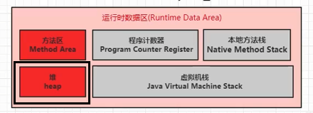

### 5.1 堆的核心概述

* 一个 **JVM** 实例只存在一个堆内存，堆也是 Java 内存管理的核心区域
* **Java** 堆区在 **JVM** 启动的时候即被创建，其空间大小也就确定了。是 **JVM** 管理的最大一块内存空间
    * 堆内存的大小是可以调节的
* 《 **Java** 虚拟机规范》规定，堆可以处于**物理上不连续**的内存空间中，但在**逻辑上**它应该被视为**连续**的
* 所有的线程共享 **Java** 堆，在这里还可以划分线程私有的缓冲区
* 《**Java**虚拟机规范》中对 **Java** 堆的描述是：所有的**对象实例、数组**都应当在运行时分配在堆上
    * 从实际使用角度来看：“几乎” 所有的对象实例都在堆分配内存，可能还有一部分在栈中分配内存
* 数组和对象可能永远不会存储在栈上
    * 因为栈帧中保存引用，这个引用指向对象或者数组在堆中的位置
* 在方法结束后，堆中的对象不会马上被移除，仅仅在垃圾收集的时候才会被移除
* 堆是 GC（ Garbage Collection，垃圾收集器）执行垃圾回收的重点区域


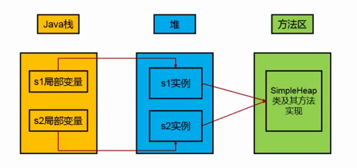


### 5.2 堆内存的细分

现代垃圾收集器大部分都基于分代收集理论设计

> **Java 7** 及之前堆内存==**逻辑上**==分为三部分：新生区 + 养老区 + **==永久区==** 

> **Java 8** 之后堆内存==**逻辑上**==分为三部分：新生区 + 养老区 + **==元空间==** 

* 新生区又被分为了 **Eden** 区和 **Survivor** 区


### 5.3 设置堆空间的大小

> -Xms：堆空间的起始内存，等价于 -XX:InitialHeapsize
>
> -Xmx：堆空间的最大内存，等价于 -XX:MaxHeapsize
>
> 默认情况下，
>
> ​	初始内存大小：物理电脑内存大小 / 64
>
> ​	最大内存大小：物理电脑内存大小 / 4

* 一旦堆区中的内存大小超过 **"-Xmx"** 所指定的最大内存时，将会抛出 **OutOfMemoryError** 异常
* 通常会将 -Xms 和 -Xmx 两个参数**设置相同的值**，其目的是为了能够在 Java 垃圾回收机制清理完堆区后不需要重新分隔计算堆区的大小，从而提高性能

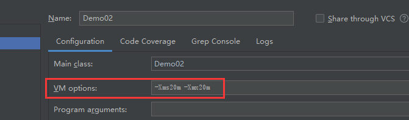


### 5.4 年轻代与老年代

存储在 **JVM** 中的 **Java** 对象可以被划分为两类

* 一类是生命周期较短的瞬时对象，这类对象的创建和消亡都非常迅速
* 一类对象的生命周期却非常长，在某些极端的情况下还能够与 **JVM** 的生命周期保持一致

**Java** 堆区进一步细分的话，可以划分为**年轻代（ YoungGen）和老年代（ oldGen）** 

* 其中年轻代又可以划分为 **Eden** 空间、 **Survivor0** 空间和 **Survivor1** 空间（有时也叫做 from 区、to 区）

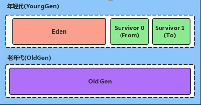


配置新生代与老年代在堆结构的占比（一般不需要调整）

* 默认 **-XX:NewRatio=2**，表示新生代占1，老年代占2，新生代占整个堆的 1/3
* 可以修改 **-XX:NewRatio=4**，表示新生代占 1，老年代占 4，新生代占整个堆的 1/5


配置新生代中的各区域的比例

* 默认 **Eden** 空间和另外两个 **Survivor** 空间所占的比例是 **8 : 1 : 1**
    * 实际过程中默认有个自适应策略，比例可能不对，需要手动设置参数
* 可以通过选项 **“-XX:SurvivorRatio”** 调整这个空间比例
    * 例：**-XX:SurvivorRatio=8**


* **Eden** 区域介绍

> 1、几乎所有的 Java 对象都是在 Eden 区被 new 出来的
>
> 2、绝大部分的 Java 对象的销毁都在新生代进行了
> 	IBM 公司的专门研究表明，新生代中 80% 的对象都是“朝生夕死”的
>
> 3、可以使用选项 "-Xmn" 设置新生代最大内存大小
> 	这个参数一般使用默认值就可以了


### 5.5 对象分配过程

1、**new** 的对象先放伊甸园区，此区有大小限制

2、当 **Eden** 的空间填满时，程序又需要创建对象，**JVM** 的垃圾回收器将对 **Eden** 区进行垃圾回收（ **Minor gc**），将 **Eden** 区中的不再被其他对象所引用的对象进行销毁。再加载新的对象放到 **Eden** 区

3、然后将 **Eden** 中的剩余对象移动到 **Survivor0** 区

4、如果再次触发垃圾回收，此时上次幸存下来的放到 **Survivor==0==** 区的，如果没有回收，就会放到 **Survivor==1==** 区

5、如果再次经历垃圾回收，此时会重新放回 **Survivor0** 区，接着再去 **Survivor1** 区

6、啥时候能去养老区呢？**由 GC 次数决定，可以设置次数。默认是15次** 

* 可以设置参数：**-XX:MaxTenuringThreshold=**<N> 进行设置

7、在养老区，相对悠闲。当养老区内存不足时，再次触发 **GC（Major Go）**，进行养老区的内存清理

8、若养老区执行了 Major GC 之后发现依然无法进行对象的保存，就会产生 **OOM** 异常


* 图解

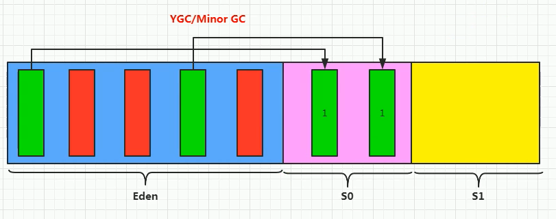

> 当 **Eden** 区域满了之后，进行垃圾回收（Minor GC），清除不需要的对象的引用，将剩余对象放到 **s0** 区域


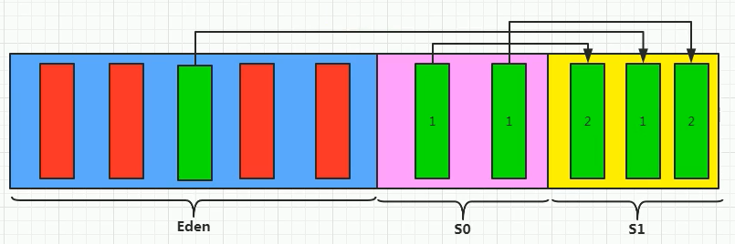

> 当 **Eden** 区域又满了之后，进行垃圾回收（Minor  GC），这时候 **s0** 区域的也要进行判断，还存在的对象全部放到 **s2** 区域
>
> 每进行一次垃圾回收，幸存对象不断在 s0 和 s1 区域变换，变换一次计数加 1


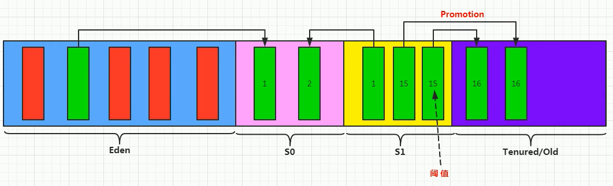

> 当 GC 次数到达 15（默认）后，还存在的对象被移到老年区

可以修改达到送往老年区的条件（计数次数）

* 可以设置参数：**-XX:MaxTenuringThreshold=**<N> 进行设置


* 完整流程图

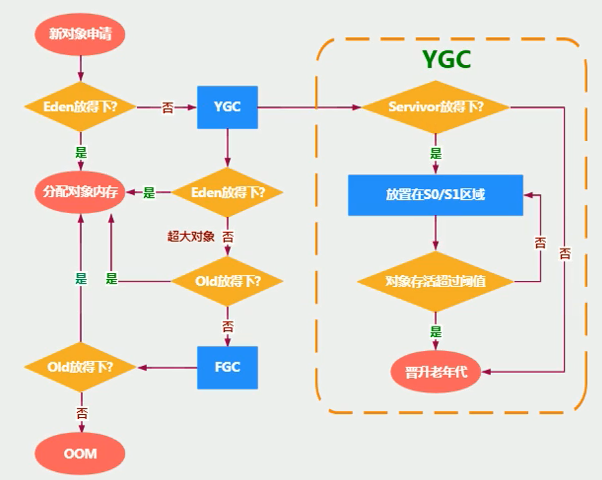


**==Eden 区满了之后会触发垃圾回收，但 Survivor 区满了之后不会触发垃圾回收==** 


#### 5.5.1 垃圾收集算法介绍

> ​	JVM 在进行 GC 时，并非每次都对三个内存（新生代、老年代：方法区）区域一起回收的，大部分时候回收的都是指新生代

针对 **HotSpot JVM** 的实现，它里面的 **GC** 按照回收区域又分为两大种类型

* **部分收集、整堆收集** 


> 部分收集：不是完整收集整个 **Java** 堆的垃圾的收集

* 新生代收集（ Minor GC/ Young GC）：只是新生代的垃圾收集
* 老年代收集（ Major Gc/Old Gc）：只是老年代的垃圾收集
    * 目前，只有 **CMS GC** 会有单独收集老年代的行为
    * 注意，很多时候 **Major Gc** 会和 **Full Gc**混淆使用，需要具体分辨是**老年代回收**还是**整堆回收** 
* 混合收集（ Mixed GC）：收集整个新生代以及部分老年代的垃圾收集
    * 目前，只有 **G1 GC** 会有这种行为

> 整堆收集（**Full  GC**）：收集整个 **==Java 堆和方法区==**的垃圾收集


#### 5.5.2 Minor GC

* 触发条件

> ​	当年轻代空间不足时，就会触发 **Minor GC**，这里的年轻代满指的是 **Eden** 区满， **Survivor** 区满不会引发GC（每次 Minor GC 会清理年轻代的内存）
>
> 因为 **Java** 对象大多都具备朝生夕灭的特性，所以 **==Minor GC 非常频繁==**，一般回收速度也比较快
>
> **Minor GC** 会引发 **STW（Stop the World）**，暂停其它用户的线程，等垃圾回收结束，用户线程才恢复运行


#### 5.5.3 Major GC

* 触发条件

> 指发生在老年代的 GC，对象从老年代消失时，我们说 “Major GC” 或 “Full Gc” 发生了
>
> ​	出现了 **Major GC**，经常会伴随至少一次的 **Minor GC**（并非绝对的，在 Parallel Scavenge 收集器的收集策略里就有直接进行 Major GC 的策略选择过程），也就是在老年代空间不足时，会先尝试触发 **Minor GC**，如果之后空间还不足，则触发 **Major GC** 
> 
>**Major GC** 的速度一般会**比 Minor GC 慢 10 倍以上**，STW 的时间更长
> 
>如果 **Major GC** 后，内存还不足，就报 **OOM** 了


#### 5.5.4 Full GC

* 触发机制：触发 **Full  GC** 执行的情况有如下五种

> 1、调用 **System.gc()** 时，系统建议执行 **Full  GC**，但是不是必然执行
>
> 2、老年代空间不足
>
> 3、方法区空间不足
>
> 4、通过 **Minor GC** 后进入老年代的平均大小大于老年代的可用内存
>
> 5、由 **Eden** 区、 **survivor space0（ From Space）**区向 **survivor space1（To Space）**区复制时，对象大小大于 **To Space** 可用内存，则把该对象转存到老年代，且老年代的可用内存小于该对象大小


#### 5.5.5 内存分配策略

* 优先分配到 **Eden** 区
* **==大对象==直接分配到老年代** 
    * 尽量避免程序中出现过多的大对象
* 长期存活的对象分配到老年代
* 动态对象年龄判断
    * 如果 **Survivor** 区中相同年龄的所有对象大小的总和大于 **Survivor** 空间的一半，则年龄大于或等于该年龄的对象可以直接进入老年代，无须等到 **MaxTenuringThreshold** 中要求的年龄
* 空间分配担保
    * **-XX:HandlepromotionFailure** 


#### 5.5.6 为对象分配内存：TLAB

> 为什么有 **TLAB（Thread Local Allocation Buffer）**

* 堆区是线程共享区域，任何线程都可以访问到堆区中的共享数据
* 由于对象实例的创建在 JVM 中非常频繁，因此在并发环境下从堆区中划分内存空间是线程不安全的
* 为避免多个线程操作同一地址，需要使用加锁等机制，进而影响分配速度


> 什么是 **TLAB**

* 从内存模型而不是垃圾收集的角度，对 **Eden** 区域继续进行划分，**JVM 为每个线程分配了一个私有缓存区域**，它包含在 **Eden** 空间内
* 多线程同时分配内存时，使用 **TLAB** 可以避免一系列的非线程安全问题，同时还能够提升内存分配的吞吐量，因此我们**可以将这种内存分配方式称之为快速分配策略** 
* 据我所知所有 **OpenJDK** 衍生出来的 **JVM** 都提供了 **TLAB** 的设计

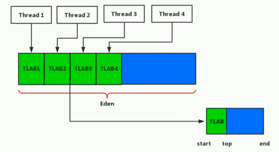


> **TLAB** 的说明

* 尽管不是所有的对象实例都能够在 **TLAB** 中成功分配内存，但 **JVM** 确实是将 **TLAB** 作为内存分配的首选
* 在程序中，开发人员可以通过选项 `-xx:UseTLAB` 设置是否开启 **TLAB** 空间
* **默认情况下，TLAB 的空间非常小，仅占整个 Eden 区域的 1%** 
    * 可以通过选项`-XX:TLABWasteTargetPercent` 设置 TLAB 空间所占用 Eden 空间的百分比大小
* 一旦对象在 **TLAB** 空间分配内存失败时，**JVM** 就会尝试着通过使用加锁机制确保数据操作的原子性，从而直接在**Eden** 空间中分配内存

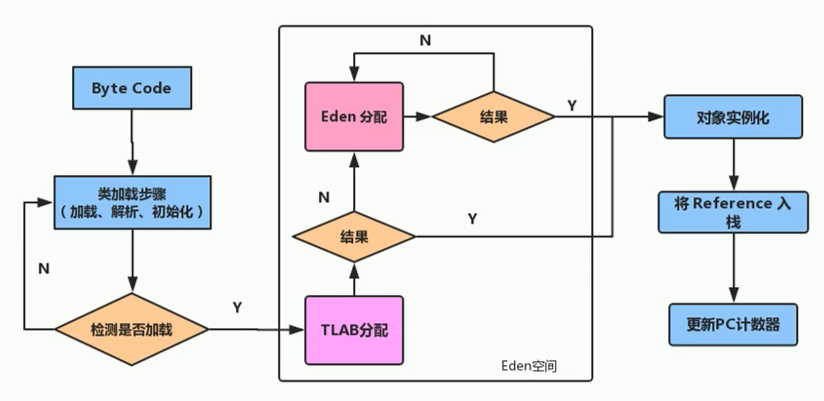


### 5.6 常用堆空间参数设置

> -XX:+PrintFlagsInitial：查看所有的参数的默认初始值

> -XX:PrintFlagsFinal：查看所有的参数的最终值（可能会存在修改，不再是初始值）

* 查看具体某个参数的值（命令行）
    * **jps**：查看运行中的进程（Java）
    * **jinfo  -flag**  参数名  进程ID

> -Xms：初始堆空间内存（默认为物理内存的 1/64）

> -Xmx：最大堆空间内存（默认为物理内存的1/4）

> -Xmn：设置新生代的大小（初始值及最大值）

> -XX:NewRatio：配置新生代与老年代在堆结构的占比

> -XX:SurvivorRatio：设置新生代中 Eden 和 s0/s1 空间的比例

> -XX:MaxTenuringThreshold：设置新生代垃圾的最大年龄

> -XX:+PrintGCDetails：输出详细的 GC 处理日志
> 	打印 GC 简要信息：-XX:+PrintGC、-verbose:gc


> -XX:+DoEscapeAnalysis：显式开启逃逸分析
> -XX:+PrintEscapeAnalysis：查看逃逸分析的筛选结果


> -XX:HandlePromotionFailure：是否设置**空间分配担保**

解释

在发生 **Minor GC** 之前，虚拟机会检查老年代**最大可用的连续空间是否大于新生代所有对象的总空间**，如果大于，则此次 **Minor GC** 是安全的，如果小于，则虚拟机会查看 **-XX:HandlePromotionFailure** 设置值是否允许担保失败

* 如果 **HandlePromotionFailure=true**，那么会继续检查老年代最大可用连续空间是否大于历次晋升到老年代的对象的平均大小
    * 如果大于，则尝试进行一次 **Minor GC**，但这次 **Minor GC** 依然是有风险的
    * 如果小于，则改为进行一次 **Full GC** 
* 如果 **HandlepromotionFailure=fa1se**，则改为进行一次 **Full GC** 

> ​	在 **JDK 6 Update24（JDK7）**之后， **HandlePromotionFailure** 参数不会再影响到虚拟机的空间分配担保策略，虽然源码中还定义了**Handlepromotionfailure** 参数，但是在代码中已经不会再使用它
>
> **JDK6 Update 24（JDK7）**之后的规则变为：
> 	只要老年代的连续空间大于新生代对象总大小或者历次晋升的平均大小就会进行 **Minor GC**，否则将进行 **Full GC** 


### 5.7 逃逸分析

​	在《深入理解 Java 虛拟机》中关于 Java 堆内存有这样一段描述随着 **JIT** 编译期的发展与**==逃逸分析技术==**逐渐成熟，**==栈上分配、标量替换优化技术==**将会导致一些微妙的变化，所有的对象都分配到堆上也渐渐变得不那么“绝对” 了

​	在 Java 虚拟机中，对象是在 Java 堆中分配内存的，这是一个普遍的常识。但是，有种特殊情况，那就是**如果经过逃逸分析（ Escape Analysis）后发现，一个对象并没有逃逸出方法的话，那么就可能被优化成栈上分配**。这样就无需在堆上分配内存，也无须进行垃圾回收了。这也是最常见的堆外存储技术

​	此外，前面提到的基于 **Open JDK** 深度定制的 **Taobao VM**，其中创新的 **GCIH（GC invisible heap）技术**实现 off-heap，将生命周期较长的 Java 对象从 heap 中移至 heap 外，并且 GC 不能管理 GCIH 内部的 Java 对象，以此达到降低 GC 的回收频率和提升 GC 的回收效率的目的


> 逃逸分析

* 将堆上的对象分配到栈，需要使用逃逸分析手段，这是一种可以有效减少 Java 程序中同步负载和内存堆分配压力的跨函数全局数据流分析算法
* 通过逃逸分析， **Java HotSpot 编译器**能够分析出一个新的对象的引用的使用范围从而决定是否要将这个对象分配到堆上
* 逃逸分析的基本行为就是分析对象动态作用域
    * 当一个对象在方法中被定义后，对象只在方法内部使用，则认为没有发生逃逸
    * 当一个对象在方法中被定义后，它被外部方法所引用，则认为发生逃逸。例如作为调用参数传递到其他地方


> 利用逃逸分析来优化代码

一、栈上分配
	将堆分配转化为栈分配。如果一个对象在子程序中被分配要使指向该对象的指针永远不会逃逸，对象可能是栈分配的候选，而不是堆分配

> ​	**JIT** 编译器在编译期间根据逃逸分析的结果，发现如果一个对象并没有逃逸出方法的话，就可能被优化成栈上分配。分配完成后，继续在调用栈内执行，最后线程结束，栈空间被回收，局部变量对象也被回收。这样就无须进行垃圾回收了
>
> **==尽量使用局部变量==** 

```java
// -Xms256m -Xmx256m -XX:+DoEscapeAnalysis -XX:+PrintGCDetails
public class JVM {
    public static void main(String[] args) {
    long start = System.currentTimeMillis();

    for (int i = 0; i < 1000000; i++) {
        alloc();
    }

    long end = System.currentTimeMillis();
    System.out.println("花费时间：" + (end - start) + "ms");

    try {
        Thread.sleep(100000);
    } catch (InterruptedException e) {
        e.printStackTrace();
    }
    }

    public static void alloc() {
    User user = new User();
    }

    static class User {

    }
}
```


二、同步省略

> 如果一个对象被发现只能从一个线程被访问到，那么对于这对象的操作可以不考虑同步

​	线程同步的代价是相当高的，同步的后果是降低并发性和性能。在动态编译同步块的时候，**JIT** 编译器可以**==借助逃逸分析来判断同步块所使用的锁对象是否只能够被一个线程访问而没有被发布到其他线程==**。如果没有，那么 **JIT** 编译器在编译这个同步块的时候就会取消对这部分代码的同步。这样就能大大提高并发性和性能。这个取消同步的过程就叫同步省略，也叫锁消除


三、分离对象或标量替换
	有的对象可能不需要作为一个连续的内存结构存在也可以被访问到，那么对象的部分（或全部）可以不存储在内存，而是存储在 CPU 寄存器中

> **标量**（ Scalar）是指一个无法再分解成更小的数据的数据。**Java中的原始数据类型就是标量** 
>
> ​	相对的，那些还可以分解的数据叫做聚合量（ Aggregate），Java 中的对象就是聚合量，因为他可以分解成其他聚合量和标量。
>
> ​	在 **JIT** 阶段，如果经过逃逸分析，发现一个对象不会被外界访问的话，那么经过 **JIT** 优化，就会把这个对象拆解成若干个其中包含的若干个成员变量来代替。这个过程就是标量替换


```java
public static void alloc() {
    User user = new User();
    System.out.println(user.x + user.y);
}

static class User {
    private int x;
    private int y;
}
```

* 以上代码可以替换为

```java
public static void alloc() {
    int x,y;
    System.out.println(x + y);
}
```

​	可以看到， User 这个聚合量经过逃逸分析后，发现他并没有逃逸，就被替换成两个标量了。**那么标量替换有什么好处呢？就是可以大大减少堆内存的占用**。因为一旦不需要创建对象了，那么就不再需要分配堆内存了。

标量替换为栈上分配提供了很好的基础

> -XX:+EliminateAllocations：开启标量替换（默认是开启的）

```java
// -Xms256m -Xmx256m -XX:+DoEscapeAnalysis -XX:+PrintGCDetails -XX:+EliminateAllocations
public class JVM {
    public static void main(String[] args) {
    long start = System.currentTimeMillis();

    for (int i = 0; i < 1000000; i++) {
        alloc();
    }

    long end = System.currentTimeMillis();
    System.out.println("花费时间：" + (end - start) + "ms");

    try {
        Thread.sleep(100000);
    } catch (InterruptedException e) {
        e.printStackTrace();
    }
    }

    public static void alloc() {
    User user = new User();
    user.id = 1;
    user.name = "TFC";
    }

    static class User {
    private int id;
    private String name;
    }
}
```


#### 5.7.1 逃逸分析小结

* 注意：逃逸分析只能在 **Server** 模式下使用（默认的）

> **-Server**：启动 **Server** 模式，因为在 **Server** 模式下，才可以启用逃逸分析

​	1、关于逃逸分析的论文在1999年就已经发表了，但直到 JDK1.6才有实现，而且这项技术到如今也并不是十分成熟的。其根本原因就是==**无法保证逃逸分析的性能消耗一定能高于他的消耗**==。虽然经过逃逸分析可以做标量替换、栈上分配、和锁消除。但是逃逸分析自身也是需要进行一系列复杂的分析，这其实也是一个相对耗时的操作。

​	2、一个极端的例子，**就是经过逃逸分析之后，发现没有一个对象是不逃逸的。那这个逃逸分析的过程就白白浪费了** 

​	3、虽然这项技术并不十分成熟，但是它也是即时编译器优化技术中一个十分重要的手段

​	4、注意到有一些观点，认为通过逃逸分析，**JVM** 会在栈上分配那些不会逃逸的对象，这在理论上是可行的，但是取决于 JVM 设计者的选择。据我所知， **目前 Oracle HotSpot JVM** 中并未这么做，这一点在逃逸分析相关的文档里已经说明，所以可以明确所有的对象实例都是创建在堆上


## 6、方法区

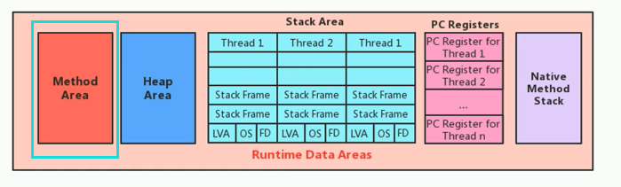


### 6.1 栈、堆、方法区的交互关系

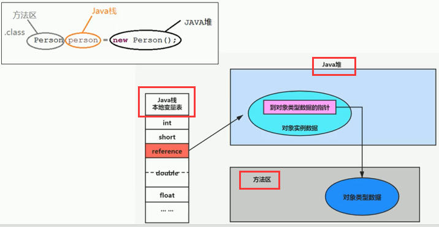


### 6.2 方法区的理解

* 官方文档解释

​	**Java 虚拟机具有一个在所有 Java 虚拟机线程之间共享的方法区域**。该方法区域类似于常规语言的编译代码的存储区域，或者类似于操作系统过程中的“文本”段。它存储每个类的结构，例如运行时常量池，字段和方法数据，以及方法和构造函数的代码，包括用于类和实例初始化以及接口初始化的特殊方法

​	**方法区域是在虚拟机启动时创建的**。尽管方法区**==在逻辑上是堆的一部分==**，但简单的实现可以选择不进行垃圾回收或压缩。该规范没有规定方法区域的位置或用于管理已编译代码的策略。方法区域可以是固定大小的，或者可以根据计算的需要进行扩展，如果不需要更大的方法区域，则可以缩小。**方法区域的内存不必是连续的**。

​	**==方法区是独立于 Java 堆空间的一块内存空间==**

​	**Java** 虚拟机提供对方法区域初始大小的控制，以及在方法区域大小可变的情况下，可以控制最大和最小方法区域大小，如果无法提供方法区域中的内存来满足分配请求，则 **Java** 虚拟机将抛出一个 **OutOfMemoryError** 


### 6.3 方法区的演进

* 针对的是官方虚拟机 **HotSpot** 

​	1、在 JDK7 及以前，习惯上把方法区称为**永久代**，JDK8 开始，使用**元空间**取代了永久代

​	2、而到了 JDK8，终于完全废弃了永久代的概念，改用与 JRockit、J9 一样在本地实现的元空间（ Metaspace）来代替

​	3、元空间的本质和永久代类似，都是对 JVM 规范中方法区的实现。不过元空间与永久代最大的区别在于：**元空间不在虚拟机设置的内存中，而是使用本地内存** 

​	4、永久代、元空间二者并不只是名字变了，内部结构也调整了

​	5、根据《Java虚拟机规范》的规定，如果方法区无法满足新的内存分配需求时，将抛出 OOM 异常


### 6.4 方法区大小与 OOM

> 方法区的大小不必是固定的，JVM 可以根据应用的需要动态调整


**JDK7**及以前：

通过 **-XX:PermSize** 来设置永久代初始分配空间。默认值是 **20.75M** 
**-XX:MaxPermsize** 来设定永久代最大可分配空间。32 位机器默认是 64M，64 位机器默认是 82M

**JDK8**及以后

​	1、元数据区大小可以使用参数 **-XX:MetaspaceSize** 和 **-XX:MaxMetaspaceSize** 指定替代上述原有的两个参数

​	2、默认值依赖于平台。 **windows**下，**-XX:MetaspaceSize** 是 21M，**-XX:MaxMetaspaceSize** 的值是 -1，即没有限制

​	3、与永久代不同，如果不指定大小，默认情况下，虚拟机会耗尽所有的可用系统内存。如果元数据区发生溢出，虚拟机一样会抛出异常 **OutofMemoryError:Metaspace** 

​	4、**-XX:MetaspaceSize**：设置初始的元空间大小。对于一个 64 位的服务器端 JVM 来说，其默认的 -XX:Metaspace Size 值为 21MB。这就是**初始的高水位线**，一旦触及这个水位线，**Full GC** 将会被触发并卸载没用的类（即这些类对应的类加载器不再存活）然后这个高水位线将会重置。**新的高水位线的值取决于 GC 后释放了多少元空间**。如果释放的空间不足，那么在不超过 **MaxMetaspacesize** 时，适当提高该值。如果释放空间过多，则适当降低该值

​	5、如果初始的高水位线过低，上述高水位线调整情况会发生很多次。通过垃圾回器的日志可以观察到 **Full GC** 多次调用。为了避免频繁地 **Full  GC**，建议将 **-XX:MetaspaceSize** 设置为一个相对较高的值


### 6.5 方法区的内部结构

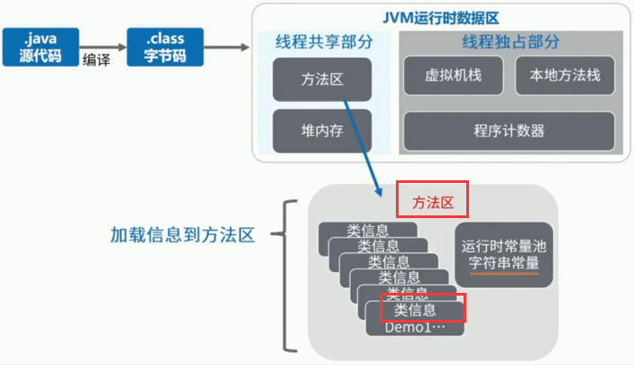


《深入理解Java虚拟机》书中对方法区（ Method area）存储内容描述如下：

> 它用于存储已被虛拟机加载的**==类型信息、常量、静态变量、即时编译器编译后的代码缓存==**等


#### 6.5.1 类型信息

对每个加载的类型 (类 **Class**、接口 **Interface**、枚举 **Enum**、注解 **Annotation**)，JVM 必须在方法区中存储以下类型信息

1、这个类型的完整有效名称（全名=包名+类名）

2、这个类型直接父类的完整有效名（对于 Interface 或是 java.lang.Object，都没有父类）

3、这个类型的修饰符（ public, abstract,final 的某个子集）

4、这个类型直接接口的一个有序列表


#### 6.5.2 域信息

1、JVM 必须在方法区中保存类型的所有**域的相关信息**以及域的**声明顺序** 

2、域的相关信息包括：域名称、域类型、域修饰符（public, private, protected, static, final, volatile, transient 的某个子集）


#### 6.5.3 方法信息

JVM 必须保存所有方法的以下信息，同域信息一样包括声明顺序

1、方法名称、方法的返回类型、方法参数的数量和类型（按顺序）

2、方法的修饰符（ public, private, protected, static,fina1，synchronized, native, abstract的一个子集）

3、方法的字节码（ bytecodes）、操作数栈、局部变量表及大小（ abstract 和 native 方法除外）

4、异常表（ abstract 和 native 方法除外）
	每个异常处理的开始位置、结束位置、代码处理在程序计数器中的偏移地址、被捕获的异常类的常量池索引


#### 6.5.4 运行时常量池

* 运行时常量池和常量池

1、**==方法区==**内部包含了**运行时常量池** 

2、**==字节码文件==**内部包含了**常量池** 

3、要弄清楚方法区，需要理解清楚 **ClassFile**，因为加载类的信息都在方法区

4、要弄清楚方法区的运行时常量池，需要理解清楚 **ClassFile** 中的常量池


* 常量池

> ​	一个有效的字节码文件中除了包含类的版本信息、字段、方法以及接口等描述信息外，还包含一项信息那就是**常量池表，常量池表包含各种字面量和对类型、域、方法的==符号引用==** 


> **==常量池==**的作用

​	一个 Java 源文件中的类、接口，编译后产生一个字节码文件。而 Java 中的字节码需要数据支持，**通常这种数据会很大以至于不能直接存到字节码里，换另一种方式，可以存到常量池**，**==这个字节码包含了指向常量池的引用==**。在动态链接的时候会用到运行时常量池

常量池，可以看做是一张表，虚拟机指令根据这张常量表找到要执行的类名、方法名、参数类型、字面量等类型

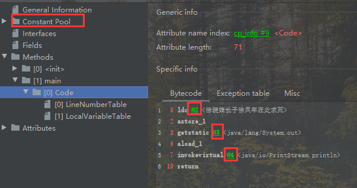


* 运行时常量池

​	1、**运行时常量池**（ Runtime Constant Pool）是**方法区**的一部分

​	2、常量池表是 **class** 文件的一部分，用于存放编译期生成的各种字面量与符号引用，这部分内容将**在类加载后存放到方法区的运行时常量池中** 

​	3、运行时常量池，在加载类和接口到虚拟机后，就会创建对应的运行时常量池

​	4、**JVM** 为每个已加载的类型（类或接口）都维护一个常量池。池中的数据项像数组项一样，是通过**索引访问**的

​	5、运行时常量池中包含多种不同的常量，包括编译期就已经明确的数值字面量，也包括到运行期解析后才能够获得的方法或者字段引用。此时不再是常量池中的符号地址了，这里换为**真实地址** 

​	6、运行时常量池，相对于 **class** 文件常量池的另一重要特征是：**具备动态性** 

​	7、运行时常量池类似于传统编程语言中的符号表，但是它所包含的数据却比符号表要更加丰富

​	8、当创建类或接口的运行时常量池时，如果构造运行时常量池所需的内存空间超过了方法区所能提供的最大值，则**JVM** 会抛 **OutOfMemoryError** 异常


### 6.6 方法区的演进过程

​	首先明确：只有 **Hotspot** 才有永久代，**BEA、JRockit、IBM、J9** 等来说，是不存在永久代的概念的。原则上如何实现方法区属于虚拟机实现细节，不受《Java虚拟杋规范》管束，并不要求统一

**Hotspot** 中方法区的变化

|        版本        |                             变化                             |
| :----------------: | :----------------------------------------------------------: |
| **JDK 1.6** 及之前 |  有永久代（ permanent generation），静态变量存放在永久代上   |
|    **JDK 1.7**     | 有永久代，但已经逐步 “去永久代”，字符串常量池、静态变量保存在堆中 |
| **JDK 1.8** 及以后 | 无永久代，类型信息、字段、方法、常量保存在本地内存的元空间，但字符串常量池、静态变量仍在堆上 |

JDK 1.6

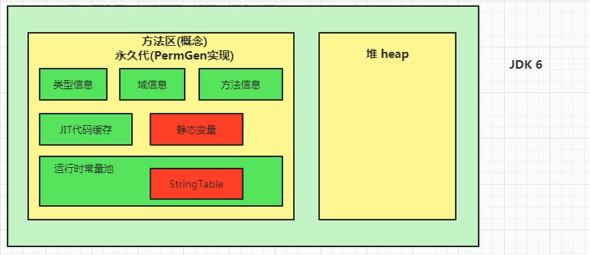

JDK 1.7

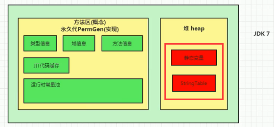

JDK 1.8

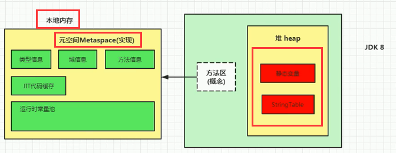


> 为什么要用**元空间**替换**永久代** 

1、因为永久代设置空间大小是很难确定的

* 在某些场景下，如果动态加载类过多，容易产生 Perm 区的 OOM。比如某个实际 Web 工程中，因为功能点比较多，在运行过程中，要不断动态加载很多类，经常出现致命错误
* 而元空间和永久代之间最大的区别在于：**元空间并不在虚拟机中，而是使用本地内存**。因此，默认情况下，元空间的大小仅受本地内存限制

2、对永久代进行调优是很困难的


> 为什么要将 **==String Table==**  放到堆空间中

​	JDK7 中将 **StringTable** 放到了堆空间中。因为**永久代的回收效率很低**，在 **Full GC** 的时候才会触发。而 **Full GC** 是老年代的空间不足、永久代不足时才会触发。这就导致 **String Table** 回收效率不高。而我们**开发中会有大量的字符串被创建，回收效率低，导致永久代内存不足。放到堆里，能及时回收内存** 


### 6.7 方法区的垃圾回收

​	一般来说这个区域的**回收效果比较难令人满意**，尤其是类型的卸载，条件相当苛刻。但是这部分区域的回收有时又确实是必要的。以前 **Sun** 公司的 **Bug** 列表中，曾出现过的若干个严重的 **Bug** 就是由于低版本的 **Hotspot** 虚拟机对此区域未完全回收而导致内存泄漏

方法区的垃圾收集主要回收两部分内容：**常量池中废弃的常量**和**不再使用的类型** 


* 常量回收

​	1、方法区内常量池之中主要存放的两大类常量：**字面量和符号引用**。字面量比较接近 Java 语言层次的常量概念，如文本字符串、被声明为 **final** 的常量值等。而**符号引用则属于编译原理方面的概念**，包括下面三类常量

* 类和接口的全限定名
* 字段的名称和描述符
* 方法的名称和描述符

​	2、**HotSpot** 虚拟机对常量池的回收策略是很明确的，**只要常量池中的常量没有被任何地方引用，就可以被回收** 

​	3、回收废弃常量与回收 Java 堆中的对象非常类似


* 类型回收（Java 的回收）

​	1、要判定一个类型是否属于“不再被使用的类”的条件就比较苛刻了。需要**同时满足下面三个条件**：

* 该类所有的**实例**都已经被回收，也就是 Java 堆中不存在该类及其任何派生子类的实例
* 加载该类的**类加载器**已经被回收，这个条件除非是经过精心设计的可替换类加载器的场景，如 OSGi、JSP 的重加载等，否则通常是很难达成的
* 该类对应的 **java.lang.Class** 对象没有在任何地方被引用，**无法在任何地方通过反射访问该类的方法** 

​	2、Java 虚拟机被允许对满足上述三个条件的无用类进行回收，这里说的仅仅是 “被允许”，而并不是和对象一样，没有引用了就必然会回收。关于是否要对类型进行回收 **Hotspot** 虚拟机提供了**-Xnoclassgc** 参数进行控制，还可以使用**-verbose:class** 以及 **-XX:+TraceClass-Loading、-XX:+TraceClassUnLoading** 查看类加载和卸载信息

​	3、在大量使用反射、动态代理、 **CGLib** 等字节码框架，动态生成 **JSP** 以及 **OSGi** 这类频繁自定义类加载器的场景中，通常都需要 **Java** 虚拟机具备类型卸载的能力，以保证不会对方法区造成过大的内存压力


## 7、小结

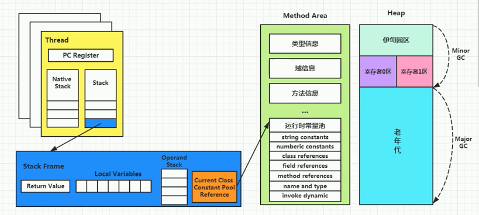


# 四、对象实例化内存布局与访问定位

> 对象是如何存储于访问的？


## 1、对象创建的方式

1、使用 **new** 关键字调用构造器创建对象

2、**Class** 的 **newInstance()**，反射的方式，只能调用空参构造器，权限必须是 **public**（**JDK 8** 及以前）

3、**Constructor** 的 **newInstance(xxx)**，反射的方式，可以调用带参、不带参的构造器，权限没有要求（**JDK 8** 以后）

4、使用 **clone()**，不调用任何构造器，但当前类必须实现 **Cloneable** 接口，实现 **clone()** 方法

5、使用反序列化，从文件、网络中获取一个对象的二进制流

6、第三方库 **Objenesis** 


## 2、对象创建步骤

1、判断对象对应的类是否加载、链接、初始化

> ​	虚拟机遇到一条 **new** 指令，首先去检查这个指令的参数能否在 **Metaspace** 的常量池中定位到一个类的符号引用，并且检查这个符号引用代表的类是否已经被加载、解析和初始化（即判断类元信息是否存在）。如果没有，那么在双亲要派模式下，使用当前类加载器以 **ClassLoader** + 包名 + 类名为 Key 进行查找对应的 **.class** 文件，如果没有找到文件，则抛出 **ClassNotFoundException** 异常，如果找到，则进行类加载，并生成对应的 **Class** 类对象

2、为对象分配内存

> ​	首先计算对象占用空回大小，接着在堆中划分一块内存给新对象，如果实例成员变量是引用变量，仅分配引用变量空间即可，即 4 个字节大小

* 如果内存**==空间规整==**，采用**指针碰撞法** 

> ​	如果内存是规整的，那么虚拟机将采用的是指针碰撞法（ Bump The Pointer）来为对象分配内存。
>
> ​	意思是所有用过的内存在一边，空闲的内存在另外一边，中间放着一个指针作为分界点的指示器，**==分配内存就仅仅是把指针向空闲那边动一段与对象大小相等的距离==**。如果垃圾收集器选择的是 Serial、ParNew 这种基于压缩算法的，虚拟机采用这种分配方式，一般使用带有 compact（整理）过程的收集器时，使用指针碰撞

* 如果**==空间不规整==**，虚拟机需要维护一个**空闲列表** 

> ​	如果内存不是规整的，已使用的内存和未使用的内存相互交错，那么虚拟机将采用的是**空闲列表法**来为对象分配内存。
> ​	意思是虚拟机维护了一个列表，记录了哪些内存块是可用的，再分配的时候从列表中找到一块足够大的空间划分始对象实例，并更新列表上的内容。这种分配方式成为空闲列表（ Free List）

* 说明
    * 择哪种分配方式由 **Java** 堆是否规整决定，而 **Java** 堆是否规整又由所采用的**圾收集器是否带有压缩整理功能**决定

3、处理并发安全问题

* 采用 CAS 失败重试、区域加锁保证更新的原子性
* 每个线程预先分配一块 **TLAB**，通过 **-XX+/-UseTLAB** 参数来设定

4、初始化分配到的空间（默认初始化）

> 所有属性设置默认值，保证对象实例字段在不赋值时可以直接使用

5、设置对象的对象头

> ​	将对象的所属类（即类的数据信息）、对象的 HashCode 和对象的 GC 信息、锁信息等数据存储在对象的对象头中，这个过程的具体设置方式取决于 JVM 实现

6、执行 **init()** 方法进行初始化

> ​	在 Java 程序的视角看来，执行 **init()**，初始化才正式开始，初始化成员变量，执行实例化代码适方法，并把堆内对象的首地址赋值给引用变量。
> ​	因此一般来说（由字节码中是否跟随有  invokespecial 指令所决定），new 指令之后会接着就是执行方法，把对象按照程序员的意愿进行初始化，这样一个真正可用的对象才算完全创建出来


## 3、对象的内存布局

==**对象头**== 

1、运行时元数据

> 哈希值、GC 分代年龄、锁状态标志、线程持有的锁、偏向线程 ID、偏向时间戳

2、类型指针

> 指向元数据 InstanceKlass，确定该数据所属类型

* 说明：如果是数组，还需要记录数组长度


**==实例数据==** 

* 说明：**==它是对象真正存储的有效信息==**，包括程序代码中定义的各种类型的字段（包括从父关继承下来的和本身拥有的字段）

规则

1、相同宽度的字段总是被分配在一起

2、父类中定义的变量会出现在子类之前

3、如果 **CompactFields** 参数为 true （默认为true），子类中较窄的变量可能插入到父类变量的空隙


**==对齐填充==** 

> 不是必须的，也没特别含义，仅仅起到占位符的作用

​	由于 **HotSpot** 虚拟机的自动内存管理系统要求对象起始地址必须是8字节的整数倍，换句话说就是**任何对象的大小都必须是 8 字节的整数倍**。对象头部分已经被精心设计成正好是 8 字节的倍数（1倍或者2倍），因此，**如果对象实例数据部分没有对齐的话，就需要通过对齐填充来补全** 

举例

```java
public class Customer{
    int id=101;
    String name;
    Account acct;
    
    {
    name="匿名客户";
    }
    public Customer(){
    acct=new Account();
    }
}
class Account{}
```

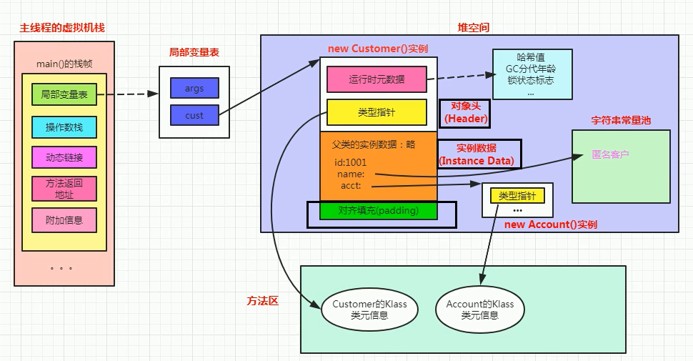


## 4、对象访问定位

> **JVM** 是如何通过**栈帧**中的**对象引用**访问到其内部的对象实例的呢？
>     定位：通过栈上的 **reference** 访问

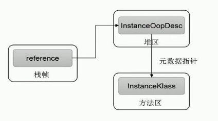

### 4.1 对象访问方式

> **==句柄访问==**

​	好处：**reference** 中存储稳定句柄地址，当对象被移动（垃圾收集时移动对象很遍）时只会改变句柄中实例数据指针即可， **reference** 本身不需要被修改

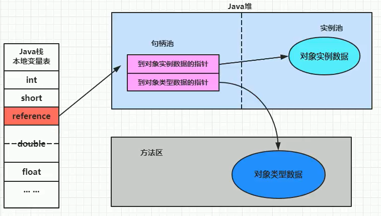


> 直接指针访问（**HotSpot** 使用）

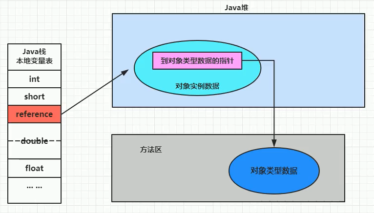


# 五、直接内存

概述

1、直接内存不是 **JVM** 运行时数据区的一部分，也不是《**Java** 虚拟机规范》中定义的内存区域

2、直接内存是在 **Java** 堆外的、**直接向系统申请的内存区间** 

3、来源于 **NIO**，通过存在堆中的 **DirectByteBuffer** 操作 **Native** 内存

4、通常，**==访问直接内存的速度会优于 Java 堆，即读写性能高==**
	因此出于性能考虑，读写频繁的场合可能会考虑使用直接内存
	**Java** 的 **NIO** 库允许 **Java** 程序使用直接内存，用于数据缓冲区

5、也可能导致 **OutOfMemoryError** 异常。由于直接内存在 **Java** 堆外，因此它的大小不会直接受限于 **-Xmx** 指定的最大堆大小，但是系统内存是有限的，**Java** 堆和直接内存的总和依然受限于操作系统能给出的最大内存

6、缺点
	分配回收成本较高，不受 **JVM** 内存回收管理

> **直接内存大小可以通过 MaxDirectMemorysize 设置，如果不指定，默认与堆的最大值 -Xmx 参数值一致** 

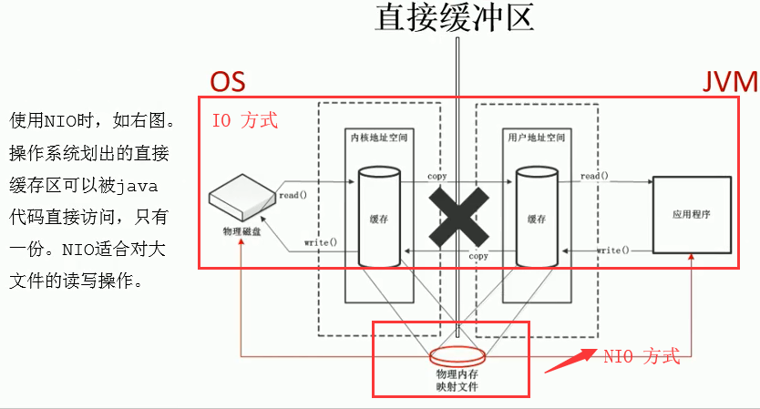


# 六、执行引擎

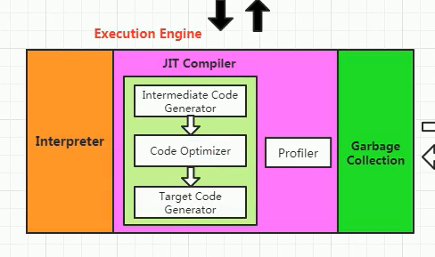

概述

​	1、执行引擎是 Java 虛拟机核心的组成部分之一

​	2、“虚拟机” 是一个相对于 “物理机” 的概念，这两种机器都有代码执行能力，其区别是**==物理机==的执行引擎是直接建立在处理器、缓存、指令集和操作系统层面上的，而==虚拟机==的执行引擎则是由软件自行实现的**，因此可以不受物理条件制约地定制指令集与执行引擎的结构体系，**能够执行那些不被硬件直接支持的指令集格式** 

​	3、JVM 的主要任务是负责装载字节码到其内部，但字节码并不能够直接运行在操作系统之上，因为**字节码指令并非等价于本地机器指令，它内部包含的仅仅只是一些能够被 JVM 所识别的字节码指令、符号表，以及其他辅助信息**。那么，如果想要让一个 Java 程序运行起来，需要**执行引擎（ Execution Engine）将字节码指令 解释/编译 为对应平台上的本地机器指令**才可以。简单来说，**==JVM 中的执行引擎充当了将高级语言翻译为机器语言的译者==** 


## 1、Java代码编译和执行的过程

基本过程

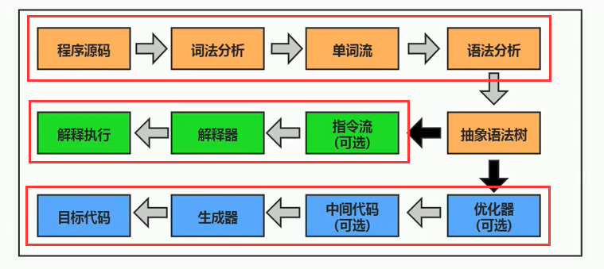


> **==前端编译器==**所做工作：将 J**ava 代码**翻译成 JVM 能识别的**字节码文件**（上图黄色部分）

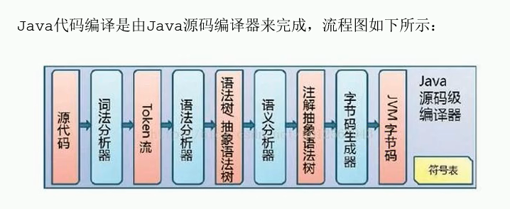

> **及时编译**过程：将 Java 字节码文件编译成对应机器能识别的机器指令（上图绿色部分）

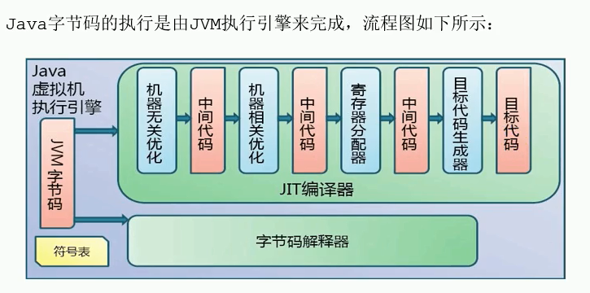


> 什么是**解释器（Interpreter）** 

​	解释器：当 Java 虚拟机启动时会根据预定义的规范**对字节码采用逐行解释的方式执行，将每条字节码文件中的内容“翻译”为对应平台的本地机器指令执行** 

> **JIT（Just  In  Time  Compiler）** 编译器

**JIT** 编译器：就是虚拟机**将==源代码==直接编译成和本地机器平台相关的机器语言（机器指令）** 


## 2、机器码、执行、汇编语言

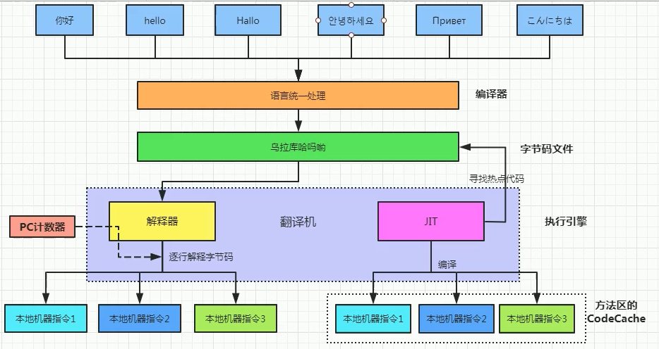


> 机器码

1、各种用二进制编码方式表示的指令，叫做**机器指令码**。开始，人们就用它采编写程序，这就是机器语言

2、机器语言虽然能够被计算机理解和接受，但和人们的语言差别太大，不易被人们理解和记忆，并且编程时易出错

3、用它编写的程序一经输入计算机，CPU 直接读取运行，因此和其他语言编的程序相比，**执行速度最快** 

4、机器指令与 CPU 紧密相关，所以不同种类的 CPU 所对应的机器指令也就不同


> 指令

1、由于机器码是有 0 和 1 组成的二进制序列，可读性实在太差，于是人们发明了指令

2、指令就是**把机器码中特定的 0 和 1 序列，简化成对应的指令**（一般为英文简写，如mov，inc等）可读性稍好

3、由于不同的硬件平台，执行同一个操作，对应的机器码可能不同，所以不同的硬件平台的同一种指令（比如mov），对应的机器码也可能不同


> 指令集

1、不同的硬件平台，各自支持的指令，是有差别的。因此每个平台所支持的指令，称之为对应平台的指令集

2、如常见的 **x86 指令集**，对应的是 **x86 架构的平台**，**ARM 指令集**，对应的是 **ARM 架构的平台** 


> 汇编语言

1、由于指令的可读性还是太差，于是人们又发明了汇编语言

2、在汇编语言中，**用==助记符==代替机器指令的==操作码==，用==地址符号（ symbol）或标号（Label）==代替指令或==操作数的地址==** 

3、在不同的硬件平台，汇编语言对应着不同的机器语言指令集，通过汇编过程转换成机器指令。由于计算机只认识指令码，所以**用汇编语言编写的程序还必须翻译成机器指令码，计算机才能识别和执行** 


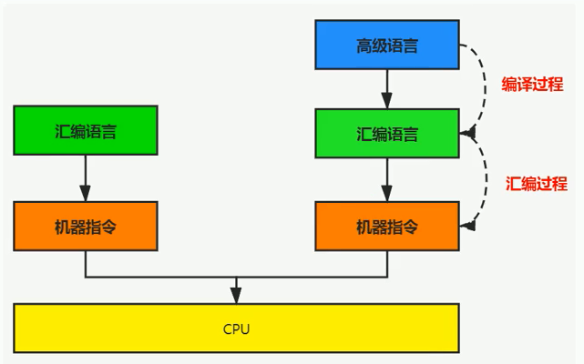


## 3、解释器

* 字节码

1、字节码是一种中间状态（中间码）的二进制代码（文件），它比机器码更抽象，需要直译器转译后才能成为机器码

2、字节码主要为了实现特定软件运行和软件环境、与硬件环境无关

3、字节码的实现方式是通过编译器和虚拟机器。编译器将源码编译成字节码，**特定平台上的虚拟机器**将字节码转译为可以直接执行的指令


​	**JVM** 设计者们的初衷仅仅只是单纯地为了满足 **Java** 程序实现跨平台特性，因此避免采用静态编译的方式直接生成本地机器指令，从而诞生了实现**==解释器==在运行时采用逐行解释字节码执行程序**的想法

​	解释器真正意义上所承担的角色就是一个**运行时 “翻译者”**，将字节码文件中的内容 “翻译” 为对应平台的本地机器指令执行

​	当一条字节码指令被解释执行完成后，接着再根据 PC 寄存器中记录的下一条需要被执行的字节码指令执行解释操作


​	在 **Java** 的发展历史里，一共有两套解释执行器，即古老的字**==字节码解释器==**、现在普遍使用的**==模板解释器==** 

* **字节码解释器**在执行时通过纯软件代码模拟字节码的执行，**效率非常低下** 
* **模板解释器**将每一条字节码和一个模板函数相关联，**模板函数中直接产生这条字节码执行时的机器码**，从而很大程度上提高了解释器的性能

> 在 **Hotspot VM** 中，解释器主要由 **Interpreter 模块**和 **Code 模块**构成
> 	**Interpreter** 模块：实现了解释器的核心功能
> 	**code** 模块：用于管理 **Hotspot VM** 在运行时生成的本地机器指令


* 现状

​	由于解释器在设计和实现上非常简单，因此除了**Java** 语言之外，还有许多高级语言同样也是基于解释器执行的，比如 Python、Per、Ruby 等。**但是在今天，基于解释器执行已经沦落为低效的代名词**，并且时常被一些 **C/C++** 程序员所调侃

​	为了解决这个问题，JVM 平台支持一种叫作**==即时编译的技术==，即时编译的目的是避免函数被解释执行，而是将整个函数体编译成为机器码，每次函数执行时，只执行编译后的机器码即可**，这种方式可以使执行效率大幅度提升。


## 4、JIT编译器

* Java 代码执行分类

​	1、第一种是将源代码编译成字节码文件，然后在运行时通过**解释器**将字节码文件转为机器码执行

​	2、第二种是编译执行（直接编译成机器码）。现代虚拟机为了提高执行效率，会使用即时编译技术（JIT, Just in time）**将方法直接编译成机器码后再执行** 


​	**Hotspot VM 采用==解释器==与==即时编译器==并存的架构**。在 Java 虚拟机运行时，解释器和即时编译器能够相互协作，各自取长补短，尽力去选择最合适的方式来权衡编译本地代码的时间和直接解释执行代码的时间


> 既然 Hotspot VM 中已经内置 JIT 编译器了，那么为什么还需要再使用解释器来“拖累”程序的执行性能呢？

​	首先明确当程序启动后，解释器可以马上发挥作用，省去编译的时间，立即执行。编译器要想发挥作用，把代码编译成本地代码，需要一定的执行时间。但编译为本地代码后，执行效率高。

​	尽管 **JRockit VM** 中程序的执行性能会非常高效，但**程序在启动时必然需要花费更长的时间来进行编译**。对于服务端应用来说，启动时间并非是关注重点，但对于那些看中启动时间的应用场景而言，或许就需要采用解释器与即时编译器并存的架构来换取一个平衡点。

​	在此模式下，当 **Java** 虚拟器启动时，**解释器**可以首先发挥作用，而不必等待即时编译器全编译完成后再执行，这样**可以省去许多不必要的编译时间**。随着时间的推移，即时编译器逐渐发挥作用，根据**==热点探测功能==**，将有价值的字节码编译为本地机器指令以换取更高的程序执行效率


​	Java 语言的 “编译期” 其实是一段 “不确定” 的操作过程，因为它可能是指一个**前端编译器**（其实叫“编译器的前端”更准确一些）**把 .java文件转变成 .class 文件的过程**

​	也可能是指虚拟机的**后端运行期编译器**（JIT 编译器， Just In Time Compiler）**把==字节码==转变成机器码的过程** 

​	还可能是指使用**静态提前编译器**（AOT编译器， Ahead of Time Compiler）**直接把 ==.java 文件==编译成本地机器代码的过程** 


> 热点代码探测方式

​	是否需要启动 **JIT** 编译器将字节码直接编译为对应平台的本地机器指令则**需要根据代码被调用执行的频率而定**。关于那些需要被编译为本地代码的字节码，也被称之为 “热点代码”，**JIT** 编译器在运行时会针对那些频繁被调用的“热点代码”做出深度优化，将其直接编译为对应平台的本地机器指令，以此提升 Java 程序的执行性能

​	**一个被多次调用的方法，或者是一个方法体内部循环次数较多的循环体都可以被称之为 “热点代码”**，因此都可以通过 JIT 编译器编译为本地机器指令。**由于这种编译方式发生在==方法的执行过程中==，因此也被称之为==栈上替换==**，或简称为**OSR**（ On stack Replacement）编译

​	一个方法究竟要被调用多少次，或者一个循环体究竟需要执行多少次循环才可以达到这个标准？必然需要一个明确的阈值，JIT 编译器才会将这些 “热点代码” 编译为本机器指令执行。这里主要依靠**热点探测功能** 

​	**目前 Hotspot VM 所采用的热探测方式是基于==计数器==的热点探测** 

​	采用基于计数器的热点探测， **Hotspot VM 将会为每一个方法都建立 2 个不同类型的计数器，分别为==方法调用计数器==和==回边计数器==** 

> 方法调用计数器：用于统计方法的调用次数
> ​回边计数器：用于统计循环体执行的循环次数


> 方法调用计数器：用于统计方法的调用次数

​	这个计数器就用于统计方法被调用的次数，它的默认阈值在 **Client 模式下是1500次**，在 **Server 模式下是10000次**。超过这个阈值，就会触发 JIT 编译，这个阈值可以通过虚拟机参数 **-XX:CompileThreshold** 来人为设定

​	当一个方法被调用时，会先检査该方法是否存在被 JIT 编译过的版本，如果存在，则优先使用编译后的本地代码来执行。如果不存在已被编译过的版本，则将此方法的调用计数器值加 1，然后判断方法调用计数器与回边计数器值之和是否超过方法调用计数器的阈值。如果已超过阈值，那么将会向即时编译器提交一个该方法的代码编译请求

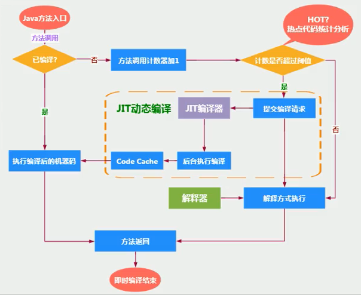


> 热度衰减

​	如果不做任何设置，方法调用计数器统计的并不是方法被调用的绝对次数，而是一个相对的执行频率，即一段时间之内方法被调用的次数。**当超过一定的时间限度，如果方法的调用次数仍然不足以让它提交给即时编译器编译，那这个方法的调用计数器阈值就会被减少一半**，这个过程称为**==方法调用计数器热度的衰减==**，而这段时间就称为此方法统计的半衰周期

​	**进行热度衰减的动作是在虚拟机进行==垃圾收集==时顺便进行的**，可以使用虚拟机参数 **-XX:-UseCounterDecay** 来关闭热度衰减，让方法计数器统计方法调用的绝对次数，这样，只要系统运行时间足够长，绝大部分方法都会被编译成本地代码

​	使用 **-XX:CounterhalfILifeTime** 参数设置半衰周期的时间，单位是秒


> 回边计数器

​	它的作用是统计一个方法中循环体代码执行的次数，**在字节码中遇到控制流向后跳转的指令称为 “回边”**。显然，建立回边计数器统计的目的就是为了触发 **OSR（栈上替换）** 编译


> **Hotspot VM** 设置程序执行方式

**-Xint**：**完全采用解释器模式**执行程序

**-Xcomp**：**完全采用即时编译器模式**执行程序。如果即时编译出现问题，解释器会介入执行

**-Xmixed**：**采用解释器+即时编译器的混合模式**共同执行程序（默认）


> **Hotspot VM** 中 **JIT** 分类

​	**在 Hotspot VM 中内嵌有两个 JIT 编译器，分别为 ==Client Compiler== 和 ==Server Compiler==，但大多数情况下我们简称为 C1 编译器和 C2 编译器**。开发人员可以通过如下命令显式指定 **Java** 虚拟机在运行时到底使用哪一种即时编译器，如下所示

​	**-Client**：指定 Java 虚拟机运行在 **Client 模式**下，并使用 **C1 编译器**，**C1 编译器会对字节码进行==简单可靠的优化，耗时短==。以达到更快的编译速度** 

​	**-Server**：指定 Java 虚拟机运行在 **Server 模式**下，并使用 C2编译器，**C2 进行==耗时较长==的优化，以及==激进优化==。但优化的==代码执行效率更高==** 


> **==C1（Client）==** 的优化策略

方法内联：将引用的函数代码编译到引用点处，这样可以减少栈帧的生成，减少参数传递以及跳转过程

去虚拟化：对唯一的实现类进行内联

冗余消除：在运行期间把一些不会执行的代码折叠掉


> **==C2（Server）==** 的优化策略

标量替换：用标量值代替聚合对象的属性值

栈上分配：对于未逃逸的对象分配对象在栈而不是堆

同步消除：清除同步操作，通常指 synchronized


> 分层编译（ Tiered Compilation）策略

​	程序解释执行（不开启性能监控）可以触发 C1 编译，将字节码编译成机器码，可以进行简单优化，也可以加上性能监控，C2 编译会根据性能监控信息进行激进优化。

​	不过在 Java7 版本之后，一旦开发人员在**程序中==显式==指定命令 “- server” 时，默认将会开启分层编译策略**，由 C1编译器和 C2 编译器相互协作共同来执行编译任务


# 七、String 解析


## 1、String的基本特性

**String** 声明为 **final** 的，不可被继承

**String** 实现了 **Serializable** 接口：表示字符串是**支持序列化**的。实现了 **Comparable**接口：表示 **String** 可以**比较大小** 

**String** 在 **JDK 8 以前**内部定义了 **final char[] value** 于存储字符串数据。**JDK9 时改为 byte[]**

​	**String** 该类的当前实现将字符存储在 **char** 数组中，每个字符使用两个字节（十六位）。从许多不同的应用程序收集的数据表明，字符串是堆使用情况的主要组成部分，而且，**大多数 String 对象仅包含 Latin-1 字符。这样的字符仅需要一个字节的存储空间，因此 String 对象的内部数组中的 一半空间未使用** 

​	我们建议 **String 类的内部表示形式从 UTF-16 char 数组更改为 byte 带有==编码标记==字段的数组**。新 **String** 类将存储基于字符串内容编码为 ISO-8859-1 / Latin-1（每个字符一个字节）或 UTF-16（每个字符两个字节）的字符。**编码标志将指示使用哪种编码** 

> String 再也不用 char 来存储了，改成了 **byte 加上编码标记**，节约了一些空间


**String**：代表不可变的字符序列。简称：不可变性

1、当对字符串**==重新赋值==**时，需要重写指定内存区域赋值，不能使用原有的 **value** 进行赋值

2、当对现有的字符串进行**==连接操作==**时，也需要重新指定内存区域赋值，不能使用原有的 **value** 进行赋值

3、当调用 **String** 的 **replace()** 方法**==修改指定字符或字符串==**时，也需要重新指定内存区域赋值，不能使用原有的 **value** 进行赋值

​	通过字面量的方式（区别于new）给一个字符串赋值，**此时的字符串值声明在==字符串常量池==中**，**==字符串常量池中是不会存储相同内容的字符串的==** 

​	1、**String** 的 **String Pool** 是一个固定大小的 **Hashtable**，**默认值大小长度是 1009（以前）**，如果放进 **String Pool** 的 **String**非常多，就会造成 **Hash 冲突严重**，从而导致链表会很长，而链表长了后直接会造成的影响就是当**调用 String.intern 时性能会大幅下降** 

​	2、使用 **-XX:StringTableSize** 可设置 **StringTable** 的长度

​	3、**在 JDK6 中 Stringtable 是固定的，就是 1009 的长度**，所以如果常量池中的字符串过多就会导致效率下降很快

​	4、**在 JDK8 中， Stringtable 的长度默认值是 60013，1009 是可设置的最小值** 


## 2、String 的内存分配

​	在 Java 语言中有 8 种基本数据类型和一种比较特殊的类型 **String**。这些类型**为了使它们在运行过程中速度更快、更节省内存，都提供了一种==常量池==的概念** 

​	**常量池就类似一个Java系统级别提供的缓存**。8 种基本数据类型的常量池都是系统协调的

**String** 类型的常量池比较特殊，它的主要使用方法有两种

​	1、直接使用双引号声明出来的 **String** 对象会直接存储在常量池中，比如：String info = "atguigu";

​	2、如果不是用双引号声明的 **String** 对象，可以使用 **String** 提供的 **intern() 方法** 


Java 6 及以前，字符串常量池存放在永久代

Java 7 中，**字符串常量池的位置调整到Java堆中** 

​	1、所有的字符串都保存在堆（Heap）中，和其他普通对象一样，这样可以让你在进行调优应用时仅需要调整堆大小就可以了

​	2、字符串常量池概念原本使用得比较多，但是这个改动使得我们有足够的理由让我们**重新考虑在 Java7 中使用 string.intern()** 

​	3、Java 8 有了元空间，字符串常量还是在堆中


## 3、字符串的拼接

1、**常量与常量**的拼接结果在常量池，原理是编译期优化

```java
@Test
public void test01() {
    String s1 = "a" + "b" + "c";  
    String s2 = "abc";

    System.out.println(s1 == s2);     // true
    System.out.println(s1.equals(s2));	  // true
}
```

反编译的结果

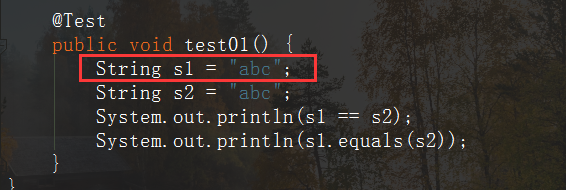


2、常量池中不会存在相同内容的常量

3、**只要其中有一个是变量，结果就在堆中**，变量拼接的原理是 **StringBuilder** 

4、如果拼接的结果调用 **intern()** 方法，则主动将常量池中还没有的字符串对象放入池中，并返回此对象地址

```java
@Test
public void test02() {
    String s1 = "JavaEE";
    String s2 = "hadoop";

    String s3 = "JavaEEhadoop";
    String s4 = "JavaEE" + "hadoop";
    
    /**
     * 如果拼按符号的前后出现了变量，则相当于在堆空间中 new string()
     * 具体的内容为拼接的结果
     */
    String s5 = s1 + "hadoop";
    String s6 = "JavaEE" + s2;
    String s7 = s1 + s2;

    System.out.println(s3 == s4); // true
    System.out.println(s3 == s5); // fasle
    System.out.println(s3 == s6); // false
    System.out.println(s3 == s7); // false
    System.out.println(s5 == s6); // false
    System.out.println(s5 == s7); // false
    System.out.println(s6 == s7); // fasle

    /**
     * intern()：判断字符审常量池中是否存在 javaEEhadoop值
     * 如果存在，则返回常量池中 javaEEhadoop的地址；
     * 如果字符申常量池中不存在 javaEEhadoop,
     * 则在常量池中加载一份 JavaEEhadoop，并返回其对象的地址
     */
    String s8 = s6.intern();
    System.out.println(s3 == s8); // true
}
```

```java
@Test
public void test03() {
    String s1 = "a";
    String s2 = "b";
    String s3 = "ab";

    /**
     * s1 + s2 执行细节
     * StringBuilder s=new StringBuilder();
     * s.append("a");
     * s.append("b");
     * s.toString();
     * 补充：
     *      在jdk5.0之后使用的是 StringBuilder
     *      在jdk5.0之前使用的是 stringBuffer
     */
    String s4 = s1 + s2;
    System.out.println(s3 == s4);
}
```

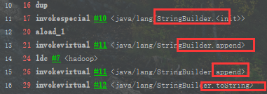


```java
@Test
public void test04(){
    final String s1 = "a";
    final String s2 = "b";
    String s3 = "ab";

    String s4 = s1 + s2;  // 常量引用
    System.out.println(s3 == s4);  // true
}
```


> 使用 + 号拼接与使用 StringBuilder 拼接效率比较

```java
@Test
public void test05() {

    String a = "a";

    long start = System.currentTimeMillis();
    for (int i = 0; i < 100000; i++) {
    a += "a";
    }
    long end = System.currentTimeMillis();
    System.out.println(end - start);      // 5984ms

    StringBuilder builder = new StringBuilder();
    start = System.currentTimeMillis();
    for (int i = 0; i < 100000; i++) {
    builder.append("a");
    }
    end = System.currentTimeMillis();
    System.out.println(end - start);       // 2ms
}
```

* 原因
    * 使用 + 号拼接每次都会创建一个 StringBuilder 对象

> 对 StringBuilder 方式还可以进行优化

​	**StringBuilder**  底层使用字符数组来存储数据，数组长度不够时就需要扩容，扩容所花费时间较长，初始字符数组长度较小，为避免多次扩容，可以为 **StringBuilder**  底层使用的字符数组指定一个初始长度，避免进行多次扩容


## 4、intern() 的使用

> 方法解释

​	当一个字符串对象使用此方法是，会先去字符串常量池中查找有没有与此**字符串的值**相同的，如果有则返回常量池中改字符串的引用，如果没有，则在字符串常量池中新创建一个，然后返回引用


## 5、new String("a") 详解

> **==new String("ab")==**  会创建几个对象？

两个，一个是 new 关键字在堆空间创建的一个对象，一个是字符串常量池中的对象

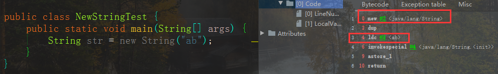


> **==new String("a") + new String("b")==** 会创建几个对象？

对象1：new StringBuilder

对象2：new String("a")

对象3：常量池中的 "a"

对象4：new String("b")

对象5：常量池中的 "b"

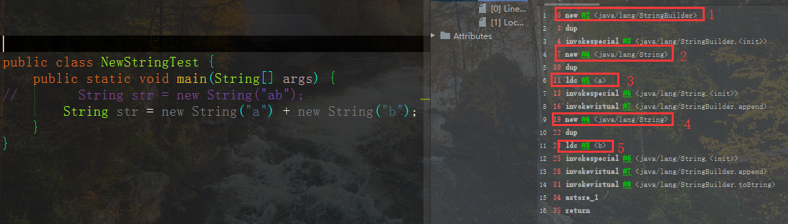

> 深入剖析 **StringBuilder 的 toString 方法** 

对象6：**new String("ab")** 

* 注意：**toString() 的调用，在常量池中没有生成 "ab"** 

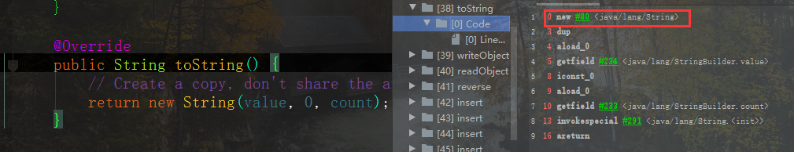


> 经典面试难题：**intern()** 的使用

```java
@Test
public void test06() {
    String s = new String("1"); //在堆中生成一个 new String("1") 的同时，也在字符串常量池中创建了一个对象
    s.intern();

    String s2 = "1"; // 此时返回的是字符串常量池中的对象
    System.out.println(s == s2);  // 结果1

    String s3 = new String("1") + new String("1");
    s3.intern();
    String s4 = "11";
    System.out.println(s3 == s4); // 结果2
}
```

* JDK 6 中的结果
    * 都是 **false**

> 结果 1 很好解释，详细剖析结果 2

1、由之前的分析可得，new String("1") + new String("1");  这句代码执行完之后，字符串常量池中没有 "11"，只是在堆空间中创建了一个 new String("11") 对象

2、s3.intern();  JDK 6当中此代码是在字符串常量池中生成了一个新的对象 "11"，也就有了新的地址

3、String s4 = "11"; 此代码获得字符串常量池中的对象引用，与 s3 不是同一对象，故为 **false** 

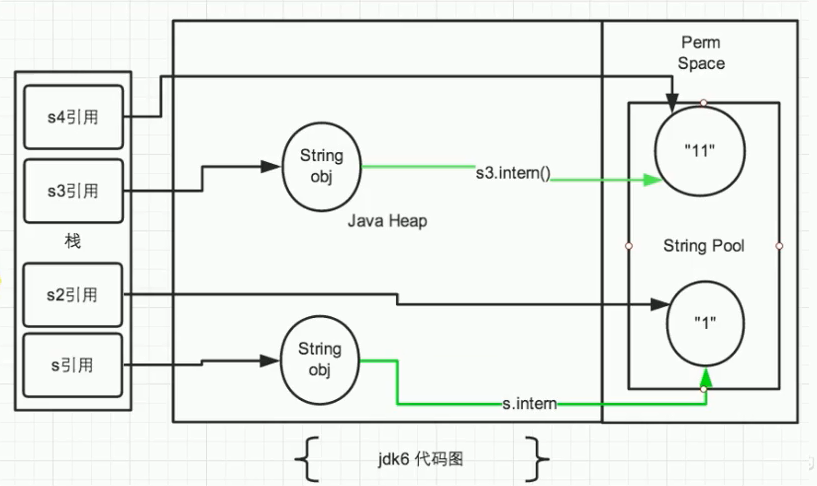

* JDK 7/8
    * 结果 1 为 false，结果 2 为 true

> 结果 1 很好解释，详细剖析结果 2

​	1、由之前的分析可得，new String("1") + new String("1"); 这句代码执行完之后，字符串常量池中没有 "11"，只是在堆空间中创建了一个 new String("11") 对象

​	2、s3.intern();  JDK 7/8 当中此代码没有在字符串常量池中生成新的对象，而是在常量池中创建了一个直接指向了堆空间的 new String("11") 地址

​	3、String s4 = "11"; 此代码获得字符串常量池中的对象引用，在 JDK 7/8 中也就是堆空间的引用，与 s3 是同一个对象，故为 **true** 

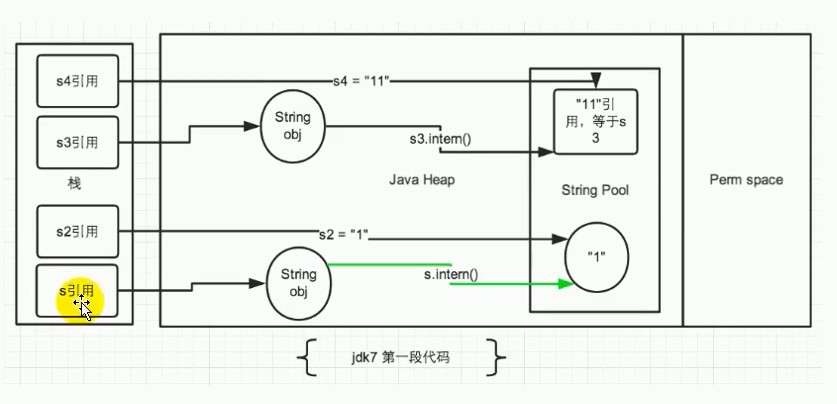


## 6、Intern() 总结

**JDK 1.6** 中，将一个字符串对象尝试放入串池

1、如果串池中有，则并不会放入。返回已有的串池中的对象的地址

2、如果没有，会**将此对象==复制==一份，放入串池**，并返回串池中的对象地址


JDK 1.7 起，将一个字符串对象尝试放入串池

1、如果串池中有，则并不会放入。返回已有的串池中的对象的地址

2、如果没有，则会**将对象的引用==地址==复制一份，放入串池**，并返回串池中的引用地址


# 八、垃圾回收

关于垃圾收集有三个经典问题：
1、哪些内存需要回收？
2、什么时候回收？
3、如何回收？

## 1、垃圾回收概述

> 什么是垃圾？

​	垃圾是指在运行程序中**没有任何指针指向的对象**，这个对象就是需要被回收的垃圾

​	如果不及时对内存中的垃圾进行清理，那么，这些垃圾对象所占的内存空间会一直保留到应用程序结束，被保留的空间无法被其他对象使用。甚至可能导致内存溢出


> 为什么需要 **GC**

​	对于高级语言来说，一个基本认知是**如果不进行垃圾回收，内存迟早都会被消耗完**，因为不断地分配内存空间而不进行回收，就好像不停地生产生活垃圾而从来不打扫一样

​	除了释放没用的对象，**垃圾回收也可以清除内存里的记录碎片**。碎片整理将所占用的堆内存移到堆的一端，以便 Java 将整理出的内存分配给新的对象

​	随着应用程序所应付的业务越来越庞大、复杂，用户越来越多，**没有 GC 就不能保证应用程序的正常进行**。而经常造成 **STW** 的 **GC** 又跟不上实际的需求，所以才会不断地尝试对 **GC** 进行优化


### 1.1 早期垃圾回收

​	在早期的 C/C++时代，垃圾回收基本上是手工进行的。开发人员可以使用 new 关键字进行内存申请，并使用 delete关键字进行内存释放。比如以下代码


​	这种方式可以灵活控制内存释放的时间，但是**会给开发人员带来频繁申请和释放内存的管理负担**。倘若有一处内存区间由于程序员编码的问题忘记被回收，那么就会产生**内存泄漏**，垃圾对象永远无法被清除，随着系统运行时间的不断増长，垃圾对象所耗内存可能持续上升，直到出现内存溢岀并造成应用程序崩溃


### 1.2 Java 垃圾回收机制

> 自动内存管理

无需开发人员手动参与内存的分配与回收，这样降低内存泄漏和内存溢出的风险

自动内存管理机制，将程序员从繁重的内存管理中释放出来，可以更专心地专注于业务开发


> 担忧

​	对于Java开发人员而言，自动内存管理就像是一个黑匣子，如果过度依赖于 “自动”，那么这将会是一场灾难，最严重的就会弱化 Java 开发人员在程序出现内存溢出时定位问题和解决问题的能力

​	此时，了解 JVM 的自动内存分配和内存回收原理就显得非常重要，只有在真正了解 JVM 是如何管理内存后，我们才能够在遇见 OutOfMemoryError 时，快速地根据错误异常日志定位问题和解决问题

​	当需要排査各种内存溢出、内存泄漏问题时，当垃圾收集成为系统达到更高并发量的瓶颈时，我们就必须对这些“自动化” 的技术实施必要的监控和调节


## 2、垃圾回收算法

标记阶段：引用计数算法、可达性分析算法

清除阶段：标记-清除算法、复制算法、标记压缩算法


### 2.1 标记阶段-引用计数算法

> 对象存活判断

​	在堆里存放着几乎所有的 Java 对象实例，**在 GC 执行垃圾回收之前，首先需要区分出内存中哪些是存活对象，哪些是已经死亡的对象**。只有被标记为己经死亡的对象，GC 才会在执行垃圾回收时，释放掉其所占用的内存空间，因此这个过程我们可以称为**垃圾标记阶段** 


判断对象存活一般有两种方式：引计数算法、可达性分析算法

> 如何标记一个死亡对象

​	简单来说，**当一个对象已经不再被任何的存活对象继续引用时**，就可以宣判为已经死亡


> 引用计数算法

​	对每个对象保存一个**整型的引用计数器属性**，用于记录对象被引用的情况

​	对于一个对象 A，只要有任何一个对象引用了 A，则 A 的引用计数器就加 1，当引用失效时，引用计数器就减 1，只要对象 A 的引用计数器的值为 0，即表示对象 A 不可能再被使用，可进行回收

* 优点

实现简单，垃圾对象便于辨识，判定效率高，回收没有延迟性

* 缺点

它需要单独的字段存储计数器，这样的做法增加了存储空间的开销

每次赋值都需要更新计数器，伴随着加法和减法操作，这增加了时间开销

**引用计数器有一个严重的问题，即无法处理循环引用的情况**。这是一条致命缺陷，导致在 Java 的垃圾回收器没有使用这类算法

>循环引用

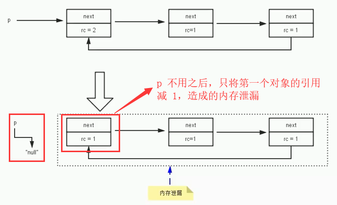

> 举例

```java
public class RefCount {
    private byte[] bytes = new byte[1024 * 1024 * 5];

    Object reference = null;

    public static void main(String[] args) {
    RefCount refCount1 = new RefCount();
    RefCount refCount2 = new RefCount();

    refCount1.reference = refCount2;
    refCount2.reference = refCount1;

    refCount1 = null;
    refCount2 = null;

    /**
     * 显示调用 GC，对比没有 GC 的情况
     * 如果回收了，则说明没有使用引用计数算法
     */
    System.gc();
    }
}
```

* 没有回收时

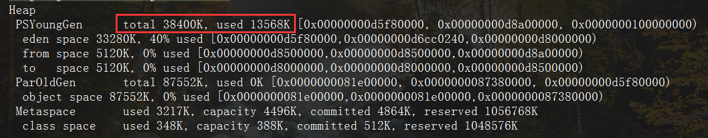

* 有回收时

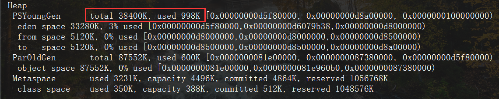

**说明没有使用引用计数算法** 


> 小结

​	引用计数算法，是很多语言的资源回收选择，例如因人工智能而更加火热的 **Python，它更是同时支持引用计数和垃圾收集机制** 

​	具体哪种最优是要看场景的，业界有大规模实践中仅保留引用计数机制，以提高吞吐量的尝试

> Python如何解决循环引用？

​	手动解除：很好理解，就是在合适的时机，解除引用关系

​	使用弱引用 **weakref**，**weakref** 是 **Python** 提供的标准库，旨在解决循环引用


### 2.2 标记阶段-可达性分析算法

也可以叫做==**根搜索算法、追踪性垃圾收集**== 

​	相对于引用计数算法而言，可达性分析算法不仅同样具备实现简单和执行高效等特点，更重要的是**该算法可以有效地解决在引用计数算法中==循环引用==的问题，防止内存泄漏的发生** 

​	相较于引用计数算法，这里的可达性分析就是 Java、c# 选择的。这种类型的垃圾收集通常也叫作追**踪性垃圾收集** 


所谓 **"GC Roots" 根集合就是一组必须活跃的引用** 

基本思路：

​	可达性分析算法是**以根对象集合（ GC Roots）为起始点**，按照从上至下的方式搜索被根对象集合所连接的目标对象是否可达

​	使用可达性分析算法后，内存中的存活对象都会被根对象集合直接或间接连接着，搜索所走过的路径称为**引用链** 

​	如果目标对象没有任何引用链相连，则是不可达的，就意味着该对象己经死亡，可以标记为垃圾对象 

​	在可达性分析算法中，只有能够被根对象集合直接或者间接连接的对象才是存活对象

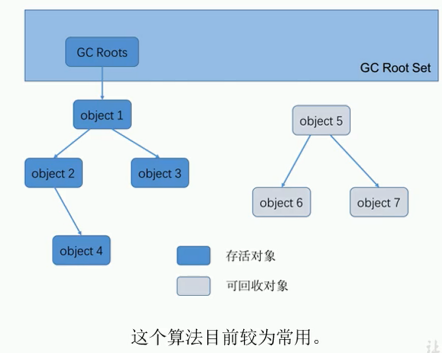


> 在 Java 语言中， GC Roots 包括以下几类元素：

1、虚拟机栈中引用的对象
	比如：各个线程被调用的方法中使用到的参数、局部变量等

2、本地方法栈内 **JNI**（通常说的本地方法）引用的对象

3、方法区中**类静态属性**引用的对象
	比如：Java 类的引用类型静态变量

4、方法区中**常量**引用的对象
	比如：字符串常量池（ String Table）里的引用

5、所有被同步锁 **synchronized** 持有的对象

6、Java 虚拟机内部的引用
	基本数据类型对应的 Class 对象，一些常驻的异常对象（如：NullPointerException、OutOfMemoryError），系统类加载器

7、反映 Java 虛拟机内部情况的 JMXBean、JVMTI 中注册的回调、本地代码缓存等


* 小技巧

​	由于 **Root** 采用栈方式存放变量和指针，所以如果一个指针，它保存了堆内存里面的对象，但是自己又不存放在堆内存里面，那它就是一个 **Root** 


* 注意

​	如果要使用可达性分析算法来判断内存是否可回收，那么**分析工作必须在个能保障一致性的快照中进行**。这点不满足的话分析结果的准确性就无法保证

​	这点也是导致 **GC 进行时必须  "Stop The World"** 的一个重要原因，即使是号称（几乎）不会发生停顿的 CMS 收集器中，枚举根节点时也是必须要停顿的

​    

> HotSpot 获取根节点的方法

​	我们以可达性分析算法中从 GC Roots 集合找引用链这个操作作为介绍虚拟机高效实现的第一个例子

​	**固定可作为 GC Roots 的节点主要在==全局性的引用==（例如常量或类静态属性）与==执行上下文==（例如栈帧中的局部变量表）中**，尽管目标明确，但査找过程要做到高效并非一件容易的事情，现在 Java 应用越做越庞大，光是方法区的大小就常有数百上千兆，里面的类、常量等更是恒河沙数，**若要逐个检查以这里为起源的引用肯定得消耗不少时间** 

​	其实并不需要一个不漏地检查完所有执行上下文和全局的引用位置，虚拟机应当是有办法直接得到哪些地方存放着对象引用的

​	在 **HotSpot** 的解决方案里，是**==使用一组称为 Oop Map 的数据结构==**来达到这个目的。一旦类加载动作完成的时候， HotSpot 就会把对象内什么偏移量上是什么类型的数据计算出来，在即时编译过程中，也会在特定的位置记录下栈里和寄存器里哪些位置是引用，这样收集器在扫描时就可以直接得知这些信息了，并不需要真正一个不漏地从方法区等       GC Roots 开始查找


### 2.3 对象的 finalization 机制

​	Java 语言提供了对象终止（ finalization）机制来**允许开发人员提供对象被销毁之前的自定义处理逻辑** 

​    当垃圾回收器发现没有引用指间一个对象，即：**垃圾回收此对象之前，总会先调用这个对象的 finalize() 方法** 

​    **finalize()** 方法允许在子类中被重写，用于在对象被回收时进行资源释放。**通常在这个方法中进行一些资源释放和清理的工作**，比如关闭文件、套接字和数据库连接等

> **==永远不要主动调用某个对象的 finalize() 方法，应该交给垃圾回收机制调用==** 

​    1、在 **finalize()** 时可能会导致对象复活

​    2、**finalize()** 方法的执行时间是没有保障的，它完全由 GC 线程决定，极端情况下，若不发生 GC，则 **finalize()** 方法将没有执行机会

​    3、一个糟糕的 **finalize()** 会严重影响 GC 的性能


> 由于 **finalize()** 方法的存在，虚拟机中的对象一般处于三种可能的状态

​    如果从所有的根节点都无法访问到某个对象，说明对象己经不再使用了。一般来说此对象需要被回收。但事实上，也并非是 “非死不可” 的，这时候它们暂时处于 “缓刑” 阶段。**一个无法触及的对象有可能在某一个条件下 “复活” 自己，如果这样，那么对它的回收就是不合理的**，为此，定义虚拟机中的对象可能的三种状态：

1、可触及的：从根节点开始，可以到达这个对象

2、可复活的：对象的所有引用都被释放，但是对象有可能在 **finalize()** 中复活

3、不可触及的：对象的 **finalize()** 被调用，并且没有复活，那么就会进入不可触及状态。不可触及的对象不可能被复活，因为 **==finalize() 只会被调用一次==** 

以上 3 种状态中，是由于 **finalize()** 方法的存在，进行的区分。只有在对象不可触及时才可以被回收


> 对象回收具体过程

1、如果对象 **objA** 到 **GC Roots** 没有引用链，则进行**第一次标记** 

2、进行筛选，判断此对象是否有必要执行 **finalize()** 方法

​    如果对象 **objA** 没有重写 **finalize()** 方法或者 **finalize()** 方法已经被虚拟机调用过，则虚拟机视为 “没有必要执行”，**objA** 被判定为不可触及的

​    如果对象 **objA** 重写了 **finalize()** 方法，且还未执行过，那么 **objA** 会被插入到 **F-Queue** 队列中，由一个虚拟机自动创建的、低优先级的 **Finalizer** 线程触发其 **finalize()** 方法执行

​    **finalize()** 方法是对象逃脱死亡的最后机会，稍后 **GC** 会对 **F-Queue** 队列中的对象进行第二次标记。如果 **objA** 在**finalize()** 方法中与引用链上的任何一个对象建立了联系，那么在第二次标记时，**objA** 会被移出 “即将回收” 集合。之后，对象会再次出现没有引用存在的情况。在这个情况下，**finalize()** 方法不会被再次调用，对象会直接变成不可触及的状态，也就是说，**==一个对象的 finalize 方法只会被调用一次==** 

​    要尽量避免使用该方法，因为它并不能等同于 C 和 C++ 语言中的析构函数，而是 Java 刚诞生时为了使传统    C、C++ 程序员更容易接受 Java 所做出的一项妥协。**它的运行代价高昂，不确定性大，无法保证各个对象的调用顺序，如今已被官方明确声明为不推荐使用的语法**。有些教材中描述它适合做 “关闭外部资源” 之类的清理性工作，这完全是对finalize() 方法用途的一种自我安慰。finalize() 能做的所有工作，使用 try-finally 或者其他方式都可以做得更好、更及时，所以建议大家完全可以忘掉 Java 语言里面的这个方法

> 代码复活演示

```java
public class ReLive {
    public static ReLive obj;  // 类变量

    @Override
    protected void finalize() throws Throwable {
    super.finalize();
    System.out.println("调用当前类的 finalize 方法....");
    obj = this;
    }

    public static void main(String[] args) {

    try {
        obj = new ReLive();

        // 第一次拯救自己
        obj = null;
        System.gc();
        System.out.println("第一次 GC");
        // 因为 Finalizer 线程优先级很低，等待一会儿，让它执行
        Thread.sleep(2000);
        if (obj == null) {
        System.out.println("obj is dead");
        } else {
        System.out.println("obj is alive");
        }

        obj = null;
        System.gc();
        System.out.println("第二次 GC");
        Thread.sleep(2000);
        if (obj == null) {
        System.out.println("obj is dead");
        } else {
        System.out.println("obj is alive");
        }


    } catch (InterruptedException e) {
        e.printStackTrace();
    }
    }
}
```

* 执行结果

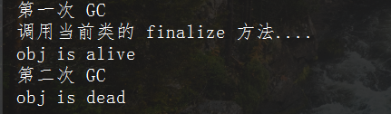


### 2.4 清除阶段: 标记-清除算法

​    当成功区分出内存中存活对象和死亡对象后，**GC** 接下来的任务就是执行拉圾回收，释放掉无用对象所占用的内存空间，以便有足够的可用内存空间为新对象分配内存

​    目前在 **JVM** 中比较常见的三种垃圾收集算法是 **标记一清除算法、复制算法、标记-压缩算法** 

​    标记-清除算法（**Mark- Sweep**）是一种非常基础和常见的垃圾收集算法，该算法被 **J.McCarthy** 等人在1960年提出并应用于 **Lisp** 语言


> 执行过程

​    当堆中的有效内存空间（ available memory）被耗尽的时候，就会停止整个程序（也被称为 Stop The World）然后进行两项工作，第一项则是**标记**，第二项则是**清除** 

​    标记：**Collector** 从引用根节点开始遍历，**标记所有被引用的对象。一般是==在对象的 Header 中记录为可达对象==** 
​    清除：**Collector** 对堆内存从头到尾进行线性的遍历，如果发现某个对象在其 **Header** 中没有标记为可达对象，则将其回收

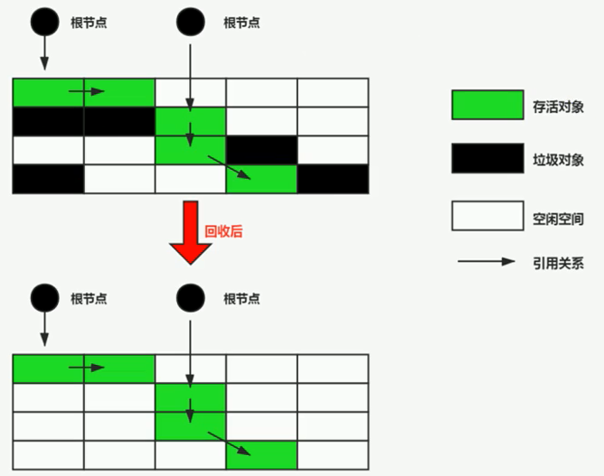


* 缺点

效率不算高

在进行GC的时候，需要停止整个应用程序，导致用户体验差

这种方式**清理出来的空闲内存是不连续的，会产生内存碎片**，需要维护一个空闲列表


> 何为清除？

​    这里所谓的清除并不是真的置空，而是把需要清除的对象地址保存在空闲的地址列表里。下次有新对象需要加载时，判断垃圾的位置空间是否够，如果够，就存放（覆盖）


### 2.5 清除阶段：复制算法

​    **为了解决标记-清除算法在垃圾收集==效率==方面的缺陷**，**M.L.Minsky** 于 1963 年发表了著名的论文，“使用双存储区的Lisp 语言垃圾收集器 CA LISP Garbage Collector Algorithm Using Serial Secondary Storage”。**M.L.Minsky 在该论文中描述的算法被人们称为复制（ Copying）算法**，它也被 M.L.Minsky 本人成功地引入到了 Lisp 语言的一个实现版本中

> 算法思想

​    **将活着的内存空间分为两块，每次只使用其中一块**，在垃圾回收时将正在使用的内存中的存活对象复制到未被使用的内存块中，之后清除正在使用的内存块，交换两个内存的角色，最后完成垃圾回收

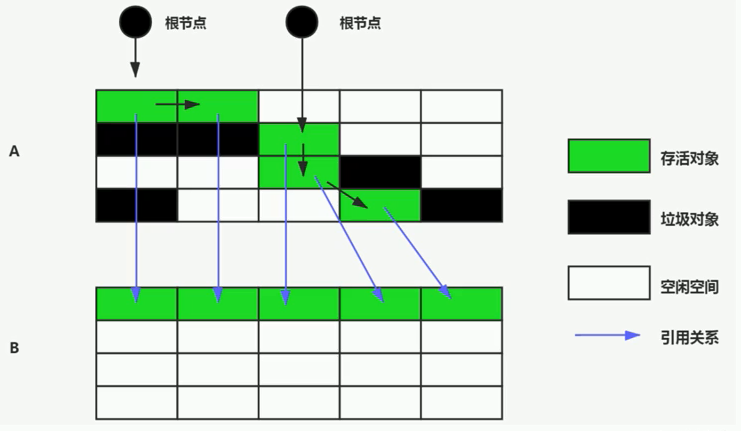

* 优点

1、没有标记和清除过程，实现简单，运行高效

2、复制过去以后保证空间的连续性，不会出现 “碎片” 问题

* 缺点

1、此算法的缺点也是很明显的，就是需要两倍的内存空间

2、对于 G1 这种分拆成为大量 region 的 GC，复制而不是移动，意味着 GC 需要维护 region 之间对象引用关系，不管是内存占用或者时间开销也不小

* 特别的

​    如果系统中的垃圾对象很多，复制算法不是很理想，因为**复制算法需要复制的存活对象数量并不会太多**，或者说非常低才行


### 2.6 清除阶段：标记-压缩算法

> 也叫做**标记-整理算法** 

​    **复制算法的高效性是建立在==存活对象少、垃圾对象多==的前提下的**。这种情况在新生代经常发生，但是在老年代，更常见的情况是大部分对象都是存活对象。如果依然使用复制算法由于存活对象较多，复制的成本也将很高。因此，**基于老年代垃圾回收的特性，需要使用其他的算法 ** 

​    标记一清除算法的确可以应用在老年代中，但是该算法不仅执行效率低下，而且在执行完存回收后迅会产生内存碎片，所以 JVM 的设计者需要在此基础之上进行改进。**标记压缩（Mark- Compact）算法**由此诞生

> 执行过程

第一阶段和标记清除算法一样从根节点开始标记所有被引用对象

第二阶段将所有的存活对象压缩到内存的一端，按顺序排放

之后，清理边界外所有的空间


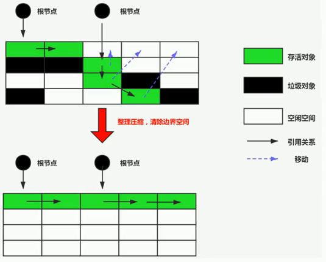


* 优点

1、消除了标记-清除算法当中，内存区域分散的缺点，我们需要给新对象分配内存时，JVM 只需要持有一个内存的起始地址即可

2、消除了复制算法当中，内存减半的高额代价

* 缺点

1、从效率上来说，标记-整理算法要低于复制算法

2、移动对象的同时，如果对象被其他对象引用，则还需要调整引用的地址

3、移动过程中，需要全程暂停用户应用程序。即：STW


### 2.7 清除阶段三种算法比较

|              | Mark-Sweep     | Mark-Compact | Copying               |
| ------------ | -------------- | ------------ | --------------------- |
| 速度         | 中等           | 最慢         | 最快                  |
| 空间开销     | 少（但有碎片） | 少（无碎片） | 通常需要存活对象的2倍 |
| 是否移动对象 | 否             | 是           | 是                    |


​    效率上来说，复制算法是当之无愧的老大，但是却浪费了太多内存

​    而为了尽量兼顾上面提到的三个指标，**标记-整理算法相对来说更平滑一些，但是效率上不尽如人意**，它比复制算法多了一个标记的阶段，比标记-清除多了一个整理内存的阶段


### 2.8 分代收集算法

​    分代收集算法，是基于这样一个事实：不同的对象的生命周期是不一样的。因此，**不同生命周期的对象可以采取不同的收集方式，以便提高回收效率**。一般是把 Java 堆分为新生代和老年代，这样就可以根据各个年代的特点使用不同的回收算法，以提高垃圾回收的效率

​    在 Java 程序运行的过程中，会产生大量的对象，其中有些对象是与业务信息相关，比如 Http 请求中的 Session 对象、线程、Socket 连接，这类对象跟业务直接挂钩，因此生命周期比较长。但是还有一些对象，主要是程序运行过程中生成的临时变量，这些对象生命周期会比较短，比如：String 对象，由于其不变类的特性，系统会产生大量的这些对象，有些对象甚至只用一次即可回收

​    **==目前几乎所有的 GC 都是采用分代收集算法执行垃圾回收的==** 

在 HotSpot 中，基于分代的概念，GC 所使用的内存回收算法必须结合年轻代和老年代各自的特点

* 年轻代
    * 年轻代特点：区域相对老年代较小，对象生命周期短、存活率低，回收频繁

​    **这种情况使用==复制算法==的回收整理，速度是最快的**。复制算法的效率只和当前存活对象大小有关，因此很适用于年轻代的回收。而复制算法内存利用率不高的问题，通过 **Hotspot** 中的两个 **survivor** 的设计得到缓解

* 老年代
    * 老年代特点：区域较大，对象生命周期长、存活率高，回收不及年轻代频繁

​    这种情况存在大量存活率高的对象，复制算法明显变得不合适。**一般是由标记-清除或者是标记-清除与标记整理的混合实现** 
​    **Mark** 阶段的开销与存活对象的数量成正比
​    **Sweep** 阶段的开销与所管理区域的大小成正相关
​    **Compact** 阶段的开销与存活对象的数据成正比

​    以 **Hotspot** 中的 **CMS** 回收器为例，**CMS** 是基于 **Mark- Sweep** 实现的，对于对象的回收效率很高。对于碎片问题，**CMS** 采用基于 **Mark-Compact** 算法的 **Serial Old** 回收器作为补偿措施：当内存回收不佳，将采用 **Serial Old** 执行 **Full GC**以达到对老年代内存的整理

​    分代的思想被现有的虚拟机广泛使用。几乎所有的垃圾回收器都区分新生代和老年代


### 2.9 增量收集算法

​    上述现有的算法，在垃圾回收过程中，应用软件将处于一种 Stop the World 的状态。在 Stop the World 状态下，应用程序所有的线程都会挂起，暂停切正常的工作，等待垃圾回收的完成。**如果垃圾回收时间过长，应用程序会被挂起很久，将严重影响用户体验或者系统的稳定性**。为了解决这个问题，对实时垃圾收集算法的研究直接导致了增量收集（ Incremental Collecting）算法的诞生

> 算法思想

​    如果一次性将所有的垃圾进行处理，需要造成系统长时间的停顿，那么就**可以让垃圾收集线程和应用程序线程交替执行**。每次，垃圾收集线程只收集一小片区域的内存空间，接着切换到应用程序线程。依次反复，直到垃圾收集完成

​    总的来说，增量收集算法的基础仍是传统的标记-清除和复制算法。增量收集算法通过**对线程间冲突的妥善处理，允许垃圾收集线程以分阶段的方式完成标记、清理或复制工作** 


* 缺点

​    使用这种方式，由于在垃圾回收过程中，间断性地还执行了应用程序代码，所以能减少系统的停顿时间。但是，**因为线程切换和上下文转换的消耗，会使得垃圾回收的总体成本上升，造成==系统吞吐量的下降==** 


### 2.10 分区算法

​    一般来说，在相同条件下，堆空间越大，一次 GC 时所需要的时间就越长，有关 GC 产生的停顿也越长。**为了更好地控制 GC 产生的停顿时间，将一块大的内存区域分割成多个小块**，根据目标的停顿时间，每次合理地回收若干个小区间，而不是整个堆空间，从而减少一次 GC 所产生的停顿

​    **分代算法**将按照对象的生命周期长短划分成两个部分，**分区算法将==整个堆空间==**划分成连续的不同小区间

​    每一个小区间都独立使用，独立回收。这种算法的**好处是可以控制一次回收多少个小区间** 


## 3、垃圾回收相关概念

### 3.1 System.gc() 的理解

​    在默认情况下，通过 System.gc()（或者 **Runtime.getRuntime().gc()**）的调用，会**显式触发 Full GC**，同时对老年代和新生代进行回收，尝试释放被丢弃对象占用的内存

​    然而 **System.gc()** 调用附带一个免责声明，**无法保证对垃圾收集器的调用** 

​    **JVM** 实现者可以通过 **System.gc()** 调用来决定 **JVM** 的 **GC** 行为。而一般情况下，垃圾回收应该是自动进行的，无须手动触发，否则就太过于麻烦了。在些特殊情况下，如我们正在编写一个性能基准，我们可以在运行之间调用 **System.gc()** 

```java
public class SystemGCTest {
    public static void main(String[] args) {
    new SystemGCTest();
    System.gc();   // 底层 Runtime.getRuntime().gc();

    // 强制调用失去引用对象的 finalize 方法
    System.runFinalization();
    }

    @Override
    protected void finalize() throws Throwable {
    super.finalize();
    System.out.println("SystemGCTest 重写了 finalize 方法");
    }
}
```


### 3.2 内存溢出

​    内存溢出相对于内存泄漏来说，尽管更容易被理解，但是同样的，内存溢出也是引发程序崩溃的罪魁祸首之一

​    由于 GC 一直在发展，所有一般情况下，除非应用程序占用的内存增长速度非常快，造成垃圾回收已经跟不上内存消耗的速度，否则不太容易出现 OOM 的情况

​    大多数情况下，GC 会进行各种年龄段的垃圾回收，实在不行了就放大招来一次独占式的 **Full GC** 操作，这时候会回收大量的内存，供应用程序继续使用

​    **javadoc** 中对 **OutOfMemoryError** 的解释是，**没有空闲内存，并且垃圾收集器也无法提供更多内存** 


> **==没有空闲内存==**的情况：说明 Java 虛拟机的堆内存不够，原因有二

1、Java 虚拟机的堆内存设置不够

​    比如：可能存在内存泄漏问题，也很有可能就是堆的大小不合理，比如我们要处理比较可观的数据量，但是没有显式指定 **Java** 堆大小或者指定数值偏小。我们可以通过参数 **-Xms、-Xmx** 来调整

2、代码中创建了大量大对象，并且长时间不能被垃圾收集器收集（存在被引用）

​    对于老版本的 **Oracle JDK**，因为永久代的大小是有限的，并且 **JVM** 对永久代垃圾回收（如，常量池回收、卸载不再需要的类型）非常不积极，所以当我们不断添加新类型的时候，永久代出现 **OutOfMemoryError** 也非常多见，尤其是在运行时存在大量动态类型生成的场合；**类似 intern 字符串缓存占用太多空间，也会导致 OOM 问题**。对应的异常信息，标记出来和永久代相关：**"java.lang.OutOfMemoryError ：PermGen space"**

​    随着元数据区的引入，方法区内存已经不再那么窘迫，所以相应的 OOM 有所改观，出现  OOM，异常信息则变成了 **"java.lang.OutOfMemoryErro：:Metaspace"**。直接内存不足，也会导致 OOM


> 垃圾收集器无法提供更多的内存空间

​    在抛出 **OutOfMemoryError** 之前，通常垃圾收集器会被触发，尽其所能的释放出空间

​    当然，也不是在任何情况下垃圾收集器都会被触发的，比如，我们去分配一个超大对象，类似一个超大数组超过堆的最大值，**JVM** 可以判断出垃圾收集并不能解决这个问题，所以直接抛出 **OutOfMemoryError** 


### 3.3 内存泄漏

严格来说，**==只有对象不会再被程序用到了，但是 GC 又不能回收他们的情况，才叫内存泄漏==** 

​    但实际情况很多时候一些不太好的实践（或疏忽）会导致对象的生命周期变得很长甚至导致 OOM，也可以叫做宽泛意义上的 "内存泄漏"

​    尽管内存泄漏并不会立刻引起程序崩溃，但是一旦发生内存泄漏，程序中的可用内存就会被逐步蚕食，直至耗尽所有内存，最终出现 **OutOfMemoryError** 异常导致程序崩溃

> 注意，这里的存储空间并不是指物理内存，而是指虚拟内存大小，这个虚拟内存大小取决于磁盘交换区设定的大小


举例

​    1、单例模式：单例的生命周期和应用程序是一样长的，所以单例程序中，如果持有对外部对象的引用的话，那么这个外部对象是不能被回收的，则会导致内存泄漏的产生

​    2、一些提供 **close** 的资源未关闭导致内存泄漏，数据库连接（dataSource.getConnection()，网络连接（ socket）和 io 连接**必须手动 close，否则是不能被回收的** 

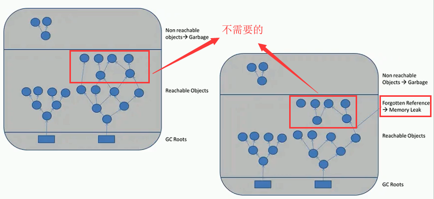


### 3.4 Stop the World

​    **Stop the World**，简称 **STW**，指的是 **GC** 事件发生过程中，会产生应用程序的停顿。停顿产生时整个应用程序线程都会被暂停，没有任何响应有点像卡死的感觉，这个停顿称为 **STW** 

​    可达性分析算法中枚举根节点（ GC Roots）会导致所有 Java 执行线程停顿

* 分析工作必须在一个能确保一致性的快照中进行
* 一致性指整个分析期间整个执行系统看起来像被冻结在某个时间点上
* 如果出现分析过程中对象引用关系还在不断变化，则分析结果的准确性无法保证


​    被 STW 中断的应用程序线程会在完成 GC 之后恢复，频繁中断会让用户感觉像是网速不快造成电影卡带一样，所以我们需要减少 STW 的发生

​    STW 事件和采用哪款 GC 无关，所有的 GC 都有这个事件

​    STW 是 JVM 在后台自动发起和自动完成的。在用户不可见的情况下，把用户正常的工作线程全部停掉

​    开发中不要用 **System.gc()，会导致 Stop the World 的发生** 

```java
public class StopTheWorldTest {
    public static class WorkThread extends Thread {
    List<byte[]> list = new ArrayList<>();

    @Override
    public void run() {
        try {
        while (true) {
            for (int i = 0; i < 1000; i++) {
            byte[] buffer = new byte[1024];
            list.add(buffer);
            }

            if (list.size() > 10000) {
            list.clear();
            System.gc();
            }
        }
        } catch (Exception e) {
        e.printStackTrace();
        }
    }
    }

    public static class PrintThread extends Thread {
    public final long startTime = System.currentTimeMillis();

    @Override
    public void run() {
        try {
        while (true) {
            long time = System.currentTimeMillis() - startTime;
            System.out.println(time / 1000 + "." + time % 1000);
            Thread.sleep(1000);
        }
        } catch (Exception e) {
        e.printStackTrace();
        }
    }
    }

    public static void main(String[] args) {
    WorkThread workThread = new WorkThread();
    PrintThread printThread = new PrintThread();

    workThread.start();
    printThread.start();
    }
}
```


### 3.5 垃圾回收的并行与并发

并发和并行，在谈论垃**圾收集器的上下文语境中**，它们可以解释如下：

​    并行（Parallel）：指多条垃圾收集线程并行工作，但此时用户线程仍处于等待状态

​    串行（ Serial）：相较于并行的概念，单线程执行，如果内存不够，则程序暂停，启动 JVM 垃圾回收器进行垃圾回收。回收完成，再启动程序线程

​    并发 （Concurrent）：指用户线程与垃圾收集线程同时执行（但不一定是并行的，可能会交替执行），垃圾回收线程在执行时不会停顿用户程序的运行。用户程序在继续运行，而垃圾收集程序线程运行于另一个CPU上；如：CMS、G1


### 3.6 安全点和安全区域

> 安全点

​    程序执行时并非在所有地方都能停顿下来开始 GC，只有在特定的位置才能停顿下来开始 GC，**这些位置称为    "安全点（ Safe point）"** 

​    **Safe point 的选择很重要，如果太少可能导致 GC 等待的时间太长，如果太频繁可能导致运行时的性能问题**。大部分指令的执行时间都非常短暂，**==通常会根据 "是否具有让程序长时间执行的特征" 为标准==**。比如：选择些执行时间较长的指令作为 Safe Point，如方法调用、循环跳转和异常跳转等

> 如何在 GC 发生时，检査所有线程都跑到最近的安全点停顿下来呢？

**抢先式中断**（目前没有虚拟机采用了）
    首先中断所有线程。如果还有线程不在安全点，就恢复线程，让线程跑到安全点

**主动式中断**
    设置一个中断标志，各个线程运行到 Safe point 的时候主动轮询这个标志，如果中断标志为真，则将自己进行中断挂起


> 安全区域（ Safe Region）

​    Safe point 机制保证了程序执行时，在不太长的时间内就会遇到可进入的 Safe point。但是，程序 “不执行” 的时候呢？例如**线程处于 Sleep 状态或 Blocked 状态，这时候线程无法响应 JVM 的中断请求**，“走” 到安全点去中断挂起，   JVM 也不太可能等待线程被唤醒。**对于这种情况，就需要==安全区域（ Safe Region）==来解决** 

​    **安全区域是指在一段代码片段中，对象的引用关系不会发生变化，在这个区域中的任何位置开始 GC 都是安全的**。我们也可以把 Safe Region 看做是被扩展了的 Safe point


> 实际执行

​    1、当线程运行到 Safe Region 的代码时，首先标识已经进入了 Safe Region，如果这段时间内发生 GC，JVM 会忽略标识为 Safe Region 状态的线程

​    2、当线程即将离开 Safe Region 时，会检查 JVM 是否已经完成 GC，如果完成了，则继续运行，否则线程必须等待直到收到可以安全离开 Safe Region 的信号为止


### 3.7 再谈引用

​    我们希望能描述这样一类对象：当内存空间还足够时，则能保留在内存中；如果内存空间在进行垃圾收集后还是很紧张，则可以抛弃这些对象

> 【既偏门又非常高频的面试题】强引用、软引用、弱引用、虚引用有什么区别？具体使用场景是什么？

​    在 **JDK1.2** 之后，Java 对引用的概念进行了扩充，将引用分为**强引用**（Strong Reference）、**软引用**（ Soft Reference）、**弱引用**（ Weak Reference）、**虚引用**（ Phantom reference）4种，**这 4 种引用强度依次逐渐减弱** 

​    除强引用外，其他 3 种引用均可以在 **java.lang.ref** 包中找到它们的身影。如下图，显示了这3种引用类型对应的类，开发人员可以在应用程序中直接使用它们

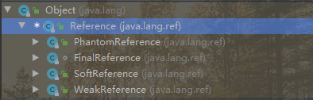

> 强引用（ StrongReference）

​    最传统的 “引用” 的定义，是指在程序代码之中普遍存在的引用赋值，即类似 “Object obj= new Object（）” 这种引用关系。**无论任何情况下只要强引用关系还存在，垃圾收集器就永远不会回收掉被引用的对象** 

> 软引用（ SoftReference）

​    **在系统将要发生内存溢出之前，将会把这些对象列入回收范围之中进行第二次回收**。如果这次回收后还没有足够的内存，才会抛出内存溢出异常

> 弱引用（ WeakReference）

​    **被弱引用关联的对象只能生存到下一次垃圾收集之前**。当下一次垃圾收集器工作时，无论内存空间是否足够，都会回收掉被弱引用关联的对象

> 虚引用（ PhantomReference）

​    一个对象是否有虚引用的存在，完全不会对其生存时间构成影响，也无法通过虚引用来获得一个对象的实例。**为一个对象设置虚引用关联的唯一目的就是能在这个对象被收集器回收时收到一个系统通知** 


#### 3.7.1 强引用

​    在 Java 程序中，最常见的引用类型是强引用（普通系统99%以上都是强引用），也就是我们最常见的普通对象引用，也是默认的引用类型

​    当在 Java 语言中使用 new 操作符创建一个新的对象，并将其赋值给一个变量的时候，这个变量就成为指向该对象的一个强引用

​    只要强引用的对象是可触及的，垃圾收集器就永远不会回收掉被引用的对象

​    对于一个普通的对象，如果没有其他的引用关系，只要超过了引用的作用域或者显式地将相应（强）引用赋值为null，就是可以当做垃圾被收集了，当然具体回收时机还是要看垃圾收集策略

​    相对的，**软引用、弱引用和虚引用的对象是软可触及、弱可触及和虚可触及的**，在定条件下，都是可以被回收的。所以，**强引用是造成 Java 内存泄漏的主要原因之一** 


#### 3.7.2 软引用

​    **软引用是用来描述一些==还有用，但非必需==的对象。只被软引用关联着的对象，在系统将要发生内存溢出异常前，会把这些对象列进回收范围之中进行第二次回收**，如果这次回收还没有足够的内存，才会抛出内存溢出异常

​    **软引用通常用来实现内存敏感的==缓存==**。比如：高速缓存就有用到软引用。如果还有空闲内存，就可以暂时保留缓存，当内存不足时清理掉，这样就保证了使用缓存的同时，不会耗尽内存

​    垃圾回收器在某个时刻决定回收软可达的对象的时候，会清理软引用，并可选地把引用存放到一个引用队列

​    类似弱引用，只不过 Java 虚拟机会尽量让软引用的存活时间长一些，迫不得已才清理


在 JDK1.2 版之后提供了 **java.lang.ref.SoftReference** 类来实现软引用

```java
Object object = new Object();
SoftReference<Object> softReference = new SoftReference<>(object);
object = null;  // 销毁强引用
```

```java
public class SoftRefTest {

    public static class User {
    private int id;
    private String name;

    public User(int id, String name) {
        this.id = id;
        this.name = name;
    }

    @Override
    public String toString() {
        return "Usesr{" +
            "id=" + id +
            ", name='" + name + '\'' +
            '}';
    }
    }

    public static void main(String[] args) {
    // -Xms10m -Xmx10m
    SoftReference<User> softRef = new SoftReference<>(new User(1, "徐凤年"));

    System.gc();
    System.out.println("After GC " + softRef.get());

    try {
        byte[] bytes = new byte[1024 * 1024 * 20]; // 制造资源紧张
    } catch (Throwable e) {
        e.printStackTrace();
    } finally {
        System.out.println(softRef.get()); // 若资源紧张时会回收软引用，则此处为 null
    }
    }
}
```

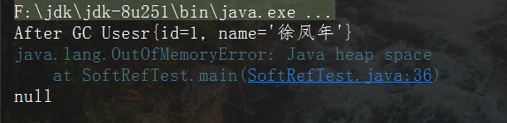


#### 3.7.3 弱引用

​    弱引用也是用来描述那些非必需对象，被弱引用关联的对象只能生存到下一次垃圾收集发生为止。**在系统 GC 时，只要发现弱引用，不管系统堆空间使用是否充足，都会回收掉只被弱引用关联的对象** 

​    但是，**由于垃圾回收器的线程通常优先级很低，因此，并不一定能很快地发现持有弱引用的对象**。在这种情况下，弱引用对象可以存在较长的时间

​    弱引用和软引用一样，**在构造弱引用时，也可以指定一个引用队列，当弱引用对象被回收时，就会加入指定的引用队列，通过这个队列可以跟踪对象的回收** 

​    **软引用、弱引用都非常适合来保存那些可有可无的缓存数据**。如果这么做，系统内存不足时，这些缓存数据会被回收，不会导致内存溢出。而当内存资源充足时，这些缓存数据又可以存在相当长的时间，从而起到加速系统的作用


```java
public static class User {
    private int id;
    private String name;

    public User(int id, String name) {
    this.id = id;
    this.name = name;
    }

    @Override
    public String toString() {
    return "Usesr{" +
        "id=" + id +
        ", name='" + name + '\'' +
        '}';
    }
}

public static void main(String[] args) {
    WeakReference<User> weakRef=new WeakReference<>(new User(1,"徐凤年"));

    System.out.println(weakRef.get());
    System.gc();
    System.out.println("After GC");
    System.out.println(weakRef.get());
}
```

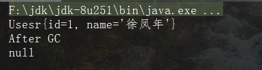


#### 3.7.4 虚引用

​    也称为 “幽灵引用” 或者 “幻影引用”，是所有引用类型中最弱的一个

​    一个对象是否有虚引用的存在，完全不会决定对象的生命周期。**如果一个对象仅持有虚引用，那么它和没有引用几乎是一样的，随时都可能被垃圾回收器回** 

​    它不能单独使用，也无法通过虚引用来获取被引用的对象。**当试图通过虚引用的 get() 方法取得对象时，总是 null ** 

​    **==为一个对象设置虚引用关联的唯一目的在于跟踪垃圾回收过程==**。比如：能在这个对象被收集器回收时收到一个系统通知

​    **虚引用必须和引用队列一起使用。虚引用在创建时必须提供一个==引用队列==作为参数**。当垃圾回收器准备回收一个对象时，如果发现它还有虚引用，就会在回收对象后，将这个虚引用加入引用队列，以通知应用程序对象的回收情况


```java
public class PhantomRefTest {
    public static PhantomRefTest obj;
    static ReferenceQueue<PhantomRefTest> phantomQueue = null;

    public static class CheckQueue extends Thread {
    @Override
    public void run() {
        while (true) {
        if (phantomQueue != null) {
            PhantomReference<PhantomRefTest> objt = null;
            try {
            objt = (PhantomReference<PhantomRefTest>) phantomQueue.remove();
            } catch (Exception e) {
            e.printStackTrace();
            }
            if (objt != null) {
            System.out.println("追踪垃圾回收过程：PhantomRefTest 被GC了");
            }
        }
        }
    }
    }

    @Override
    protected void finalize() throws Throwable {
    System.out.println("调用当前类的 finalize 方法");
    obj = this;
    }

    public static void main(String[] args) {
    Thread t = new CheckQueue();
    // 设置为守护线程，当程序中没有非守护线程时，守护线程也将结束
    t.setDaemon(true);
    t.start();

    phantomQueue = new ReferenceQueue<>();
    obj = new PhantomRefTest();

    PhantomReference<PhantomRefTest> phantomRef = new PhantomReference<>(obj, phantomQueue);

    try {
        // 不可获得虚引用中的对象
        System.out.println(phantomRef.get());

        // 去除强引用
        obj = null;
        // 第一次 GC，由于对象可复活，此次GC无法回收
        System.out.println("第一次 GC");
        System.gc();
        Thread.sleep(1000);

        if (obj == null) {
        System.out.println("obj is null");
        } else {
        System.out.println("obj is alive");
        }

        // 第二次 GC
        System.out.println("第二次 GC");
        obj = null;
        System.gc();

        Thread.sleep(1000);

        if (obj == null) {
        System.out.println("obj is null");
        } else {
        System.out.println(" obj is alive");
        }

    } catch (Exception e) {
        e.printStackTrace();
    }
    }
}
```

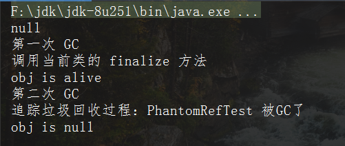


## 4、垃圾回收器


### 4.1 垃圾回收器的性能指标

**吞吐量**：**运行用户代码的时间**占**总运行时间**（程序的运行时间+内存回收的时间）的比例

垃圾收集开销：吞吐量的补数，**圾收集所用时间**与**总运行时间**的比例

**暂停时间**：执行垃圾收集时，程序的工作线程被暂停的时间

收集频率：相对于应用程序的执行，收集操作发生的频率

**内存占用**：Java 堆区所占的内存大小

快速：一个对象从诞生到被回收所经历的时间


​    在设计（或使用）GC 算法时，我们必须确定我们的目标：一个GC算法只可能针对两个目标之一（即只专注于较大吞吐量或最小暂停时间），或尝试找到一个二者的折衷


​    现在标准：**==在最大吞吐量优先的情况下，降低停顿时间==** 


### 4.2 不同的垃圾回收器

​    有了虚拟机，就一定需要收集垃圾的机制，这就是 Garbage Collection（垃圾收集算法），对应的产品我们称为 Garbage Collector（垃圾收集器）


​    1999 年随 JDK 1.3.1 一起发布的是串行方式的 Serial GC，它是第一款 GC。ParNew 垃圾收集器是 Serial 收集器的多线程版本

​    2002 年 2 月 26 日，Parallel GC 和 CMS（Concurrent Mark Sweep）GC 跟随 JDK 1.4.2 一起发布

​    Parallel GC 在 JDK6 之后成为 HotSpot 默认GC

​    2012年，在 JDK1.7u4 版本中，G1 可用

​    2017年，JDK9 中 G1 变成默认的垃圾收集器，以替代 CMS

​    2018年3月，JDK10 中 G1 垃圾回收器的并行完整垃圾回收，实现并行性来改善最坏情况下的延迟

​    2018年9月，JDK11发布。引入 Epsilon 垃圾回收器，又被称为 No-Op（无操作）回收器。同时，引入 ZGC：可伸缩的低延迟垃圾回收器（ Experimental）

​    2019年3月，JDK12 发布。增强 G1，自动返回未用堆内存给操作系统。同时，引入 Shenandoah GC：低停顿时间的 GC（ Experimental）

​    2019年9月，JDK13 发布。增强 ZGC，自动返回未用堆内存给操作系统

​    2020年3月，JDK14 发布。删除 CMS 垃圾回收器。扩展 ZGC 在 macOS 和 Windows 上的应用


> 经典的垃圾回收器

串行：**Serial、 Serial old** 

并行：**ParNew、 Parallel Scavenge、Parallel old** 

并发：**CMS、G1** 

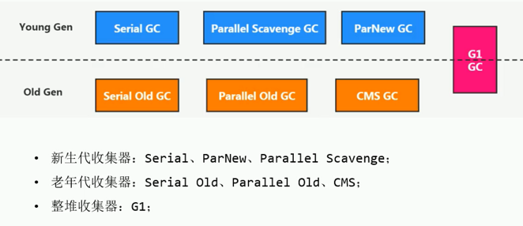


> 垃圾回收器的组合

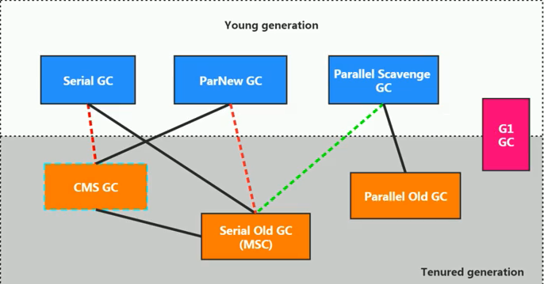

黑色实线是 JDK 8 以前的组合

其中 Serial Old 作为 CMS 出现 "Concurrent Mode Failure" 失败的后备预案

​    红色虚线连接的由于维护和兼容性测试的成本，在 JDK 8 时将 **==Serial + CMS==** 和 **==ParNew + Serial Old==** 这两个组合声明为废弃，并在 JDK9 中完全取消了些组合的支持

绿色虚线 连接的在 JDK14 中，**弃用 ==Parallel Scavenge + Serial Old== Gc组合** 

青色虚线所表示的在 JDK14 中已经删除了 CMS 垃圾回收器


> 查看默认的垃圾回收器

1、**-XX:+PrintCommandLineFlags**：查看命令行相关参数（包含使用的垃圾收集器）

2、使用命令行指令：**jnfo  -flag   相关垃圾回收器参数   进程 ID** 


### 4.3 串行：Serial GC

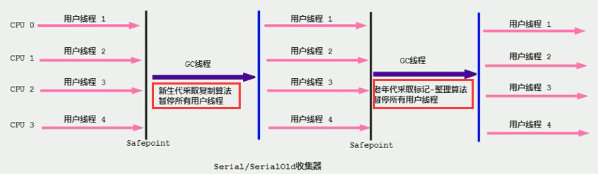


​    Serial 收集器是最基本、历史最悠久的垃圾收集器了，**JDK1.3 之前回收==新生代==唯一的选择** 

​    Serial 收集器作为 Hotspot 中 **==Client 模式==**下的默认新生代垃圾收集器

​    Serial 收集器采用**==复制算法==**、串行回收和 "Stop-the-World" 机制的方式执行内存回收

​    除了年轻代之外， **Serial 收集器还提供用于执行==老年代==垃圾收集的 Serial Old 收集器**， Serial Old 收集器同样也采用了串行回收和 "Stop the World" 机制，只不过**内存回收算法使用的是==标记-压缩算法==** 

​    **Serial Old 是运行在 ==Client 模式==下默认的老年代的垃圾回收器** 


​    Serial Old 在 **==Server 模式下==**主要有两个用途：

1. 与新生代的 Parallel  Scavenge 配合使用 
2. 作为老年代 CMS 收集器失败时的后备垃圾收集方案


* 优势

​    简单而高效（与其他收集器的单线程比），对于限定单个 CPU 的环境来说， Serial 收集器由于**没有线程交互的开销**，专心做垃圾收集自然可以获得最高的单线程收集效率，**运行在 ==Client 模式==下的虚拟机是个不错的选择** 

​    在用户的桌面应用场景中，可用内存一般不大（几十MB至一两百MB），可以在较短时间内完成垃圾收集（几十ms至一百多ms），只要不频繁发生，使用串行回收器是可以接受的


​    在 Hotspot 虚拟机中，使用 **-XX:+UseSerialGC** 参数可以指定年轻代和老年代都使用串行收集器，**等价于新生代用 ==Serial GC==，且老年代用 ==Serial Old GC==** 


* 小结

这种垃圾收集器了解即可，现在已经不用串行的了。而且在限定单核 CPU 才可以用，现在都不是单核的了

对于交互较强的应用而言，这种垃圾收集器是不能接受的。一般在 Java web 应用程序中是不会采用串行垃圾收集器的


### 4.4 并行：ParNew GC

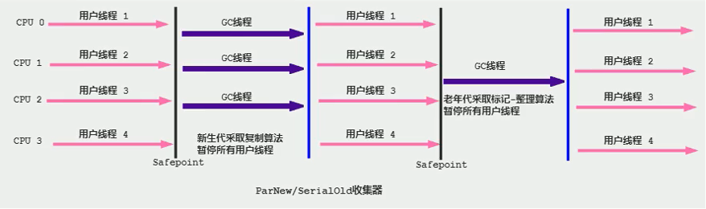


​    **Par 是 Parallel 的缩写，New 表示只能处理新生代**。如果说 **Serial GC** 是年轻代中的**单线程**垃圾收集器，那么 **ParNew** 收集器则是 **Serial** 收集器的**多线程并行版本** 

​    **ParNew** 收集器除了采用并行回收的方式执行内存回收外，与 **Serial** 之间几乎没有任何区别。 **ParNew 收集器在年轻代中同样也是采用==复制算法==、"Stop-the-World" 机制** 

​    ParNew 是很多 JVM 运行在 **==Server 模式下新生代==**的默认垃圾收集器


​    在程序中，开发人员可以通过选项 **-XX:+UseParNewGC 手动指定使用 ParNew 收集器执行内存回收任务**。它表示年轻代使用并行收集器，不影响老年代

​    **-XX:ParallelGCThreads 限制线程数量**，默认开启和 CPU 数据相同的线程数


### 4.5 吞吐量优先：Parallel Scavenge GC

> 也可以直接就叫做 Parallel GC

​    HotSpot 的年轻代中除了拥有 ParNew 收集器是基于并行回收的以外， Parallel  Scavenge 收集器同样也釆用了**复制算法、==并行回收==和 "stop the world" 机制** 

​    和 ParNew 收集器不同，**Parallel Scavenge 收集器的目标则是达到一个==可控制的吞吐量==**（ Throughput），它也被称为吞吐量优先的垃圾收集器

​    **==自适应调节策略==**也是 Parallel  Scavenge 与 ParNew 一个重要区别


​    高吞吐量则可以高效率地利用 CPU 时间，尽快完成程序的运算任务，**主要适合在后台运算而==不需要太多交互==的任务。因此，常见在服务器环境中使用**。例如，那些执行批量处理、订单处理、工资支付、科学计算的应用程序


​    **Parallel 收集器在 JDK 1.6 时提供了用于执行老年代垃圾收集的 ==Parallel Old== 收集器**，用来代替老年代的 Serial Old 收集器，**Parallel Old 收集器采用了==标记-压缩算法==，但同样也是==基于并行==回收和 "Stop-the-World" 机制** 


​    在程序吞吐量优先的应用场景中，Parallel 收集器和 Parallel Old 收集器的组合，在 Server 模式下的内存回收性能很不错，在 Java8 中，默认是此垃圾收集器


### 4.6 低延时：CMS GC

**==JDK 9 及以后该收集器不建议使用，JDK 14 时被删除了==** 

> 老年代垃圾回收器

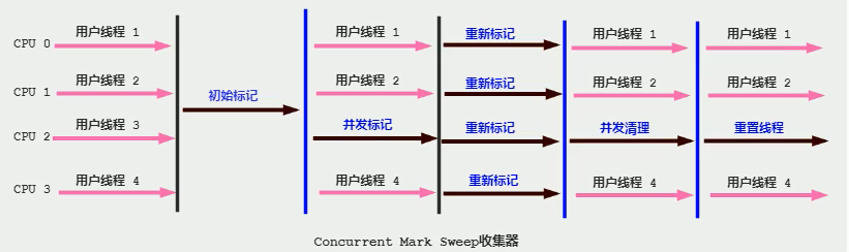


​    在 JDK 1.5 时期， Hotspot 推出了一款在**强交互应用**中几乎可认为有划时代意义的垃圾收集器：CMS（ Concurrent-Mark-Sweep）收集器，**这款收集器是 Hotspot 虚拟机中第一款真正意义上的==并发==收集器，它第一次实现了让==垃圾收集线程与用户线程同时工作==** 

​    CMS 收集器的关注点是尽可能缩短垃圾收集时用户线程的停顿时间。停顿时间越短（低延迟）就越适合与用户交互的程序，良好的响应速度能提升用户体验

​    **CMS 的垃圾收集算法采用==标记-清除算法==，并且也会 "Stop-the- World"** 


​    **不幸的是，CMS 作为老年代的收集器，却无法与 JDK 1.4.0 中已经存在的新生代收集器 Parallel  Scavenge 配合工作**，所以在 JDK 1.5 中使用 CMS 来收集老年代的时候，新生代只能选择 ParNew 或者 Serial 收集器中的一个


​    **CMS** 整个过程比之前的收集器要复杂，整个过程分为 4 个主要阶段，**初始标记阶段、并发标记阶段、重新标记阶段和并发清除阶段** 

> 初始标记阶段（ Initial-Mark），**==该阶段具有 STW 机制==** 

​    在这个阶段中，程序中所有的工作线程都将会因为 "Stop-the-World" 机制而出现短暂的暂停，**这个阶段的主要任务仅仅只是标 GC Roots 能直接关联到的对象。一旦标记完成之后就会恢复之前被暂停的所有应用线程**。由于直接关联对象比较小，所以这里的速度非常快

> 并发标记阶段（ Concurrent-Mark），**==并发执行==** 

​    **从 GC Roots 的直接关联对象开始遍历整个对象图的过程，这个过程耗时较长但是不需要停顿用户线程**，可以与垃圾收集线程一起并发运行

> 重新标记阶段（ Remark），**==该阶段具有 STW 机制==** 

​    由于在并发标记阶段中，程序的工作线程会和垃圾收集线程同时运行或者交叉运行，因此为了**修正并发标记期间，因用户程序继续运作而导致标记产生变动的那一部分对象的标记记录**，这个阶段的停顿时间通常会比初始标记阶段稍长一些，但也远比并发标记阶段的时间短

> 并发清除阶段（ Concurrent- Sweep），**==并发执行==** 

​    **此阶段清理删除掉标记阶段判断的已经死亡的对象，释放内存空间**。由于不需要移动存活对象，所以这个阶段也是可以与用户线程同时并发的


* 分析

​    尽管 CMS 收集器采用的是并发回收（非独占式），但是在其**初始化标记和再次标记这两个阶段中仍然需要执行 "Stop-the-Wor1d" 机制**暂停程序中的工作线程，不过暂停时间并不会太长，因此可以说明目前所有的垃圾收集器都做不到完全不需要 "Stop the World"

​    **由于最耗费时间的并发标记与并发清除阶段都不需要暂停工作，所以整体的回收是低停顿的** 

​    另外，由于在垃圾收集阶段用户线程没有中断，所以在 CMS 回收过程中，还应该确保应用程序用户线程有足够的内存可用。因此，CMS 收集器不能像其他收集器那样等到老年代几乎完全被填满了再进行收集，而是当**堆内存使用率达到某一阈值时，便开始进行回收，以确保应用程序在 CMS 工作过程中依然有足够的空间支持应用程序运行**。要是 CMS 运行期间预留的内存无法满足程序需要，就会出现一次 “Concurrent Mode Failure” 失败，这时虚拟机将启动后备预案：临时启用 Serial Old 收集器来重新进行老年代垃圾收集，这样停顿时间就很长了

​    **CMS 收集器的垃圾收集算法采用的是标记清除算法**，这意味着每次执行完内存回收后，由于被执行内存回收的无用对象所占用的内存空间极有可能是不连续的一些内存块，**不可避免地将会产生一些内存碎片**。那么 CMS 在为新对象分配内存空间时，将无法使用指针碰撞（ Bump the Pointer）技术，而只能够选择空闲列表（ Free list）执行内存分配


> 为什么不使用标记压缩算法呢？

​    **因为当并发清除的时候，用 Compact 整理内存的话，原来的用户线程使用的内存就用不了了**，要保证用户线程能继续执行，前提的它运行的资源不受影响。Mark Compact 更适合 "Stop the world" 这种场景下使用


* 弊端

​    1、会产生内存碎片，导致并发清除后，用户线程可用的空间不足。在无法分配大对象的情况下，不得不提前触发      Full GC

​    2、CMS 收集器对 CPU 资源非常敏感。在并发阶段，它虽然不会导致用户停顿，但是会因为占用了一部分线程而导致应用程序变慢，总吞吐量会降低

​    3、CMS 收集器无法处理浮动垃圾。可能出现 “Concurrent mode failure" 失败而导致另一次 Full GC 的产生。在并发标记阶段由于程序的工作线程和垃圾收集线程是同时运行或者交叉运行的，那么在并发标记阶段如果产生新的垃圾对象，CMS 将无法对这些垃圾对象进行标记，最终会导致这些新产生的垃圾对象没有被及时回收，从而只能在下一次执行GC 时释放这些之前未被回收的内存空间


### 4.7 G1(Garbage First) GC

> 既然我们已经有了前面几个强大的 GC，为什么还要发布 Garbage First（G1）GC？

​    原因就在于应用程序所应对的业务越来越庞大、复杂，用户越来越多，没有 GC 就不能保证应用程序正常进行，而经常造成 STW 的 GC 又跟不上实际的需求，所以才会不断地尝试对 GC 进行优化。**G1（ Garbage-First）垃圾回收器是在Java7 update4 之后引入的一个新的垃圾回收器，==是当今收集器技术发展的最前沿成果之一==** 

​    与此同时，为了适应现在不断扩大的内存和不断增加的处理器数量，进一步降低暂停时间（ Pause Time），同时兼顾良好的吞吐量

​    **官方给 G1 设定的目标是==在延迟可控的情况下获得尽可能高的吞吐量==，所以才担当起 "全功能收集器" 的重任与期望** 


> 为什么名字叫做 Garbage First（G1）呢？

​    因为 G1 是一个并行回收器，**它把堆内存分割为很多不相关的区域（ Region）（物理上不连续的）**。使用不同的 Region 来表示 Eden、幸存者0区，幸存者1区，老年代等

​    G1 GC 有计划地避兔在整个 Java 堆中进行全区域的垃圾收集。**G1 跟踪各个 Region 里面的垃圾堆积的价值大小（回收所获得的空间大小以及回收所需时间的经验值），==在后台维护一个优先列表==，每次根据允许的收集时间，优先回收价值最大的 Region** 

​    由于这种方式的侧重点在于回收垃圾最大量的区间（ Region），所以我们给 G1一个名字：垃圾优先（ Garbage First）


> 适用场景

​    G1 是一款面向服务端应用的垃圾收集器，**主要针对配备多核 CPU 及大容量内存的机器**，以极高概率满足 GC 停顿时间的同时，还兼具高吞吐量的性能特征 

​    在 JDK1.7 版本正式启用，移除了 Experimental 的标识，**是 JDK9 以后的默认垃圾回收器**，取代了CMS 回收器以及Parallel + Parallel Old 组合，oracle 官方称为 "全功能的垃圾收集器"


* 优势

> 并行与并发

​    并行性：G1 在回收期间，可以有多个 GC 线程同时工作，有效利用多核计算能力。此时用户线程 STW

​    并发性：G1 拥有与应用程序交替执行的能力，**部分工作可以和应用程序同时执行**，因此，一般来说，不会在整个回收阶段发生完全阻塞应用程序的情况

> 分代收集

​    从分代上看，G1 依然属于分代型垃圾回收器，它会区分年轻代和老年代，年轻代依然有 Eden 区和 Survivor 区。但从堆的结构上看，**它不要求整个 Eden 区、年轻代、老年代都是连续的，也不再坚持固定大小和固定数量** 

​    将堆空间分为若干个区域（ Region），**这些区域中包含了==逻辑上==的年轻代和老年代** 

​    和之前的各类回收器不同，**它同时兼顾年轻代和老年代**。对比其他回收器，或者工作在年轻代，或者工作在老年代

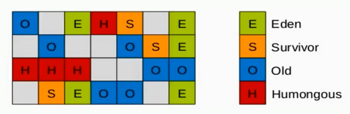

> 空间整合

​    G1 将内存划分为一个个的 Region。内存的回收是以 region 作为基本单位的。**Region 之间是==复制算法==，但整体上实际可看作是==标记-压缩（Mark- Compact）算法==**，两种算法都可以避免内存碎片。这种特性有利于程序长时间运行，分配大对象时不会因为无法找到连续内存空间而提前触发下一次 GC。尤其是当 Java 堆非常大的时候，G1 的优势更加明显

> 可预测停顿时间模型

​    这是 G1 相对于 CMS 的另一大优势，G1 除了追求低停顿外，还能建立可预测的停顿时间模型，能让使用者明确指定在一个长度为 M 毫秒的时间片段内，消耗在垃圾收集上的时间不得超过 N 毫秒

​    由于分区的原因，G1 可以只选取部分区域进行内存回收，这样缩小了回收的范围，因此对于全局停顿情况的发生也能得到较好的控制

​    **G1 跟踪各个 Region 里面的==垃圾堆积的价值大小==（回收所获得的空间大小以及回收所需时间的经验值），在后台维护一个优先列表，每次根据允许的收集时间，优先回收价值最大的 Region**。保证了 G1 收集器在有限的时间内可以获取尽可能高的收集效率

​    相比于 CMS GC，G1 未必能做到 CMS 在最好情况下的延时停顿，但是最差情况要好很多


* 缺点

​    相较于 CMS，G1 还不具备全方位、压倒性优势。比如在用户程序运行过程中， G1 无论是为了垃圾收集产生的**内存占用**还是程序运行时的**额外执行负载**都要比 CMS 要高

​    从经验上来说，在小内存应用上 CMS 的表现大概率会优于 G1，而 G1 在大内存应用上则发挥其优势。平衡点在    6-8GB 之间


> **Region** 介绍：化整为零

​    使用 G1 收集器时，它将整个 Java 堆划分成约 2048 个大小相同的独立 Region 块，每个 Region 块大小根据堆空间的实际大小而定，整体被控制在 1MB 到 32MB 之间，且为 2 的 N 次幂，即 1MB，2MB，4MB，8MB，16MB，32MB。可以通过 -XX:G1HeapRegionS1ze 设定。**所有的 Region 大小相同，且在 JVM 生命周期内不会被改变** 

​    虽然还保留有新生代和老年代的概念，但**新生代和老年代不再是物理隔离的了，它们都是一部分 Region（不需要连续）的集合**。通过 Region 的动态分配方式实现逻辑上的连续

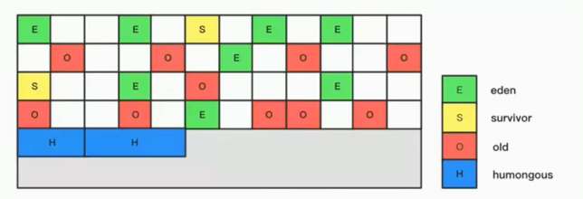

​    一个 Region 有可能属于 Eden, Survivor 或者 old 内存区域。但是一个 Region 只可能属于一个角色。图中的 E 表示该 Region 属于 Eden 内存区域，S 表示属于 Survivor 内存区域，O 表示属于 old 内存区域。图中空白的表示未使用的内存空间

​    G1 垃圾收集器还增加了一种新的内存区域，叫做 Humongous 内存区域，如图中的 H 块。**主要用于存储大对象，如果超过 0.5 个 Region，就放到 H** 

> 设置 H 块的原因

​    **对于堆中的大对象，默认直接会被分配到老年代，但是如果它是一个短期存在的大对象，就会对垃圾收集器造成负面影响**。为了解决这个问题，G1 划分了一个 Humongous 区它用来专门存放大对象。如果一个 H 区装不下一个大对象，那么 G1 会寻找连续的 H 区来存储。**为了能找到连续的 H 区，有时候不得不启动 Full GC**，G1 的大多数行为都把 H 区作为老年代的一部分来看待


> 记忆集：Remembered  Set

记忆集是一种用于记录**从==非收集区域==指向==收集区域==的指针集合**的抽象数据结构

* 问题：一个对象被不同区域所引用

​    一个 Region 不可能是孤立的，一个 Region 中的对象可能被其他任意 Region 中对象所引用，要判断对象存活时，是否需要扫描整个 Java 堆才能保证准确？

​    在其他的分代收集器，也存在这样的问题（而G1更突出），回收新生代也不得不同时扫描老年代？这样的话会降低Minor GC 的效率

* 解决办法
    * **无论 G1 还是其他分代收集器，JVM 都是使用 Remembered Set 来避免全局扫描** 

​    **==每个 Region 都有一个对应的 Remembered Set==** 

​    每次 Reference 类型数据写操作时，都会产生一个 Write Barrier 暂时中断操作，然后**检查将要写入的引用指向的对象是否和该 Reference 类型数据在不同的 Region（其他收集器：检查老年代对象是否引用了新生代对象）**，如果不同，通过 CardTable 把相关引用信息记录到引用指向对象的所在 Region 对应的 Remembered Set 中，这样，当进行垃圾收集时，在 GC 根节点的枚举范围加入 Remembered Set，就可以保证不进行全局扫描，也不会有遗漏

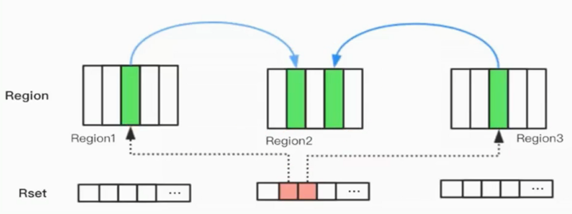


> G1 垃圾回收过程

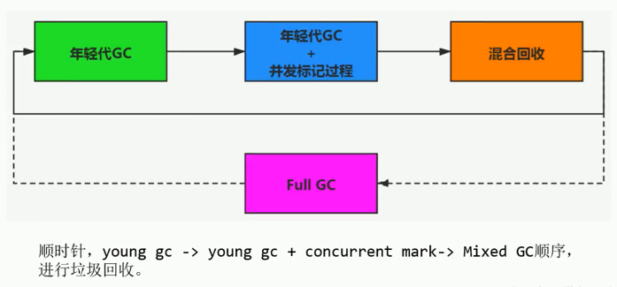

​    当年轻代的 Eden 区用尽时开始年轻代回收过程；**G1 的年轻代收集阶段是一个并行的独占式收集器。在年轻代回收期，G1 GC 暂停所有应用程序线程，启动多线程执行年轻代回收**。然后**从年轻代区间移动存活对象到 Survivor 区间或者老年区间，也有可能是两个区间都会涉及** 

​    当堆内存使用达到一定值（默认45%）时，开始老年代并发标记过程

​    标记完成马上开始**混合回收**过程。对于一个混合回收期，G1 GC 从老年区间移动存活对象到空闲区间，这些空闲区间也就成为了老年代的一部分。和年轻代不同，老年代的 G1 回收器和其他 GC 不同，**G1 的老年代回收器不需要整个老年代被回收，一次只需要扫描/回收小部分老年代的 Region 就可以了**。同时，这个老年代 Region 是和年轻代一起被回收的

​    举个例子：一个 Web 服务器，Java 进程最大堆内存为 4G，每分钟响应 1500 个请求，每 45 秒钟会新分配大约 2G的内存。G1 会每 45 秒钟进行一次年轻代回收，每 31 个小时整个堆的使用率会达到 45%，会开始老年代并发标记过程，标记完成后开始四到五次的混合回收


* 年轻代 GC（Young GC）

​    JVM 启动时，G1 先准备好 Eden 区，程序在运行过程中不断创建对象到 Eden 区，当 Eden 空间耗尽时，G1 会启动一次年轻代垃圾回收过程

​    **年轻代垃圾回收只会回收 Eden 区和 Survivor 区** 

​    YGC 时，首先 G1 停止应用程序的执行（Sop-The-Wor1d），G1 创建回收集（Collection set），**回收集是指需要被回收的内存分段的集合**，年轻代回收过程的回收集包含年轻代 Eden 区和 Survivor 区所有的内存分段

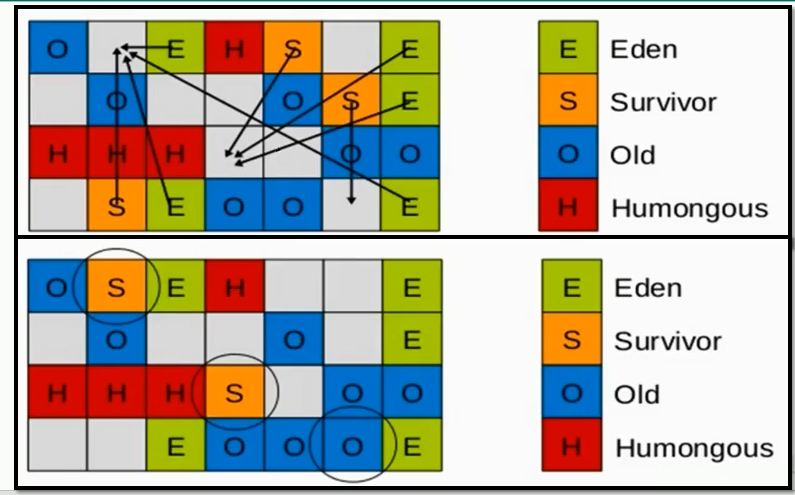


* 老年代并发标记过程（Concurrent  Marking）

​    1、初始标记阶段：标记从根节点直接可达的对象。这个阶段是 STW 的，并且会触发一次年轻代 GC

​    2、根区域扫描：G1 GC 扫描 Survivor 区直接可达的老年代区域对象，并标记被引用的对象。这一过程必须在 Young GC 之前完成

​    3、并发标记：在整个堆中进行并发标记（和应用程序并发执行），此过程可能被 young GC 中断。在并发标记阶段，若发现区域对象中的所有对象都是垃圾，那这个区域会被立即回收。同时，并发标记过程中，会计算每个区域的对象活性（区域中存活对象的比例）

​    4、再次标记：**由于应用程序持续进行，需要修正上一次的标记结果**。是 STW 的。G1 中采用了比 CMS 更快的初始快照算法：snapshot-at-the-beginning（SATB）

​    5、独占清理：计算各个区域的存活对象和 GC 回收比例，并进行排序识别可以混合回收的区域，为下阶段做铺垫，是 STW 的 

​    6、并发清理阶段：识别并清理完全空闲的区域


* 混合回收（Mixed  GC）

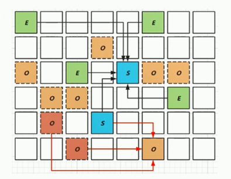

​    当越来越多的对象晋升到老年代 Old Region 时，为了避免堆内存被耗尽，虚拟机会触发一个混合的垃圾收集器，即 Mixed GC，该算法并不是一个 Old GC，除了回收**整个 Young Region，还会回收一部分的 Old Region**。这里需要注意：**是一部分老年代，而不是全部老年代**。可以选择哪些 Old Region 进行收集，从而可以对垃圾回收的耗时时间进行控制。也要注意的是 **Mixed GC 并不是 Full GC** 

​    **并发标记结束以后，老年代中百分百为垃圾的内存分段被回收了，部分为垃圾的内存分段被计算了出来**。默认情况下，这些老年代的内存分段会分 8 次（可以通过 -XX:G1MixedGCCountTarget 设置）被回收

​    混合回收的回收集包括八分之一的老年代内存分段，Eden 区内存分段， Survivor 区内存分段。**混合回收的算法和年轻代回收的算法完全一样，只是回收集多了老年代的内存分段**。具体过程请参考上面的年轻代回收过程

​    由于老年代中的内存分段默认分 8 次回收，G1 会优先回收垃圾多的内存分段。**垃圾占内存分段比例越高的，越会被先回收**。并且有一个阈值会决定内存分段是否被回收， **-XX:G1MixedGCLiveThresholdPercent**，默认为 65%，意思是垃圾占内存分段比例要达到 65% 才会被回收。如果垃圾占比太低，意味着存活的对象占比高，在复制的时候会花费更多的时间

​    混合回收并不一定要进行 8 次。有一个阈值 -XX:G1HeapWastePercent，默认值为10%，**意思是允许整个堆内存中有10% 的空间被浪费，意味着如果发现可以回收的垃圾占堆内存的比例低于10%，则不再进行混合回收。因为 GC 会花费很多的时间但是回收到的内存却很少** 


* 如果需要，单线程、独占式、高强度的 Full GC 还是继续存在的。它针对 GC 的评估失败提供了一种失败保护机制，即强力回收

​    G1 的初衷就是要避免 Full GC 的出现。但是如果上述方式不能正常工作，G1 会停止应用程序的执行（stop-The- World），使用单线程的内存回收算法进行垃圾回收，性能会非常差，应用程序停顿时间会很长

​    要避免 Full GC 的发生，一旦发生需要进行调整。什么时候会发生 Full GC 呢？比如堆内存太小，当 G1 在复制存活对象的时候没有空的内存分段可用则会回退到 Full GC，这种情况可以通过增大内存解决


### 4.8 七款垃圾回收器小结

|              | 分类       | 作用位置     | 使用算法        | 特点         | 适用场景                         |
| ------------ | ---------- | ------------ | --------------- | ------------ | -------------------------------- |
| Serial       | 串行       | 新生代       | 复制            | 响应速度优先 | 适用于单CPU下的Client模式        |
| ParNew       | 并行       | 新生代       | 复制            | 响应速度优先 | 多CPU下Server模式，与CMS配合使用 |
| Parallel     | 并行       | 新生代       | 复制            | 吞吐量优先   | 适用于后台运算不需要过多交互场景 |
| Serial Old   | 串行       | 老年代       | 标记-压缩       | 响应速度优先 | 适用于单CPU下Client模式          |
| Parallel Old | 并行       | 老年代       | 标记-压缩       | 吞吐量优先   | 适用于后台运算不需要过多交互场景 |
| CMS          | 并发       | 老年代       | 标记-清除       | 响应速度优先 | 适用于互联网或 B/S 业务          |
| G1           | 并发、并行 | 新生、老年代 | 标记-压缩、复制 | 响应速度优先 | 面向服务端应用                   |


## 5、GC日志分析

参数：-XX:+PrintGC，该参数只会显示总的 GC 堆的变化

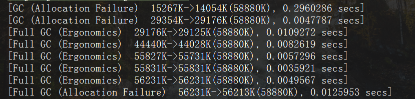

解析：

> GC、Full GC：是 GC 的类型，GC 只在新生代上进行，Full GC 包括永生代，新生代，老年代
>
> Allocation Failure：GC发生的原因
>
> 15267K->14054K：堆在 GC 前的大小和 GC 后的大小
>
> 58880K：堆的总大小
>
> 0.2960286 secs：GC持续的时间


详细参数解析

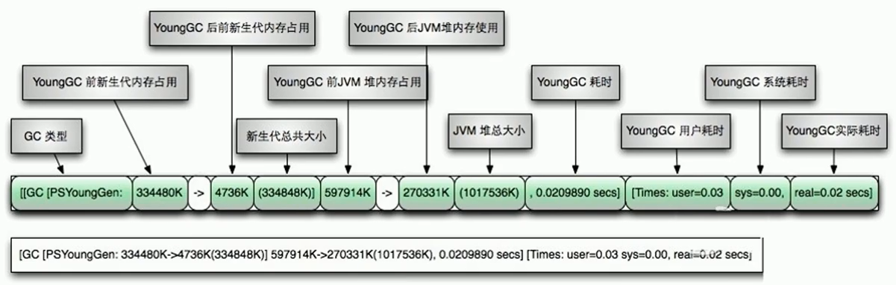


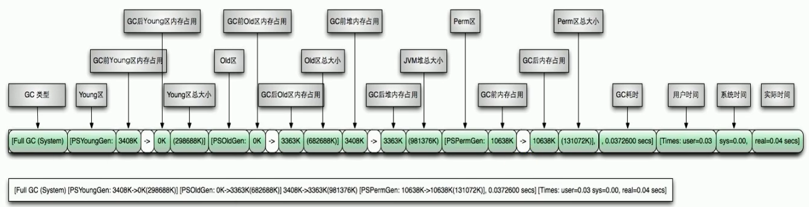


> 将日志保存到文件

-Xloggc:路径：-Xloggc:/path/tfc/a.log


# 九、HotSpot JVM 常用参数

## Serial GC

* 指定新生代和老年代使用 **Serial** 串行收集器，**等价于新生代用 ==Serial GC==，且老年代用 ==Serial Old GC==** 

>  -XX:+UseSerialGC 


## ParNew

* 指定新生代使用 **ParNew** 收集器，不影响老年代

> -XX:+UseParNewGC
>
> -XX:ParallelGCThreads：限制线程数量，默认开启和 CPU 数据相同的线程数
>
> **==JDK 9 及以后该收集器不建议使用==** 


## Parallel GC

* 指定新生代使用 Parallel GC，老年代就会默认使用 Parallel Old GC，反之亦然

> -XX:+UseParallelGC   -XX:UseParallelOldGC
>
> 这两个参数在 JDK 8 中默认开启，设置任何一个，另一个也随之开启
>
> -XX:ParallelGCThreads：设置新生代并行收集线程数，一般最好与 CPU 数量相等
>     在默认情况下，当 CPU 数量小于 8 个，**ParallelGCThreads** 的值等于 CPU 数量
>     当 CPU 数量大于 8 个，**ParallelGCThreads** 的值等于 **==3+( 5* CPU_Count ) / 8==** 


* 设置垃圾收集器最大停顿时间，单位是毫秒

​    对于用户来讲，停顿时间越短体验越好。但是在服务器端，我们注重高并发，整体的吞吐量。所以服务器端适合Parallel，进行控制。**==该参数谨慎使用==** 

> -XX:MaxGCPauseMillis


* 垃圾收集时间占总时间的比例，用于衡量吞吐量的大小

取值范围（0,100），**默认值 99**，也就是垃圾回收时间不超过 1%

与 -XX:MaxGCPauseMillis 参数有一定矛盾性。暂停时间越长， Radio 参数就容易超过设定的比例

> -XX:GCTimeRadio


* 设置 Parallel Scavenger GC 的自适应调节策略

​    在这种模式下，年轻代的大小、Eden 和 Survivor 的比例、晋升老年代的对象年龄等参数会被自动调整，已达到在堆大小、吞吐量和停顿时间之间的平衡点

​    在手动调优比较困难的场合，可以直接使用这种自适应的方式，仅指定虚拟机的最大堆、目标的吞吐量（ GCTimeRatio）和停顿时间（ MaxGCPauseMillis），让虚拟机自己完成调优工作

> -XX:UseAdaptiveSizePolicy


## CMS GC

* 手动指定老年代垃圾回收器使用 CMS
    * 开启该参数后会自动将 -XX:+UseParNewGC 打开( 新生代垃圾回收器 )

> -XX:+UseConcMarkSweepGC


* 设置堆内存使用率的阈值，旦达到该阈值，便开始进行回收

​    JDK 5 及以前版本的默认值为 68，即当老年代的空间使用率达到 68%时，会执行 CMS 回收。JDK6 及以上版本默认值为 92%

​    如果内存增长缓慢，则可以设置一个稍大的值，大的阈值可以有效降低 CMS 的触发频率，减少老年代回收的次数可以较为明显地改善应用程序性能。反之，如果应用程序内存使用率增长很快，则应该降低这个阈值，以避免频繁触发老年代串行收集器。因此通过该选项便可以有效降低 Full GC 的执行次数

> -XX:CMSInitiatingOccupanyFraction


​    **用于指定在执行完 Full GC 后对内存空间进行压缩整理，以此避免内存碎片的产生**。不过由于内存压缩整理过程无法并发执行，所带来的问题就是停顿时间变得更长了

> -XX:+UseCMSCompactAtFullCollection


​    设置在执行多少次Fu11Gc后对内存空间进行压缩整理

> -XX:CMSFullGCsBeforeCompaction


​    设置 CMS 的线程数量。CMS 默认启动的线程数是（ParallelGcThreads+3）/ 4，**ParallelGCThreads 是年轻代并行收集器的线程数**。当 CPU 资源比较紧张时，受到CMS收集器线程的影响，应用程序的性能在垃圾回收阶段可能会非常糟

> -XX:ParallelCMSThreads


## G1 GC

* JDK 9之前手动指定使用 G1 收集器执行内存回收任务

> -XX:+UseG1GC


​    设置每个 Region 的大小。值是2的次幂，范围是 1MB 到 32MB 之间，目标是根据最小的Java 堆大小划分出约2048个区域。默认是堆内存的 1/2000

> -XX:G1HeapRegionSize


设置期望达到的最大 **GC** 停顿时间指标（ **JVM** 会尽力实现，但不保证达到）。默认值是 **200ms** 

> -XX:MaxGCPauseMillis


设置 STW 工作时 GC 线程数的值，最多设置为 8

> -XX:ParallelGCThread


设置**并发标记**的线程数。将 n 设置为**并行**垃圾回收线程数（ParallelGCThreads）的 1/4 左右

> -XX:ConcGCThreads


设置触发并发 GC 周期的 Java 堆占用率阈值。超过此值，就触发 GC，默认值是 45

> -XX:InitiatingHeapOccupancyPercent


# 	--------- 字节码与类的加载 -----------


# 一、Class 文件结构

## 1、概述

> **Java**：跨平台的语言

* 当 **Java** 源代码成功編译成字节码后，如果想在不同的平台上面运行，则无须再次编译
* 这个优势不再那么吸引人了。 **Python、PHP、Perl、Ruby、Lisp** 等有强大的解释器
* 跨平台似乎已经快成为一门语言必选的特性


> **Java** 虚拟机：跨语言的平台

​    Java 虚拟机不和包括 Java 在内的任何语言绑定，它只与 "Class" 文件这种特定的二进制文件格式所关联。无论使用何种语言进行软件开发，只要能将源文件编译为正确的 Class 文件，那么这种语言就可以在 Java 虛拟机上执行。可以说，统一而强大的 class 文件结构，就是 Java 虚拟机的基石、桥梁

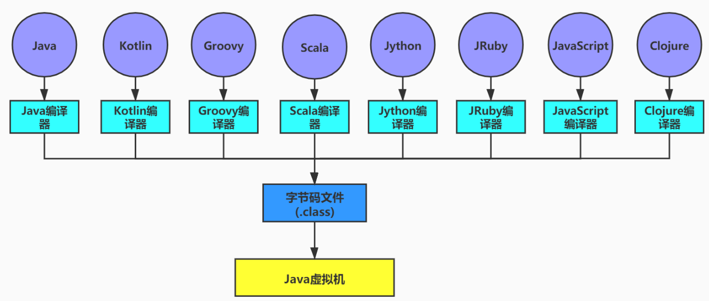


## 2、前端编译器

​    **Java** 源代码的编译结果是字节码，那么肯定需要有一种编译器能够将 **Java** 源码编译为字节码，承担这个重要责任的就是配置在 **path** 环境变量中的 **javac** 编译器。 **javac** 是一种能够将 Java 源码编译为字节码的**前端编泽器** 

​    **HotSpot VM** 并没有制要求前端編译器只能使用 **javac** 来編译字节码，其实只要编译结果符合 **JVM** 规范都可以被 **JVM** 所识别即可

​    在 Java 的前端编译器领域，除了 **javac** 之外，还有一种被大家经常用到的前端编译器，那就是内置在 **Eclipse** 中的 **ECJ（Eclipse Compiler for Java）**。和 **javac** 的**==全量式==**编译不同，**ECJ** 是一种增量式编译器

* 在 Eclipse 中，当开发人员編写完代码后，使用 "Ctrl + S" 快捷键时，ECJ 編译器所釆取的鳊译方寀是把未编译部分的源码逐行进行编译，而非每次都全量编译。因此 ECJ 的编译效率会比 Javac 更加迅速和高效，当然编译质量和 Javac 相比大致还是一样的
* 默认情况下，**IDEA 使用 Javac 編译器**（也还可以自己设置为 **AspectJ** 編译器 **AJC** ）


> 前端编译器并不会直接涉及编译优化等方面的技术，而是将这些**==具体优化细节移交给 HotSpot 的 JIT 编译器==**负责


## 3、Java 虚拟机的基石：Class 文件

> 字节码文件里是什么？

​    源代码经过编译器编译之后使会生成一个字节码文件，**字节码是一种二进制的类文件**，它的内容是 JVM 的指令，而不像 **C、C++ 经由编译器直接生成==机器码==** 


> 什么是字节码指令（byte code）

​    Java 虚拟机的指令由**一个字节长度的、代表着某种特定操作含义的==操作码==（ opcode）**以及跟随其后的零至多个代表此操作所需参数的**==操作数==**（ operand）所构成。**拟机中许多指令并不包含操作数，只有一个操作码** 

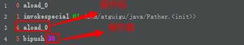


## 4、Class 文件结构

> class 文件格式

​    Class的结枃不像 XML 等描述语言，由于它没有任何分隔符号。所以在其中的数据项，无论是字节顺序还是数量，都是被严格限定的，哪个字节代表什么含义，长度是多少，先后顺序如何，都不允许改变

​    **class** 文件格式采用一种**类似于 C 语言结构体**的方式进行数据存储，这种结构中只有两种数握型：**无符号数、表** 

* **无符号数**属于基本数据类型，以 **u1、u2、u4、u8** 来分别代表 1 个字节、2 个字节、4 个字节、8 个字节的无符号数，无符号数可以用来描述数字、索引引用、数量值、按照 **UTF8** 编码构成字符串值
* **表**是由多个无符号数或者其他表作为数据项构成的复合数据类型，**所有表都习惯性地以 "_info" 结尾**。表用于描述有层次关系的复合结构的数据，整个 **class** 文件本质上就是一张表。由于表没有固定长度，所以通常会在其前面加上个数说明


> Class 文件的总体结构

​    **Class** 文件的结构并不是一成不变的，随者 **Java** 虚拟机的不断发展，总是不可避免地会对 **Class** 文件结构做出一些调整，但是基本结构和框架是非常稳定的

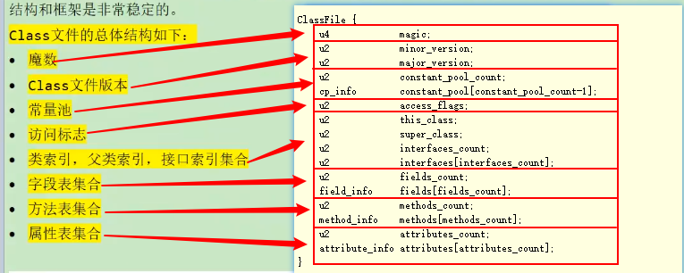


| 类型           | 名称                | 说明                   | 长度    | 数量                  |
| -------------- | ------------------- | ---------------------- | ------- | --------------------- |
| u4             | magic               | 魔数,识别Class文件格式 | 4个字节 | 1                     |
| u2             | minor_version       | 副版本号(小版本)       | 2个字节 | 1                     |
| u2             | major_version       | 主版本号(大版本)       | 2个字节 | 1                     |
| u2             | constant_pool_count | 常量池计数器           | 2个字节 | 1                     |
| cp_info        | constant_pool       | 常量池表               | n个字节 | constant_pool_count-1 |
| u2             | access_flags        | 访问标识               | 2个字节 | 1                     |
| u2             | this_class          | 类索引                 | 2个字节 | 1                     |
| u2             | super_class         | 父类索引               | 2个字节 | 1                     |
| u2             | interfaces_count    | 接口计数器             | 2个字节 | 1                     |
| u2             | interfaces          | 接口索引集合           | 2个字节 | interfaces_count      |
| u2             | fields_count        | 字段计数器             | 2个字节 | 1                     |
| field_info     | fields              | 字段表                 | n个字节 | fields_count          |
| u2             | methods_count       | 方法计数器             | 2个字节 | 1                     |
| method_info    | methods             | 方法表                 | n个字节 | methods_count         |
| u2             | attributes_count    | 属性计数器             | 2个字节 | 1                     |
| attribute_info | attributes          | 属性表                 | n个字节 | attributes_count      |


### magic number：魔数

​    每个 Class 文件开头的 4 个宇节的无符号整数称为魔数（ Magic Number），它的唯一作用是确定这个文件是否为一个能被虚拟机接受的有效合法的 Class 文件。即：魔数是 class 文件的标识符。**魔数值固定为 0xCAFEBABE。不会改变** 

​    使用魔数而不是扩展名来进行识别主要是基于安全方面的考虑，**因为文件扩展名可以随意地改动** 


### Class 文件的版本号

​    紧接着魔数的 **4** 个字节`存储的是 **Class 文件的版本号**。同样也是 4 个字节。第 5 个和第 6 个字节所代表的含义就是编译的副版本号 **minor version**，而第 7 个和第 8 个字节就是编译的主版本号 **major version** 

​    它们共同构成了 **Class** 文件的格式版本号。警如某个 **Class** 文件的主版本号为 **M**，副版本号为 **m**，那么这个 **Class** 文件的格式版本号就确定为 **M.m** 

​    不同版本的 **Java** 编译器编译的 **Class** 文件对应的版本是不样的。目前，高版本的 **Java** 虚拟机可以执行由低版本编译的 **Class** 文件，但是低版木的 **Java** 拟机不能执行由高版本编译器生成的 **Class** 文件，否则 **JVM** 会抛错（**==向下兼容==**）

* **Class** 文件版本号和平台的对应

| 主版本（十进制） | 副版本（十进制） | 编译器版本 |
| ---------------- | ---------------- | ---------- |
| 45               | 3                | 1.1        |
| 46               | 0                | 1.2        |
| 47               | 0                | 1.3        |
| 48               | 0                | 1.4        |
| 49               | 0                | 1.5        |
| 50               | 0                | 1.6        |
| 51               | 0                | 1.7        |
| 52               | 0                | 1.8        |
| 53               | 0                | 1.9        |
| 54               | 0                | 1.10       |
| 55               | 0                | 1.11       |


### 常量池

​    常量池是 **Class** 文件中内容最为丰富的区域之一。常量池对 **Class** 文件中的字段和方法解析也有着至关重要的作用。随着 **Java** 虛拟机的不断发展，常量池的内容也日渐丰宫。可以说，常量池是整个 **Class** 文件的基石

​    常量池中常量的数量是不固定的，所以在常量池的入口需要放置一项 **u2 类型**的无符号数，代表常量池容量计数值  （**constant_ pool count**）。与 Java 中语言习惯不一样的是，这个**容量计数是从 1 而不是 0 开始的** 

| 类型    | 名称                | 说明         | 长度    | 数量                  |
| ------- | ------------------- | ------------ | ------- | --------------------- |
| u2      | constant_pool_count | 常量池计数器 | 2个字节 | 1                     |
| cp_info | constant_pool       | 常量池表     | n个字节 | constant_pool_count-1 |

​    由上表可见，**Class** 文件使用了一个前置的容量计数器（ **constant_ pool count**）加若干个连续的数据项          （ **constant_pool**）的形式来描述常量池内容。**我们把这一系列连续常量池数据称为常量池集合** 

​    **常量池表项**中，用于存放编译时期生成的各种字面量和符号引用，这部分内容将在**类加载后**进入方法区的**运行时常量池**中存放


> constant_pool_count：常量池计数器

由于常量池的数量不固定，时长时短，所以需要放置两个字节来表示**常量池容量**的大小

​    常量池容量计数值（u2类型）：**从 1 开始**。表示常量池中有多少项常量。即 **constant_ pool_count=1**表示常量池中有 **0** 个常量项

​    通常我们写代时都是从开 0 始，但是这里的常量池却是从 1 开始，因为它把第 0 项常量空出来了。这是**为了满足后面某些指向常量池的索引值的数据在特定情况下需要表达 "不引用任何一个常池项目" 的含义**，这种情况可用索引值 0 来表示


> constant_pool：常量池表

1、**constant_pool 是一种表结构，以 1~ constant_ pool_count - 1 为索引**。表明了后面有多少个常量项

2、常量池主要存放两大类常量：**字面量（ Literal）和符号引用（ Symbolic Reference）** 

3、它包含了 Class 文件结构及其了结构中引用的所有字符串常量、类或接口名、字段名和其他常量。常量池中的每一项都具备相同的特征。第 1 个字节作为类型标记，用于确定该项的格式，这个字节称为 **tag byte（标记字节）** 


* 字面量
    * 文本字符串
    * 声明为 final 的常量值
* 符号引用
    * 类和接口的全限定名
    * 字段和名称的描述符
    * 方法的名称和描述符


* 全限定名

​    **com/atguigu/test/Demo** 这个就是类的全限定名，仅仅是**把包名的 "."  替换成 "/"**，为了使连续的多个全限定名之间不产生混淆，**在使用时最后一般会加一个 "；" 表示结束** 

* 简单名称 

​    简单名称是指**没有类型和参数修饰的方法或者字段名称**，上面例子中的类的 **add()** 方法和 **num** 字段的简单名称分别是 **add** 和 **num** 

* 描述符 

​    描述符的作用是**用来描述字段的数据类型、方法的参数列表（包括数量、类型以及顺序）和返回值**。根据描述符规则，基本数据类型（byte、char、 double、 float、int、long、short、boolean）以及代表无返回值的 void 类型都用一个大写字符来表示，而对象类型则用字符 L 加全限定名来表示

| 标志符 | 含义                                                 |
| ------ | ---------------------------------------------------- |
| B      | 基本数据类型byte                                     |
| C      | 基本数据类型char                                     |
| D      | 基本数据类型double                                   |
| F      | 基本数据类型float                                    |
| I      | 基本数据类型int                                      |
| J      | 基本数据类型long                                     |
| S      | 基本数据类型short                                    |
| Z      | 基本数据类型boolean                                  |
| V      | 代表void类型                                         |
| L      | 对象类型，比如：`Ljava/lang/Object;`                 |
| [      | 数组类型，代表一维数组。比如：`double[][][] is [[[D` |


​    Java 虚拟机在加载 Class 文件时才会进行动态链接，也就是说，**Class 文件中不会保存各个方法和字段的最终内存布局信息**，因比，这些字段和方法的符号引用不经过转换是无法直接被虚拟机使用的。当虚拟机运行，需要从常最池中获得对应的符号引用，再在类加载过程中的解析阶段将其替换为直接引用，并翻译到具体的内存地址中 

* 符号引用

​    符号引用以一组符号来描述所引用的目标，符号可以是任何形式的字面量，只要使用时能无歧义地定位到目标即可，**符号引用与虚拟机实现的内存布局无关**，引用的目标并不一定已经加载到了内存中

* 直接引用

​    直接引用可以是**直接指向目标的指针、相对移量或是一个能间定位到目标的句柄。直接引机是与虚拟机实现的内存布局相关的**，同一个符号引用在不同虛拟机实例上翻译出来的直接引用般不会相同。如果有了直接引，那说明引用的目标必定已经存在于内存之中了


> 常量池中的所有的常量

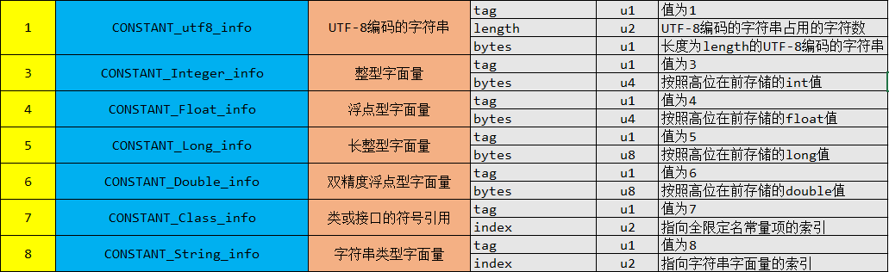


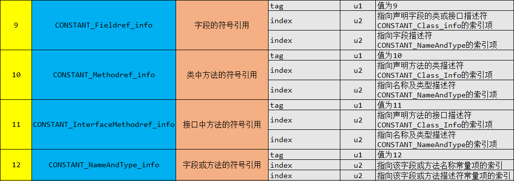


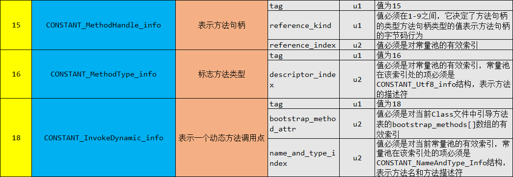


> 常量池中为何要包含这些内容？

​    **Java** 代码在进行 **Javac** 编译的时候，并不像 C 和 C++ 那样有 “连接” 这一步骤，而是在虚拟机加载 Class 文件的时候进行动态链接。也就是说，**在 Class 文件中不会保存各个方法、字段的最终内存布局信息，因此这些字段、力法的符号引用不经过运行期转换的话无法得到真正的内存入口地址，也就无法直接被虚拟机使用**。当虚拟机运行时，需要从常量池获得对应的符号引用，再在类创建时或运行时解析、翻译到具体的内存地址之中。关于类的创建和动态链接的内容，在虚拟机类加载过程时再进行详细讲解


### 访问标识

​    在常量池后，紧跟着访问标记。**该标记使用两个字节表示，用于识别一些类或者接口层次的访问信息**，包括：这个Class 是类还是接口；是否定义为 public 类型；是否定义为 abstract 类型；如果是类的话，是否被声明为 final 等。各种访问标记如下所示

| 标志名称       | 标志值 | 含义                                                         |
| -------------- | ------ | ------------------------------------------------------------ |
| ACC_PUBLIC     | 0x0001 | 标志为 public 类型                                           |
| ACC_FINAL      | 0x0010 | 标志被声明为 final，只有类可以设置                           |
| ACC_SUPER      | 0x0020 | 标志允许使用 invokespecial 字节码指令的新语义，JDK1.0.2 之后编译出来的类的这个标志默认为真。（使用增强的方法调用父类方法） |
| ACC_INTERFACE  | 0x0200 | 标志这是一个接口                                             |
| ACC_ABSTRACT   | 0x0400 | 是否为abstract类型，对于接口或者抽象类来说，次标志值为真，其他类型为假 |
| ACC_SYNTHETIC  | 0x1000 | 标志此类并非由用户代码产生（即：由编译器产生的类，没有源码对应） |
| ACC_ANNOTATION | 0x2000 | 标志这是一个注解                                             |
| ACC_ENUM       | 0x4000 | 标志这是一个枚举                                             |


### 类索引、父类索引、接口索引集合

在访问标记后，会指定该类的类别、父类类别以及实现的接口，格式如下：

| 长度 | 含义                           |
| ---- | ------------------------------ |
| u2   | this_class                     |
| u2   | super_class                    |
| u2   | interfaces_count               |
| u2   | interfaces[ interfaces_count ] |

这三项数据来确定这个类的继承关系 

* 类索引用于确定这个类的全限定名
* 父类索引用于确定这个类的父类的全限定名。由于 Java 语言不允许多重继承，所以父类索引只有一个，除了java.lang.Object 之外，所有的 Java 类都有父类，因此除了 java.lang.Object 外，所有 Java 类的父类索引都不为 0
* 接口索引集合就用来描述这个类实现了哪些接口，这些被实现的接口将按 implements 语句（如果这个类本身是一个接口，则应当是 extends语句）后的接口顺序从左到右排列在接口索引集合中


> interfaces

指向常量池索引集合，它提供了一个符号引用到所有已实现的接口

​    由于一个类可以实现多个接口因此**需要以数组形式保存多个接口的索引**，表示**接口的每个索引也是一个指向常量池的CONSTANT_Class**（当然这里就必须是接口，而不是类）


### 字段表集合

​    用于描述接口或类中声明的变量。**字段（field）包括类级变量以及实例级变量**，但是不包括方法内部、代码块内部声明的局部变量。字段叫什么名字、字段被定义为什么数据类型，这些都是无法固定的，只能引用常量池中的常量来描述

​    它指向常量池索引集合，它描述了每个字段的完整信息。比如**字段的标识符、访问修饰符（ public、 private或protected）、是类变量还是实例变量（ static 修饰符）、是否是常量（final 修饰符）等** 


* 注意

​    字段表集合中不会列出从父类或者实现的接口中继承来的字段，**但有可能列出原本 Java 代码之中不存在的字段。如在内部类中为了保持对外部类的访问性，会自动添加指向外部类实例的字段** 

​    在 **Java** 语言中字段是无法重载的，两个字段的数据类型、修饰符不管是否相同，都必须使用不一样的名称，但是**对于字节码来讲，如果两个字段的==描述符==不一致，那字段重名就是合法的** 


字段作为一个表，他也有自己的结构

|      类型      |       名称       |    含义    |       数量       |
| :------------: | :--------------: | :--------: | :--------------: |
|       u2       |   access_flags   |  访问标志  |        1         |
|       u2       |    name_index    | 字段名索引 |        1         |
|       u2       | descriptor_index | 描述符索引 |        1         |
|       u2       | attributes_count | 属性计数器 |        1         |
| attribute_info |    attributes    |  属性集合  | attributes_count |


字段表访问标识

​    我们知道，一个字段可以被各种关键字去修饰，比如：作用域修饰符（ **public、 private、 protected**）、**static** 修饰符 **final** 修饰符、 **volatile** 修饰符等等。因此，其可像类的访问标志那样，使用一些标志来标记字段。字段的访问标志有如下这些

|   标志名称    | 标志值 |            含义            |
| :-----------: | :----: | :------------------------: |
|  ACC_PUBLIC   | 0x0001 |     字段是否为 public      |
|  ACC_PRIVATE  | 0x0002 |     字段是否为 private     |
| ACC_PROTECTED | 0x0004 |    字段是否为 protected    |
|  ACC_STATIC   | 0x0008 |     字段是否为 static      |
|   ACC_FINAL   | 0x0010 |      字段是否为 final      |
| ACC_VOLATILE  | 0x0040 |    字段是否为 volatile     |
| ACC_TRANSTENT | 0x0080 |    字段是否为 transient    |
| ACC_SYNCHETIC | 0x1000 | 字段是否为由编译器自动产生 |
|   ACC_ENUM    | 0x4000 |      字段是否为 enum       |


字段名索引：根据字段名索引的值，查询常量池中的指定索引项即可


### 方法表集合

> 指的常量池索引集合，它完整描述了每个方法的签名

​    在字节码文件中，**每一个 method_info 项都对应着一个类或者接口中的方法信息**。比如方法的访问修饰符（public private或 protected），方法的返回值类型以及方法的参数信息等。如果这个方法不是抽象的或者不是 native 的，那么字节码中会体现出来

​    另一方面， **methods 表只描述当前类或接口中声明的方法，不包括从父类或父接口继承的方法**。另一方面， methods 表有可能会出现由编译器自动添加的方法，最典型的是编译器产生的方法信息**（比如：类（接口）初始化方法<c1init>（）和实例初始化方法<init>（））** 


* 注意 

​    在 Java 语言中，要重载（overload）一个方法，除了要与原方法具有相同的简单名称之外，还要求必须拥有一个与原方法不同的特征签名，**特征签名就是一个方法中各个参数在常量池中的字段符号引用的集合** 

​    正因为返回值不会包含在特征签名之中，因此 Java 语言里无法仅仅以返回值的不同来对一个已有方法进行重载。但**在 Class 文件格式中，特征签名的范围更大一些，只要描述符不是完全一致的两个方法就可以共存**。也就是说，如果两个方法有相同的名称和特征签名，但返回值不同，那么也是可以合法共存于同一个 Class 文件中

​    也就是说，尽管 Java 语法规范并不允许在一个类或者接口中声明多个方法签名相同的方法，但是和 Java 语法规范相反，字节码文件中却恰恰允许存放多个方法签名相同的方法，唯一的条件就是这些方法之间的返回值不能相同


方法表结构

|      类型      |       名称       |    含义    |       数量       |
| :------------: | :--------------: | :--------: | :--------------: |
|       u2       |   access_flags   |  访问标志  |        1         |
|       u2       |    name_index    | 字段名索引 |        1         |
|       u2       | descriptor_index | 描述符索引 |        1         |
|       u2       | attributes_count | 属性计数器 |        1         |
| attribute_info |    attributes    |  属性集合  | attributes_count |


方法表访问标志：和字段访问标志差不多，有个别不同

|   标志名称    | 标志值 |                 含义                  |
| :-----------: | :----: | :-----------------------------------: |
|  ACC_PUBLIC   | 0x0001 |      public：方法可以从包外访问       |
|  ACC_PRIVATE  | 0x0002 |     private：方法只能在本类中访问     |
| ACC_PROTECTED | 0x0004 | protected：方法可以在自身和子类中访问 |
|  ACC_STATIC   | 0x0008 |           static：静态方法            |
|   ACC_FINAL   | 0x0010 |         final：方法不能被重写         |
| ACC_VOLATILE  | 0x0040 |               volatile                |
| ACC_TRANSTENT | 0x0080 |               transient               |
| ACC_SYNCHETIC | 0x1000 |      方法是否为由编译器自动产生       |


### 属性表集合

属性表的每个项的值必须是 **attribute_info 结构**。属性表的结构比较灵活，各种不同的属性只要淸足以下结构即可

* 即**只需说明属性的名称以及占用位数的长度即可**，属性表具体的结构可以去自定义。

| 类型 | 名称                 | 数量             | 含义       |
| ---- | -------------------- | ---------------- | ---------- |
| u2   | attribute_name_index | 1                | 属性名索引 |
| u4   | attribute_length     | 1                | 属性长度   |
| u1   | info                 | attribute_length | 属性表     |


​    属性表实际上可以有很多类型，上面看到的 Code 属性只是其中一种，Java8 里面定义了 23 种属性，下面这些是虚拟机中预定义的属性


## 5、javap 指令解析

可选参数

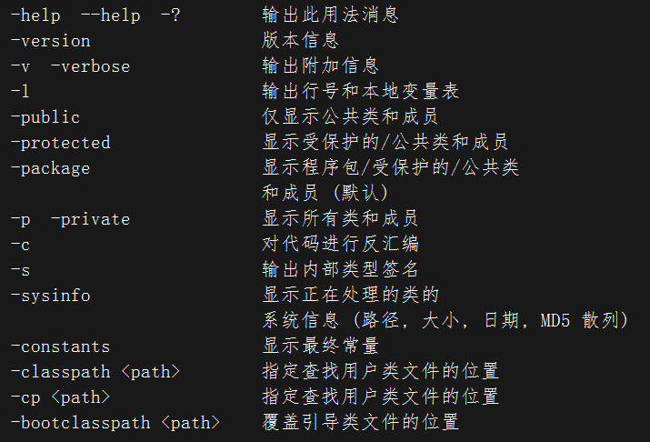


# 二、字节码指令集

## 1、概述

​    **Java 虚拟机的指令由一个字节长度的、代表着某种特定操作含义的数字（称为操作码， Opcode）以及跟随其后的零至多个代表此操作所需参数（称为操作数 Operands）而构成**。由于 Java 虚拟机采用面向操作数栈而不是寄存器的结构，所以大多数的指令都不包含操作数，只有一个操作

​    由于限制了 **Java** 虚拟机操作码的长度为一个字节（即0~255），这意味着指令集的**操作码总数不可能超过 256 条** 

​    熟悉虚拟机的指令对于动态字节码生成、反编译 Class 文件、Class 文件修补都有着非常重要的价值。因此，阅读字节码作为了解 Java 虚拟机的基础技能，需要熟练掌握常见指令


### 1.1 执行模型

```java
do{
    白动计算 PC 寄存器的值加 1；
    根据 PC 寄存器的指示位置，从字节码流中取出操作码
    if（字节码存在操作数）从字节码流中取出操作数
    执行操作码所定义的操作
}whie（字节码长度>）；
```


### 1.2 字节码与数据类型

​    在 Java 虚拟机的指令集中，**大多数的指令都包含了其操作所对应的数据类型信息**。例如，iload 指令用于从局部变量表中加载 int 型的数据到操作数栈中，而 fload 指令加载的则是 float 类型的数据

​    也有一些指令的助记符中**没有明确地指明操作类型的字母**，如  arraylength 指令，它没有代表数据类型的特殊字符，但操作数永远只能是一个数组类型的对象

​    还有另外一些指令，如无条件跳转指令 **goto**。则是与数据类型无关的

​    大部分的指令都没有支持整数类型 byte、char 和 short，甚至没有任何指令支持 boolean类型。**编译器会在编译期或运期将 byte和 short 类型的数据带符号扩展（Sign- Extend）为相应的 int 类型数据，将 boolean 和 char 类型数据零位扩展（zero- Extend）为相应的 int 类型数据** 

​    与之类似，在处理 boolean、byte、 short 和 char 类型的数组时，也会转换为使用对应的 int 类型的字节码指令来处理。因此，大多数对于 boolean、byte、 short 和 char 类型数据的操作实际上都是使用相应的 int 类型作为运算类型

## 2、加载与存储指令

* 作用

加载和存储指令用于**将数据从栈帧的局部变量表和操作数栈之间来回传递** 


### 常用指令

> 局部变量压栈指令

* 将一个**局部变量**加载到作数栈：`xload、xload_<n>`，x 为数据类型
    * x 为 i、l、f、d、a
    * n 为 0~3 

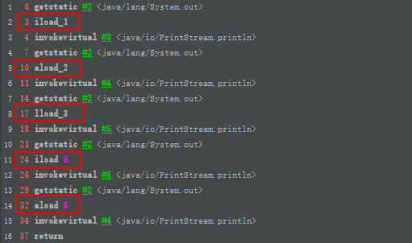


> 常量入栈指令

* 将一个**常量**加载到操作数栈

```
bipush、 sipush、ldc、ldc_w、ldc2_w、aconst_null、iconst_ml、 iconst_<i>、 lconst_<i>、 fconst_<f>、 dconst_<d>
```

​    **==const 指令系列==**：用于对**特定的**常量入栈，入栈的常量隐含在指令本身里。指令有：`iconst_<i>`（i从 -1 到 5）、      `lconst_<l>`（l 从 0 到 1）、 `fconst_<f>`（ f 从 0 到 2）、 `dconst_<d>`（ d 从 0 到 1）、 `aconst_null` 

​    **==push 指令系列==**：主要包括 **bipush 和 sipush。它们的区别在于接收数据类型的不同**， bipush 接收 8 位整数[-128~127] 作为参数，sipush 接收 16 位整数 [ -32768，32767 ]，它们都将参数压入栈

​    **==ldc 指令系列==**：如果以上指令都不能满足需求，那么可以使用**万能的 ldc 指令**，它可以接收一个 8 位的参数，该参数指向常量池中的 **int、float** 或者 **String** 的索引，将指定的内容压入堆栈

* 类似的还有 `ldc_w`，它接收两个 8 位参数，能支持的索引范围大于 `ldc` 
* 如果要压入的元素是 `long` 或者 `double` 类型的，则使用 `ldc2_w` 指令，使用方式都是类似的


> 出栈装入局部变量表指令

* 用于将操作数栈中栈顶元素弹出后，装入局部变量表的指定位置，用于给局部变量斌值
    * `xstore_<n>`（其中 x 为 i、l、f、d、a    n为 0 ~ 3）
        * `istore_<n>` 将从操作数栈中弹出一个整数，并把它赋值给局部变量==**索引 n 位置**== 
    * `xastore`（其中 x 为 i、l、f、d、a）
        * 指令 `xastore` 由于没有隐含参数信息，故**需要提供一个 byte 类型参数**指定目标局部变量表的位置


> 扩充局部变量表的访问索引的指令：**wide** 


​    上面所列举的指令助记有一部分是以尖括号结尾的（例如 `load_<n>`）：这些指令助记符实际上代表了一组指令，这组指令都是某个带有一个操作数的通用指令（例如 `iload`）的特殊形式，**对于这若干组特殊指令来说，它们表面上没有操作数，不需要进行取操作数的动作，但操作数都隐含在指令中** 

​    除此之外，它们的语义与原生的通用指令完全一致（例如 `iload_0`的语义与操作数为 0 时的 iload 指令语义完全一致）。**在尖括号之间的字母指定了指令隐含操作数的数据类型**，`<n>` 代表非负的整数，`<i>` 代表是 int 类型数据，`<l>`代表 long 类型，`<f>`代表 float 类型，`<d>` 代表  double 类型


## 3、算数指令

大体上算术指令可以分为两种：对**整型数据**进行运算的指令与对**浮点类型数据**进行运算的指令

算术指令用于对操作数栈上的两个值进行某种特定运算，**把结果重新压入操作数栈** 


​    **没有直接支持 byte, short、char、boolean 类型的算术指令，对于这些数据的运算，都使用 ==int 类型==的指令来处理**。此外，在**处理 bolean、byte、short、char 类型的数组**时，也会转换为使用对应的 int 类型的字节码指令来处理

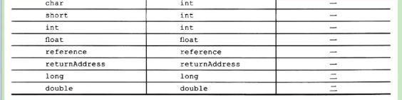


> 数据溢出

​    数据运算可能会导致溢出，例如两个很大的正整数相加，结果可能是一个负数。其实 Java 虛拟机规范并无明确规定过整型数据溢出的具体结果，仅规定了在处理整型数据时，只有除法指令以及求余指令中当出现除数为 0 时会导致虚拟机抛出异常 **ArithmeticException** 


> 运算模式

​    **==最接近数舍入模式==**：JVM 要求在进行浮点数计算时，所有的运算结果都必须舍入到适当的精度，非精确结果必须舍入为可被表示的最接近的精确值，如果有两种可表示的形式与该值一样接近，**将优先选择最低有效位为零的** 

​    **==向零舍入模式==**：将浮点数转换为整数时，采用该模式，该模式将在目标数值类型中选择一个最接近但是不大于原值的数字作为最精确的舍入结果


> NaN

​    一个操作产生溢出时，将会使用有符号的无穷大表示，**如果某个操作结果没有明确的数学定义的话，将会使用 NaN值来表示**。而且所有使用 NaN 值作为操作数的算术操作，结果都会返回 NaN


> 具体指令

|   加法指令   |        iadd、ladd、fadd、dadd        |
| :----------: | :----------------------------------: |
|   减法指令   |        isub、lsub、fsub、dsub        |
|   乘法指令   |        imul、lmul、fmul、dmul        |
|   除法指令   |        idiv、ldiv、fdiv、ddiv        |
|   求余指令   |        irem、lrem、frem、drem        |
|   取反指令   |        ineg、lneg、fneg、dneg        |
|   自增指令   |                 iinc                 |
|              |                                      |
|   位移指令   | ishl、ishr、iushr、lshl、lshr、lushr |
|  按位或指令  |               ior、lor               |
|  按位与指令  |              iand、land              |
| 按位异或指令 |              ixor、lxor              |
|              |                                      |
|   比较指令   |   dcmpg、dcmpl、fcmpg、fcmpl、lcmp   |

> 比较指令说明

* 比较指令的作用是比较栈顶两个元素的大小，并将比较结果入栈
    * 与前面讲解的指令类似，**首字符 d 表示 double 类型，f 表示 float ，l 表示 long** 
* 对于 double 和 float 类型的数字，由于 NaN 的存在，各有两个版本的比较指令
    * **以 float 为例，有 fcmpg 和 fcmpl 两个指令**，它们的区别在于在数字比较时，**若遇到 NaN 值，处理结果不同** 
        * 两个指令的不同之处在于，**如果遇到 NaN 值， fcmpg 会压入 1，而 fcmpl 会压入 -1** 
* 指令 **dcmpg** 和 **dampl** 也是类似的，根据其命名可以推测其含义
* 指令 **lcmp** 针对 **long** 型整数，**由于 long 型整数没有 NaN 值，故无需准备两套指令** 


举例：

指令 fcmpg 和 fcmpl 都从栈中弹出两个操作数，并将它们做比较，设栈顶的元素为 v2，栈顶顺位第 2 位的元素为 v1

* 若 v1=V2，则压入 0
* 若 v1>V2 则压入 1
* 若 v1<v2 则压入 -1


## 4、类型转换指令

> 说明

类型转换指令可以将**两种不同的数值类型**进行相互转换

​    这些转换操作一般用于实现用户代码中的**显式类型转换操作**，或者用来处理**字节码指令集中数据类型相关指令无法与数据类型一一对应的问题** 


### 宽化类型转换

> 转换规则

​    Java 虚拟机直接支持以下数值的宽化类型转换（小范围类型向大范围类型的安全转换），也就是说，并不雷要指令执行，包括：

* 从 int 类型到 long、float、double 类型。对应的令为：i2l、i2f、i2d
* 从 long 类型到 float、double 类型。对应的指令为：l2f、l2d
* 从 float 类型到 double 类型。对应的指令为：f2d

**==简化为：int-->long--> float-->double==** 


> 精度损失问题

尽管宽化类型转换实际上是可能发生精度丢失的，但是这种转换永远不会导致 Java 虚拟机抛出运行时异常

​    宽化类型转换是不会因为超过目标类型最大值而丢失信息的，例如，从 int 转换到 long，或者从 int 转换到 double，都不会丢失任何信息，转换前后的值是精确相等的


​    **从 int、long 类型数值转换到 float，或者 long 类型数值转换到 double 时，将可能发生精度丢失**——可能丢失掉几个最低有效位上的值，转换后的浮点数值是根据 IEEE754 最接近舍入模式所得到的正确整数值


> 关于 byte、short、char 的转换

​    **从 byte、char、short 类型到 int 型的宽化类型转换实际上是不存在的**：对于 **byte 类型转为 int**，虚拟机并没有做实质性的转化处理，只是简单地通过操作数栈交换了两个数据。而将 **byte 转为 long 时，使用的是 i2l**。可以看到在内部 byte 在这里已经等同于 int 类型处理，类似的还有 short 类型，这种处理方式有两个特点

* 一方面可以减少实际的数据类型，**如果为 short 和 byte 都准备一套指令，那么指令的数量就会大增，而虚拟机目前的设计上，只愿意使用一个字节表示指令，因此指令总数不能超过 256 个**，为了节省指令资源，将 short 和 byte 当做 int 处埋也在情理之中
* 另一方面，由于局部变量表中的槽位固定为 32 位，无论是 byte 或者 short 存入局部变量表，都会占用 32 位空间，从这个角度说，也没有必要特意区分这几种数据类型


### 窄化类型转换

> 转化规则

Java 虚拟机也直接支持以下窄化类型转换：

* 从 int 类型到 byte、 short、char 类型。对应的指令有：**i2b、i2s、i2c** 
* 从 long 类型到 int 类型。对应的指令有：**l2i** 
* 从 float 类型到 int 或者 long 类型，对应的指令有：**f2i、f2l** 
* 从 double 类型到 int、long、float 类型。对应的指令有：**d2i、d2l、d2f** 


> 精度损失问题

窄化类型转换可能会导致转换结果具备不同的正负号、不同的数量级，因此，转换过程很可能会导致数值丢失精度

​    尽管数据类型窄化转换可能会发生上限溢出、下限溢岀和精度丢失等情况，但是 **Java 虚拟札规范中明确规定数值类型的窄化转换指令永远不可能导致虚拟机拋出运行时异常** 


> 补充说明

当将一个**浮点值**窄化转换为整数类型T（T限于 int 或 long 类型之一）的时候，将遵循以下转换规则

* 如果浮点值是 NaN，那转换结果就是 int 或 long 类型的 0
* 如果浮点值不是无穷大的话，浮点值使用 IEEE754 的向零舍入模式取整，获得整数值 v，如果 v 在目标类型     T（int 或 long）的表示范围之内，那转换结果就是 v。否则，将根据 v 的符号，转换为 T 所能表示的最大或者最小正数


​    当将一个 double 类型窄化转换为 float 类型时，将遵循以下转换规则，通过向最接近数舍入模式舍入一个可以使用float 类型表示的数字。最后结果根据下面这 3 条规则判断

* 如果转换结果的**绝对值太==小==**而无法使用 float 来表示，将返回 float 类型的正负零
* 如果转换结果的**绝对值太==大==**而无法使用 float 来表示，将返回 float 类型的正负无穷大
* 对于 double 类型的 NaN 值将按规定转换为 float 类型的 NaN 值


## 5、类的创建与访问指令

​    Java 是面向对象的程序设计语言，虚拟机平台从字节码层面就对面向对象做了深层次的支持。**有一系列指令专门用于对象操作，可进一步细分为创建指令、字段访问指令、数组操作指令、类型检查指令** 


### 创建指令

虽然类实例和数组都是对象，**但 Java 虚拟机对==类实例==和==数组==的创建与操作使用了==不同的字节码指令==** 


#### 类创建指令

创建类实例的指令：new

* 它接收一个操作数，**为指向常量池的索引，表示要创建的类型**，执行完成后，将对象的引用压入栈


#### 数组创建指令

创建数组的指令：

* **newarray**：创建基本类型数组
* **anewarray**：创建引用类型数组
* **multianewarray**：创建多维数组


### 字段访问指令

对象创建后，就可以通过对象访问指令获取对象实例或数组实例中的字段或者数组元素

* 访问类字段（ static字段，或者称为类变量）的指令：**getstatic、 putstatic** 
* 访问类实例字段（非 static 字段，或者称为实例变量）的指令：**getfield、 putfield** 


### 数组操作指令

数组操作指令主要有：**xastore 和 xaload 指令** 

* 把一个数组元素**加载到操作数栈**的指令
    * baload、 caload、 saload、 ialad、laload、faload、daload、aaload 
* 将一个操作数栈的值**存储到数组元素中**的指令
    * bastore、castore、sastore、iastore、lastore、fastore、dastore、aastore 
    * 此处并不是存储到局部变量表中，而是存储到堆空间的数组

> 加载： -load   存储：-store

|   数组类型    | 加载指令 | 存储指令 |
| :-----------: | :------: | :------: |
| byte、boolean |  baload  | bastore  |
|     char      |  caload  | castore  |
|     short     |  saload  | sastore  |
|      int      |  iaload  | iastore  |
|     long      |  laload  | lastore  |
|     float     |  faload  | fastore  |
|    double     |  daload  | dastore  |
|   reference   |  aaload  | aastore  |

**==说明：==** 

​    指令 xaload 表示将数组的元素压栈，比如 saload、caload 分别表示压入 short 数组和 char 数组。**指令 xaload 在执行时，要求操作数中==栈顶元素为数组引用 a==，==栈顶顺位第2个元素为数组索引 i数组引用 a==，该指令会弹出栈顶这两个元素，并将 a[ i ]重新压入堆栈** 

​    **xastore** 则专门针对数组操作，以 **iastore** 为例，它用于给一个 **int 数组**的给定索引赋值。在 **iastore** 执行前，操作数栈顶需要以此**准备 3 个元素：数组引用（栈顶）、数组元素索引（栈顶顺位第二个）、值（栈顶顺位第三个）**， **iastore** 会弹出这 3 个值，并将值赋给数组中指定索引位置

**==获取数组长度指令：arraylength==** 

* 该指令**弹出栈顶的数组元素，获取数组的长度，将长度压入栈** 


### 类型检查指令

检查**类实例**或**数组类型**的指令：**instanceof、 checkcast** 

​    指令 **checkcast** 用于**检查类型强制转换是否可以进行**。如果可以进行，那么 **checkcast** 指令不会改变操作数栈，否则它会抛出 ClassCastException 异常

​    指令 instanceof 用来**判断给定对象是否是某一个类的实例**，它会**将判断结果（boolean 类型）压入操作数栈** 


## 6、方法调用与返回指令


### 方法调用指令

方法调用指令：**invokevirtual、invokeinterface、invokespecial、invokestatic、invokedynamic** 

​    **==invokevirtual 指令==**：用于调用对象的**实例方法**，根据对象的实际类型进行分派（虚方法分派），支持多态。这也是 Java语言中最常见的方法分派方式

​    **==invokeinterface 指令==**：用于调用**接口方法**，它会在运行时搜索由特定对象所实现的这个接口方法，并找出适合的方法进行调用

​    **==invokespecial 指令==**：用于调用一些需要特殊处理的实例方法，包括实例初始化方法（构造器）、私有方法和类方法。这些方法都是**静态类型绑定**的，不在调用时进行动态派发

​    **==invokestatic 指令==**：用于调用命名类中的**类方法（ static方法）**，这是**静态绑定**的

​    **==invokedynamic 指令==**：调用动态绑定的方法，这个是 JDK 1.7 后新加入的指令。用于在运行时动态解析出调用点限定符所引用的方法，并执行该方法。前面 4 条调用指令的分派逻辑都固化在 Java 虚拟机内部，而 invokedynamic 指令的分派逻是由用户所设定的引导方法决定的


### 方法返回指令

方法返叫指令是根据**返回值的类型**区分的

* 包括 ireturn（当返回值是 boolean、byte、char、 short 和 int 类型时使用）、lreturn、freturn、dreturn、areturn
* 另外还有一条 **return 指令**供声明为 void 的方法、实例初始化方法、类和接口的类初始化方法使用

举例：

​    通过 ireturn 指令，将当前函数操作数栈的顶层元素弹出，并将这个元素**压入==调用者==函数的操作数栈中**（因为调用者非常关心函数的返回值），所有在当前函数操作数栈中的其他元素都会被丢弃

​    如果当前返回的是 **synchronized 方法**，那么还会执行一个**隐含的 monitorexit 指令**，退出临界区

​    最后，会丢弃当前方法的整个帧，恢复调用者的帧，并将控制权转交给调用者


## 7、操作数栈管理指令

​    如同操作一个普通数据结构中的堆栈那样，JVM 提供的操作数栈管理指令，可以用于**直接操作操作数栈的指令**，这类指令包括如下内容：

* 将一个或两个元索从栈顶弹出，并且直接废齐：**pop、pop2** 
    * 弹出的是 Slot，一个 Slot 四个字节，若要弹出一个 long 型数据，则需要使用 pop2 弹出两个 Slot
* 复制栈顶一个或两个数值并将复制值或双份的复制值重新压入栈顶
    * **dup、dup2、dup_x1、dup2×1、dup_x2、dup2_x2** 
* 将栈中最顶端的两个 slot 数值位置交换：swap
    * Java 虚拟机没有提供交换两个64位数据类型（ long、double）数值的指令
* **指令 nop** 是一个非常特殊的指令，它的字节码为 0x00，和汇编语言中的 nop 一样，它表示什么都不做。这条指令一般可用于调试、占位等

这些指令属于通用型，对栈的压入或者弹出无需指明数据类型


说明：

​    不带 `_x` 的指令是复制栈顶数据并压入栈顶。包括两个指令，dup、dup2，dup的系数代表要复制的 Slot 个数

​    带 `_x` 的指令是复制栈顶数据并插入栈顶以下的某个位置。其有4个指令，如 `dup_x1，dup2_×1，dup_x2，dup2_x2`，对于带 `_x` 的复制插入指令，**==只要将指令的 dup 和 x 的系数相加，结果即为清要插入的位置==**。因此

* dup_×1 插入位置：1+1=2，即栈顶 2 个 Slot 下面
* dup_×2 插入位置：1+2=3，即栈顶 3 个 Slot 下面
* dup2_x1插入位置：2+1=3，即栈顶 3 个 Slot 下面
* dup2_×2 插入位置：2+2=4，即栈顶 4 个 Slot 下面


## 8、控制转移指令


### 条件跳转指令

​    条件跳转抬令通常和比较指令结合使用。在条件跳转指令执行前，一般可以先用比较指令进行栈顶元素的准备，然后进行条件跳转

​    条件跳转指令有：ifeq、iflt、ifle、ifne、ifgt、ifge、ifnull、ifnonnull，这些指令都接收两个字节的操作数，用于计算跳转的位置（16位符号整数作为当前位置的 offset）

​    它们的统一含义为：弹出栈顶元素，测试它是否满是某一条件，如果满是条件，则跳转到给定位置

|   ifeq    | 当栈顶 int 类型数值等于 0 时跳转     |
| :-------: | ------------------------------------ |
|   ifne    | 当栈顶 int 类型数值不等于 0 时跳转   |
|           |                                      |
|   iflt    | 当栈顶 int 类型数值小于 0 时跳转     |
|   ifle    | 当栈顶 int 类型数值小于等于 0 时跳转 |
|           |                                      |
|   ifgt    | 当栈顶 int 类型数值大于 0 时跳转     |
|   ifge    | 当栈顶 int 类型数值大于等于 0 时跳转 |
|           |                                      |
|  ifnull   | 为 null 时跳转                       |
| ifnonnull | 不为 null 时跳转                     |

运算法则

* 对于 boolean、byte、char、 short 类型的条件分支比较操作，都是使用 int 类型的比较指令完成
* 对于 long、float、double 类型的条件分支比较操作，则会先执行相应类型的比较运算指令，运算指令会返回一个整型值到操作数栈中，随后再执行 int 类型的条件分支比较操作来完成整个分支跳转

由于各类型的比较最终都会转为 int 类型的比较操作，所以 Java 虚拟机提供的 int 类型的条件分支指令是最为丰富和强大


### 比较、条件跳转指令

比较条件跳转指令类似于比较指令和条件跳转指令的结合体，它将比较和跳转两个步骤合二为一

* **栈顶元素为后者（v2），顺位第二个元素为前者（v1）** 

|   指令    | 含义                                             |
| :-------: | ------------------------------------------------ |
| if_icmpeq | 比较栈顶两个 int 类型数值大小，v1=v2 时跳转      |
| if_icmpne | 比较栈顶两个 int 类型数值大小，v1 != v2 时跳转   |
|           |                                                  |
| if_icmplt | 比较栈顶两个 int 类型数值大小，v1 < v2 时跳转    |
| if_icmple | 比较栈顶两个 int 类型数值大小，v1 <= v2时跳转    |
|           |                                                  |
| if_icmpgt | 比较栈顶两个 int 类型数值大小，v1 > v2时跳转     |
| if_icmpge | 比较栈顶两个 int 类型数值大小，v1 >= v2时跳转    |
|           |                                                  |
| if_acmpeq | 比较栈顶两个**==引用类型==**数值，v1 = v2时跳转  |
| if_acmpne | 比较栈顶两个**==引用类型==**数值，v1 != v2时跳转 |


​    这些指令都接收两个字节的操作数作为参数，用于计算跳转的位置。同时在执行指令时，栈顶需要准备两个元索，进行比较指令执行完成后，栈顶的这两个元素被清空，且没有任何数据入栈。**如果预设条件成立，则执行跳转，否则，继续执行下条语句** 


### 多条件分支跳转

多条件分支跳转指令是**专为 switch-case 语句设计**的，主要有 **tableswitch 和 lookupswitch** 

|    指令     |                作用                 |
| :---------: | :---------------------------------: |
| tableswitch |  用于 switch 条件跳转，case 值连续  |
| ookupswitch | 用于 switch 条件跳转，case 值不连续 |

​    **tableswitch 要求多个条件分支值是连续的**，它内部只存放起始值和终止值，以及若干个跳转偏移量，通过给定的操作数 index，可以立即定位到跳转偏移量位置，因此效率比较高

​    指令 lookupswitch 内部存放着各个离散的 case-offset 对，**每次执行都要搜索全部的 case-offset 对**，找到匹配的case 值，并根据对应的 offset 计算跳转地址，因此效率较低


### 无条件跳转

​    目前主要的无条件跳转指令为 **goto**。指令 **goto** 接收两个字节的操作数，共同组成一个带符号的整数，**用于指定指令的偏移量，指令执行的目的就是跳转到偏移量给定的位置处** 

​    如果指令偏移量太大，超过两个字节的带符号整数的范围，则可以使用指令 **goto_w**，它和 **goto** 有相同的作用，但是它接收 4 个字节的操作数，可以表示更大的地址范围

​    指令 jsr、jsr_w、ret 虽然也是无条件跳转的，但主要用于 try-finally 语句，且**已经被虚拟机逐渐废弃**，故不在这里介绍这两个指令

| 指令名称 |                             作用                             |
| :------: | :----------------------------------------------------------: |
|   goto   |                          无条件跳转                          |
|  goto_w  |                     无条件跳转（宽范围）                     |
|   jsr    | 跳转至指定 16 位 offset 位置，并将 jsr 下一条指令地址压入找顶 |
|  jsr_w   | 跳转至指定 32 位 offset 位置，并将 jsr 下一条指令地址压入找顶 |
|   ret    | 返回至指定的局部变量所给出的指令位置（一般与 jsr、jsr_w 联合使用） |


## 9、异常处理指令


### 异常抛出指令

在 Java 程序中显示抛出异常的操作（ throw 语句）都是由 **athrow 指令**来实现

​    除了使用 throw 语句显示抛出异常情况之外，**JVM 规范还规定了许多运行时异常会在其他 Java 虛拟机指令检测到异常状况时自动抛出**。例如，在之前介绍的整数运算时，当除数为零时，虚拟机会在idiv或ldiv指令中抛出ArithmeticException 异常

​    正常情况下，操作数栈的压入弹出都是一条条指令完成的。唯一的例外情况是**在抛异常时，Java 虚拟机会清除操作数栈的所有内容，而后将异常实例压入调用者操作数栈上** 


### 异常处理与异常表

> 异常处理

在 Java 虚拟机中，处理异常（ catch 语句）不是由字节码指令来实现的（早期使用 jsr、ret指令），而是用**异常表**来完成


> 异常表

​    如果一个方法定义了一个 try-catch 或者 try-finally 的异常处理，就会创建一个异常表，它包含了每个异常处理或者finally 块的信息。异常表保存了每个异常处理信息。比如

* 起始位置
* 结束位置
* 程序计数器记录的处理代码的偏移地址
* 被捕获的异常在常量池中的索引


​    **当一个异常被抛出时，JVM 会在当前的方法里寻找一个匹配的处理，如果没有找到，这个方法会强制结束并弹出当前栈帧，并且异常会重新抛给上层调用的方法**（在调用方法栈帧）。如果在所有栈帧弹出前仍然没有找到合适的异常处理，这个线程将终止

​    如果这个异常在最后一个非守护线程里抛出，将会导致 JVM 自己终止，比如这个线程是个 main 线程


​    **不管什么时候抛出异常，如果异常处理最终匹配了所有异常类型，代码就会继续执行**。在这种情况下，如果方法结束后没有池出异常，仍然执行 finally 块，在 return 前，它直接跳到 finally 块来完成目标


## 10、同步控制指令

Java 虚拟机支持两种同步结构：**方法级的同步和方法内部段指令序列的同步**，这两种同步都是使用 **monitor** 来支持的


### 方法级同步

​    **方法级的同步是==隐式的==，即无须通过字节码指令来控制，它实现在方法调用和返回操作之中**，虚拟机可以从方法常量池的方法表结构中的 **ACC_SYNCHRONIZED 访问标志**得知一个方法是否声明为同步方法


当调用方法时，调用指令将会检查方法的 ACC_SYNCHRONIZED 访问标志是否设置

* 如果设置了，执行线程将先持有同步锁，然后执行方法。最后在方法完成（无论是正常完成还是非正常完成）时释放同步锁
* 在方法执行期间，执行线程持有了同步锁，其他任何线程都无法再获得同一个锁
* 如果一个同步方法执行期间抛出了异常，并且在方法内部无法处理此异常，那这个同步方法所持有的锁将在异常抛到同步方法之外时自动释放


### 代码块级同步

​    同步一段指令集序列，通常是由 Java 中的 synchronized语句块来表示的。JVM 的指令集有 **monitorenter** 和**monitorexit** 两条指令来支持 synchronized 关键字的语义

​    当一个线程进入同步代码块时，它使用 monitorenter 指令请求进入。**如果当前==对象的监视器计数器==为 0，则它会被准许进入，若为 1，则判断持有当前监视器的线程是否为自己，如果是，则进入，否则进行等待**，直到对象的监视器计数器为 0，才会被允许进入同步块

​    当线程退出同步块时，需要使用 monitorexit 声明退出。在 Java 虚拟机中，任何对象都有一个监视器与之相关联，用来判断对象是否被锁定，当监视器被持有后，对处于锁定状态

​    指令 monitorenter 和 monitorexit 在执行时，都需要在操作数栈顶压入对象，之后 monitorenter 和 monitorexit 的锁定和释放都是针对这个对象的监视器进行的


# 三、类加载过程(声明周期)详解

## 1、概述

​    在 Java 中数据类型分为基本数据类型和引用数据类型。**基本数据类型由虚拟机预先定义，引用数据类型则需要进行类的加载** 

按照 Java 虛拟机规范，从 Class 文件到加载到内存中的类，到类卸载出内存为止，它的整个生命冏期包括如下 7 个阶段

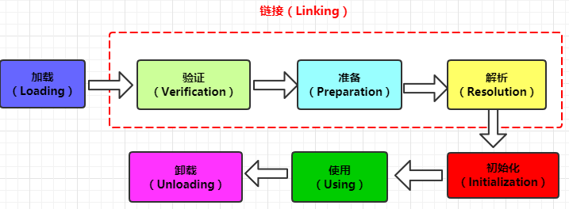


**验证、准备、解析 3 个部分统称为链接（ Linking）** 


## 2、Loading（加载）阶段


### 加载完成的操作

> 加载的理解

​    所谓加载，简而言之就是将 Java 类的字节码文件加载到机器内存中，并在内存中构建出 **Java 类的原型一一类模板对象** 

​    **所谓类模板对象，其实就是 Java 类在 JVM 内存中的一个快照**，JVM 将从字节码文件中解析出的常量池、类字段、类方法等信息存储到类模板中，这样 JVM 在运行期便能通过类模板获取 Java 类中的任意信息，能够对 Java 类的成员变量进行遍历，也能进行 Java 方法的调用

​    反射的机制正是基于这一基础。如果 JVM 没有将 Java 类的声明信息存储起来，则 JVM 在运行期也无法反射


> 加载完成的操作

加载阶段，简言之，查找并加载类的二进制数据，**生成 Class 的实例** 

在加载类时，Java 虚拟机必须完成以下 3 件事情：

1、通过类的全名，获取类的二进制数据流

2、解析类的二进制数据流并生成方法区内的数据结构（Java 类模型）

3、**创建 java.lang.Class 类的实例**，表示该类型。作为方法区中这个类的各种数据的访问入口


### 二进制流获取方式

对于类的二进制数据流，虛拟机可以通过多种途径产生或获得（只要所读取的字节码符合 JVM 规范即可）

1、虚拟机可能通过文件系统读入一个 .class 后缀的文件（最常见）

2、读入 jar、zip 等归档数据包，提取类文件

3、事先存放在数据库中的类的二进制数据

4、使用类似于 HTTP 之类的协议通过网络进行加载

5、在运行时生成一段 class 的二进制信息

​    在获取到类的二选制信息后，Java 虛拟机就会处理这些数据，并最终转为一个 java.lang.Class 的实例。如果输入数据不是 ClassFile 的结构，则会抛出 ClassFormatError 异常


### 类模型与 Class 实例位置

> 类模型位置

加载的类在 JVM 中创建相应的类结构，类结构会储在方法区（JDK 1.8之前：永久代，JDK 1.8 及之后：元空间）


> Class 实例位置

​    将 **.class** 文件加载至元空间后，会在堆中创建一个 **java.lang.Class** 对象，用来封装类位于方法区内的数据结构，该 Class 对象是在加载类的过程中创建的，**每个类都对应有一个 Class 类型的对象** 


> 说明

Class 类的构造方法是私有的，只有 JVM 能够创建

​    java.lang.Class 实例是访问类型元数据的接口，也是实现反射的关键数据、入口。通过 Class 类提供的接口，可以获得目标类所关联的 .class 文件中具体的数据结构：方法、字段等信息


### 数组类的加载

​    创建数组类的情况稍有些特姝，因为**数组类本身并不是由类加载器负责创建，而是由 JVM 在运行时根据需要而直接创建**的，但**数组的==元素类型==仍然需要依靠类加载器去创建**。创建数组类（下述简称A）的过程：

1、如果数组的元素类型是引用类型，那么就遵循定义的加载过程递归加载和创建数组 A 的元素类型

2、JVM 使用指定的元素类型和数组维度来创建新的数组类


​    如果数组的元素类型是引用类型，数组类的可访问性就由元素类型的可访问性决定，否则数组类的可访问性将被缺省定义为 public


## 3、Linking（链接）阶段


### 验证阶段（Verification）

它的目的是保让加载的字节码是合法、合理并且符合规范的

证的步骤比较复杂，实际要验证的项日也很繁多，大体上 Java 虚拟机需要做以下检查，如图所示

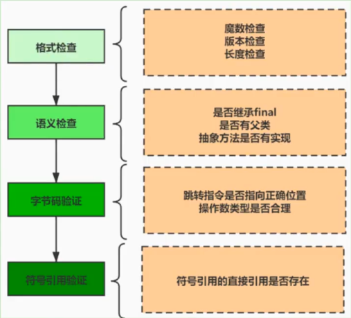

验证的内容则涵盖了类数据信息的格式验证、语义检查、字节码验证，以及符号引用验证等

* 其中格式验证会和加载阶段一起执行。验证通过之后，类加载器才会成功将类的二进制数据信息加载到方法区中
* 格式验证之外的验证操作将会在方法区中进行

链接阶段的验证虽然拖慢了加载速度，但是它免了在字节码在运行时还要进行各种检查（磨刀不误砍柴功）


​    **==格式验证==**：是否以魔数 OXCAFEBABE 开头，主版本和副版本号是否在当前 Java 虚拟机的支持范围内，数据中每一个项是否都拥有正确的长度等

​    **==语义检查==**：但凡在语义上不符合规范的，虚拟机也不会给予验证通过。比如

1、是否所有的类都有父类的存在（在 Java 里，除了 Object 外，其他类都应该有父类）

2、是否一些被定义为 final 的方法或者类被重写或继承了

3、非抽象类是否实现了所有抽象方法或者接口方法

4、是否存在不兼容的方法

* 比如方法的签名除了返回值不同，其他都一样，这种方法会让虚拟机无从下手调度
* abstract 情况下的方法，就不能是 final 的了

​    **==字节码验证==**：字节码验证也是验证过程中最为复杂的一个过程。它试图通过对字节码流的分析，判断字节码是否可以被正确执行，比如

1、在字节码的执行过程中，是否会跳转到一条不存在的指令

2、函数的调用是否传递了正确类型的参数

3、变量的赋值是不是给了正确的数据类型等

​    栈映射帧（ StackMapTable）就是在这个阶段，用于检测在特定的字节码处，其局部变量表和操作数栈是否有着正确的数据类型

​    但遗憾的是，**==100% 确地判断一段字节码是否可以被安全执行是无法实现的==**，因此，该过程只是尽可能地检查出可以预知的明显的问题

​    如果在这个阶段无法通过检查，虚拟机也不会正确装载这个类。但是，**如果通过了这个阶段的检查，也不能说明这个类是完全没有问题的** 

​    **==符引用验正==**：Class 文件会在其常量池会通过字符串记录自己将要使用的其他类或者方法。因此，在验证阶段，**虚拟机就会检查这些类或者方法确实是存在的，并且当前类有权限访问这些数据** 

​    如果一个需要使用类无法在系统中找到，则会抛出 NoClassDefFoundError，如果一个方法无法被找到，则会抛出 NoSuchMethodError，**此阶段在解析环节才会执行** 


### 准备（Preparation）阶段

> 作用

为类的**静态变量**分配内存，并**将其初始化为默认值** 

​    当一个类验证通过时，Java 虚拟机就会进入准备阶段。在这个阶段，虚拟机就会为这个类分配相应的内存室间，并设置默认初始值


> 注意

1、这里不包含基本数据类型的字段用 static final 修饰的情况，**因为 final 在==编译时==就会分配了**，准备阶段会显式赋值

2、注意这里不会为实例变量分配初始化，类变量会分配在方法区中，而实例变量是会随着对象一起分配到 Java 堆中

3、在这个阶段并不会像初始化阶段中那样会有初始化或者代码被执行


### 解析（Resolution）阶段

> 作用

将类、接口、字段、方法的符号引用转为直接引用

​    符号引用就是一些字面量的引用，跟虚拟机的内部数据结构和内存布局无关。比较容易理解的就是在 Class 类文件中，通过常量池进行了大量的符号引用

​    但是在程序实际运行时，只有符号引用是不够的。比如当如下  println() 方法被调用时，系统需要明确知道该方法的位置

​    以方法为例，Java 虚拟机为每个类都淮备了一张方法表，所有的方法都列在表中，当需要调用一个类的方法的时候，只要知道这个方法在方法表中的偏移量就可以直接调用该方法。**通过解析操作，符号引用就可以转变为目标方法在类 方法表中的位置，从而使得方法被成功调用** 


> 小结

​    所谓解析就是将符号引用转为直接用，也就是得到类、字段、方法在内存中的指针或者偏移量。因此，可以说，如果直接引用存在，那么可以肯定系统中存在该类、方法或者字段。**但只存在符号引用，不能确定系统中一定存在该结构** 

​    不过 Java 虛拟机规范并没有明确要求解析阶段一定要按照顺序执行。在 HotSpot VM中，加载、验证、准备和初始化会按照顺序有条不地执行，但链接阶段中的解析操作往往会件随着 JVM 在执行完初始化之后再执行


## 4、初始化（Initialization）阶段

> 作用

为类的静态变量赋予正确的**初始值** 


> 具体描述

​    类的初始化是类装载的最后一个阶段，前面的步骤都没有问题，那么表示类可以顺利装载到系统中。此时，类才会开始执行 Java 字节码（**即：到了初始化阶段，才真正开始执行类中定义的 Java 程序代码**）


初始化阶段的重要工作是执行类的初始化方法：`<clinit>() ` 方法

1、该方法仅能由 Java 编译器生成并由 JVM 调用，程序开发者无法自定义一个同名的方法，更无法直接在 Java 程序中调用该方法，虽然该方法也是由字节码指令所组成

2、它是**由类静态成员的赋值语句以及 static 语句块合并产生的** 


​    在加载一个类之前，虚拟机总是会试图加载该类的父类，因此**父类的 <c1init> 总是在子类 <c1init> 之前被调用也就是说，父类的 static 块优先级高于子类** 


​    Java 编译器并不会为所有的类都产生 <c1init> 初始化方法。**以下情况类在编译为字节码后，字节码文件中将不会包含<c1init>（）方法** 

1、一个类中并没有声明任何的类变量，也没有静态代码块

2、一个类中声明类变量，但是**没有明确使用类变量的初始化语句以及静态代码块来执行初始化操作** 

3、一个类中**包含 static final 修饰的基本数据类型的字段**，这些类字段初始化语句采用编译时常量表达式


### 准备阶段和初始化阶段的赋值比较

```java
public class InitializationTest2 {
    public static int a = 1;       // 在初始化阶段<clinit>()中赋值
    public static final int INT_CONSTANT = 10; // 在链接阶段的准备环节赋值

    public static final Integer INTEGER_1 = Integer.valueOf(100); // 在初始化阶段<clinit>()中赋值
    public static Integer INTEGER_2 = Integer.valueOf(1000);      // 在初始化阶段<clinit>()中赋值

    public static String s2 = "cccc";           // 在初始化阶段<clinit>()中赋值
    public static final String s0 = "aaaaa";        // 在链接阶段的准备环节赋值
    public static final String s1 = new String("bbbb"); // 在初始化阶段<clinit>()中赋值

    public static final int NUM1 = new Random().nextInt(10); // 在初始化阶段<clinit>()中赋值
}
```

在**==链接阶段的准备环节==**赋值的情况：

​    1、对于基本数据类型（不包括包装类）的字段来说，如果**使用 static final 修饰**，则显式赋值（**直接赋值常量**，而非调用方法）通常是在链接阶段的准备环节进行

​    2、对于 String 来说，如果**使用字面量的方式赋值，使用 static final 修饰**的话，则显式赋值通常是在链接阶段的准备环节进行

在**初始化阶段<clinit>()中**赋值的情况：

​    排除上述的在准备环节赋值的情况之外的情况

> 最终结论

​    **==使用 static + final 修饰==**，且显示赋值中**==不涉及到方法或构造器调用==**的**==基本数据类型（不包含包装类）==**或 **==String 类型==**的**==显式赋值==**，是在链接阶段的准备环节进行


> <clinit> 的线程安全情况

​    虚拟机会保证一个类的 <c1init>（）方法在多线程坏境中被正确地加锁、同步，如果多个线程同时去初始化一个类，那只会有一个线程去执行这个类的 <c1init>（） 方法，其他线程都需要阻塞等待，直到活动线程执行<c1init>（）方法完毕

​    正是因为函数 <c1nit>（）带锁线程安全的，因此，如果在一个类的 <clinit>（）方法中有耗时很长的操作，就可能造成多线程阻塞，引发死锁。并且这种死锁是很难发现的，因为看起来它们并没有可用的锁信息

​    如果之前的线程成功加载了类，则等在队列中的线程就没有机会再执行 <c1init>（）方法了。那么，当需要使用这个类时虚拟机会直接返回给它已经准备好的信息


### 类的主动使用和被动使用

> 主动使用

​    **Class 只有在首次使用的时候才会被装载**，Java 虚拟机不会无条件地装载 Class 类型。**Java 虛拟机规定，一个==类或接口==在初次使用前，必须要进行初始化**。这里指的 "使用" 是指主动使用，主动使用只有下列几种情况：（即：如果出现如下的情况，则会对类进行初始化操作。而初始化操作之前的加载、验证、准备已经完成）

1、创建一个类的实例时，比如使用 new 关键字，或者通过反射、克隆、反序列化

2、调用类的静态方法时，即当使用了字节码 invokestatic 指令

3、使用类、接口的静态字段时（ final 修饰特殊考虑），比如，使用 getstatic 或者 putstatic 指令

4、使用 java.lang.reflect 包中的方法反射类的方法。比如：Class.forName("com.atguigu.java.Test")

5、初始化子类时，如果发现其父类还没有进行过初始化，则需要先触发其父类的初始化

* 这条规则并不适用于接口，在初始化一个类时，并不会先初始化它所实现的接口，在初始化一个接冂时，并不会先初始化它的父接口
* 因此，一个父接口并不会因为它的子接口或者实现类的初始化而初始化。只有当程序**首次使用特定接口的静态字段**时，才会导致该接口的初始化

6、如果一个接口定义了 default 方法，那么直接实现或者间接实现该接口的类的初始化，**该接口要在其之前被初始化** 

7、虚拟机启动时，用户需要指定一个要执行的主类（包含main () 方法的那个类），虚拟机会先初始化这个主类

* JVM 启动的时候通过引导类加载器加载一个初始类。这个类在调用 public static void main（ String[] ）方法之前被链接和初始化。**这个方法的执行将依次导致所需的类的加载，链接和初始化** 

8、初次调用 **MethodHandle 实例**时，初始化该 MethodHandle 指向的方法所在的类


> 被动使用

​    **除了以上的情况属于主动使用，其他的情况均属于被动使用**。被动使用不会引起类的初始化，也就是说，并不是在代码中出现的类，就一定会被加载或者初始化。如果不符合主动使用的条件，类就不会初始化

1、当访问一个静态字段时，只有真正声明这个字段的类才会被初始化

* 当通过子类引用父类的静态变量，不会导致子类初始化

2、通过数组定义类引用，不会触发此类的初始化

3、引用常量不会触发此类或接口的初始化。因为常量在链接阶段就已经被显式赋值了

4、调用 ClassLoader 类的 loadClass() 方法加载一个类，并不是对类的主动使用，不会导致类的初始化


## 5、类的使用（Using）

​    任何一个类型在使用之前都必须经历过完整的加载、链接和初始化 3 个类加载步骤。一且一个类型成功经历过这 3个步骤后，便 "万事俱备，只欠东风"，就等着开发者使用了。

​    开发人员可以在程序中访问和调用它的静态类成员信息（比如：静态字段、静态方法），或者使用 new 关键字为其创建对象实例


## 6、类的卸载（Unloading）


### 类、类加载器、类实例

​    在类加载器的内部实现中，用一个 **Java** 集合来存放所加载类的引用。另一方面，一个 **Class** 对象总是会引用它的类加载器。调用 **Class** 对象的 **getClassLoader()** 方法，就能获得它的类加载器

​    由此可见，代表某个类的 Class 实例与其类的加载器之间为双向关联关系


​    一个类的实例总是引用代表这个类的 **Class** 对象。在 **Object** 类中定义了 **getClass()** 方法，这个方法返回代表对象所属类的 **Class** 对象的引用。此外，所有的 **Java** 类都有一个静态属性 **Class**，它引用代表这个类的 **Class** 对象


### 类的声明周期

​    当 Sample 类被加载、链接、初始化后，它的生命周期就开始了。当代表 Sample 类的 Class 对象不再被引用，即不可触及时，Class 对象就会结束生命同期，Sample 类在方法区内的数据也会被卸载，从而结束 Sample 类的生命周期

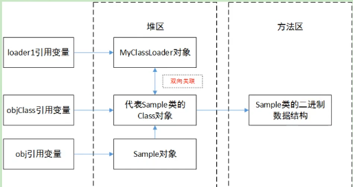

loader1 变量和 obj 变量间接应用代表 Sample 类的 Class 对象，而 objClass 变量则直接引用它

​    如果程序运行过程中，将上左侧三个引用变量都置为 null，此时 Sample 对象结束生命周期，MyClassLoader 对象结束生命周期，代表 Samle 类的 Class 对象也结束生命周期， Sample 类在方法区内的二进制数据被卸载

​    当再次有需要时，会检查 Sample 类的 Class 对象是否存在，如果存在会直接使用，不再重新加载。如果不存在Sample 类会被重新加载，在 Java 虚拟机的堆区会生成一个新的代表 Sample 类的 Class 例（可通过哈希码查看是否是同一个实例）


### 类的卸载

1、**启动类加载器**加载的类型在整个运行期间是不可能被卸载的（ JVM 和 JLS 规范）

2、**系统类加载器和扩展类加载器**加载的类型在运行期间不太可能被卸载，因为系统类加载器实例或者扩展类的实例基本上在整个运行期间总能被直接或者间接的访问的到，其达到 unreachable 的可能性极小

3、被开发者自定义的类加载器实例加载的类型**只有在很简单的上下文坏境中才能被卸载，而且一般还要借助于强制调用虚拟机的垃圾收集功能才可以做到**。可以预想，稍微复杂点的应用场景中（比如：很多时候用户在开发自定义类加载器实例的时候采用缓存的策略以提高系统性能），被加载的类型在运行期间也是几乎不太可能被卸载的（至少卸载的时间是不确定的）

​    综合以上三点，一个已经加载的类型被卸载的几率很小，至少被卸载的时间是不确定的。同时我们可以看的出来，开发者在开发代码时候，不应该对虛拟机的类型卸载做任何假设的前提下，来实现系统中的特定功能


# 四、类加载器

## 1、概述

类加载器是 JVM 执行类加载机制的前提

> ClassLoader 的作用

​    **ClassLoader 是 Java 的核心组件，所有的 Class 都是由 ClassLoader 进行加载的**，ClassLoader 负责通过各种方式将 Class 信息的二进制数据流读入 JVM 内部，转换为一个与目标类对应的 java.lang.Class 对象实例，然后交给 Java 虚拟机进行链接、初始化等操作

​    因此，**ClassLoader 在整个装载阶段，只能影响到类的加载**，而无法通过 ClassLoader 去改变类的链接和初始化行为。**至于它是否可以运行，则由 ExecutionEngine 决定** 

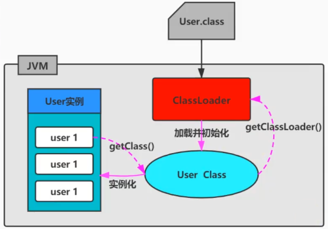


### 类的加载分类

> 显示加载、隐式加载

Class 文件的显式加载与隐式加载的方式是指 JVM 加载 Class 文件到内存的方式

​    **==显式加载==**：在代码中通过调用 ClassLoader 加载Class 对象，如直接使用 Class.forName(name) 或this. getClass().getClassLoader().loadClass() 加载 class 对象

​    **==隐式加载==**：不直接在代码中调用 ClassLoader 的方法加载 Class 对象，而是通过虚拟机自动加载到内存中，如在加载某个类的 class文件时，该类的 class 文件中引用了另外一个类的对象，此时**额外引用的类将通过 JVM 自动加载到内存中** 


### 命名空间

​    **对于任意一个类，都需要由加载它的类加载器和这个类本身一同确认其在 Java 拟机中的唯一性**。每一个类加载器，都拥有一个独立的类名称空间

​    **比较两个类是否相等，只有在这两个类是==由同一个类加载器加载==的前提下才有意义**。否则即使这两个类源自同一个Class 文件，被同一个虚拟机加载，**只要加载他们的类加载器不同，那这两个类就必定不相等** 

> 命名空间

1、每个类加载器都有自己的命名空间，**命名空间由该加载器及所有的父加载器==所加载的类==组成** 

2、在同一命名空间中，不会出现类的完整名字（包括类的包名）相同的两个类

3、在不同的命名空间中，有可能会出现类的完整名字（包括类的包名）相同的两个类

在大型应用中，我们往往借助这一特性，来运行同一个类的不同版本


### 类加载机制特征

​    **==双亲委派模型==**：但不是所有类加载部遵守这个模型，有的时候，启动类加载器所加载的类型，是可能要加载用户代码的，比如 JDK 内部的 ServiceProvider / ServiceLoader 机制，用户可以在标准 API 框架上，提供自己的实现，JDK 也需要提供一些默认的参考实现。例如，Java 中 NDI、JDBC、文件系统、 Cipher 等很多方面，都是利用的这种制，这**种情况就不会用双亲交派模型去加载，而是利用所谓的上下文加载器** 

​    **==可见性==**：子类加载器可以访问父加载器加载的类型，但是反过来是不允许的。不然，因为缺少必要的隔离，我们就没有办法利用类加载器去实现容器的逻缉

​    **==单一性==**：由于父加载器的类型对于子加载器是可见的，所以父加载器中加载过的类型，就不会在子加载器中重复加载，但是注意，**在不同的类加载器中，同一类型仍然可以被加载多次，因为互相并不可见** 


## 2、类加载器的分类

JVM 支持两种类型的类加载器，分别为**引导( 启动 )类加载器（ Bootstrap  ClassLoader）和自定义类加载器** 

​    从概念上来讲，自定义类加载器一般指的是程序中由开发人员自定义的一类类加载器，但是 Java 虚拟机规却没有这么定义，**JVM 规范将所有==派生于抽象类 ClassLoader== 的类加载器都划分为==自定义类加载器==**。无论类加载器的类型如何划分，在程序中我们最常见的类加载器结构主要是如下情况

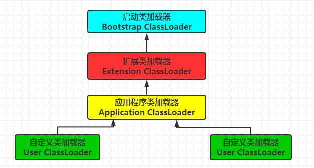

除了顶层的启动类加载器外，其余的类加载器都应当有自己的 “父类” 加载器

不同类加载器看似是继承关系，实际上是包含关系。**在下层加载器中，包含着上层加载器的引用** 


### 启动类加载器（Bootstrap）

1、这个类加载使用 C/C++ 语言实现的，嵌套在 JVM 内部，它**用来加载 Java 的核心库**（ JAVA_HOME/jre/lib/rt.jar 或 sun.boot.class.path 路径下的内容）。用于提供 JVM 自身需要的类

2、并不继承自 java.lang.ClassLoader，没有父加载器

3、**出于安全考虑， Bootstrap 启动类加载器只加载包名为 java、javax、sun 等开头的类** 

4、加载扩展类和应用程序类加载器，并指定为他们的父类加载器


### 扩展类加载器（Extension）

1、Java 语言编写，由  sun.misc.Launcher$ExtClassLoader 实现

2、继承于 ClassLoader 类，父类加载器为启动类加载器

3、从 **java.ext.dirs** 系统属性所指定的目录中加载类库，或从 JDK 的安装目录的 **jre/lib/ext** 子目录下加载类库。如果用户创建的 jar 放在此目录下，也会自动由扩展类加载器加载


### 应用程序类加载器（application）

1、Java 语言编写，由 sun.misc.Launcher$AppClassLoader 实现

2、继承于 ClassLoader 类，父类加载器为括展类加载器

3、它负责加载环境交量 classpath 或系统属性 java.class.path 指定路径下的类库

4、应用程序中的类加载器默认是系统类加载器，它是用户自定义类加载器的默认父加载器

5、通过 ClassLoader 的 getSystemClassLoader() 方法可以获取到该类加载器


### 用户自定义类加载器

​    1、在 Java 的日常应用程序开发中，类的加载几乎是由上述 3 种类加载器相互配合执行的。在必要时，我们还可以自定义类加载器，来定制类的加载方式

​    2、体现 Java 语言强大生命力和巨大魅力的关键因素之一便是 Java 开发者可以自定义类加载器来实现类库的动态加载，加载源可以是本地的 jar 包，也可以是网络上的远程资源

​    3、**通过类加载器可以实现非常绝妙的插件机制**，这方面的实际应用案例举不胜举。例如，善名的 0SGI 组件框架，再如 Eclipse 的插件机制。类加载器为应用程序提供了一种动态增加新功能的机制，这种机制无须重新打包发布应用程序就能实现

​    4、**自定义类加载器能够实现应用隔离**，例如 Tomcat、Spring 等中间件和组件框架都在内部实现了自定义的加载器，并通过自定义加载器隔离不同的组件模块。这种机制比 C/C++ 程序要好太多，**想不修改 C/C+ 程序就能为其新增功能，几乎是不可能的，仅仅一个兼容性便能阻挡住所有美好的设想** 

​    5、自定义类加载器通常需要承于 ClassLoader


## 3、测试不同的类加载器

> 获取 ClassLoader 途径

获取当前类的 ClassLoader：**clazz.getClassLoader()** 

获取当前线程上下文的 ClassLoader：**Thread.currentThread().getContextClassLoader()** 

获取系统类加载器：**ClassLoader.getSystemClassLoader()** 

​    站在程序的角度看，引导类加载器与另外两种类加载器（系统类加载器和扩展类加载器）并不是同一个层次意义上的加载器，引导类加载器是使用 C/C++ 语言编写而成的，而另外两种类加载器则是使用 Java 语言编写而成的。**由于引导类加载器压根儿就不是一个 Java 类，因此在 Java 程序中只能打印出空值** 


> 关于数组

​    数组类的 Class 对象，不是由类加载器去创建的，而是在 Java 运行期间 JVM 根据需要自动创建的。对于数组类的类加器来说，是**通过 Class.getClassLoader() 返回**的，**==与数组当中元素类型的类加载器是一样的==**；如果数组当中的元素类型基本数据类型时，是没有类加载器，因为基本数据类型是 JVM 预先自定义的，不需要加载


## 4、ClassLoader 源码解析

> ClassLoader 与现有类加载器的关系

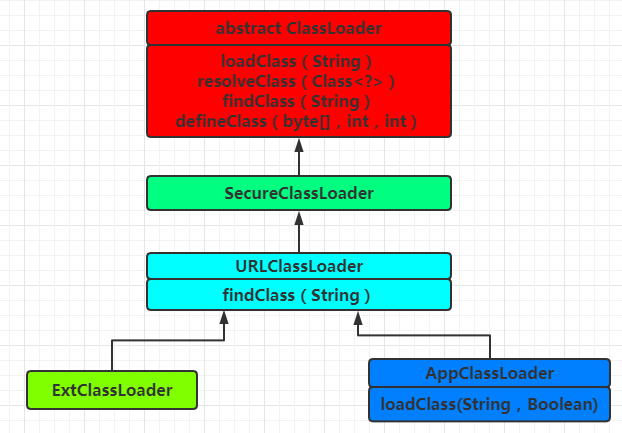

​    除了以上虚拟机自带的加载器外，用户还可以定制自己的类加载器。**Java 提供了抽象类 java.lang.ClassLoader，所有用户自定义的类加载器都应该继承 ClassLoader 类** 


### ClassLoader 的主要方法

> **public final ClassLoader getParent()** 

返回该类的父加载器


> **public Class<?>  loadClass（String name）throws ClassNotFoundException** 

​    加载名称为 name 的类，返回结果为 java.lang.Class 类的实例。如果找不到类，则返回 ClassNotFoundException异常。**==该方法中的逻辑就是双亲委派模式的实现==** 

```java
// 加载测试代码
ClassLoader.getSystemClassLoader.loadClass("com.tfc.java.User")；

// resolve 为 true 表示加载的时候进行解析，源码中为 false
protected Class<?> loadClass(String name, boolean resolve) throws ClassNotFoundException{
    synchronized (getClassLoadingLock(name)) {  // 同步操作，只能加载一次
    // 首先检查是否已经加载过同名的类
    Class<?> c = findLoadedClass(name);
    if (c == null) {
        long t0 = System.nanoTime();
        try {
        // 获取当前类加载器的父加载器
        if (parent != null) {
            // 双亲委派机制：如果存在父加载器，则调用父加载器进行加载
            c = parent.loadClass(name, false);
        } else { // parent 为 null，父加载器是引导类加载器
            c = findBootstrapClassOrNull(name);
        }
        } catch (ClassNotFoundException e) {
        // ClassNotFoundException thrown if class not found
        // from the non-null parent class loader
        }

        // 当前类的父加载器未加载此类 or 当前类加载器未加载此类
        if (c == null) {
        // If still not found, then invoke findClass in order
        // to find the class.
        long t1 = System.nanoTime();
        // 调用当前 ClassLoader 的 findClass() 
        c = findClass(name);

        // this is the defining class loader; record the stats
        sun.misc.PerfCounter.getParentDelegationTime().addTime(t1 - t0);
        sun.misc.PerfCounter.getFindClassTime().addElapsedTimeFrom(t1);
        sun.misc.PerfCounter.getFindClasses().increment();
        }
    }
    if (resolve) {   // 是否进行解析
        resolveClass(c);
    }
    return c;
    }
}
```


> **protected Class<?> findClass（String name）throws ClassNotFoundException** 

​    查找二进制名称为 name 的类，返回结果为 java.lang.Class 类的实例。这是一个受保护的方法，JVM 鼓励我们重写此方法，自定义加载器需要遵循双亲委托机制，**该方法会在检查完父类加载器之后被 loadClass（）方法调用** 

​    在 JDK 1.2 之前，在自定义类加载时，总会去继承 ClassLoader 类并重写方法，从而实现自定义的类加载类。但是**在 JDK 1.2 之后已不建议用户去覆盖 ==loadClass（）==方法，而是建议把自定义的类加载==逻辑写在 findClass（）==方法中** 

​    从前面的分析可知，==**findClass（）方法是在 loadClass（）方法中被调用的**==，当 loadClass（）方法中父加载器加载失败后，则会调用自己的 findClass（）方法来完成类加载，这样就可以保证自定义的类加载器也符合双亲委托模式

​    需要注意的是 **ClassLoader类中并没有实现 findClass（）方法的具体代码逻辑，而是==被子类(URLClassLoader)重写==**，取而代之的是抛出 ClassNotFoundException 异常，同时应该知道的是 **findClass（）方法通常是和 defineClass（）方法一起使用的** 

​    一般况下，**在自定义类加载器直接覆盖 ClassLoader 的 findClass（）方法并编写加载规则，取得要加载类的节码后转换成流，==然后调用 defineClass（）方法生成类的 Class 对象==** 


> **protected final Class<?> defineClass（String name，byte[] b，int off，int len）** 

​    **根据给定的字节数组 b 转换为 Class 的实例**，off 和 len 参数表示实际 Class 信息在 byte 数组中的位置和长度，其中 byte 数组 b 是 ClassLoader 从外部获取的。这是受保护的方法，只有在自定义 ClassLoader 子类中可以使用

​    **defineClass（）方法是用来将 byte 字节流解析成 JVM 能够识别的 Class 对象（ClassLoader 中己实现该方法逻辑）**，通过这个方法不仅能够通过 class 文件实例化 Class 对象，也可以通过其他方式例化 Class 对象，如通过网络接收一个类的字节码，然后转换为 byte 字节流创建对应的 Class 对象

​    **defineClass（）方法通常与 findClass（）法一起使用**，一般情况下，**==在自定义类加载器时，会直接覆盖Classloader的 findClass（）方法并编写加载规则，取得要加载的类的字节码后转换成流，然后调用 defineClass（）方法生成类的Class 对象==** 

简单举例：

```java
protected Class<?> findClass(String name) throws ClassNotFoundException {
    // 获取类的class文件字节数组
    byte[] classData = getClassData(name);
    if (classData == null) {
    throw new ClassNotFoundException();
    } else {
    //直接生成class对象
    return defineClass(name, classData, 0, classData.length);
    }
}
```


> **protected final void resolveClass（Class<?> c）** 

​    链接指定的一个 Java 类。使用该方法可以使用类的 Class 对象创建完成的同时也被解析。前面我们说链接阶段主要是对字节码进行验证，为类交量分配内存并设置初始值同时将字节码文件中的符号引用转换为直接引用


> **protected final Class<?> findLoadedClass（String name）** 

查找名称为 name 的已经被加载过的类，返回结果为 java.lang.Class 类的实例。这个方法是 final 方法，无法被修改


> **private final ClassLoader parent** 

​    它也是一个 ClassLoader 的实例，这个字段所表示的 ClassLoader 也称为这个 ClassLoader 的双亲。在类加载的过程中，ClassLoader 可能会将某些请求交予自己的双亲处理


## 5、SecureClassLoader、URLClassLoader


​    SecureClassLoader 扩展了 ClassLoader，新增了几个与使用相关的代码源（对代码源的位置及其证书的验证）和权限定义类验证（主要指对 Class 源码的访问权限）的方法，一般我们不会直接跟这个类打交道，更多是与它的子类       URLClassLoader 有所关联

​    前面说过，ClassLoader 是一个抽象类，很多方法是空的没有实现，比如 findClass（）、findResource（）等。而URLClassLoader 这个实现类为这些方法提供了具体的实现。并新增了 URLClassPath 类协助取得 Class 字节码流等功能

​    **在编写自定义类加载器时，如果没有太过于复杂的需求，可以直接继承 URLClassLoader 类**，这样就可以避免自己去编写 findClass（）方法及其获取字节码流的方式，使自定义类加载器编写更加简洁


> Class.forName（）与 ClassLoader.loadClass（）

​    **Class.forName（）是一个==静态方法==**，最常用的是 Class.forName（ String className），根据传入的类的全限定名返回一个 Class 对象。**该方法在将 Class 文件加载到内存的同时，==会执行类的初始化==** 

​    **ClassLoader.loadClass（）是一个==实例方法==**，需要一个 ClassLoader 对象来调用该方法。**该方法将 Class 文件加载到内存时，==并不会执行类的初始化==**，直到这个类第一次使用时才进行初始化。该方法因为需要得到 ClassLoader 对象，所以可以根据需要定使用哪个类加载器


## 6、双亲委派机制

> 定义

​    如果一个类加载器在接到加载类的请求时，它首先不会自己尝试去加载这个类，而是把这个请求任务委托给父加载器去完成，依次递归，如果父加载器可以完成类加载任务，就成功返回。只有父类加载器无法完成此加载仼务时，才自己加载

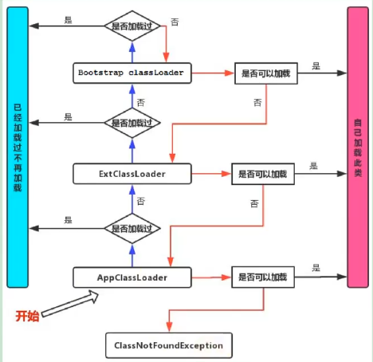


### 优势

1、避免类的重复加载，确保一个类的全局唯一性

​    Java 类随着它的类加载器一起具备了一种带有优先级的层次关系，通过这种层级关可以**免类的重复加载**，当父亲已经加载了该类时，就没有必要子 ClassLoader 再加载一次

2、保护程序安全，防止核心 API 被随意篡改

​    JDK 为核心类库提供了一层保护机制。**不管是自定义的类加载器，还是系统类加载器或扩展类加载器，最终都必须调用java.lang.ClassLoader.defineClass（String，byte[]，int，int，ProtectionDomain）方法，而该方法会执行 preDefineClass（）接口，该接口中提供了对 JDK 核心类库的保护** 


亲委派机制在 **java.lang.ClassLoader.loadClass（String，boolean）**接口中体现。该接口的逻辑如下

1、先在当前加载器的缓存中查找有无日标类，如果有，直接返回

2、判断当前加载器的父加载器是否为空，如果不为空，则调用 parent.loadClass（name, false）接口进行加载

3、如果当前加载器的父类加载器为空，则调用 findBootstrapClassOrNull（name）接口，让引导类加载器进行加载

4、如果通过以上 3 条路径都没能成功加载，则调用 findClass（name）接口进行加载。该接口**最终会调用       java.lang.Cl assLoader 接口的 defineClass 系列的 native 接口加载目标** 

Java 类双亲委派的模型就隐藏在这第 2 和第 3 步中


### 弊端

​    检查类是否加载的委托过程是单向的，这个方式虽然从结构上说比较清晰，使各个 ClassLoader 的职责非常明确，但是同时会带来一个问题，即顶层的 ClassLoader 无法访问底层的 ClassLoader 所加载的类

​    通常情况下，启动类加载器中的类为系统核心类，包括一些重要的系统接口，而在应用类加载器中，为应用类。按照这种模式，**应用类访问系统类自然是没有问题，但是系统类访问应用类就会出现问题** 

​    比如在系统类中提供了一个接口，该接口需要在应用类中得以实现，该接口还绑定一个工厂方法，用于创建该接口的实例，而接口和工厂方法都在启动类加载器中。这时，就会出现该工厂方法无法创建由应用类加载器加载的应用实例的问题


> 结论

​    **由于 Java 虚拟机规范其没有明确要求类加载器的加载机制一定要使用双亲委派模型**，只是建议釆用这种方式而已，比如在 Tomcat 中，类加载器所采用的加载机制就和传统的双亲委派模型有一定区别，当缺省的类加载器接收到一个类的加载任务时，**首先会由它自行加载，当它加载失败时，才会将类的加载任务委派给它的父加载器去执行**，这同时也是Servlet 规范推荐的一种做法


### 破坏双亲委派机制

> 第一次破坏

双亲委派模型的第一次 “被破坏” 其实发生在双亲委派模型出现之前——即 JDK 1.2 面世以前的 “远古” 时代

​    由于双亲委派模型在 JDK 1.2 之后才被引入，但是类加载器的概念和抽象类 java.lang.ClassLoader 则在 Java 的第一个版本中就己经存在

​    面对已经存在的用户自定义类加载器的代码，Java 设计者们引入双亲委派模型时不得不做出一些妥协，**为了兼容这些已有代码，无法再以技术于段避免 loadClass（）被子类覆盖的可能性**，只能在 JDK 1.2 之后的 java.lang.ClassLoader中添加一个新的 protected 方法 findClass（），并引导用户编写的类加载逻辑时尽可能去重写这个方法，而不是在       loadClass（）中编写代码

​    己经分析过 loadClass（）方法，双亲委派的具体逻辑就实现在这里面，按照 loadClass（）方法的逻辑，如果父类加载失败，会自动调用自己的 findClass（）方法来完成加载，这样既不影响用户按照自己的意愿去加载类，又可以保证新写出来的类加载器是符合双亲委派规则的


> 第二次破坏

​    **双亲委派模型的第二次 “被破坏” 是由这个模型==自身的缺陷==导致的**，双亲委派很好地解决了各个类加载器协作时基础类型的一致性问题（越基础的类由越上层的加载器进行加載），基础类型之所以被称为 “基础”，是因为它们总是作为被用户代码继承、调用的 API 存在，但程序没计往往没有绝对不变的完美规则，**如果有基础类型要调用用户的代码？** 

​    这并非是不可能出现的事情，一个典型的例了便是 JNDI 服务，JNDI 现在已经是 Java 的标准服务，它的代码由启动类加载器来完成加载（在 JDK 1.3 时加入到 rt.jar 的），肯定属于 Java 中很基础的类型了

​    但 JNDI 存在的目的就是对资源进行查找和集中管理，它需要调用由其他厂商实现并部署在应用程序的 ClassPath 下的服务提供者接口（Service provider interface，SPI ）的代码，现在问题来了，**启动类加载器是绝不可能认识、加载这些代码的，那该怎么办？** 

* SPI：在 Java 平台中，通常把核心类 rt.jar 中提供外部服务、可由应用层自行实现的接口称为 SPI

​    为了解决这个困境，Java 的设计团队只好引入了一个不太优雅的没计：**==线程上下义类加载器==**。这个类加载器可以通过 java.lang.Thread 类的 setContextClassLoader（）方法进行设置，如果建线程时还未设置，它将会从父线程中继承一个，如果在应用程序的全局范国内都没有设置过的话，那这个类加载器默认就是应用程序类加载器

​    有了线程上下文类加载器，程序就可以做一些 “舞弊” 的事情了。**JNDI 服务使用这个线程上下文类加载器去加载所需的 SPI 服务代码，这是一种==父加载器去请求子加载器完成类加载的行为==**，这种行为实际上是打通了双亲委派模型的层次结构来逆向使用类加载器，已经违背了双亲委派模型的一般性原则，但也是无可奈何的事情。Java 中涉及 SPI 的加载基本上都采用这种方式来完成，例如 JNDI、JDBC、JCE、JAXB、JBI 等

​    不过，当 SPI 的服务提供者多于一个的时候，代码就只能根据具体提供者的类型来硬编码判断，为了消除这种极不雅的实现方式，在 JDK 6 时，JDK 提供了 java.util.ServiceLoader 类，以 META-INF / services 中的配置信息，辅以责任链模式，这才算是给 SPI 的加载提供了一种相对合理的解决方案


> 第三次破坏

​    双亲委派模型的第三次 “被破坏” 是由于**用户对程序动态性的追求**而导致的。如：代码热替换（ Hot Swap）、模块热部署（ Hot Deployment）等

​    IBM 公司主导的 JSR-291（即 OSGi  R4.2）实现模块化热部署的关键是它自定义的类加载器机制的实现，每一个程序模块（OSGi 中称为 Bundle）都有一个自己的类加器，当需要更换一个 Bundle 时，就把 Bundle 连同类加载器一起换掉以实现代码的热替换。在 OSGi 环境下，类加载器不再是双亲委派模型推荐的树状结构，而是进一步发展为更加复杂的网状结构

当收到类加载请求时，OSGi 将按照下面的顺序进行类搜索：

1、将以 java.* 开头的类，委派给父类加载器加载

2、否则，将委派列表名单内的类，委派给父类加载器加载

3、否则，将 Import 列表中的类，委派给 Export 这个类的 Bundle 的类加载器加载

4、否则，查找当前 Bundle 的 ClassPath，使用自己的类加载器加载

5、否则，查找类是否在自己的 Fragment Bundle 中，如果在，则委派给 Fragment Bundle 的类加载器加载

6、否则，查找 Dynamic Import 列表的 Bundle，委派给对应 Bundle 的类加器加载

7、否则，类查找失败

说明：只有开头两点仍然符合双亲委派模型的原则，其余的类查找都是在平级的类加载器中进行的


## 7、自定义类加载器


> 为什么要自定义类加载器

​    **==隔离加载类==**：在某些框架内进行中间件与应用的模块隔离，把类加载到不同的环境。比如：阿里内某容器框架通过自定义类加载器确保应用中依赖的 jar 包不会影响到中间件运行时使用的 jar 包。再比如：Tomcat这类 Web 应用服务器，内部自定义了好几种类加载器，用于隔离同一个 Web 应用服务器上的不同应用程序

​    **==修改类的加载方式==**：类的加载模型并非强制，除 Bootstrap 外，其他的加载并非一定要引入，或者根据实际情况在某个时间点进行按需进行动态加载

​    **==扩展资源==**：比如从数据库、网络、甚至是电视机机顶盒进行加载

​    **==防止源码泄漏==**：Java 代码容易被编译和篡改，可以进行编译加密。那么类加载也需要自定义，还原加密的字节


> 常见的场景

​    实现类似进程内隔离，类加载器实际上用作不同的命名空间，以提供类似容器、模块化的效果。例如，两个模块依赖于某个类库的不同版本，如果分别被不同的容器加载，就可以互不干扰。这个方面的集大成者是 J ava EE 和 OSGI、JPMS 等框架

​    应用需要从不同的数据源获取类定义信息，例如网络数据源，而不是本地文件系统。或者是需要自己操纵字节码，动态修改或者生成类型


注意：

​    在一般情况下，使用不同的类加载器去加载不同的功能模块，会提高应用程序的安全性。但是，如果涉及 Java 类型转换则加载器反而容易产生不美好的事情。**在做 Java 类型转换时，只有两个类型都是由同一个加载器所加载，才能进行类型转换，否则转换时会发生异常** 


### 实现

Java 提供了抽象类 java.lang.ClassLoader，所有用户自定义的类加载器都应该继承 ClassLoader 类

在自定义 ClassLoader 的子类时候，我们常见的会有两种做法：

1、重写 loadClass（）方法

2、重写 findClass（）方法（推荐）

​    这两种方法本质上差不多，**毕竞 loadClass（）也会调用 findClass（）**，但是从逻辑上讲我们最好不要直接修改loadClass（）的内部逻辑。**建议的做法是只在 findClass（）里重写自定义类的加载方法，根据参数指定类的名字，返回对应的 Class 对象的引用** 

​    loadClass（）这个方法是实现双亲委派模型逻的地方，擅自修改这个方法会导致模型被破坏，容易造成问题。因此我们最好是在双亲委派模型框架内进行小范围的改动，不破坏原有的稳定结构。同时，也邂免了自己重写 loadClass（）方法的过程中必须写双亲委托的重复代码，从代码的复用性来看，不直接修改这个方法始终是比较好的选择

​    当编写好自定义类加载器后，使可以在程序中调用 loadClass（）方法来实现类加载操作

例子

```java
package com.atguigu.java2;

import java.io.BufferedInputStream;
import java.io.ByteArrayOutputStream;
import java.io.FileInputStream;
import java.io.IOException;

/**
 * @author shkstart
 * @create 15:20
 * 自定义ClassLoader
 */
public class MyClassLoader extends ClassLoader {
    private String byteCodePaht;

    public MyClassLoader(String byteCodePaht) {
    this.byteCodePaht = byteCodePaht;
    }

    public MyClassLoader(ClassLoader parent, String byteCodePaht) {
    super(parent);
    this.byteCodePaht = byteCodePaht;
    }

    @Override
    protected Class<?> findClass(String name) throws ClassNotFoundException {
    BufferedInputStream bis = null;
    ByteArrayOutputStream out = null;
    String fileName = byteCodePaht + name + ".class";
    try {
        bis = new BufferedInputStream(new FileInputStream(fileName));
        out = new ByteArrayOutputStream();

        int len = 0;
        byte[] bytes = new byte[1024];
        while ((len = bis.read(bytes)) != -1) {
        out.write(bytes, 0, len);
        }

        byte[] bytes1 = out.toByteArray();
        Class<?> aClass = defineClass(null, bytes1, 0, bytes1.length);
        return aClass;

    } catch (IOException e) {
        e.printStackTrace();
    } finally {
        try {
        out.close();
        } catch (IOException e) {
        e.printStackTrace();
        }
        try {
        bis.close();
        } catch (IOException e) {
        e.printStackTrace();
        }
    }
    return null;
    }
}
```

```java
public class MyClassLoaderTest {
    public static void main(String[] args) {
    MyClassLoader loader = new MyClassLoader("C:\\Users\\tfc\\Desktop\\2\\");

    try {
        Class clazz = loader.loadClass("Demo1");
        System.out.println("加载此类的类的加载器为：" + clazz.getClassLoader().getClass().getName());

        System.out.println("加载当前Demo1类的类的加载器的父类加载器为：" + clazz.getClassLoader().getParent().getClass().getName());
    } catch (ClassNotFoundException e) {
        e.printStackTrace();
    }
    }
}
```


