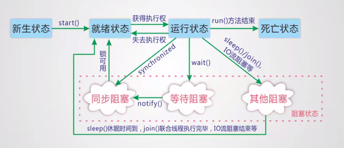

## 一、I/O 操作

### 1、基本操作顺序

1、选择源（文件）

2、选择流

3、读取/写出 数据

4、关闭资源

* 绝大部分**字节流**是继承自 **InputStream / OutputStream** 
* 绝大部分**字符流**是继承自 **Reader / Writer** 

### 2、InputStream

```java
public class InputStreamTest {
    public static void main(String[] args) throws Exception {
        File file = new File("a.txt");                       // 选择源
        InputStream in = new FileInputStream(file);			 // 选择流
        int len = 0;
        byte[] bytes = new byte[100];
        while ((len = in.read(bytes)) != -1) {				 // 读取数据
            System.out.println(new String(bytes, 0, len));
        }
        in.close(); 										 // 释放资源
    }
}
```

### 3、OutputStream

```java
public class OutputStreamTest {
    public static void main(String[] args) throws Exception {
        File file = new File("a.txt");						// 选择源
        OutputStream out = new FileOutputStream(file, true);  // 选择流（加 true 是追加）
        byte[] bytes = "\n徐晓嫡长子徐凤年在此求死".getBytes();
        out.write(bytes, 0, bytes.length);				     // 操作数据
        out.close();								       // 关闭资源
    }
}
```

### 4、数据流

**DataInputStream / DataOutputStream** 

可以用来操作基本类型数据，也可以像 InputStream 那样操作

* **new DataInputStream(InputStream  in);** 
* 加缓冲
    * **DataInputStream(new BufferedInputStream（InputStream in)）** 

```java
public class DataInputStreamTest {
    public static void main(String[] args) throws Exception {
        InputStream dataInput = new DataInputStream(new FileInputStream("a.txt"));
        OutputStream dataOutput=new DataOutputStream(new FileOutputStream("a.txt"));

        dataOutput.writeUTF("徐凤年在此求死");
        dataOutput.writeInt(32132);
        System.out.println(dataInput.readUTF());
        System.out.println(dataInput.readInt());
    }
}
```


### 5、字节数组流

* 将内容变成字节数组，从字节数组中读取内容

#### ByteArrayInputStream

```java
public class ByteInputTest {
    public static void main(String[] args) throws Exception {
        byte[] bytes = "天不生我李淳罡，剑道万古如长夜！".getBytes();
        InputStream in = new ByteArrayInputStream(bytes);
        int len = 0;
        byte[] data = new byte[100];
        while ((len = in.read(data)) != -1) {
            System.out.println(new String(data, 0, len));
        }
        in.close();
    }
}
```


#### ByteArrayOutputStream

因为 **toByteArray()** 是子类方法，父类没有，要用的话必须这样创建对象

**==ByteArrayOutputStream== out=new ByteArrayOutputStream();** 

不能使用多态创建

**==OutputStream== out=new ByteArrayOutputStream();** 

```java
public class ByteOutputTest {
    public static void main(String[] args) throws IOException {
        ByteArrayOutputStream out = new ByteArrayOutputStream();
        byte[] bytes = "今日解签，宜下江南".getBytes();
        out.write(bytes);                   // 写到缓存中
        byte[] data = out.toByteArray();    // 获取缓存中的内容
        System.out.println(new String(data, 0, data.length));
    }
}
```


### 6、缓冲流

有缓冲区，读取速度快一些

#### BufferedrInputStream

```java
public class BufferedInputTest {
    public static void main(String[] args) throws Exception {
        InputStream in = new BufferedInputStream(new FileInputStream("a.txt"));
        int len = 0;
        byte[] bytes = new byte[100];
        while ((len = in.read(bytes)) != -1) {
            System.out.println(new String(bytes, 0, len));
        }
        in.close();
    }
}
```


#### BufferedrOutputStream

```java
public class BufferedOutputTest {
    public static void main(String[] args) throws Exception {
      OutputStream out = new BufferedOutputStream(new FileOutputStream("a.txt",true));
      byte[] bytes = "\n愿为天地正道再修三百年，只求天地开一线，让徐脂虎飞升".getBytes();
      out.write(bytes, 0, bytes.length);
      out.flush();  // 一定要刷新一下缓冲区，不然可能没有写出到文件
      out.close();
   }
}
```


### 7、字符流

#### 7.1 Reader

```java
public class ReaderTest {
    public static void main(String[] args) throws Exception {
        Reader reader = new FileReader("a.txt");
        int len = 0;
        char[] chars = new char[10];
        while ((len = reader.read(chars)) != -1) {
            System.out.println(new String(chars));
        }
        reader.close();
    }
}
```


#### 7.2 Writer

```java
public class WriterTest {
    public static void main(String[] args) throws Exception {
        Writer writer = new FileWriter("a.txt",true);
        char[] chars = "\n天上剑仙三百万，遇我也须尽低眉".toCharArray();
        writer.write(chars);
        writer.close();
    }
}
```


#### 7.3 BufferedReader

* 加了缓冲，读写速度快

```java
public class BufferedReaderTest {
    public static void main(String[] args) throws Exception {
        BufferedReader reader = new BufferedReader(new FileReader("a.txt"));
        int len = 0;
        char[] chars = new char[20];

//        String line = null;
//        while ((line = reader.readLine()) != null) {
//            System.out.println(line);
//        }

        while ((len = reader.read(chars)) != -1) {
            System.out.println(new String(chars, 0, len));
        }
        reader.close();
    }
}
```


#### 7.4 BufferedWriter

```java
public class BufferedWriterTest {
    public static void main(String[] args) throws Exception {
        BufferedWriter writer = new BufferedWriter(new FileWriter("a.txt", true));
        char[] chars = "\n若本世子身死，徐骁必叫你广陵满城尽悬北凉刀，信否？".toCharArray();
        writer.write(chars);
        writer.flush();
        writer.close();
    }
}
```


### 8、转换流

* 将字节流转换为字符流

#### InputStreamReader

* 一般写法
    * **new InputStreamReader（InputStream in）** 
    * **InputStreamReader reader=new InputStreamReader(new FileInputStream("a.txt"));** 
* 加缓冲写法
    * **new  BufferedReader（InputStreamReader in）** 
    * **BufferedReader reader = new BufferedReader(new InputStreamReader(System.in));** 

```java
public class InputReaderTest {
    public static void main(String[] args) throws Exception {
        InputStreamReader reader = new InputStreamReader(new FileInputStream("a.txt"));
        int len = 0;
        char[] chars = new char[30];
        while ((len = reader.read(chars)) != -1) {
            System.out.println(new String(chars, 0, len));
        }
        reader.close();
    }
}
```


#### OutputStreamWriter

* 一般写法
    * **new OutputStreamWriter(OutputStream  out)** 
* 加缓冲
    * **new  BufferedWriter（OutputStreamReader in）** 

```java
public class OutputWriterTest {
    public static void main(String[] args) throws Exception{
        OutputStreamWriter writer=new OutputStreamWriter(new FileOutputStream("a.txt",true));
        char[] chars="\n此剑抚平天下不平事，此剑无愧世间有愧人！".toCharArray();
        writer.write(chars);
        writer.close();
    }
}
```


### 9、RandomAccessFile

* 有可能数组里的最后一个字节是某个完整数据的（比如一个汉字三个字节）一部分

```java
public class RandomTest {
    public static void main(String[] args) throws Exception {
    RandomAccessFile randomAccessFile = new RandomAccessFile(new File("a.txt"), "r");
    int len = 0;
    byte[] bytes = new byte[1000];
    while ((len = randomAccessFile.read(bytes)) != -1) {
        System.out.println(new String(bytes, 0, len));
    }
        randomAccessFile.close();
  }
}
```


## 二、多线程

* 线程启动之后就会执行 **run** 方法

### 1、实现方式

#### 1.1 继承 Thread 类

```java
public class ThreadTest01 extends Thread {

    @Override
    public void run() {
        for (int i = 0; i < 2000; i++) {
            System.out.println("一边听歌");
        }
    }

    public static void main(String[] args) {

        ThreadTest01 test01 = new ThreadTest01();
        test01.start();

        for (int i = 0; i < 1000; i++) {
            System.out.println("一变写代码");
        }
    }
}
```


#### 1.2 实现 Runnable接口

```java
public class RunnableTest {
    public static void main(String[] args) {
        new Thread(new Runnable() { //必须要借助 Thread 来启动线程
            @Override
            public void run() {
                for(int i=0;i<2000;i++){
                    System.out.println("1111111111111111111111111111111111111");
                }
            }
        }).start();

        for(int i=0;i<2000;i++){
            System.out.println("333333333333333333333");
        }
    }
}
```


#### 1.3 实现 Callable 接口

* 步骤：实现 Callable<T> 接口，重写 **call** 方法（该方法有返回值）

* 操作
    1. 创建执行服务
    2. 提交并执行
    3. 获取结果
    4. 关闭服务

```java
public class CallableTest implements Callable<Boolean> {
    @Override
    public Boolean call() throws Exception {
        for (int i = 0; i < 3000; i++) {
            System.out.println("11111111111111111111111111111111111111111111");
        }
        return true;
    }

    public static void main(String[] args) throws ExecutionException, InterruptedException {
        CallableTest test = new CallableTest();

        // 创建执行服务
        ExecutorService service = Executors.newFixedThreadPool(1);
        // 提交执行
        Future<Boolean> submit = service.submit(test);

        for (int i = 0; i < 3000; i++) {
            System.out.println("4444444444444444444");
        }
        // 获取结果
        boolean res = submit.get();
        System.out.println(res);
        // 关闭服务
        service.shutdown();
    }
}
```


### 2、线程状态

* 线程有五大状态



* 新生状态
    * 进程刚刚创建（new）

* 就绪状态
    * 执行 start 方法，进入就绪队列等待 CPU 的调度

* 运行状态
    * 执行 run 方法中的内容
* 阻塞状态
    * 因为某种原因进程阻塞，重新进入就绪状态，再次运行时从上次停止的地方开始运行
* 死亡状态
    * run 方法执行完毕


### 3、守护线程

* 默认所有的线程都是用户线程
    * 当所有的用户线程的 run 方法执行完后 JVM 才停止工作
* 守护线程
    * 当用户线程执行完毕之后，如果守护线程没有执行完也会立即停止执行
    * 通过  setDaemon(true) 来将用户线程设置为守护线程


### 4、线程的同步

* 问题
    * 多个对象可能同时对同一个数据进行操作，就会产生线程不安全的问题

* 解决
    * **使用 synchronized**，使用 **synchronized** 之后，其他对象要想使用就必须等待前一个对象使用完毕
    * 使用 **synchronized** 会大大的降低性能

* 使用**同步方法**和**同步块** 
    * **==同步方法==** 
        * 在方法上使用 **synchronized** 
        * **缺点** 
            * 这样会将类中的所有属性全部锁起来，即使它只是一个只读的属性，不会涉及修改
            * 性能低
    * **==同步块==** 
        * 对一个块（{}）使用 synchronized 只会锁住某一个属性，其他属性不会被锁起来
        * 性能优于同步方法

#### 4.1 同步方法

* 锁住的是该类的当前实例，同一时间只能有一个线程访问同步方法中的内容，其他线程都会被阻塞等待
* **==static==  synchronized** 锁住的是所有实例

```java
public class SynchronizedTest {

    public synchronized void test() {	// 操作的是方法，锁的是当前类的实例
        number++;
        System.out.println(number);
    }
    
}
```


#### 4.2 同步块

* 其他线程可以访问 **==非同步块==** 代码，但对同步块的访问将被阻塞

```java
public class SynchronizedTest {

    public void test() {
        ....
        synchronized (Object) {  // 锁住的是一个对象
            number++;
            System.out.println(number);
        }
        ....
    }
}
```


## 三、反射

### 3.1 获取类的各种信息

* **Class clazz = Class.forName("reflect.Person")**
    * 参数要全路径类名
* 方法中加了 Declared 的可以获取 公共（public）、私有（private）属性和方法
* 方法中没有加 Declared 的只能获取 公共（public）属性和方法

#### 获取类的名字

```java
String name = clazz.getName();
```

#### 获取类的属性

```java
Field field=clazz.getDeclaredField("name"); // 获取某一属性

Field[] fields=clazz.getDeclaredFields();   // 获取全部属性
for(Field field:fields){
    System.out.println(field);
}
```

#### 获取类的方法

```java
Method method = clazz.getDeclaredMethod("setName",String.class);

Method[] methods=clazz.getDeclaredMethods();
for(Method method:methods){
    System.out.println(method);
}
```

#### 获取类的构造器

```java
Constructor constructor=clazz.getConstructor(String.class,Integer.class,String.class);

Constructor[] constructors = clazz.getDeclaredConstructors();
for (Constructor constructor : constructors) {
	System.out.println(constructor);
}
```


### 3.2 动态调用方法

#### 获取对象

```java
Person person = (Person) clazz.getConstructor().newInstance();
```

#### 操作方法

```java
Method method = clazz.getDeclaredMethod("setName", String.class);
method.invoke(person, "徐凤年");
```

#### 操作属性

```java
Field field=clazz.getDeclaredField("name");
field.setAccessible(true);  // 跳过安全检查，访问私有属性，访问公共属性不需要
field.set(person,"徐晓");
```


