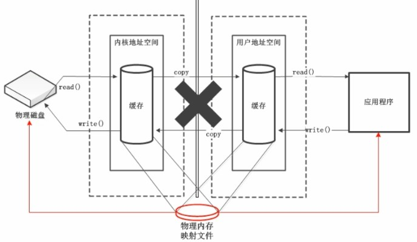

# 一、基本术语介绍

NIO 的核心有三个关键字：通道、缓冲区、选择器

> 通道

通道表示打开程序和数据源之间的连接

> 缓冲区

用来容纳数据，操作数据都是对缓冲区进行操作

缓冲区就是数组，用来存储不同的数据

> 选择器

检查一个或多个通道，并确定哪个通道可用


# 二、缓冲区（Buffer）

## 基本使用

> 缓冲区类型

```c
ByteBuffe、CharBuffe、ShortBuffe、IntBuffe、LongBuffe、FloatBuffe、DoubleBuffe
```

上述缓冲区的管理方式几乎一致，都是通过 **a1locate()** 方法获取缓冲区


> 缓冲区的核心方法

1、put()：朝缓冲区中放入数据

2、get()：从缓冲区中取出数据


> 缓冲区的四个核心属性

```java
public abstract class Buffer {
    // Invariants: mark <= position <= limit <= capacity
    private int mark = -1;
    private int position = 0;
    private int limit;
    private int capacity;
    ........
}
```

1、`capacity`：缓冲区的最大存储容量，**一旦声明，不能改变** 

2、`limit`：表示缓冲区中可供操作的大小

3、`position`：缓冲区中正在操作数据的位置

4、`mark`：用来标记当前 position 的位置（需要调用 mark() 方法），可以通过 reset() 恢复到标记位置

**0 <= mark <= position <= limit <= capacity** 

上面这几个属性都是以数组下标方式控制大小的


> 缓冲区 API 简单使用

```java
public class Demo {
    public static void main(String[] args) {
        // 新建一个缓冲区
        ByteBuffer buffer = ByteBuffer.allocate(1024);

        // 往缓冲区中写入数据
        byte[] bytes = "徐骁嫡长子徐凤年在此求死".getBytes(StandardCharsets.UTF_8);
        buffer.put(bytes);

        // 切换操作数据的模式(写到读)
        // 此操作改变了 position、limit 的位置
        buffer.flip();

        // 读取缓冲区数据
        byte[] readDatas = new byte[buffer.limit()];
        buffer.get(readDatas, 3, 9); // 这里的 3 到 9 表示的是 readDatas 中的 3 到 9
    }
}
```


## 非直接缓冲区、直接缓冲区

1、非直接缓冲区：缓冲区通过 `allocate()` 建立在 **JVM 内存**中

2、直接缓冲区：缓冲区通过 `allocateDirect()` 建立在**物理内存**中，可以提高效率

```java
public void test01() {
    ByteBuffer buffer = ByteBuffer.allocateDirect(1024);
}
```




# 三、通道（Channel）

Channel 表示 IO 源与目标打开的连接，Channel 类似于传统的“流”，只不过 **Channel 本身不能直接访问数据， Channel 只能与 Buffer 进行交互** 

> 通道类型

```c
FileChannel、SocketChannel、ServerSocketChannel、DatagramChannel
```

> 获取通道

1、Java 中针对支持通道的类提供了 getChannel() 方法来获取通道

2、JDK 1.7 以后针对各个通道提供了一个静态 open() 方法来获取通道

3、JDK 1.7 以后的 Files 工具类的 newByteChannel() 方法

非直接缓冲区的文件复制

```java
public void test01() throws Exception {
    FileInputStream fis = new FileInputStream("11.jpg");
    FileOutputStream fos = new FileOutputStream("22.jpg");

    // 获取通道
    FileChannel inChannel = fis.getChannel();
    FileChannel outChannel = fos.getChannel();

    // 创建一个缓冲区
    ByteBuffer buffer = ByteBuffer.allocate(1024);

    // 将通道中的数据写入缓冲区
    while (inChannel.read(buffer) != -1) {
        buffer.flip();
        // 将缓冲区的数据写入通道
        outChannel.write(buffer);
        buffer.clear();
    }
    outChannel.close();
    inChannel.close();
    fos.close();
    fis.close();
}
```

使用直接缓冲区完成文件复制

```java
public void test02() throws IOException {
    FileChannel inChannel = FileChannel.open(Paths.get("11.jpg"), StandardOpenOption.READ);
    FileChannel outChannel = FileChannel.open(Paths.get("33.jpg"), StandardOpenOption.READ, StandardOpenOption.WRITE, StandardOpenOption.CREATE_NEW);

    // 直接建立磁盘与程序之间的缓冲区
    MappedByteBuffer inMappedBuf = inChannel.map(FileChannel.MapMode.READ_ONLY, 0, inChannel.size());
    MappedByteBuffer outMappedBuf = outChannel.map(FileChannel.MapMode.READ_WRITE, 0, inChannel.size());

    byte[] bytes = new byte[inMappedBuf.limit()];
    inMappedBuf.get(bytes);
    outMappedBuf.put(bytes);

    outChannel.close();
    inChannel.close();
}
```


## 通道之间的数据传输

利用通道之间的数据传递来实现文件复制

```java
public void test03() throws IOException {
    FileChannel inChannel = FileChannel.open(Paths.get("11.jpg"), StandardOpenOption.READ);
    FileChannel outChannel = FileChannel.open(Paths.get("33.jpg"), StandardOpenOption.READ, StandardOpenOption.WRITE, StandardOpenOption.CREATE_NEW);

    //inChannel.transferTo(0, inChannel.size(), outChannel);
    outChannel.transferFrom(inChannel, 0, inChannel.size());

    inChannel.close();
    outChannel.close();
}
```


## 分散(Scatter)、聚集(Gather)

分散读取：将通道中的数据分散到多个缓冲区中

聚集写入：将多个缓冲区的数据聚集到通道中

```java
public void test04() throws Exception {
    RandomAccessFile raf1 = new RandomAccessFile("11.jpg", "rw");
    //获取通道
    FileChannel channel = raf1.getChannel();
    System.out.println(channel.size());

    // 建立缓冲区
    ByteBuffer buf1 = ByteBuffer.allocate(1024 * 1024 * 2);
    ByteBuffer buf2 = ByteBuffer.allocate(1024 * 1024);
    ByteBuffer[] bufs = {buf1, buf2};

    // 分散读取：将通道中的数据读取到多个缓冲区中
    long read = channel.read(bufs);

    // 聚集写入：将多个缓冲区的数据写入到某个通道中
    FileChannel outChannel = FileChannel.open(Paths.get("44.jpg"), StandardOpenOption.WRITE, StandardOpenOption.CREATE);
    outChannel.write(bufs);
}
```


# 四、选择器

将通道注册到选择器上，当通道中的数据准备完毕时，选择器就将该通道与服务器连接，进行数据交互

> 阻塞式 IO 发送数据

```java
// 客户端
@Test
public void client() throws IOException {
    SocketChannel socketChannel = SocketChannel.open(new InetSocketAddress("127.0.0.1", 9898));
    FileChannel fileChannel = FileChannel.open(Paths.get("11.jpg"), StandardOpenOption.READ);

    ByteBuffer buffer = ByteBuffer.allocate(1024 * 100);
    while (fileChannel.read(buffer) != -1) {
        buffer.flip();
        socketChannel.write(buffer);
        buffer.clear();
    }

    socketChannel.shutdownOutput();

    int len = 0;
    while ((len = socketChannel.read(buffer)) != -1) {
        buffer.flip();
        System.out.println(new String(buffer.array(), 0, len));
        buffer.clear();
    }
    socketChannel.close();
    fileChannel.close();
}

// 服务端
@Test
public void server() throws IOException {
    ServerSocketChannel socketChannel = ServerSocketChannel.open();

    FileChannel fileChannel = FileChannel.open(Paths.get("22.jpg"), StandardOpenOption.WRITE, StandardOpenOption.CREATE);

    socketChannel.bind(new InetSocketAddress(9898));

    SocketChannel clientSocket = socketChannel.accept();

    ByteBuffer buffer = ByteBuffer.allocate(1024 * 100);
    while (clientSocket.read(buffer) != -1) {
        buffer.flip();
        fileChannel.write(buffer);
        buffer.clear();
    }

    byte[] bytes = "服务端已经接收到了数据".getBytes(StandardCharsets.UTF_8);
    buffer.put(bytes);
    buffer.flip();
    clientSocket.write(buffer);

    fileChannel.close();
    socketChannel.close();
    socketChannel.close();
}
```


> 非阻塞式 NIO

```java
public void client() throws IOException {
    SocketChannel socketChannel = SocketChannel.open(new InetSocketAddress("127.0.0.1", 9898));
    // 关闭阻塞式IO，使用非阻塞式 IO
    socketChannel.configureBlocking(false);

    ByteBuffer buffer = ByteBuffer.allocate(1024 * 10);
    buffer.put(new Date().toString().getBytes(StandardCharsets.UTF_8));

    buffer.flip();
    socketChannel.write(buffer);
    buffer.clear();

    socketChannel.close();
}

public void server() throws IOException {
    ServerSocketChannel serverChannel = ServerSocketChannel.open();
    serverChannel.configureBlocking(false);
    serverChannel.bind(new InetSocketAddress(9898));

    // 获取选择器
    Selector selector = Selector.open();
    // 将通道注册到选择器上，并指定监听事件
    serverChannel.register(selector, SelectionKey.OP_ACCEPT);

    // 轮询获取选择器上已经准备就绪的事件
    while (selector.select() > 0) {
        // 获取准备就绪的事件
        Iterator<SelectionKey> keyIterator = selector.selectedKeys().iterator();
        while (keyIterator.hasNext()) {
            SelectionKey key = keyIterator.next();
            // 判断具体是什么事件
            if (key.isAcceptable()) {
                // 如果接收就绪
                SocketChannel acceptChannel = serverChannel.accept();
                acceptChannel.configureBlocking(false);
                // 将该通道注册到选择器上
                acceptChannel.register(selector, SelectionKey.OP_READ);
            } else if (key.isReadable()) {
                SocketChannel readChannel = (SocketChannel) key.channel();
                // 读取数据
                ByteBuffer buffer = ByteBuffer.allocate(1024 * 5);
                int len = 0;
                while ((len = readChannel.read(buffer)) != -1) {
                    buffer.flip();
                    System.out.println(new String(buffer.array(), 0, len));
                    buffer.clear();
                }
            }
            // 移出已经判断或的 SelectionKey
            keyIterator.remove();
        }
    }
}
```


