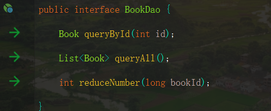
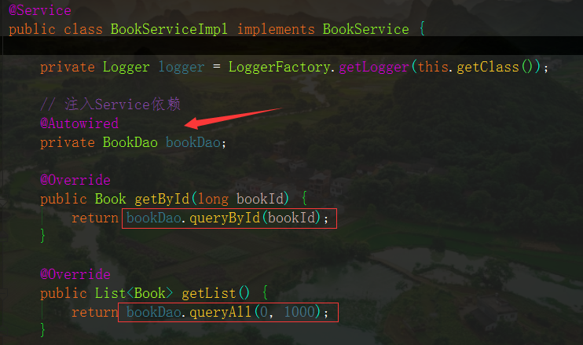
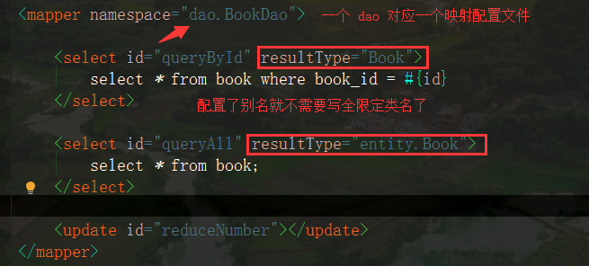
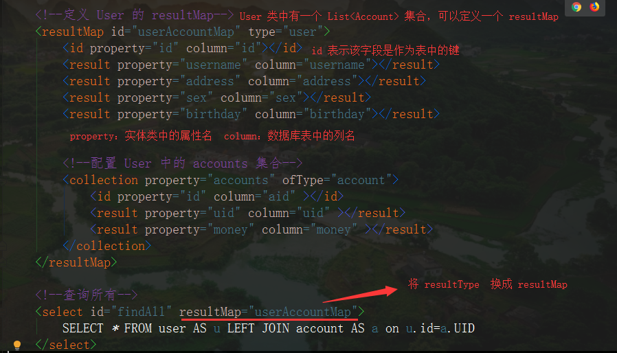
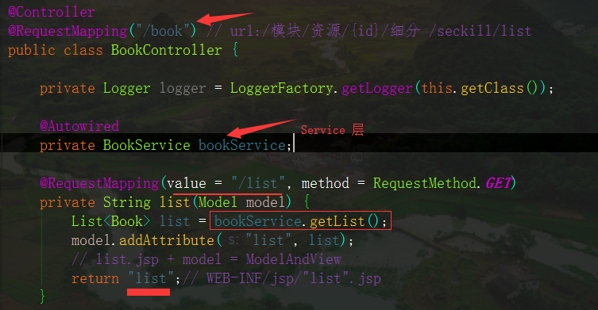

# SSM 整合

* **用 Spring 来整合 Spring 和 MyBatis** 

## 一、设置基本项目结构

* **Entity** 层：实体类
* **dao** 层：和数据库交互（Mybatis）
* **service** 层：业务层（Spring）
* **controller** 层：控制层（SpringMVC）
* resources
    * **mapper**：放置映射文件，用注解的话就不需要了
    * **spring** 
        * 放置整合配置文件
            * spring-service.xml：**Spring 的配置文件** 
            * spring-dao.xml ：**spring 整合 mybatis**，Mybatis  的主配置文件按需求使用
            * spring-web.xml：**spring 整合 springMVC** 

* test 类：按项目需求来测试就行


## 二、准备工作

### 1、编写实体类

* **属性尽量和和数据库中的列名一致**
* 生成 set 、get  方法
* 一个有参构造器，一个无参构造器
* 重写 toString  方法

### 2、编写 Dao 层

* 一张表（数据库）对应一个 dao 接口（熟练的话可以写在一个 dao 接口中）



### 3、编写 Service  层

* service  层有接口和实现类
    * 一般使用接口调用实现类中的方法
    * 实现类中的方法借助 Dao  接口层中的内容和数据库进行交互





## 三、Spring 整合 MyBatis

* MyBatis 主配置文件约束

```xml
<?xml version="1.0" encoding="UTF-8" ?>
<!DOCTYPE configuration
  PUBLIC "-//mybatis.org//DTD Config 3.0//EN"
  "http://mybatis.org/dtd/mybatis-3-config.dtd">
```

### 1、编写配置文件

* 整合的配置文件名为：spring-dao.xml（根据个人习惯）

1. **配置外部数据文件（可选）** 

```xml
<context:property-placeholder location="classpath:jdbc.properties"/>
```

2. **配置数据库连接池** 

    * 连接池有多种配法
    * 如果没有配外部数据文件，这里的数据要写全称

    ```xml
    例如
    <property name="driverClass" value="com.mysql.cj.jdbc.Driver"/>
    ```

```xml
<bean id="dataSource" class="com.mchange.v2.c3p0.ComboPooledDataSource">
        <!-- 配置连接池属性 -->
        <property name="driverClass" value="${jdbc.driver}"/>
        <property name="jdbcUrl" value="${jdbc.url}"/>
        <property name="user" value="${jdbc.username}"/>
        <property name="password" value="${jdbc.password}"/>
</bean>
```

3. 配置 **SqlSessionFactoryBean** 

    * 要注入 **dataSource** 

    * 有了 SqlSessionFactoryBean，就可以得到 SqlSession，有了 SqlSession 就可以得到 dao 的代理对象

        这时候只需要再配置一下**扫描 Dao 接口包**，就可以将 dao 接口交给 Spring 来管理，使用的时候就不需要写  SqlSessionFactory、SqlSession 等重复代码了

```xml
<bean id="factoryBean" class="org.mybatis.spring.SqlSessionFactoryBean">
    <!-- 注入 dataSource -->
    <property name="dataSource" ref="dataSource"/>

    <!-- 扫描entity(实体类)包 使用别名，在映射文件中的返回值就不需要写全限定类名了-->
    <property name="typeAliasesPackage" value="entity"/>

    <!-- 扫描 sql 配置文件：mapper 需要的xml文件 -->
    <property name="mapperLocations" value="classpath:mapper/*.xml"/>
</bean>
```

4.  配置扫描 Dao 接口包，动态实现Dao接口，注入到 spring 容器中
    * 需要注入 **sqlSessionFactory**

```xml
<bean class="org.mybatis.spring.mapper.MapperScannerConfigurer">
    <!-- 注入sqlSessionFactory -->
    <property name="sqlSessionFactoryBeanName" value="factoryBean"/>
    <!-- 给出需要扫描Dao接口包 -->
    <property name="basePackage" value="dao"/>
</bean>
```

### 2、编写映射文件

* 约束

```xml
<?xml version="1.0" encoding="UTF-8" ?>
<!DOCTYPE mapper
  PUBLIC "-//mybatis.org//DTD Mapper 3.0//EN"
  "http://mybatis.org/dtd/mybatis-3-mapper.dtd">
```

* 映射文件在 resources 中的 mapper 文件夹中（根据个人的习惯）



* 如果实体类中的属性和数据库中表的列名不一致，可以配置一个 resultMap



## 四、编写 Spring 配置文件

* 文件名为 spring-service.xml 

1.  扫描 **service** 包下所有使用注解的类型

```xml
<context:component-scan base-package="com.soecode.lyf.service" />
```

2.  配置事务管理器

```xml
<bean id="transactionManager"
      class="org.springframework.jdbc.datasource.DataSourceTransactionManager">
    <!-- 注入数据库连接池(在 mybatis 中配置的) -->
    <property name="dataSource" ref="dataSource" />
</bean>
```

3.  配置基于注解的声明式事务，**可以直接在方法上@Transaction** 

```xml
<tx:annotation-driven transaction-manager="transactionManager" />
```

## 五、整合 SpringMVC

### 1、编写配置文件

1.  扫描web相关的bean

```xml
<context:component-scan base-package="com.soecode.lyf.controller"/>
```

2.  **开启 SpringMVC 注解支持** 

```xml
<mvc:annotation-driven/>
```

3.  设置静态资源不拦截

```xml
方法一：它会像一个检查员，对进入DispatcherServlet的URL进行筛查，如果发现是静态资源的请求，就将该请求转由Web应用服务器默认的Servlet处理，如果不是静态资源的请求，才由DispatcherServlet继续处理
	<mvc:default-servlet-handler/>
方法二：
	<mvc:resources mapping="/js/**" location="/js/"/>
```

4.   配置 jsp 视图解析器 ViewResolver

```xml
<bean class="org.springframework.web.servlet.view.InternalResourceViewResolver">
    <property name="prefix" value="/WEB-INF/jsp/"/>
    <property name="suffix" value=".jsp"/>
</bean>
```

### 2、编写 Controller 层

* controller  层是和浏览器进行交互的，浏览器发送的请求经过**前端控制器**被拦截到 controller 层

    controller 层再调用 service 层中的内容和数据库进行交互，然后返回一个 String  类型的字符串，经过视图解析器解析后返回给浏览器



## 六、编写 web.xml

### 1、指定 spring 配置文件的路径

```xml
<context-param>
    <param-name>contextConfigLocation</param-name>
    <param-value>classpath:applicationContext.xml</param-value>
</context-param>
```

### 2、配置前端控制器

```xml
<!-- 配置 DispatcherServlet 前端控制器 -->
<servlet>
    <servlet-name>mvc-dispatcher</servlet-name>
    <servlet-class>org.springframework.web.servlet.DispatcherServlet</servlet-class>
    <init-param>
        <param-name>contextConfigLocation</param-name>
        <param-value>classpath:spring/spring-web.xml</param-value>
    </init-param>
</servlet>
<servlet-mapping>
    <servlet-name>mvc-dispatcher</servlet-name>
    <!-- 默认匹配所有的请求 -->
    <url-pattern>/</url-pattern>
</servlet-mapping>
```

### 3、配置解决中文乱码的过滤器

```xml
<filter>
  <filter-name>encodingFilter</filter-name>
  <filter-class>org.springframework.web.filter.CharacterEncodingFilter</filter-class>
  <!--设置字符集-->
  <init-param>
      <param-name>encoding</param-name>
      <param-value>utf-8</param-value>
  </init-param>
</filter>
<filter-mapping>
  <filter-name>encodingFilter</filter-name>
  <url-pattern>/*</url-pattern>
</filter-mapping>
```

### 4、配置 Spring 的监听器

* 作用
    * 启动Web容器时，自动装配 ApplicationContext 的配置信息
    * 如果默认的文件名不是 ApplicationContext.xml，则需要使用 <context-param> 配置文件位置

```xml
<listener>
	<listener-class>
        org.springframework.web.context.ContextLoaderListener
    </listener-class>
</listener>
```

## 七、编写 jsp

* 会写前端的话就写一下吧


## 八、配置文件加载顺序

* web 应用启动后首先加载  **web.xml** 配置文件
* 然后加载 **web.xml**  文件中**指定的 Spring 的配置文件** 
* 在配置前端控制器的时候会加载  **SpringMVC** 的配置文件


## 九、注意事项

### 1、配置文件路径问题

* 在需要配置文件的地方加上 **==classpath:==** 


