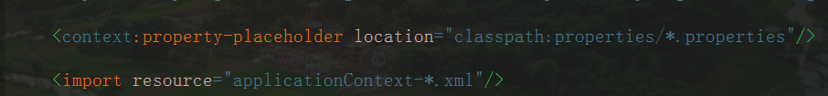
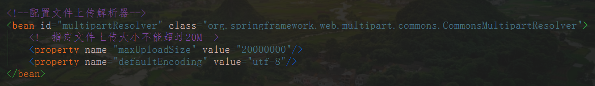
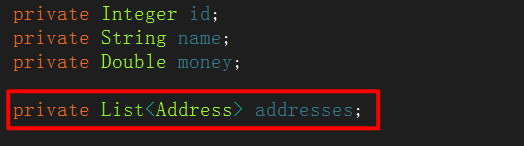
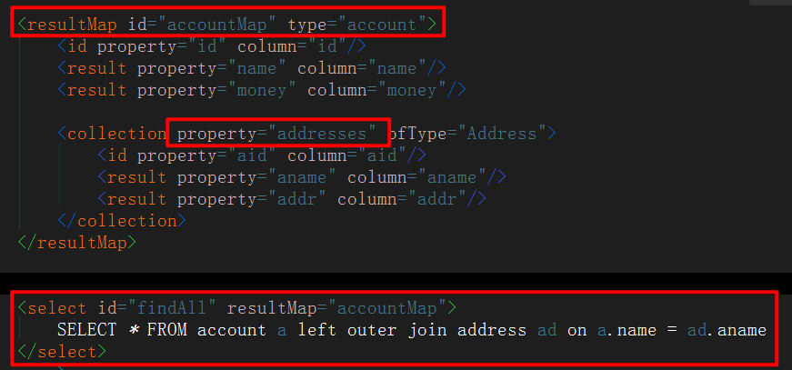
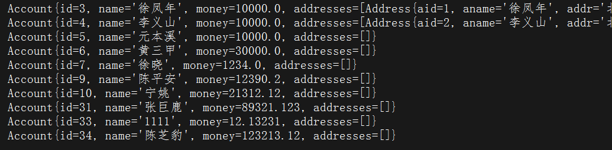
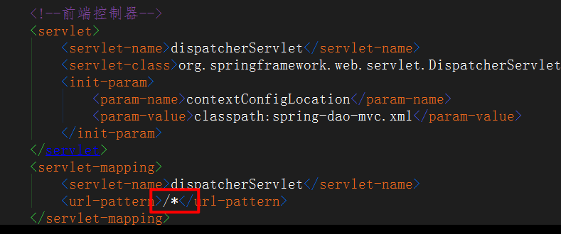

# SSM 细节点

## 1、加载配置文件

若没有一个名为 **contextConfigLocation** 的 <context-param>，**Spring** 会在 **WEB-INF** 目录下加载默认的名为 **applicationContext.xml** 的配置文件

```xml
<context-param>
    <param-name>contextConfigLocation</param-name>
    <param-value>classpath:spring/applicationContext.xml</param-value>
</context-param>
```


## 2、properties 配置文件

**Spring** 只会加载一次 **properties** 配置文件，若想一次性加载全部可以用以下方法

* 在某一个配置文件中加载所有 **properties** 配置文件
    * 这种方法不规范，既加载了需要的配置文件，也加载了不需要的
* 新建一个 **applicationContext.xml** 配置文件，引入所有 **properties** 配置文件和导入所有 **xml** 配置文件
    * 在 **web.xml** 中就只需要加载 **applicationContext.xml** 就可以了




## 3、文件上传解析器

* 带文件上传需要配置文件上传解析器，在 spring-web.xml 中配置



文件上传利用 **MultipartFile** 对象

* 上传图片
    1. 利用 **MultipartFile** 得到一个文件名，加上当前时间得到最终的文件名
        * 加上当前时间是因为确保文件名唯一
    2. 利用文件名和路径得到一个 **File** 对象
        * 路径可以在 **properties** 中配置，然后使用 **@Value** 注解注入到类属性中
    3. 调用 **transferTo(file)** 方法，将数据存到 file 对象中


## 4、MyBatis

* 在 **MyBatis** 全局配置文件中配置

```xml
<!-- 全局配置 -->
<settings>
    <!--允许 JDBC 支持自动生成主键-->
    <setting name="useGeneratedKeys" value="false"/>
    <!--是否开启自动驼峰命名规则（camel case）映射，即从经典数据库列名 A_COLUMN 到经典
            Java 属性名 aColumn 的类似映射。 -->
    <setting name="mapUnderscoreToCamelCase" value="true"/>
</settings>
```


* 分页插件

```xml
<dependency>
    <groupId>com.github.pagehelper</groupId>
    <artifactId>pagehelper</artifactId>
    <version>4.2.1</version>
</dependency>
```

* 配置：在 **MyBatis** 全局配置文件中配置

```xml
<plugins>
    <plugin interceptor="com.github.pagehelper.PageHelper">
        <!--<property name="dialect" value="mysql"/>-->
        <property name="offsetAsPageNum" value="false"/>
        <property name="rowBoundsWithCount" value="false"/>
        <property name="pageSizeZero" value="true"/>
        <property name="reasonable" value="true"/>
        <property name="supportMethodsArguments" value="false"/>
        <property name="returnPageInfo" value="none"/>
    </plugin>
</plugins>
```


### 一对多查询

* 设置表结构



* 配置 Mapper 文件



* 效果展示




## 5、ModelAndView 作用

### 5.1 返回到指定的页面

```java
return new ModelAndView("redirect:/m07.jsp");

// 通过setViewName()方法跳转到指定的页面
ModelAndView mav=new ModelAndView();
mav.setViewName("hello");
```


### 5.2 添加需要返回的数据

```java
modelAndView.addObject(String key, Object value);
```

* 最后返回即可：**return modelAndView** 


## 6、SpringMVC 细节



> 不能加 ***** 号，否则会匹配成  **==/*.jsp==** 这样的 URL 路径


