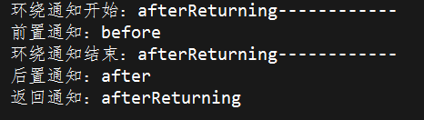
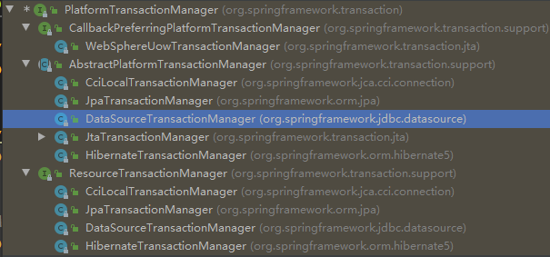

# 一、AOP

使用 `AOP` 首先要导入 `AspectJ` 依赖，如果用注解方式开发，还需开启 `AOP` 注解支持

```xml
<aop:aspectj-autoproxy/> // AOP 注解支持
```


## 切点表达式

基本格式

> 访问标识符  返回类型  全限定类名.方法名(参数)

例子：

```java
@After("execution(* * com.tfc.bean.*.saveMoney(..))")
public void afterSave(JoinPoint joinPoint) {}
```


详解

1、访问标识符可以省略不写

2、返回类型可以用 `*` 代替，表示任何返回类型

3、包名可以用 `*` 代替，有几级包就写几个 `*` 

4、类名也可以用 `*` 代替，表示该包下的所有类

5、方法名一般不省略，参数用 `..` 代替，表示任意数量的参数


## 几种通知

1、前置通知：`@Before` 

* 在切入点方法执行之前执行

2、后置通知：`@After` 

* 在切入点方法执行之后执行

3、返回通知：`@AfterReturning` 

* 切入点方法返回值之后执行

4、异常通知：`@AfterThrowing` 

* 有异常时执行

5、环绕通知：`@Around` 

* 手动调用方法执行

```java
@Around("execution(* com.tfc.bean.*.saveMoney(..))")
public void aroundSave(ProceedingJoinPoint proceed) throws Throwable {
    System.out.println("环绕通知开始：afterReturning------------");
    proceed.proceed();   // 手动调用方法执行
    System.out.println("环绕通知结束：afterReturning------------");
}
```


### 执行顺序




注解方式

## 注解方式

定义一个切面，添加到容器中

```java
@Component
@Aspect
public class AspectJAop {
    @After("execution(* com.tfc.bean.*.saveMoney(..))")
    public void afterSave(JoinPoint joinPoint) {
        System.out.println("存钱成功");
        System.out.println(joinPoint.getTarget());
    }
}
```


## XML 方式

```xml
<!--切面类，类中的方法为增强方法-->
<bean id="aspect" class="com.tfc.bean.AspectJAop"/>
<aop:config>
    <aop:pointcut id="pt" expression="execution(* com.tfc.bean.*.saveMoney(..))"/>
    <aop:aspect ref="aspect">
        <aop:before method="beforeSave" pointcut-ref="pt"/>
    </aop:aspect>
</aop:config>
```


# 二、JdbcTemplate

引入依赖：

> jdbc、mysql、Spring JdbcTemplate、Druid


准备工作：注入数据源、创建三层模板代码（entity、dao、service）

```xml
<context:property-placeholder location="db.properties"/>  <!--引入外部配置文件-->

<!--数据库连接池-->
<bean id="dataSource" class="com.alibaba.druid.pool.DruidDataSource">
    <property name="driverClassName" value="${driver}"/>
    <property name="url" value="${url}"/>
    <property name="username" value="${user}"/>
    <property name="password" value="${password}"/>
</bean>

<!--JdbcTemplate-->
<bean id="jdbcTemplate" class="org.springframework.jdbc.core.JdbcTemplate">
    <property name="dataSource" ref="dataSource"/>
</bean>
```


添加、删除、修改操作，以添加为例

```java
public void addUser(User user) {
    String sql = "insert into user values(?,?,?)";
    Object[] args = {user.getName(), user.getAddr(), user.getDescribe()};
    jdbcTemplate.update(sql, args);
}
```

* 批量操作

```java
public void batchUpdate(List<Object[]> batchArgs) {
    String sql = "insert into user values(?,?,?)";
    jdbcTemplate.batchUpdate(sql, batchArgs);
}
```


查询功能

1、返回一个值

```java
public int findCount() {
    String sql = "select count(*) from user";
    // 第二个参数是返回值的 Class 对象
    Integer res = jdbcTemplate.queryForObject(sql, Integer.class);
    return res;
}
```

2、返回一个对象

```java
public void findOne(String name) {
    String sql = "select * from user where name = ?";
    // 第二个参数是一个 RowMapper 实现类，可以自己实现，也可以用 Spring 提供的
    User user = jdbcTemplate.queryForObject(sql, new BeanPropertyRowMapper<User>(User.class), name);
    System.out.println(user);
}
```

3、返回一个集合

```java
public void findList(Object[] args) {
    String sql = "select * from user where name = ? or name = ?";
    List<User> users = jdbcTemplate.query(sql, new BeanPropertyRowMapper<>(User.class), args);
}
```


# 三、事务管理

参考文章：https://www.jianshu.com/p/befc2d73e487

## 事务基本要素：ACID

1、原子性（`Atomicity`）

> 事务开始后所有操作，要么全部做完，要么全部不做，不可能停滞在中间环节。事务执行过程中出错，会回滚到事务开始前的状态，所有的操作就像没有发生一样。**事务是一个不可分割的整体，就像化学中学过的原子，是物质构成的基本单位** 

2、一致性（`Consistency`）

> 事务开始前和结束后，数据库的完整性约束没有被破坏。比如 A 向 B 转账，不可能 A 扣了钱，B 却没收到

3、隔离性（`Isolation`）

> 同一时间，只允许一个事务请求同一数据，不同的事务之间彼此没有任何干扰。比如 A 正在从一张银行卡中取钱，在 A 取钱的过程结束前，B 不能向这张卡转账

4、持久性（`Durability`）

> 事务完成后，事务对数据库的所有更新将被保存到数据库，不能回滚


## 事务属性

​		事务属性可以理解成事务的一些基本配置，**描述了事务策略如何应用到方法上**。事务属性包含了5个方面：**传播行为、隔离规则、回滚规则、事务超时、是否只读** 


### 传播行为

​		**当事务方法被另一个事务方法调用时，必须指定事务应该如何传播**。例如：方法可能继续在现有事务中运行，也可能开启一个新事务，并在自己的事务中运行。Spring定义了七种传播行为

|   传播行为    | 含义                                                         |
| :-----------: | :----------------------------------------------------------- |
|   REQUIRED    | 如果当前没有事务，就新建一个事务，如果已经存在一个事务，则加入到这个事务中。这是最常见的选择 |
| REQUIRED_NEW  | 表示当前方法必须启动新事务，并且在它自己的事务内运行。如果有事务正在运行，在该方法执行期间，当前事务会被挂起 |
|   SUPPORTS    | 如果有事务在运行，当前方法就在这个事务内运行，否则，该方法不能运行在事务中 |
| NOT_SUPPORTED | 表示该方法不应该运行在事务中。如果当前存在事务，就把当前事务挂起 |
|   MANDATORY   | 表示该方法必须在事务中运行，如果当前事务不存在，则会抛出一个异常 |
|     NEVER     | 表示当前方法不应该运行在事务上下文中。如果当前正有一个事务在运行，则会抛出异常 |
|    NESTED     | 如果当前存在事务，则在嵌套事务内执行。否则，就启动一个新的事务，并在他自己的事务内运行 |


### 隔离级别

> 隔离级别定义了一个事务可能受其他**并发**事务影响的程度

​		在实际开发过程中，我们绝大部分的事务都是有并发情况下多个事务并发运行，**经常会操作相同的数据来完成各自的任务**。在这种情况下可能会导致以下的问题：

1、脏读（`Dirty reads`）

* 事务 A 读取了事务 B 更新的数据，然后 B 执行了回滚操作，那么 A 读取到的数据是脏数据

2、不可重复读（`Nonrepeatable read`）

* 事务 A 多次读取同一数据，事务 B 在事务 A 多次读取的过程中，对数据作了更新并提交，导致事务 A 多次读取同一数据时，结果不一致
* 着重在修改

3、幻读（`Phantom read`）

* 系统管理员 A 将数据库中所有学生的成绩从具体分数改为 ABCDE 等级，但是系统管理员 B 就在这个时候插入了一条具体分数的记录，当系统管理员 A 改结束后发现还有一条记录没有改过来，就好像发生了幻觉一样，这就叫幻读
* 着重在新增、删除

> 解决不可重复读的问题只需锁住满足条件的行，解决幻读需要锁表


​		知道了在并发状态下可能产生:　脏读、不可重复读、幻读的情况。因此我们需要将事务与事务之间隔离。根据隔离的方式来避免事务并发状态下脏读、不可重复读、幻读的产生。Spring 中定义了五种隔离规则：

| 隔离级别         | 含义                                                         | 脏读 | 不可重复读 | 幻读 |
| ---------------- | ------------------------------------------------------------ | ---- | ---------- | ---- |
| DEFAULT          | 使用后端数据库默认的隔离级别                                 |      |            |      |
| READ_UNCOMMITTED | 允许读取尚未提交的数据变更（最低的隔离级别）                 | 有   | 有         | 有   |
| READ_COMMITTED   | 允许读取并发事务已经提交的数据                               | 无   | 有         | 有   |
| REPEATABLE_READ  | 对同一字段的多次读取结果都是一致的，除非数据是被本身事务自己所修改 | 无   | 无         | 有   |
| SERIALIZABLE     | 最高的隔离级别，完全服从 ACID 的隔离级别，也是最慢的事务隔离级别，因为它通常是通过完全锁定事务相关的数据库表来实现的 | 无   | 无         | 无   |


### 回滚规则

​		事务回滚规则定义了哪些异常会导致事务回滚而哪些不会。默认情况下，只有未检查异常（`RuntimeException`和`Error`类型的异常）会导致事务回滚。而在遇到检查型异常时不会回滚。 但是你可以声明事务在遇到特定的检查型异常时像遇到运行期异常那样回滚。同样，你还可以声明事务遇到特定的异常不回滚，即使这些异常是运行期异常


### 事务超时

​		为了使应用程序很好地运行，事务不能运行太长的时间。因为事务可能涉及对后端数据库的锁定，也会占用数据库资源。事务超时就是事务的一个定时器，**在特定时间内事务如果没有执行完毕，那么就会自动回滚，而不是一直等待其结束** 


### 是否只读

​		如果在一个事务中所有关于数据库的操作都是只读的，也就是说，这些操作只读取数据库中的数据，而并不更新数据,　这个时候我们应该给该事务设置只读属性，这样可以帮助数据库引擎优化事务。提升效率


## 声明式使用方法

**Spring 提供了一个接口，供不同的框架去实现对应的事务管理** 




步骤：

1、创建一个事务管理器

```xml
<bean id="transactionManager" class="org.springframework.jdbc.datasource.DataSourceTransactionManager">
    <!--注入数据源-->
    <property name="dataSource" ref="dataSource"/>
</bean>
```

2、开启事务注解支持

```xml
<!--开启事务注解支持-->
<tx:annotation-driven transaction-manager="transactionManager"/>
```

3、在 `Service` 类（或方法）上添加事务注解（`@Transactional`）

* 加在类上面，表示为类中**所有方法**都添加事务管理
* 加在方法上，表示只为**该方法**添加事务管理

```java
@Service
@Transactional  //事务注解（也可以添加在方法上）
public class AccountService {}
```


### @Transactional 参数详解：

#### 1、传播行为（propagation）

|   传播行为    | 含义                                                         |
| :-----------: | :----------------------------------------------------------- |
|   REQUIRED    | 如果当前没有事务，就新建一个事务，如果已经存在一个事务，则加入到这个事务中。这是最常见的选择 |
| REQUIRED_NEW  | 表示当前方法必须启动新事务，并且在它自己的事务内运行。如果有事务正在运行，在该方法执行期间，当前事务会被挂起 |
|   SUPPORTS    | 如果有事务在运行，当前方法就在这个事务内运行，否则，该方法不能运行在事务中 |
| NOT_SUPPORTED | 表示该方法不应该运行在事务中。如果当前存在事务，就把当前事务挂起 |
|   MANDATORY   | 表示该方法必须在事务中运行，如果当前事务不存在，则会抛出一个异常 |
|     NEVER     | 表示当前方法不应该运行在事务上下文中。如果当前正有一个事务在运行，则会抛出异常 |
|    NESTED     | 如果当前存在事务，则在嵌套事务内执行。否则，就启动一个新的事务，并在他自己的事务内运行 |

解释：

`REQUIRED`：

```java
@Transactional
public void add(){
    delete()
}

public void update(){}
```

1、如果 `add()` 本身有事务，调用 `update()` 后，`update` 与 `add()` 使用同一事务

2、如果 `add()` 本身没有事务，调用 `update()` 后，创建一个新是事务，两者运行在创建的新事务中


`REQUIRED_NEW`：

在 `add()` 方法中调用 `update()` 方法时，不管 `add()` 有没有事务，都创建一个新的事务，两者运行在新创建的事务中


其他的几种情况类似，这两种用的较多


#### 2、隔离级别（isolation）

| 隔离级别         | 含义                                                         | 脏读 | 不可重复读 | 幻读 |
| ---------------- | ------------------------------------------------------------ | ---- | ---------- | ---- |
| DEFAULT          | 使用后端数据库默认的隔离级别                                 |      |            |      |
| READ_UNCOMMITTED | 允许读取尚未提交的数据变更（最低的隔离级别）                 | 有   | 有         | 有   |
| READ_COMMITTED   | 允许读取并发事务已经提交的数据                               | 无   | 有         | 有   |
| REPEATABLE_READ  | 对同一字段的多次读取结果都是一致的，除非数据是被本身事务自己所修改 | 无   | 无         | 有   |
| SERIALIZABLE     | 最高的隔离级别，完全服从 ACID 的隔离级别，也是最慢的事务隔离级别，因为它通常是通过完全锁定事务相关的数据库表来实现的 | 无   | 无         | 无   |


#### 3、超时时间（timeout）

事务需要在一定时间内（单位为秒）提交，否则就进行回滚，默认是 `-1`，永不超时


#### 4、是否只读（readOnly）

设置为 `true` 时，只能做查询操作，提高性能


#### 5、回滚规则

`rollbackFor`：哪些异常进行回滚

`notRollbackFor`：哪些异常不进行回滚


### XML 方式

```xml
<!--配置通知-->
<tx:advice id="txAdvice">
    <!--配置参数-->
    <tx:attributes>
        <!--只需给出方法名即可-->
        <tx:method name="transferMoney" propagation="REQUIRED"/>
    </tx:attributes>
</tx:advice>

<!--配置切入点和切面-->
<aop:config>
    <!--配置切入点-->
    <aop:pointcut id="pt" expression="execution(* com.tfc.service.AccountService.*(..))"/>
    <!--配置切面-->
    <aop:advisor advice-ref="txAdvice" pointcut-ref="pt"/>
</aop:config>
```


