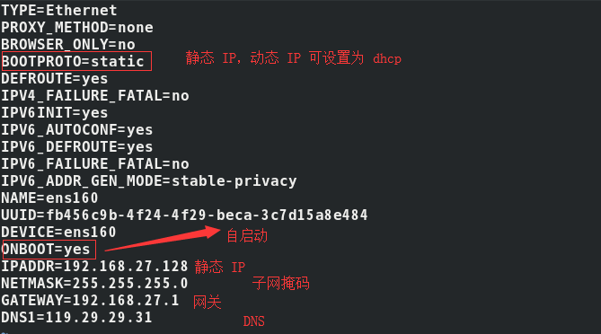
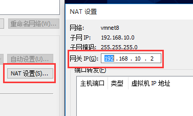

# 一、防火墙

* 基于 **`CentOS-8`** 


* **systemctl  status  firewalld.service** 
    * 查看防火墙状态

* **systemctl stop firewalld.service** 
    * 停止运行防火墙
* **systemctl start firewalld.service** 
    * 启动防火墙

* **systemctl disable firewalld.service** 
    * 禁止防火墙自启动
* **systemctl enable firewalld.service** 
    * 防火墙随系统开启启动

* **firewall-cmd --zone=public --add-port=8080/tcp --permanent** 
    * 开放防火墙端口
    * 重新启动防火墙：**firewall-cmd  -raload** 
    * 查看已经开放的端口：**firewall-cmd  --list-all** 

* **firewall-cmd --zone=public --remove-port=5672/tcp --permanent** 
    * 关闭端口
    * **firewall-cmd --reload**  # 配置立即生效

# 二、网络

1、自动分配 IP 地址

* **dhclient** 

2、重启网卡

* **nmcli  connection  reload  网卡号**（centos 8）
* **nmcli  c  reload**
* **systemctl  restart  network.service**

3、配置 IP

* 位置：**/etc/sysconfig/network-scripts**



```
IPADDR=192.168.27.128
NETMASK=255.255.255.0
GATEWAY=192.168.27.1  // 网关必须和虚拟机的网关一致
DNS1=119.29.29.31
# PREFIX=24
```

* 虚拟机网关




# 三、进程


## 1、查看所有进程

* **ps  -ef** 


## 2、显示进程占用内存情况

```shell
# 查出进程 PID
ps -ef | grep 名称
# 显示进程信息，退出按 q
top -p  PID
```


# 四、端口

1、开放端口

* **firewall-cmd  --add-port=端口号/tcp  --permanent** 
* **firewall-cmd  --reload** 

2、查看已经开放的端口号

* **firewall-cmd  --list-all** 


# 五、关闭警告声

在 Linux 控制台下关掉所有的提示音

```shell
setterm -blength 0
setterm -bfreq 10
```

修改配置文件只能关闭一部分警告声

```shell
# 配置文件位置
/etc/inputrc
# 修改内容
将 set bell-style none 前面的注释去掉
```


