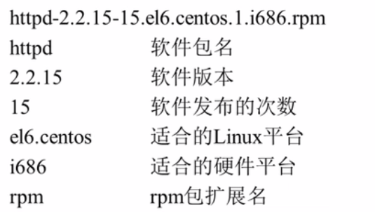

# 软件包管理

## 一、分类

### 1、源码包

* 没有经过编译，可以看到源代码（开源）
* 用源码包进行安装速度很慢，且容易出错

### 2、二进制包

* RPM包、系统默认包
    * 已经编译过，安装速度较快，且出错率很低

## 二、RPM 包管理

### 1、rpm 命令管理

* RPM 包的命令规则

* RPM 包的依赖性

    * 树形依赖：a  依赖 b、b 依赖 c
        * 要先装 c 再装 b 再装 a
        * 删的时候要先删 a 再删 b 再删 c
    * 环形依赖：a 依赖 b 、b 依赖 c 、c 依赖 a
        * 解决办法，一条命令通知装 a、b、c

* **相关命令**

    * rpm -iUvh **包全名**

        * -i（install）：安装
        * -U（upgrade）：更新
        * -v（verbose）:显示安装信息
        * -h（hash）：显示安装进度
        * --nodeps：不检测依赖性

    * rpm -e  **包名** 

        * -e（erase）：卸载

    * rpm -qai  包名-----查询是否安装

        * -q（query）：查询
        * -qa（all）：查询所有已经安装的包，加上 -a 后就不需要包名了
        * -qi：查询软件包的信息
        * -qip：查看**未安装**的软件包信息（要**使用包全名**）

    * rpm -ql  包名

        * -l（list）：列表
        * -p（package）：查询未安装包的信息

    * 查询系统文件属于哪个包：rpm  -qf  系统文件名

        * -f（file）：查询系统文件属于哪个包

    * 查询软件包的依赖性：rpm  -qRp  包（全）名

        * -qR：查询已经安装的软件包的依赖性
        * -qp：查询未安装的软件包的依赖性

    * **==从软件包中提取出所需文件修复系统中的文件==**：

        rpm2cpio  **包全名（包含路径）** | cpio  -ivd  ==.==文件绝对路径

        * rpm2cpio：将 rpm 包转换为 cpio 格式
            * cpio：用于创建软件档案文件和**从档案文件中提取文件**
        * cpio  -ivd  **==.==**文件绝对路径（软件包中的绝对路径）
            * -i：还原
            * -d：还原时自动创建目录
            * -v：显示还原过程

### 2、yum 在线管理

* yum 文件位置
    * **==/etc/yum.repos.d/==** 

* 包全名
    * 操作的包是**没有安装的软件包**时，使用包全名。而且要注意路径包名
* 包名
    * 操作**已经安装的软件包**时，使用包名。是搜索 **/var/lib/rpm/** 中的数据库

#### 常用 yum 命令

* 查询
    * yum list：查询服务器上所有可用的软件包列表
    * yum  search 关键字
        * 搜素服务器所有和关键字相关的包
    * 安装 
        * yum   install  包名
    * 更新
        * yum  update  包名
    * 卸载
        * yum  remove  包名

#### yum 管理软件包组

* 常用命令
    * 列出所有可用的软件包组列表
        * yum  grouplist
    * 安装软件包组
        * yum  groupinstall   软件组名
        * 注意：**==使用该命令时千万小心==**，万一少写了包名，会将 Linux  内核也直接更新，会出现大问题
    * 卸载软件包组
        * yum  groupremove  软件组名
        * 注意：**==不要随便用这个命令==**，一旦删除某个软件包，会将相关依赖的软件包全部删除，可能导致系统崩溃

### 光盘 yum 源搭建

* 名称： **==CentOS-Media.repo==** 

#### 步骤

1. 挂载光盘

* mount  /dev/cdrom   /mnt/cdrom

2. 让所有的网络 yum 源失效
    * 方法是将网络 yum 源的后缀名改一下，加一个 .bak，需要的时候再改回来
        * 即将这三个 yum 源的后缀改掉
            * **CentOS-Base.repo**
            * **CentOS-Debuginfo.repo**
            * **CentOS-Vault.repo**

3. 修改光盘 yum 源
    * 将 **baseurl=file:///mnt/cdrom**（光盘挂载地址），将多余的注释掉
    * **gpgcheck=1**
    * **enabled=1**

