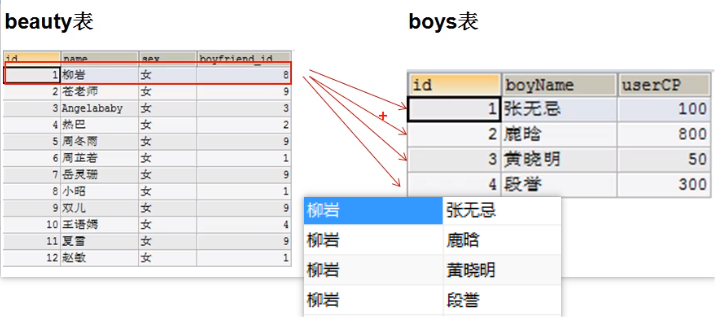

# 一、启动、登录、退出

1、启动、停止服务

```sql
net start 服务名(默认是 mysql)  #启动
net stop  服务名(默认是 mysql)  #停止
```


2、登录

```
mysql -u 用户名(例如 root) -h 主机名(localhost) -P 端口号(3306) -p
```

**如果是本机，可以省略主机名，若端口号就是 3306 的话端口也可以省略** 


3、退出

```
exit
```


# 二、常见命令

1、显示数据库信息

```sql
show databases
```

2、使用数据库

```
use  数据库名
```

3、显示数据库表信息

```
show  tables
show  tables  from  数据库名
```

4、查看当前所在数据库

```
select  database()
```

5、显示表结构

```
desc  表名
```

6、查询数据库版本

```
在数据库中   select  version()
命令行中     mysql  --version
```


# 三、查询语句

## 去重：DISTINCT

关键字：`distinct` 

```mysql
select DISTINCT department_id from employees
```


## + 作用

`MySQL` 中 `+` 的作用是做运算，不能作为连接符，两个操作数都为数值型

* 若出现字符操作数，则尝试将字符操作数转化为数值型，若转换失败，则为 0
* 若有一方为 `null` 结果则为 `null` 


## 连接操作：CONCAT

```mysql
select concat(last_name,first_name) from student
```


## NULL 的处理

```mysql
select ifnull(name,'无名氏') from student
```


## NOT 的使用

```mysql
select * from student where NOT(score>=80 and score<=90)
```


## 模糊查询

### like

`%`：任意多个字符

`_`：任意单个字符

`\`：转义字符

```mysql
select * from student where name like '%t%'
```


### Between  And

1、包含端点值

2、顺序任意

```mysql
select * from student where score between 80 and 100

select * from student where score between 100 and 80
```


### IN

```mysql
select * from student where id in(1,2,3,4)
```


### is null、is not null

`=、!=` 不能用于 `null` 值

```mysql
select * from student where name is null
select * from student where name is not null
```


## 排序

基本格式：`select * from student 查询条件 order by 排序列表` 

一般放在查询语句的最后面，`limit` 子句除外

`ASC`：升序  `DESC` 降序

```mysql
select * from student where name like '%aa%' order by score
```

排序条件有多个，若按第一个排序时有多个值相同，则按第二个条件排序，依次类推


## 分组查询：group by

将表中的数据分成若干组，经常搭配分组函数使用

```mysql
# 基本语法
select 分组函数(..)  列（该字段要求出现在 group by 子句中） from 表
where 条件
group by 列名
order by 列名
```

举例

```mysql
SELECT MAX(salary), job_id from employees GROUP BY job_id
```


**分组后查询**：查询部门人数大于10的部门及人数

* `having` 专门用于**分组后的查询**，在 `order by` 之后

```mysql
SELECT COUNT(*), department_id from employees GROUP BY department_id HAVING COUNT(*)>10
```


**按多个字段分组**：查询每个部门每个工种的平均工资

```mysql
SELECT AVG(salary), department_id, job_id FROM employees
GROUP BY department_id, job_id
```


## 细节

用反单引号来避免关键字和字段名重复

```mysql
select `name` from student
```


# 四、系统函数

## 字符函数

### 长度：length()

* 返回的是字节数（按具体字符集来计算）

```mysql
select * from student order by length(name)
```


### 大小写：upper、lower

```mysql
select concat(upper(last_name),lower(first_name)) from student
```


### 字符串截取：substr

索引从 `1` 开始

1、截取从 `index` 开始的所有字符

```mysql
select substr(name, 3) from student
```

2、截取从 `start` 到 `end` 的字符

```mysql
select substr(name, 3, 7) from student
```


### 子串索引：instr

返回子串在原字符串中第一次出现的索引

```mysql
select substr(name, 'tfc') from student
```


### 去除空格：trim

1、默认去除**前后空格** 

```mysql
select trim(name) from student
```

2、去除指定字符

```mysql
select trim('a', name) from student
```


### 填充：lpad、rpad

用指定字符填充到指定长度

* 这里指的是字符长度，而不是字节长度
* 若指定长度小于原长度，则截取

``` mysql
select lpad(name,10,'*') from student  # 左填充
select rpad(name,10,'*') from student  # 右填充
```


### 替换：replace

将字符串中某些字符替换成指定字符

```mysql
select replace(name, 'a', 'b') from student  # 将 a 替换成 b
```


## 数学函数

### 精度计算：round

```mysql
select round(score) from student  # 四舍五入

select round(score, 2) from student # 小数点后保留两位
```


### 向上、向下取整：ceil  floor

```mysql
select ceil(score) from student   # 向上取整：返回大于等于该值的最小整数

select floor(score) from student  # 向下取整：返回小于等于该值的最小整数
```


### 截断：truncate

不是精度计算，而是直接截断

```mysql
select truncate(score, 2) from student    # 保留两位小数，不进行四舍五入
```


### 取余：mod

公式：`a % b = a - a/b * b` 

* 这里的 `/` 是整数的除法

```mysql
select mod(score, 4) from student
```


## 日期函数

### 当前系统时间

```mysql
select now();      # 返回当前系统时间：日期+具体时间

select curdate()   # 返回当前系统日期

select curtime()   # 返回当前系统具体时间
```


### 具体的年、月、日等

```mysql
select year(now())
```


### 日期格式转换

格式如下：

| 格式 | 含义                     |
| :--: | ------------------------ |
| `%Y` | 四位数的年份             |
| `%y` | 两位数的年份             |
|      |                          |
| `%m` | 两位数月份，不足补 0     |
| `%c` | 两位数月份，不足不用补 0 |
|      |                          |
| `%d` | 天数（01，02，03...）    |
|      |                          |
| `%H` | 小时，24 小时制          |
| `%h` | 小时，12 小时制          |
|      |                          |
| `%i` | 分钟（01，02，03...）    |
| `%s` | 秒（01，02，03...）      |

`str_to_date`：将字符格式的日期转换成指定格式的时间

```mysql
select str_to_date('1992-2-4', '%Y-%c-%d')
```


`date_format`：将日期转换为指定格式的字符

```mysql
select date_format(now(), '%Y年-%c月-%d日')
```


## 流程控制函数

### if

相当于三元运算符

```mysql
select if(score>=10, score, 0) from student
```


### case

1、情形一：相当于 `switch  case` 语句

```mysql
# 基本结构
case 要判断的常量或表达式
when  常量1或表达式 1 then 结果1或语句1（若是语句，则加一个 ';'，若是常量，则不加）
....
else  要显示的值或语句
end
```

举例

```mysql
# 
SELECT
	salary '原工资',
	department_id,
CASE department_id 
		WHEN 30 THEN
		  salary * 1.2 
		WHEN 50 THEN
		  salary * 2 ELSE salary 
	END 
FROM employees;
```


2、情形二：相当于 `if else` 语句

```mysql
# 基本格式
case(此处没有值或语句)
when 条件1 then 要显示的值或语句 
...
else 要显示的值或语句
end
```

举例

```mysql
SELECT salary,
CASE 
	WHEN salary>20000 THEN
		'A'
	WHEN salary>10000 THEN
	  'B'
	ELSE
		'C'
END
from employees ORDER BY salary DESC
```


## 分组（聚合）函数

分组函数都忽略 `null` 值

**和分组函数一同查询的字段要求是 `group by` 后的字段** 

### 求和函数：sum

```mysql
select sum(score) from student
```


### 平均值：avg

```mysql
select avg(score) from student
```


### 最值：min、max

```mysql
select min(score) from student
```


### 计算总数：count

计算不为 `null` 的个数

```mysql
select count(*) from student
```


# 五、连接查询

> 需要查询的字段分布在多个表中的时候需要用到连接查询


## 笛卡尔积

> 多表连接

```mysql
SELECT `name`,boyName FROM beauty, boys # name 字段在 beauty 表中， boyName 字段在 boys 表中
```

就这样直接查询两张表，没有条件的话是这样查询的：

* 将第一张表中的每行数据与第二张表中的数据一一连接，结果如下
* 这样的连接叫做笛卡尔集




## 内连接

### 等值连接

根据查询条件，将第一张表中的每行数据与第二张表中的数据一一对比，如果符合条件，则加入结果

```mysql
SELECT `name`,boyName FROM beauty, boys WHERE beauty.boyfriend_id = boys.id
```

案例：查询员工对应的部门

```mysql
SELECT
	last_name,
	department_name 
FROM
	employees,
	departments 
WHERE
	employees.department_id = departments.department_id

# sql99 语法
SELECT
	last_name,
	department_name 
FROM
	employees e
	INNER JOIN departments d ON e.department_id = d.department_id  # inner 可以省略
```

注意：

1、如果为表起了别名，就不能用原来的表名去限定字段，只能用别名来限定

2、表的顺序没有影响


### 非等值连接

案例：查询员工的工资级别

```mysql
SELECT
	salary,
	grade_level 
FROM
	employees e,
	job_grades jo 
WHERE
	salary BETWEEN jo.lowest_sal 
	AND jo.highest_sal
```


### 自连接

案例：员工表中包含领导的信息，需要查询员工的上级

```mysql
SELECT
	e1.last_name,
	e2.last_name 
FROM
	employees e1,
	employees e2 
WHERE
	e1.manager_id = e2.employee_id  # 给一张表起两个别名，当成两张表使用
```


## 外连接

应用场景：某个数据一张表中有，另一张表中没有，没有对应的数据就用 `null` 代替显示

### 左外连接

```mysql
SELECT
	`name`,
	boyName 
FROM
	beauty g
	LEFT JOIN boys b ON g.boyfriend_id = b.id
```

若左边的表在指定条件下在右边的表中没有对应的数据，则结果为 `null` 


案例：查询哪些部门没有员工

```mysql
SELECT
	department_name 
FROM
	departments de
	LEFT JOIN employees e ON de.department_id = e.department_id 
WHERE
	last_name IS NULL
```


### 右外连接

```mysql
SELECT
	`name`,
	boyName 
FROM
	boys b
	RIGHT JOIN beauty g ON g.boyfriend_id = b.id
```

若右边的表在指定条件下在左边的表中没有对应的数据，则结果为 `null` 


# 六、子查询

> 定义

出现在其他语句中的 `select` 语句称为子查询（内查询）

> 相关概念

1、标量子查询

* 结果集只有一行一列（**只有一个单元格**）

2、列子查询

* 结果集包含一列多行（**只有一列**）

3、行子查询

* 结果集包含一行多列（**只有一行**）

4、表子查询

* 结果集包含多行多列


## select 后面

> 要求：仅仅支持**标量子查询** 

案例：查询每个部门的员工个数

```mysql
SELECT
	d.*,
	( SELECT COUNT(*) FROM employees e WHERE e.department_id = d.department_id ) 部门人数 
FROM
	departments d
```


## from 后面

> 要求：支持表子查询

案例：查询每个部门的平均工资水平

```mysql
SELECT
	avg_dep.*,
	jg.grade_level 
FROM
	( SELECT AVG( salary ) ag, department_id FROM employees GROUP BY department_id ) avg_dep
	INNER JOIN job_grades jg ON avg_dep.ag BETWEEN jg.lowest_sal AND jg.highest_sal
```


## where、having 后面

> 要求：标量子查询、列子查询、行子查询（用的较少）

特点：

1、子查询一般放在 `()` 内

2、子查询一般放在条件的右侧

3、标量子查询一般搭配单行操作符使用：`>   <   >=   <=` 

4、列子查询一般搭配多行操作符使用：`in、some/any、all` 


### 标量子查询

案例：查询工资比 `Abel` 高的员工信息（`where` 后面使用）

```mysql
SELECT
	* 
FROM
	employees 
WHERE
	salary > (
	SELECT
		salary 
	FROM
		employees 
	WHERE
		last_name = 'Abel')
```

案例：查询最低工资大于 50 号部门最低工资的部门 id 和其最低工资

```mysql
SELECT
	e.department_id,
	MIN( salary ) 
FROM
	employees e,
	departments d 
WHERE
	e.department_id = d.department_id 
GROUP BY
	e.department_id 
HAVING
	MIN( salary ) > ( SELECT MIN( salary ) FROM employees e WHERE e.department_id = 50 ) 
ORDER BY
	e.department_id
```


### 列子查询

案例：查询 `location_id` 是 `1400、1700` 部门的所有员工的名字

```mysql
SELECT
	last_name 
FROM
	employees 
WHERE
	department_id IN ( SELECT department_id FROM departments WHERE location_id IN ( 1400, 1700 ) )
```


### 行子查询

案例：查询员工编号最小且工资最高的员工信息

```mysql
SELECT * FROM employees 
WHERE (employee_id, salary) = (
	SELECT MIN(employee_id), MAX(salary) FROM employees
)
```


# 七、分页查询

> 关键字：`limit`，放在语句的最后面

```mysql
limit  offset, size # offset：起始索引（从 0 开始）   size：显示的数量
```

案例1：查询前五条员工数据

```mysql
SELECT * FROM employees LIMIT 0, 5
SELECT * FROM employees LIMIT 5      # offset 是 0 的话，可以省略不写
```

案例二：查询第 11~25 条数据

```mysql
SELECT * FROM employees LIMIT 10,15
```


# 八、联合查询

将多个查询语句的结果集合并为一个

```mysql
SELECT * FROM employees WHERE department_id>=100
UNION
SELECT * FROM employees WHERE email LIKE '%a%'
```

应用场景：

* 要查询的结果来自多个表，且多个表中没有直接的连接关系，**但查询信息一致** 

特点：

1、多个查询语句结果的列数相同

2、要求多个查询语句结果中**列顺序一致** 

3、默认去重，如果使用 `union all` 则没有去重


# 九、增、删、改

## 插入

> 关键字：`insert` 

方式一：

```mysql
INSERT INTO beauty(`name`, sex, borndate, phone, photo, boyfriend_id)
VALUES('姜泥','女','1989-02-21','12321322',NULL,4)
```

方式二：

```mysql
INSERT INTO beauty 
SET  `name` = '陈渔', phone = '3213121'
```


## 删除

> 关键字：`delete` 

```mysql
DELETE FROM beauty WHERE id = 14   # 单表删除
```

> 多表删除

```mysql
# 语法
delete 表1别名，表2别名...
from 表1 别名， 表2 别名...
where  筛选条件
```

案例：删除张无忌女朋友信息

```mysql
DELETE 
	b 
FROM
	beauty b INNER JOIN boys bo ON b.boyfriend_id = bo.id 
WHERE
	bo.boyName = '张无忌'
```


## 更新

> 关键字：`update` 

```mysql
UPDATE beauty SET `name` = '红薯' WHERE id = 14
```

> 修改多表记录

```mysql
# 语法
update  表1，表2...
set 列=值...
where ...
```

```mysql
UPDATE 
	boys bo INNER JOIN beauty b ON bo.id = b.boyfriend_id 
SET 
	b.phone = '114' 
WHERE
	bo.boyName = '张无忌'
```

案例：修改没有男朋友的女生的男朋友编号为 2

```mysql
UPDATE 
	beauty bLEFT JOIN boys bo ON b.boyfriend_id = bo.id 
SET 
	b.boyfriend_id = 2 
WHERE
	bo.id IS NULL
```


# 十、数据库、表的管理

## 库的管理

1、创建数据库

```mysql
#语法
create database 库名

create database user
```

2、更改数据库的字符集

```mysql
# 语法
alter database 库名 character set gbk
```

3、删除数据库

```mysql
#语法
drop database if exists 库名
```


## 表的管理

1、创建表

```mysql
# 语法
create table 表名（
	列名  类型  约束
	 .....
）
```

2、修改表

* 修改列名

    ```mysql
    alter table 表名 change column 旧列名  新列名  类型
    ```

* 修改表的类型、约束

    ```mysql
    alter table 表名 modify column 列名  新类型
    ```

* 添加新的列

    ```mysql
    alter table 表名 add column 列名 类型
    ```

* 删除列

    ```mysql
    alter table 表名 drop column  列名
    ```

* 修改表名

    ```mysql
    alter table 表名 rename to 新表名
    ```

3、删除表

```mysql
drop table if exists 表名
```

4、复制表

* 仅仅复制表的结构

    ```mysql
    create table 表名 like 被复制的表名
    ```

* 复制表的结构和数据

    ```mysql
    create table 表名 select * from 被复制的表名 where ....
    ```


## 数据类型

### 整型

```mysql
Tinyint、Smallint、Mediumint、int（Integer）、Bigint（相当于long）  # 范围依次增大
```

> 设置无符号数（默认是有符号数）：使用 `unsigned` 关键字

```mysql
create table s(
    t int(6) unsigned
)
```

注意：

* 若超出类型范围，则抛出一个异常，并设置为临界值（该类型所支持的最大值）

* 类型后边跟着的长度表示显示结果的宽度，如果宽度不够，用 `0` 填充，但默认 `0` 不显示，需要用 `zerofill` 关键字开启

    ```mysql
    create table s(
        t int(6) zerofill unsigned  # 使用 zerofill 关键字之后，默认就是 无符号数了
    )
    ```

    

### 浮点型

```mysql
float（M，D）、double（M，D）、decimal（M，D 定点型，精度较高）

create table s(
    t float(4,2),
    t2 double(5,2),
    t3 decimal(3,5)
)
```

`M、D` 代表的意思

* `M` 代表整数部分长度 + 小数部分长度
* `D` 代表小数部分长度，长度不足就补 `0` 

`M、D` 都可以省略，如果省略，则 `decimal` 的精度默认是 `decimal(10,0)` 


### 字符型

```mysql
char(M)、varchar(M)、text、blob
```

`M` 表示字符数

> `char(M)、varchar(M)` 的区别

`char` 是固定长度，`varchar` 是可变长度，长度多少，就耗费多少空间，不能超过设定长度，但效率低一些


### 日期型

`date`：只能保存日期，不能保存时间（时、分、秒）

`datetime`：能保存日期和时间

`timestamp`：保存所经过的毫秒数（时间戳）

`time`：只能保存时间

`year`：只能保存年份


## 常见约束

```mysql
not null（非空）、default（默认值）、primary key（主键）、unique（唯一，但可为空）、check（检查，mysql不支持）
foreign key（外键）
```

列级约束，写在**每一列后面** 

```mysql
create table student(
    id int primary key,
    stuName varchar(10) not null,
    gender char(1) check(gender='男' or gender='女')
    seat int unique,
    age int default 20,
    mojorId int foreign key references major(id)
)

create table major(
    id int primary key,
    majorName varchar(10)
)
```

表级约束，写在**所有列后面** 

```mysql
create table test(
    id int,
    name varchar(10),
    majorId int,
    
    constraint pk primary key(id),  # 主键
    constraint uq unique(name),     # 唯一
    constraint fk_test_major foreign key(majorId) references major(id)  # 外键
)
```


### 主键和唯一的比较

|      | 唯一性 | 是否允许为空 |  一个表中是否允许存在多个  | 是否允许组合 |
| :--: | :----: | :----------: | :------------------------: | :----------: |
| 主键 |   是   |      否      | 至多设置一个列，但可以组合 |      是      |
| 唯一 |   是   |      是      |       可以设置多个列       |      是      |


### 外键的特点

1、要求在从表设置外键

2、从表的外键类型必须和主表所关联的主键类型一致

3、主表中被关联的必须是一个 `key`（一般是主键或唯一）

4、插入数据是必须先插入主表，再插入从表数据

5、删除数据是先删除从表，再删除主表


# 十一、事务

## 事务基本属性

1、原子性

* 原子性是指事务是一个不可分割的工作单位，**事务中的操作要么都发生，要么都不发生** 

2、一致性

* 事务必须使数据库从一个一致性状态变换到另外一个一致性状态

3、隔离性

* **一个事务的执行不能被其他事务干扰**，即一个事务内部的操作及使用的数据对并发的其他事务是隔离的，并发执行的各个事务之间不能互相干扰

4、持久性

* 一个事务一旦被提交，它**对数据库中数据的改变就是永久性的**，接下来的其他操作和数据库故障不应该对其有任何影响


## 事务创建

### 隐式事务

例如 `insert`、`delete`、`update` 等语句


### 显式事务

具有明显的开启、结束标记，前提是**必须先禁用自动提交功能** 

```mysql
set autocommit = 0
```

1、开启事务

```mysql
start transaction  # 可选（默认开启）
```

2、编写 `sql` 语句

3、结束事务

* 提交

    ```mysql
    commit
    ```

* 回滚事务

    ```mysql
    rollback
    ```


## 并发事务

问题：

> 脏读

对于两个事务 T1、T2，若 T1 读取了被 T2 更新但还没有被提交的字段后，若 T2 回滚，T1 读取的内容就是临时且无效的

> 不可重复读

对于两个事务 T1、T2，若 T1 读取了一个字段，然后 T2 更新了该字段之后，T1 再次读取同一个字段，值就不同

> 幻读

对于两个事务 T1、T2，若 T1 从一个表中读取了一个字段然后 T2 在该表中插入了一些新的行。之后，如果 T1 再次读取同一个表，就会多出几行

**脏读侧重修改操作，幻读侧重于插入操作** 


## 隔离级别

|     隔离级别      |                             描述                             | 脏读 | 幻读 | 不可重复读 |
| :---------------: | :----------------------------------------------------------: | ---- | ---- | ---------- |
| READ  UNCOMMITTED | 允许事务读取未被其他事物提交的变更脏读，不可重复读和幻读的问题都会出现 | 有   | 有   | 有         |
|  READ  COMMITED   | 只允许事务读取已经被其它事务提交的变更，可以避免脏读，但不可重复读和幻读问题仍然可能出现 | 无   | 有   | 有         |
| REPEATABLE  READ  | 确保事务可以多次读取一个字段的值，在这个事务持续期问，禁止其他事物对这个字段进行更新，可以避免脏读和不可重复读，但幻读的问题仍然存在 | 无   | 有   | 无         |
|   SERIALIZABLE    | 确保事务可以从一个表中读取相同的行，在这个事务持续期间，禁止其他事务对该表执行插入更新和删除操作，所有并发问题都可以避免，但性能十分低下 | 无   | 无   | 无         |


# 十二、视图

> 含义

一种虚拟存在的表，行和列的数据来自定义视图的查询中使用的表，并且是在使用视图时动态生成的，**只保存了 `sql` 逻辑，不保存查询结果** 

> 应用场景

* 多个地方用到相同的查询结果
* 该查询语句使用的 `sql` 较复杂


## 创建视图

```mysql
# 创建视图
CREATE VIEW tview  AS
SELECT
	last_name,
	department_name,
	job_id 
FROM
	employees e INNER JOIN departments d ON e.department_id = d.department_id 
	
# 使用（直接将视图名当做表名使用）
SELECT * FROM tview WHERE last_name LIKE '%a%'
```

特点：

1、将一个复杂的 `sql` 分解，简化操作

2、重用 `sql` 语句

3、保护数据，提高安全性


## 修改视图

方式一

```mysql
create or replace view 视图名 as
....
```

方式二

```mysql
alter view 视图名 as
...
```


## 删除视图

``` mysql
drop view 视图名1，视图名2 ....
```


## 更新视图

更新数据，而不更新 `sql` 逻辑

```mysql
# 创建视图
CREATE VIEW tview  AS
SELECT
	last_name,
	department_name,
	job_id 
FROM
	employees e INNER JOIN departments d ON e.department_id = d.department_id 
```

1、插入

```mysql
insert into tview values('aaaa', 12, 'IT')
```

2、修改

```mysql
update tview set last_name = 'bbbb' where job_id = 'IT'
```

3、删除

```mysql
delete from tview where last_name = 'bbbb'
```

一下情况的视图不允许更新数据

1、`sql` 语句中包含以下关键字

* 分组函数、`distinct、group by、having、union` 

2、常量视图

3、`select` 中包含子查询

4、包含 `join` 关键字（连接都不行）

5、`from` 一个不能更新的视图


## 视图和表的对比

1、语法不同

2、视图只保存 `sql` 逻辑，不保存数据，表保存数据，不保存 `sql` 逻辑


# 十三、变量

## 系统变量

> 作用域

每次服务器重启都将为所有的变量赋初始值，针对所有的会话（连接）有效，但重启之后所有操作失效

1、查看所有的系统变量

```mysql
show global|session variable
```

2、查看满足条件的系统变量

```mysql
show global|【session】 variable like '%char%'
```

3、查看某个指定的系统变量的值

```mysql
select @@global|【session】.系统变量名
```

4、为某个系统变量赋值

```mysql
set global|【session】 系统变量名 = 值
set @@global|【session】.系统变量名 = 值
```

注意：如果是全局级别，需要加 `global`，如果是会话级别，需要加 `session`，如果不写， 默认是 `session` 级别


## 自定义变量

> 作用域

当前会话（连接）

使用步骤：

1、声明并初始化

```mysql
set @用户变量名 = 值
set @用户变量名 ：= 值
select @用户变量 ：= 值
```

2、赋值

```mysql
# 方式一
set @用户变量名 = 值
set @用户变量名 ：= 值
select @用户变量 ：= 值

# 方式二
select 字段 into 变量名 from 表
# 案例
set @count = 1
select count(*) into count from employees  # 将员工表中所有员工的数量赋值给变量  count
```


## 局部变量

> 作用域

仅仅在定义的 `begin`、`end` 中

1、声明

```mysql
declare 变量名 类型
declare 变量名 类型 default 值
```

2、赋值

```mysql
# 方式一
set 用户变量名 = 值   # 没有 @ 符号
set 用户变量名 ：= 值
select @用户变量 ：= 值

# 方式二
select 字段 into 变量名 from 表
```


# 十四、存储过程

类似于 `Java` 中的方法

> 含义

一组预先编译好的 `sql` 语句的集合，理解成**批处理语句** 

> 好处

1、提高代码的重用行，简化操作

2、减少编译次数，并且减少了和数据库服务器的连接次数，提高了效率


> 语法

```mysql
create procedure 存储过程名（参数列表）
begin
	存储过程体（一组合法的 sql 语句）
end
```

参数写法：参数模式  参数名  参数类型

```mysql
# 举例
参数模式    参数名   参数类型
  in       name   varchar(10)
```

> 参数模式

`IN`：该参数可以作为输入，也就是该参数需要调用方传入

`OUT`：该参数可以作为输出，也就是该参数可以作为返回值

`INOUT`：该参数既可以作为输入，也可以作为输出

注意：

1、如果存储过程体只有一句话，则 `begin、end` 可以省略不写

2、存储过程体中每一句 `sql` 都必须带分号，用 `delimiter` 关键字表示结束（高版本不需要）

```mysql
create procedure 存储过程名（参数列表）
begin
	存储过程体（一组合法的 sql 语句）
end
```


> 调用

```mysql
call 存储过程名（参数列表）
```


## IN 模式

```mysql
CREATE PROCEDURE p1 (IN beautyName VARCHAR ( 20 )) 
BEGIN
	SELECT
		bo.* 
	FROM
		beauty be
		LEFT JOIN boys bo ON be.boyfriend_id = bo.id 
	WHERE
		be.`name` = beautyName;

END 

CALL p1 ( '柳岩' )
```

案例二

```mysql
CREATE PROCEDURE p2(IN userName VARCHAR(20), IN pwd VARCHAR(20))
BEGIN
	DECLARE result INT DEFAULT 0;  # 声明局部变量
	SELECT
		COUNT(*) INTO result 
	FROM
		admin 
	WHERE
		username = userName AND `password` = pwd;
	SELECT IF( result > 0, '成功', '失败' ) 结果;  # 使用局部变量
END

CALL p2('张飞', '111')  # 调用
```


## OUT 模式

案例：根据女生名，返回男朋友名

```mysql
CREATE PROCEDURE p2(IN beautyName VARCHAR(20), OUT boyName VARCHAR(10))
BEGIN
	SELECT
		bo.boyName INTO boyName 
	FROM
		boys bo
		INNER JOIN beauty be ON bo.id = be.boyfriend_id 
	WHERE
		be.`name` = beautyName;
END

SET @boyName 
CALL p2('柳岩', @boyName)

SELECT @boyName
```


## INOUT 模式

```mysql
CREATE PROCEDURE p3(INOUT a INT, INOUT b INT)
BEGIN
	SET a=a*2;
	SET b=b*2;
END

SET @m = 10;
SET @n = 20;
CALL p3(@m,@n);

SELECT @m,@n;
```


## 删除存储过程

语法：

```mysql
drop procedure if exists 名
```


## 查看存储过程结构

```mysql
show create procedure 名字
```


# 十五、自定义函数

> 语法

```mysql
create function 函数名（参数列表） returns 返回类型
begin
	函数体（一组 sql 语句）
	return 值;
end
```

> 参数写法

```mysql
参数名   参数类型
  a       int
```


案例一：返回员工个数

```mysql
CREATE FUNCTION myf1() RETURNS INT 
BEGIN
	DECLARE a INT DEFAULT 0;
	SELECT COUNT(*) INTO a FROM employees;
	RETURN a;
END 

SELECT myf1()
```

如果报以下错误：

```mysql
This function has none of DETERMINISTIC, NO SQL, or READS SQL DATA in its declaration and binary logging is enabled (you *might* want to use the less safe log_bin_trust_function_creators variable)
```

解决办法一（临时）

```mysql
# 运行该语句
SET GLOBAL log_bin_trust_function_creators = 1;
```

解决办法二（根本）：更改配置文件

* 在 `my.cnf` 配置文件里面设置

    ```mysql
    log_bin_trust_function_creators = 1
    ```

参考文档 https://www.cnblogs.com/miracle-luna/p/10856302.html


案例二：根据员工名，返回工资

```mysql
CREATE FUNCTION myf2(username VARCHAR(20)) RETURNS INT 
BEGIN
	SET @sal = 0;
	SELECT salary INTO @sal FROM employees WHERE last_name = username;
	RETURN @sal;
END 

SELECT myf2('Ernst')
```


## 查看函数结构

```mysql
show create function 函数名
```


## 删除函数

```mysql
drop function 函数名
```


# 十六、分支结构

## if 函数

可以用在任何地方

```mysql
if(表达式1，表达式2，表达式3) # 如果 1 成立，则返回 2 的值，否则，返回 3 的值
```


## case 结构

1、类似于 `switch` 语句，一般用于等值判断

```mysql
case 变量|表达式|字段
when 要判断的值 then 返回值 1或 语句; # 是语句的话需要加 ;
  .....
else 要返回的值n 或语句;
end  case  # 是语句的话要加 case
```


2、类似于 `java` 中的多重 `if` 语句，一般用于区间判断

```mysql
case 变量|表达式|字段
when 要判断的条件 then 返回值 1 或语句; # 是语句的话需要加 ;
  .....
else 要返回的值 n 或语句; # 是语句的话需要加 ;
end case  # 是语句的话要加 case
```

特点：

1、可以作为表达式，嵌套在其他语句中使用，可以放在任何地方，`BEGIN END` 中或 `BEGIN END` 外

2、可以作为独立的语句去使用，只能放在 `BEGIN END` 中

案例：

```mysql
create procedure test_cast(IN score INT)
BEGIN
    case
        when score >= 90 then select 'A';
        when score >=80 then select 'B';
    end case;
end;

call test_cast(89)
```


## if 结构

语法：

```mysql
if 条件1 then 语句1；
    elseif 条件2 then 语句2；
    ......
    else 语句n;
end if；
```

应用场景：只能用在 `begin、end` 中

例子

```mysql
CREATE FUNCTION test_if(score INT) RETURNS CHAR
BEGIN
	IF score>=90 THEN RETURN 'A';
	ELSEIF score>=80 THEN RETURN 'B';
	ELSE RETURN 'C';
	END IF;
END

SELECT test_if(89)
```


# 十七、循环结构

## while

语法

```mysql
【标签：】while 循环条件  do    # 这里的【标签】是循环的名字
	循环体
end while 【标签】;
```

案例：批量插入

```mysql
CREATE PROCEDURE pro_while(IN n INT)
BEGIN
	DECLARE i INT DEFAULT 1;
	WHILE i <= n DO
		INSERT INTO admin(username,`password`) VALUES( CONCAT('ttt',i), '666');	
		SET i = i + 1;
	END WHILE;
END

CALL pro_while(10)
```


> 添加 `leave` 语句

```mysql
CREATE PROCEDURE pro_while(IN n INT)
BEGIN
	DECLARE i INT DEFAULT 1;
	a:WHILE i <= n DO
		INSERT INTO admin(username,`password`) VALUES( CONCAT('ttt',i), '666');	
		SET i = i + 1;
		IF i>4 THEN LEAVE a;    # leave 相当于 break，   iterate相当于 continue
		END IF;
	END WHILE a;
END

CALL pro_while(10)
```


## loop

语法

```mysql
【标签：】loop
	循环体
end loop 【标签】;    # 可以用来模拟简单的死循环
```


## repeat

类似于 `do while` 

```mysql
【标签：】repeat
	循环体
until 结束循环条件
end repeat 【标签】;
```


