# 一、索引

## SQL 的执行顺序

### 1、手写的顺序

```mysql
select distinct
	< select_ list >
from
	< left_table >   < join_type > < right_table > on  < join_condition >
where 
	< where_condition >
group by
	< group by condition >
having
	< having_conditon >
order by
	< order by condition >
limit  < limit_number > 
```

### 2、MySQL 程序读取的顺序

```mysql
from 
	< left_table >   < join_type > < right_table > on  < join_condition >
where
	< where_condition >
group by
	< group by condition >
having
	< having_conditon >
select distinct            # 机器读取顺序不一样
	< select_ list >
order by
	< order by condition >
limit  < limit_number > 
```

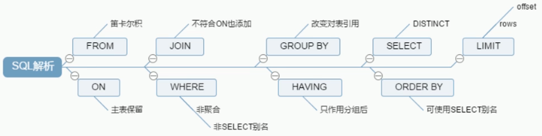


## 什么是索引

索引是帮助 `MySQL` 高效获取数据的数据结构，**索引是一种数据结构，是一种排好序的快速查找数据结构** 

索引的目的在于提高查找效率，可以类比字典，如果要查 `mysql` 这个单词，我们肯定需要定位到 `m` 字母，然后从下往下找到 `y` 字母，再找到剩下的 `sq` 

如果没有索引，那么你可能需要 `a-z`，如果我想找到 `Java` 开头的单词呢？或者 `Oracle` 开头的单词呢？

**索引会影响 `where` 后面的查找和 `order by` 后的排序** 

> 什么是排好序的快速查找数据结构？

在数据之外，数据库系统还维护着满足特定查找算法的数据结构，这些数据结构以某种方式引用（指向）数据，这样就可以在这些数据结构上实现高级查找算法。这种数据结构，就是索引。下图就是一种可能的索引方式示例：

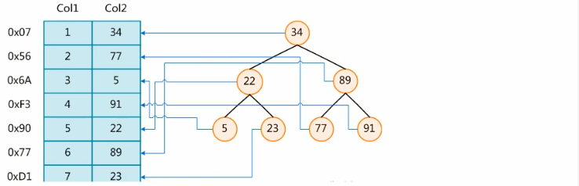

为了加快 `Col2` 的查找，可以维护一个右边所示的二叉查找树，每个节点分别包含索引键值和一个指向对应数据记录物理地址的指针，这样就可以运用二叉查找在一定的复杂度内获取到相应数据，从而快速的检索出符合条件的记录

一般来说索引本身也很大，不可能全部存储在内存中，因此**索引往往以索引文件的形式存储的磁盘上** 

我们平常所说的索引，如果没有特别指明，都是指 `B` 树（多路搜索树，并不一定是二叉树）结构组织的索引

其中聚集索引、次要索引、复合索引，前缀索引，唯一索引默认都是使用 `B+` 树索引，统称索引。当然，除了 `B+` 树这种类型的索引之外，还有哈稀索引（`hash ndex`）等


## 索引的优劣

> 索引的优势

1、类似大学图书馆建书目索引，提高数据检索的效率，降低数据库的 `IO` 成本

2、通过索引列对数据进行排序，降低数据排序的成本，降低了 `CPU` 的消耗

> 劣势

1、实际上索引也是一张表，该表保存了主键与索引字段，并指向实体表的记录，所以索引列也是要占用空间的

2、虽然索引大大提高了查询速度，同时却会**降低更新表的速度**，如对表进行 `INSERT、UPDATE、DELETE`，因为更新表时，`MySQL` 不仅要保存数据，还要保存一下索引文件每次更新添加了索引列的字段，会调整因为更新所带来的键值变化后的索引信息

3、索引只是提高效率的一个因素，如果你的 `MySQL` 有大数据量的表，就需要花时间研究建立最优秀的索引，或优化查询


## 索引分类

1、单值索引：一个索引列只包含单个列，一个表可以有多个单列索引

2、唯一索引：索引列的值必须唯一（key 值），但允许有空值

3、复合索引：一个索引包含多个列


## 基本语法

> 创建语法

```mysql
create [unique] index <indexName> on <tableName>(columnName(length))
alter <tableName> add [unique] index <indexName> on (columnName(length))
```

如果是唯一索引就加上`[unique]`修饰字段

> 删除索引

```c
drop index <indexName> on <tableName>
```

> 查看索引

```c
show index from <tableName>
```


添加索引的四种方式：

1、添加一个主键，这意味着索引值必须是唯一的，且不能为空

```sql
alter table <tableName> add primary key(columnName)
```

2、添加的索引值必须是唯一的，NULL 除外，NULL 可能会出现多次

```sql
alter table <tableName> add unique <indexName>(columnName)
```

3、添加普通索引，索引值可以出现多次

```sql
alter table <tableName> add index <indexName>(colunmName)
```

4、添加一个全文索引

```sql
alter table <tableName> add fulltext <indexName>(columnName)
```


## 性能分析：explain

使用 `explain` 关键字可以模拟优化器执行 `SQL` 查询语句，从而知道 `MySQL` 是如何处理你的 `SQL` 语句，可以用来分析你的查询语句或是表结构是否存在性能瓶颈

> 语法

```sql
explain <SQL语句>
```

可以查看语句的执行计划，例子如下 `explain select * from article`：


各个字段的解释：

### 1、`id` 

含义：select 查询的序列号，包含一组数字，表示查询中执行 select 子句或操作表的顺序

有三种情况：

* **id 相同**：执行顺序从上到下，例如下：

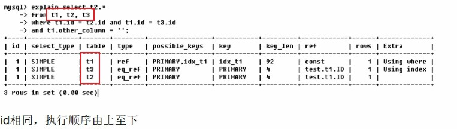

* **id 不同时**：如果是子査询，id 的序号会递增，id 值越大优先级越高，越先被执行

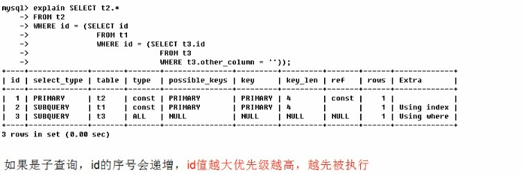

* **id 既有相同的，也有不同的**：

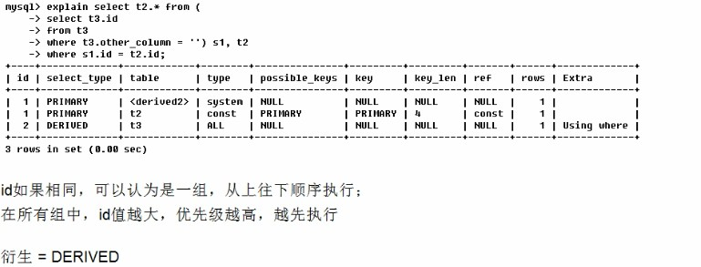


### 2、`select_type` 

可选值：

```c
simple、primary、subQuery、derived、union、union reult
```

主要体现的是查询的类型，用于区别普通查询、联合查询、子查询等复杂查询

1）**simple**：简单的 select 查询，查询中不包含子查询或者 UNION

2）**primary**：查询中若包含任何复杂的子部分，最外层查询则被标记为 primary

3）**subQuery**：在 SELECT 或 WHERE 列表中包含了子查询

4）**derived**：在 FROM 列表中包含的子查询被标记为 DERIVED（衍生）MySQL 会递归执行这些子查询，把结果放在临时表里

5）**union**：若第二个 SELECT 出现在 UNION 之后，则被标记为 UNION，若 UNION 包含在 FROM 子句的子查询中，外层 SELECT 将被标记为 **DERIVED** 

6）**union reult**：从 UNION 表获取结果的 SELECT


### 3、`table` 

显示该查询从哪张表查


### 4、`type` 

显示查询使用了何种类型，从好到坏依次如下：

```c
system > const > eq_ref > ref > range > index > ALL
```

一般来说，如果能达到 range 级别，最好能优化到 ref 级别

1）**system**：表只有一行记录（等于系统表），这是 const 类型的特例，平时不会出现，这个也可以忽略不计

2）**const**：表示通过索引一次就找到了，**const** 用于比较 **primary key** 或者 **unique** 索引。因为只匹配一行数据，所以很快，如将主键置于 **where** 列表中，**MySQL** 就能将该查询转换为一个常量

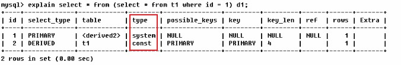

3）**eq_ref**：唯一性索引扫描，对于每个索引键，表中只有一条记录与之匹配。**常见于主键或唯一索引扫描** 

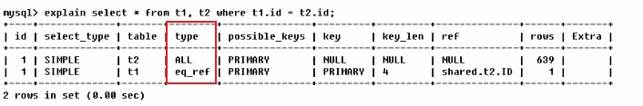

4）**ref**：非唯一性索引扫描，返回匹配某个单独值的所有行。本质上也是一种索引访问，它返回所有匹配某个单独值的行，然而，可能会找到多个符合条件的行，所以他应该属于查找和扫描的混合体

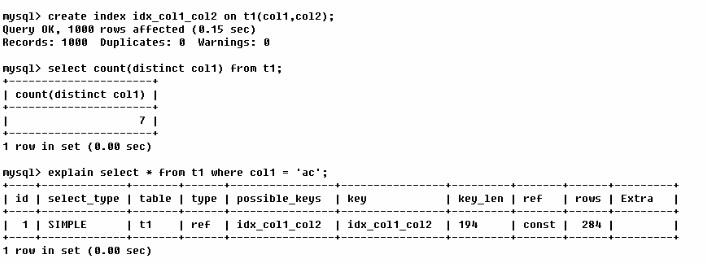

5）**range**：只检索给定范围的行，使用一个索引来选择行。**key 列**显示使用了哪个索引。一般就是在你的 where语句中出现了 **between、<、>、in** 等查询

**这种范围索引扫描比全表扫描要好，因为它只需要开始于索引的某一点，而结東语另一点，不用扫描全部索引** 

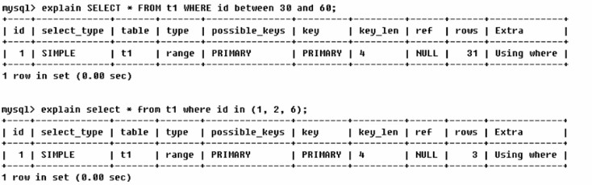

6）**index**：Full Index Scan，**index** 与 **ALL** 区别为 **index** 类型只遍历索引树，这通常比 ALL 快，因为**索引文件通常比数据文件小** 
**all 和 index 都是扫描全表，但 index 是从索引中读取的，而 all 是从硬盘中读取的** 

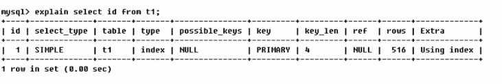

7）**all**：遍历全表以找到匹配的行

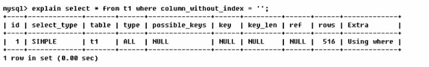

### 5、`possible_keys` 

> 含义

1）显示可能应用在这张表中的索引，一个或多个

2）查询涉及到的字段若存在索引，则该索引将被列出，**但不一定被查询实际使用** 


### 6、`key` 

实际使用的索引。如果为 NULL，则没有使用索引

查询中若使用了**覆盖索引**，则该索引仅出现在 key 列表中

**索引覆盖**：当查询字段和索引字段顺序、名称相符合时，就会发生索引覆盖

理解方式一：就是 **select** 的数据列只用从索引中就能够取得，不必读取数据行，MySQL 可以利用索引返回 select 列表中的字段，而不必根据索引再次读取数据文件，换句话说查询列要被所建的索引覆盖

**注意：如果要使用覆盖索引，一定要注意 select 列表中只取出需要的列，不可 select *，因为如果将所有字段一起做索引会导致索引文件过大，查询性能下降** 

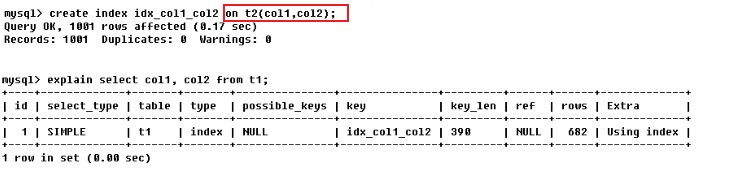


### 7、`key_len` 

表示索引中使用的字节数，可通过该列计算查询中使用的索引的长度。**在不损失精确性的情况下，长度越短越好** 

**key_len** 显示的值为索引字段的最大可能长度，并非实际使用长度，即 key_len 是根据表定义计算而得，不是通过表内检索出的

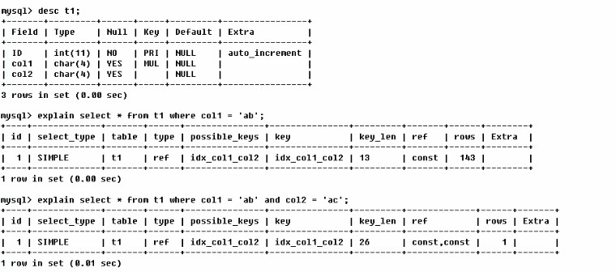


### 8、`ref` 

显示索引的哪一列被使用了，如果可能的话，是一个常数。哪些列或常量被用于查找索引列上的值

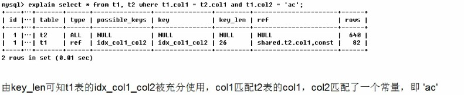

查询中与其它表关联的字段，外键关系建立索引


### 9、`rows` 

根据表统计信息及索引选用情况，大致估算出找到所需记录需要读取的行数

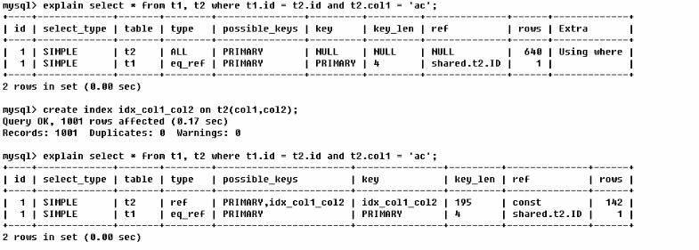


### 10、`extra` 

包含不适合在其他列中显示但十分重要的额外信息

1）**using filesort**：**mysql** 会对数据使用一个外部的索引排序，而不是按照表内的索引顺序进行读取
**MySQL** 中无法利用索引完成的排序操作称为**文件排序** 

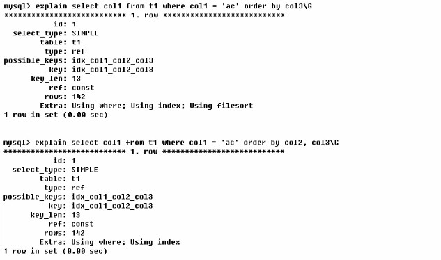

2）**using temporary**：使了用临时表保存中间结果， MySQL 在对查询结果排序时使用临时表。常见于排序 **order by** 和分组查询 **group by** 

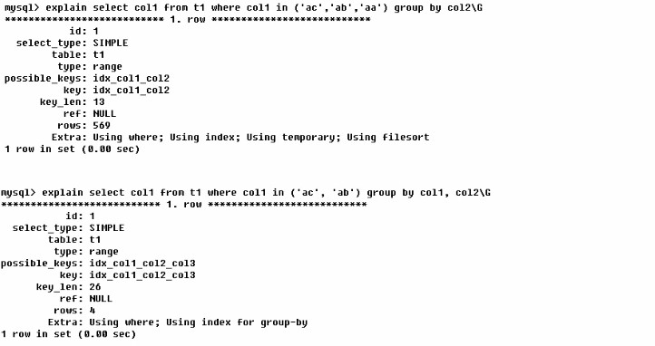

3）**using index**：表示相应的 select 操作中使用了覆盖索引，避免访问表的数据行，效率不错，如果同时出现 using where，表明索引被用来执行索引键值的查找，如果没有同时出现 using where，表明索引用来读取数据而非执行查找

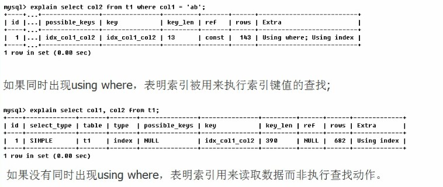

4）**using where**：表示使用了 where 过滤

5）**using join buffer**：表示使用了连接缓存

6）**impossible where**：where 子句的值总是 false，不能用来获取任何元组


# 二、索引优化

## 单表索引

SQL 语句：

```sql
SELECT
	id,
	author_id 
FROM
	article 
WHERE
	category_id = 1 
	AND comments > 1 
ORDER BY
	`views` DESC 
	LIMIT 1
```

where 后面有三个字段参与了判断

新建索引如下：

```sql
CREATE INDEX idx_article_ccv ON article (category_id, comments, `views`)
```

查看执行性能：

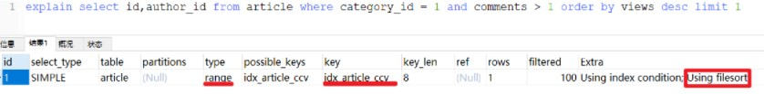

Using filesort 还没有解决，原因如下：

1、先排序 category_id，如果遇到相同的 category_id 则再排序 comments，如果遇到相同的 comments 则再排序 views

2、当 comments 字段在联合索引里处于**中间位置**时，因 comments>1条件是一个范围值（所谓 range），MySQL无法利用索引再对后面的 views 部分进行检索，**即 range 类型查询字段后面的素引无效** 

解决办法如下：删除旧索引，新建一个索引：

```sql
CREATE INDEX idx_article_ccv ON article (category_id, views)
```

查看执行性能：

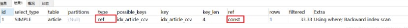

完美收工！


## 双表索引

双表索引建立技巧：

1、左连接对右表字段建索引

2、右连接对左表字段建索引

sql 如下：

```sql
SELECT * from class LEFT JOIN book ON class.card = book.card
```

建立索引：

```sql
CREATE INDEX idx_book_card ON book (card)
```

查看执行性能：

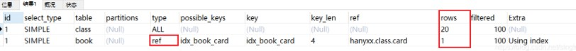


## 三表索引

主要还是利用双表建立索引的技巧

sql：

```sql
SELECT
	* 
FROM
	class
LEFT JOIN 
	book ON class.card = book.card
LEFT JOIN 
	phone ON book.card = phone.card
```

建立索引：

```sql
CREATE INDEX idx_book_card ON book (card)
CREATE INDEX idx_phone_card ON phone(card)
```

查看执行性能：

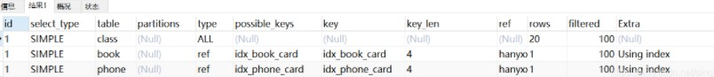


## 索引失效

1、最佳左前缀法则：如果索引了多列，要遵守最左前缀法则。指的是查询从索引的最左前列开始并且**不跳过**索引中的列

2、不在索引列上做任何操作（计算、函数、（自动or手动）类型转换），否则可能会导致索引失效而转向全表扫描

3、范围之后全失效：存储引擎不能使用索引中**范围条件右边的列** 

4、覆盖索引多使用：

使用覆盖索引（Using index）会提高检索效率，也就是只访问索引列的查询（索引列和查询列一致时，尽量不使用select *）

5、使用不等会失效：**在使用不等于(`!=` 或者 `<>`)时，可能会导致索引失效** 

6、使用 `NULL` 值要小心：

如果**允许字段为空**，则

* `IS NULL` 不会导致索引失效
* `IS NOT NULL` 会导致索引失效

7、模糊查询加右边：`like` 查询通配符以 % 开头会导致索引失效，转而变成全表扫描，以 % 结尾不会

解决办法：使用**覆盖索引**（查询的字段尽量和索引字段匹配）

8、字符串加单引号：**字符串不加单引号索引失效** 

```sql
SELECT * FROM staffs WHERE NAME = '2000'
```

如果 NAME 查询条件没有加 ' '，则索引会失效

9、尽量不用 `or` 查询：少用 or，**用它来连接时会索引失效** 


> 小结

1、语句优化应尽可能减少 `join` 语句中 `NestedLoop` 的循环总次数，**即永远用小结果集驱动大结果集** 

2、优先优化 `NestedLoop` 的内层循环

3、尽量保证 `join` 语句中**被驱动表的条件字段添加了索引（即 LEFT JOIN 在右表上添加，反之亦然）** 

4、当无法保证被驱动表的条件字段添加索引时，且内存资源充足的前提下，不妨调整 join buffer 以达到性能优化的目的


## 优化技巧

> 一般性建议

1、对于单键索引，尽量选择针对当前 query 过滤性更好的索引

2、在选择组合索引的时候，当前 Query 中过滤性最好的字段在索引字段顺序中，位置越靠前越好

3、在选择组合索引的时候，尽量选择可以能够包含当前 query 中的 where 字句中更多字段的索引

4、尽可能通过分析统计信息和调整 query 的写法来达到选择合适索引的目的


> 优化口诀

全值匹配我最爱，最左前缀要遵守；
带头大哥不能死，中间兄弟不能断；
索引列上少计算，范围之后全失效；
Like百分写最右，覆盖索引不写星；
不等空值还有or，索引失效要少用；
VAR引号不可丢，SQL高级也不难！


# 三、查询分析

## 小表驱动大表

优化原则：**由小数据集驱动大数据集** 

案例一：

```sql
select * from A where id in(select id from B)
```

上面这句 SQL 等价于

```sql
for select id from B
	for select * from A where A.id = B.id
```

**当 B 表中的数据集小于 A 表时**，用 in 由于 exists


案例二：

```sql
select * from A where exists（select 1 from B where B.id = A.id)
```

上面这句 SQL 等价于

```sql
for select * from A
	for select * from B where B.id = A.id
```

**当 A 表中的数据集小于 B 表时**，用 exists 优于 in

该语法可以理解为：将主查询的数据，放到子查询中做条件验证，根据验证结果（TRUE 或 FALSE）来决定主查询的数据结果是否得以保留


## order by 优化

**ORDER BY子句，尽量使用 index 方式排序，避免使用 fileSort 方式排序** 

终点解决问题：是否会产生 fileSort 排序

新建索引如下：

```sql
create index idx_A_age_Birth on tblA(age, birth);
```

案例一：

```sql
EXPLAIN SELECT * FROM tblA WHERE age > 20 ORDER BY age
```

**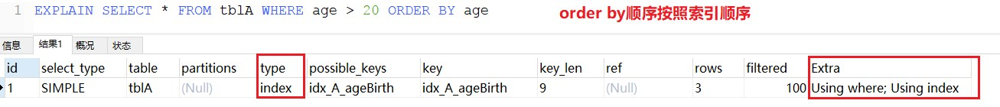**

```sql
EXPLAIN SELECT * FROM tblA WHERE age > 20 ORDER BY age,birth
```

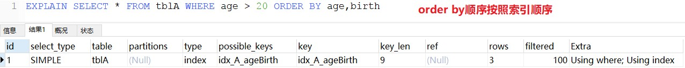

```sql
EXPLAIN SELECT * FROM tblA WHERE age > 20 ORDER BY birth
```

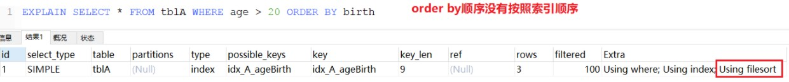

```sql
EXPLAIN SELECT * FROM tblA WHERE age > 20 ORDER BY birth,age
```

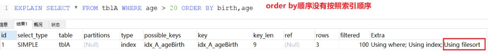

```sql
EXPLAIN SELECT * FROM tblA WHERE birth > '2021-02-19 22:45:00' ORDER BY birth
```

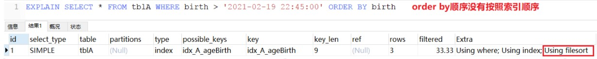

```sql
EXPLAIN SELECT * FROM tblA WHERE birth > '2021-02-19 22:45:00' ORDER BY age
```

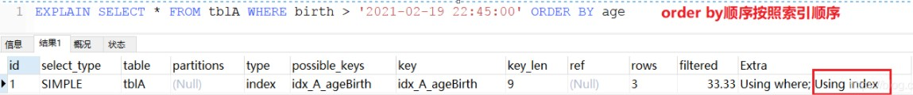


案例二：

```sql
EXPLAIN SELECT * FROM tblA ORDER BY age ASC,birth DESC 
```

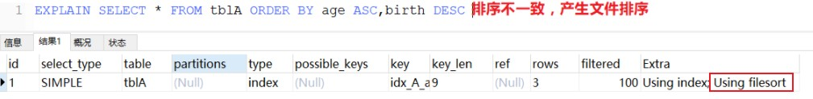


> 小结

1、MySQL支持两种方式的排序，index 和 filesort

* index效率高，它是指扫描索引本身完成排序，filesort效率低

2、ORDER BY 子句，尽量按照 index 索引字段的顺序排序，避免 filesort 方式排序

3、ORDER BY 子句满足两种情况，会使用 index排序

* 一是 ORDER BY 子句采用遵照最佳左前缀法则
* 二是 where 条件字段和 ORDER BY 子句组合起来，满足最佳左前缀法则


### 排序优化

**当发生 Using filesort 时，MySQL会根据自己的算法对查询结果进行排序** 

> 1、双路排序

MySQL 4.1 之前是使用双路排序,字面意思就是两次扫描磁盘，最终得到数据，读取行指针和 order by 列，对他们进行排序，然后扫描已经排序好的列表，按照列表中的值重新从列表中读取对应的数据输出

**从磁盘取排序字段，在 buffer 进行排序，再从磁盘取其他字段** 


> 2、单路排序

I\O 是很耗时的，所以在 mysql4.1 之后，出现了第二种改进的算法，单路排序算法

1）从磁盘读取查询需要的所有列，按照order by列在 buffer 对它们进行排序，然后扫描排序后的列表进行输出

2）它的效率更快一些，避免了第二次读取数据，并且把随机 IO 变成了顺序 IO，但是它会使用更多的空间， 因为它把每一行都保存在内存中了


问题：

在 sort_buffer 中，方法 B 比方法 A 要多占用很多空间，因为方法 B 是把所有字段都取出, 所以有可能取出的数据的总大小超出了 sort_buffer 的容量，导致每次只能取 sort_buffer 容量大小的数据，进行排序（创建 tmp 文件，多 路合并），排完再取取 sort_buffer 容量大小，再排……从而多次 I/O。也就是本来想省一次 I/O 操作，反而导致了大量的 I/O 操作，反而得不偿失

解决办法：

1、增大 sort_buffer 的大小

* 不管用哪种算法，提高这个参数都会提高效率，当然，要根据系统的能力去提高，因为这个参数是针对每个进程的 1M-8M 之间调整

2、增大 `max_length_for_sort_data` 参数的设置 

* mysql 使用单路排序的前提是排序的字段大小要小于 **max_length_for_sort_data**，提高这个参数，会增加使用改进算法的概率
* 但是如果设的太高，数据总容量超出 sort_buffer_size 的概率反而会增大， 就会出现**高频磁盘 I/O** 和**低的处理器使用率**。（1024-8192 之间调整）

3、减少 select 后面的查询的字段（少用select *）


## group by 优化

和 order by 优化大致类似，注意一下几点：

1、group by 实质是先排序后进行分组，遵照索引建立的最佳左前缀原则

2、当无法使用索引列，增大`max_length_for_sort_data`参数的设置 + 增大`sort_buffer_size`参数的设置

3、where 高于 having，能写在 where 限定的条件就不要去 having 限定了


# 四、慢查询日志

MySQL 的慢查询日志是 MySQL 提供的一种日志记录，它用来记录在 MySQL 中响应时间超过阀值的语句，具体指运行时间超过 `long_query_time` 值的 SQL 会被记录到慢查询日志中

`long_query_time` 的默认值为 10，意思是运行 10 秒以上的语句

**默认情况下，MySQL 数据库没有开启慢查询日志，需要我们手动来设置这个参数** 

**当然，如果不是调优需要的话，一般不建议启动该参数**，因为开启慢查询日志会或多或少带来一定的性能影响。慢查询日志支持将日志记录写入文件

> 相关命令

查看是否开启

```sql
show variables like '%show_query_log%'
```

开启慢查询日志功能，只对当前数据库生效，如果重启则会失效

```sql
set global show_query_log = 1
```

永久开启慢查询日志：修改配置文件，[mysqld] 下添加如下配置

```sql
show_query_log = 1
show_query_log_file = /xxx
```

查看默认超时时间：如果想永久修改，需要修改配置文件

```sql
show variables like '%show_query_time%'
```

重新设置阈值：修改之后需要重新建立一个连接才能看到修改后的值

```sql
set global show_query_time = 3
```

查看执行慢的 SQL 条数

```sql
show global status like '%Slow_queries%'
```


## 日志分析工具：mysqldumpshow

命令参数：

```sql
mysqldumpshow --help
```

1、-s：按照何种方式排序

2、-c:访问次数

3、-l：锁定时间

4、-r：返回记录

5、-t：查询时间

6、-al：平均锁定时间

7、-ar：平均返回记录数

8、-at：平均查询时间

9、-g：后边搭配一个正则表达式，大小写不敏感

例：

1、获取返回集最多的10条SQL

```sql
mysqldumpslow -s r -t 10 G:\Programs\mysql-8.0.18\data\layman-slow.log
```

2、获取访问次数最多的10条SQL

```sql
mysqldumpslow -s c -t 10 G:\Programs\mysql-8.0.18\data\layman-slow.log
```

3、获取按时间排序的前10条含有LEFT JOIN的SQL语句

```sql
mysqldumpslow -s t -t 10 -g "LEFT JOIN" G:\Programs\mysql-8.0.18\data\layman-slow.log
```

4、结合|more使用，否则有可能会爆屏

```sql
mysqldumpslow -s r -t 10 G:\Programs\mysql-8.0.18\data\layman-slow.log |more
```


# 五、Show Profile

**Show Profile 是 mysql 提供的可以用来分析当前会话中 SQL 语句执行的资源消耗情况** 

默认情况下，参数处于关闭状态，并保存最近 15 次的运行结果

分析步骤：

1、查看当前是否开启 show profile

```sql
show variables like '%profiling%'
```

开启 show profile

```sql
set profiling = on
```

2、运行SQL，例如

```sql
select * from dept;
```

3、查看结果

```sql
show profiles;
```

4、分析

```sql
show profile cpu,block io for QueryId(show profiles 命令中的 ID)
```

参数解析：

1、all：显示所有开销信息

2、block io：显示 IO 相关信息

3、context switchs：显示上下文切换开销

4、cpu：cpu 的开销

5、ipc：显示发送和接收开销信息

6、memory：显示内存相关开销

7、page faults：显示错误页面相关开销

8、source：显示和 Source_function, Source_file, Source_line 相关的开销信息

9、swaps：显示交换次数相关开销的信息

重要结果解析：

1、`converting HEAP to MyISAM`：查询结果太大，内存都不够用了往磁盘上搬了

2、`Creating tmp table`：创建临时表

3、`Copying to tmp table on disk`：把内存中临时表复制到磁盘，危险！！！

4、`locked`：锁住了


# 六、MySQL 锁机制

> 相关命令

1、查看数据库 `hanyxx` 中的表是否加锁

```sql
SHOW OPEN TABLES in hanyxx
```

2、加锁：**book表加读锁，phone表加写锁** 

```sql
LOCK TABLE book read , phone write
```

3、释放锁

```sql
UNLOCK TABLES
```


## 表锁（偏读）

> 特点

1、偏向 MyISAM 存储引擎，开销小，加锁快，无死锁，锁定粒度大，发生锁冲突的概率最高，并发度最低

2、不支持事务


### 读锁

案例描述：有两个表 a，b，**sessionA 给表 a 上了一个读锁**，会发生以下情况：

1、sessionA 可以读、但不能写自己锁定的表，也不能读、写其他未锁定的表

2、sessionB 可以读取 sessionA 加锁（读锁）的表，可以读写其他为加锁的表，但更新加锁的表的时候会阻塞


### 写锁

案例描述：有两个表 a，b，**sessionA 给表 a 上了一个写锁**，会发生以下情况：

1、sessionA 可以读写自己上锁的表，但不能读写其他表

2、sessionB 读写 sessionA 上锁的表时会阻塞，但可以读取其他表


## 行锁（偏写）

偏向 InoDB 存储引擎，开销大，加锁慢，会出现死锁，锁定粒度最小，发生锁冲突的概率最低，并发度也最高

**InnoDB 与 MyISAM 的最大不同有两点：一是支持事务（ TRANSACTION），二是采用了行级锁** 


> 事务的 ACID 属性

1、原子性（Atomicity）：事务是一个原子操作单元，其对数据的修改，要么全都执行，要么全都不执行

2、一致性（Consistent）：在事务开始和完成时，数据都必须保持一致状态。这意味着所有相关的数据规则都必须应用于事务的修改以保持数据的完整性；事务结束时，所有的内部数据结构（如 B 树索引或双向链表）也都必须是正确的

3、隔离性（Isolation）：数据库系统提供一定的隔离机制，保证事务在不受外部并发操作影响的“独立”环境执行。这意味着事务处理过程中的中间状态对外部是不可见的，反之亦然

4、持久性（Durable）：事务完成之后，它对于数据的修改是永久性的，即使出现系统故障也能够保持


> 并发事务带来的问题

1、更新丢失：当两个或多个事务选择同一行，然后基于最初选定的值更新该行时，由于每个事务都不知道其他事务的存在，就会发生丢失更新问题一一最后的更新覆盖了由其他事务所做的更新

2、脏读：事务 A 读取到了事务 B **已修改但尚未提交的的数据**，还在这个数据基础上做了操作。此时，如果B事务回滚，A 读取的数据无效，不符合一致性要求

3、不可重复读：事务 A 读取到了事务 B 已经提交的修改数据，不符合隔离性

4、幻读：事务 A 读取到了事务 B 体提交的新增数据，不符合隔离性

注意：

* 脏读是事务 B 里面修改了数据
* 幻读是事务 B 里面新增了数据


查看数据库隔离级别

```sql
show variables like 'tx_isolation'; -- MySQL 5.7之前的版本
show variables like 'transaction_isolation'; -- MySQL 5.7之后的版本
```

MySQL InnoDB 默认隔离级别：`REPEATABLE-READ`，可以解决脏读和不可重复度，不能解决幻读

如果两个客户端对同一条记录进行修改：

- 客户端 A 修改、未提交（未commit），此时客户端 B 修改，则会阻塞
- 客户端 A 修改后、提交后，客户端 B 再修改，则不会阻塞
- 如果两个客户端分别对不同的记录行进行修改，则不会被阻塞


### 索引失效

> 索引失效带来的问题

**索引失效，行锁变表锁**（通过varchar类型不加单引号让索引失效）

原因如下：

**InnoDB 行锁是通过给索引上的索引项加锁来实现的**，InnoDB 行锁只有通过索引条件检索数据，才使用行锁，否则，InnoDB 使用表锁 在不通过索引(主键)条件查询的时候，InnoDB 是表锁而不是行锁


### 间隙锁

当我们用**范围条件**而不是相等条件检索数据，并请求共享或排他锁时，InnoDB 会给符合条件的已有数据记录的索引项加锁

对于键值在条件范围内但并不存在表中的记录，做"间隙"，InnoDB 也会对这个"间隙"加锁，这种锁机制就是所谓的间隙锁（Next-Key 锁）

案例描述：有一组数据的键值 id 为 [2, 4, 5, 6]，如果查询操作是 where id >=2 and id <= 6，这时向表中插入一个键值 id 为 3 的数据就会发生阻塞，因为查询条件是 2~6，但 id=3 的记录不存在，存在间隙锁

> 间隙锁的危害

1、Query 执行过程中通过过范围查找的话，会锁定整个范围内所有的索引键值，即使这个键值并不存在

2、间隙锁有一个比较致命的弱点，就是当锁定一个范围键值之后，使某些不存在的键值也会被无辜的锁定，而造成在锁定的时候无法插入锁定键值范围内的任何数据。在某些场景下这可能会对性能造成很大的危害


### 锁定一行

1、比如 sessionA 锁定 id=4 的记录（重要的是最后的 `for update`）

```sql
select * from user where id = 4 for update
```

2、在 sessionA 没有提交之前，其他 session 修改 id=4 的记录一律阻塞


### 行锁分析

1、通过检查 InnoDB_row_lock 变量分析行锁竞争情况

```sql
show status like 'innodb_row_lock%'
```

相关字段说明：

|                字段                |               说明               |
| :--------------------------------: | :------------------------------: |
|   Innodb_row_lock_current_waits    |      当前正在等待锁定的数量      |
|   `Innodb_row_lock_time`（重要）   |  从系统启动至今，锁定了多长时间  |
| `Innodb_row_lock_time_avg`（重要） |        每次锁定的平均时间        |
|      Innodb_row_lock_time_max      |        最长的一次锁定时间        |
|  `Innodb_row_lock_waits`（重要）   | 从系统启动至今，一共锁定了多少次 |


## 优化建议

1、尽可能让数据检索通过索引完成，避免索引失效，让行锁升级为表锁

2、合理设计索引，缩小锁的范围

3、尽可能减少检索条件，避免间隙锁

4、尽可能控制事务的大小，减少锁定资源量和时间长度

5、尽可能采用低级别的事务隔离级别


