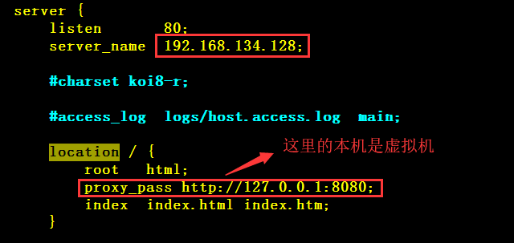
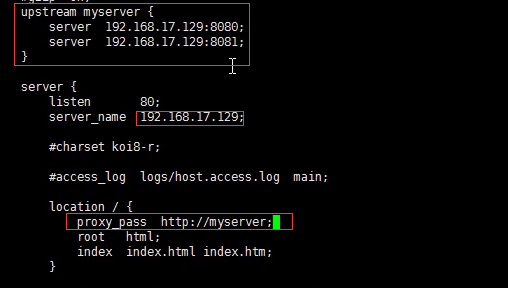
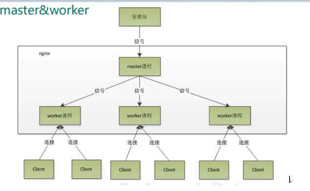
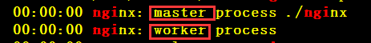
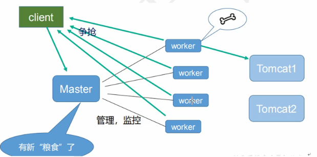

# 一、什么是 Nginx

* **Nginx**（" engine x"）是一个高性能的 **HTTP** 和**反向代理**服务器
* 特点是占有内存少，并发能力强
* **nginx** 的并发能力确实在同类型的网页服务器中表现较好
* **Nginx** 专为性能优化而开发，性能是其最重要的考量，实现上非常注重效率，能经受高负载的考验
    * 有报告表明能支持高达 **50,000** 个并发连接数


# 二、正向代理

正向代理

* 如果把局域网外的 **Internet** 想象成一个巨大的资源库，则局域网中的客户端要访问 **Internet** 则需要通过代理服务器来访间，这种代务称为正向代理

举例

* 如果直接访问 **google** 是访问不了的，需要借助一个代理服务器，由代理服务器来访问 **google** 
    * 这个代理服务器需要在客户端浏览器中进行配置
* 这种代理方式称为**正向代理** 


# 三、反向代理

反向代理

* 其实客户端对代理是无感知的，因为客户端不需要任何配置就可以访问
* 我们只需要将请求发送到反向代理服务器，由反向代理服务器去选择目标服务器获取数据后，再返回给客户端
* 此时反向代理服务器和目标服务器对外就是一个服务器
    * 暴露的是代理服务器地址，隐藏了真实服务器 **IP** 地址


# 四、负载均衡

* 问题
    * 如今互联网访问量越来越大，单个服务器已经不能满足要求了

* 解决
    * 单个服务器解决不了，我们增加务器的数量
    * 然后将请求升发到各个服务器上，将原请求集中到单个服务器上的情况改为将请求分发到多个服务器上
    * 将负载分发到不同务器，也就是我们所说的**负载均衡** 


# 五、动静分离

为了加快网站的解析速度

* 可以把**动态页面**和**静态页面**由不同的服务器来解析，加快解析速度，降低原来单个服务器的压力

动静分离简单来说就是把动态跟静态请求分开，不能理解成只是单纯的把动态页面态页面物理分离

* 严格意义上说应该是**把动态请求跟静态请求分开**，可以理解成使用 **Nginx** 处理静态页面， **Tomcat** 处理动态页面


分离从目前实现角度来讲大致分为两种

* 以一种是纯粹把静态文件独立成单独的域名，放在独立的服务器上，也是目前主流推祟的方式
* 另外一种方法就是动态跟静态文件混合在一起发布，通过 **nginx** 来分开


# 六、Linux 中安装 Nginx

1、预先准备一个 **Nginx** 的压缩包，解压

2、安装额外的依赖

```shell
yum -y install pcre-devel
yum -y install openssl openssl-devel
```

3、进入压缩目录

* 执行以下命令
    * **==./==configure** 
    * **make && make install** 

* 安装位置为：**/usr/local/nginx** 

* 配置文件位置：**/usr/local/nginx/conf/nginx.conf** 


# 七、Nginx 常用命令

前提

* 必须进入到 **Nginx** 的 **sbin** 目录中

1、查看版本号

* **./nginx  -v** 

2、启动

* **./nginx**  

3、关闭

* **./nginx  -s  stop** 

4、重新加载

* **./nginx   -s   reload** 

## 将 Nginx 配置到系统环境变量

1、打开 /etc/profile 文件，在最后一行添加如下内容

```shell
export PATH=$PATH:/usr/local/nginx/sbin
```

2、更新环境变量

```shell
source /etc/profile
```


# 八、Nginx 配置文件

## 1、server 配置

这块和虚拟主机有关系

* 虚拟主机从用户角度看，和一台独立的硬件主机是完全样的
* 该技术的产生是为了每个 **http** 块可以包括多个 **server** 块
* ==而每个 **server** 块就相当于一个虚拟主机== 
    * 而每个 **server** 块也分为全局 **server** 块，以及可以同时包含多个 **locaton** 块

例子

```json
server {
	listen        9001;
	server_name   192.168.134.128;
	
	location ~ /edu/ {
		proxy_pass  http://127.0.0.1:8080;
	}
	location ~ /vod/ {
		proxy_pass  http://127.0.0.1:8081;
	}
}
```

1、不带任何修饰符：例如 **/edu**，表示以 /edu 开头的任何请求都能匹配，例如 /educ，/eduaaa 等

```json
server {
	listen        9001;
	server_name   192.168.134.128;
	location  /edu {
		proxy_pass  http://127.0.0.1:8080;
	}
}
```

2、带 **=** 修饰符：用于不含正则表达式的 uri 前，要求请求字符串与 url 严格匹配，如果匹配成功，就停止继续向下搜索并立即处理该请求

```json
server {
	listen        9001;
	server_name   192.168.134.128;
	location = /edu {
		proxy_pass  http://127.0.0.1:8080;
	}
}
```

* /edu 匹配，/edu/ 不匹配（严格精确匹配）

3、带 **~** 修饰符：用于表示 **url** 包含正则表达式，并且**区分大小写** 

```json
server {
	listen        9001;
	server_name   192.168.134.128;
	location ~ ^/abc\w$ {
		proxy_pass  http://127.0.0.1:8080;
	}
}
```

* \w 表示任意字符 + 数字 + 下划线，/abcd 匹配，/abc 不匹配，/abc_ 匹配，测试时注意缓存

4、带 **~*** 修饰符：用于表示 **url** 包含正则表达式，并且**不区分大小写** 

5、带 **^~** 修饰符：功能和不加任何修饰符一致，且一旦匹配成功就停止向下继续匹配

```json
server {
	listen        9001;
	server_name   192.168.134.128;
    location ^~ /abcd {
    	default_type text/plain;
		return 200 "bbbbbb";
	}
	location ~ ^/abc\w$ {
    	default_type text/plain;
		return 200 "aaaaaaaa";
	}
}
```

* 如果没有加 **^~** 则匹配的是第二个，加了之后匹配的是第一个

注意

* 如果 uri 包含正则表达式，则必须要有 **~** 或者 **~*** 标识


## 2、location 配置

### root 指令

```json
location /static/ {
    root /data;
}
```

这样配置的话静态资源必须放在 **/data/static** 目录下，root 指令会将 **location** 匹配的路径添加到 root 之后，若访问 /static/1.jpg，最终会返回 /data/static/1.jpg 

### alias 指令

```json
location /static {
    alias /data;
}
```

使用 alias 会将 alias 配置的路径替换 location 的路径，访问 /static/1.jpg 会返回 /data/1.jpg 

**注意：如果配置 location 的时候最后加了一个 /，如 /static/，那么在 alias 最后面中也要加一个 /，例如 /data/** 


### index 指令

> 用来设置网站的默认首页

```json
location /static {
    index 4.jpg index.html index.htm index.php;
}
```

index 后面可以跟多个值，如果访问的时候**没有指定具体的资源**，就依次查找，找到第一个为止


`proxy_pass` 详解


# 九、反向代理实例

### 1、反向代理一

* 效果
    * 在 **windows** 中访问 www.123.com 跳转到 **Tomcat** 的主页面

1、准备工作

* 安装 **Tomcat** 并启动
    * 准备一个 **Tomcat** 的压缩包并解压
    * 进入压缩目录使用 **./startup.sh** 启动 **Tomcat** 

2、配置 host 文件

* 位置：**C:\Windows\System32\drivers\etc\hosts** 

* 添加以下内容

```
// 域名与 IP 的映射关系，在 windows 中访问 www.123.com 就会访问 192.168.134.128
192.168.134.128 www.123.com
```

3、配置 Nginx 的配置文件

* 位置：**/usr/local/nginx/conf/nginx.conf** 

> 访问 192.168.134.128 的 80 端口就会转发到 http://127.0.0.1:8080




### 2、反向代理二

* 效果
    * 根据访问路径跳转到不同端口的服务中

```java
假设 Nginx 监听端口是 9001
访问 http://127.0.0.1:9001/edu  跳转到 127.0.0.1:8080
访问 http://127.0.0.1:9001/vod  跳转到 127.0.0.1:8081
```


1、准备工作

* 准备两个 Tomcat 服务器：8080、8081
* 修改端口，启动
    * 修改 server.xml ，位置：**/root/tfc/Tomcat/apache-tomcat-7.0.104/conf/server.xml** 

> **Connector port="8080"     ==>  Connector port="8081"** 

* 在两个 **Tomcat** 的 **webapp** 目录分别新建 **edu、vod** 两个目录，并且放入一个 **a.html**（内容自己写）

2、修改 Nginx 配置文件

* 添加一个 **server** 块

```
server {
	listen       9001;
	server_name       192.168.134.128;
	
	location ~ /edu/ {
		proxy_pass  http://127.0.0.1:8080;
	}
	location ~ /vod/ {
		proxy_pass  http://127.0.0.1:8081;
	}
}
```

3、测试

```
访问 192.168.134.128:9001/edu/a.html
访问 192.168.134.128:9001/vod/a.html
```


# 十、负载均衡实例

1、在 Nginx 配置文件中配置负载均衡服务器

* 在 htpp 块中配置服务器数量

```
upstream 名字{
	// 服务器列表
	server 192.168.134.128：8080;
	server 192.168.134.128：8081;
}
```

* 在 http 块的 server 块中配置具体事项




**==负载均衡策略==** 

1、**轮询**（默认）

* 每个请时间顺序逐一分配到不同的后端服务器，如果后端服务器 dowm 掉，能自动剔除

2、**weight** 

* **weight** 代表权重，默认为 1，权重越高被分配的客户端越多

```
upstream 名字{
	// 服务器列表
	server 192.168.134.128：8080 weight=4;
	server 192.168.134.128：8081 weight=5;
}
```

3、**ip_hash** 

* 每个请求按访问 **IP** 的 **hash** 结果分配，这样**每个访客固定访问一个后端服务器**，可以解决 **session** 的问题

```
upstream 名字{
	// 服务器列表
	ip_hash;
	server 192.168.134.128：8080 weight=4;
	server 192.168.134.128：8081 weight=5;
}
```

4、**fair**（第三方）

* **根据**后端服务器的**响应时间**来分配请求，响应时间短的优先分配

```
upstream 名字{
	// 服务器列表
	fair;
	server 192.168.134.128：8080 weight=4;
	server 192.168.134.128：8081 weight=5;
}
```


# 十一、动静分离实例

1、准备工作

* 新建一个文件夹，存放静态资源

```
/root/tfc/data/images
/root/tfc/data/www
```

2、修改 Nginx 配置文件

* 加入相应的 **location**（server_name 不能写 localhost，要写具体 IP 地址）

```
location /www/{
	root /root/tfc/data/;
	index index.html  index.htm;
}

location /images/{
	root /root/tfc/data/;
	autoindex on;	// 列出目录
}
```


# 十二、Nginx 集群

准备工作：准备两台 `Linux` 节点，都装上 `Nginx` 和 `keepalived` 

`keepalived` 的作用：检测服务器的状态

​		如果有一台 web 服务器宕机，或工作出现故障，**Keepalived** 会将有故障的服务器从系统中剔除，同时使用其他服务器代替该服务器的工作，当服务器工作正常后 **Keepalived** 自动将服务器加入到服务器群中，这些工作全部自动完成，不需要人工干涉，需要人工做的只是修复故障的服务器

安装 `keepalived`：`yum -y install keepalived` 

安装位置：`/etc/keepalived` 


# 十三、Nginx 执行原理

### 1、master & worker

* Nginx 启动之后，会启动一个 master 进程和多个 worker 进程






* 工作方式
    * **master** 检测到有客户端访问时，**master** 会将请求分担给 **worker** 
    * **worker** 会以争抢的方式来处理请求




### 2、worker 的数量

每个 worker 都是一个独立的进程

每个 worker 都可以将 CPU 的性能发挥到极致，所以 worker 的数量和 CPU 的数量一致


### 3、worker 的连接数

* **worker_connections**


发送一个请求占用了 2 个或 4 个连接数

* 2 个是静态资源请求，4 个是需要查数据库


最大并发数

* 设某个 Nginx 有一个 master，4 个 worker，每个 worker 的最大连接数是 1024

* 普通的静态访问最大并发数为
    * **worker_connections * worker_processes / 2**
* 需要访问数据库的最大并发数
    * **worker_connections * worker_processes / 4**


