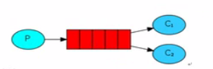
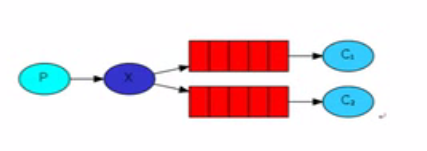
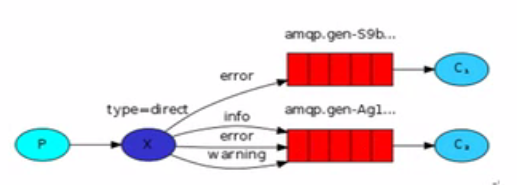

# RabbitMQ

## 一、安装

1、安装 **erlang** 环境

* `curl -s https://packagecloud.io/install/repositories/rabbitmq/erlang/script.rpm.sh | sudo bash` 

2、安装 **rabbitmq** 

* `curl -s https://packagecloud.io/install/repositories/rabbitmq/rabbitmqserver/script.rpm.sh | sudo bash` 
* `yum install rabbitmq-server-3.8.3-1.el7.noarch` 

3、安装路径

* `/usr/share/doc/rabbitmq-server-3.8.3` 


## 二、简单队列

### 1、获取连接

```java
public static Connection getConnention() throws IOException, TimeoutException {
        // 1、定义一个连接工厂
        ConnectionFactory factory = new ConnectionFactory();
        // 2、设置服务地址
        factory.setHost("192.168.10.128");
        // 3、设置端口：AMQP:5672
        factory.setPort(5672);
        // 4、设置 Virtual Host(相当于数据库)
        factory.setVirtualHost("/");
        // 5、设置用户
        factory.setUsername("tfc");
        factory.setPassword("123456");

        return factory.newConnection();
}
```


### 2、创建消息

```java
public static void main(String[] args) throws IOException, TimeoutException {
    // 获取连接
    Connection connection = ConnectionUtil.getConnention();
    // 从连接中获取一个通道
    Channel channel = connection.createChannel();
    // 通道绑定队列
    channel.queueDeclare(QUEUE_NAME, false, false, false, null);

    // 发送消息
    String mes = "Hello RabbitMQ";
    channel.basicPublish("", QUEUE_NAME, null, mes.getBytes());

    System.out.println(mes);

    channel.close();
    connection.close();
}
```

#### 2.1 队列声明参数详解

```java
queueDeclare(String queue, boolean durable, boolean exclusive, boolean autoDelete, Map<String, Object> args)
```

1、**queue**：声明的队列的名字

2、**durable**：是否开启持久化

* 队列的声明默认是存放到内存中的，如果 **rabbitmq** 重启会丢失，如果想重启之后还存在就要使队列持久化，保存到 **Erlang** 自带的Mnesia数据库中，当 **rabbitmq** 重启之后会读取该数据库

3、**exclusive**：是否独占队列

* 为 **true** 则表示其他连接无法使用该队列，只有当前连接能使用该队列
* 为 **false** 则表示任何连接都能使用该队列

4、**autoDelete**：是否自动删除

* 为 **true** 时，当最后一个消费者断开连接之后队列自动被删除

5、**args**：相关参数

* 一般为 **null** 


### 3、接收消息

```java
public static void main(String[] args) throws IOException, TimeoutException {
        // 获取连接
        Connection connection = ConnectionUtil.getConnention();
        // 创建通道
        Channel channel = connection.createChannel();

        // 通道绑定一个队列
        channel.queueDeclare(QUEUE_NAME, false, false, false, null);

        DefaultConsumer consumer = new DefaultConsumer(channel) {
            @Override
            public void handleDelivery(String consumerTag, Envelope envelope,
                                       AMQP.BasicProperties properties, byte[] body) throws IOException {
                String mes = new String(body);
                System.out.println(mes);
            }
        };

        // 监听队列
        channel.basicConsume(QUEUE_NAME, true, consumer);
}
```


### 4、不足

1、耦合性高，生产者、消费者一一对应

* 如果需要多个消费者就不行了

2、队列名变更不便

* 变更队列名时需要同时修改生产者和消费者的队列名


## 三、工作队列

### 1、模型

* 一个生产者对应多个消费者




### 2、轮询分发

* 消费者均分消息，每个消费者处理的消息数是一样的
* 这种方法叫做轮询分发
    * 依次分发给消费者消息

#### 实现

* 多个消费者注册同一个消息队列生产

生产者

```java
private static final String QUEUE_NAME = "work_queue";

public static void main(String[] args) throws IOException, TimeoutException, InterruptedException {
    // 获取连接
    Connection connection = ConnectionUtil.getConnention();
    // 创建通道
    Channel channel = connection.createChannel();
    // 创建队列
    channel.queueDeclare(QUEUE_NAME, false, false, false, null);

    for (int i = 0; i < 50; i++) {
        String mes = "Hello Rabbit" + i;
        channel.basicPublish("", QUEUE_NAME, null, mes.getBytes());
        Thread.sleep(i * 20);
    }
    channel.close();
    connection.close();
}
```

消费者1

```java
private static final String QUEUE_NAME = "work_queue";

public static void main(String[] args) throws IOException, TimeoutException, InterruptedException {
    // 获取连接
    Connection connection = ConnectionUtil.getConnention();
    // 创建通道
    Channel channel = connection.createChannel();
    // 声明队列
    channel.queueDeclare(QUEUE_NAME, false, false, false, null);

    // 定义一个消费者
    DefaultConsumer consumer = new DefaultConsumer(channel) {
        // 有消息到达时自动触发
        @Override
        public void handleDelivery(String consumerTag, Envelope envelope, AMQP.BasicProperties properties, byte[] body) throws IOException {
            String mes = new String(body);
            System.out.println("(1) receive" + mes);

            try {
                Thread.sleep(2000);
            } catch (InterruptedException e) {
                e.printStackTrace();
            } finally {
                System.out.println("(1) done");
            }
        }
    };

    boolean autoAck = true;
    channel.basicConsume(QUEUE_NAME, autoAck, consumer);
}
```

消费者2

```java
private static final String QUEUE_NAME = "work_queue";

public static void main(String[] args) throws IOException, TimeoutException, InterruptedException {
    // 获取连接
    Connection connection = ConnectionUtil.getConnention();
    // 创建通道
    Channel channel = connection.createChannel();
    // 声明队列
    channel.queueDeclare(QUEUE_NAME, false, false, false, null);

    // 定义一个消费者
    DefaultConsumer consumer = new DefaultConsumer(channel) {
        // 有消息到达时自动触发
        @Override
        public void handleDelivery(String consumerTag, Envelope envelope, AMQP.BasicProperties properties, byte[] body) throws IOException {
            String mes = new String(body);
            System.out.println("(2) receive" + mes);

            try {
                Thread.sleep(1000);
            } catch (InterruptedException e) {
                e.printStackTrace();
            } finally {
                System.out.println("(2) done");
            }
        }
    };

    boolean autoAck = true;
    channel.basicConsume(QUEUE_NAME, autoAck, consumer);
}
```


### 3、公平分发 fair dipatch

现象

* 根据处理速度分发消息，处理速度快的就分发的块

#### 实现

* 多个消费者注册同一个消息队列
* 限制消息队列发送给消费者的消息数量

```java
// 生产者
/**
 * 每个消费者发送确认消息之前，消息队列不发送下一个消息到消费者
 * 限制每次发送给消费者的消息不能超过一条
  */
int prefectchCount = 1;
channel.basicQos(prefectchCount);
```

```java
// 消费者
....
channel.basicQos(1); // 一次只能接收一个
....
// 手动返回一个回执表示处理完毕，可以接受下一个消息，false 表示关闭多个消息同时确认
channel.basicAck(envelope.getDeliveryTag(), false);
....
boolean autoAck = false;  // 关闭自动处理
channel.basicConsume(QUEUE_NAME, autoAck, consumer);
```

生产者

```java
private static final String QUEUE_NAME = "work_queue";

public static void main(String[] args) throws IOException, TimeoutException, InterruptedException {
    // 获取连接
    Connection connection = ConnectionUtil.getConnention();
    // 创建通道
    Channel channel = connection.createChannel();
    // 创建队列
    channel.queueDeclare(QUEUE_NAME, false, false, false, null);

    /**
     * 每个消费者发送确认消息之前，消息队列不发送下一个消息到消费者
     * 限制每次发送给消费者的消息不能超过一条
      */
    int prefectchCount = 1;
    channel.basicQos(prefectchCount);

    for (int i = 0; i < 50; i++) {
        String mes = "Hello Rabbit" + i;
        channel.basicPublish("", QUEUE_NAME, null, mes.getBytes());
        Thread.sleep(i * 5);
    }
    channel.close();
    connection.close();
}
```

消费者1

```java
private static final String QUEUE_NAME = "work_queue";

public static void main(String[] args) throws IOException, TimeoutException, InterruptedException {
    // 获取连接
    Connection connection = ConnectionUtil.getConnention();
    // 创建通道
    Channel channel = connection.createChannel();
    // 声明队列
    channel.queueDeclare(QUEUE_NAME, false, false, false, null);

    channel.basicQos(1); // 一次只能接收一个

    // 定义一个消费者
    DefaultConsumer consumer = new DefaultConsumer(channel) {
        // 有消息到达时自动触发
        @Override
        public void handleDelivery(String consumerTag, Envelope envelope, AMQP.BasicProperties properties, byte[] body) throws IOException {
            String mes = new String(body);
            System.out.println("(1) receive" + mes);

            try {
                Thread.sleep(2000);
            } catch (InterruptedException e) {
                e.printStackTrace();
            } finally {
                System.out.println("(1) done");
                // 手动处理回执
                channel.basicAck(envelope.getDeliveryTag(), false);
            }
        }
    };

    // 关闭自动回执
    boolean autoAck = false;
    channel.basicConsume(QUEUE_NAME, autoAck, consumer);
}
```

消费者2

```java
private static final String QUEUE_NAME = "work_queue";

public static void main(String[] args) throws IOException, TimeoutException, InterruptedException {
    // 获取连接
    Connection connection = ConnectionUtil.getConnention();
    // 创建通道
    Channel channel = connection.createChannel();
    // 声明队列
    channel.queueDeclare(QUEUE_NAME, false, false, false, null);

    channel.basicQos(1);

    // 定义一个消费者
    DefaultConsumer consumer = new DefaultConsumer(channel) {
        // 有消息到达时自动触发
        @Override
        public void handleDelivery(String consumerTag, Envelope envelope, AMQP.BasicProperties properties, byte[] body) throws IOException {
            String mes = new String(body);
            System.out.println("(2) receive" + mes);

            try {
                Thread.sleep(1000);
            } catch (InterruptedException e) {
                e.printStackTrace();
            } finally {
                System.out.println("(2) done");
                // 手动发送回执
                channel.basicAck(envelope.getDeliveryTag(),false);
            }
        }
    };

    boolean autoAck = false;
    channel.basicConsume(QUEUE_NAME, autoAck, consumer);
}
```


## 四、消息应答 autoAck

```java
boolean autoAck = false;
channel.basicConsume(QUEUE_NAME, autoAck, consumer);
```

### 1、当 autoAck 为 true 时

自动确认模式

* 一旦消息队列将消息分发给了某个消费者，消息队列立即删除内存中的该消息

缺点

* 会出现数据丢失的情况


### 2、当 autoAck 为 false 时

手动确认模式

* 若消息队列没有收到某个消息的回执，就不会删除内存中的消息
* 若一段时间后没有收到回执，就会向其他消费者重新发送该消息
* 收到回执后消息队列才会删除内存中的数据


## 五、消息持久化 durable

​        服务器会将消息队列中的信息保存到文件中，若服务器宕机了，重启服务器的时候会从文件中重新读取消息内容，然后分发，不会造成数据丢失

```java
// 声明队列
channel.queueDeclare(QUEUE_NAME, false, false, false, null);
```

```java
queueDeclare(String queue, boolean durable, boolean exclusive, boolean autoDelete,Map<String,Object>arguments)
```

**参数 durable**

* true 表示开启持久化，false 表示不开启
* ==**注意**==
    * **Rabbit** 不允许改变已存在队列的任何参数
    * 若将 **durable** 设置为 **false** 后运行过，则中途不能 改为 **true** 
    * 因为 **RabbitMQ** 的后台管理中已经存在该队列，不能改变
        * 可以登录后台管理删除相应的队列重新设置参数

## 六、交换机（Exchange）

​		如果用空字符串（""）去声明一个 **exchange** 时，系统就会使用 **"AMQP default"** 这个 **exchange**，当我们新创建一个 **queue** 时，默认会有一个和新建 **queue** 同名的 **routingKey** 绑定到这个默认的 **exchange**上去

作用

* 接收生产者的消息，并将消息推送到各个**消费者队列** 

### 1、匿名：" "

```java
channel.basicPublish("", QUEUE_NAME, null, mes.getBytes());
```

```java
public void basicPublish(String exchange, String routingKey, BasicProperties props,byte[] body)
```

* 第一个参数是交换机的名字，第二个参数是路由键的名字


```java
// 声明交换机
channel.exchangeDeclare(EXCHANGE_NAME, "fanout");
```

```java
public DeclareOk exchangeDeclare(String exchange, String type) throws IOException {}
```

交换机类型：**type** 

* **fanout**：不处理路由键
    * 交换机会将消息发送给**所有**绑定该交换机的队列
* **direct**：处理路由键
    * 交换机会将消息发送个拥有这个路由键的队列


## 七、订阅模式

* 将**==同一个消息==**发布给多个消费者



解释

* 一个生产者，多个消费者
* 每一个消费者都有自己的消息队列
* 生产者并没有将消息直接发送到消息队列，而是发送到了交换机（Exchange）
    * 由交换机将消息发送到消费者的消息队列上
    * **交换机不能存储消息数据** 
* 每个消费者都要绑定到交换器上才能接收消息


### 实现

生产者

```java
private static final String EXCHANGE_NAME = "fenout";

public static void main(String[] args) throws IOException, TimeoutException {
    // 创建连接
    Connection connection = ConnectionUtil.getConnention();
    // 创建通道
    Channel channel = connection.createChannel();

    // 声明交换机
    channel.exchangeDeclare(EXCHANGE_NAME, "fenout");

    // 发送消息
    String mes = "Hello Subscription";

    channel.basicPublish(EXCHANGE_NAME, "", null, mes.getBytes());

    channel.close();
    connection.close();
}
```

消费者

```java
private static final String QUEUE_NAME = "consumer01";
private static final String EXCHANGE_NAME = "fenout";

public static void main(String[] args) throws IOException, TimeoutException {
    Connection connention = ConnectionUtil.getConnention();
    Channel channel = connention.createChannel();

    //声明队列
    channel.queueDeclare(QUEUE_NAME, false, false, false, null);

    // 绑定交换机
    channel.queueBind(QUEUE_NAME, EXCHANGE_NAME, "");

    channel.basicQos(1); // 一次只能分发一个

    // 定义一个消费者
    DefaultConsumer consumer = new DefaultConsumer(channel) {
        // 有消息到达时自动触发
        @Override
        public void handleDelivery(String consumerTag, Envelope envelope, AMQP.BasicProperties properties, byte[] body) throws IOException {
            String mes = new String(body);
            System.out.println("(1) receive" + mes);

            try {
                Thread.sleep(2000);
            } catch (InterruptedException e) {
                e.printStackTrace();
            } finally {
                System.out.println("(1) done");
                channel.basicAck(envelope.getDeliveryTag(), false);
            }
        }
    };

    boolean autoAck = false;
    channel.basicConsume(QUEUE_NAME, autoAck, consumer); // 监听队列
}
```


## 八、路由模式（Routing）




解释

* 交换机发送消息时带一个 **routingKey**，与之匹配的队列会受到该消息

生产者

```java
private static final String EXCHANGE_NAME = "test_direct";

public static void main(String[] args) throws IOException, TimeoutException {
    Connection connention = ConnectionUtil.getConnention();
    Channel channel = connention.createChannel();

    // 声明交换机
    channel.exchangeDeclare(EXCHANGE_NAME, "direct");

    String mes = "Hello Direct";
    
	// 设置 routingKey
    String routingKey = "info";
    channel.basicPublish(EXCHANGE_NAME, routingKey, null, mes.getBytes());

    channel.close();
    connention.close();
}
```

消费者

```java
private static final String QUEUE_NAME = "Consumer-2";
private static final String EXCHANGE_NAME = "test_direct";

public static void main(String[] args) throws IOException, TimeoutException {
    Connection connention = ConnectionUtil.getConnention();
    Channel channel = connention.createChannel();

    channel.queueDeclare(QUEUE_NAME, false, false, false, null);

    channel.basicQos(1);

    // 绑定 routingKey
    channel.queueBind(QUEUE_NAME, EXCHANGE_NAME, "error");
    channel.queueBind(QUEUE_NAME, EXCHANGE_NAME, "info");

    // 定义一个消费者
    DefaultConsumer consumer = new DefaultConsumer(channel) {
        // 有消息到达时自动触发
        @Override
        public void handleDelivery(String consumerTag, Envelope envelope, AMQP.BasicProperties properties, byte[] body) throws IOException {
            String mes = new String(body);
            System.out.println("(2) receive" + mes);

            try {
                Thread.sleep(2000);
            } catch (InterruptedException e) {
                e.printStackTrace();
            } finally {
                System.out.println("(2) done");
                channel.basicAck(envelope.getDeliveryTag(), false);
            }
        }
    };

    boolean autoAck = false;
    channel.basicConsume(QUEUE_NAME, autoAck, consumer);
}
```


## 九、主题模式（Topics）

使用通配符来进行匹配（类似正则表达式）

* 队列绑定一个带正则表达式的字符串：user*，与之相匹配的消息都能被接收


生产者

```java
private static final String EXCHANGE_NAME = "test_topic";

public static void main(String[] args) throws IOException, TimeoutException {
    Connection connention = ConnectionUtil.getConnention();
    Channel channel = connention.createChannel();

    channel.exchangeDeclare(EXCHANGE_NAME, "topic");

    String mes = "Hello Topic";

    channel.basicPublish(EXCHANGE_NAME, "good.add", null, mes.getBytes());

    channel.close();
    connention.close();
}
```

消费者

```java
private static final String EXCHANGE_NAME = "test_topic";
private static final String QUEUE_NAME = "Consumer-1";

public static void main(String[] args) throws IOException, TimeoutException {
    Connection connention = ConnectionUtil.getConnention();
    Channel channel = connention.createChannel();

    channel.queueDeclare(QUEUE_NAME, false, false, false, null);
    // 绑定带通配符的模式
    channel.queueBind(QUEUE_NAME, EXCHANGE_NAME, "good.*");

    channel.basicQos(1);

    DefaultConsumer consumer = new DefaultConsumer(channel) {
        @Override
        public void handleDelivery(String consumerTag, Envelope envelope, AMQP.BasicProperties properties, byte[] body) throws IOException {
            String mes = new String(body);
            System.out.println("(1) Receive " + mes);

            try {
                Thread.sleep(1000);
            } catch (InterruptedException e) {
                e.printStackTrace();
            } finally {
                System.out.println("(1) done");
            }
        }
    };

    channel.basicConsume(QUEUE_NAME, false, consumer);
}
```


## 十、消息确认机制

问题

* 生产者生产的消息到底有没有到达 **rabbitmq** 的服务器
* 默认情况是不知道的

解决

* **AMQP** 事务机制
* **Confirm** 模式


### 1、AMQP 事务机制

1、**txSelect**：用户将当前 **Channel** 设置成 **transation** 模式

2、**txCommit**：用于提交事务

3、**txRollback**：回滚事务

生产者

```java
private static final String QUEUE_NAME = "tx_queue";

public static void main(String[] args) throws IOException, TimeoutException {
    Connection connention = ConnectionUtil.getConnention();
    Channel channel = connention.createChannel();

    channel.queueDeclare(QUEUE_NAME, false, false, false, null);

    String mes = "Hello Java";

    try {
        // 开启事务
        channel.txSelect();

        channel.basicPublish("", QUEUE_NAME, null, mes.getBytes());

        // 提交事务
        channel.txCommit();
    } catch (Exception e) {
        // 出错则事务回滚
        channel.txRollback();
        e.printStackTrace();
    }

    channel.close();
    connention.close();
}
```

消费者

```java
private static final String QUEUE_NAME = "tx_queue";

public static void main(String[] args) throws IOException, TimeoutException {
    Connection connention = ConnectionUtil.getConnention();
    Channel channel = connention.createChannel();

    channel.queueDeclare(QUEUE_NAME, false, false, false, null);

    DefaultConsumer consumer = new DefaultConsumer(channel) {
        @Override
        public void handleDelivery(String consumerTag, Envelope envelope, AMQP.BasicProperties properties, byte[] body) throws IOException {
            String mes = new String(body);
            System.out.println(mes);
        }
    };

    channel.basicConsume(QUEUE_NAME, true, consumer);
}
```


### 2、Confirm 模式

生产者将信道设置成 **confirm** 模式

* 一且信通进入 **confirm** 模式，所有在该信通上面发布的消息都会被指派一个唯一的 **ID**（从1开始）
* 一旦消息被投递到所有匹配的队列之后 **broker** 就会发送一个确认给生产者（包含消息的唯一 **ID**），这就使得生产者知道消息已经正确到达目的队列了
* 如果消息和队列是可持久化的，那么确认消息会在消息写入磁盘之后发出
* **broker** 传给生产者的确认消息中 **deliver-tag** 域包含了确认消息的序列号
* 此外 **broker** 也可以设置 **basic.ack** 的**multiple** 域，表示到这个序列号之前的所有清息都已经得到了处理

优点

* 最大的优点就是异步

### 3、过程

* 开启 Confirm 模式

```java
// 开启 Confirm 模式
channel.confirmSelect();
```

#### 1、一条一条发送

```java
private static final String QUEUE_NAME = "confirm";

public static void main(String[] args) {
    Connection connention = ConnectionUtil.getConnention();
    Channel channel = connention.createChannel();
    channel.queueDeclare(QUEUE_NAME, false, false, false, null);

    // 开启 Confirm 模式
    channel.confirmSelect();

    String mes = "Hello Java";

    channel.basicPublish("", QUEUE_NAME, null, mes.getBytes());

    if (!channel.waitForConfirms()) {
        System.out.println("消息发送失败");
    } else {
        System.out.println("消息发送成功");
    }

    channel.close();
    connention.close();
}
```

#### 2、批量发送

```java
private static final String QUEUE_NAME = "confirm";

public static void main(String[] args)  {
    Connection connention = ConnectionUtil.getConnention();
    Channel channel = connention.createChannel();
    channel.queueDeclare(QUEUE_NAME, false, false, false, null);

    // 开启 Confirm 模式
    channel.confirmSelect();

    String mes = "Hello Java";

    // 批量发送
    for(int i=0;i<10;i++){
        channel.basicPublish("", QUEUE_NAME, null, mes.getBytes());
    }

    // 确认
    if (!channel.waitForConfirms()) {
        System.out.println("消息发送失败");
    } else {
        System.out.println("消息发送成功");
    }

    channel.close();
    connention.close();
}
```

#### 3、异步发送

​		**Channel** 对象提供的 **ConfirmListence** 回调方法只包含 **deliverylag**（当前 **Channel** 发出的消息的序号），我们需要自己为每一个 **Channel** 维护一个 **unconfirm** 的消息序号集合，每 **publish**（发送） 一条数据，集合中元素加 **1**，每回调一次 **handleAck** 方法， **unconfirme** 集合删掉相应的一条或多条消息


生产者

```java
private static final String QUEUE_NAME = "confirm03";

public static void main(String[] args) {
    Connection connention = ConnectionUtil.getConnention();
    Channel channel = connention.createChannel();
    channel.queueDeclare(QUEUE_NAME, false, false, false, null);

    // 开启 Confirm 模式
    channel.confirmSelect();

    // 未确认的标识
    final SortedSet<Long> confirmSet = Collections.synchronizedSortedSet(new TreeSet<Long>());

    // 添加通道监听
    channel.addConfirmListener(new ConfirmListener() {
        // 没有问题
        @Override
        public void handleAck(long deliveryTag, boolean multiple)  {
            if (multiple) { // 是否一次性回执多个
                System.out.println("handle true");
                confirmSet.headSet(deliveryTag + 1).clear();
            } else {
                System.out.println("handle false");
                confirmSet.remove(deliveryTag);
            }
        }

        // 有问题
        @Override
        public void handleNack(long deliveryTag, boolean multiple)  {
            // 错误处理逻辑
            if (multiple) {   // 是否一次性回执多个
                System.out.println("handleNack true");
                confirmSet.headSet(deliveryTag + 1).clear();
            } else {
                System.out.println("handleNack false");
                confirmSet.remove(deliveryTag);
            }
        }
    });

    String mes = "Hello Java";

    while (true) {
        Long seqNo = channel.getNextPublishSeqNo();
        channel.basicPublish("", QUEUE_NAME, null, mes.getBytes());
        confirmSet.add(seqNo);
    }

    channel.close();
    connention.close();
}
```


## 十一、Spring+RabbitMQ

### 1、配置文件

1. 定义连接工厂

```xml
<!--定义 RabbitMQ 的连接工厂-->
<rabbit:connection-factory id="connectionFactory"
                           host="192.168.10.128" username="tfc" password="123456"
                           virtual-host="/"/>
```

2. MQ 的管理

```xml
<!--MQ 的管理，包括队列、交换机声明等-->
<rabbit:admin connection-factory="connectionFactory"/>
```

3. 声明队列
    * 该队列必须已经存在（在服务器端手动设置或通过代码设置）

```xml
<!--声明队列-->
<rabbit:queue name="myQueue" auto-declare="true"/>
```

4. 声明交换机并绑定队列

```xml
<!--声明 Exchange 交换机-->
<rabbit:fanout-exchange name="exchange" auto-declare="true">
    <rabbit:bindings>
        <rabbit:binding queue="myQueue"/>
    </rabbit:bindings>
</rabbit:fanout-exchange>
```

5. 导入消费者
    * 消费者的处理逻辑自己写

```xml
<!--消费者-->
<bean id="myConsumer" class="com.tfc.rabbit.MyConsumer"/>
```

6. 监听队列

```xml
<!--队列监听-->
<rabbit:listener-container connection-factory="connectionFactory">
    <!--指定消费者及处理逻辑的方法-->
    <rabbit:listener ref="myConsumer" method="listen" queue-names="myQueue"/>
</rabbit:listener-container>
```

7. 定义模板，简化操作

```xml
<!--定义 rabbit 模板，指定连接工厂及定义 exchange-->
<rabbit:template id="Template" connection-factory="Factory" exchange="exchange"/>
```


### 2、消费者

* 写一个类，在类中写各种方法，然后在配置文件中指定即可

```java
public class MyConsumer {

    // 具体执行业务的方法
    public void listen(String foo) {
        System.out.println("消费者 " + foo);
    }
}
```


### 3、简单使用

1、导入配置文件方式

```java
public class MyRabbit {
    public static void main(String[] args) throws InterruptedException {
        ApplicationContext context = new ClassPathXmlApplicationContext("classpath:spring-rabbitmq.xml");

        RabbitTemplate template = context.getBean(RabbitTemplate.class);

        // 发送消息
        template.convertAndSend("Hello Java");
        Thread.sleep(1000);

    }
}
```


2、自动注入方式

```java
public class TestRabbit {

    @Autowired
    private RabbitTemplate template;

    @Test
    public void testRabbit() {
        template.convertAndSend("Hello Junit");
    }
}
```


## 十二、SpringBoot + RabbitMQ

### 基本操作

1. 引入相应模块

```xml
<dependency>
    <groupId>org.springframework.boot</groupId>
    <artifactId>spring-boot-starter-amqp</artifactId>
</dependency>
```

2. 添加相应配置

```properties
spring.rabbitmq.host=192.168.10.128
spring.rabbitmq.username=tfc
spring.rabbitmq.password=123456
spring.rabbitmq.virtual-host=/ 
```

3. 注入 **RabbitTemplate** 简化操作

```java
@Autowired
private RabbitTemplate rabbitTemplate;

// 发送消息
@Test
public void sendMessage() {
    Map<String, Object> map = new HashMap<>();
    map.put("a", "tfc");
    map.put("b", "徐凤年");
    // 默认以 Java 自带的方式进行序列化
    rabbitTemplate.convertAndSend("exchange.direct", "tfc", map);
}

// 接收消息
@Test
public void reveiceMessage() {
    Object tfcQueue = rabbitTemplate.receiveAndConvert("tfcQueue");
    System.out.println(tfcQueue.getClass());
    System.out.println(tfcQueue);
}
```


### 使用 **Json** 方式进行序列化

```java
@Configuration
public class RabbitMQConfig {

    @Bean
    public MessageConverter messageConverter() {
        return new Jackson2JsonMessageConverter();
    }
}
```


### 监听队列

* 由 service 层来完成

准备

* 在处理逻辑方法上使用 **@RabbitListener** 注解，指定监听哪个队列
* 在主方法上使用 **@EnableRabbit** 注解

```java
@Service
public class RabbitService {

    @RabbitListener(queues = "tfcQueue")            // 监听的队列名
    public void receive(Map<String, Object> map) {
        System.out.println(map);                    // 处理逻辑
    }
}
```

```java
@EnableRabbit
@SpringBootApplication
public class RabbitmqtestApplication {
    public static void main(String[] args) {
        SpringApplication.run(RabbitmqtestApplication.class, args);
    }
}
```

### 使用程序创建队列、交换机等

* 注入 **AmqpAdmin** 对象

```java
// 创建交换器
@Test
public void createExchange() {
    Exchange exchange = new DirectExchange("amqpAdmin.exchange");
    amqpAdmin.declareExchange(exchange);
    System.out.println("创建 exchange 完成");
}
```

```java
// 创建队列
@Test
public void createQueue() {
    Queue queue = new Queue("amqpAdmin.queue");
    amqpAdmin.declareQueue(queue);
}
```

```java
// 创建绑定规则
@Test
public void createBinding() {
    Binding binding = new Binding("amqpAdmin.queue", Binding.DestinationType.QUEUE, "amqpAdmin.exchange", "tfcTFC", null);
    amqpAdmin.declareBinding(binding);
}
```


## 十三、基本操作命令

### 添加用户

>rabbitmqctl  add_user  用户名  密码
>rabbitmqctl  set_user_tags  用户名  标签(权限)

* administrator：表示超级用户


### 删除用户

> rabbitmqctl  delete_user  用户名


### 修改密码

>rabbitmqctl  change_password  用户名  新密码


### 查看所有用户

> rabbitmqctl   list_users


### 启动、关闭

>systemctl  start  rabbitmq-server.service
>systemctl  stop  rabbitmq-server.service


### 开启WEB可视化管理插件  

> rabbitmq-plugins  enable  rabbitmq_management  


### 访问可视化界面

> IP：端口（15672）


### 查看 vhost 中的权限

> rabbitmqctl  list_permissions  -p  vhost（具体的 vhost 名）


### 移除用户在 vhost 上的权限

> rabbitmqctl  clear_permissions  -p  vhost  用户名


### 列出已声明的队列

> rabbitmqctl  list_queues  -p  vhost(具体的 vhost 名)


### 列出已声明的交换机

> rabbitmqctl  list_exchanges  -p  vhost(具体的 vhost 名)


### 查看绑定信息

> rabbitmqctl  list_bindings


