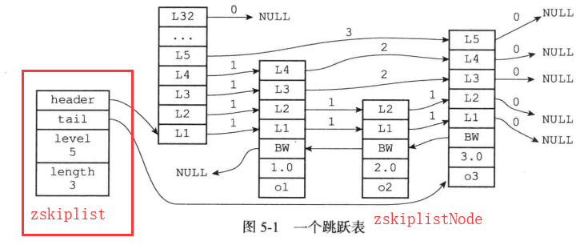
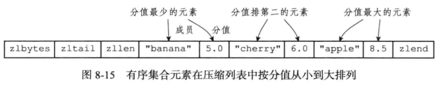

# Redis 中的数据结构

## 一、字符串

### 1、SDS

#### 1.1 概念

* Redis 没有直接使用 C 语言传统的字符串表示，而是自己构建了一种名为==**简单动态字符串**==（**simple dynamic string，SDS**）

#### 1.2 结构


#### 1.3 特点

* SDS 遵循 C 字符串以空字符结尾的惯例，保存 **空字符的 1 字节空** 间不计算在SD的 len 属性里面，并且为空字符分配额外的 1 字节空间
* 遵循空字符结尾这一惯例的好处是，SDS可以直接**重用一部分 C 字符串函数库里面的函数**


#### 1.4 优点

1. 获取一个 SDS 长度的复杂度仅为 **O(1)**
   
* 设置和更新 SDS 长度的工作是由 SDS 的 API 在执行时自动完成的
  
2. 杜绝缓冲区溢出

    * 问题

        

    * SDS 的做法

        * 当 SDS AP I需要对 SDS 进行修改时，API 会先检查 SDS 的空间是否满足修改所需的要求
        * 如果不满足的话，API 会自动将 SDS 的空间扩展至执行修改所需的大小，然后才执行实际的修改操作

3. 减少修改字符串时带来的**内存重分配次数**
    * 问题
        * 因为C字符串的长度和底层数组的长度之间存在着这种关联性，所以每次增长或者缩短一个C字符串，程序都总要对保存这个C字符串的数组进行一次内存重分配操作
        * 内存重分配是一个耗时操作
    * SDS 的做法
        * SDS通过**未使用空间**解除了字符串长度和底层数组长度之间的关联
        * 通过未使用空间，SDS 实现了 **空间预分配** 和 **惰性空间释放** 两种优化策略
    * **空间预分配**
        * 当SDS的API对一个SDS进行修改，并且需要对SDS进行空间扩展的时候，程序不仅会为SDS分配修改所必须要的空间，还会为 SDS **分配额外的未使用空间**
        * 分配规则
            * 如果对 SDS 进行修改之后，SDS的长度（也即是1en属性的值）将**==小于 1MB==**，那么程序分配和len 属性同样大小的未使用空间
            * 如果对SDS进行修改之后，SDS的长度将**==大于等于1MB==**，那么程序会分配1MB的未使用空间
        * 通过空间预分配策略， Redis 可以减少连续执行字符串增长操作所需的内存重分配次数
    * **惰性空间释放**
        * 惰性空间释放**用于优化SDS的字符串==缩短==操作**
            * 当 SDS 的 AP I需要 缩短SDS 保存的字符串时，程序并不立即使用内存重分配来回收缩短后多出来的字节，**而是使用free属性将这些字节的数量记录起来，并等待将来使用**
        * 通过惰性空间释放策略，SDS避免了缩短字符串时所需的内存重分配操作，并**为将来可能有的增长操作提供了优化**

4. 二进制安全

C 字符串中的字符必须符合某种编码（比如AsCⅡ），并且除了字符串的末尾之外，**字符串里面不能包含空字符**，否则最先被程序读入的空字符将被误认为是字符串结尾，**这些限制使得C字符串只能保存文本数据**，而不能保存像图片、音频、视频、压缩文件这样的二进制数据


所有 SDS API 都会 **以处理二进制的方式来处理SDS** 存放在buf数组里的数据

* 通过使用二进制安全的SDS、而不是C字符串，**使得 Redis不仅可以保存文本数据，还可以保存任意格式的二进制数据**

5. 兼容部分 C 字符串函数
    * SDS API 总会将 SDS 保存的数据的末尾设置为空字符
    * 通过遵循C字符串以空字符结尾的惯例，SDS可以在有需要时重用< string,h>函数库，从而避免了不必要的代码重复


## 二、链表

* 当一个列表键包含了数量比较多的元素，又或者列表中包含的元素都是比较长的字符串时， Redis就会使用链表作为列表键的底层实现

### 1、链表节点

#### 1.1 节点结构


#### 1.2 链表结构


## 三、字典

### 1、定义

* 字典，又称为符号表（ symbol table）、关联数组（ associative array）或**映射（map）** 是种用于              **保存键值对**（key- value pair）的抽象数据结构

* 字典中的每个键都是独一无二的


### 2、哈希表

* Redis的字典使用**哈希表**作为底层实现，一个哈希表里面可以有多个哈希表节点，而每个哈希表节点就保存了字典中的一个键值对

#### 2.1 结构


* **==table==** 属性是一个数组，数组中的**每个元素都是**一个指向 dict.h / dictEntry 结构的**指针**

    

* **dictEntry** 结构

    * 每个 **dictEntry** 结构保存着一个键值对

    

    * next 属性是指向另一个哈希表节点的指针，这个指针可以**将多个哈希值相同的键值对连接在一起**，以此来解决键冲突（ collision）的问题

    


#### 2.2 哈希算法

当要将一个新的键值对添加到宰典里面时，程序需要先**根据键值对的键计算出哈希值和索引值**，然后再根据将包含新键值对的哈希表节点放到哈希表数组的指定索引上面

* Redis 计算哈希值和索引值的方法如下

```java
// 使用字典设置的哈希函数，计算键 key 的哈希值
hash = dict->type->hashFunction(key)
// 使用哈希表的 sizemask 属性和哈希值，计算出索引值
// 根据情况不同，ht[x] 可以是 ht[0] 或者 ht[1]
index = hash & dict->ht[x].sizemask
```

*  Redis 使用 **MurmurHash2** 算法来计算键的哈希值

### 3、字典的结构


**type** 属性和 **privata** 属性是针对不同类型的键值对，**为创建多态字典而设置的**

* type 属性

    * 是一个指向 **dictType** 结构的**指针**，
    * 每个 **dictType** 结构保存了一簇**用于操作特定类型键值对的函数**
    * Redis会为用途不同的字典设置不同的类型特定函数

* privata属性

    * 保存了需要传给那些类型特定函数的可选参数

* dictTpye 结构

    

* 字典中的 ht[]  属性
    * ht 属性是一个包含两个项的数组
    * 数组中的**每一项都是一个 dictht ==哈希表==**
        * 一般情况字典只使用 ht[0] 哈希表，ht[1] 哈希表只会在对ht[0]哈希表进行 rehash 时使用
* 字典中的 **rehashidx** 属性
    
    * 它记录了rehash目前的进度，如果目前没有在进行 rehash，那么它的值为 **-1**


### 4、rehash

随着操作的不断执行，哈希表保存的键值对会逐渐地增多或者减少，为了让哈希表的负载因子（ load factor）维持在一个合理的范围之内，**当哈希表保存的键值对数量太多或者太少时，程序需要对哈希表的大小进行相应的扩展或者收缩**


扩展和收缩哈希表的工作可以通过执行 **rehash**（重新散列）操作来完

步骤

1. 为字典的 **ht[1]** 哈希表分配空间
    * 这个哈希表的空间大小取决于要执行的操作，以及 **ht[0]** 当前包含的键值对数量
2. 将保存在 **ht[0]** 中的所有键值对 **rehash** 到 **ht[1]** 上面
    * **rehash** 指的是**重新计算键的哈希值和索引值**，然后将键值对放置到 **ht[1]** 哈希表的指定位置上
3. 当 **ht[0]** 包含的所有键值对都迁移到了 **ht[1]** 之后，释放 **ht[0]**
    * 将 **ht[1]** 设置为 **ht[0]**，并在 **ht[1**] 新创建一个空白哈希表，为下一次 **rehash** 准备


#### 4.1 渐进式 rehash

*  **rehash** 动作并不是一次性、集中式地完成的，而是分多次、渐进式地完成的
* 原因
    * 如果 **ht[0]** 里只保存着四个键值对，那么服务器可以在瞬间就将这些键值对全部 **rehash** 到 **ht[1]**
    * 但是，如果哈希表里保存的键值对数量不是四个，而是四百万、四千万甚至四亿个键值对，那么要一次性将这些键值对全部 **rehash**到 **ht[1]** 的话，庞大的计算量可能会导致服务器在一段时间内停止服务

步骤

1. 为 **ht[1]** 分配空间，让字典同时持有 **ht[0]** 和 **ht[1]** 两个哈希表
2. 在字典中维持一个索引计数器变量 **rehashidx**，并将它的值设置为 0，表示 rehash 工作正式开始
3. 在 **rehash** 进行期间，每次对字典执行添加、删除、查找或者更新操作时，程序除了执行指定的操作以外，还会顺带将 **ht[0]** 哈希表在 **rehashidx** 索引上的所有键值对 **rehash** 到 **ht[1]**，当 **rehash** 工作完成之后，程序将 **rehashidx** 属性的值加 **1**
4. 随着字典操作的不断执行，最终在某个时间点上，**ht[0]** 的所有键值对都会被 **rehash** 至 **ht[1]**，这时程序将 **rehashidx** 属性的值设为 **-1**，表示 **rehash**操作已完成


注意

* 渐进式 **rehash** 的过程中，字典会同时使用 **ht[0]** 和 **ht[1]** 两个哈希表
    * 所以在渐进式 **rehash**进行期间，字典的删除（ delete）查找（fnd）更新（ update）等操作会在两个哈希表上进行
    * 例如，要在字典里而查找一个键的话，程序会先在 **ht[0]** 里而进行查找、如果没找到的话、就会继续到**ht[1]** 里而进行查找，诸如此类
* 在渐进式 rehash 执行期间，**新添加到字典的键值对一律会被保存到 ht[1] 里面**


## 四、跳跃表

跳跃表（ skiplist）是一种**有序数据结构**，它通过**在每个节点中维持多个指向其他节点的指针**，从而达到快速访问节点的目的


Redis 使用跳跃表作为**有序集合键（Zset）**的底层实现之一


### 1、组成

Redis的跳跃表由 **redis.h / zskiplistNode** 和 **redis.h / zskiplist** 两个结构定义，其中 **zskiplistNode 结枃用于表示跳跃表节点**，**而 zskiplist结构则用于保存跳跃表节点的相关信息**，比如节点的数量，以及指向表头节点和表尾节点的指针等等




### 2、zskiplist

header：指向跳跃表的表头节点

tai1：指向跳跃表的表尾节点

level：记录目前跳跃表内，层数最大的那个节点的层数

length：记录跳跃表的长度，即跳跃表目前包含节点的数量


### 3、zskiplistNode


* 层（ level）
    * 跳跃表节点的 **level 数组可以包含多个元素（多层）**
    * 每次创建一个新跳跃表节点的时候，程序都根据 **幂次定律（ power law，越大的数出现的概率越小）**随机生成一个介于 **1 和 32 之间**的值作为 level 数组的大小，这个大小就是层的 “高度”
    * 节点中用 L1、L2、L3 等字样标记节点的各个层，L1 代表第一层，L2 代表第二层，以此类推
    * 每个层都带有两个属性
        * **前进指针**：前进指针用于访问**位于表尾方向**的其他节点
        * **跨度**：记录了前进指针所指向节点和当前节点的距离
            * 用来计算**排位（rank）**的
            * 在查找某个节点的过程中将沿途访问过的所有层的跨度累计起来，得到的结果就是目标节点在跳跃表中的排位
    * 当程序从表头向表尾进行遍历时，访问会**沿着层的前进指针进行**

* 后退（ backward）指针
    * 它指向位于当前节点的前一个节点
    * 后退指针在程序**从表尾向表头遍历时使用**
* 分值（score）
    * 各个节点中的 1.0、2.0 和 3.0 是节点所保存的分值
    * 在跳跃表中节点按各自所保存的分值**从小到大排列**

* 成员对象（obj）
    * 各个节点中的 o1、o2 和 o3 是节点所保存的成员对象
    * 是一个指针，它指向一个字符串对象，而字符串对象则保存一个 SDS 值

**==注意==**

* 表头节点和其他节点的构造是一样的：表头节点也有后退指针、分值和成员对象，**不过表头节点的这些属性都不会被用到**，所以图中省略了这些部分，只显示了表头节点的各个层


### 4、跳跃表结构

```c++
typedef struct zskiplist{
    // 表头节点和表尾节点
    struct skiplistNode *header, *tail;
    // 表中节点的数量
    unsigned long length;
    // 表中层数最大的节点的层数
    int level;
}zskiplist;
```


## 五、整数集合

* 类似 Java 中的 Set


### 1、结构

整数集合（ Intset）是 Redis 用于保存整数值的集合抽象数据结构，它可以保存类型为 **int16_t、int32_t** 或者**int64_t** 的整数值，并且保证**==集合中不会出现重复元素==**

```c++
typedef struct intset {
    // 编码方式
    uint32_t encoding;
    // 集合包含的元素个数
    uint32_t length;
    // 保存元素的数组
    uint8_t contents[];
}intset;
```

* **contents** 数组是整数集合的底层实现
    * 整数集合的每个元素都是 contents 数组的一个数组项（item）
    * 各个项在数组中**按值的大小从小到大有序地排列**，并且数组中不包含任何重复项

* **length** 属性记录了整数集合包含的元素数量，也即是 contents 数组的长度
* 虽然 **intset** 结构将 **contents** 属性声明为 **int8_t** 类型的数组，但实际上 **contents** 组并不保存任何 **int8_t** 类型的值， **contents** 数组的真正类型取决于 **encoding** 属性的值


### 2、升级

每当我们要将一个新元素添加到整数集合里面，并且**新元素的类型比整数集合现有所有元素的类型都要长时**，整数集合需要先进行升级（ upgrade），然后才能将新元素添加到整数


步骤

1. 根据新元素的类型，扩展整数集合底层数组的空间大小，并为新元素分配空间
2. 将底层数组现有的所有元素都转换成与新元素相同的类型，并将类型转换后的元放置到正确的位上，而且在放置元素的过程中，需要**继续维持底层数组的有序性质不变**
3. 将新元素添加到底层数组里面

例：如果当前数组中整数的类型为 int_32，而新添加的数的类型为 int_64，则需要重新为数组分配空间，并将原数组中整数类型提升为 int_64，然后再添加新的数

**==注意==**：数组一旦提升，就不能降级


* 升级的优点
    1. 提升灵活性
        * 不必关心添加数据的类型，Redis 会自动处理
    2. 节约内存
        * 如果默认用指定 int_64 来存储数据，用来存储 int_8 类型的数据就会浪费内存


## 六、压缩列表

* 压缩列表（ziplist）是列**表键和哈希键**的底层实现之一
* 当一个列表键只包含少量列表项，并目每个列表项要么就是小整数值，要么就是长度比较短的字符串、那么Rdis 就会使用压缩列表来做列表键的底层实现

### 1、压缩列表的构成

* 压缩列表是 Redis为了节约内存而开发的，是由**一系列特殊编码的连续内存块组成的顺序型数据结构**
* 一个压缩列表可以包含任意多个节点，每个节点可以保存一个**字节数组**或者一个**整数值**


举个例子


#### 1.1 压缩列表的节点

每个压缩列表节点可以保存一个**==字节数组==**或者一个**==整数==**

* 字节数组可以是以下三种长度之一
    1. 长度小于等于 **63 字节**的字节数组
    2. 长度小于等于 **16383 字节**的字节数组
    3. 长度小于等于 **4294967295 字节**的字节数组
* 整数长度可以是以下六种长度之一
    1. **4 位长**，介于 0 至 12 之间的**无符号**整数
    2. **1 字节**长的**有符号**整数
    3. **3 字节长**的**有符号**整数
    4.  **int16_t** 类型整数
    5. **int32_t** 类型整数
    6. **int64_t** 类型整数


#### 1.2 压缩列表节点的构成


**==previous_entry_length==**

* 作用：以字节为单位，记录了前一个节点的长度，该属性的长度可以是 **1 字节或 5 字节**
    * 如果**前一节点的长度小于254字节**，那么 **previous_entry_length** 属性的**长度为 1 字节**
        * 前一节点的长度就保存在这一个字节里面
    * 如果**前一节点的长度大于等于254字节**，那么 **previous_entry_length** 属性的**长度为 5 字节**
        * 其中属性的**第一字节会被设置为0xFE**（十进制值254）
        * 而之后的四个字节则用于保存前一节点的长度


==**content**==

* 作用：负责保存节点的值，节点的值可以是字节数组或整数，值的类型和长度由节点的 encoding 属性决定


==**encoding**==

* 作用：记录了节点的 content 属性**所保存数据的类型以及长度**
    * 长度为 1 字节、2 字节、5 字节，且值的最高位是 00、01、10 的是**字节数组编码**
        * 这种编码表示 content 中保存着字节数组
        * **数组长度**有去除最高位的其他位组成
    * 长度为 1 字节且值的最高位是 11 的是整数编码
        * 这种编码表示 content 中存的是整数
        * **整数值的类型、长度** 由编码除去最高两位之后的其他位记录


### 2、连锁更新

问题：若在一个压缩列表中，有多个**连续的**、长度介于 250 字节 到 253 字节 之间的节点 e1 至 eN


因为 e1 至 eN 的所有节点的长度都小于 254 字节，所以记录这些节点的长度**只需要 1 字节长**的                    previous_entry_length 属性，换句话说，e1 至 eN 的所有节点的 previous_entry_length 属性都是 1 字节长的


这时，如果我们将一个长度大于等于 254 字节的新节点 new 设置为压缩列表的表头节点，那么new将成为 e1 的前置节点


因为 e1 的 previous_entry_length 属性仅长 1 字节，它没办法保在新节点 new 的长度，所以**程序将对压缩列表执行空间重分配操作**，并将 e1 节点的  previous_entry_length 属性从原来的 1 字节长扩展为 5 字节长

那么 额 e1 改变之后 e2 也要改变，e2 改变 e3 也要改变....

* **Redis 将这种在特殊情况下产生的连续多次空间扩展操作称之为 “连锁更新”**

* 尽管连锁更新的复杂度较髙，但它**真正造成性能冋题的机率是很低的**

* 其次，即使出现连锁更新，但**只要被更新的节点数量不多**，就不会对性能造成任何影响


## 七、对象

Redis 并没有直接使用这些数据结构来实现键值对数据库，而是**基于这些数据结构创建了一个对象系统**，这个系统包含**字符串对象、列表对象、哈希对象、集合对象和有序集合对象**这五种类型的对象，**每种对象都用到了至少一种我们前面所介绍的数据结构**


通过这五种不同类型的对象，**Redis 可以在执行命令之前，根据对象的类型来判断一个对象是否可以执行给定的命令**。使用对象的另一个好处是，我们可以针对不同的使用场景，为对象设置多种不同的数据结构实现，从而优化对象在不同场景下的使用效率


### 1、对象类型与编码

* Redis 中的每个对象都由一个 redisObiect 结构表示

```c++
typedef struct redisobject{
    // 类型
    unsigned type:4;
    // 编码
    unsigned encoding:4;
    // 执行底层实现数据结构的指针
    void *ptr;
    // 引用计数
    int refcount;
    // 空转时长
    unsigned lru:22;
}
```

* type 属性记录了对象的类型
    * REDIS_STRING、REDIS_LIST、REDIS_HASH、REDIS_SET、REDIS_ZSET

#### 1.1 编码与底层实现

对象的 ptr 指向对象的底层实现数据结构，而这些数据结构由对象的 encoding 属性决定

**encoding 属性记录了对象所使用的编码**，**即这个对象使用了什么数据结构**作为对象的底层实现

* **对象类型** encoding 的取值范围


* 每种类型的对象都至少使用了两种不同的编码


### 2、字符串对象

字符串对象的编码可以是 int、raw 或者 embstr

* 如果一个字符串对象保存的是整数值，并且这个整数值可以用 long 类型来表示
    * 那么字符串对象会将**整数值**保存在字符串对象结构的 ptr 属性里面
    * 并将字符串对象的编码设置为 **int**
* 如果字符串的是一个字符串值，并且这个**字符串值的长度大于32字节**
    * 字符串对象将使用一个简单动态字符串（SDS）来保在这个字符串值
    * 并将对象的编码设置为 **raw**
* 如果字符串对象保存的是一个字符串值，并且这个字符串值的长度**小于等于 32 字节**
    * 那么字符串对象将使用 **ember** 编码的方式来保存这个字符串
    * **embstr** 编码是**专门用于保存短字符串**的一种优化编码方式
        * 这种编码和 raw 编码一样，都使用 **redisobject 结构和 sdshdr 结构**来表示字符串对象
        * 但 **raw** 编码会**调用两次内存分配函数**来分别创建 redisobject 结构和 sdshdr 结构
        * 而 **embstr** 编码则通过**调用一次**内存分配函数来分配一块**连续的空间**，空间中依次包含 redisobject和 sdshdr 两个结构
        * 优点
            1. **embstr** 编码将创建字符串对象所需的内存分配次数**从两次降低为一次**
            2. 释放 **embar** 编码的字符串对象只需要调用一次内存释放函数，**raw** 需要两次
            3. 能够更好地利用缓存带来的优势

最后要说的是，可以用 long double 类型表示的**浮点数**在 Redis 中也是**作为字符串直来保存的**。如果我们要保存一个浮点数到字符串对象里面，那么程序会先将这个浮点数转换成字符串值，然后再保存得到的字符串值

* 在有需要的时候，程序会将保存在字符串对象里面的字符串值**转换回浮点数值，执行某些操作**
* 然后再将执行操作所得的浮点数值转换回字符串值，并继续保存在字符串对象


#### 2.1 编码的转换

**int** 编码的字符串对象和 **embar** 编码的字符串对象在条件满足的情况下，会被转化为 **raw** 编码的字符串对象

原因

* 对于 **embar** 编码来说

    1. 因为 **Redis** 没有为 **embar** 编码的字符串对象编写任何相应的修改程序，所以 **embar**  编码的字符串对象实际上是**只读的**

    2. 当我们对 **embar** 编码的字符串对象**执行任何修改命令时**，程序会先将对象的编码转换成 **raw**，然后再执行修改命令

    * **==注意==**
        * **embar** 编码的字符串对象在执行修改命令之后，**总会变成一个 raw 编码的字符串对象**

* 对于 **int** 编码来说

    1. 如果我们向对象执行了一些命令，使得这个对象保存的不再是整数值，而是一个字符串值，那么字符串对象的编码将从 **int** 变为 **raw**


### 3、列表对象

列表对象的编码可以是 **ziplist** 或者 **linkedlist**

* **ziplist** 方式存储


* **linkedlist** 方式存储


#### 3.1 编码转换

* 当列表对象**==同时满足==**以下两个条件时，使用 **ziplist** 编码方式，否则使用 **linkedlist** 编码方式
    1. 列表对象保存的所有字符串**元素的长度都小于64字节**
    2. 列表对象保存的**元素数量小于 512 个**

* **注意**
    * **以上两个条件的上限值是可以修改的**，具休请看配置文件中关于 list-max-ziplist-value 选项和              list-max-ziplist entries 选项的说明


### 4、哈希对象

哈希对象的编码可以是 **ziplist** 或者 **hashtable**

* **ziplist** 方式：底层使用压缩队列来实现
    * 每当有新的键值对要加亼到哈希对象时
        * 程序会先将保存了**键**的压缩列表节点推人到压缩列表表尾
        * 然后再将保存了**值**的压缩列表节点推入到压缩列表表尾


* **hashtable** 方式：底层用字典实现
    * 哈希对象中的每个键值对都使用一个字典键值对来保存
        * 字典的每个**键**都是一个字符串对象，对象中保存了键值对的键
        * 字典的每个**值**都是一个字符串对象，对象中保存了键值对的值


#### 4.1 编码转换

* 当哈希对象可以**==同时满足==**以下两个条件时，哈希对象使用 **ziplist** 编码，否则使用 **hashtable** 编码
    1. 哈希对象保存的所有键值对的**键和值**的字符串**长度都小于64字节**
    2. 哈希对象保存的**键值对数量小于512个**

* **注意**
    * 这两个条件的上限值是可以修改的
    * 看配置文件中关于 **hash-max-ziplist-value** 选项和 **hash-max-ziplist-entries** 选项的说明


### 5、集合对象

集合对象的编码可以是 **intset** 或者 **hashtable**

* **intset** 方式：底层使用整数集合


* **hashtable** 方式：底层使用字典
    * 字典的每个**键都是符串对象**
    * 字典的**值则全部被设置为 NULL**


#### 5.1 编码转换

* 当集合对象可以**==同时满足==**以下两个条件时，对象使用 **intset** 编码，否则使用 **hashtable** 编码
    1. 集合对象保存的所有**元素都是整数值**
    2. 集合对象保存的**元素数量不超过512个**

* 注意
    * 第二个条件的**上限值是可以修改的**
    * 具体请看配置文件中关于 **set-max-intset-entries** 选项的说明


### 6、有序集合对象

有序集合的编码可以是 **ziplist** 或者 **skiplist**

* **ziplist**：底层使用压缩列表
    * 每个元素使用**两个紧挨在一起的压缩列表节点**来保存
        * 第一个节点保存元素的成员
        * 而第二个元素则保存元素的分值
    * 压缩列表内的集合元素按分值从小到大进行排序，分值较小的排在前面



* **skiplist**：底层使用 **zset** 实现

    * **zset** 结构

    ```c++
    typedef struct zset{
        // 跳跃表
        zskiplist *zsl;
        // 字典
        dict *dict;
    }
    ```

    * **zs1** 跳跃表按分值从小到大保存了所有集合元素，**每个跳跃表节点都保存了一个集合元素**
        * 跳跃表节点的 **object 属性**保存了元素的成员
        * 跳跃表节点的 **score 属性**则保存了元素的分值
    * **dict 字典**为有序集合**创建了一个从成员到分值的映射**，字典中的每个键值对都保存了一个集合元素
        * 字典的**键**保存了元索的成员
        * 字典的**值**则保存了元素的分值
        * 通过这个字典，程序可以用 O(1) 复杂度查找给定成员的分值

#### 6.1 编码转换

* 集合对象可以同时满足以下两个条件时，使用 **ziplist** 编码，否则使用 **skiplist** 编码
    1. 有序集合保存的**元素数量小于128个**
    2. 有序集合保存的所有元素成员的**长度都小于64字节**
* 注意
    * 以上两个条件的上限值是可以修改的
    * 具体请看配置文件中关于 **zset-max-ziplist-entries** 选项和 **zset-max-ziplist-value** 选项的说明


### 7、类型检查

* 为了确保只有指定类型的键可以执行某些特定的命令
    * 在执行一个的命令之前， Redis 会**先检查输入键的类型是否正确**，然后**再决定是否执行给定的命令**

* 实现
    * 检查 **redisobject** 结构的 **type** 属性


### 8、多态命令

* Redis 会**根据值对象的编码方式，选择正确的命令实现代码来执行命令**


问题：列表对象有 **ziplist** 和 **linkedlist** 两种编码方式，如果我们对一个键执行 **LLEN** 命令，那么服务器除了要确保执行命令的是列表键之外，还需要根据**键的值对象所使用的编码**来选择正确的 **LLEN** 命令

* 如果列表对象的编码为**ziplist**，那么说明列表对象的实现为压缩列表，程序将使用 **ziplistLen** 函数来返回列表的长度
* 如果列表对象的编码为 **linkedlist**，那么说明列表对象的实现为双端链表，程序将使用 **listlength** 函数来返回双端链表的长度

* **==借用面向对象方面的术语来说，我们可以认为 LLEN 命令是多态的==**


### 9、内存回收

Redis在自己的对象系统中构建了一个**引用计数（ reference counting）技术**实现的内在回收机制，通过这一机制，**程序可以通过跟踪对象的引用计数信息，在适当的时候自动释放对象并进行内存回收**

```c++
typedef struct redisobject{
    // 类型
    unsigned type:4;
    // 编码
    unsigned encoding:4;
    // 执行底层实现数据结构的指针
    void *ptr;
    // 引用计数
    int refcount;
    ...
}
```

* 对象的引用让数信息会随着对象的使用状态而不断变化
    * 在创建一个新对象时，引用计数的值会被初始化为 1
    * 当对象被一个新程序使用时，它的引用计数值会 +1
    * 当对象不再被一个程序使用时，它的引用计数值会被 -1
    * 当对象的引用计数值变为 0 时，对象所占用的内存会被释放


### 10、对象共享

除了用于实现引用计数内存回收机制之外，对象的引用计数属性还带有**对象共享**的作用

举个例子：假设键 A 创建了一个包含整数值 100 的字符串对象作为值对象，如果这时键 B 也要创建一个同样保存了整数值 100 的字符串对象作为值对象，那么可以让 A、B 共享同一个字符串对象


实现

1. 将数据库键的值指针指向一个现有的值对象
2. 将被共享的值对象的**引用计数 +1**


注意

* Redis 会在初始化服务器时，**创建一万个字符串对象**，这些对象包含了 0 到 9999 的所有**整教值**，当服务器需要用到值为 0 到 9999 的字符串对象时，服务器就会使用这些共享对象，而不是新创建对象

* 创建共享字符串对象的**数量可以通过修改 redis.h / REDIS_SHARED_INTEGERS 常量来修改**

* **==Redis 不共享包含字符串值的字符串的对象，只共享整数型的字符串对象==**


### 11、对象的空转时长

* redisobject 结构包含的最后一个属性为 **lru** 属性
    * **该属性记录了对象最后一次被命令程序访问的时间**

```c++
typedef struct redisobject{
    // 类型
    unsigned type:4;
    // 编码
    unsigned encoding:4;
    // 执行底层实现数据结构的指针
    void *ptr;
    // 引用计数
    int refcount;
    // 空转时长
    unsigned lru:22;
}
```

* **object  idletime** 命令可以打印出给定键的空转时长
    * 这一空转时长就是通过将当前时间减去键的值对象的 **lru** 时间让算得出的

**注意**

* **object  idletime** 命会的**实现是特殊**的，这个命会在访问键的值对象时，不会修改值对象的 lxu 属性


