# Redis

* 在 Linux 环境下安装，没有官方的 windows  版本

## 一、下载安装

1、下载解压

2、安装（编译安装 make）

* 如果安装发生中断，需要先清理一下
    * 执行 make distclean 后再编译（make）

​	1)、安装 gcc

​			yum install gcc

​	2)、安装 make

​			yum -y install gcc automake autoconf libtool make

​	3)、编译安装：进入解压目录，执行下列语句

​			make

​	4)、安装：进入解压目录，执行 make install，安装成功

​		或者：将Redis安装在Linux默认位置：/usr/local/bin

​        **make  install  PREFIX=/usr/local/redis-6.x** 


## 二、目录介绍

* 默认安装目录：usr/local/bin
* 目录结构
    * redis-benchmark
        * 性能测试工具，可以看看自己电脑的性能
    * redis-check-aof
        * 修复有问题的 AOF 文件
    * redis-check-dump
        * 修复有问题的 dump.rdb 文件
    * redis-sentinel
        * Redis 集群使用
    * redis-server
        * Redis 服务器启动命令
    * redis-cli
        * 客户端操作入口 


## 三、启动关闭

* 启动服务器命令
    * redis-server：启动时会默认加载 usr/local/bin/redis.conf 配置文件
    * redis-server **/root/tfc/myRedis/redis.conf**：可以指定自己配置的文件

* 修改默认的启动方式，默认是前台启动，改成后台启动

    * **将 redis.conf 文件中的 daemonize no 改成 yes** 

* 退出服务器

    * 在终端关闭

        * **redis-cli shutdown** 
            * 指定端口号关闭：**redis-cli -p 1234 shutdown** 

    * **shutdown**

        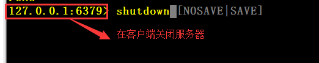

* 查看是否启动
  
* **ps -ef | grep redis** 
  
* 启动**客户端**命令
    * **redis-cli -h 127.0.0.1 -p 6379** 
        * -h：主机（IP 地址）
        * -p：端口号

* 退出客户端
  
* **exit / Ctrl + C** 
  
* 查看是否连接成功
  
    * **ping** 


## 四、基本操作

- 默认有 16 个数据库，初始默认使用 0 号数据库

- 切换数据库
    - **select  2**

- 密码统一管理，所有的数据库都是同一个密码

* 查询当前库中的键
    * **keys  *：查询所有的键（数据多的时候慎用）**
    * **keys  pattern**（匹配模式，类似于正则表达式）
* 判断某个键是否存在
    * **exists  key ** 
* 查看键的类型
    * **type  key** 
* 删除某个键
    * **del  key** 
* 为键设置过期时间，单位是秒
    * **expire  key   seconds（秒数）** 
* 查看还有多少时间过期，-1 表示永不过期，-2 表示已经过期
    * **ttl  key** 
* 查看当前数据库中键的数量
    * **dbsize** 
* 清空当前库
    * **Flushdb** 
* 清空所有库
    * **FlushAll** 
* 查看一个键对应的值对象的编码
    * **object encoding**
* 设置键的过期时间
    * **EXPIRE  key  ttl** 命令用于将键 **key** 的生存时间设置为 **ttl** 秒
    * **==P==EXPIRE  key  tll** 命令用于将键 **key** 的生存时间设置为 **ttl 毫秒**
    * **EXPIRE==AT==  key  timestamp** 命令用于将键 **key** 的过期时间设置为 **timestamp** 指定的**秒数时间戳**
    * **==P==EXPIRE==AT==  key  timestamp**  命令用于将键 **key** 的过期时间设置为 **timestamp**所指定的**毫秒数时间戳**
* 移除过期时间
    * **persist  key** 
* 返回剩余生存时间
    * **TTL  key**：秒为单位
    * **PTTL  key**：毫秒为单位
* 列出目前所有连接到服务器的普通客户端
    * **client  list** 


## 五、五大数据类型

### 1、String

* 介绍
    * String 是Redis 中最基本的类型，用的也最多，一个 key 对应一个 value
    * value 的值可以包含任何数据，比如 jpg 图片或者序列化的对象
    * 一个 Redis 中字符串 value 最多可以是 512M


* 操作
    * 添加键值对
        * set   key   value
    * **当添加的键不存在时才添加** 
        * **setnx   key   value** 
    * 查询键对应的值
        * **get   key** 
    * 追加数据
        * **append   key   value** 
    * 获得值的长度
        * **strlen  key** 
    * 将 key 中存储的数字的值加 1（默认）
        * **incr   key** 
        * 只能对数字操作
    * 将 key 中存储的数字的值加上自己指定的值
        * **incrby   key   值(10)** 
    * 将 key 中存储的数字的值减 1（默认）
        * **decr  key** 
    * 将 key 中存储的数字的值减去自己指定的值
        * **decrby   key   值(10)** 
    * 同时设置一个或多个键值对
        * **mset  key1  value1   key2  value2  ...** 
    * 同时获得多个键的值
        * **mget   key1   key2 ...** 
    * 仅当所给键不存在时，同时设置一个或多个键值对
        * **msetnx  key1  value1   key2  value2  ...** 
    * 获得键所对应的值的**范围** 
        * **getrange   key   start  end** 
    * 覆盖键所对应的部分值，从 start 开始
        * **setrange   key   start   value** 
    * 设置键值对的同时设置过期时间，单位为秒
        * **setex   key   过期时间   value** 
    * 设置新值的同时得到旧值
        * **getset   key   value（新值）** 


### 2、List

* 一个键对应一个 List（一个列表，多个值）

* 底层使用的是一个双向链表

操作

* **lpush / rpush  key  value1   value2 ...** 
    * 从左边 / 右边插入一个或多个值

* **lpop / rpop  key** 
    * 从左边 / 右边取出一个值
    * 键所对应的值没有了之后，键也就不存在了
* **rpoplpush   key1   key2** 
    * 从 key1 的右边取出一个值，插入到 key2 的左边
* **lrange   key   start  end** 
    * 按照索引下标获取元素（从左到右）
    * 从头到尾就是  lrange  key   0  -1
* **lindex   key  下标** 
    * 按照索引下标获取元素（从左到右）
* **llen   key** 
    * 获得列表长度
* **linsert  key  before / after  value  newValue** 
    * 在 value 之前 / 之后 插入  newVlaue
* **lrem  key   n   value** 
    * 从左到右删除  n  个 value
    * n 为正数表示从左往右删，n 为负数，表示从右往左删


### 3、Set

* Redis 的 set 是 string 类型的无序**集合** 
* 它底层其实是个 value 为 null 的 hash 表，所以添加，删除，查找的复杂度都是 O(1)
* Set 键值对的值中**不能有重复的数据** 


操作

* **sadd  key   value1   value2 ...** 
    * 将一个或多个元素添加到 key 对应的 set 集合中，重复的元素被忽略
* **smembers  key** 
    * 取出所有元素
* **sismember   key   value** 
    * 判断集合中是否包含该元素，没有就返回 0
* **scrad  key** 
    * 返回集合中元素个数
* **srem   key   value1   value2 ...** 
    * 删除集合中一个或多个元素
* **spop   key** 
    * 随机从集合中取出一个值，取出后集合中就没有该值了
* **srandmember   key   n** 
    * 随机从集合中取出  n  个值
    * 不会从集合中删除这些值

* **sinter   key1   key2** 
    * 返回两个集合的交集
* **sunion   key1  key2** 
    * 返回两个集合的并集
* **sdiff   key1  key2** 
    * 返回两个集合的差集


### 4、Hash

* 键所对应的值是一个 Hash，类似于 Java 中的 Map<String , String>

操作

* **hset  key   field   value**
    * 给  key  集合中的 field  键对应的值赋值
* **hget  key  field**
    * 取出  key  集合中的 field  键对应的值
* **hmset  key1  field1  value1  field2  value2**
    * 批量赋值
* **hexists   key   field**
    * 查看 key 集合中是否存在键 field  对应的值
* **hkeys  key**
    * 获得 key 集合中所有的键
* **hvals   key**
    * 获得 key 集合中所有键对应的值
* **hgetall   key**
    * 获得所有的键值对
* **hincrby  key   field   incrementValue**
    * 为 key 集合中 field 键对应的值加上元素  incrementValue
    * 操作对象为数字

* **hsetnx  key  field  value**
    * 将 key  集合中键 field 对应的值设置为 value
    * 当 field  不存在时生效


### 5、zset

* Redis有序集合 zset 与普通集合 set 非常相似，是一个**没有重复元素的字符串集合** 
* 不同之处是有序集的每个成员都关联了一个**评分**（ score），这个评分（ score）被用来按照从最低分到最高分的方式排序集合中的成员
* 集合的成员是唯一的，但是评分可以是重复的
* 因为**元素是有序的**，所以你也可以很快的**根据评分（ score）或者次序（ position）来获取一个范围的元素** 
* 访问有序集合的中间元素也是非常快的，因此你能够使用有序集合作为一个没有重复成员的智能列表


操作

* **zadd   key  score1  value1  score2  value2 ...**
    * 添加一个或多个元素
* **arange   key   start  end  [WITHSCORES]**
    * 返回下标在 [start，end] 之间的元素
    * 带 WITHSCORES  会将分数和值一起返回
* **zrangebyscore   key   ==min  max==  [withscores]  [limit  offset  count]**
    * 返回分数在 [min，max] 之间的所有元素
    * 值按 scores 的大小**递增**排列
* **zrevrangebyscores  key  ==max  min==  [withscores]  [limit  offset  count]**
    * 返回分数在 [min，max] 之间的所有元素
    * 值按 scores 的大小**递减**排列
* **zincrby   key   increment  value**
    * 为集合中 value 元素的 score 加上一个增量 increment
* **zrem   key   value**
    * 删除集合中指定的元素
* **zcount   key   min  max**
    * 统计集合中区间 [min，max] 内的元素个数
* **zrank   key   value**
    * 返回该值在集合中的排名，从 0 开始


## 六、Redis 配置文件

1、**include**

* 将主要的配置写在主配置文件中，将其他配置写在另一个文件中，然后通过 include 引入

2、**bind** 

* 绑定 IP 地址
* 默认情况下只允许本机访问，不写的话可以接受任何主机访问


3、**protected-mode** 

* 保护模式
    * **protected-mode  yes**：只允许本机访问，即使没有绑定 IP
    * **protected-mode  no**：允许任意主机访问


4、**tcp-backlog** 

* 可以理解为一个请求到达后至接受进程处理的一个队列
* **backlog** 队列总和 = 未完成三次握手队列 + 已经完成三次握手队列
* 高并发环境 **tcp-backlog** 设置值由超时时限内的 **Redis** 吞吐量决定


5、**timeout** 

* 一个空闲的客户端维持多长时间后会关闭，0 表示永不关闭


6、**TCP keepalive** 

* 对客户端的一种心跳检测，每 n 秒检测一次
    * 其实就是检测客户端是否断开连接
* 官方推荐 60 秒检测一次


7、**daemonize** 

* 是否设置为后台进程


8、**pidfile** 

* 设置存放 pid 文件的位置，每个实例会产生一个不同的 pid  文件


9、**loglevel** 

* 日志级别，有四个，根据使用阶段来选择
    * dubug、verbose、notice、warning（级别依次递增）


10、**logfile** 

* 日志文件名称


11、**syslog** 

* 是否将 Redis 日志输出到 Linux 系统日志服务中


12、**syslog-ident** 

* 日志的标志


13、**syslog-facility** 

* 日志输出设备


14、**database** 

* 数据库数量，默认是 16 个


15、**requirepass** 

* 设置密码
    * 在 Redis 命令行中设置的密码是临时密码，重启就会消失
        * 设置密码：config  set  requirepass  “密码”
        * 得到密码：config  get  requirepass
        * 登录：auth  “密码”
    * 在配置文件中设置的密码是永久密码

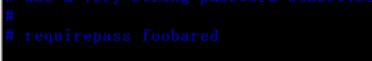


16、**maxclient** 

* 最大客户端连接数


17、**maxmemory** 

* 设置 Redis 可以使用的内存量
* 一旦到达内存使用上限， Redis 将会试图移除内部数据，移除规则可以通过 **maxmemory- policy** 来指定
    * **maxmemory- policy** 
        * volatile-lru：使用 LRU（最近最少使用）移除算法，**只对设置了过期时间的键** 
        * allkeys-lru：使用 LRU 算法移除 key（所有键）
        * volatile-random：在过期集合中移除随机的 key，**只对设置了过期时间的键** 
        *  allkeys- random：移除随机的 key（所有键）
        * volatile-ttI（即将过期）：移除那些 **TTL 值**最小的key，即那些最近要过期的 key
        * noeviction：不进行移除。**针对写操作**，只是返回错误信息
* 如果 Redis 无法根据移除规则来移除内存中的数据，或者设置了 “不允许移除“ 那么 Redis 则会针对那些需要申请内存的指令返回错误信息，比如 SET、 LPUSH 等


18、**Maxmemory-samples** 

* 设置样本数量，LRU 算法和最小 TTL 算法都并非是精确的算法，而是**估算值**，所以你可以设置样本的大小
* 一般设置 3 到 7 的数字，数值越小样本越不准确，但是性能消耗也越小


## 七、Java 连接 Redis

### 1、准备

1、关闭 Linux 的防火墙

* **systemctl stop fire==walld==.service** 

2、关闭 redis 保护模式，在 redis.conf文件中，修改 protected 为 no

* **protected-mode no** 

3、注释掉redis的ip地址绑定，还是在redis.conf中，将bind:127.0.0.1注释掉

* **bind:127.0.0.1** 

4、导入 **jedis** 依赖


### 2、连接

```java
public class redisTest {
    public static void main(String[] args) {
        Jedis jedis = new Jedis("192.168.137.128", 6379);

        // 测试链接是否成功
        String result = jedis.ping();
        System.out.println(result);

        // 设置一个键值对
//        jedis.set("a","tfc");

        // 获取一个值
//        String value=jedis.get("a");
//        System.out.println(value);

        jedis.close();
    }
}
```


## 八、Redis 事务

### 1、简介

* Redis 事务是一个单独的隔离操作
* 事务中的所有命令都会序列化按顺序地执行
* 事务在执行的过程中，不会被其他客户端发送来的命令请求所打断
* Redis 事务的**主要作用就是串联多个命令防止别的命令插队** 


### 2、相关命令

1、**Multi** 

* 输入 **Mulit**  后，接着输入的命令都会依次进入命令队列中，但不会执行（组队阶段）

2、**Exec** 

* 输入  **Exec**  后，命令队列中的命令都会依次开始执行

3、**discard** 

* 进入命令队列后可以通过  **discard**  放弃进入队列（取消事务）

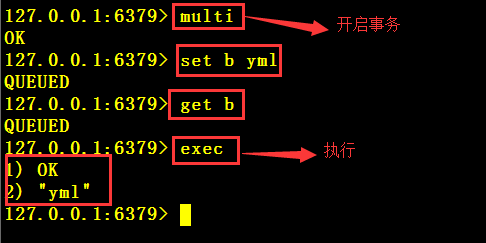

4、**WATCH   key1  key2 ...** 

* 在执行 **Multi** 前先对键进行监视，如果在事务执行之前该键对应的数据被其他命令（可能有多个客户端）所改动，则事务中断

5、**unwatch** 

* 取消 **WATCH** 命令对所有 **key** 的监视
* 如果在执行 **WATCH** 命令之后，**exec** 命令或 **discard** 命令先被执行了的话，那么就不需要再执行 **unwatch** 了

### 3、错误处理

* 组队阶段（**Mulit 阶段**）中某个命令出现了报告错误，执行时整个的所有队列会都会被取消

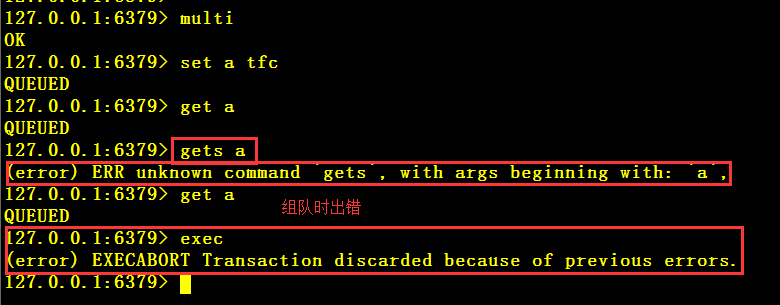

* 如果执行阶段某个命令出现错误，则只有错误的命令不会被执行，其他命令照常进行，不会回滚

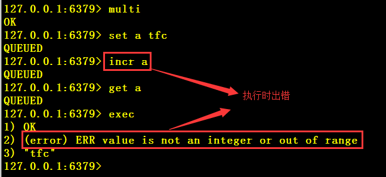


### 4、Redis 事务的特性

1、**单独的隔离操作** 

* 事务中的所有命令都会序列化、按顺序地执行
* 事务在执行的过程中，不会被其他客户端发送来的命令请求所打断

2、**没有隔离级别的概念** 

* 队列中的命令没有提交之前都不会实际的被执行
* 因为事务提交前任何指令都不会被实际执行，也就不存在 **“事务内的查询要看到事务里的更新，在事务外的查询不能看到”** 这个让人万分头痛的问题

3、**不保证原子性** 

* **Redis** 同一个事务中如果有一条命令执行失败，其后的命令仍然会被执行，没有回滚


## 九、持久化

### 1、RDB

* 在**指定的时间间隔内**将内存中的数据集快照写入磁盘
* 也就是行话讲的 **Snapsho** 快照，它恢复时是将快照文件直接读到内存里


过程

* **Redis** 会单独创建（fork）一个子进程来进行持久化
    * 在 **Linux** 程序中，**fork()** 会产生一个和父进程完全相同的子进程，但子进程在此后多会执行 **exec** 系统调用
    * 出于效率考虑， **Linux** 中引入了 “写时复制技术”，**一般情况父进程和子进程会共用同一段物理内存**，只有进程空间的各段的内容要发生变化时才会将父进程的内容复制一份给子进程
* 会先将数据写入到一个临时文件中，待持久化过程都结束了，再用这个临时文件替换上次的持久化文件
    * 整个过程中，主进程是不进行任何 **I/O** 操作的，这就确保了极高的性能
    * 如果需要进行大规模数据的恢复，且对于**数据恢复的完整性**不是非常敏感，那 RDB 方式要比 AOF 方式更加的高效
* RDB 的缺点是**最后一次持久化后的数据可能丢失** 


* 持久化默认文件名：dump.rdb

    * 修改方式

    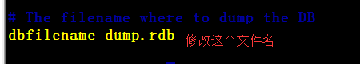

* 默认位置：跟配置文件在同一级目录

    * 修改方式

    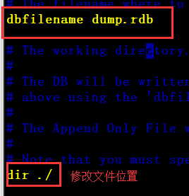


* 持久化保存策略

> save seconds  changes   在 seconds 秒内发生 changes 次数据库操作就进行持久化
> save  900       1       在 900 秒内发生 1 次数据库操作就进行持久化
> save  300      10
> save  60      1000
> 注意：这里的操作是**修改数据，获取数据不算** 


* **==什么时候进行持久化操作==** 
    1. 满足持久化策略
    2. **正常关闭** 


* **rdb** 的恢复
    * 将文件拷贝到工作目录下（配置文件位置），**启动 Redis，备份数据会直接加载** 


### 2、AOF

* 以日志的形式记录每个**==写操作==** 
    * 将 Redis 执行过的所有**写指令**记录下来（读操作不记录）
    * **只许追加**文件但不可以改写文件
    * **Redis** 启动之初会读取该文件重新构建数据，换言之， Redis 重启的话就根据日志文件的内容将写指令从前到后执行一次以完成数据的恢复工作


* AOF 默认不开启，需要在配置文件中手动开启

    * 将 **appendonly** 改为 **yes** 

    

    * 可以配置文件名，默认是 **appendonly.aof** 

    

    * 位置：与启动配置文件在同一目录下

        


注意

* **==RDB 和 AOF 同时开启时启用的是 AOF==** 


### 3、AOF 同步频率

* 每秒同步一次，也就是每秒就记入日志一次，如果宕机，本秒的数据可能丢失

### 4、Rewrite

* **AOF** 采用文件追加方式，文件会越来越大
* 当 **AOF** 文件的大小超过所设定的阈值时， **Redis** 就会启动 **AOF** 文件的内容压缩，**只保留可以恢复数据的最小指令集** 
    * 例如：set  a  b、set  a   c、set a  tfc 就会只保留 set  a   tfc
* 可以使用命令 **bgrewriteaof** 


**实现**

* **AOF** 文件持续增长而过大时，会 **fork** 出一条新进程来将文件重写
    * 也是先写临时文件最后再 **rename** 
* 遍历新进程的内存中数据，每条记录有一条的 **Set** 语句
* 重写 **aof** 件的操作，并没有读取旧的 **aof** 文件，而是将整个内存中的数据库内容用命令的方式重写了一个新的 aof 文件，这点和快照有点类似


何时重写

* 重写虽然可以节约大量磁盘空间，减少恢复时间。但是每次重写还是有一定的负担的，**Redis 要满足一定条件才会进行重写** 

> 配置文件中修改
> auto-aof-rewrite-percentage 100
> auto-aof-rewrite-min-size 64mb

* 系统载入时或者上次重写完毕时，Redis 会记录此时 AOF 大小，设为 base_size
* 如果 Redis 的 AOF 当前大小 >= base_size  + base size*100%（默认）且当前大小 64mb（默认）的情况下 Redis 会对 AOF 进行重写


**AOF 优点**

* 备份机制更稳健，丢失数据概率更低
* 可读的日志文本，通过操作 **AOF** 文件，可以处理误操作

**AOF 缺点**

* 比起 **RDB** 占用更多的磁盘空间
* 恢复备份速度要慢
* 每次读写都同步的话，有一定的性能压力
* 存在个别 **Bug**，造成不能恢复


## 十、主从复制

什么是主从复制

* 主从复制，就是主机数据更新后根据配置和策略，自动同步到从机的 **master / slaver 机制**，Master以写为主， Slave 以读为主

用处

* 读写分离，扩展性能
* 容灾快速恢复

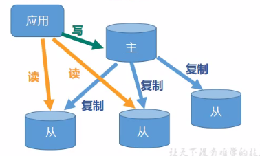


### 1、配置

* 原则：**配从不配主** 


准备

1、拷贝多个 **redis.conf** 文件然后再**主配置文件**中引入进来（include）

* include   /root/tfc/redisCopy.conf（文件路径）

2、开启 **daemonize yes** （主配置文件配了就不需要再配了）

*  后台启动

3、Pid 文件名字 pidfile（可选）

* pidfile  文件路径

4、指定端口 port

5、 Log 文件名字

6、Dump.rdb 名字 dbfilename

7、 Appendonly 关掉或者换名字（AOF）

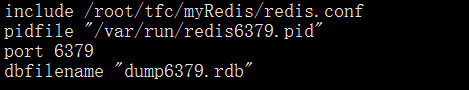


相关命令

1、**info replication** （Redis 客户端命令）

* 打印主从复制的相关信息

2、**slaverof  主服务器IP   主服务器 port** （Redis 客户端命令）

* 成为某个实例的从服务器

* 注意：**这种方式是临时的**，关闭连接后就没有了，永久配置需要在配置文件中进行
  
  ```
  在配置文件中配置一下内容
  slaveof  masterIP  masterPort
  例如：slaveof  192.168.137.128  6379
  ```

3、**slaveof no one** （Redis 客户端命令）

* 不做任何一台主服务器的从服务器


要点

1、从成为从服务器的时候开始进行复制，主服务器之前的数据并不能复制到从服务器上

2、主服务器负责写，从服务器负责读，从服务器也不能进行写操作

3、主服务器宕机后，从服务器原地等待主服务器的连接

4、主服务器重新连接后能继续进行复制


### 2、复制原理

步骤

1、每次从机联通后，都会给主机发送 **sync** 指令

2、主机立刻进行存盘操作，**发送 RDB 文件** 

3、从机从机收到 **RDB** 文件后，进行全盘加载

4、之后每次主机的写操作，都会立刻发送给从机，从机执行相同的命令


### 3、哨兵模式

* 能够后台监控主机是否故障，如果故障了根据投票数自动将从服务器转换为主服务器

配置

1、在自定义的 /myRedis 目录下新建  **sentinel.conf** 文件

2、在文件中配置内容

```
sentinel monitor mymaster 127.0.0.1 6379 1
mymaster：为监控对象起的服务器名称（任意的）
1：至少有几个哨兵认为你的主服务器宕机才算宕机
```


3、启动哨兵

* **redis-sentinel**  配置文件


步骤

1、从下线的主服务的所有从服务里面挑选一个从服务，将其转成主服务器，**选择条件依次为下列顺序** 

* 选择优先级靠前的
    * 优先级在 redis.conf 中的 slave-priority 100
    * 数越小，优先级越高
* 选择偏移量最大的
    * 偏移量是指获得原主数据最多的
* 选择 **runid** 最小的从服务
    * 每个 **redis** 实例启动后都会随机生成一个 40 位的 **runid** 

2、挑选出新的主服务之后 **sentinel** 向原主服务的从服务发送 **slaveof** 新主服务的命令，复制新 **master** 

3、当已下线的服务重新上线时， **sentinel** 会向其发送 **slaveof** 命令让其成为新主的从服务器


## 十一、Redis 集群

### 1、问题

* 容量不够（内存），Redis 如何进行扩容？
* 并发写操作，Redis 如何分摊？


什么是 Redis 集群

* Redis集群实现了对 Redis 的**==水平扩容==**
    * 即启动 N个 redis 节点，将整个数据库分布存储在这N个节点中，**每个节点存储总数据的 1/N**
* Redis集群通过分区（ partition）来提供一定程度的可用性
    * 即使集群中有一部分节点失效或者无法进行通讯，集群也可以继续处理命令请求


### 2、安装环境

* **yum  install  ruby** 
* **yum  install  rubygems** 


### 3、编辑配置文件

1、复制多个配置文件，跟主从复制一样的操作

2、**cluster-enabled  yes** 

* 打开集群模式

3、**cluster-config-file  nodes-6379.conf** 

* 设定节点配置文件名

4、**cluster-node-timeout 15000**

* 设定节点失联时间，超过该时间（毫秒），集群自动进行主从切换


### 4、配置集群

1、将多个节点合成一个集群

* 组合之前，确保所有 **Redis** 实例启动后，**nodes-xxx.conf** 文件都正常生成

2、进入 **redis 目录下的 src 目录**，执行下列命令

* **redis-cli --cluster create** 192.168.137.128:6379... **--cluster-replicas 1** 
    * 有几个节点就写几个对应的 IP 和 Port
    * 不要写 127.0.0.1，要用**真实 IP 地址** 
    * **--cluster-replicas 1**：表示为每个主节点创建一个从节点

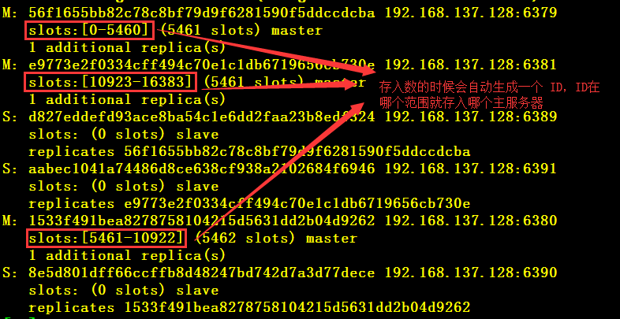


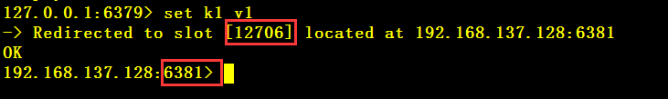

3、以集群的方式进入客户端

* **redis-cli  -c  -p  端口号**
    * **-c**：表示 **cluster（集群）** 


### 5、相关命令

1、**cluster  nodes**

* 查看集群信息

2、**CLUSTER  KEYSLOT  key**

* 计算 key  应该放在哪个插槽上

3、**CLUSTER COUNTKEYSINSLOT   slot**

* 返回插槽中包含多少个键值对

4、**CLUSTER GETKEYSINSLOT  slot   count** 

* 返回 count 个 slot 槽中的键


### 6、注意

1、添加数据、获取数据都会重定向到 ID 对应的主服务器

2、一个集群至少要有三个主节点

3、分配原则

* 尽量保证每个**主数据库运行在不同的P地址** 
* 每个**从库和主库不在一个 IP 地址上** 

4、**slots**（插槽）

* 数据存放位置
* 一个 **Redis** 集群包含 **16384** 个插槽
    * 数据库中的每个键都属于这 **16384** 个插槽的其中一个
    * 集群使用公式 **CRC16(key) % 16384** 来计算键 **key** 属于哪个槽
        * 其中 **CRC16（key）**语句用于计算键 **key** 的 **CRC16** 校验和

5、往集群中添加值

* 使用 **redis-cli** 登录客户端
    * 每次录入、查询键值， redis都会计算出该 key 应该送往的插槽，如果不是该客户端对应服务器的插槽， redis会报错，并告知应前往的 redis 实例地址和端口
* 使用 **redis-cli  -==c==** 登录客户端
    * **-c**：表示一个集群
    * 这样登录会自动重定向，不会报错

* 不在一个 **slot** 下的键值，是不能使用 **mget**, **mset** 等多键操作
    * **可以通过 { } 来定义组的概念，从而使 key 中 { } 内相同内容的键值对放到一个服务器中去** 
        * set   a{tfc}  v1   、  set  b{tfc}  v2    、  set   c{tfc}   v3
        * 表示 a、b、c 都是属于 tfc 这个组，都在同一个服务器中

6、**redis.conf** 中有个参数叫 **cluster-require-full-coverage  yes** 

* 表示所有插槽都能用的时候才能对外提供服务


### 7、优缺点

1、优点

* 实现扩容
* 分摊压力
* 无中心配置相对简单

2、缺点

* 多键操作是不被支持的
* 多键的 Redis事务是不被支持的
* lua脚本不被支持
* 由于集群方案出现较晚，很多公司已经采用了其他的集群方案，而代理或者客户端分片的方案想要迁移至 redis cluster，需要整体迁移而不是逐步过渡，复杂度较大


