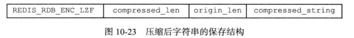
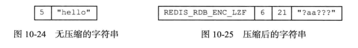

# 单机数据库的实现

## 一、数据库

### 1、服务器中的数据库

Redis 服务器将**所有数据库**都保存在**服务器状态**  **redis.h / redisServer** 结构的 **db** 数组中，**db** 数组的每个项都是一个 **redis.h / redisDb** 结构，每个 **redisDb** 结构代表一个数据库

```c++
struct redisServer{
    ...
    // 一个数组，保存着服务器中的所有数据库
    redisDb *db;
    // 服务器的数据库数量
    int dbnum;
    ...
}
```

* 在初始化服务器时，程序会根据服务器状态的 **donum** 属性来决定应该创建多少个数据库
    * **donum** 属性的值由服务器配置的 **database 选项**决定
    * 默认情况下，该选项的值为 16


### 2、切换数据库

* 默认情况下， **Redis** 客户端的目标数据库为 0 号数据库，但客户端可以通过执行 **SELECT 命令**来切换目标数据库

在服务器内部，客户端状态 **redisClient 结构**的 **db 属性**记录了客户端当前的目标数据库，这个属性是一个指向 **redisDb** 结构的指针

```c++
typedef struct redisClient{
    ...
    // 记录客户端当前正在使用的数据库
    redisDb *db；
    ...
}redisclient;
```


**==注意==**

* 到目前为止，Redis 仍然**没有可以返回客户端目标数据库的命令** 
* 为了避免对数据库进行误操作，在执行 Redis命令特别是像 **FLUSHDB** 这样的危险命令之前，**最好先执行一个 SELECT 命令，==显式地切换到指定的数据库==，然后才执行别的命令**


### 3、数据库键空间

Redis 是一个**键值对（key- value pair）数据库服务器**，服务器中的每个数据库都由一个 **redis.h / redisDb** 结构表示，其中， **redisDb** 结构的 **dict 字典**保存了数据库中的所有键值对，**我们将这个字典称为==键空间==**

```c++
typedef struct redisDb{
    ...
    // 数据库键空间，保存着数据库中的所有键值对
    dict *dict;
    ...
}
```

举个例子


#### 3.1 添加键

* 添加一个新键值对到数据库，实际上**就是将一个新键值对添加到键空间字典里面**，其中键为字符串对象，面值则为仟意一种类型的 **Redis** 对象


#### 3.2 删除键

* 删除数据库中的一个键，实际上就是在键空间里面删除键所对应的键值对对象


#### 3.3 更新键

* 对一个数据库键进行更新，实际上就是对键空间里面键所对应的值对象进行更新
* 根据值对象的类型不同，更新的具体方法也会有所不同。


#### 3.4 对键取值

* 对一个数据库键进行取值，实际上就是在键空间中取出键所对应的值对象
* 根据值对象的类型不同，具体的取值方法也会有所不同。


#### 3.5 读写键时的维护操作

1. 在读取一个键之后（读操作和写操作都要对键进行读取），服务器会**根据键是否存在**来更新服务器的键空间**命中次数**或键空间**不命中次数**，这两个值可以在 **INFO stats 命令**的 **keyspace_hits** 属性和 **keyspace_misses** 属性中查看
2. 在读取一个键之后，服务器会更新键的 **LRU（最后一次使用）时间**
    * 使用 **OBJECT idletime key 命令**可以查看键 **key** 的闲置时间
3. 如果服务器在读取一个键时发现已经过期，那么服务器会先删除这个过期键，然后才执行余下的其他操作
4. 如果有客户端使用 **WATCH 命令**监视了某个键，那么服务器在对被监视的键进行修改之后，**会将这个键标记为脏（ dirty）**，从而让事务程序注意到这个键已经被修改过
5. 如果服务器开启了数据库**通知功能**，那么在对键进行修改之后，服务器将按配置发送相应的数据库通知


### 4、设置键的过期时间

Reds **有四个不同的命令可以用于设置键的生存时间（键可以存在多久）或过期时间（键什么时候会被删除）**

* **EXPIRE  key  ttl** 命令用于将键 **key** 的生存时间设置为 **ttl** 秒
* **==P==EXPIRE  key  tll** 命令用于将键 **key** 的生存时间设置为 **ttl 毫秒**
* **EXPIRE==AT==  key  timestamp** 命令用于将键 **key** 的过期时间设置为 **timestamp** 指定的**秒数时间戳**
* **==P==EXPIRE==AT==  key  timestamp**  命令用于将键 **key** 的过期时间设置为 **timestamp**所指定的**毫秒数时间戳**

**==注意==**

* 实际上 **EPIRE、PEXPIRE、EXPIREAT** 三个命令都是使用 **==PEXPIREAT==** 命令来实现的
* 无论客户端执行的是以上四个命令中的哪个，**经过转换之后**、最终的热行效果都和热行 **PEXPIREAT** 命令一样
* 都可以转换成毫秒或毫秒时间戳


#### 4.1 保存过期时间

**redisDb 结构**的 **expires 字典**保存了数据库中**所有键的过期时间**，我们称这个字典为**过期字典**

* 过期字典的**键是一个指针**，这个指针**指向键空间中的某个键对象**
* 过期字典的**值是一个 long long类型的整数**
    * 这个整数保存了**键所指向的数据库键的过期时间**：**—个毫秒精度的 UNIX 时间戳**

```c++
typedef struct redisDb{
    ...
    // 数据库键空间，保存着数据库中的所有键值对
    dict *dict;
    // 过期字典，保存着键的过期时间
    dict *expires;
    ...
}
```


### 5、过期键的删除

1、定时删除

* 在设置键的过期时间的同时，创建一个定时器，让定时器在键的过期时间来临时，立即执行对键的删除操作
* 优点：节约内存
* 缺点：消耗 CPU

2、惰性删除

* 放任键过期不管，但是每次从键空间中获取键时会检查键是否过期，如果过期的话，就删除该键；如果没有过期，就返回该键
* 优点：CPU 消耗小
* 缺点：占内存

3、定期删除

* 每隔一段时间，程序就对数据库进行一次检查，删除里面的过期键。至于要删除多少过期键，以及要检查多少个数据库，则由算法决定
* 难点
    * 如果删除操作执行得太频繁，或者执行的时间太长，**定期删除策略就会退化成定时删除策略**，以至于将CPU时间过多地消耗在删除过期键上面
    * 如果删除操作执行得太少，或者执行的时间太短，定期删除策略又会和惰性删除策略一样，出现浪费内存的情况


* Redis 服务器实际使用的是**惰性删除**和**定期删除**两种策略结合


### 6、RDB 对过期键的处理

1. 在执行 **SAVE** 命令或者 **BGSAVE** 命令创建一个新的 **RDB** 文件时，**程序会对数据库中的键进行检查，已过期的键不会被保存到新创建的 RDB 文件中**
2. 在启动 Redis 服务器时，如果服务器开启了**RDB** 功能，那么服务器将对 **RDB **文件进行载入
    * 如果服务器以**==主服务器==**模式运行，那么在载人**RDB** 文件时，程序会对文件中保存的键进行检査，未过期的键会被载入到数据库中，而过期键则会被忽略
    * 如果服务器以**==从服务器==**模式运行，那么在载入 **RDB** 文件时，**文件中保存的所有键不论是否过期，都会被载入到数据库中**。不过，因为主从服务器在进行数据同步的时候，从服务器的数据库就会被清空，所以一般来讲，过期键对载入RDB 文件的从服务器也不会造成影响


### 7、AOF 对过期键的处理

当服务器以 AO F持久化模式运行时，如果数据库中的某个键已经过期，但它还没有被惰性删除或者定期删除，那么 AOF 文件不会因为这个过期键而产生任何影响

当过期键被惰性删除或者定期删除之后，程序会向 AOF 文件追加（ append）一条 DEL 命令，来显式地记录该键已被删除


**AOF 重写**

* 和生成 **RDB** 文件时类似，在执行 **AOF 重写**的过程中，程序会对数据库中的键进行检查，已过期的键不会被保存到重写后的 **AOF** 文件中


### 8、复制对过期键的处理

当服务器运行在复制模式下时，**从服务器**的过期键删除动作由**主服务器**控制

* 主服务器在删除一个过期键之后，会显式地向所有从服务器发送一个DEL命令，知从服务器删除这个过期键
* 从服务器在执行客户端发送的读命令时，即使碰到过期键也不会将过期键删除，而是是继续像处理未过期的键一样来处理过期键
* 从服务器只有在接到主服务器发来的 **DEL** 命令之后，才会删除过期键


## 二、RDB 持久化

因为 Redis 是**内存数据库**，它将自己的数据库状态**储存在内存里面**，一旦服务器进程退出，服务器中的数据库状态也会消失不见

Redis提供了RDB持久化功能，这个功能可以将 Redis在内存中的数据库状态**保存到磁盘里面**，避免数据意外丢

**服务器启动的时候会载入 RDB 文件恢复数据**


### 1、RDB 文件的创建与载入

有两个 Redis 命令可以用于生成 **RDB** 文件

* **save**
    * **SAVE** 命令会**阻塞 Redis 服务器进程**，直到 RDB 文件创建完毕为止
    * 在服务器进程阻塞期间、服务器不能处理任何命令请求
* bgsave
    * **BGSAVE** 命令会**派生出一个子进程，然后由子进程负责创建 RDB 文件**
    * 服务器进程（父进程）继续处理命令请求

**RDB** 文件的载入

* **RDB** 文件的载入工作是在**服务器后动时自动执行的**
* 如果服务器开启了 **AOF** 持久化功能，那么服务器会**优先使用 AOF 文件来还原数据**


### 2、三个命令的比较

**BGREWRITEAOF 和 BGSAVE** 两个命令的实际工作都由子进程执行

* BGSAVE 命令执行期间，**客户端发送的 SAVE 命令会被服务器拒绝**
* BGSAVE命令执行期间，**客户端发送的 BGSAVE命令会被服务器拒绝**
* **BGREWRITEAOF** 和 **BGSAVE** 两个命令**不能同时执行**
    * 如果 **BGSAVE**命令正在执行，那么客户端发送的 **BGREWRIEAOF** 命令会**被延迟到BGSAVE命令执行完毕之后执行**
    * 如果 **BGREWRITEAOF** 命令正在执行，那么**客户端发送的 BGSAVE 命令会被服务器拒绝**


### 3、自动保存

因为 **BGSAVE** 命令可以在不阻塞服务器进程的情况下执行，所以 Redis **允许用户通过设置服务器配置的save选项，让服务器每隔一段时间自动执行一次 BGSAVE 命令**

用户可以通过 **save** 选项**设置多个保存条件**，但只要其中任意一个条件满足即可执行 **save** 命令

```c++
举个例子
save 900 1      // 服务器在900秒之内，对数据库进行了至少1次修改
save 300 10     // 服务器在300秒之内，对数据库进行了至少10次修改
save 60 10000   // 服务器在60秒之内，对数据库进行了至少10000次修改
```

服务器程序会根据 **save** 选项所设置的保在条件，设置服务器状态 **redisServer** 结构的 **saveparams 属性**

**saveparams** 属性是一个数组，数组中的**每个元素都是 saveparam 结构**，每个 **saveparam** 结构都保存了一个save 选项设置的保存条件

```c++
struct redisServer{
    ...
    // 一个数组，保存着服务器中的所有数据库
    redisDb *db;
    // 服务器的数据库数量
    int dbnum;
    // 记录了保存条件的数组
    struct saveparam *saveparams;
    ...
}
```

```c++
struct saveparam{
	//秒数
    time_t seconds;
    // 修改数
    int changes;
}
```


除了 **saveparams** 数组之外，服务器状态还维持着一个 **dirty** 计数器，以及一个 **lastsave** 属性

* **dirty**
    * 记录距离**上一次成功执行 SAVE 命令或者 BGSAVE 命令之后**，服务器对数据库状态进行了多少次修改
* **lastsave**
    * **lastsave** 属性是一个 **UNIX** 时间戳，记录了服务器上一次成功执行 **SAVE** 命令或者 **BGSAVE** 命令的时间

```c++
struct redisServer{
    ...
    // 一个数组，保存着服务器中的所有数据库
    redisDb *db;
    // 服务器的数据库数量
    int dbnum;
    // 记录了保存条件的数组
    struct saveparam *saveparams;
    // 修改计数器
    long long dirty;
    // 上一次执行保存的时间
    time_t lastsave;
    ...
}
```


Redis 服务器固期性操作函数 **serverCron** 默认**每隔100毫秒就会执行一次**，该函数用于对正在运行的服务器进行维护，它的其中一项工作就是检査 save 选项所设置的保存条件是否已经满足，如果满足的话，就执行 BGSAVE 命令。


### 4、RDB 文件结构


* **RDB 文件**的最开头是 **REDIS** 部分，这个部分的长度为 5 字节，**保存着 "REDIS" 五个字符**
    * 通过这五个字符，程序可以在载入文件时，**快速检査所载入的文件是否 RDB 文件**

* **db_version** 长度为 4 字节，它的值是一个字符串表示的整数
    * 这个整数**记录了 RDB 文件的版本号**

* **databases** 部分包含着零个或仼意多个数据库，以及各个数据库中的键值对数据
* **EOF 常量**的长度为 1 字节，这个常量**标志着 RDB 文件正文内容的结束**

* **check_sum** 是一个 8 字节长的无符号整数，**保存着一个校验和**


#### 4.1 databases

一个 **RDB** 文件的 **databases** 部分可以保在任意多个非空数据库


**==数据库在 RDB 中的结构==**


* **SELECTDB**
    * 常量，一个字节，当程序读到这个的时候就知道**接下来读取的是一个数据库号码**

* **db_number**
    * 保存着数据库的号码
    * 当程序读入 **db_number** 部分之后，服务器会调用 **SElECT 命令**

* **key_value_pairs**
    * 保存了数据库的所有键值对


完整的 RDB 文件示例


#### 4.2 key_value_pairs

**RDB 文件**中的每个 **key_value_pairs** 部分都**保存了一个或以上数量的键值对**

* **不带过期值**的键值对结构


* **带过期值**的键值对结构


* **TYPE**

    * 记录了 **value** 的类型，长度为 1 字节，值可以是以下常量的其中一个

    ```c++
    REDIS_RDB_TYPE_STRING 
    REDIS_RDB_TYPE_LIST 
    REDIS_RDB_TYPE_SET 
    REDIS_RDB_TYPE_ZSET 
    REDIS_RDB_TYPE_HASH 
    REDIS_RDB_TYPE_LIST_ZIPLIST 
    REDIS_RDB_TYPE_SET_INTSET 
    REDIS_RDB_TYPE_ZSET_ZIPLIST 
    REDIS_RDB_TYPE_HASH_ZIPLIST
    ```

* **key**
  
    * key 总是一个字符串对象（键）
* **value**
  
* 值（五大对象）
  
* **EXPIRETIME_MS**
  
    * 长度为 1 字节，它告知读入程序，接下来要读入的将是一个**以毫秒为单位**的过期时间
* **ms**
  
    * 一个 8 字节长的**带符号整数**，**记录着一个以毫秒为单位的 UNIX 时间戳**


#### 4.3 value 的编码

**RDB 文件**中的每个 **value** 部分都保存了一个值对象，每个值对象的类型都由与之对应的 **TYPE** 记录，根据类型的不同， **value** 部分的结构、长度也会有所不同

##### 4.3.1 字符串对象

如果 **TYPE** 的值为 **REDIS_RDB_TYPE_==STRING==**，那么 **value** 保存的就是一个字符串对象，**字符串对象的编码**可以是 **REDIS_ENCODING_INT** 或者 **REDIS_ENCODING_RAW**

* **REDIS_ENCODING_INT**
    * 对象中保存的是长度不超过 32 位的**整数**


* **REDIS_ENCODING_RAW**

    * 对象所保存的是一个字符串值

        * 如果字符串的长度**小于等于 20 字节**，那么这个字符串会直接被原样保存

            

        * 如果字符串的长度**大于 20 字节**，那么这个字符串会被**压缩**之后再保存

            * 需要开启 RDB 压缩功能（redis.conf 文件中关于 rdbcompression 选项）

            

            * **REDIS_RDB_ENC**
                * 标志着字符串已经被 LZF 算法压缩过了
                * 读入程序在碰到这个常量时，会根据之后的 **compressed_len、origin_len、compressed_string** 三部分进行解压
            * **compressed_len**
                * 压缩后的长度
            * **origin_len**
                * 压缩之前的长度
            * **compressed_string**
                * 压缩之后的字符串

            

##### 4.3.2 列表对象

* 如果 **TYPE** 的值为 **REDIS_ RDB_TYPE**，那么 **value** 保存的就是一个 **REDIS_ENCODING_LINKEDLIST** 编码的**列表对象**


* 每个列表项都是一个**字符串对象**，所以程序会以处理字符串对象的方式来保存和读入列表项

    
    * 结构中的第一个数字 3 是列表的长度
    * 第一个列表项的长度为  5，内容为字符串 "he11o"
    * 第二个列表项的长度也为 5，内容为字符串 "wor1d"
    * 第三个列表项的长度为 1，内容为字符串 "！"


##### 4.3.3 集合对象

* 如果 **TYPE** 的值为 **REDIS_RDB_TYPE_SET**，那么 **value** 保存的就是一个 **REDIS_ENCODING_HT** 编码的集合对象


* **set_size** 保存的是元素个数，元素都是字符串


##### 4.3.4 哈希对象

如果 **TYPE** 的值为 **REDIS_RDB_TYPE_HASH** 那么 **value** 保存的就是一个 **REDIS_ENCODING_HT** 编码的集合对象


##### 4.3.5 有序集合对象

* 如果 **TYPE** 的值为 **REDIS_RDB_TYPE_ZSET** 那么 **value** 保存的就是一个 **RED_ENCODING_SKIPLIST** 理编码的有序集合对象


##### 4.3.6 INTSET 编码集合

如果 **TYPE** 的值为 **REDIS_ RDB_TYPE_SET_INTSER**，那么**value** 保存的就是一个**整数集合对象**

* RDB 文件保存这种对象的方法是
    * 先将整数集合转换为字符串对象，然后将这个字符串对象保存到RDB文件里面
    * 如果程序在读入RDB文件的过程中，碰到由整数集合对象转换成的字符串对象，那么程序会根据 TYPE 值的指示，先读入字符串对象，再将这个字符串对象转换成原来的整数集合对象


##### 4.3.7 ZIP 编码的列表、哈希、有序集合

如果 **TYPE** 的值为 **REDIS_RDB_TYPE___==LIST_ZIPLIST==、REDIS_RDB_TYPE__==ZSET_ZIPLIST== 、REDIS_RDB_TYPE_==HASH_ZIPLIST==**，那么 value 保存的就是一个压缩列对象

* RDB文件保存这种对象的方法是
    * 将压缩列表转换成一个字符串对象
    * 将转换所得的**字符串对象保存到 RDB 文件**

* 读入字符串对象时，根据 **TYPE**，并将它转换成原来的压缩列表对象


### 5、分析 RDB 文件

用 **od** 命令来分析 Redis 服务器产生的 RDB 文件，该命令可以用给定的格式转存并打印输人文件

* **od  -c  文件名**：以 **ASCII** 打印文件内容
* **od  -x  文件名**：以十六进制打印文件内容


#### 5.1 不包含键值对


根据 **RDB** 文件的结构可以得出

* 开头是 **REDIS** 字符串
* **0006** 是版本号
* **337** 代表 EOF 常量
* 最后的八个字节代表校验和

没有数据就没有 **database** 部分

#### 

包含键值对、包含过期值的键值对分析方法一样


## 三、AOF 持久化

* **AOF 持久化**是通过**==保存 Redis 服务器所执行的写命令==**来记录数据库状态的


### 1、AOF 持久化的实现

**AOF** 持久化功能的实现可以分为三个步骤

* 命令追加（ append）

    * 服务器在执行完一个写命令之后，会将被执行的写命令追加到服务器状态的 **aof_buf 缓冲区**的末尾

        ```c++
        struct redisServer{
            ...
            // 一个数组，保存着服务器中的所有数据库
            redisDb *db;
            // 服务器的数据库数量
            int dbnum;
            // 记录了保存条件的数组
            struct saveparam *saveparams;
            // 修改计数器
            long long dirty;
            // 上一次执行保存的时间
            time_t lastsave;
            // AOF 缓冲区
            sds aof_buf;
            ...
        }
        ```

* 文件写入、文件同步（sync）

    * Redis 的服务器进程就是一个**事件循环**（lop），这个循环中的**文件事件**负责接收客户端的命令请求，以及向客户端发送命令回复，而**时间事件**则负责执行像 serverCron 函数这样需要定时运行的函数
    * 因为服务器在处理**文件事件**时可能会执行写命令，使得一些内容被追加到 aof _buf 缓冲区里面，所以在服务器每次结束一个事件循环之前，它都会调用到 **flushAppendonlyFile 函数**，**考虑是否需要将 aof_buf 缓冲区中的内容写入和保存到 AOF 文件里面**


### 2、数据的还原

* 服务器只要读入并**重新执行**一遍 **AOF 文件**里面保存的写命令，就可以还原服务器关闭之前的数据库状态

步骤

1. 创建一个不带网络连接的伪客户端
    * Redis 的命令只能在客户端上下文中执行
    * 伪客户端执行命令的效果和带网络连接的客户端执行命令的效果完全一样
2. 从 **AOF 文件**中分析并读取出一条写命令并执行
3. 重复直到 **AOF 文件** 读取完毕


### 3、AOF 重写

问题

* 因为 AOF 持久化是通过保存被执行的写命令来记录数据库状态的，所以随着服务器运行时间的流逝，AOF文件中的内容会越来越多，文件的体积也会越来越大
* 体积过大的 AOF 文件很可能对 Redis 服务器、甚至整个宿主计算机造成影响

举例

* 如果使用同一条命令多次往一个键值对中添加数据，其实我们可能只需要一条命令就可以完成上述动作，但 AOF 文件中记录了多条命令，这就造成了内存浪费


#### 3.1 实现

当需要往 AOF 文件中添加内容时，服务器会**分析当前数据库的状态**来从而使用最短的命令来记录当前的状态

* 因为 **aof_rewrite** 函数生成的新 AOF 文件**只包含还原当前数据库状态所必须的命令**，所以新 AOF 文件不会浪费任何硬盘空间

注意

* 在实际中，为**了避免在执行命令时造成客户端输入缓冲区溢出**，重写程序在处理列表、哈希表、集合、有序集合这四种**可能会带有多个元素的键时**，会先检查键所包含的元素数量
* 如果元素的数量超过了 **redis.h / REDIS_AOF_REWRITE_ITEMS_PER_CMD** 常量的值，**那么重写程序将使用多条命令来记录键的值，而不单单使用一条命令**


### 4、AOF 后台重写

因为 **AOF 重写**会进行大量的写入操作，所以调用这个函数的线程将被长时间阻塞，所以 Redis 决定将 AOF 重写程序放到**==子进程（不是子线程）==**里执行

* 子进程进行 AOF 重写期间，服务器进程（父进程）可以继续处理命令请求
* 子进程带有服务器进程的数据副本，**使用子进程而不是线程**，可以在**避免使用锁的情况下**，保证数据的安全性


问题

* 子进程在进行 **AOF** 重写期间，服务器进程（父）还需要继续处理命令请求，而新的命令可能会对现有的数据库状态进行修改

解决办法：为了解决这种数据不一致问题， Redis 服务器设置了一个**AOF 重写缓冲区**

* 这个缓冲区在服务器**创建子进程之后开始使用**
* 当 Redis 服务器执行完一个写命令之后，它会**同时将这个写命令发送给 AOF 缓冲区和 ==AOF 重写缓冲区==**

* 当子进程完成 AOF 重写工作之后，它会**向父进程发送一个信号**，父进程在接到该信号之后，会调用一个信号处理函数，并执行以下工作
    * 将 **AOF 重写缓冲区**中的所有内容写入到新 AOF 文件中
    * 对新的 AOF 文件进行改名，原子地**覆盖现有的 AOF 文件**，完成新旧两个AOF文件的替换


## 四、事件

Redis 服务器是一个**事件驱动程序**，服务器需要处理以下两类事件

* 文件事件
    * Redis服务器通过套接字与客户端（或者其他 Redis服务器）进行连接
    * 而文件事件就是服务器对套接字操作的抽象
    * 服务器与客户端（或者其他服务器）的通信会产生相应的文件事件
    * 而服务器则通过**监听并处理这些事件来完成一系列网络通信操作**

* 时间事件
    * Redis 服务器中的一些操作（比如 servercron函数）需要在给定的时间点执行
    * 而时间事件就是服务器对这类定时操作的抽象


### 1、文件事件

Redis 基于 Reactor 模式开发了自己的**网络事件处理器**：这个处理器被称为**文件事件处理器**

* 文件事件处理器使用 I/O多路复用程序来同时监听多个套接字
    * 并根据套接字目前执行的任务来为套接字**关联不同的事件处理器**

* 当被监听的套接字**准备好执行连接应答（accept）、读取（read）、写入（ write）、关闭（ close）等操作时**，与操作相对应的文件事件就会产生
    * 这时文件事件处理器就会**调用套接字之前关联好的事件处理器**来处理这些事件


#### 1.1 文件事件处理器的构成

文件事件处理器由四个组成部分，它们分别是**套接字、I/O 多路复用程序、文件事件分派器（ dispatcher），以及事件处理器**

* **套接字**
    * 文件事件是对套接字操作的抽象
    * 每当一个套接字准备好执行连接**应答、写人、读取、关闭**等操作时，就会产生一个文件事件
    * 因为一个服务器通常会连接多个套接字，所以多个文件事件有可能会并发地出现
* **I/O 多路复用程序**
    * 负责监听多个套接字，并**向文件事件分派器传送那些产生了事件的套接字**
        * I/O 多路复用程序总是会将所有产生事件的套接字都**放到一个队列里面**
        * 然后通过这个队列，以有序、同步、每次一个套接字的方式向**文件事件分派器**传送套接字
        * 一个套接字产生的事件被处理完毕之后，I/O 多路复用程序才向文件事件分派器传送下一个套接字
* **文件事件分派器**
    * 文件事件分派器接收 I/O 多路复用程序传来的套接字
    * 并根据套接字产生的事件的类型，调用相应的事件处理器
* **事件处理器**
    * 服务器会为执行不同任务的套接字关联不同的事件处理器
    * 这些**处理器是一个个函数**它们定义了某个事件发生时，服务器应该执行的动作


#### 1.2 事件的类型

I/O 多路复用程序可以监听多个套接字的 **ae.h / AE_READABLE** 事和 **ae.h / AE_WRITEABLE** 事件，这两类事件和套接字操作之间的对应关系如下

* 当套接字变得**可读**时（客户端对套接字执行 write操作，或者执行 close 操作），或者有新的可应答套接字出现时（客户端对服务器的监听套接字执行 connect 操作），套接字产生 **AE_READABLE** 事件
* 当套接字变得**可写**时（客户端对套接字执行read操作），套接字产生 **AE_WRITABLE** 事件
* 可读可写是针对服务器来说的（读取客户端输入的命令是可读，向客户端返回数据是可写）


#### 1.3 API

* **ae.c / aeCreateFileEvent**
    * 该函数接受一个**套接字描述符**、一个**事件类型**，以及一个**事件处理器**作为参数，将给定套接字的给定事件加人到 I/O 多路复用程序的监听范围之内并**对事件和事件处理器进行关联**

* **ae.c / aeDeleteFileEvent**
    * 该函数接受一个**套接字描述符**和一个**监听事件类型**作为参数，让 I/O 多路复用程序**取消对给定套接字的给定事件的监听，并取消事件和事件处理器之间的关联**

* **ae.c/ aeGetFileEvents**
    * 该函数接受一个套接字描述符，返回该套接字正在被监听的事件类型
        * 如果套接字没有任何事件被监听，那么函数返回 **AE_NONE**
        * 如果套接字的读事件正在被监听，那么函数返回 **AE_READABLE**
        * 如果套接字的写事件正在被监听，那么函数返回 **AE_WRITEABLE**
        * 如果套接字的读事件和写事件正在被监听，那么函数返回 **AE_READABLE | AE_WRITEABLE**

* **ae.c/ aeWait**
    * 该函数接受一个**套接字描述符**、一个**事件类型**和一个**毫秒数**为参数
    * 在给定的时间内**阻塞并等待**套接字的给定类型事件产生，当事件成功产生，或者等待超时之后，函数返回
* **ae.c/ aeApipoll**
    * 该函数接受一个 **sys/time.h / struct_timeval结构**为参数
    * 在指定的时间內，阻塞并等待所有被 **aecreateFileevent 函数**设置为监听状态的套接字产生文件事件
    * 当有至少一个事件产生，或者等待超时后，函数返回
* **ae.c / aeProcessEvents**
    * 该函数是**文件事件分派器**
    * 它先调用 **aeApiPoll 函数**来等待事件产生
    * 然后遍历所有已产生的事件，并调用相应的事件处理器来处理这些事件

* **ae.h / aeGetApiName**
    * 函数返回 I/O 多路复用程序底层所使用的 I/O 多路复用**函数库的名称**
    * 返回 "epo11” 表示底层为epo11函数库，返回" select"表示底层为 select函数库，诸如此类


#### 1.4 文件事件处理器

Redis为文件事件编写了**多个处理器**，这些事件处理器分别用于实现不同的网络通信需求

* 为了对连接服务器的各个客户端进行应答，服务器要为监听套接字关联**连接应答处理器**
* 为了接收客户端传来的命令请求，服务器要为客户端套接字关联**命令请求处理器**
* 为了向客户端返回命令的执行结果，服务器要为客户端套接字关联**命令回复处理器**
* 当主服务器和从服务器进行复制操作时，主从服务器都需要关联特别为复制功能编写的**复制处理器**


1、**连接应答处理器**

* 当 Redis 服务器进行初始化的时候，程序会将这个连接应答处理器和服务器监听套接字的 **AE_READABLE** 事件关联起来
* 当有客户端用 **sys/ socket.h / connect 函数**连接服务器监听套接字的时候，套接字就会产生 **AE READABLE**事件，引发连接应答处理器执行，并执行相应的套接字应答操作

2、**命令请求处理器**

* 当一个客户端通过**连接应答处理器**成功连接到服务器之后，服务器会将客户端套接字的 **AE_READABLE** 事件和**命令请求处理器关联起来**
* 当客户端向服务器发送命令请求的时候，套接字就会产生 **AE_READABLE** 事件，引发命令请求处理器执行，并执行相应的套接字读入操作

3、**命令回复处理器**

* 当服务器有命令回复需要传送给客户端的时候，服务器会将客户端套接字的 **AE_WRITEABLE 事件**和命令回复处理器关联起来
* 当客户端准备好接收服务器传回的命令回复时，就会产生 **AE_WRITEABLE** 事件，引发命令回复处理器执行，并执行相应的套接字写入操作


### 2、时间事件

Redis 的时间事件分为以下两类

* 定时事件
    * 让一段程序在指定的时间之后执行一次
    * 比如说，让程序X在当前时间的 30 毫秒之后执行一次
* 周期性事件
    * 让一段程序每隔指定时间就执行一次
    * 比如说，让程序 Y 每隔30毫秒执行一次


一个时间事件主要由以下属性构成

* **id**
    * 服务器为时间事件创建的全局唯一ID（标识号）
    * ID 号按从小到大的顺序递增，新事件的ID号比旧事件的ID号要大
* **when**
    * 毫秒精度的UNIX时间戳，记录了时间事件的到达时间
* **timeProc**
    * 时间事件处理器，一个函数
    * 当时间事件到达时，服务器就会调用相应的处理器来处理事件


个时间事件是**定时事件**还是**周期性事件**取决于**时间事件处理器的返回值**

* 如果事件处理器返回 **ae.h / AE_NOMORE**，那么这个事件为**定时事件**
    * 该事件在达到一次之后就会被删除，之后不再到达
* 如果事件处理器返回一个 **非 AE_NOMORE 的整数值**，那么这个事件为**周期性事件**
    * 当一个时间事件到达之后，服务器会根理器返回的值，对时间事件的 when 属性进行更新
    * 让这个事件在一段时间之后再次到达，并以这种方式一直更新并运行下去


#### 2.1 实现

* 服务器将所有时间事件都放在一个**无序链表**中，每当时间事件执行器运行时它就遍历整个链表，查找所有已到达的时间事件，并调用相应的事件处理器


注意

* 我们说保存时间事件的链表为**无序链表**，指的不是链表不按 ID 排序，而是说该链表不按when属性的大小排序


### 3、事件的调度与执行

事件的调度和执行由 **ae.c / aeProcessEvents 函数**负责

将 **aeProcessevents 函数**置于个循环里面，加上**初始化和清理函数**，这就构成了 **Redis服务器的==主函数==**


事件调度规则

1. **agApiPoll 函数**的最大阻寨时间由到达时间最接近当前时间的时间事件决定
    * 这个方法既可以避免服务器对时间事件进行频繁的轮询（忙等待），也可以确保 **aeApiPoll 函数**不会阻塞过长时间
2. 因为 **文件事件** 是随机出现的，如果等待并处理完一次文件事件之后，仍未有任何时间事件到达、那么服务器将再次等待并处理文件事件
    * 随着文件事件的不断执行，时间会逐渐向时间事件所设置的到达时间逼近，并最终来到到达时间，这时服务器就可以开始处理到达的时间事件了
3. 对文件事件和时间事件的处理都是**同步、有序、原子**地执行的，服务器不会中途中断事件处理、也不会对事件进行抢占
    * 因此，不管是文件事件的处理器，还是时间事件的处理器，它们都会尽可地减少程序的阻塞时间，并在有需要时主动让出执行权，从而降低造成事件饥饿的可能性
4. 因为**时间事件在文件事件之后执行**，并且事件之间不会出现抢占，所以时间事件的实际处理时间，通常会比时间事件设定的到达时间稍晚一些


## 五、客户端

* Redis服务器是典型的一对多服务器程序
    * 一个服务器可以与多个客户端建立网络连接
    * 每个客户端可以向服务器发送命令请求
    * 而服务器则接收并处理客户端发送的命令请求，并向客户端返回命令回复

* 通过使用由 I/O 多路复用技术实现的文件事件处理器
    *  Redis 服务器使用**单线程单进程**的方式来处理命令请求，并与多个客户端进行网络通信


* Redis 服务器状态结构的 **clients 属性**是一个链表
    * 这个链表保存了所有与服务器连接的客户端的状态结构


```c++
struct redisServer{
    ...
    // 一个数组，保存着服务器中的所有数据库
    redisDb *db;
    // 服务器的数据库数量
    int dbnum;
    // 记录了保存条件的数组
    struct saveparam *saveparams;
    // 修改计数器
    long long dirty;
    // 上一次执行保存的时间
    time_t lastsave;
    // AOF 缓冲区
    sds aof_buf;
    // 一个链表，保存了所有客户端状态
    list *clients;
    ...
}
```


## 六、服务器

### 1、命令请求执行过程

#### 1.1 发送命令请求

* Redis 服务器的命令请求来自 Redis 客户端
* 当用户在客户端中键入一个命令请求时，端会将这个命令请求**转换成协议格式**
* 然后通过连接到服务器的套接字，将协议格式的令请求发送给服务器


#### 1.2 读取命令请求

服务器将调用**命令请求处理器**来执行以下操作来处理请求

* 读取套接字中协议格式的命令请求，并将其保存到**客户端状态的输入缓冲区里面**

* 对输入缓冲区中的命令请求进行分析
    * 提取出命令请求中包含的命令参数，以及命令参数的个数
    * 然后分别将参数和参数个数保存到客户端状态的**argv**属性和**argc**属性里面
* 调用命令执行器，执行客户端指定的命令


### 2、命令执行器

#### 2.1 查找命令

**命令执行器**要做的第一件事

* 根据客户端状态的 argv[0] 参数，在**命令表中**查找参数所指定的命令
* 并将找到的命令**保存到客户端状态的 cmd 属性里面**


命令表

* 命令表是一个**字典**
    * 字典的**键**是一个个命令名字，比如"set"、"get"、"de1"等
    * 字典的**值**则是一个个 **redisCommand 结构**
    * 每个 **redisCommand 结构**记录了一个 **Redis 命令的实现信息**


#### 2.2 执行预备操作

真正执行命令之前，程序还需要进行一些预备操作

* 检查客户端状态的 **cmd** 指针是否指向 **NULL**
    * 如果是的话，那么说明用户输入的命令名字找不到相应的命令实现，服务器不再执行后续步骤，并向客户端返回一个错误

.......


#### 2.3 调用命令的实现函数

服务器将要执行命令的实现保存到了客户端状态的 **cmd** 属性里面，并将**命令的参数**和**参数个数**分别保存到了客户端状态的 **argv** 属性和 **argc** 属性里面，当服务器决定要执行命令时，它只要执行以下语句就可以

```c++
/ client是指向客户端状态的指针
client->cmd->proc(client);
```


#### 2.4 执行后续工作

在执行完实现函数之后，服务器还需要执行一些后续工作

* 如果服务器开启了慢査询日志功能，那么慢査询日志模块会检查是否需要为刚刚执行完的命令请求添加一条新的慢查询日志
* 根据刚刚执行命令所耗费的时长，更新被执行命令的 **redisCommand** 结构的 **milliseconds**属性，并将命令的 **redisCommand** 结构的 **calls** 计数器的值 +1
* 如果服务器开启了**AOF**持久化功能，那么**AOF**持久化模块会将刚刚执行的命令请求写入到**AOF**缓冲区里面

* 如果有其他从服务器正在复制当前这个服务器，那么服务器会将刚刚执行的命令传播给所有从服务器


### 3、serverCron 函数

Redis服务器中的 **serverCron** 函数默认**每隔 100 毫秒执行一次**

这个函数负责管理服务器的资源，并保持服务器自身的良好运转


#### 3.1 更新服务器时间缓存

* Redis 服务器中有不少功能需要获取系统的当前时间
    * 而每次获取系统的当前时间都需要执行一次系统调用
    * **为了减少系统调用的执行次数**，服务器状态中的 **unixtime** 属性和 **mstime** 属性被用作当前时间的缓存

因为 **serverCron** 函数默认会以**每 100 毫秒一次的频率**更新 unixtime 属性和 time 属性，**所以这两个属性记录的时间的精确度并不高**

* 服务器只会在打印日志、更新服务器的 LRU 时钟、决定是否执行持久化任务、计算服务器上线时间这类对时间精确度要求不高的功能上使用这两个属性
* 对于點键设置过期时间、添加慢査询日志这种**需要高精确度时间**的功能来说，服务器还是会再次执行系统调用，从而获得最准确的系统当前时间

```c++
struct redisServer{
    ....
    // 保存了秒级精度的系统当前UNIX 时间戳
    time_t unixtime;
    // 保存了毫秒级精度的系统当前UNx时间戳
    long long mstime;
    ....
}
```


#### 3.2 检查持久化操作的状态

服务器状态使用 **rdb_child_pid** 属性和 **aof_child_pid** 属性记录执行 **BGSAVE** 命令和 **BGREWRITEAOF** 命令的**子进程的 ID**，这两个属性也可以用于检查 **BGSAVE** 命令或者 **BGREWRITEAOF** 命令是否正在执

```c++
struct redisServer{
    ....
    // 记录执行 BGSAVE命令的子进程的ID，如果服务器没有在执行 BGSAVE，那么这个属性的值为-1
    pid_t rdb_child_pid;
    // 记录执行 BGREWRITEAOF命令的子进程的ID
    // 如果服务器没有在执行 BGREWRITEAOF那么这个属性的值为-1
    pid_t aof_child_pid;
    ....
}
```

每次 **serverCron** 函数执行时，程序都会检查 **rdb_child_pid** 和 **aof_child_pid** 两个属性的值，只要其中一个属性的值不为 -1，程序就会执行一次 wait3 函数，检查子进程是否有信号发来服务器进程

* 如果有信号到达
    * 那么表示新的 **RDB** 文件已经生成完毕（对于 **BGSAVE** 命令来说），或者 **AOF** 文件已经重写完毕（对于 **BGREWRITEAOF** 命令来说）
    * 服务器需要进行相应命令的后续操作，比如用新的 **RDB** 文件替换现有的 **RDB** 文件，或者用重写后的 **AOF** 文件替换现有的 **AOF** 文件

* 如果没有信号到达，那么表示持久化操作未完成，程序不做动作


一方面：如果 rdb_child_pid 和 aof_child_pid 两个属性的值都是 -1，那么表示服务器没有在进行持久化操作，在这种情况下，程序执行以下三个检查

1. 查看是否有 **BGREWRITEAOF** 被延迟了
    * 如果有的话，那么开始一次新的 **BGREWRITEAOF** 操作（这就是上一个小节我们说到的检查）
2. 检查服务器的自动保存条件是否已经被满足
    * 如果条件满足，并且服务器没有在执行其他持久化操作，那么服务器开始一次新的 **BGSAVE** 操作
        * 因为**条件 1** 可能会引发一次 **BGREWRITEAOF**
        * 所以在这个检查中，程序会再次确认服务器是否已经在执行持久化操作了
3. 检查服务器设置的AOF重写条件是否满足
    * 若条件满足，并且服务器没有在执行其他持久化操作，那么服务器将开始一次新的 **BGREWRITEAOF** 操作
        * 因为**条件 1 和条件 2** 都可能会引起**新的持久化操作**
        * 所以在这个检查中，我们要**再次确认**服务器是否已经在执行持久化操作了


### 4、初始化服务器

#### 4.1 初始化服务器状态

初始化服务器的第一步

* 创建一个 **struct redisServer 类型**的实例变量 **server** 作为服务器的状态，并为结构中的各个属性设置默认值

* 初始化 **server** 变量的工作由 **redis.c/ initserverConfia 函数**完成


以下是 **initserverConfig 函数**完成的主要工作

1. 设置服务器的**运行 ID**
2. 设置服务器的**默认运行频率**
3. 设置服务器的**默认配置文件路径**
4. 设置服务器的运行架构设置服务器的默认端口号
5. 设置服务器的默认 RDB 持久化条件和 AOF 持久化条件
6. 初始化服务器的 LRU 时钟
7. 创建命令表


#### 4.2 载入配置选项

在启动服务器时，用户可以通过**给定配置参数**或者**指定配置文件**来**修改服务器的默认配置**


#### 4.3 初始化服务器数据结构

在之前执行 **initserverConfig** 函数初始化 **server**状态时，程序**只创建了命令表个数据结构**，不过除命令表之外，服务器状态还包含其他数据结构

1. **server.clients 链表**
    * 这个链表记录了所有与服务器相连的客户端的状态结构
    * 链表的每个节点都包含了一个 **redisClient** 结构实例

2. **server.db 数组**
    * 数组中包含了服务器的**所有数据库**
3. **server.pubsub_channels 字典**
    * 用于保存**频道订阅信息**
4. **server.pubsub _patterns 链表**
    * 用于保存**模式订阅信息**

5. **server.lua**
    * 用于执行**Lua** 脚本的 **Lua** 环境
6. **server.slowlog** 
    * 用于保存慢查询日志

服务器将调用 **initServer 函数**，为以的数据结构**分配内存**，**并在有需要时，为这些数据结构设置或者关联初始化值**

* 服务器到现在才初始化数据结构的原因在于
    * 服务器必须先载入用户指定的配置选项，然后才能正确地对数据结构进行初始化


#### 4.4 还原数据库状态

在完成了对服务器状态 **server** 变量的初始化之后，服务器需要载入 **RDB** 文件或者 **AOF** 文件，并根据文件记录的内容来还原服务器的数据库状态


#### 4.5 执行循环事件

* 完成上述初始化任务之后，服务器开始执行服务器的事件循环


