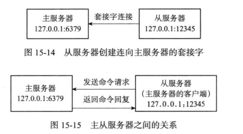
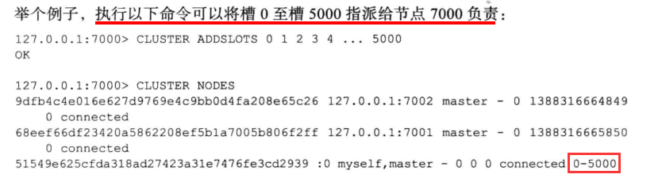

# 多机数据库的实现

## 一、复制

在 Redis 中，用户可以通过执行 **SLAVEOF** 命令或者设置 **slaves** 选项，让一个服务器去复制（ replicate）另一个服务器，我们称呼**被复制的服务器为==主服务器==（ master）**，而**对主服务器进行复制的服务器则被称为==从服务器==（ slave）**

复制中的主从服务器**双方的数据库将保存相同的数据**，概念上将这种现象称作”数态一致”，或者简称“一致”


### 1、步骤

Redis的复制功能分为**同步**（sync）和**命令传播**（ command propagate）两个操作

* **同步**
    * 用于将从服务器的数据库状态更新至主服务器当前所处的数据库状态
* **命令传播**
    * 用于在主服务器的数据库状态被修改，导致主从服务器的数据库状态出现不一致时，让主从服务器的数据库重新回到一致状态


#### 1.1 同步

从服务器对主服务器的同步操作需要通过向主服务器发送 **SYNC 命令**来完成

以下是 **SYNC**命令的执行步骤

1. 从服务器向主服务器发送 **SYNC**命令
2. 收到 **SYNC** 命令的主服务器执行 **BGSAVE** 命令，**在后台生成一个 RDB 文件**，并使用一个缓冲区记录从现在开始执行的所有写命令
3. 当主服务器的 **BGSAVE** 命仝执行完毕时，主服务器会将生成的 **RDB** 文件发送给从服务器，从服务器接收并载入这个 **RDB** 文件，将自己的数据库状态更新至主服务器执行 **BGSAVE** 命令时的数据库状态
4. 主服务器**将记录在缓冲区里面的所有写命令发送给从服务器**，从服务器执行这些写命令，将自己的数据库状态更新至主服务器数据库当前所处的状态


#### 1.2 命令传播

每当**主服务器**执行客户端发送的写命令服务器的数据可能会被修改，并**导致主从服务器状态不再一致**

为了让主从服务器再次回到一致状态，主服务器需要对从服务器执行命令传播操作

* 主服务器会将自已执行的写命令，也即是造成主从服务器不一致的那条写命令，发送给从服务器执行
* 当从服务器执行了相同的写命令之后，主从服务器将再次回到一致状态


### 2、缺陷

问题：**主从服务器中途断开**

* 若主从服务器中途断开连接一段时间
* 这段时间主服务器执行了一些写命令
* 重新连接之后从服务器需要再次向主服务器发送 SYNC 命令
* 但这个命令会执行大量的写操作以及 I/O 操作
* 为了少量的数据不一致而使用消耗性能的 SYNC 命令，效率低下

这是 Redis 2.8 版本之前的处理方式

新版本处理方式：使用 **==P==SYNC** 命令代替 **SYNC** 命令来执行复制时的同步操作

PSYNC 命令具有**完整重同步**和**部分重同步**两种模式

* **完整重同步**
    * 用于处理**初次复制**情况：跟 **SYNC** 的处理方式一样
* **部分重同步**
    * 用于处理**断线情况**：只会复制断线后那部分数据，不会重新执行 **SYNC** 命令


### 3、部分重同步

部分重同步功能由以下三个部分构成

1. **主服务器**的复制偏移量和**从服务器**的复制偏移量
2. 主服务器的**复制积压缓冲区**
3. 服务器的**运行 ID**


#### 3.1 复制偏移量

主服务器和从服务器会分别维护一个**复制偏移量**

* **主服务器**每次向从服务器**传播** N 个字节的数据时，就将自己的复制偏移量的值加上 N
* **从服务器**每次**收到**主服务器传播来的 N个字节的数据时，就将自己的复制偏移量的值加上N


通过**对比主从服务器的复制偏移量**，程序可以很容易地知道主从服务器是否处于一致状态

* 如果主从服务器处于一致状态，那么主从服务器两者的偏移量总是相同的
* 如果主从服务器两者的偏移量并不相同，那么说明主从服务器并未处于一致状态


#### 3.2 复制积压缓冲区

**复制积压缓冲区**是由**主服务器**维护的一个**固定长度的先进先出队列**，默认大小为 1 MB


当主服务器进行命令传播时，它不仅会将写命令发送给所有从服务器，还会将写命令入队到复制积压缓冲区中


因此，主服务器的**复制积压缓冲区里面会保存着一部分最近传播的写命令**，并且复制积压缓冲区**会为队列中的每个字节记录相应的复制偏移量**


当**从服务器重新连上主服务器时**

* 从服务器会通过 **PSYNC** 命令将自己的复制偏移量 **offset** 发送给主服务器
* 主服务器会根据这个复制偏移量来决定对从服务器执行何种同操作
    * 如果 **offset** 偏移量之后的数据**仍然存在于复制积压缓冲区里面**，那么主服务器将对从服务器**执行部分重同步操作**
    * 如果 **offset** 偏移量之后的数据已经**不存在于复制积压缓冲区**，那么主服务器将对从服务器**执行完整重同步操作**


#### 3.3 服务器运行 ID

除了复制偏移量和复制积压缓冲区之外，实现部分重同步还需要用到**服务器运行 ID**

* 每个 **Redis** 服务器，不论主服务器还是从服务，都会有自己的运行 ID
* 运行 ID 在服务器**启动时自动生成**，由40个随机的十六进制字符组成


当从服务器对主服务器进行初次复制时，主服务器会将自己的运行 ID 传送给从服务器而从服务器则会将这个运行ID保存起来

* 作用：用来判断断线后重新连上的主机是新的主机还是旧的主机


### 4、PSYNC 命令

PSNC命令的调用方法有两种

* 如果是全新的一次复制，那么从服务器将向主服务器发送 **PSYNC？ -1** 命令，主动请求主服务器进行**完整重同步**
* 如果从服务器已经复制过某个主服务器，那么从服务器将向主服务器发送 **PSYNC runid offset 命令**
    * **runid** 是上一次复制的主服务器的运行 ID
    * **offset** 是从服务器当前的复制偏移量
        * 接收到这个命令的主服务器会通过这两个参数来判断应该对从服务器执行哪种同步操作


根据情况，接收到 **PSYNC** 命令的主服务器会向从服务器返回以下三种回复的其中一种

* 如果主服务器返回 **FULLRESYNC runid offset**
    * 那么表示主服务器将与从服务器执行**完整重同步操作**
    * **runid** 是这个主服务器的运行ID
    * **offset** 则是主服务器当前的复制偏移量，从服务器会将这个值作为自己的初始化偏移量

* 如果主服务器返回 **+CONTINUE**
    * 那么表示主服务器将与从服务器执行**部分重同步操作**
    * 从服务器只要等着主服务器将自己缺少的那部分数据发送过来就可以了
* 如果主服务器返回 **-ERR**
    * 那么表示主服务器的版本低于 Redis28，它识别丕了 **PSYNC** 命令
    * 丛服务器将向主服务器发送 **SYNC** 命令，并与主服务器执行完整同步操作


### 5、复制的实现

#### 5.1 设置主服务器地址和端口

当客户端向从服务器发送以下命令时

```shell
slaveof 127.0.0.1 6379
```

从服务器首先要做的就是将客户端给定的主服务器 **IP** 地址 **127.0.0.1** 以及端口 **6379** 保存到服务器状态的 **masterhost** 属性和 **masterport** 属性里面：

**SLAVEOF** 命令是一个**异步命令**

* 在完成 **masterhost** 属性和 **masterport** 属性的设置工作之后
* 从服务器将向发送 **SLAVEOF** 命令的客户端返回OK，表示复制指令已经被接收
* 而实际的复制工作将在 **OK** 返回之后才真正开始执行


#### 5.2 建立套接字连接

在 **SLAVEOF** 命令执行之后，从服务器将根据命令所设置的 **IP** 地址和端口，创建连向主服务器的套接字连接




....


### 6、心跳检测

在命令传播阶段，从服务器默认会以**每秒一次的频率**，向主服务器发送命令                                                **REPLCONF   ACK  replication_offset** 

* 其中 **replication_offset** 是从服务器当前的复制偏移量


该命令的作用

1. 检查两者之间的网络连接是否正常
    * 如果主服务器超过一秒钟没有收到从服务器发来的 **REPLCONF ACK** 命令
    * 那么主服务器就知道主从服务器之间的连接出现回题
2. 辅助实现 **min-slaves** 配置选项


3. 检测命令丢失
    * 如果因为网络故障，主服务器传播给从服务器的写命令在半路丢失
    * 那么当从服务器向主服务器发送 **REPLCONF ACK** 命令时
    * 主服务器将发觉**从服务器当前的复制偏移量少于自已的复制偏移量**
    * 然后主服务器就会根据从服务器提交的复制偏移量，在**复制积压缓冲区**里面找到从服务器缺少的数据，并将这些数据重新发送给从服务器
    * **注意**
        * 主服务器向从服务器补发缺失数据这一操作的原理和部分重同步操作的原理非常相似
        * 这两个操作的区别在于
            * 补发缺失数据操作在主丛服务器没有断线的情况下热行
            * 而部分重回步操作则在主从服务器断线并重连之后执行


## 二、Sentinel

* 由一个或多个 **Sentinel** 实例组成的 **Sentinel** 系统
* 可以监视任意多个主服务器以及这些主服务器属下的所有从服务器
* 当被监视的主服务器进入下线状态时，自动将下线主服务器属下的某个从服务器升级为新的主服务器
* 然后由新的主服务器代替已下线的主服务器继续处理命令请求


### 1、启动并初始化 Sentinel

所用命令

```shell
redis-sentinel /path/to/your/sentinel.conf
redis-server   /path/to/your/sentinel.conf --sentinel
```

* 这两个命令的效果完全相同，当一个 Sentinel 启动时，它需要执行以下步骤
    1. 初始化服务器
    2. 将普通 Redis 服务器使用的代码替换成 **Sentinel** 专用代码
    3. 初始化 **Sentinel** 状态
    4. 根据给定的配置文件，初始化 **Sentinel** 的监视主服务器列表
    5. 创建连向主服务器的网络连接


#### 1.1 初始化服务器

* **Sentinel** 本质上只是一个**运行在特殊模式下的 Redis服务器**
* 所以启动Sentinel的第一步，就是初始化一个普通的 Redis服务器
* 但是 **Sentinel** 的初始化过程和普通 Redis 服务器的初始化过程**并不完全相同**


#### 1.2 使用专用的 Sentinel 代码

启动 **Sentinel** 的第二个步骤

* 将一部分普通 Redis 服务器使用的代码替换成 **Sentinel** 专用代码


#### 1.3 初始化 Sentinel 状态

在应用了 **Sentinel** 的专用代码之后，接下来

* 服务器会初始化一个 **sentinel.c / sentinelState** 结构（后面简称     “ Sentinel状态”）
* 这个结构保存了服务器中所有和 **sentinel** 功能有关的状态

```c++
struct sentinelState{
    // 当前纪元，用于实现故障转移
    uint64_t current_epoch;
    // 保存了所有被这个 sentinel 监视的主服务器
    // 字典的 键 是主服务器的名字
    // 字典的 值 则是一个指向 sentinel_Redis_Instance 结构的指针
    dict *masters;
    // 是否进入了 TILT 模式？
	int tilt;
    // //目前正在执行的脚本的数量
    int running_scripts;
    // 进入TILT模式的时间
    mstime_t tilt_start_time;
    // 最后一次执行时间处理器的时间
    mstime_t previous_time;
    // 一个FFO队列，包含了所有需要执行的用户脚本
    1ist *scripts_queue;
}
```


#### 1.4 初始化 Sentinel 状态的 masters 属性

**Sentinel** 状态中的 **masters** 字典记录了所有被 **Sentinel** 监视的主服务器的相关信息

* 字典的**键**是被监视主服务器的名字
* 字典的**值**则是被监视主服务器对应的 **sentinel.c / sentinelRedisInstance** 结构


每个 **sentinelRedisInstance** 结构（后面简称“实例结构”）**代表一个被 Sentinel 监视的 Redis服务器实例**

* 这个实例可以是**主服务器**、**从服务器**，或者**另外一个 Sentinel**


**sentinelRedisInstance.addr 属性**

* 是一个指向 **sentinel.c / sentinelAddr** 结构的指针
* 这个结构保存着实例的 **IP** 地址和端口号

```c++
typedef struct sentinelAddr {
    char *ip;
    int port;
}sentinelAddr;
```


对 **Sentinel** 状态的初始化将引发对 **masters** 字典的初始化，而 **masters** 字典的初始化是**根据被载入的 Sentinel配置文件来进行的**


#### 1.5 创建连向主服务器的网络连接

* 初始化 Sentinel 的最后一步
    * 创建连向被监视主服务器的网络连接
    * Sentinel 将成为主服务器的客户端
        * 它可以向主服务器发送命令，并从命令回复中获取相关的信息

对于每个被 **Sentinel** 监视的主服务器来说， **Sentinel** 会**创建两个连向主服务器的异步网络连接**

* 一个是**命令连接**
    * 这个连接专门用于向主服务器发送命令，并接收命令回复
* 一个是**订阅连接**
    * 这个连接专门用于订阅主服务器的  __sentinel：hello 频道


### 2、获取主服务器的信息

**Sentinel** 默认会以**每十秒一次**的频率

* 通过**命仝连接**向被监视的主服务器发送 **INFO 命令**
* 并通过分析 **INFO** 命令的回复来**获取主服务器的当前信息**


通过分析主服务器返回的 **INFO** 命令回复， **Sentinel** 可以获取以下两方面的信息

* 一方面是关于**主服务器本身的信息**
    * 包括 **run_id** 域记录的服务器**运行 ID**，以及 **role** 域记录的**服务器角色**

* 另一方面是关于主服务器属下所有从服务器的信息
    * 每个从服务器都由一个 "slave" 字符串开头的行记录
    * 每行的 **ip= 域**记录了从服务器的 **IP** 地址，而 **port= 域**则记录了从**服务器的端口号**
    * 根据这些 **IP** 地址和端口号， **Sentinel** 无须用户提供从服务器的地址信息，就可以自动发现从服务器


### 3、获取从服务器信息

当 **Sentinel** 发现主服务器有**新的从服务器出现时**

* **Sentinel** 除了会为这个新的丛服务器创建相应的实例结构之外
* **Sentinel** 还会创建连接到从服务器的**命令连接**和**订阅连接**


在创建命令连接之后

* **Sentinel** 在默认情况下，会以每**十秒一次的频率**通过命令连接**向从服务器发送INFO命令**

根据 **INFO** 命令的回复， **Sentinel** 会提取出以下信息

1. 从服务器的运行 ID  **run_id**
2. 从服务器的角色 **role**
3. 主服务器的IP地址 **master_host**，以及主服务器的端口号 **master_port**
4. 主从服务器的连接状态 **master_link_status** 
5. 从服务器的优先级 **slave_priority** 
6. 从服务器的复制偏移量 **slave_repl_offset**

根据这些信息， **Sentinel** 会对从服务器的实例结构进行更新


### 4、接收信息

当 **Sentinel** 与一个主服务器或者从服务器建立起订阅连接之后， Sentinel 就会通过订阅连接，向服务器发送以下命令：

```
SUBSCRIBE __sentinel__：hello
```

**Sentinel** 对  ______sentinel______：hello 频道的订阅会一直持续到 **Sentinel** 与服务器的连接断开为止


对于监视同一个服务器的多个 **Sentinel** 来说

* 一个 **Sentinel** 发送的信息会被其他 **Sentinel** 接收到
* 这些信息会被用于更新**其他 Sentinel** 对发送信息 **Sentinel** 的认知
* 也会被用于更新其他 **Sentinel** 对被监视服务器的认知


**==创建连向其他 Sentinel的命令连接==**

当 **Sentinel** 通过频道信息发现一个新的 **Sentinel** 时

* 它不仅会为新 **Sentinel** 在 **sentinels** 字典中创建相应的实例结构
* 还会创建一个连向新 **Sentinel** 的命令连接
* 而新 **Sentinel** 也同样会创建连向这个 **Sentinel** 的命令连接
* 最终监视同一主服务器的多个 **Sentinel** 将形成相互连接的网络


### 5、检测服务器状态

#### 5.1 检测主观下线状态

在默认情况下

* **Sentinel** 会以**每秒一次**的频率**向所有与它创建了命令连接的实例**（包括主服务器、从服务器、其他 Sentinel在内）**发送PING命令**
* 并通过实例返回的 **PING** 命回复来**判断实例是否在线**


**Sentinel** 配置文件中的 **down-after-milliseconds 选项**

* 指定了 **Sentinel** 判断实例进人主观下线所需的时间长度
* 如果一个实例在 **down-after-millseconds** 毫秒内，连续向 **Sentinel** 返回无效回复
* 那么 **Sentinel** 会修改这个实例所对应的实例结构，在结构的 **flaqs** 属性中打开 **SRI_S_DOWN** 标识，以此来表示这个实例已经进人主观下线状态
* 不同的 **Sentinel** 的 **down-after-milliseconds 选项** 不一样


#### 5.2 检测客观下线状态

当 **Sentinel** 将一个主服务器判断为主观下线之后

* 为了确认这个主服务器是否真的下线
* 它会向同样监视这一主服务器的其他 **Sentinel** 进行询间，看它们是否也认为主服务器已经讲人了下线状态
* 当 **Sentinel** 从其他 **Sentinel** 那里接收到足够数量（**半数**）的已下线判断之后
* **Sentinel**就会将从服务器判定为客观下线，并对主服务器执行故障转移操作


Sentinel 使用 **SENTINEL is-master-down-by-addr  ip  port  current_epoch  runid** 命令询问其他 **Sentinel** 是否同意主服务器已下线


当一个 **Sentinel**（目标 **Sentinel**）接收到另一个 **Sentinel**（源 **Sentinel**）发来的 **SENTINEL is- master- down-by** 命令时

* 目标 Sentinel 会分析并取出命令请求中包含的各个参数
* 并根据其中的主服务器和端口号，检査主服务器是否已下线
* 然后向源 **Sentinel** 返回一条包含三个参数的 **Multi  Bulk** 作为回复


### 6、选举领头的 Sentinel

当一个主服务器被判断为客观下线时，监视这个下线主服务器的各个 **Sentinel**会进行协商，选举出一个领头 Sentinel，并由领头 **Sentinel** 对下线主服务器执行故障转移操作

选举规则

1. 所有在线的 **Sentinel** 都有被选为领头 Sentinel的资格
    * 换句话说，监视同一个主服务器的多个在线 **Sentinel** 中的任意一个都有可能成为领头 **Sentinel**
2. 每次进行领头 **Sentinel** 选举之后，不论选举是否成功，所有 **Sentinel** 的配置纪元的值都会自增一次
    * 配置纪元实际上就是一个计数器，并没有特别的地方
3. 在一个配置纪元里面，所有 **Sentinel** 都有一次将某个 **Sentinel** 设置为局部领头**Sentinel** 的机会
    * 局部领头一旦设置，在这个配置纪元里面就不能再更改
4. 当一个 **Sentinel**（源 **Sentinel**）向另一个 **Sentinel**（目标 **Sentinel**）发送 **SENTINEL is- master-down-by-addr** 命令，并且命令中的 **runid** 参数不是 ***** 符号而是源 **Sentinel** 的**运行 ID** 时，这表示源 **Sentinel**要求目标 **Sentinel**将前者设置为后者的局部领头 **Sentinel**

5. 目标 **Sentinel** 在接收到  **SENTINEL is- master-down-by-addr** 命令之后，将向源 **sentinel** 返回一条命令回复
    * 回复中的 **leader_runid** 参数和 **leader_epoch** 参数分别记录了目标 **Sentinel** 的局部领头 **Sentinel** 的运行 ID 和配置纪元
6. 源 **Sentinel** 在接收到目标 **Sentinel** 返回的命令回复之后，会检查回复中 **leader_epoch** 参数的值和自己的配置纪元是否相同
    * 如果相同的话，那么源 **Sentinel** 继续取出回复中的 **leader_runid** 参数，如果 **leader_runid** 参数的值和源 **Sentinel** 的运行ID一致，那么表示**目标 Sentinel 将源 Sentinel设置成了局部领头 Sentinel**
7. 如果某个 **Sentinel** 被半数以上的 **Sentinel**设置成局部领头 **Sentinel**，那么这个**Sentinel**成为领头 **Sentinel** 
8. 因为领头 **Sentinel** 的产生需要半数以上 **Sentinel** 的支持，
    * 并且每个 **Sentinel** 在**每个配置纪元里面只能设置一次局部领头 Sentinel**，所以在一个配置纪元里面，只会出现一个领头 **Sentinel**
9. 如果在给定时限内，没有一个 **Sentinel** 被选举为领头 **Sentinel**
    * 那么各个 **Sentinel**将在一段时间之后再次进行选举，直到选出领头 **Sentinel**为止


### 7、故障转移

在选举产生出领头 **Sentinel**之后，领头 **Sentinel**将对**已下线的主服务器**执行故**障转移**

该操作包含以下三个步骤

1. 在已下线主服务器属下的所有从服务器里面，**挑选出一个从服务器，并将其转换为主服务器**
2. 让已下线主服务器属下的所有从服务器改为复制新的主服务器
3. 将已下线主服务器设置为新的主服务器的从服务器
    * 当这个旧的主服务器重新上线时，它就会成为新的主服务器的从服务器


#### 7.1 选出新的主服务器

故障转移操作第一步要做的就是在已下线主服务器属玉的所有从服务器中，挑选出一个状态良好、数据完整的从服务器，然后向这个从服务器发送 **SLAVEOF no one 命令**，将这个从服务器转换为主服务器


在发送 **SLAVEOF no one**命令之后

* 领头 **Sentine** l会以每秒一次的频率（平时是每十秒一次），向被升级的从服务器发送 **INFO** 命令
* 并观察命令回复中的角色（**role**）信息
* 当被升级服务器的 **role** 从原来的 **slave** 变为 **master**时
* 领头**Sentinel** 就知道被选中的从服务器已经顺利升级为主服务器了


#### 7.2 修改从服务器的复制目标

当新的主服务器出现之后

* 领头 **Sentinel** 下一步要做的就是
* 让已下线主服务器属下的所有从服务器去复制新的主服务器
* 这一动作可以通过向从服务器发送 **SLAVEOF** 命令来


故障转移操作最后要做的是，**将已下线的主服务器设置为新的主服务器的从服务器**


## 三、集群

### 1、节点

* 一个 Redis 集群通常由多个节点（node）组成
    * 在刚开始的时候，每个节点都是相互独立的
    * 它们都处于一个只包含自己的集群当中
    * 要组建一个真正可工作的集群，我们必须将各个独立的节点连接起来，构成一个包含多个节点的集群

连接各个节点的工作可以使用 **CLUSTER  MEET** 命令来完成

* **cluster  meet  ip  prot**
    * 向一个节点发送 **CLUSTER MEET** 命令，可以让节点与 **ip** 和 **port** 所指定的节点进行握手
    * 当握手成功时，节点就会将 **ip** 和 **port** 所指定的节点添加到当前节点所在的集群中


#### 1.1 启动节点

* 一个节点就是一个**运行在集群模式下的 Redis 服务器**
* Redis 服务器在启动时会根据 **cluster-enabled 配置选项**是否为 yes 来决定**是否开启服务器的集群模式**


#### 1.2 集群数据结构

* **clusterNode 结构**保存了一个节点的当前状态
    * 比如节点的创建时间、节点的名字、节点当前的配置纪元、节点的IP地址和端口号等等

* 每个节点都会使用一个 **clusterNode** 结构来记录自己的状态
    * 并为集群中的**所有其他节点**（主节点和从节点）**都创建**一个相应的 **clusterNode**结构
    * 以此来记录其他节点的状态

```c++
struct clusterNode{
    // 刨建节点的时间
    mstime_t ctime;
    // 节点的名字，由 40 个十六进制字符组成
    char name[REDIS_CLUSTER_NAMELEN];
    // 节点标识
    // 使用各种不同的标识值记录节点的角色（比如主节点或者从节点），
	// 以及节点目前所处的状态（比如在线或者下线）。
	int flags;
    // 节点当前的配置纪元，用于实现故障转移
    uint64_t configEpoch;
    // 节点的IP地址
    char ip[REDIS_IP_STR_LEN];
    // 节点的端口号
    int port;
    // 保存连接节点所需的有关信息
    clusterLink *link;
    .....
}
```

* **clusterNode** 结构的 **link 属性**是一个 **clusterLink** 结构
    * 该结构保在了连接节点所需的有关信息，比如套接字描述符，输入缓冲区和输出缓冲区


* 每个节点都保存着一个 **clusterState 结构**
    * 记录了在当前节点的角下，集群目前所处的状态
    * 例如集群是在线还是下线，集群包含多少个节点，集群当前白配置纪元，诸如此类

```c++
typedef struct clusterState {
    // 指向当前节点的指针
    clusterNode *myself;
    // 集群当前的配置纪元，用于实现故障转移
    uint64_t currentEpoch;
    //集群当前的状态：是在线还是下线
    int state;
    // 集群中至少处理着一个槽的节点的数量
    int size;
    // 集群节点名单（包括myse1f节点）
	// 字典的 键为节点的名字，字典的 值为节点对应的 clusterNode 结构
    dict *nodes;
    ....
}
```


#### 1.3 cluster  meet 命令

* 通过向节点 **A** 发送 **CLUSTER MEET** 命令
    * 客户端可以让接收命令的节点 **A** 将另一个节点 **B** 添加到节点 **A** 当前所在的集群里面

收到命令的节点 A 将与节点 B 进行握手，以此来确认彼此的存在，并为将来的进一步通信打好基础

1. 节点 **A** 会为节点 **B** 创建一个 **clusterNode** 结构
    * 并将该结构添加到自已的 **clusterState. nodes 字典**里面

2. 之后，节点 **A** 将根据 **CLUSTER MEET** 命令给定的 **IP** 地址和端口号，向节点 **B** 发送条 **MEET** 消息
3. 节点 **B** 将接收到节点 **A** 发送的 **MEET** 消息之后
    * 节点 **B** 会为节点 **A** 创建一个 **clusterNode** 结构
    * 并将该结构添加到自己的 **clusterState.nodes 字典**里面
4. 之后，节点 **B** 将向节点 **A** 返回一条 **PONG 消息**
5. 节点 **A** 将接收到节点 **B** 返回的 **PONG** 消息
    * 通过这条 **PONG** 消息，节点 **A** 可以知道节点 **B** 已经成功地接收到了自己发送的 **MEET** 消息
6. 之后，节点 **A** 将向节点 **B** 返回一条 **PING** 消息
7. 节点 **B** 将接收到节点 **A** 返回的 **PING** 消息
    * 通过这条 **PING** 消息节点 **B** 可以知道节点 **A** 已经成功地接收到了自己返回的 **PONG** 消息
    * 握手完成


### 2、槽指派

Redis 集群通过 **分片**的方式来保存数据库中的键值对

* 集群的整个数据库被分为 **16384 个槽**
* 数据库中的每个键都属于这 16384 个槽的其中一个
* 集群中的每个节点可以处理 0 个或最多 16384 个槽

当数据库中的 16384 个槽**都有节点在处理时**，集群处于上线状态，反之处于下线状态

通过向节点发送 **CLUSTER ADDSLOTS 命令**，我们可以将一个或多个槽指派给指定的节点负责




#### 2.1 记录节点的槽指派信息

**clusterNode 结构**的 **slots** 属性和 **numslot** 属性记录了节点负责处理哪些槽

```c++
struct clusterNode {
    .....
    unsigned char slots[16384/8]
	int numslots;
    .....
}
```

* **slots** 属性是一个二进制位数组
    * 这个数组的长度为 16384/8 = 2048个字节，共包含 **16384** 个二进制位
        * 如果 slots 数组在索引 i 上的二进制位的值为 1，那么表示节点负责处理**槽 i**
        * 如果 slots 数组在索引 i 上的二进制位的值为 0，那么表示节点不负责处理**槽 i**
* **numslots** 属性则记录节点负责处理的槽的数量
    * 也即是 **slots** 数组中值为 1 的二进制位的数量


#### 2.2 传播节点的槽指派信息

一个节点除了会将自己负责处理的槽记录在 **closterNode** 结构的 **slots** 属性和 **numslots** 属性之外，它还会将自己的 **slots** 数组通过消息发送给集群中的其他节点，以此来告知其他节点自己目前负责处理哪些槽


#### 2.3 记录集群中所有槽的指派信息

**clusterState** 结构中的 **slots** 数组记录了集群中所有 **16384** 个槽的指派信息

```c++
typedef struct clusterState{
    .....
    clusterNode *slots[16384];
    .....
}
```

**slots** 数组包含 16384 个项，每个数组项都是**一个指向 closterNode结构的指针**

* 如果 **slots[i]** 指针指向 **NULL**，那么表示槽 i 尚未指派给任何节点
* 反之则表示槽 i 分配给了所指向的节点


#### 2.4 cluster  addslots  命令

**CLUSTER ADDSLOTS** 命令接受一个或多个槽作为参数，并将所有输入的槽指派给接收该命令的节点负责


### 3、在集群中执行命令

在对数据库中的 16384 个槽都进行了指派之后，集群就会进入上线状态，这时客户端就可以向集群中的节点发送数据命令了


当客户端向节点发送与数据库键有关的命令时

* 接收命令的节点会计算出命令要处理的数据库**键属于哪个槽**
* 并检査这个槽是否指派给了自己
    * 如果键所在的槽正好就指派给了当前节点，那么节点直接执行这个命令
    * 如果键所在的槽并没有指派给当前节点
        * 那么节点会向客户端返回一个 **MOⅤED** 错误
        * 指引客户端转向至正确的节点，并再次发送之前想要执行的命令


#### 3.1 计算键属于哪个槽


#### 3.2 MOVED 错误

当节点发现键所在的槽并非由自己负责处理的时候

* 节点就会向客户端返回一个 **MOVED** 错误
* 指引客户端转向至正在负责槽的节点


当客户端接收到节点返回的 **MOVED** 错误时

* 客户端会根据 MOVED 错误中提供的 **IP** 地址和端口号，转向至负责处理槽 slot 的节点
* 并向该节点重新发送之前想要执行的命令


个集群客户端通常会与集群中的多个节点刨建**套接字连接**

* 而所谓的节点转向际上就是换一个套接字来发送命令


#### 3.3 节点数据库的实现

集群节点保存键值对以及键值对过期时间的方式，与第9章里面介绍的单机 Redis服务器保存键值对以及键值对过期时间的方式完全相同

注意

* 点和单机服务器在数据库方面的一个区别是，节点只能使用 **0 号数据库**


除了将键值对保存在数据库里面之外

* 节点还会用 clusterState 结构中的 **slots_to_keys 跳跃表**来保存槽和键之间的关系

```c++
typedef struct clusterState{
    ....
    zskiplist *slots_to_keys;
    ....
}
```

跳跃表每个节点的**分值（ score）都是一个槽号**，而每个节点的**成员都是一个数据库键**


### 4、重新分片

重新分片操作

* 可以将任意教量已经指派给某个节点（源节点）的槽改为指派给另一个节点（目标节点）
* 并且相关槽所属的键值对也会从源节点被移动到目标节点


#### 4.1 原理

Redis集群的**重新分片操作**是由 Redis的**集群管理软件 redis-trib** 负责执行的

* Redis 提供了进行重新分片所需的所有命令
* 而 **redis-trib** 则通过向源节点和目标节点发送命令来进行重新分片操作


**redis-trib** 对集群的**单个槽 slot** 进行重新分片的步骤如下

1. **redis-trib** 对**目标节点**发送 **cluster  setslot  slot  improting  source_id** 命令
    * 让目标节点准备好从源节点**==导入==**（Import）属于槽 **slot** 的键值对
2. **redis-trib** 对**源节点**发送 **cluster  setslot  slot  migrating target_id** 命令
    * 让源节点准备好将属于槽 **slot** 的键值对**==迁移==**（ migrate）至目标节点
3. **redis-trib** 向**源节点**发送  **CLUSTER GETKEYSINSLOT  slot  count**  命令
    * 获得最多 count 个属于槽 **slot** 的键值对的**键名**（ key name）
4. 对于步骤 3 获得的每个**键名**， redis-trib 都向**源节点**发送一个 
    * **migrate   target_ip  target_port  key_name  0  timeout** 命令
    * 将被选中的键**原子地从源节点迁移至目标节点**
5. 重复执行步骤 3 和步骤 4，直到源节点保存的所有属于槽 **slot** 的键值对都被迁移至目标节点为止


### 5、ASK 错误

在进行重新分片期间，源节点向目标节点迁移一个槽的，可能会出现这样一种情况

* 属于被迁移槽的**一部分键值对**保存在**源节点**里面
* 而另**一部分键值对**则保存在**目标节点**里面

当客户端向源节点发送与数据库键有关的命令，并且命令要处理的数据库键恰好就属于正在被迁移的槽时

* 源节点会先在自己的数据库里面查找指定的键，**如果找到**的话，就直接执行客户端发送的命令
* 如果源节点没能在自己的数据库里面找到指定的键
    * 那么这个键有**可能已经被迁移到了目标节点**
    * 源节点将向客户端返回一个 ASK 错误，指引客户端转向正在导入槽的目标节点
    * 并再次发送之前想要执行的命令


#### 5.1 cluster setslot importing命令

**clusterState** 结构的 **importing_slots_from数组**记录了**当前节点正在从其他节点导入的槽**

```c++
typedef struct clusterState{
    ....
    clusterNode *importing_slots_from[16384];
    ....
}
```

如果 **importing_slots_from[i]** 的值不为NULL，而是指向一个 **clusterNode** 结构

* 那么表示当前节点正在从 **clusterNode** 所代表的节点导人槽 **i**


#### 5.2 cluster setslot migrating命令

clusterState 结构的 **migrating_slots_to 数组**记录了**当前节点正在迁移至其他节点的槽**

```c++
typedef struct clusterState{
    ....
    clusterNode *migrating_slots_to[16384];
    ....
}
```

如果 migrating_slots_to[i] 的值不为 NULL，而是指向一个 clusterNode 结构

* 那么表示当前节点正在将槽 **i** 主迁移至 **clusterNode** 所代表的节点


#### 5.3 ASKING 命令

**ASKING 命令**

* 唯一要做的就是打开发送该命令的客户端的 **REDIS_ASKING** 标识

在一般情况下

* 如果客户端向节点发送一个关于槽 **i** 的命令，而槽 **i** 又没有派给这个节点
* 那么节点将向客户端返回一个 **MOVED** 错误
* 但是，如果节点的 **clusterState.importing_slots_from[i]** 显示节点正在导入槽 **i**
* 并且发送命令的客户端带有 **REDIS_ASKING** 标识
* 那么节点将破例执行这个关于槽 **i** 的命令一次


客户端接收到 ASK 错误并转向至正在导入槽的节点时

* 客户端会先向节点发送一个 **ASKING** 命令
* 然后才重新发送想要执行的命令
    * 这是因为如果客户端不发送  **ASKING** 命令
    * 而直接发送想要执行的命令的话
    * 那么客户端发送的命令将被节点拒绝执行，并返回 **MOVED** 错误


### 6、复制

Redis集群中的节点分为**主节点**（master）和**从节点**（slave）

* 其中主节点用于处理槽
* 而从节点则用于复制某个主节点
* 从节点在被复制的主节点下线时，**代替下线主节点继续处理命令请求**


#### 6.1 设置从节点

向一个节点发送命令：**cluster  replicate  node_id**

* 可以让接收命令的节点成为所指定节点（**node_id**）的从节点，并开始对主节点进行复制

1. 接收到该命令的节点首先会在自己的 **clusterState.nodes** 字典中找到 **node_id** 所对应节点的 **clusterNode**结构，并将自己的 **clusterState.myself.slaveof** 指针指向这个结构，以此来记录这个节点正在复制的主节点
2. 然后节点会修改自己在 clusterState.myself.flags 中的属性
    * 关闭原本的 **REDIS_NODE_MASTER** 标识，打开 **REDIS_NODE_SLAVE** 标识
    * 表示这个节点已经由原来的主节点变成了从节点
3. 最后，节点会调用复制代码
    * 根据 **clusterState.myself.slaves** 指向的 **clusterNode** 结构所保存的 **IP** 地址和端口号对主节点进行复制
    * 因为节点的复制功能和单机 Redis 服务器的复制功能使用了相同的代码
    * 所以让从节点复制主节点相当于向从节点发送命令 **SLAVEOF  master_ip  master_port**


一个节点成为从节点、并开始复制某个主节点这一信息会通过消息发送给集群中的其他点，最终集群中的所有节点都会知道某个从节点正在复制某个主节点

集群中的**所有节点**都**会在代表主节点的 clusterNode 结构的 slaves 属性和 numslaves 属性**中记录正在复制这个主节点的从节点名单

```c++
struct clusterNode{
    ....
    // 正在复制这个主节点的从节点数量
    int numslaves;
    // 一个数组
    // 每个数组项指向一个正在复制这个主节点的从节点的 clusterNode 结构
    struct clusterNode **slaves;
    ....
}
```


### 7、故障检测

集群中的每个节点都会定期地向集群中的其他节点发送 **PING** 消息，以此来检测对方是否在线

* 如果接收 **PING** 消息的节点没有在规定的时间内，向发送**PING**消息的节点返回 **PONG** 消息
* 那么发送 **PING** 消息的节点就会将接收 **PING** 消息的节点标记为疑似下线

举个例子，如果节点 **7001** 向节点 **7000** 发送了一条 **PING** 消息

* 但是节点 **7000** 没有在规定的时间内向节点 **7001** 返回一条 **PONG** 消息
* 那么节点 **7001** 就会在自己的 **clusterState.nodes** 字典中找到节点 **7000** 所对应的 **clusterNode** 结构
* 并在结构的 **flags** 属性中打开 **REDIS_NODE_PFAIL** 标识
* 以此表示节点 7000 进人了疑似下线状态

集群中的各个节点会通过互相发送消息的方式来交换集群中各个节点的状态信息

* 当一个主节点 **A** 通过消息得知主节点 **B** 认为主节点 **C** 进入了疑似下线状态时
* 主节点 **A** 会在自己的 **clusterState.nodes** 字典中找到主节点 **C** 所对应的 **clusterNode** 结构
* 并将主节点 **B** 的下线报告添加到 **clusterNode** 结构的 **fail_reports** 链表里面

```c++
struct clusterNode{
    ....
    // 一个链表，记录了所有其他节点对该节点的下线报告
    list *fail_reports;
    ....
}
```

每个下线报告由一个 **clusterNodeFailReport** 结构表示

```c++
struct clusterNodeFailReport{
    // 报告目标节点已经下线的节点
    struct clusterNode *node;
    // 最后一次从node节点收到下线报告的时间
    // 程序使用这个时间戳来检查下线报告是否过期
    // (与当前时间相差太久的下线报告会被删除)
    mstime_t time;
}
```

如果在一个集群里面，**半数以上**负责处理槽的主节点都将某个主节点 **x** 报告为疑似下线

* 那么这个主节点 **x** 将被标记为已下线
* 将主节点 **x** 标记为已下线的节点会向集群广播条关于主节点 **x** 的 **FAIL** 消息
* 所有收到这条 **FAIL** 消息的节点都会立即将主节点 **x** 标记为已下线


#### 7.1 故障转移

1. 从下线的主节点的从节点中选中一个作为新的主节点
2. 将其他从节点设为新节点的从节点
3. 将下线的主节点设置为新主节点的从节点

**选举新的主节点和选举头 Sentinel 类似**


