# 独立功能的实现

## 一、发布与订阅

Redis 的发布与订阅功能由 **publish、subscribe、psubscribe** 等命令组成

**subscribe** 命令

* 客户端可以订阅一个或多个频道，从而成为这些频道的订阅者（ subscriber）
* 每当有其他客户端向被订阅的频道发送消息时
* 频道的**所有订阅者都会收到这条消息**

**psubscribe** 命令

* 改命令订阅一个或多个模式，从而成为这些模式的订阅者
* 每当有其他客户端向某个频道发送消息时
* 消息不仅会被发送给这个频道的所有订阅者
* 它还会被发送给所有**与这个频道相匹配的模式的订阅者**


### 1、频道的订阅与退订

当一个客户端执行 SUBSCRIBE 命令订阅某个或某些频道的时候，这个客户端与被订阅频道之间就建立起了一种订阅关系

Redis 将所有频道的订阅关系都保存在服务器状态的  pubsub_channels 字典里面

* 字典的**键**是某个被订阅的频道
* 字典的**值**则是一个链表
    * 链表里面记录了所有订阅这个频道的客户端

```c++
struct redisServer{
    .....
	// 保存所有频道的订阅关系
    dict *pubsub_channels;
    .....
}
```

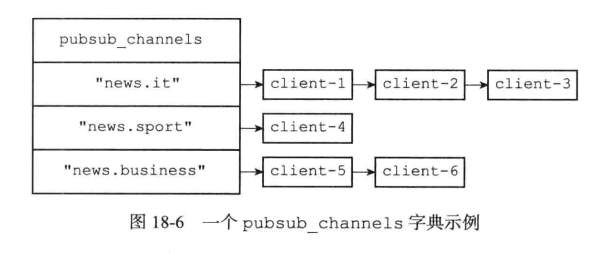

#### 1.1 订阅频道

每当客户端执行 **subscribe** 命令订阅某个或某些频道的时候

* 服务器都会将客户端与被订阅的频道在 **pubsub_channels** 字典中进行关联
* 该频道已存在则加入字典值链表尾部，不存在则新建一个字典元素


#### 1.2 退订频道

使用 **unsubscribe** 命令

* 删除对应的链表节点


### 2、模式的订阅与退订

服务器也将所有**模式的订阅关系**都保存在服务器状态的 **pubsub_patterns** 属性里面

```c++
struct redisServer{
    .....
	// 保存所有模式的订阅关系
    list *pubsub_patterns;
    .....
}
```

pubsub_patterns 属性是一个链表

* 链表中的每个节点都包含着一个 **pubsubPattern** 结构
    * 这个结构的 **pattern**属性记录了被订阅的模式
    * 而 **client** 属性则记录了订阅模式的客户端

```c++
typedef struct pubsubPattern{
    // 订阅模式的客户端
    redisClient *client;
    // 被订阅的模式
    robj *pattern;
}
```

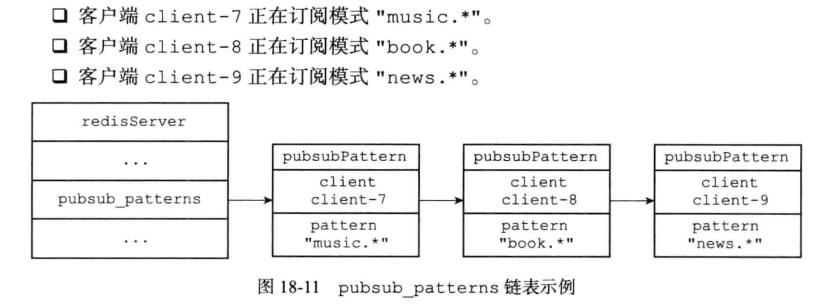


#### 2.1 订阅模式

客户端执行 **==p==subscribe** 命令订阅某个或某些模式的时候，服务器会对每个被订阅的模式执行以下两个操作

1. 新建一个 **pubsubPattern** 结构
    * 将结构的 **pattern** 属性设置为被订阅的模式
    * **client** 属性设置为订阅模式的客户端
2. 将 **pubsubPattern** 结构添加到 **pubsub_patterns** 链表的表尾


#### 2.2 退订模式

使用 **p==un==subscribe** 命令

* 删除对应的模式结构


### 3、发送消息

Redis 客户端执行 **PUBLISH channel  message** 命令将消息 **message**发送给频道 **channel**

1. 将消息 **message**  发送给 **channel** 频道的所有订阅者 
2. 如果有一个或多个模式 **pattern**与频道 **channel** 相匹配
    * 那么也会将消息 **message** 发送给 **pattern** 模式的所有订阅者


#### 3.1 将消息发送给频道订阅者

因为服务器状态中的 **pubsub_channels** 字典记录了所有频道的订阅关系

* 为了将消息发送给 **channel** 频道的所有订阅者
* **PUBLISH** 命令要做的就是在 **pubsub_channels** 字典里找到频道 **channel** 的订阅者名单（一个链表）
* 然后将消息发送给名单上的所有客户端


#### 3.2 将消息发送给模式订阅者

因为服务器状态中的 pubsub_patterns 链表记录了所有模式的订阅关系

* 为了将消息发送给所有与 channel 频道相匹配的模式的订阅者
* PUBLISH 命令要做的就是遍历整个 subsub_patterns 链表
* 查找那些与 channel 频道相匹配的模式
* 并将消息发送给订阅了这些模式的客户端

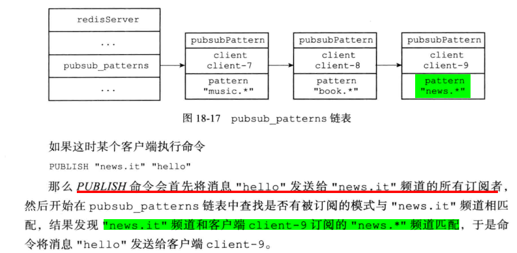


### 4、查看订阅信息

#### 4.1 pubsub channels 

**PUBSUB CHANNELS [pattern]** 命令

* 用于返回服务器当前被订阅的频道，其中 **pattern** 参数是可选的
    * 如果不给定 **pattern** 参数，那么命令返回服务器当前被订阅的所有频道
    * 如果给定 **pattern**参数，那么命令返回服务器当前被订阅的频道中那些与 **pattern** 模式相匹配的频道


#### 4.2 pubsub numsub

**PUBSUB NUMSUB [channel1 channel2… channeln]** 命令

* 接受任意多个频道作为输入参数
* 返回这些频道的订阅者数量


#### 4.3 pubsub  numpat

**PUBSUB NUMPAT** 命令

* 用于返回服务器当前被订阅模式的数量


## 二、事务

Redis 通过 **multi**、**exec**、**watch** 等命令来实现事务（ transaction）功能

* 事务提供了一种将多个命令请求打包，然后一次性、按顺序地执行多个命令的机制
* 并目在事务执行期间，服务器不会中断事务而改去执行其他客户端的命令请求
* 它会将事务中的所有命令都执行完毕，然后才去处理其他客户端的命令请求

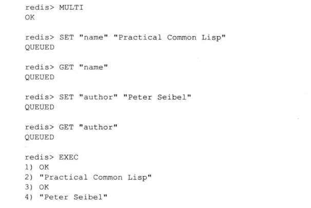


### 1、事务的实现

个事务从开始到结束通常会经历以下三个阶段

1. 事务开始
2. 命令人队
3. 事务执行


#### 1.1 事务开始

**multi** 命令的执行**标志着事务的开始**

* **multi** 命令可以将执行该命令的客户端从非事务状态切换至事务状态
* 这一切换是通过在客户端状态的 **flags** 属性中打开 **REDIS_MULTI** 标识来完成的


#### 1.2 命令入队

当一个客户端切换到事务状态之后，服务器会根据这个客户端发来的不同命令执行不同的操作

* 如果客户端发送的命令为 **EXEC、 DISCARD、WATCH、MULTI**四个命令的其中一个
    * 那么服务器立即执行这个命令
* 如果客户端发送的命令是四个命令以外的其他命令
    * 那么服务器并不立即执行这个命令
    * 而是将这个命令放人一个**事务队列**里面，然后向客户端返回 QUEUED 回复


#### 1.3 事务队列

每个 Redis 各户端都有自己的事务状态，这个事务状态保存在客户端状态的 **mstate** 属里面

```c++
typedef struct redisClient {
    .....
    // 事务状态
    multiState mstate;
    .....
}
```

事务状态包含一个事务队列，以及一个已入队命今的计数

```c++
typedef struct multiState{
    // 事务队列，FIFO 顺序
    multiCmd *commands;
    // 已入队命令计数
    int count;
}
```

事务队列是一个 **multiCmd** 类型的数组，数组中的每个 **multiCmd** 结构都保存了一个已入队命令的相关信息，包括指向命令实现函数的指针、命令的参数，以及参数的数量

```c++
typedef struct multiCmd{
    // 参数
    robj **argv;
    // 参数数量
    int argc;
    // 命令指针
    struct redisCommand *cmd;
}
```

事务队列以先进先出（FIFO）的方式保存入队的命令

* 较先入队的命令会被放到数组的前面，而较后入队的命令则会被放到数组的后面


#### 1.4 执行事务

当一个处于事务状态的客户端向服务器发送 **EXEC** 命令时

* 这个 **EXEC** 命令将立即被服务器执行
* 服务器会遍历这个客户端的事务队列，执行队列中保存的所有命令
* 最后将执行命令所得的结果全部返回给客户端


### 2、watch 命令的实现

**WAHTCH** 命令是一个乐观锁（ optimistic locking）

* 它可以在 **EXEC** 命令执行之前，监视任意数量的数据库键
* 并在 **EXEC** 命令执行时，检査被监视的键是否至少有一个**已经被修改过了**
* 如果是的话，服务器将拒绝执行事务，并向客户端返回代表事务执行失败的空回复


举例

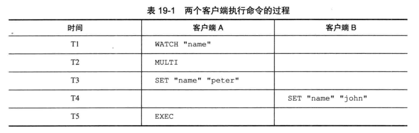

* 在时间T4，**客户端 B 修改了 "name" 键的值**
* 当客户端 **A** 在 T5 执行 **EXEC** 命令时，服务器会发现 **WATCH**监视的键"name"已经被修改
* 因此服务器拒绝执行客户端 **A** 的事务，并向客户端 **A** 返回空回复


#### 2.1 监视数据库键

每个 Redis 数据库都保存着一个 **watched_keys** 字典

* 字典的**键**是某个被 **watch** 命令监视的数据库键
* 字典的**值**则是一个链表链表中记录了所有监视这个数据库键的客户端

```c++
typedef struct redisDb{
    ....
    // 正在被 WATCH 命令监视的键
    dict *watched_keys;
    ....
}
```

举例

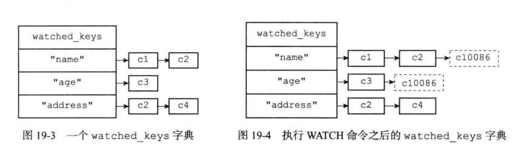


#### 2.2 监视机制的触发

所有对数据库进行修改的命令，比如 **SET、 LPUSE、SADD、ZREM、DEL、 FLUSHDB** 等等

* 在执行之后都会调用 **multi.c / touchWatchkey 函数**对 **watched_keys** 字典进行检查
* 查看是否有客户端正在监视刚刚被命令修改过的数据库键
* 如果有的话，那么 **touchWatchKey** 函数会将监视被修改键的客户端的 **REDIS_DIRTY_CAS** 标识打开
    * 表示该客户端的事务安全性已经被破坏


### 3、事务的 ACID 性质

#### 3.1 原子性

* 原子性指的是
    * 数据库将事务中的多个操作当作一个整体来执行
    * 服务器要么就执行事务中的所有操作，要么就一个操作也不执行


Redis 的事务和传统的关系型数据库事务的最大区别在于， **Redis不支持事务回滚机制**

* 即使事务队列中的某个命令在执行期间出现了错误，整个事务也会继续执行下去
* 直到将事务队列中的所有命令都执行完毕为止


Redis的作者在事务功能的文档中解释说

* 不支持事务回滚是因为这种复杂的功能和Redis追求简单高效的设计主旨不相符
* 并且他认为，Redis 事务的执行时错误通常都是编程错误产生的
* 这种错误通常只会出现在开发环境中，而很少会在实际的生产环境中出现
* 所以他认为没有必要为 Redis开发事务回滚功能


#### 3.2 一致性

一致性指的是

* 如果数据库在执行事务之前是一致的
* 那么在事务执行之后，无论事务是否执行成功，数据库也应该仍然是一致的

“一致” 指的是

* 数据符合数据库本身的定义和要求，没有包含非法或者无效的错误数据


##### 1、入队错误

如果一个事务在人队命令的过程中，出现了命令不存在，或者命令的格式不正确等情况

* 那么 Redis 将拒绝执行这个事务

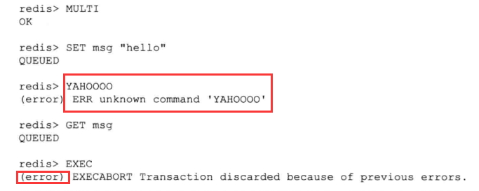


##### 2、执行错误

事务还可能在执行的过程中发生错误

* 即使在事务的执行过程中发生了错误
* 服务器也不会中断事务的执行
* 它会继续执行事务中余下的其他命令，并且已执行的命令不会被出错的命令影响

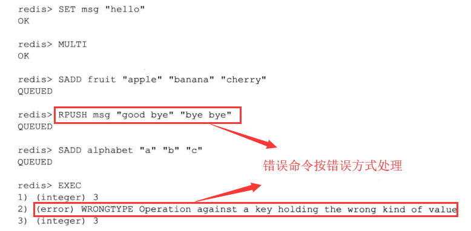


##### 3 服务器停机

如果Redis 服务器在执行事务的过程中停机，那么根据服务器所使用的持久化模式，可能有以下情况出现

* 如果服务器运行在无持久化的内存模式下
    * 那么重启之后的数据库将是空白的，因此数据总是一致的
* 如果服务器运行在 **RDB** 模式下，那么在事务中途停机不会导致不一致性
    * 因为服务器可以根据现有的 **RDB** 文件来恢复数据，从而将数据库还原到一个一致的状态
* 如果服务器运行在 **AOF** 模式下，那么在事务中途停机不会导致不一致性
    * 因为服务器可以根据现有的 **AOF** 文件来恢复数据，从而将数据库还原到一个一致的状态


#### 3.3 隔离性

事务的隔离性指的是

* 即使数据库中有多个事务并发地执行
* 各个事务之间也不会互相影响，并且在并发状态下执行的事务和串行执行的事务产生的结果完全相同

因为 Redis 使用单线程的方式来执行事务（以及事务队列中的命令），并且服务器保证，在执行事务期间不会对事务进行中断，因此，Reds的事务总是以串行的方式运行的，并且事务也总是具有隔离性的


#### 3.4 耐久性

事务的耐久性指的是

* 当一个事务执行完毕时
* 执行这个事务所得的结果已经被保存到永久性存储介质（比如硬盘）里面了
* 即使服务器在事务执行完毕之后停机，执行事务所得的结果也不会丢


因为 Redis 的事务不过是简单地用队列包裹起了一组 Redis命令

* Redis 并没有为事务提供任何额外的持久化功能
* 所以 Redis事务的耐久性由 Redis所使用的持久化模式决定


## 三、排序

Redis的 **SORT** 命令可以对列表键、集合键或者有序集合键的值进行排序


### 1、sort  key 命令的实现


```shell
redis> RPUSH numbers 3 1 2
```

服务器执行 SORT  numbers 命令的详细步骤如下

1. 创建一个和 **numbers** 列表长度相同的数组，该数组的每个项都是一个 **redis.h / redisSortObject** 结构

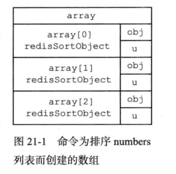

2. 遍历数组
    * 将各个数组项的 **obj** 指针分别指向 **numbers** 列表的各个项
    * 构成 **obj** 指针和列表项之间的一对一关系

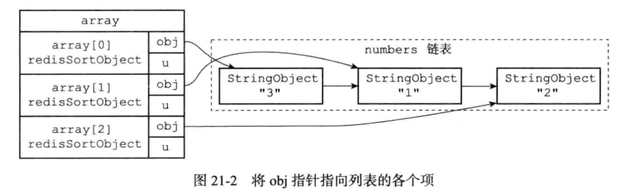

3. 遍历数组
    * 将各个 **obj** 指针所指向的列表项转换成个 **double** 类型的浮点数
    * 并将这个浮点数保存在相应数组项的 **u.score** 属性里面

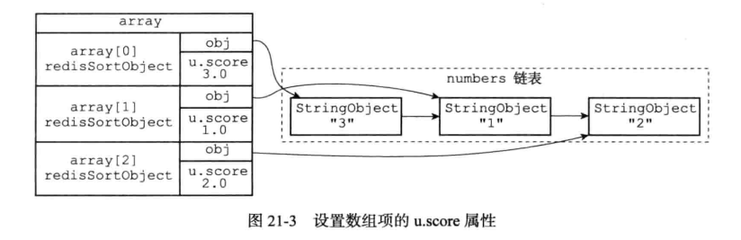

4. 根据数组项 **u.score** 属性的值，对数组进行数字值排序
    * 排序后的数组项按 **u.score** 属性的值从小到大排列

5. 遍历数组，将各个数组项的 obj 指针所指向的列表项作为排序结果返回给客户端

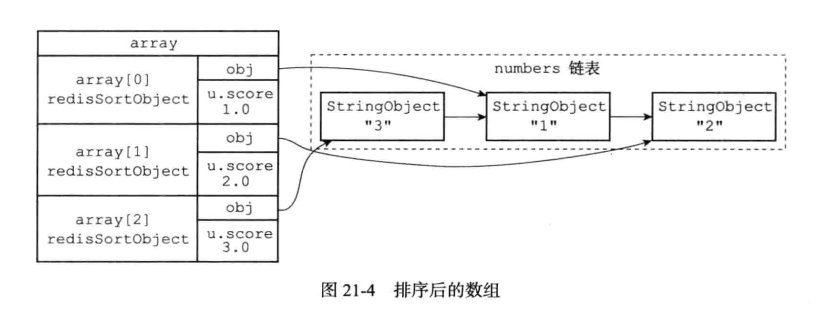


### 2、alpha 选项的实现

通过使用 **ALPHA** 选项

* **SORT** 命令可以对**包含字符串值**的键进行排序

```c++
SORT <key> ALPHA
```

排序过程和 **sort** 的实现差不多


### 3、ASC、DESC 选项

排序默认是 ASC：升序排列

DESC 选项：降序排列

```c++
sort <key> DESC // 降序
```


### 4、BY 选项

在默认情况下

* **SORT** 命令使用被排序键包含的元素作为排序的权重，元素本身决定元素在排序之后所处的位置

通过使用 **BY** 选项

* **SORT** 命令可以**指定**某些字符串键、或者某个哈希键**所包含的某些域来作为元素的权重**，对一个键进行排序

```c++
SADD fruits "apple" "banana" "cherry"
```

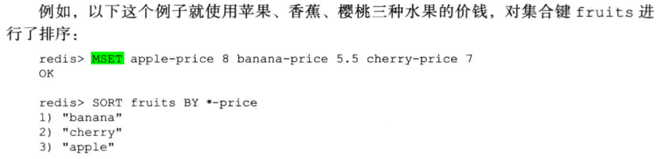


服务器执行 **sort  fruits  BY  *-price** 命令的详细步骤如下

1. 创建一个 **redisSortObject** 结构数组，数组的长度等于 **fruits** 集合的大小
2. 遍历数组，将各个数组项的 **obj** 指针分别指向 **fruits** 集合的各个元素
3. 遍历数组，根据各个数组项的 obj 指针所指向的集合元素，以及 BY 选项所给定的模式 *-price，查找相应的权重键
    * 对于 **"apple"** 元素，查找程序返回权重键 **"apple-price"**
    * 对于 **"banana"** 元素，查找程序返回权重键 **"banana-price"**
    * 对于 **"cherry"** 元素，查找程序返回权重键 **"cherry-price"**
4. 将各个权重键的值转换成一个 double 类型的浮点数，然后保存在相应数组项的 u.score 属性里面
    * **"apple"** 元素的权重键 **"apple-price"** 的值转换之后为 **8.0**
    * **"banana"** 元素的权重键 **"banana-price**" 的值转换之后为 **5.5**
    * **"cherry"** 元素的权重键 **"cherry-prIce"** 的值转换之后为 **7.0**

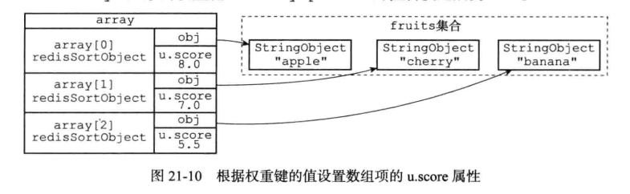

5. 以数组项 u.score 属性的值为权重，对数组进行排序


### 5、带有 alpha 选项的 BY 选项

BY 选项默认假设**权重键保存的值为==数字值==**

* 如果权重键保在的是**字符串值**的话
* 那么就需要在使用 **BY** 选项的同时，配合使用 **ALPHA** 选项

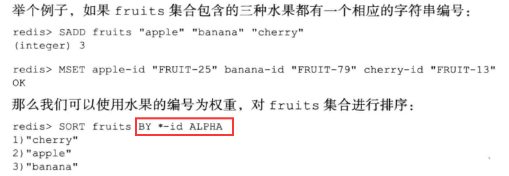


### 6、limit 选项

在默认情况下

* SORT 命令总会将排序后的**所有元素**都返回给客户端

通过LIMT选项

* 我们可以让 SORT 命令只返回其中**一部分**已排序的元素

**LIMIT** 选项的格式为 **LIMIT  offset  count** 

* **offset** 参数表示要跳过的已排序元素数量（从第几个开始）
* **count** 参数表示跳过给定数量的已排序元素之后，要返回的已排序元素数量

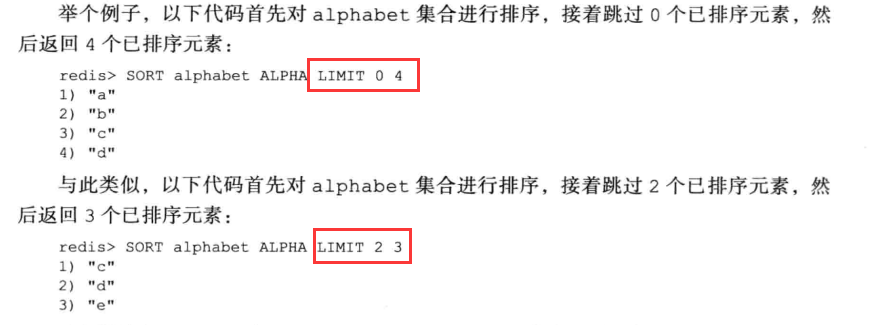


### 7、get 选项

在默认情况下

* **SORT** 命令在对键进行排序之后，总是返回被排序**键本身所包含的元素**

通过使用 **GET** 选项

* 我们可以让 **SORT** 命令在对键进行推序之后
* 根据被排序的元素、以及 **GET** 选项所指定的模式，查找并返回某些**键本身的值**

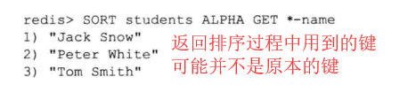


### 8、store 选项

在默认情况下

* **SORT** 命令只向客户端返回排序结果，而**不保存排序结果**

通过使用 **STORE** 选项

* 我们可以将推序结果**保存在指定的键里面**，并在有需要时重用这个排序结果

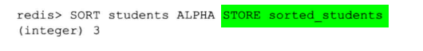

* 排序完成之后就会将元素通过命令压入指定的键中


### 9、多个选项的执行顺序

如果按照选项来划分的话，**SORT** 命令中选项的执行顺序可以分为以下四步

1. 排序
    * 在这一步，命令会使用 **ALPHA、ASC、DESC、BY** 这几个选项
    * 对输入键进行排序，并得到一个排序结果集
2. 限制排序结果集的长度
    * 在这一步，命令会使用 **LIMIT** 选项，对排序结果集的长度进行限制
    * 只有 **LIMIT** 选项指定的那部分元素会被保留在排序结果集中
3. 获取外部键
    * 在这一步，命令会使用 **GET** 选项，根据排序结果集中的元素，以及 **GET** 选项指定的模式
    * 查找并获取指定键的值，并用这些值来作为新的排序结果集
4. 保存排序结果集
    * 在这一步，命令会使用 **STORE** 选项，将排序结果集保存到指定的键上面去
5. 向客户端返回排序结果集
    * 在最后这一步，命令遍历排序结果集，并依次向客户端返回排序结果集中的元素

在以上这些步骤中，后一个步骤必须在前一个步骤完成之后进行


#### 9.1 选项的位置

* 使用 **SORT** 命令时
    * 除了**GET** 选项之外，改变选项的摆放顺序并不会影响 **SORT** 命令执行这些选项的顺序
    * 如果有多个 **GET** 选项，选项之间的相对位置如果变化，结果是不一样的


## 四、二进制位数组

Redi 提供了**setbit、getbit、bitcount、bitop** 四个命令用于处理**二进制位数组**

**SETBIT**

* 该命令用于为**位数组**指定偏移量上的二进制位设置值，位数组的偏移量从 0 开始计数
* 而二进制位的值则可以是 0 或者 1

```c++
setbit bit 0 1   # 0000 0001
```

**GETBIT**

* 用于获取**位数组**指定偏移量上的二进制位的值

```c++
GETBIT bit 0     #0000 1000
```

**BITCOUNT**

* 用于统计位数组里面，**值为 1 的二进制位的数量**

```c++
redis> BITCOUNT bit    # 0000 1000
（integer）1
```

**BITOP**

* **BITOP** 命令既可以对多个位数组进行 **按位与（and）、按位或（or）、按位异或（xor）、按位取反（not）**

```c++
BITOP AND and-result x y z
BITOP OR   or-result x y z
BITOP XOR  or-result x y z
BITOP NOT  not-value value
```


### 1、位数组的表示

Redis 使用**字符串对象来表示位数组**

* 因为字符串对象使用的 **SDS** 数据结构是二进制安全的
* 所以程序可以直接使用 **SDS** 结构来保存位数组，并使用 **SDS** 结构的操作函数来处理位数组

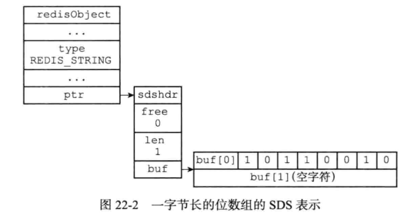

注意

* **buf** 数组保存位数组的**顺序和我们平时书写位数组的顺序是完全相反的**（正确的顺序是反过来）


### 2、getbit

**GETBIT** 命令的执行过程如

1. 计算 **byte = offset ÷ 8**
    * **byte** 值记录了 **offset** 偏移量指定的二进制位保存在位数组的**哪个字节**
2. 计算 **bit =( offset mod 8 ) + 1**
    * **bit** 值记录了 **offset** 偏移量指定的二进制位是 **byte** 字节的**第几个二进制位**
3. 根据 byte 值和 bit 值
    * 在位数组（bitarray）中定位 **offset** 偏移量指定的二进制位，并返回这个位的值


### 3、setbit

**SETBIT**

* 用于将位数组（bitarray）在 **offset** 偏移量上的二进制位的值设置为 **value**
* 并向客户端返回二进制位**被设置之前的==旧值==**

计算过程和 **getbit** 类似

* **如果计算出来的 byte 大于当前字节长度，则需要先扩充位数组大小**


### 4、bitcount

**BITCOUNT**

* 用于统计给定位数组为 1 的二进制位的数量

#### 4.1 算法一：直接遍历

实现 **BITCOUNT** 命令最简单直接的方法

* 遍历位数组中的每个二进制位，并在遇到值为 1 的二进制位时，将计数器的值增一

遍历算法虽然实现起来简单，但效率非常低

* **100MB 的数据需要执行 8 亿次**


#### 4.2 算法二：查表

优化检查操作的一个办法是使用查表法

* 对于一个有限集合来说，集合元素的**排列方式**是有限的
* 而对于一个有限长度的位数组来说，它能表示的**二进制位排列也是有限的**


根据这个原理，我们可以**创建一个表**

* 表的**键**为**某种排列**的位数组
* 表的**值**则是相应位数组中，**值为 1 的二进制位的数量**


我们只需执行一次查表操作，就可以检查 8 个二进制位

* 和之前介绍的遍历算法相岀，**查表法的效率提升了 8 倍**
* 如果我们将表键的大小扩展为 **16** 位，那么每次查表就可以处理 **16** 个二进制位


缺点：因为査表法的实际效果会受到**内存**和**缓存**两方面因素的限眚

* 内存
    * 创建键长为 8 位的表仅需数百个字节
    * 创建键长为 16 位的表也仅需数百个 KB
    * 但创建键长为 32 位的表却需要十多个 GB

* 缓存
    * 对于固定大小的 CPU 缓存来说，创建的表格越大，CPU 缓存所能保存的内容相比整个表格的比例就越少
    * 查表时出现缓存不命中的情况就会越高
    * 缓存的换入和换出操作就会越频繁，最终影响查表法的实际效率


#### 4.3 算法三：variable-precision SWAR 算法

**BITCOUN** 命令要解决的问题—统计一个位数组中非 0 二进制位的数量，在数学且被称为 "**计算汉明重量**"

 **variable-precision SWAR** 算法

* 该算法通过一系列位移和位运算操作
* 可以在常数时间内计算多个字节的汉明重量，并且不需要使用任何额外的内存

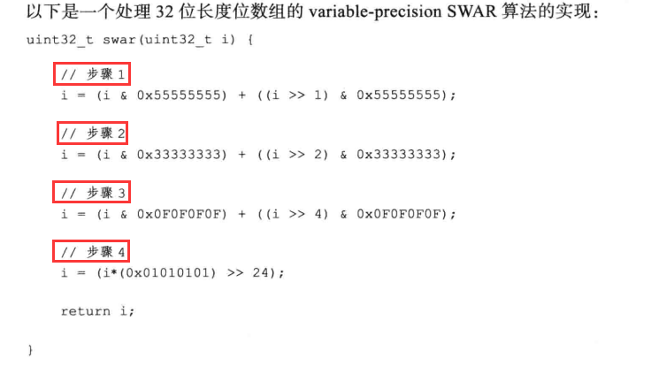

步骤 1

* 计算出的值 i 的二进制表示
    * 可以按每 **2** 个二进制位为一组进行分组，各组的**十进制**表示就是该组的汉明重量

步骤 2

* 计算出的值 i 的二进制表示
    * 可以按每 **4** 个二进制位为一组进行分组，各组的**十进制**表示就是该组的汉明重量

步骤 3

* 计算出的值 i 的二进制表示
    * 可以按每 **8** 个二进制位为一组进行分组，各组的**十进制**表示就是该组的汉明重量

步骤 4

```c++
i * 0x01010101 语句
	计算出 bitarray 的汉明重量并记录在二进制位的最高八位
>>24 语句
通过右移运算，将 bitarray 的汉明重量移动到最低八位，得出的结果就是 bitarray的汉明重量
```


优点

* **swar** 函数每次执行可以计算 32 个二进制位的汉明重量
    * 它比之前介绍的遍历算法要快32倍
    * 比键长为8位的查表法快4倍
    * 比键长为16位的查表法快2倍
* 并且因为 **swar** 函数是单纯的计算操作，所以它无须像査表法那样，使用额外的内存
* 因为 **swar** 函数是一个常数复杂度的操作
    * 所以我们可以按照自己的需要，在一次循环中**多次执行 swar**
    * 从而按倍数提升计算汉明重量的效率


#### 4.4 Redis 的实现方式

BITCOUNT命令的实现用到了**查表**和 **variable-precision SWAR**两种算法

* 查表算法使用**键长为8位的表**
    * 表中记录了从 00000000 到 1111111 在内的所有二进制位的汉明重量
* **variable-precision SWAR**算法
    * **BITCOUNT** 命令在每次循环中载入**128**个二进制位
    * 然后调用四次 32 位 **variable-precision SWAR**算法来计算这128个二进制位的汉明重量

在执行 **BITCOUNT** 命令时，程序会根据**未处理的二进制位的数量**来决定使用那种算法

* 如果未处理的二进制位的数量大于等于128位
    * 那么程序使用 **variable-precision SWAR**算法来计算二进制位的汉明重量
* 如果未处理的二进制位的数量小于128位
    * 那么程序使用査表算法来计算二进制位的汉明重量


## 五、慢查询日志

Redis 的慢査询日志功能

* 用于记录执行时间超过绐定时长的命令请求
* 用户可以通过这个功能产生的日志来监视和优化查询速度


服务器配置有两个和慢查询日志相关的选项

* **slowlog-loq-slower-than**
    * 选项指定执行时间超过多少微秒的命令请求会被记录到日志上
* **slowlog-max-len**
    * 指定服务器最多保存多少条慢查询日志


**slowlog  get 命令**

* 查看服务器所保存的慢查询日志


### 1、慢查询日志保存方式

服务器使用先进先出的方式保在多条慢查询日志

* 当命令条数超出设定值时，删除保存的旧命令


## 六、监视器

通过执行 **MONITOR** 命令

* 客户端可以将自己变为一个监视器
* 实时地接收并**打印出服务器当前处理的命令请求的相关信息**


每当一个客户端向服务器发送一条命令请求时

* 服务器除了会处理这条命令请求之外
* 还会将关于这条命令请求的信息发送给所有监视器

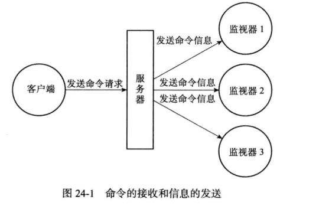


#### 1、实现

服务器在每次处理命令请求之前，都会调用 **replicationFeedMonitors** 函数

* 由这个函数将被处理的命令请求的相关信息发送给各个监视器


