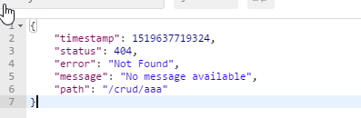
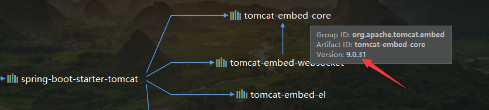

# SpringBoot 与 Web 开发

## SpringBoot 对静态资源的映射规则

#### 探究 WebMvcAutoConfiguration 类中的 addResourceHandlers 方法

```java
public void addResourceHandlers(ResourceHandlerRegistry registry) {
    if (!this.resourceProperties.isAddMappings()) {
        logger.debug("Default resource handling disabled");
    } else {
        Duration cachePeriod = this.resourceProperties.getCache().getPeriod();
        CacheControl cacheControl =this.resourceProperties.getCache()
            .getCachecontrol().toHttpCacheControl();
        if (!registry.hasMappingForPattern("/webjars/**")) {
            this.customizeResourceHandlerRegistration(registry
        .addResourceHandler(new String[]{"/webjars/**"})
        .addResourceLocations(new String[]{"classpath:/META-INF/resources/webjars/"})
        .setCachePeriod(this.getSeconds(cachePeriod)).setCacheControl(cacheControl));
        }
        String staticPathPattern = this.mvcProperties.getStaticPathPattern();
        if (!registry.hasMappingForPattern(staticPathPattern)) {
            this.customizeResourceHandlerRegistration(registry
          .addResourceHandler(new String[]{staticPathPattern})
          .addResourceLocations(WebMvcAutoConfiguration                                         .getResourceLocations(this.resourceProperties.getStaticLocations()))
          .setCachePeriod(this.getSeconds(cachePeriod))
          .setCacheControl(cacheControl));
        }
    }
}
// 欢迎页
@Bean
public WelcomePageHandlerMapping welcomePageHandlerMapping(ApplicationContext                                                                    applicationContext) {
    WelcomePageHandlerMapping welcomePageHandlerMapping = 
        new WelcomePageHandlerMapping(
        new TemplateAvailabilityProviders(applicationContext), 
        applicationContext, 
        this.getWelcomePage(), 
        this.mvcProperties.getStaticPathPattern());
    welcomePageHandlerMapping.setInterceptors(this.getInterceptors());
    return welcomePageHandlerMapping;
}

// 图标
@Configuration
@ConditionalOnProperty(value = {"spring.mvc.favicon.enabled"},matchIfMissing = true)
public static class FaviconConfiguration implements ResourceLoaderAware {
    private final ResourceProperties resourceProperties;
    private ResourceLoader resourceLoader;

    public FaviconConfiguration(ResourceProperties resourceProperties) {
        this.resourceProperties = resourceProperties;
    }

    public void setResourceLoader(ResourceLoader resourceLoader) {
        this.resourceLoader = resourceLoader;
    }

    @Bean
    public SimpleUrlHandlerMapping faviconHandlerMapping() {
        SimpleUrlHandlerMapping mapping = new SimpleUrlHandlerMapping();
        mapping.setOrder(-2147483647);
        mapping.setUrlMap(
           Collections.singletonMap("**/favicon.ico", this.faviconRequestHandler()));
        return mapping;
    }

    @Bean
    public ResourceHttpRequestHandler faviconRequestHandler() {
        ResourceHttpRequestHandler requestHandler = new ResourceHttpRequestHandler();
        requestHandler.setLocations(this.resolveFaviconLocations());
        return requestHandler;
    }

    private List<Resource> resolveFaviconLocations() {
        String[] staticLocations = WebMvcAutoConfiguration.getResourceLocations(
            this.resourceProperties.getStaticLocations());
        List<Resource> locations = new ArrayList(staticLocations.length + 1);
        Stream var10000 = Arrays.stream(staticLocations);
        ResourceLoader var10001 = this.resourceLoader;
        var10001.getClass();
        var10000.map(var10001::getResource).forEach(locations::add);
        locations.add(new ClassPathResource("/"));
        return Collections.unmodifiableList(locations);
    }
}
```

* 所有的 **/webjars/****，都去 **classpath:/META-INF/resources/webjars/** 下找资源

    * webjars：**以 jar 包的方式引入静态资源**，以访问 jquery 包下的资源为例

    

* 访问方式：==**localhost:8080/webjars/jquery/3.3.1/jquery.js**== 

```xml
<dependency>
    <groupId>org.webjars</groupId>
    <artifactId>jquery</artifactId>
    <version>3.3.1</version>
</dependency>
```

* 访问自己的资源

```java
// 可以设置和静态资源有关的参数
@ConfigurationProperties(prefix = "spring.resources",ignoreUnknownFields = false)
public class ResourceProperties {}
```

* ==/**：访问当前项目的任何资源== 
* 访问方式：假设要访问 static 中的 /static/asserts/js/Chart.min.js 文件
    * localhost:8080/asserts/js/Chart.min.js
    * **==不同加静态资源的文件夹名（resources、static、public）==** 

```
静态资源文件夹
"classpath:/META-INF/resources/"：springboot/src/main/resources/META-INF/resources
"classpath:/resources/"         ：springboot/src/main/resources/resources
"classpath:/static/"            ：springboot/src/main/resources/static
"classpath:/public/"            ：springboot/src/main/resources/public
"/"：当前项目的根路径             ：springboot/
```

* 导入静态资源后刷新一下
* ==欢迎页面：静态资源下的所有 index.html，被 "/**" 映射==
    * **localhost:8080/ ：会找 “/**”  下所有的 index.html 页面
* 图标
    * 所有的 =="**/favicon.ico**"== 都是在静态资源文件夹下找

## 模板引擎


### Thymeleaf

#### 1、用法

* 引入 thymeleaf

```xml
<dependency>
    <groupId>org.springframework.boot</groupId>
    <artifactId>spring-boot-starter-thymeleaf</artifactId>
</dependency>

// 修改版本方法
<properties>
    <thymeleaf.version>3.0.9.RELEASE</thymeleaf.version>
    <!-- 布局功能的支持程序  thymeleaf3主程序  layout2以上版本 -->
    <!-- thymeleaf2   layout1-->
    <thymeleaf-layout-dialect.version>2.2.2</thymeleaf-layout-dialect.version>
</properties>
```


```java
@ConfigurationProperties(prefix = "spring.thymeleaf")
public class ThymeleafProperties {
    private static final Charset DEFAULT_ENCODING;
    // 前缀、后缀
    public static final String DEFAULT_PREFIX = "classpath:/templates/";
    public static final String DEFAULT_SUFFIX = ".html";
    private boolean checkTemplate = true;
// 只要我们把 HTML 页面放在  classpath:/templates/ 下，thymeleaf 就可以帮我们渲染了
```

* 使用

    1. 导入 thymeleaf 的名称空间

    ```html
    <html lang="en" xmlns:th="http://www.thymeleaf.org">
    ```

    2. 示例

    ```html
    <!DOCTYPE html>
    <html lang="en" xmlns:th="http://www.thymeleaf.org">
    <head>
        <meta charset="UTF-8">
        <title>Title</title>
    </head>
    <body>
    <h1>成功</h1>
    <!--将 th:text 中的内容设置为 ${hello}-->
    <div th:text="${hello}">显示欢迎信息</div>
    </body>
    </html>
    ```

#### 2、语法规则

* th:属性名
    * 可以用来代替 html 中原有属性的默认值
* 列表


* 表达式语法

```properties
Simple expressions:
    Variable Expressions: ${...}   获取变量的值：使用的是 OGNL 表达式
            1): 获取对象属性的值、调用方法
            2): 使用内置对象
            #ctx : the context object.
            #vars: the context variables.
            #locale : the context locale.
            #request : (only in Web Contexts) the HttpServletRequest object.
            #response : (only in Web Contexts) the HttpServletResponse object.
            #session : (only in Web Contexts) the HttpSession object.
            #servletContext : (only in Web Contexts) the ServletContext object.
            3): 使用内置的工具对象
#execInfo : information about the template being processed.
#messages : methods for obtaining externalized messages inside variables expressions, 	in the same way as they
	would be obtained using #{…} syntax.
#uris : methods for escaping parts of URLs/URIs
#conversions : methods for executing the configured conversion service (if any).
#dates : methods for java.util.Date objects: formatting, component extraction, etc.
#calendars : analogous to #dates , but for java.util.Calendar objects.
#numbers : methods for formatting numeric objects.
#strings : methods for String objects: contains, startsWith, prepending/appending, 		etc.
#objects : methods for objects in general.
#bools : methods for boolean evaluation.
#arrays : methods for arrays.
#lists : methods for lists.
#sets : methods for sets.
#maps : methods for maps.
#aggregates : methods for creating aggregates on arrays or collections.
#ids : methods for dealing with id attributes that might be repeated (for example, as a result of an iteration).
    Selection Variable Expressions: *{...}
    Message Expressions: #{...}
    Link URL Expressions: @{...}
    Fragment Expressions: ~{...}
Literals: 字面量
    Text literals: 'one text' , 'Another one!' ,…
    Number literals: 0 , 34 , 3.0 , 12.3 ,…
    Boolean literals: true , false
    Null literal: null
    Literal tokens: one , sometext , main ,…
Text operations:文本操作
    String concatenation: +
    Literal substitutions: |The name is ${name}|
Arithmetic operations:数学运算
    Binary operators: + , - , * , / , %
    Minus sign (unary operator): -
Boolean operations:布尔运算
    Binary operators: and , or
    Boolean negation (unary operator): ! , not
Comparisons and equality:比较运算
    Comparators: > , < , >= , <= ( gt , lt , ge , le )
    Equality operators: == , != ( eq , ne )
Conditional operators:条件判断
    If-then: (if) ? (then)
    If-then-else: (if) ? (then) : (else)
    Default: (value) ?: (defaultvalue)
Special tokens:
    Page 17 of 104No-Operation: _
```


## SpringMVC 自动配置

https://docs.spring.io/spring-boot/docs/2.2.6.RELEASE/reference/htmlsingle/#boot-features-developing-web-applications

自动配置在Spring的默认值之上添加了以下功能：

- 包含`ContentNegotiatingViewResolver`和`BeanNameViewResolver`
    - 自动配置视图解析器
    - **ContentNegotiatingViewResolver**：组合视图解析器
        - ==**我们可以定制自己的视图解析器，ContentNegotiatingViewResolver 会自动将其组合**==
- 支持静态资源，包括对WebJars的支持
    - 静态`index.html`支持。
    - 定制`Favicon`支持
- 自动注册`Converter`，`GenericConverter`和`Formatter` beans类。
    - **Converter**：转换器
        - 提交数据时将数据与对应的实体类进行转换
    - **Formatter**：格式化器
        - 将字符串转化为日期
        - **==可以定制自己的格式化器，只需要将其添加到容器中即可==**
- 支持`HttpMessageConverters`
    - **HttpMessageConverters**：SpringMVC 中用来转换 Http 请求和响应
        - 例如，**将一个 User  对象转换成 json 数据**
    - **==可以定制自己的 HttpMessageConverters，只需将其添加到容器中即可==**
- 自动注册`MessageCodesResolver`
    - 定义错误代码生成规则
- 自动使用`ConfigurableWebBindingInitializer` bean
    - **==可以配置一个  ConfigurableWebBindingInitializer，只需将其添加到容器中即可==**

## 扩展 SpringMVC

* ==编写一个配置类（@Configuration），是 **WebMvcConfigurerAdapter** 类型，不能标注 @**EnableWebMvc**==
    * **既保留了所有的自动配置，也能扩展我们的配置**

```java
// 使用 WebMvcConfigurer 来扩展 SpringMVC
@Configuration
public class MyMvcConfig implements WebMvcConfigurer {
    @Override
    public void addViewControllers(ViewControllerRegistry registry) {
        // 浏览器发送 /tfc 请求也会到 success.html 页面
        registry.addViewController("/tfc").setViewName("success");
    }
}
```

* 原理

    *  **WebMvcAutoConfiguration** 是 SpringMVC 的自动配置类
    * 在做其他自动配置时会导入 **@Import({WebMvcAutoConfiguration.EnableWebMvcConfiguration.class})**

    ```java
    @Configuration
    public class DelegatingWebMvcConfiguration extends WebMvcConfigurationSupport {
        private final WebMvcConfigurerComposite configurers = new 
                                                       WebMvcConfigurerComposite();
    ```

    ```java
    @Autowired(required = false)  // 从容器中获取所有的 WebMvcConfigurer
    public void setConfigurers(List<WebMvcConfigurer> configurers) {
        if (!CollectionUtils.isEmpty(configurers)) {
            this.configurers.addWebMvcConfigurers(configurers);
            // 一个参考实现：将所有的 WebMvcConfigurer 相关的配置都调用一遍
            //public void addViewControllers(ViewControllerRegistry registry) {
            //    Iterator var2 = this.delegates.iterator();
            //    while(var2.hasNext()) {
            //        WebMvcConfigurer delegate = (WebMvcConfigurer)var2.next();
            //        delegate.addViewControllers(registry);
            //    }
        	//}
        }
    }
    ```

    * 所有的  WebMcConfigurer 都会一起起作用，自己配置的也会起作用

* 全面接管 SpringMC

    * **==标注了 @EnableWebMvc 之后，就只会用我们自定义的配置，自动配置失效==**

    ```java
    @Configuration
    @EnableWebMvc
    public class MyMvcConfig implements WebMvcConfigurer {
        @Override
        public void addViewControllers(ViewControllerRegistry registry) {
            // 浏览器发送 /tfc 请求也会到 success.html 页面
            registry.addViewController("/tfc").setViewName("success");
        }
    }
    ```

    * 原理

        ```java
        @Import({DelegatingWebMvcConfiguration.class})
        public @interface EnableWebMvc {}
        ```

        ```java
        @Configuration
        public class DelegatingWebMvcConfiguration extends WebMvcConfigurationSupport{}
        ```

        ```java
        @Configuration
        @ConditionalOnWebApplication(type = Type.SERVLET)
        @ConditionalOnClass({Servlet.class, DispatcherServlet.class, 
                             WebMvcConfigurer.class})
        
        @ConditionalOnMissingBean({WebMvcConfigurationSupport.class})
        
        @AutoConfigureOrder(-2147483638)
        @AutoConfigureAfter({DispatcherServletAutoConfiguration.class, TaskExecutionAutoConfiguration.class, ValidationAutoConfiguration.class})
        public class WebMvcAutoConfiguration {
        ```
        * 原因在于**==@ConditionalOnMissingBean({WebMvcConfigurationSupport.class})==**
            * 容器中没有 **WebMvcConfigurationSupport** 这个组件的时候，自动配置类才会生效
            * 若使用了 @EnableWebMvc ，则会导入该组件

## RestfulCRUD

* 默认访问首页

#### 国际化

* SpringMVC的做法
    * 编写国际化配置文件
    * 使用 ResourceBundleMessageSource 管理国际化资源文件
    * 在页面使用 fmt:message 来取出国际化内容

* SpringBoot 的做法

    * **编写国际化配置文件**，抽取页面需要的国际化消息

    
    * SpringBoot 自动配置好了国际化资源配置文件

        * 默认国际化文件的基础名是 message，需要在配置文件中更改一下

        * ```properties
            spring.messages.basename=i18n.login
            ```

    * 去页面获取国际化的值
      
        * 使用 #{...}

* 原理
    * 国际化 Locale（区域信息对象）
    * LocaleResolver（获取区域信息对象）

```java
@Bean
@ConditionalOnMissingBean
@ConditionalOnProperty(prefix = "spring.mvc",name = {"locale"})
public LocaleResolver localeResolver() {
    if (this.mvcProperties.getLocaleResolver() ==
        org.springframework.boot.autoconfigure.web.servlet
        .WebMvcProperties.LocaleResolver.FIXED) {
    	return new FixedLocaleResolver(this.mvcProperties.getLocale());
    } else {
        AcceptHeaderLocaleResolver localeResolver = new AcceptHeaderLocaleResolver();
        localeResolver.setDefaultLocale(this.mvcProperties.getLocale());
        return localeResolver;
    }
}
```

* 默认是根据**请求头**来获取区域信息 Locale 进行国际化

    * 编写一个 **LocaleResolver** 来定制我们自己需要的区域信息解析器

    ```java
    public class MyLocaleResolver implements LocaleResolver {
        @Override
        public Locale resolveLocale(HttpServletRequest request) {
            String l = request.getParameter("l");
            Locale locale = Locale.getDefault();
            if (!StringUtils.isEmpty(l)) {
                String[] strings = l.split("_");
                locale = new Locale(strings[0], strings[1]);
            }
            return locale;
        }
    
        @Override
        public void setLocale(HttpServletRequest request, HttpServletResponse response, Locale locale) {}
    }
    ```

    ```java
    @Bean
    public LocaleResolver localeResolver() {
        return new MyLocaleResolver();
    }
    ```

#### 登录

* 注意

    * 卡发期间要想实时生效，需要禁用模板引擎

    ```properties
    # 禁用模板引擎的缓存
    spring.thymeleaf.cache=false
    ```

    * 修改完页面后需要重新编译

* 登录错误提示

```html
<!--给出错误提示-->
<p style="color: red" th:text="${message}" th:if="${not #strings.isEmpty(message)}"/>
```

#### 拦截器进行登陆检查

* 目的：防止任意访问

```java
/**
 * 进行登陆检查
 */
public class LoginHandlerInterceptor implements HandlerInterceptor {
    // 目标方法执行之前
    @Override
    public boolean preHandle(HttpServletRequest request, HttpServletResponse response, Object handler) throws Exception {
        Object user = request.getSession().getAttribute("loginUser");
        if (user == null) {
            // 未登录
            request.setAttribute("message", "没有权限，请先登录");
            request.getRequestDispatcher("/index.html").forward(request, response);
            return false;
        }
        return true;
    }
}
```

```java
// 使用 WebMvcConfigurer 来扩展 SpringMVC
@Configuration
public class MyMvcConfig implements WebMvcConfigurer {
    @Override
    public void addViewControllers(ViewControllerRegistry registry) {
        // 浏览器发送 /tfc 请求也会到 success.html 页面
        registry.addViewController("/tfc").setViewName("success");
    }

    // 所有组件都会一起起作用，前提是要将组件添加到容器中
    @Bean
    public WebMvcConfigurer getWebMvcConfigurer() {
        return new WebMvcConfigurer() {
            @Override
            public void addViewControllers(ViewControllerRegistry registry) {
                registry.addViewController("/").setViewName("login");
                registry.addViewController("/index.html").setViewName("login");
                registry.addViewController("/main.html").setViewName("dashboard");
            }

            // 注册拦截器
            @Override
            public void addInterceptors(InterceptorRegistry registry) {
                // SpringBoot 已经做好了静态资源映射管理
                registry.addInterceptor(
                    new LoginHandlerInterceptor()).addPathPatterns("/**")
                  .excludePathPatterns("/index.html", "/", "/user/login");
            }
        };
    }
}
```

#### Restful CRUD 操作

* 与普通 CRUD 操作的比较

URI：  /资源名称/资源标识       HTTP请求方式区分对资源CRUD操作

|      | 普通CRUD（uri来区分操作） | RestfulCRUD       |
| ---- | ------------------------- | ----------------- |
| 查询 | getEmp                    | emp---GET         |
| 添加 | addEmp?xxx                | emp---POST        |
| 修改 | updateEmp?id=xxx&xxx=xx   | emp/{id}---PUT    |
| 删除 | deleteEmp?id=1            | emp/{id}---DELETE |

* 实验的请求架构;

    | 实验功能                             | 请求URI | 请求方式 |
    | ------------------------------------ | ------- | -------- |
    | 查询所有员工                         | emps    | GET      |
    | 查询某个员工(来到修改页面)           | emp/1   | GET      |
    | 来到添加页面                         | emp     | GET      |
    | 添加员工                             | emp     | POST     |
    | 来到修改页面（查出员工进行信息回显） | emp/1   | GET      |
    | 修改员工                             | emp     | PUT      |
    | 删除员工                             | emp/1   | DELETE   |

##### thymeleaf 公共页面元素抽取

```html
1、公共页面抽取
<div th:fragment="copy">
	&copy; 2011 The Good Thymes Virtual Grocery
</div>

2、引入公共片段
用法一：~{templatename::selector}      模板名::选择器
用法二：~{templatename::fragmentname}  模板名::片段名
	<div th:insert="~{footer :: copy}"></div>
	<div th:insert="footer :: copy"></div>（~ 可以省略）
行内写法需要加上 ~{}
```

1. 三种引入片段的 th 属性

**th:insert**：将公共片段整个插入到声明引入的元素中

**th:replace**：将声明引入的元素替换为公共片段

**th:include**：将被引入的片段的内容包含进这个标签

```html
<footer th:fragment="copy">
  &copy; 2011 The Good Thymes Virtual Grocery
</footer>

<div th:insert="footer :: copy"></div>
insert 效果
	<div>
    	<footer>
        	&copy; 2011 The Good Thymes Virtual Grocery
    	</footer>
	</div>
	
<div th:replace="footer :: copy"></div>
replace 效果
    <footer>
        &copy; 2011 The Good Thymes Virtual Grocery
    </footer>
	
<div th:include="footer :: copy"></div>
include 效果
    <div>
        &copy; 2011 The Good Thymes Virtual Grocery
    </div>
```

## 错误处理机制

### 1、SpringBoot 中的默认错误处理机制

* **浏览器**访问错误默认效果


* 其他**客户端**访问错误效果：返回一个 json 数据



### 2、原理

* 参照 **ErrorMvcAutoConfiguration** ：错误处理的默认配置

* 该配置类给容器中添加了以下组件

    * ```java
        DefaultErrorAttributes
        BasicErrorController
        ErrorPageCustomizer
        DefaultErrorViewResolver
        ```

* 过程

    * 一旦出现 4xx 或 5xx 的错误，**ErrorPageCustomizer** 就会生效，来到 **/error** 请求

        * 作用是定制错误的响应规则

        * ```java
            @Value("${error.path:/error}")
            private String path = "/error";
            ```

    * **BasicErrorController** 就会来处理 **/error** 请求

        ```java
        @Controller
        @RequestMapping({"${server.error.path:${error.path:/error}}"})
        public class BasicErrorController extends AbstractErrorController {
            
            // 产生 html 格式数据
            @RequestMapping(produces = {"text/html"})
            public ModelAndView errorHtml(HttpServletRequest request, HttpServletResponse response) {.....}
            
           // 产生 json 个数数据
           @RequestMapping
         public ResponseEntity<Map<String, Object>> error(HttpServletRequest request){}
            
        }
        ```

        * 通过**请求头**来识别使用哪个方法进行处理

            * 浏览器

                

            * 其他客户端

                

        * 响应页面，去哪个页面由 **DefaultErrorViewResolver** 来决定

            ```java
            // 去哪个页面作为错误页面；包含页面地址和页面内容
            ModelAndView modelAndView = this.resolveErrorView(request, response, status, model);
            
            protected ModelAndView resolveErrorView(HttpServletRequest request, HttpServletResponse response, HttpStatus status, Map<String, Object> model) {
                Iterator var5 = this.errorViewResolvers.iterator();
            
                ModelAndView modelAndView;
                do {
                    if (!var5.hasNext()) {
                        return null;
                    }
            
                    ErrorViewResolver resolver = (ErrorViewResolver)var5.next();
                    modelAndView = resolver.resolveErrorView(request, status, model);
                } while(modelAndView == null);
            
                return modelAndView;
            }
            ```

### 3、定制自定义错误页面

* 有模板引擎时
    * ==将错误页面命名为 **错误状态码.html** 放在 **template（模板引擎）下的 error 文件夹下**==
        * 我们可以以 **==4xx、5xx==** 作为这一类型错误的文件名，如果有精确的错误类型文件名（400.html）则优先使用
        * 错误页面能获取到的信息：**DefaultErrorAttributes**
            *  timestamp：时间戳
            *  status：状态码
            *  error：错误提示
            *  exception：异常对象
            *  message：异常信息
* 没有模板引擎时
    * 在静态资源文件夹下找，但不能动态获取信息
* 若以上文件都没有，则来到 SpringBoot 默认错误页面

### 自定义错误 json 数据

* 自定义异常返回 json 数据

```java
@ControllerAdvice
public class MyExceptionHandler {

    @ResponseBody
    @ExceptionHandler(UserNotExistException.class)
    public Map<String, Object> handleException(Exception e){
        Map<String,Object> map=new HashMap<>();
        map.put("code","user.notexist");
        map.put("message",e.getMessage());
        return map;
    }
}
```

* 缺点
    * 缺乏自适应（不能区分浏览器和客户端）
* 解决办法：**转发到 /error** 进行自适应

```java
@ExceptionHandler(UserNotExistException.class)
public String handleException(Exception e, HttpServletRequest request) {
    Map<String, Object> map = new HashMap<>();
    map.put("code", "user.notexist");
    map.put("message", e.getMessage());

    // 设置错误状态码
    request.setAttribute("javax.servlet.error.status_code", 500);
    return "forward:/error";
}
```

* 一定要设置错误状态码

## 配置嵌入式的 Servlet 容器

* SpringBoot 默认使用的嵌入 servlet 容器是 Tomcat



* 定制和修改默认的 servlet 容器

    1. 修改和 **server** 有关的配置（查看 **==ServerProperties==** 类）

    ```properties
    server.port=80801
    server.servlet.context-path=/crud
    
    server.tomcat.uri-encoding=UTF-8
    ```

    2. 编写一个嵌入式 servlet 容器定制器： ==**WebServerFactoryCustomizer<ConfigurableWebServerFactory>**==

    ```java
    @Bean
    public WebServerFactoryCustomizer<ConfigurableWebServerFactory> customizer(){
        return new WebServerFactoryCustomizer<ConfigurableWebServerFactory>() {
            // 定制嵌入式 Servlet 容器的相关配置
            @Override
            public void customize(ConfigurableWebServerFactory factory) {
            	factory.setPort(8083);
            }
        };
    }
    ```

### 配置三大组件 Servlet、FIlter、Listener

* 配置 Servlet

```java
public class MyServlet extends HttpServlet {
    // 处理 get 请求
    @Override
    protected void doGet(HttpServletRequest req, HttpServletResponse resp) 
                                           throws ServletException, IOException {
        doPost(req, resp);
    }

    @Override
    protected void doPost(HttpServletRequest req, HttpServletResponse resp) 
        									throws ServletException, IOException {
        resp.getWriter().write("Hello MyServlet");
    }
}

// 注册 Servlet
@Bean
public ServletRegistrationBean myServlet() {
    ServletRegistrationBean servletRegistrationBean = new ServletRegistrationBean(
        new MyServlet(), "/myServlet");
    return servletRegistrationBean;
}
```

* 配置 Filter

```java
// 注册 Filter
@Bean
public FilterRegistrationBean myFilter() {
    FilterRegistrationBean registrationBean = new FilterRegistrationBean();
    registrationBean.setFilter(new MyFilter());
    registrationBean.setUrlPatterns(Arrays.asList("/hello", "/myServlet"));
    return registrationBean;
}
```

* 配置 Listener

```java
// 注册 Listener
@Bean
public ServletListenerRegistrationBean myListener(){
    ServletListenerRegistrationBean registrationBean=
        new ServletListenerRegistrationBean(new MyListener());
    return registrationBean;
}
```


## 使用其他的内嵌 Servlet 容器

* SpringBoot 支持的 Servlet 容器
    * Tomcat（默认）、Jetty、Undertow


* 切换 servlet 容器（以切换 jetty 为例）

```xml
<dependency>
    <groupId>org.springframework.boot</groupId>
    <artifactId>spring-boot-starter-web</artifactId>
    <!--先排除 Tomcat 依赖-->
    <exclusions>
        <exclusion>
            <artifactId>spring-boot-starter-tomcat</artifactId>
            <groupId>org.springframework.boot</groupId>
        </exclusion>
    </exclusions>
</dependency>

<!--添加 jetty 依赖-->
<dependency>
    <groupId>org.springframework.boot</groupId>
    <artifactId>spring-boot-starter-jetty</artifactId>
</dependency>
```


