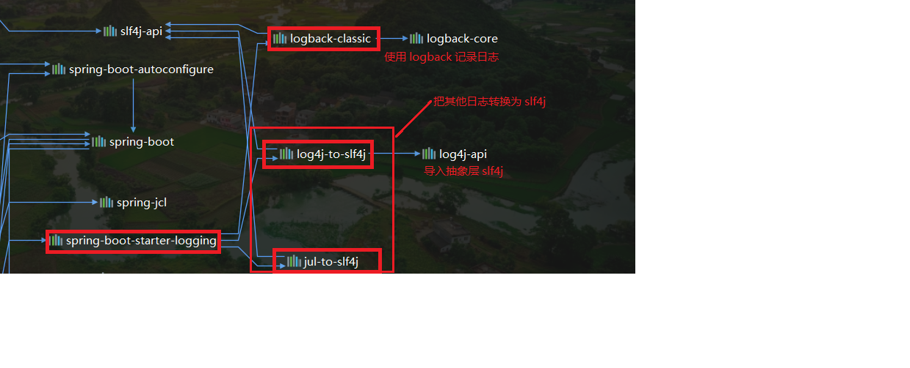

# SpringBoot 与日志

## SpringBoot 中的日志框架

* ==**SLF4j（抽象层） + Logback（实现层）**==


## SLF4j 的使用

#### 基本使用方式

* 使用的时候不要直接调用实现层的方法，而要调用抽象层的方法
* 导入 **slf4j** 和 **logback** 的 jar 包
* 示例

```java
import org.slf4j.Logger;
import org.slf4j.LoggerFactory;

public class HelloWorld {
  public static void main(String[] args) {
    Logger logger = LoggerFactory.getLogger(HelloWorld.class);
    logger.info("Hello World");
  }
}
```

*  **slf4j 只是一个抽象层，可以根据需要使用不同的实现，如下图所示**

    

* 每个日志实现框架都有自己的配置文件，使用 **slf4j** 后，**配置文件还是要做成实现框架的配置文件**

#### 统一日志使用

* 不同的框架可能使用不同的日志框架，不统一的话很容易出现问题
* 统一到 **slf4j** 的方法
    * 将系统中的其他日志框架的依赖全部删除
    * 用中间包来替换原有的日志框架
    * 导入 **slf4j** 其它的实现


#### SpringBoot 日志关系

基本依赖

```xml
<dependency>
      <groupId>org.springframework.boot</groupId>
      <artifactId>spring-boot-starter</artifactId>
      <version>2.1.13.RELEASE</version>
      <scope>compile</scope>
</dependency>
```

**SpringBoot** 用这个来做日志功能

```xml
<dependency>
    <groupId>org.springframework.boot</groupId>
    <artifactId>spring-boot-starter-logging</artifactId>
    <version>2.1.13.RELEASE</version>
    <scope>compile</scope>
</dependency>
```

底层依赖关系

* **SpringBoot** 的底层也是使用 **slf4j** 进行日志记录
* **SpringBoot** 也把其他的日志都换成了 **slf4j**



中间包的转换


* ==**SpringBoot 能自动适配所有日志，而且底层使用 slf4j + logback 的方式记录日志**==
* ==**使用其他框架的时候只需要把这个框架所依赖的日志框架移除就可以了**==


## 日志的使用

#### 1、默认配置

* **SpringBoot** 已经默认帮我们配置好了日志

#### 2、使用

```java
//日志记录器
private Logger logger = LoggerFactory.getLogger(getClass());
@Test
public void contextLoads() {
    // 日志的级别：trace < debug < info < warn < error
    logger.trace("************* trace 日志 **************");
    logger.debug("************* debug 日志 **************");
    logger.info("************** info 日志 ***************");
    logger.warn("************** warn 日志 ***************");
    logger.error("************* error 日志 **************");
}
```

* 日志的级别：**trace < debug < info < warn < error**

* SpringBoot **默认设置的级别是 info 级别**，即大于等于 info 级别的日志都能输出

    * 修改日志

        * 修改级别：**logging.level.com.tfc.logging=trace**
        * 修改日志输出位置： **logging.file=springboot.log**，不指定路径就在项目路径下

    * 指定自定义的日志配置文件

        * |     logging System     |                        可用配置文件名                        |
            | :--------------------: | :----------------------------------------------------------: |
            |        logback         | logback-spring.xml、logback-spring.groovy、logback.xml、logback.groovy |
            |         Log4j2         |                log4j2-spring.xml、log4j2.xml                 |
            | JDK(Java Util Logging) |                      logging.properties                      |

    * 官方推荐使用带 -spring 的配置文件名

        * 不带 -spring（logback.xml）的文件直接被日志框架加载
        * 带 -spring（logback-spring.xml）的文件是由 springboot 加载，可以使用一些 SpringBoot 中的功能


