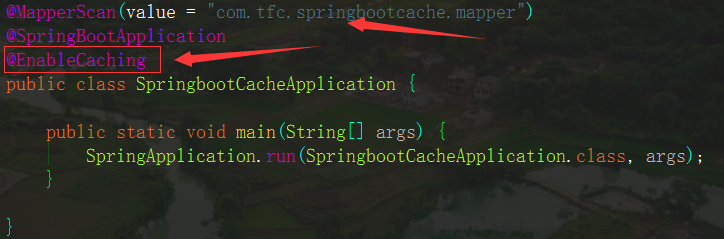
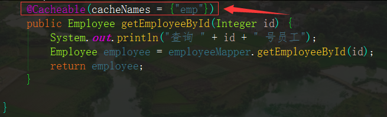
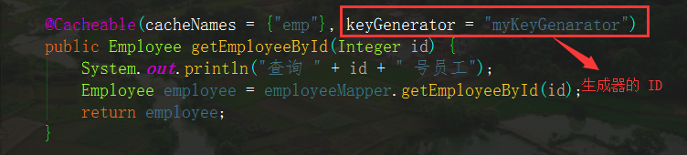
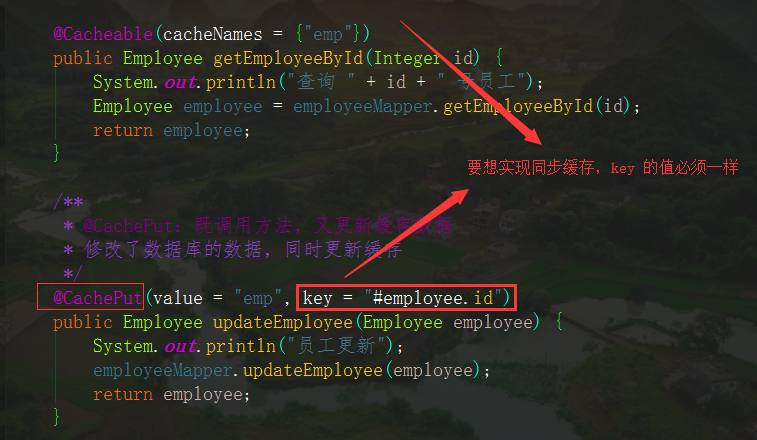
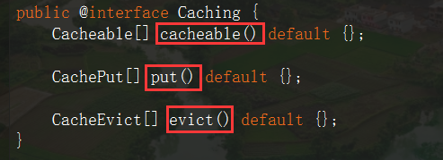
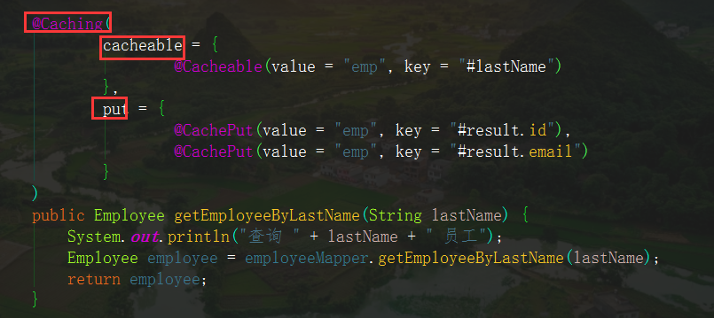
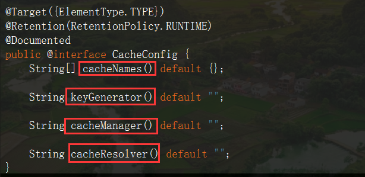
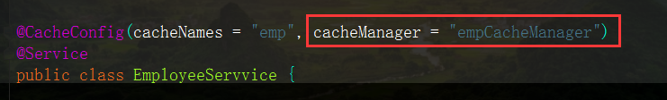
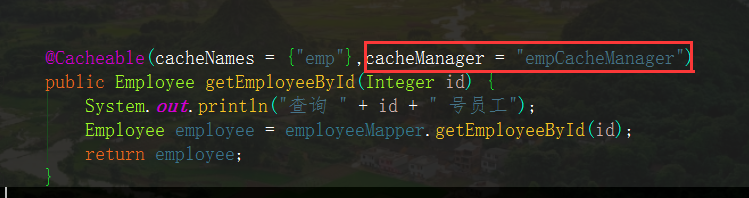
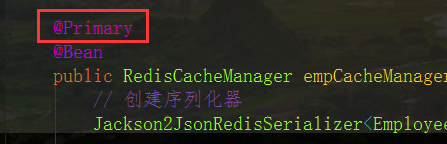

# SpringBoot 缓存

## 一、搭建基本环境

1、创建数据库表

2、创建 JavaBean（实体类）封装数据

3、整合 MyBatis 操作数据库

​	1）、配置数据源（配置文件中）

​	2）、创建配置文件或使用注解

​			1. 使用 @MapperScan 指定需要扫描的包




## 二、体验缓存

1、开启基于注解的缓存：**@EnableCaching**（在主类上使用该注解）

2、在 **Service** 层上的方法上使用注解：**@Cacheable、@CacheEvict、@CachePut** 



**@Cacheable** 用法

```java
/**
     * 将方法的结果进行缓存，以后请求相同的数据直接从缓存中取，不需要重复调用方法，节省时间
     * @Cacheable 的几个属性
     *      value/cacheNames：指定缓存组件的名字
     *          CacheManager 管理多个缓存组件，对缓存的真正的 CRUD 操作在 Cache 组件中
     *          每一个缓存组件有唯一一个名字
     *      key：缓存数据(键值对)时使用的 key，默认是使用方法参数的值
     *          可以使用 SpEL 表达式
     *              #id：参数的值---#a0  #p0
     *      keyGenerator：key 的生成器
     *          key/keyGenerator 二选一，只可以指定自己的 key 生成器
     *      cacheManager：指定缓存管理器，或者使用 cacheResolver 指定获取缓存解析器
     *      condition：符合指定条件时才进行缓存
     *          condition  = "#id > 0"
     *      unless：当条件为 true 时，不会进行缓存，可以获取到结果进行判断
     *          unless = "#result == null"
     *      sync：是否使用异步模式
     * @param id
     * @return
     */
```

* 自定义 **==keyGenerator==** 

```java
@Configuration
public class CacheConfig {

    @Bean("myKeyGenarator")
    public KeyGenerator keyGenerator() {
        return new KeyGenerator() {
            @Override
            public Object generate(Object o, Method method, Object... objects) {
                return method.getName()+"["+Arrays.asList(objects).toString()+"]";
            }
        };
    }
}
```




## 三、缓存原理

### 1、自动配置类

*  **CacheAutoConfiguration** 类

### 2、缓存的配置类

```java
org.springframework.boot.autoconfigure.cache.GenericCacheConfiguration
org.springframework.boot.autoconfigure.cache.JCacheCacheConfiguration
org.springframework.boot.autoconfigure.cache.EhCacheCacheConfiguration
org.springframework.boot.autoconfigure.cache.HazelcastCacheConfiguration
org.springframework.boot.autoconfigure.cache.InfinispanCacheConfiguration
org.springframework.boot.autoconfigure.cache.CouchbaseCacheConfiguration
org.springframework.boot.autoconfigure.cache.RedisCacheConfiguration
org.springframework.boot.autoconfigure.cache.CaffeineCacheConfiguration
org.springframework.boot.autoconfigure.cache.SimpleCacheConfiguration
org.springframework.boot.autoconfigure.cache.NoOpCacheConfiguration
```

### 3、默认生效的配置类

* **SimpleCacheConfiguration**

给容器中注册了一个缓存管理器：**ConcurrentMapCacheManager**，可以获取或创建一个 ConcurrentMapCache 类型的缓存组件，将数据保存在 ConcurrentMap 中


### 4、运行步骤

* 以 **@Cacheable** 注解为例
    1. 方法运行之前先查询 **Cache**（缓存组件），按照 **cacheNames** 指定的名字获取，如果没有就创建一个
    2. 去 **Cache** 中查找缓存内容，需要使用一个 **key**，默认就是方法的参数**值**
        * **key** 是按某种策略生成的
    3. 没有查到缓存就调用目标方法
    4. 将目标方法返回的结果放到缓存中


## 四、常用缓存注解

### 1、@Cacheable

* **==方法执行前先去缓存中查找缓存数据==**

```java
/**
     * 将方法的结果进行缓存，以后请求相同的数据直接从缓存中取，不需要重复调用方法，节省时间
     * @Cacheable 的几个属性
     *      value/cacheNames：指定缓存组件的名字
     *          CacheManager 管理多个缓存组件，对缓存的真正的 CRUD 操作在 Cache 组件中
     *          每一个缓存组件有唯一一个名字
     *      key：缓存数据(键值对)时使用的 key，默认是使用方法参数的值
     *          可以使用 SpEL 表达式
     *              #id：参数的值---#a0  #p0
     *      keyGenerator：key 的生成器
     *          key/keyGenerator 二选一，只可以指定自己的 key 生成器
     *      cacheManager：指定缓存管理器，或者使用 cacheResolver 指定获取缓存解析器
     *      condition：符合指定条件时才进行缓存
     *          condition  = "#id > 0"
     *      unless：当条件为 true 时，不会进行缓存，可以获取到结果进行判断
     *          unless = "#result == null"
     *      sync：是否使用异步模式
     * @param id
     * @return
     */
```

### 2、@CachePut

* ==**方法执行之后将结果放入缓存**==

* 属性的用法和 @Cacheable 差不多
* 一般用在更新方法上，**方法一定会执行，缓存也会更新** 




### 3、@CacheEvict

* 一般用在删除方法上，**方法一定会执行，也会清除缓存** 
* **value**：指定删除区域
* **key**：用来指定删除区域中的哪个数据，若没有使用表达式，则需要用 `''` 
* **allEntries**：删除缓存中的所有数据，默认是 **false**
*  **beforeInvocation**：是否在方法执行之前清除缓存，默认是 **false**


### 4、@Caching

* 三者合一，可以定义复杂的缓存规则







### 5、@CacheConfig

* 作用
    * 用在类级别上
    * **抽取缓存的公共配置**（例如：定义一个同一的缓存名，不用在每个方法上都写缓存名）




### 6、自定义缓存管理器

> 目的

Spring 默认使用 JDK 的序列化机制，但这样写不够通用，可以自定义一个缓存管理器将所有数据转化为 JSON格式进行缓存，方法如下：

1、`CacheAutoConfiguration` 导入了 `RedisCacheConfiguration` 

2、`RedisCacheConfiguration` 注入了 Redis 缓存管理器 `RedisCacheManager`，初始化所有信息

3、`RedisCacheManager` 决定使用哪个配置，如果有就用自己配置的，没有就用默认的

```java
@EnableConfigurationProperties(CacheProperties.class)
@Configuration
@EnableCaching
public class CacheConfig {

    @Bean
    public RedisCacheConfiguration redisCacheConfiguration(CacheProperties cacheProperties) {
        RedisCacheConfiguration config = RedisCacheConfiguration.defaultCacheConfig();

        // 自定义 cache 的 key 序列化机制
        RedisSerializationContext.SerializationPair<String> keySerializer = RedisSerializationContext.SerializationPair.fromSerializer(new StringRedisSerializer());
        config = config.serializeKeysWith(keySerializer);

        // 自定义 cache 的 value 序列化机制
        RedisSerializationContext.SerializationPair<Object> valueSerializer = RedisSerializationContext.SerializationPair.fromSerializer(new GenericJackson2JsonRedisSerializer());
        config = config.serializeValuesWith(valueSerializer);

        /**
         *让配置文件中的内容生效
         *    1、使用 @EnableConfigurationProperties(CacheProperties.class) 绑定 Spring Cache 的配置文件
         *    2、引入 CacheProperties
         */
        CacheProperties.Redis redisProperties = cacheProperties.getRedis();
        if (redisProperties.getTimeToLive() != null) {
            config = config.entryTtl(redisProperties.getTimeToLive());
        }
        if (redisProperties.getKeyPrefix() != null) {
            config = config.prefixCacheNameWith(redisProperties.getKeyPrefix());
        }
        if (!redisProperties.isCacheNullValues()) {
            config = config.disableCachingNullValues();
        }
        if (!redisProperties.isUseKeyPrefix()) {
            config = config.disableKeyPrefix();
        }

        return config;
    }

}
```


## 五、整合 Redis

### 1、步骤

1、在 Linux 中开启 Redis

* 利用 Docker 开启或者直接开启

2、引入 Redis 的 starter

```xml
<dependency>
    <groupId>org.springframework.boot</groupId>
    <artifactId>spring-boot-starter-data-redis</artifactId>
</dependency>
```


### 2、基本操作

1、操作字符串

* 使用 **StringRedisTemplate**，自动注入就行

```java
@Test
public void testRedis1() {
    // stringRedisTemplate.opsForValue().set("a","tfc");
    String result = stringRedisTemplate.opsForValue().get("a");
    System.out.println(result);
}
```

2、操作对象

* 使用 **RedisTemplate<Object，Object>**，自动注入

* 注意

    * 存储对象需要该对象能被序列化（继承 **Serializable**）

    * 默认使用的是 JDK 的序列化机制，可以更改

        ```java
        @Configuration
        public class RedisConfig {
        
            // 将数据序列化为 JSON 格式
            @Bean
            public RedisTemplate<Object, Employee> employeeRedisTemplate(RedisConnectionFactory redisConnectionFactory)
                    throws UnknownHostException {
                RedisTemplate<Object, Employee> template = new RedisTemplate<>();
                Jackson2JsonRedisSerializer<Employee> serializer=new Jackson2JsonRedisSerializer<Employee>(Employee.class);
                template.setConnectionFactory(redisConnectionFactory);
                template.setDefaultSerializer(serializer);
                return template;
            }
        }
        ```

        ```java
        @Autowired
        RedisTemplate<Object, Employee> employeeRedisTemplate;
        
        // 测试保存对象
        @Test
        public void testRedis2() {
            Employee employee = employeeMapper.getEmployeeById(1);
        
            // 如果保存对象，对象需要能序列化，默认使用 JDK 的序列化机制，可以自己指定
            // redisTemplate.opsForValue().set("b", employee);
        
            // 将对象以 JSON 数据格式保存（需要指定序列化方式）
            employeeRedisTemplate.opsForValue().set("b",employee);
        }
        
        ```


### 3、使用缓存

1、缓存 **String** 数据

* 就是普通的键值对

2、缓存对象（查表得到的一般都是对象）

* 需要序列化后才能进行缓存
    * **SpringBoot** 默认使用 JDK 的序列化机制，可读性不好，可以使用自定义的缓存管理器设置序列化机制

3、自定义序列化机制（常用 JSON）

```java
@Bean
public RedisCacheManager empCacheManager(RedisConnectionFactory redisConnectionFactory) {
    // 使用 JSON 进行序列化
    Jackson2JsonRedisSerializer<Employee> jacksonSerializer=new Jackson2JsonRedisSerializer<Employee>(Employee.class);

    // 包装成SerializationPair类型
    RedisSerializationContext.SerializationPair serializationPair=RedisSerializationContext.SerializationPair.fromSerializer(jacksonSerializer);

    // Redis 默认配置文件
    RedisCacheConfiguration cacheConfiguration = RedisCacheConfiguration.defaultCacheConfig()
        .entryTtl(Duration.ofDays(1)) // 设置过期时间(1 天)
        .serializeValuesWith(serializationPair); //设置序列化机制(JSON)

    // RedisManager 创建生成器
    RedisCacheManager.RedisCacheManagerBuilder builder = RedisCacheManager.builder(redisConnectionFactory)
        .cacheDefaults(cacheConfiguration);
    
    return builder.build();
}

```


### 4、注意

1、一个实体类对应一个 **cacheManager**

* 在使用缓存的时候需要指定缓存管理器

    1. 可以在**类级别**上同一使用一个缓存管理器

    

    2. 也可以在**方法级别**上指定使用哪个缓存管理器

    

2、有多个 cacheManager 时要指定一个默认的缓存管理器

* 使用 **@Primary** 注解




### 5、用 Redis 作为缓存

配置

```properties
# Redis
spring.redis.host=192.168.10.128
spring.redis.port=6379
```

```java
...
@Autowired
private RedisTemplate<Object, Object> redisTemplate;
...
public List<Account> findAll() {
    // 键
    int key = "TFC".hashCode();

    // 执行操作所需要的对象
    ValueOperations<Object, Object> operations = redisTemplate.opsForValue();

    boolean hasKey = redisTemplate.hasKey(key);

    if (hasKey) {
        long start = System.currentTimeMillis();
        List<Account> accounts = (List<Account>) operations.get(key);
        System.out.println(accounts);
        long end = System.currentTimeMillis();
        System.out.println("用 Redis 作为缓存的时间：" + (end - start));
        return accounts;
    } else {
        long start = System.currentTimeMillis();
        List<Account> accounts = accountDao.findAll();
        operations.set(key, accounts);
        long end = System.currentTimeMillis();
        System.out.println("查询 mysql 的时间：" + (end - start));
        return accounts;
    }
}
```


