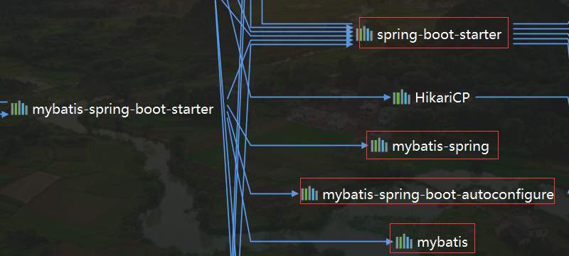
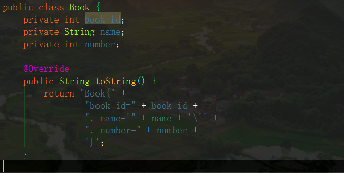
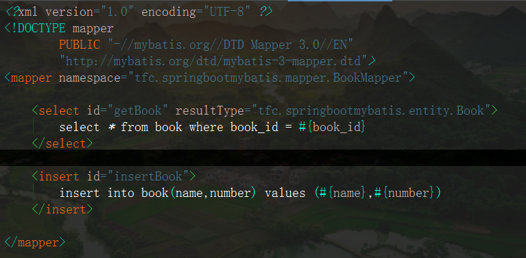
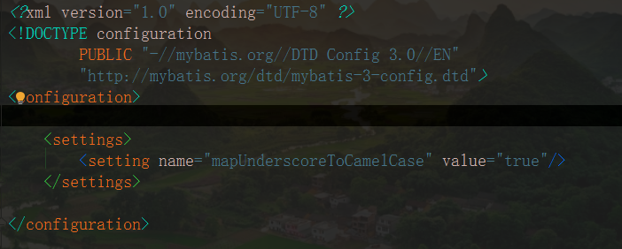

# SpringBoot 访问数据库

## 一、整合 JDBC

* 使用 JDBC 需要的配置

```yaml
spring:
  datasource:
    username: root
    password: 123456
    url: jdbc:mysql://localhost:3306/test?serverTimezone=GMT
    driver-class-name: com.mysql.cj.jdbc.Driver
```

效果：

​	默认使用 **com.zaxxer.hikari.HikariDataSource** 数据源

​	数据源相关的配置在 **DataSourceProperties** 类中

自动配置原理
* **org.springframework.boot.autoconfigure.jdbc**

1. 参考 **DataSourceConfiguration**，根据配置来配置数据源，可以使用 spring.datasource.type 来指定数据源
2. SpringBoot 默认支持

```
org.apache.tomcat.jdbc.pool.DataSource、HikariDataSource、dbcp2
```

3. 自定义数据源

```java
@Configuration
@ConditionalOnMissingBean(DataSource.class)
@ConditionalOnProperty(name = "spring.datasource.type")
static class Generic {
    @Bean
    public DataSource dataSource(DataSourceProperties properties) {
        // 使用 DataSourceBuilder 来创建数据源，利用反射创建响应 type 的数据源，并绑定属性
    	return properties.initializeDataSourceBuilder().build();
    }
}

```

4. 创建表

    默认只需要将文件命名为

    ```properties
    schema-*.sql
    默认规则：schema.sql、schema-all.sql;
    可以使用
        schema:
          - classpath:department.sql
          来指定自己的文件位置，这时文件名可以任意
          
    注意：高版本的需要加上这个配置
    	initialization-mode: always
    ```

5. 操作数据库：自动配置了 **JdbcTemplate** 操作数据库操作方式和普通的 **JdbcTemplate** 一样的


## 二、整合 Druid

### 1、配置文件

```yaml
spring:
  datasource:
    username: root
    password: 123456
    url: jdbc:mysql://localhost:3306/test?serverTimezone=GMT
    driver-class-name: com.mysql.cj.jdbc.Driver
    type: com.alibaba.druid.pool.DruidDataSource

    #   数据源其他配置，这些属性在自动配置类中没有，需要手动配置生效
    initialSize: 5
    minIdle: 5
    maxActive: 20
    maxWait: 60000
    timeBetweenEvictionRunsMillis: 60000
    minEvictableIdleTimeMillis: 300000
    validationQuery: SELECT 1 FROM DUAL
    testWhileIdle: true
    testOnBorrow: false
    testOnReturn: false
    poolPreparedStatements: true
    #   配置监控统计拦截的filters，去掉后监控界面sql无法统计，'wall'用于防火墙
    filters: stat,wall,log4j
    maxPoolPreparedStatementPerConnectionSize: 20
    useGlobalDataSourceStat: true
    connectionProperties: druid.stat.mergeSql=true;druid.stat.slowSqlMillis=500
```

* 其中有些属性自动配置文件中没有，需要手动配置生效	


### 2、配置文件

```java
@Configuration
public class DruidConfig {

    @ConfigurationProperties(prefix = "spring.datasource")
    @Bean
    public DataSource druid() {
        return new DruidDataSource();
    }

    //配置Druid的监控
    //1、配置一个管理后台的Servlet
    @Bean
    public ServletRegistrationBean statViewServlet() {
        ServletRegistrationBean bean = new ServletRegistrationBean(new StatViewServlet(), "/druid/*");
        Map<String, String> initParams = new HashMap<>();

        initParams.put("loginUsername", "admin");
        initParams.put("loginPassword", "123456");
        initParams.put("allow", "");//默认就是允许所有访问
        initParams.put("deny", "192.168.15.21");

        bean.setInitParameters(initParams);
        return bean;
    }


    //2、配置一个web监控的filter
    @Bean
    public FilterRegistrationBean webStatFilter() {
        FilterRegistrationBean bean = new FilterRegistrationBean();
        bean.setFilter(new WebStatFilter());

        Map<String, String> initParams = new HashMap<>();
        initParams.put("exclusions", "*.js,*.css,/druid/*");

        bean.setInitParameters(initParams);

        bean.setUrlPatterns(Arrays.asList("/*"));

        return bean;
    }
}

```

* 如果还需要其他的属性可以加上，这是最基本的配置


## 三、整合 MyBatis

### 1、依赖

```xml
<dependency>
    <groupId>org.mybatis.spring.boot</groupId>
    <artifactId>mybatis-spring-boot-starter</artifactId>
    <version>2.1.2</version>
</dependency>
```




### 2、准备

1. 配置数据源
2. 给数据库建表
3. 创建实体类


### 3、注解方式

```java
@Mapper // 告诉 MyBatis 这是一个操作数据库的 mapper
public interface AccountMapper {

    @Select("select * from account where id = #{id}")
    Account findById(int id);

    @Delete("delete from account where id = #{id}")
    int deleteById(int id);
}

@RestController
public class AccountController {

    @Autowired
    AccountMapper accountMapper;

    // 请求方式 localhost:8080/acc/2
    @GetMapping("/acc/{id}")
    public Account getAccount(@PathVariable("id") int id) {
        return accountMapper.findById(id);
    }

    // 请求方式 localhost:8080/acc?name=无畏&money=231.313
    @Options(useGeneratedKeys = true,keyColumn = "id")
    @GetMapping("/acc")
    public Account insertAccount(Account account) {
        accountMapper.insertAccount(account);
        return account;
    }
}

```


* 自定义 MyBatis 的配置规则
    * 比如解决**表中的列名和实体类中的属性名不一致**
        * 给容器中添加一个 **ConfigurationCustomizer** 组件

```java
@org.springframework.context.annotation.Configuration
public class MyBatisConfig {

    @Bean
    public ConfigurationCustomizer configurationCustomizer() {
        return new ConfigurationCustomizer() {
            @Override
            public void customize(Configuration configuration) {
                configuration.setMapUnderscoreToCamelCase(true);
            }
        };
    }
}
```


使用 **@MapperScan** 注解批量扫描

* 在主类中或者在配置类中都可以使用

```java
@MapperScan(value = "tfc.springbootmybatis.mapper")
@SpringBootApplication
public class SpringbootMybatisApplication {

    public static void main(String[] args) {
        SpringApplication.run(SpringbootMybatisApplication.class, args);
    }
}

```


 ### 4、配置文件方式

* 步骤

    1. 编写实体类

        

    2. 创建一个对应的 dao 接口

        

    3. 编写对应的 xml 配置文件

        

    4. 创建一个主配置 xml 文件

        

    5. 在 springboot 配置文件中添加相应的配置

        ```yaml
        mybatis:
          config-location: classpath:mybatis/mybatis-config.xml #主配置文件位置
          mapper-locations: classpath:mybatis/mapper/*.xml      #映射文件位置
        ```


## 四、整合 JPA

1、编写一个实体类和数据库表进行映射，并且配置好映射关系

```java
@Entity  // 告诉 JPA 这是一个实体类
@Table(name = "account")  // 指定和哪个数据库表对应
public class Account {

    @Id // 表示这是一个主键
    @GeneratedValue(strategy = GenerationType.IDENTITY) //自增主键
    private int id;

    @Column(name = "name") // 和数据库表中的列对应
    private String name;

    @Column  // 默认列名就是属性名
    private double money;
    .....
}
```

2、编写一个接口来操作数据库

```java
// 继承 JpaRepository<Account,Integer> 来对数据库进行操作
public interface AccountDao extends JpaRepository<Account,Integer> {
}
```

3、基本配置

```yaml
spring:
  datasource:
    username: root
    password: 123456
    url: jdbc:mysql://localhost:3306/test?serverTimezone=GMT
    driver-class-name: com.mysql.cj.jdbc.Driver

  jpa:
    show-sql: true # 控制台显示 SQL
```


