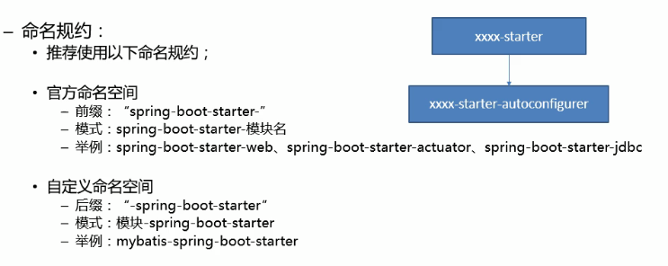

# 自定义 starter

starter：场景启动器

​	1、这个场景需要的依赖有哪些

​	2、如何编写自动配置

```java
@Configuration  // 指定这个类是一个配置类
@ConditionalOnXXX（WebApplication） //在指定条件成立下，自动配置生效
@AutoConfigureAfter //指定自动配置类的顺序
@Bean  //给容器中添加组件
@ConfigurationProperties  //结合  xxxProperties 类来绑定相关配置
@EnableConfigurationProperties  // 让 xxxProperties 中的配置生效，加入到容器中
```

* 配置类自动加载

    * 将需要启动时加载的自动配置类，配置在 **META-INF/spring.factories** 中

    

    


### 1、自动配置类编写模式

1. 启动器（starter）
    
* 启动器模块是一个**空 JAR 文件**，仅提供辅助性依赖管理，这些依赖可能用于自动装配或者其他类库
    
2. 命令规范

    


### 2、步骤

1、新建一个启动器模块，这个模块只需要在 pom 文件中引入自动配置模块的坐标即可


2、新建一个自动配置模块

​	1）、新建一个**属性配置类**，这个类是提供一些属性，让用户自己用的时候配置


​	2）、新建一个**自动配置类**，该类在启动时会自动装配到容器中


​	3）、配置 **spring.factories** 文件，该文件必须在 **META-INF** 资源目录下，没有就新建


​			在该文件中配置自动配置类


3、执行 maven 的 install 命令（启动模块和自动配置模块都需要执行）


