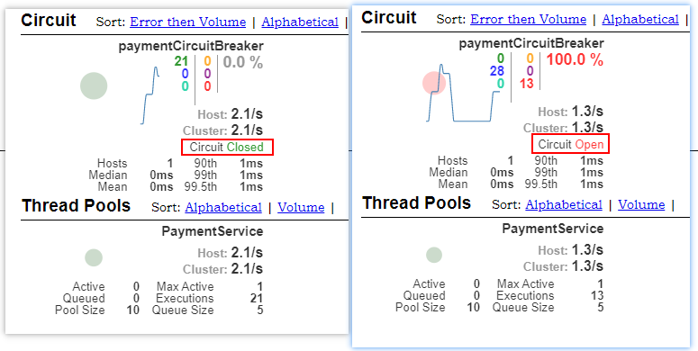
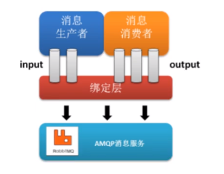
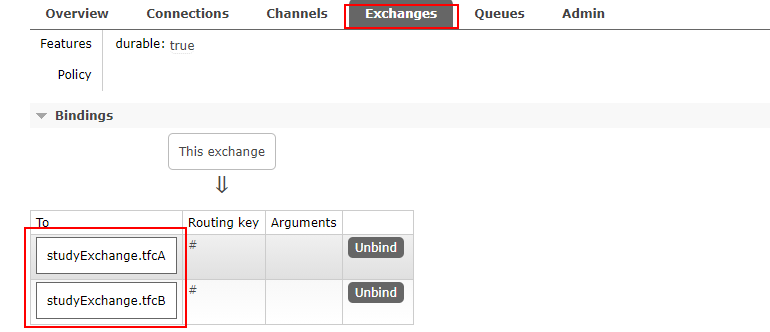
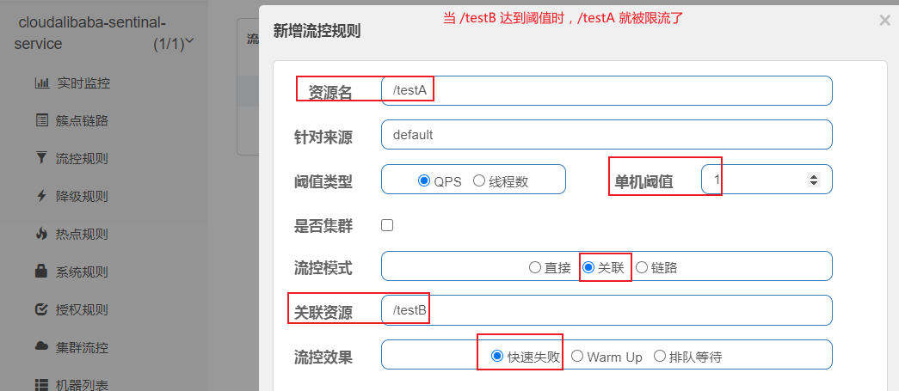
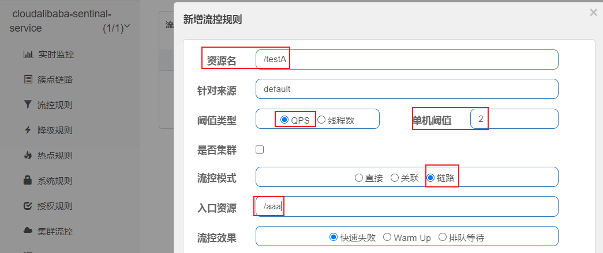
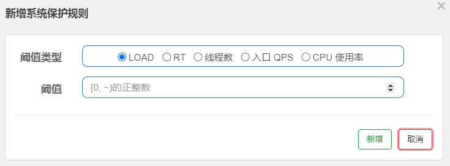

# 一、项目搭建

1、新建一个空的 maven 项目作为父工程

2、在父工程的 pom 文件中写好一些总的配置信息

```xml
<?xml version="1.0" encoding="UTF-8"?>

<project xmlns="http://maven.apache.org/POM/4.0.0" xmlns:xsi="http://www.w3.org/2001/XMLSchema-instance"
         xsi:schemaLocation="http://maven.apache.org/POM/4.0.0 http://maven.apache.org/xsd/maven-4.0.0.xsd">
    <modelVersion>4.0.0</modelVersion>

    <groupId>com.atguigu.springcloud</groupId>
    <artifactId>cloud2020</artifactId>
    <version>1.0-SNAPSHOT</version>
    <packaging>pom</packaging>

    <!-- 统一管理jar包版本 -->
    <properties>
        <project.build.sourceEncoding>UTF-8</project.build.sourceEncoding>
        <maven.compiler.source>1.8</maven.compiler.source>
        <maven.compiler.target>1.8</maven.compiler.target>
        <junit.version>4.12</junit.version>
        <log4j.version>1.2.17</log4j.version>
        <lombok.version>1.16.18</lombok.version>
        <mysql.version>8.0.17</mysql.version>
        <druid.version>1.1.16</druid.version>
        <mybatis.spring.boot.version>1.3.0</mybatis.spring.boot.version>
    </properties>

    <!--
    	子模块继承之后提供作用：锁定版本，子 modlue 不用写 groupId 和 version
这里不会导入依赖，具体的依赖还是要靠子模块来导入，这里相当于只是提供一个建议，用不用还是子模块决定
    -->
    <dependencyManagement>
        <dependencies>
            <!--spring boot 2.2.2-->
            <dependency>
                <groupId>org.springframework.boot</groupId>
                <artifactId>spring-boot-dependencies</artifactId>
                <version>2.2.2.RELEASE</version>
                <type>pom</type>
                <scope>import</scope>
            </dependency>
            <!--spring cloud Hoxton.SR1-->
            <dependency>
                <groupId>org.springframework.cloud</groupId>
                <artifactId>spring-cloud-dependencies</artifactId>
                <version>Hoxton.SR1</version>
                <type>pom</type>
                <scope>import</scope>
            </dependency>
            <!--spring cloud alibaba 2.1.0.RELEASE-->
            <dependency>
                <groupId>com.alibaba.cloud</groupId>
                <artifactId>spring-cloud-alibaba-dependencies</artifactId>
                <version>2.1.0.RELEASE</version>
                <type>pom</type>
                <scope>import</scope>
            </dependency>

            <dependency>
                <groupId>mysql</groupId>
                <artifactId>mysql-connector-java</artifactId>
                <version>${mysql.version}</version>
            </dependency>
            <dependency>
                <groupId>com.alibaba</groupId>
                <artifactId>druid</artifactId>
                <version>${druid.version}</version>
            </dependency>
            <dependency>
                <groupId>org.mybatis.spring.boot</groupId>
                <artifactId>mybatis-spring-boot-starter</artifactId>
                <version>${mybatis.spring.boot.version}</version>
            </dependency>

            <dependency>
                <groupId>junit</groupId>
                <artifactId>junit</artifactId>
                <version>${junit.version}</version>
            </dependency>

            <dependency>
                <groupId>log4j</groupId>
                <artifactId>log4j</artifactId>
                <version>${log4j.version}</version>
            </dependency>
            <dependency>
                <groupId>org.projectlombok</groupId>
                <artifactId>lombok</artifactId>
                <version>${lombok.version}</version>
                <optional>true</optional>
            </dependency>

        </dependencies>
    </dependencyManagement>

    <build>
        <plugins>
            <plugin>
                <groupId>org.springframework.boot</groupId>
                <artifactId>spring-boot-maven-plugin</artifactId>
                <configuration>
                    <fork>true</fork>
                    <addResources>true</addResources>
                </configuration>
            </plugin>
        </plugins>
    </build>
</project>
```


# 二、支付模块

## 1、项目搭建

### 导入相关依赖

```xml
<dependencies>
    <dependency>
        <groupId>org.springframework.boot</groupId>
        <artifactId>spring-boot-starter-web</artifactId>
    </dependency>
    <dependency>
        <groupId>org.springframework.boot</groupId>
        <artifactId>spring-boot-starter-actuator</artifactId>
    </dependency>
    <dependency>
        <groupId>org.mybatis.spring.boot</groupId>
        <artifactId>mybatis-spring-boot-starter</artifactId>
    </dependency>
    <dependency>
        <groupId>com.alibaba</groupId>
        <artifactId>druid-spring-boot-starter</artifactId>
        <version>1.1.10</version>
    </dependency>
    <!--mysql-connector-java-->
    <dependency>
        <groupId>mysql</groupId>
        <artifactId>mysql-connector-java</artifactId>
    </dependency>
    <!--jdbc-->
    <dependency>
        <groupId>org.springframework.boot</groupId>
        <artifactId>spring-boot-starter-jdbc</artifactId>
    </dependency>
    <dependency>
        <groupId>org.springframework.boot</groupId>
        <artifactId>spring-boot-devtools</artifactId>
        <scope>runtime</scope>
        <optional>true</optional>
    </dependency>
    <dependency>
        <groupId>org.projectlombok</groupId>
        <artifactId>lombok</artifactId>
        <optional>true</optional>
    </dependency>
    <dependency>
        <groupId>org.springframework.boot</groupId>
        <artifactId>spring-boot-starter-test</artifactId>
        <scope>test</scope>
    </dependency>
</dependencies>
```


### 编写基本配置信息

```yaml
server:
  port: 8001

spring:
  application:
    name: cloud-payment-service
  datasource:
    type: com.alibaba.druid.pool.DruidDataSource            # 当前数据源操作类型
    driver-class-name: com.mysql.cj.jdbc.Driver             # mysql驱动包
    url: jdbc:mysql://localhost:3306/springcloud?serverTimezone=TUC
    username: root
    password: 123456

mybatis:
  mapperLocations: classpath:mapper/*.xml
  type-aliases-package: com.atguigu.springcloud.entities    # 所有Entity别名类所在包
```


### 启动类

```java
@SpringBootApplication
public class PayentMain8001 {
    public static void main(String[] args) {
        SpringApplication.run(PayentMain8001.class);
    }
}
```


## 2、业务类

### 建表

注意：建表语句中的字段用反引号（ ` ）括起来，**以免和数据库默认保留字段冲突**，保持这一习惯

```sql
CREATE TABLE `payment` (
  `id` bigint(20) NOT NULL AUTO_INCREMENT COMMENT 'ID',
  `serial` varchar(200) DEFAULT '',
  PRIMARY KEY (`id`)
) ENGINE=InnoDB AUTO_INCREMENT=3 DEFAULT CHARSET=utf8;
```


### 实体类

```java
@Data                   // 使用 Lombok 自动生成 set/get 方法
@AllArgsConstructor     // 生成全参构造器
@NoArgsConstructor      // 生成无参构造器
public class Payment implements Serializable {
    private Long id;
    private String serial;
}
```


```java
// 该类用作返回数据的封装类
@Data
@AllArgsConstructor
@NoArgsConstructor
public class CommonResult<T> {

    private Integer code;
    private String message;
    private T data;

    public CommonResult(Integer code, String message) {
        this(code, message, null);
    }
}
```


### Dao 层

```java
@Mapper
public interface PaymentDao {
    int create(Payment payment);

    Payment getPaymentById(@Param("id") Long id);
}
```


坚持写**结果集映射**这一习惯

```xml
<mapper namespace="com.example.tfc.dao.PaymentDao">
    <!--结果集映射-->
    <resultMap id="baseResultMap" type="com.example.tfc.entities.Payment">
        <id property="id" column="id" jdbcType="BIGINT"/>
        <id property="serial" column="serial" jdbcType="VARCHAR"/>
    </resultMap>
    <insert id="create" parameterType="Payment" useGeneratedKeys="true" keyProperty="id">
        insert into payment(serial) values (#{serial})
    </insert>
    <select id="getPaymentById" parameterType="Long" resultMap="baseResultMap">
        select * from payment where id = #{id}
    </select>
</mapper>
```


### Service 层

```java
public interface PaymentService {
    int create(Payment payment);

    Payment getPaymentById(@Param("id") Long id);
}
```


```java
@Service
public class PaymentServiceImpl implements PaymentService {

    @Autowired
    private PaymentDao paymentDao;

    @Override
    public int create(Payment payment) {
        return paymentDao.create(payment);
    }

    @Override
    public Payment getPaymentById(Long id) {
        return paymentDao.getPaymentById(id);
    }
}
```


### Controller 层

```java
@RestController
@Slf4j
public class PaymentController {
    @Autowired
    private PaymentService paymentService;

    @PostMapping(value = "/payment/create")
    public CommonResult create(@RequestBody Payment payment) {//POST请求封装的数据必须加一个 @RequestBody 注解
        int result = paymentService.create(payment);
        log.info("****** 插入结果：" + result);

        if (result > 0) {
            return new CommonResult(200, "插入数据成功", result);
        } else {
            return new CommonResult(444, "插入数据失败", result);
        }
    }

    @GetMapping(value = "/payment/get/{id}")
    public CommonResult getPaymentById(@PathVariable("id") Long id) {
        Payment payment = paymentService.getPaymentById(id);
        log.info("****** 插入结果：" + payment);

        if (payment != null) {
            return new CommonResult(200, "查询数据成功", payment);
        } else {
            return new CommonResult(444, "没有对应记录", payment);
        }
    }
}
```


## 3、测试

查询

```html
GET：http://localhost:8001/payment/get/2
```

```json
{
    "code": 200,
    "message": "查询数据成功",
    "data": {
        "id": 2,
        "serial": "李义山"
    }
}
```


插入

```hxml
POST：http://localhost:8001/payment/create?serial=元本溪
```

```json
{
    "code": 200,
    "message": "插入数据成功",
    "data": 1
}
```


# 三、消费者订单模块

## 1、项目搭建

### 导入依赖

```xml
<dependencies>
    <dependency>
        <groupId>org.springframework.boot</groupId>
        <artifactId>spring-boot-starter-web</artifactId>
    </dependency>
    <dependency>
        <groupId>org.springframework.boot</groupId>
        <artifactId>spring-boot-starter-actuator</artifactId>
    </dependency>

    <dependency>
        <groupId>org.springframework.boot</groupId>
        <artifactId>spring-boot-devtools</artifactId>
        <scope>runtime</scope>
        <optional>true</optional>
    </dependency>
    <dependency>
        <groupId>org.projectlombok</groupId>
        <artifactId>lombok</artifactId>
        <optional>true</optional>
    </dependency>
    <dependency>
        <groupId>org.springframework.boot</groupId>
        <artifactId>spring-boot-starter-test</artifactId>
        <scope>test</scope>
    </dependency>
</dependencies>
```

### 编写配置文件

```yaml
server:
  port: 80
```


### 启动类

```java
@SpringBootApplication
public class OrderMain80 {
    public static void main(String[] args) {
        SpringApplication.run(OrderMain80.class, args);
    }
}
```


## 2、业务类

基本逻辑：消费者模块服务调用支付模块的服务，所以在此模块中不需要操作数据库，也就没有 DAO 层和 Service 层，只需要调用相应的服务即可。就像你不可能操作支付宝的数据库，只需要调用支付宝的服务即可


### RestTemplate

Spring 提供的一个用来进行不同模块之间的调用模板

```java
// 首先需要配置 RestTemplate 的 Bean
@Configuration
public class ApplicationContextConfig {
    @Bean
    public RestTemplate getRestTemplate(){
        return new RestTemplate();
    }
}
```


### Controller 层

```java
@RestController
@Slf4j
public class OrderController {
	// 支付服务模块的地址
    public static final String PAYMENT_URL = "http://localhost:8001";

    @Autowired
    private RestTemplate restTemplate;

    @GetMapping(value = "/consumer/payment/create")
    public CommonResult<Payment> create(Payment payment) {
        return restTemplate.postForObject(PAYMENT_URL + "/payment/create", payment, CommonResult.class);
    }

    @GetMapping("/consumer/payment/get/{id}")
    public CommonResult<Payment> getPayment(@PathVariable("id") Long id) {
        return restTemplate.getForObject(PAYMENT_URL + "/payment/get/" + id, CommonResult.class);
    }
}
```


### 测试

```html
GET：http://localhost/consumer/payment/get/1
```

```json
{
    "code": 200,
    "message": "查询数据成功",
    "data": {
        "id": 1,
        "serial": "徐凤年"
    }
}
```


```html
GET：http://localhost/consumer/payment/create?serial=纳兰右慈
```

```json
{
    "code": 200,
    "message": "插入数据成功",
    "data": 1
}
```


# 四、项目重构

在支付模块、消费模块中都有相同的实体类，这部分代码是冗余的，可以提取出来，打成 JAR 包供多个模块使用


在模块中引入刚刚打好的 JAR 包

```xml
<!-- 引入自己定义的api通用包，可以使用Payment支付Entity -->
<dependency>
    <groupId>com.example.tfc</groupId>
    <artifactId>cloud-api-commons</artifactId>
    <version>${project.version}</version>
</dependency>
```


# 五、Eureka 服务注册中心

新建项目，编写配置文件，由于是一个配置模块，并不需要业务代码

```yaml
server:
  port: 7001

eureka:
  instance:
    hostname: localhost # eureka 服务端的服务名称
  client:
    register-with-eureka: false # false 表示不向注册中心注册自己
    fetch-registry: false # false 表示自己就是注册中心，自己的职责就是维护服务实例，并不需要去检索服务
    service-url:
      # 设置与 eureka 的交互地址，查询服务和注册服务都需要这个地址
      defalutZone: http:${eureka.instance.hostname}:${server.port}/eureka/
```


```java
@SpringBootApplication
@EnableEurekaServer     // 标记这是 Eureka 服务端
public class EurekaMain7001 {
    public static void main(String[] args) {
        SpringApplication.run(EurekaMain7001.class, args);
    }
}
```

测试

```html
http://localhost:7001/   // 端口是配置的
```


## 1、将支付模块注册到 Eureka

**在 springcloud-provider-payment 模块中添加配置** 

### 添加 POM 依赖

```xml
<!--Euraka 客户端-->
<dependency>
    <groupId>org.springframework.cloud</groupId>
    <artifactId>spring-cloud-starter-netflix-eureka-client</artifactId>
</dependency>
```


### 添加配置

```yaml
# Eureka 配置
eureka:
  client:
    register-with-eureka: true # 表示是否将自己注册到 Eureka，默认为 true
    #是否从 Eureka-Server 中抓取已有的注册信息，默认为 true，单节点无所谓，集群必须设置为true才能配合ribbon 使用负载均衡
    fetch-registry: true
    service-url:
      defaultZone: http://localhost:7001/eureka/
```


在启动类中添加 `@EnableEurekaClient` 注解 

```java
@SpringBootApplication
@EnableEurekaClient
public class PayentMain8001 {
    public static void main(String[] args) {
        SpringApplication.run(PayentMain8001.class);
    }
}
```


## 2、将消费模块注册到 Eureka

**在 springcloud-consumer-order80 模块中添加配置** 

### 添加依赖

```xml
<!--Euraka 客户端-->
<dependency>
    <groupId>org.springframework.cloud</groupId>
    <artifactId>spring-cloud-starter-netflix-eureka-client</artifactId>
</dependency>
```


### 添加配置

```yaml
spring:
  application:
    name: cloud-order-service # 这里的服务名会显示到 Eureka 中

eureka:
  client:
    # 表示是否将自己注册到 Eureka，默认为 true
    register-with-eureka: true
    #是否从 Eureka-Server 中抓取已有的注册信息，默认为 true，单节点无所谓，集群必须设置为true才能配合ribbon 使用负载均衡
    fetch-registry: true
    service-url:
      defaultZone: http://localhost:80/eureka/
```


在启动类中添加 `@EnableEurekaClient` 注解

```java
@SpringBootApplication
@EnableEurekaClient
public class OrderMain80 {
    public static void main(String[] args) {
        SpringApplication.run(OrderMain80.class, args);
    }
}
```


## 3、配置 Eureka 集群

只有一个服务注册中心是不行的，万一这个唯一的注册中心出现 Bug，那么整个服务都会受到影响，为了高可用，所以必须配置多个服务注册中心，其中一个出了故障，再选出一个补上，不至于整个服务受到影响

**Eureka 之间需要相互注册才能发挥效果** 


### 新建一个 Eureka 服务模块

1、添加依赖

```xml
<dependencies>
    <!--Eureka服务端-->
    <dependency>
        <groupId>org.springframework.cloud</groupId>
        <artifactId>spring-cloud-starter-netflix-eureka-server</artifactId>
    </dependency>

    <!-- 引入自己定义的api通用包，可以使用Payment支付Entity -->
    <dependency>
        <groupId>com.example.tfc</groupId>
        <artifactId>cloud-api-commons</artifactId>
        <version>${project.version}</version>
    </dependency>

    <dependency>
        <groupId>org.springframework.boot</groupId>
        <artifactId>spring-boot-starter-web</artifactId>
    </dependency>

    <!--boot web actuato 图形监控-->
    <dependency>
        <groupId>org.springframework.boot</groupId>
        <artifactId>spring-boot-starter-actuator</artifactId>
    </dependency>

    <!--一般通用配置-->
    <dependency>
        <groupId>org.springframework.boot</groupId>
        <artifactId>spring-boot-devtools</artifactId>
        <scope>runtime</scope>
        <optional>true</optional>
    </dependency>
    <dependency>
        <groupId>org.projectlombok</groupId>
        <artifactId>lombok</artifactId>
    </dependency>
    <dependency>
        <groupId>org.springframework.boot</groupId>
        <artifactId>spring-boot-starter-test</artifactId>
        <scope>test</scope>
    </dependency>
    <dependency>
        <groupId>junit</groupId>
        <artifactId>junit</artifactId>
    </dependency>
</dependencies>
```


2、修改 Eureka 服务模块的配置文件

下图是 7001 的改动处，7001 和 7002 需要相互注册


7002 模块的配置文件

```yaml
server:
  port: 7002

eureka:
  instance:
    hostname: eureka7002.com # eureka 服务端的服务名称
  client:
    register-with-eureka: false # false 表示不向注册中心注册自己
    fetch-registry: false # false 表示自己就是注册中心，自己的职责就是维护服务实例，并不需要去检索服务
    service-url:
      # 设置与 eureka 的交互地址，查询服务和注册服务都需要这个地址
      defalutZone: http://eureka7001.com:7001/eureka/
```


3、修改 Windows 中的映射文件

因为是在一台机器上模拟 Eureka 集群，所以**以不用的端口还要以示区分** 

```xml
C:\Windows\System32\drivers\etc\hosts

// 添加以下内容
127.0.0.1 eureka7001.com
127.0.0.1 eureka7002.com
```


### 将支付模块 8001 配置到集群

修改配置文件

```yaml
defaultZone: http://localhost:7001/eureka/

==》defaultZone: http://eureka7001.com:7001/eureka/,http://eureka7002.com:7002/eureka/
```


**==注意：defaultZone 这个属性在 IDEA 中没有提示，千万不要写错了==** 


### 将消费模块 80 配置到集群

修改配置文件

```yaml
defaultZone: http://localhost:7001/eureka/

==》defaultZone: http://eureka7001.com:7001/eureka/,http://eureka7002.com:7002/eureka/
```


## 4、配置支付模块集群

与 Eureka 集群一样的原理，如果只有一个支付模块，万一这个唯一的模块出了问题，则整个服务都会出问题，所以要配置多个支付服务模块，提高系统的可用性


### 新建一个支付模块 8002

直接将 8001 模块复制一份，**改一下下列内容** 

1、端口号：8002

2、启动类名称

3、在 8001、8002 的 PaymentController 中添加一个访问标识，以区别访问的是哪个服务

```java
@Value("${server.port}")
private String serverPort;

return new CommonResult(200, "插入数据成功，serverPort：" + serverPort, result);
```

4、还需要改一下消费模块 80 中的一些内容

原先消费模块中提供服务的的地址是写死了，这样永远都是 8001 提供服务

```java
public static final String PAYMENT_URL = "http://localhost:8001";
```

将写死的 IP 和端口改为**微服务的名称** 

```java
public static final String PAYMENT_URL = "http://CLOUD-PAYMENT-SERVICE";
```


上面的内容改完之后会报错，原因是这个微服务下面有多个能提供服务的模块，Eureka 不知道用哪一个，需要手动配置，**在 80 消费模块配置类中的 RestTemplate 中添加一个注解，让 Eureka 自动选择其中一个服务** 

```java
@Bean
@LoadBalanced   // 自动选择一个服务
public RestTemplate getRestTemplate(){
    return new RestTemplate();
}
```


## 5、配置 Actuator

**在 8001、8002 中配置**，这个主要是为信息了看起来更清晰

添加以下配置内容

```properties
# 修改主机名称
eureka.instance.instance-id=payment8001

# 访问路径有 IP 显示（鼠标放到访问路径上，左下角会显示 IP）
eureka.instance.prefer-ip-address=true
```


## 6、服务发现 Discovery

**可以通过配置==服务发现（Discovery）==来进行显示微服务的详细信息** 

> 以 8001 模块为例

1、在 PaymentController（任一 Controller即可） 中引入 Discovery  Bean

```java
// 服务发现：向外显示本服务的一些信息
@Autowired
private DiscoveryClient discoveryClient;
```

2、添加一个映射

```java
@GetMapping("/payment/discovery")
public Object discovery() {
    // 微服务名称(清单)列表
    List<String> services = discoveryClient.getServices();
    for (String service : services) {
        log.info("****** element：" + service);
    }

    // 某个微服务的全部实例(为了高可用，一般配置多个实例)
    List<ServiceInstance> instances = discoveryClient.getInstances("CLOUD-PAYMENT-SERVICE");
    for (ServiceInstance instance : instances) {
        log.info(instance.getServiceId() + " \t" + instance.getHost() + "\t" + instance.getPort() + "\t" + instance.getUri());
    }
    return discoveryClient;
}
```

3、在启动类上添加 `@EnableDiscoveryClient` 注解

```java
@SpringBootApplication
@EnableEurekaClient
@EnableDiscoveryClient  // 服务发现
public class PayentMain8001 {
    public static void main(String[] args) {
        SpringApplication.run(PayentMain8001.class);
    }
}
```


## 7、Eureka 自我保护机制

作用：某时刻某一微服务不可用了，Eureka 不会立刻清理，依旧与对该服务的信息进行保存，属于 CAP 里面的 AP 分支

> 原因

为了保证**在 EurekaClient 可以正常运行，但是与 EurekaServer 网络不通情况下**， EurekaServer 不会立刻将 EurekaClien服务剔除


> 什么是自我保护模式

**默认情况下，如果 EurekaServer 在一定时间內没有接收到某个微服务实例的心跳，EurekaServer 将会注销该实例（默认90秒）** 

但是当网络分区故障发生（诞时、卡顿、拥挤）时，微服务与 EurekaServer 之间无法正常通信，以上行为可能变得非常危险了，因为微服务本身其实是健康的，此时本不应该注销这个微服务

Eureka 通过 "自我保护模式" 来解决这个问题：**当 EurekaServer 节点在==短时间内丟失过多客户端时==（可能发生了网络分区故障），那么这个节点就会进入自我保护模式** 


> 禁止自我保护：以 7001 和 8001 为例

在 7001（服务端） 配置文件中添加以下内容，并且**更改为单机模式，不再使用集群模式** 

```properties
# 单机版：指向自己
eureka.client.service-url.defaultZone = http://eureka7001.com:7001/eureka
# 集群版：指向其他 Server
eureka.client.service-url.defaultZone = http://eureka7002.com:7002/eureka

# 关闭 Eureka 自我保护机制
eureka.server.enable-self-preservation = false
# 多长时间没有响应就直接注销该服务（默认是 90 秒）
eureka.server.eviction-interval-timer-in-ms = 2000
```


在 8001（客户端） 中添加以下配置，并且**更改为单机模式，不再使用集群模式** 

```properties
# 单机版：指向一个服务端
eureka.client.service-url.defaultZone = http://eureka7001.com:7001/eureka
# 集群版：指向多个服务端
eureka.client.service-url.defaultZone = http://eureka7001.com:7001/eureka, http://eureka7002.com:7002/eureka

# Eureka 客户端向服务端发送心跳时间间隔(单位为秒，默认是 30 秒)
eureka.instance.lease-renewal-interval-in-seconds = 1
# Eureka 服务端在收到最后一次心跳后等待的上限时间(单位为秒，默认是 90 秒)，超时将被剔除
eureka.instance.lease-expiration-duration-in-seconds = 2
```


测试：

1、开启 7001、8001

2、关闭 8001，等待几秒后，看看服务端是否还保存有 8001

结果：不存在，如果还存在说明配置有误


# 六、Zookeeper 替换 Eureka

## 1、替换服务提供模块

**==新建一个 cloud-provider-payment8004 模块==** 

### 导入 JAR 包

```xml
<dependencies>
    <!--Spring Cloud 整合 Zookeeper-->
    <dependency>
        <groupId>org.springframework.cloud</groupId>
        <artifactId>spring-cloud-starter-zookeeper-discovery</artifactId>
    </dependency>


    <!-- 引入自己定义的api通用包，可以使用Payment支付Entity -->
    <dependency>
        <groupId>com.example.tfc</groupId>
        <artifactId>cloud-api-commons</artifactId>
        <version>${project.version}</version>
    </dependency>

    <dependency>
        <groupId>org.springframework.boot</groupId>
        <artifactId>spring-boot-starter-web</artifactId>
    </dependency>

    <dependency>
        <groupId>org.springframework.boot</groupId>
        <artifactId>spring-boot-devtools</artifactId>
        <scope>runtime</scope>
        <optional>true</optional>
    </dependency>
    <dependency>
        <groupId>org.projectlombok</groupId>
        <artifactId>lombok</artifactId>
    </dependency>

    <dependency>
        <groupId>org.springframework.boot</groupId>
        <artifactId>spring-boot-starter-test</artifactId>
        <scope>test</scope>
    </dependency>
</dependencies>
```


### 编写配置文件

```properties
# 服务端口号
server.port=8004

# 服务别名：注册到 Zookeeper 注册中心的名称
spring.application.name=cloud-provider-payment

# Zookeeper 连接地址
spring.cloud.zookeeper.connect-string=192.168.10.110:2181
```


### 主启动类

```java
@SpringBootApplication
@EnableDiscoveryClient    // 将服务注册到 Zookeeper 或其他注册中心
public class PaymentMain8004 {
    public static void main(String[] args) {
        SpringApplication.run(PaymentMain8004.class, args);
    }
}
```


### Controller 测试

```java
@RestController
@Slf4j
public class PaymentController {

    @Value("${server.port}")
    private String serverPort;

    @RequestMapping(value = "/payment/zk")
    public String paymentZoo() {
        return "Spring Clud with Zookeeper：" + serverPort + "\t" + UUID.randomUUID().toString();
    }
}
```


### 测试

运行之后 Zookeeper 中有一个 service 的 ZNode 节点，里面包含了连接的详细信息


## 2、替换消费者模块

### 添加依赖

```xml
<dependencies>
    <!--Spring Cloud 整合 Zookeeper-->
    <dependency>
        <groupId>org.springframework.cloud</groupId>
        <artifactId>spring-cloud-starter-zookeeper-discovery</artifactId>
    </dependency>

    <!-- 引入自己定义的api通用包，可以使用Payment支付Entity -->
    <dependency>
        <groupId>com.example.tfc</groupId>
        <artifactId>cloud-api-commons</artifactId>
        <version>${project.version}</version>
    </dependency>

    <dependency>
        <groupId>org.springframework.boot</groupId>
        <artifactId>spring-boot-starter-web</artifactId>
    </dependency>

    <dependency>
        <groupId>org.springframework.boot</groupId>
        <artifactId>spring-boot-devtools</artifactId>
        <scope>runtime</scope>
        <optional>true</optional>
    </dependency>
    <dependency>
        <groupId>org.projectlombok</groupId>
        <artifactId>lombok</artifactId>
    </dependency>

    <dependency>
        <groupId>org.springframework.boot</groupId>
        <artifactId>spring-boot-starter-test</artifactId>
        <scope>test</scope>
    </dependency>
</dependencies>
```


### 编写配置文件

```properties
# 服务端口号
server.port=80

# 服务别名：注册到 Zookeeper 注册中心的名称
spring.application.name=cloud-consumer-order

# Zookeeper 连接地址
spring.cloud.zookeeper.connect-string=192.168.10.110:2181
```


### 主启动类

```java
@SpringBootApplication
@EnableDiscoveryClient
public class OrderZKMain80 {
    public static void main(String[] args) {
        SpringApplication.run(OrderZKMain80.class, args);
    }
}
```


### 配置类

```java
@Configuration
public class ApplicationContextConfig {
    @Bean
    @LoadBalanced
    public RestTemplate getRestTemplate() {
        return new RestTemplate();
    }
}
```


### Controller

```java
@RestController
@Slf4j
public class OrderZKController {
    public static final String INVOKE_URL = "http://cloud-provider-payment"; // 通过服务名进行调用

    @Autowired
    private RestTemplate restTemplate;

    @GetMapping("/consumer/payment/zk")
    public String paymentInfo() {
        String result = restTemplate.getForObject(INVOKE_URL + "/payment/zk", String.class);
        return result;
    }
}
```


### 测试

zk 8004

```http
http://localhost:8004/payment/zk
```

zk 80

```http
http://localhost/consumer/payment/zk
```


# 七、Consul

Consul 是一套开源的分布式服的务发现和配管理系统，由 HashiCorp 公司用 Go 语言开发，提供了微服务系统中的**服务治理、配置中心、控制总线等功能**。这些功能中的毎个都可以根据需要**单独使用**，也可以一起使用以构建全方位的服务网格，总之 Consul 提供了种完整的服务网格解决方案

**Consul 自带一个可视化 Web 界面** 


## 1、下载安装

到官网下载解压即可，加压后就一个 consul.exe 文件

```java
// 官网地址
https://www.consul.io/
```

双击 consul.exe 文件即可安装完成


## 2、启动

以开发模式启动

```c
consul agent -dev
```


查看可视化 Web 界面

```http
http://localhost:8500/
```


## 3、服务提供者

**==新建一个服务提供者模块 cloud-providerconsul-payment8006==** 

### 导入依赖

```xml
<dependencies>
    <!--Spring Cloud Consul 整合包-->
    <dependency>
        <groupId>org.springframework.cloud</groupId>
        <artifactId>spring-cloud-starter-consul-discovery</artifactId>
    </dependency>

    <!--SpringBoot 整合 Web 组件-->
    <dependency>
        <groupId>org.springframework.boot</groupId>
        <artifactId>spring-boot-starter-web</artifactId>
    </dependency>
    <dependency>
        <groupId>org.springframework.boot</groupId>
        <artifactId>spring-boot-starter-actuator</artifactId>
    </dependency>

    <!--常用组件包-->
    <dependency>
        <groupId>org.springframework.boot</groupId>
        <artifactId>spring-boot-devtools</artifactId>
        <scope>runtime</scope>
        <optional>true</optional>
    </dependency>
    <dependency>
        <groupId>org.projectlombok</groupId>
        <artifactId>lombok</artifactId>
    </dependency>
    <dependency>
        <groupId>org.springframework.boot</groupId>
        <artifactId>spring-boot-starter-test</artifactId>
        <scope>test</scope>
    </dependency>
</dependencies>
```


### 编写配置文件

```properties
# 服务端口号
server.port=8006
# 注册到 Consul 注册中心的服务名称
spring.application.name=consul-provider-payment
# Consul 注册中心地址
spring.cloud.consul.host=localhost
spring.cloud.consul.port=8500
spring.cloud.consul.discovery.service-name=${spring.application.name}
```


### Controller 测试

```java
@RestController
@Slf4j
public class PaymentController {
    @Value("${server.port}")
    private String serverPort;

    @RequestMapping(value = "/payment/consul")
    public String paymentZoo() {
        return "Spring Clud with Consul：" + serverPort + "\t" + UUID.randomUUID().toString();
    }
}
```


### 测试

```http
http://localhost:8006/payment/consul
```


## 4、服务消费者

**==新建一个消费者模块 cloud-consumerconsul-order80==** 


### 导入依赖

```xml
<dependencies>
    <!--Spring Cloud Consul 整合包-->
    <dependency>
        <groupId>org.springframework.cloud</groupId>
        <artifactId>spring-cloud-starter-consul-discovery</artifactId>
    </dependency>

    <!--SpringBoot 整合 Web 组件-->
    <dependency>
        <groupId>org.springframework.boot</groupId>
        <artifactId>spring-boot-starter-web</artifactId>
    </dependency>
    <dependency>
        <groupId>org.springframework.boot</groupId>
        <artifactId>spring-boot-starter-actuator</artifactId>
    </dependency>

    <!--常用组件包-->
    <dependency>
        <groupId>org.springframework.boot</groupId>
        <artifactId>spring-boot-devtools</artifactId>
        <scope>runtime</scope>
        <optional>true</optional>
    </dependency>
    <dependency>
        <groupId>org.projectlombok</groupId>
        <artifactId>lombok</artifactId>
    </dependency>
    <dependency>
        <groupId>org.springframework.boot</groupId>
        <artifactId>spring-boot-starter-test</artifactId>
        <scope>test</scope>
    </dependency>
</dependencies>
```


### 编写配置文件

```yaml
server:
  port: 80


spring:
  application:
    name: consul-comsumer-order  # 注册到 Consul 注册中心的服务名称
  cloud:
    consul:
      discovery:
        hostname: ${spring.application.name}
      host: localhost
      port: 8500
```


### Controller 测试

```java
// 先配置一个 Bean
@Configuration
public class ApplicationContextConfig {
    @Bean
    @LoadBalanced
    public RestTemplate getRestTemplate() {
        return new RestTemplate();
    }
}
```


```java
@RestController
@Slf4j
public class OrderConsulController {
    public static final String INVOKE_URL = "http://consul-provider-payment";

    @Autowired
    private RestTemplate restTemplate;

    @GetMapping("/consumer/payment/consul")
    public String paymentInfo() {
        String result = restTemplate.getForObject(INVOKE_URL + "/payment/consul", String.class);
        return result;
    }
}
```


### 测试

```http
http://localhost/consumer/payment/consul
```


# 三个注册中心的比较

CAP 的核心理论

* **C：Consistency**（强一致性）
* **A：Availability**（可用性）
* **P：Partition tolerance**（分区容错性）

​    一个分布式系统**不可能同时很好的满足一致性，可用性和分区容错性这三个需求**，因此，根据 CAP 原理将 NoSQL 数据库分成了满足 CA 原则、满足 CP 原则和满足 AP 原则三大类

1、CA：单点集群，满足一致性，可用性的系统，通常在可扩展性上不太强大

2、CP：满足一致性，分区容忍必的系统，通常性能不是特别高

3、AP：满足可用性，分区容忍性的系统，通常可能对一致性要求低些


**==AP（Eureka）、CP（Zookeeper / Consul）==** 


# 八、Ribbon 负载均衡

## 1、概述

**Spring Cloud Ribbon** 是基于 Netflix Ribbon 实现的一套**==客户端==负载均衡的工具** 

​	Ribbon 是 Netfliⅸ 发布的开源项目，**主要功能是提供==客户端==的软件负载均衡算法和服务调用**。 Ribbon 客户端组件提供一系列完善的配置项如连接超时，重试等

​	在配置文件中列出 Load Balancer（简称LB）后面所有的机器， **Ribbon 会自动的帮助你基于某种规则（如简单轮询，随机连接等）去连接这些机器**。我们很容易使用 Ribbon 实现自定义的负载均衡算法


> LB负载均衡（Load Balance）是什么？

简单的说就是将用户的请求平摊的分配到多个服务上，从而达到系统的HA（高可用），常见的负载均衡有软件 Nginx，LVS，硬件 F5 等


> Ribbon 本地负载均衡（进程内 LB ）

​	Ribbon本地负载均衡，在调用微服务接口时候，会在注册中心上获取注册信息服务列表之后缓存到 JVM 本地，从而在本地实现 RPC 远程服务调用技术


> Nginx 服务端负载均衡（集中式 LB ）

Nginx 是服务器负载均衡，窖户端所有请求都会交给 Nginx，然后由 Nginx 实现转发请求。即负载均衡是由服务端实现的


**==一句话概括：Ribbon 是负载均衡 + RestTemplate 调用==** 


## 2、工作方式

Ribbon 在工作的时候分为两步：

1、先选择一个 EurekaServer，**它优先选择在同一个区域内负载较少的 server** 

2、第二步再根据用户指定的策略，**从 server 取到的服务注册列表中选择—个地址**（其中 Ribbon 提供了多种策略：比如轮询、随机、根据响应时间加权等）


总结：Ribbon 其实就是一个软负载均衡的客户端组件，他可以和其他所需请求的客户端结合使用，**和 eureka 结合只是其中的一个实例** 


## 3、RestTemplate 的使用

> **postFor==Object==（）、getFor==Object==（）**：返回对象为响应体中数据转化成的对象，甚本上可以理解为 JSON

```java
@Autowired
private RestTemplate restTemplate;

@GetMapping(value = "/consumer/payment/create")
public CommonResult<Payment> create(Payment payment) {
    return restTemplate.postForObject(PAYMENT_URL + "/payment/create", payment, CommonResult.class);
}
```


> **getFo==rEntity==（）、postFor==Enity==（）**：返回对象为 ResponseEntity 对象，包含了响应中的一些重要信息，如响应头、状态码、响应体等

```java
@GetMapping("/consumer/payment/getForEntity/{id}")
public CommonResult<Payment> getPayment2(@PathVariable("id") Long id) {
    ResponseEntity<CommonResult> entity = restTemplate.getForEntity(PAYMENT_URL + "/payment/get/" + id, CommonResult.class);

    if (entity.getStatusCode().is2xxSuccessful()) {
        return entity.getBody();
    } else {
        return new CommonResult<>(444, "操作失败");
    }
}
```


## 4、搭建环境

说明：此次使用 Ribbon + Eureka 搭建实验环境

注意：`spring-cloud-starter-netflix-eureka-client` 这个包中已经引入了 Ribbon，不需要自己再额外添加 Ribbon 组件，自己再添加一次也可以


如果要单独引入，就引入下面的 Jar 包坐标

```xml
<dependency>
    <groupId>org.springframework.cloud</groupId>
    <artifactId>spring-cloud-starter-netflix-ribbon</artifactId>
    <version>2.2.1.RELEASE</version>
</dependency>
```


## 5、Ribbon 核心组件 IRule

> 作用

根据特定算法中从服务列表中选取一个要访问的服务


> 继承结构


各种实现的类的规则：

1、com.netflix.loadbalancer.RoundRobinRule：轮询

2、com.netflix.loadbalancer.RandomRule：随机

3、com.netflix.loadbalancer.RetryRule：先按照 RoundRobinRule 的策略获取服务，如果获取服务失败则再指定时间内重试，获取可用服务

4、WeightResponseTimeRule：对 RoundRobinRule 的扩展，响应速度越快的实例选择权重越大

5、BestAvailableRule：会先过滤掉由于多次访问故障而处于断路器跳闸状态的服务，然后选择一个并发量最小的服务

6、AvailabilityFilterRule：先过滤掉故障实例，再选择并发较小的实例

7、ZoneAvoidanceRule：**==默认规则==**，复合判断 server 所在区域的性能和 server 的可用性选择服务器


### 替换默认负载规则

官方文档明确给出了警告：**这个==自定义配置类==不能放在 ==@ComponentScan== 所扫描的当前包下以及子包下否则我们自定义的这个配置类就会被所有的 Ribbon 客户端所共享，达不到特殊化定制的目的了** 

**==解释：不能和启动类在同一包，或是启动类所在包的子包中==** 

结构如下


配置类如下：**该配置是在消费模块 80 上做的修改** 

```java
@Configuration
public class MySelfRole {
    @Bean
    public IRule myRule() {
        return new RandomRule();  // 定义为随机
    }
}
```


主启动类上添上 `@RibbonClient` 注解

* 作用：是调用哪个微服务模块，使用哪个配置类，在这里是调用支付微服务模块，使用自定义的负载均衡替换默认的

```java
@SpringBootApplication
@EnableEurekaClient
@RibbonClient(name = "CLOUD-PAYMENT-SERVICE", configuration = MySelfRole.class)
public class OrderMain80 {
    public static void main(String[] args) {
        SpringApplication.run(OrderMain80.class, args);
    }
}
```


测试

```http
http://localhost/consumer/payment/get/2
```


## 6、Ribbon 负载算法

### 轮询负载原理

**==实际调用服务器位置下标 = rest 接口第几次请求数 % 服务器集群总数量，每次服务重启动后 rest 接口计数从 1 开始==** 


# 九、OpenFeign 服务调用

## 1、概述

Feign 是个声明式 WebService 客户端。使用 Feign 能让编写  Webservice 客户端更加简单

> 使用方法

**==定义一个服务接口然后在上面添加注解==**。 Feign 支持可拔插式的编码器和解码器。 Spring Cloud 对 Feign 进行了封装使其支持了 Spring MVC 标准注解和 HttpMessageConverters，Feign 可以与 Eureka 和 Ribbon 组合使用以支持负载均衡


## 2、作用

**Feign 旨在使编写 Java Http 客户端变得更容易** 

前面在使用 Ribbon + RestTemplate 时，利用 RestTemplate，对 http 请求的封装处理，形成了一套模版化的调用方法。但是在实际开发中，由于对服务依赖的调用可能不止处，**往往一个接口会被多处调用，所以通常都会针对每个微服务自行封装一些客户端类来包装这些依赖服务的调用** 

所以， Feign 在此基础上做了进一步封装，由他来帮助我们定义和实现依赖服务接口的定义。在 Feign 的实现下，**我们只需创建一个接口并使用注解的方式来配置它（以前是Dao接口上面标注 Mapper 注解，现在是一个微服务接口上面标注一个 Feign 注解）**，即可完成对服务提供方的接口绑定，简化了使用 Spring Cloud Ribbon 时，自动封装服务调用客户端的开发量


> Fegin 集成了 Ribbon

利用 Ribbon 维护了 Payment 的服务列表信息，并目通过轮询实现了客户端的负载均衡。而与 Ribbon不同的是，**通过Feign，只需要定义服务绑定接口且以声明式的方法，优骓而简单的实现了服务调用** 


## 3、使用

新建一个 `cloud-consumer-feign-order80` 消费模块

### 导入依赖

```xml
<dependencies>
    <!-- openfeign -->
    <dependency>
        <groupId>org.springframework.cloud</groupId>
        <artifactId>spring-cloud-starter-openfeign</artifactId>
    </dependency>

    <!--eureka client-->
    <dependency>
        <groupId>org.springframework.cloud</groupId>
        <artifactId>spring-cloud-starter-netflix-eureka-client</artifactId>
    </dependency>

    <!-- 引入自己定义的api通用包，可以使用Payment支付Entity -->
    <dependency>
        <groupId>com.example.tfc</groupId>
        <artifactId>cloud-api-commons</artifactId>
        <version>${project.version}</version>
    </dependency>

    <!--SpringBoot 整合 Web 组件-->
    <dependency>
        <groupId>org.springframework.boot</groupId>
        <artifactId>spring-boot-starter-web</artifactId>
    </dependency>
    <dependency>
        <groupId>org.springframework.boot</groupId>
        <artifactId>spring-boot-starter-actuator</artifactId>
    </dependency>

    <!--常用组件包-->
    <dependency>
        <groupId>org.springframework.boot</groupId>
        <artifactId>spring-boot-devtools</artifactId>
        <scope>runtime</scope>
        <optional>true</optional>
    </dependency>
    <dependency>
        <groupId>org.projectlombok</groupId>
        <artifactId>lombok</artifactId>
    </dependency>
    <dependency>
        <groupId>org.springframework.boot</groupId>
        <artifactId>spring-boot-starter-test</artifactId>
        <scope>test</scope>
    </dependency>
</dependencies>
```


### 编写配置文件

```yaml
server:
  port: 80

eureka:
  client:
    register-with-eureka: false
    service-url:
      defaultZone: http://eureka7001.com:7001/eureka, http://eureka7002.com:7002/eureka
```


### 业务类

```java
@Component
@FeignClient(value = "CLOUD-PAYMENT-SERVICE")  // 调用哪个微服务
public interface PaymentFeignService {
    @GetMapping("/payment/get/{id}")  // 调用微服务下哪个接口
    CommonResult<Payment> getPaymentById(@PathVariable("id") Long id);
}
```


### Controller

```java
@RestController
@Slf4j
public class OrderFeignController {
    @Autowired
    private PaymentFeignService paymentFeignService;

    @GetMapping("/consumer/payment/get/{id}")
    public CommonResult<Payment> getPaymentById(@PathVariable("id") Long id){
        return paymentFeignService.getPaymentById(id);
    }
}
```


### 测试

```http
http://localhost/consumer/payment/get/2
```


## 4、Feign 的超时控制

**==OpenFeign 默认等待 1 秒钟，超过后报错==** 

### 演示

用 7001、8001、Feign80 模块进行演示

1、在 8001 模块的 Controller 中添加如下测试

```java
// Feign 超时测试
@GetMapping("/payment/feign/timeout")
public String paymentFeignTimeout() {
    try {
        TimeUnit.SECONDS.sleep(3);   // 人为让服务处理时间超过 1 秒，制造 Feign 超时现象
    } catch (InterruptedException e) {
        e.printStackTrace();
    }
    return serverPort;
}
```

2、在 Feign 的接口中添加如下内容

```java
@GetMapping("/payment/feign/timeout")
String paymentFeignTimeout();
```

3、在 Feign 的 Controller 中添加如下内容

```java
@GetMapping("/consumer/payment/feign/timeout")
public String paymentFeignTimeout() {
    String serverPort = paymentFeignService.paymentFeignTimeout();
    return serverPort;
}
```


测试

```http
http://localhost/consumer/payment/feign/timeout
```

测试内容如下


默认 Feign客户端只等待—秒钟，但是服务端处理需要超过 1 秒钟，导致 Feign客户端不想等待了，直接返回报错。
**为了避免这样的情况，有时候我们需要设置 Feign 客户端的超时时间** 


在 Feign80 的配置文件中添加如下内容

```yaml
# Feign 整合了 Ribbon，利用 Ribbon 来进行 Feign 的超时控制
ribbon:
  ReadTimeout: 5000    # 指的是建立连接所用的时间，适用于网络状况正常下两端连接所用时间
  ConnectTimeout: 5000 # 指的是建立连接后，从服务器端读取到可用资源所用时间
```


## 5、Feign 的日志打印功能

Feign 供了日志打印功能，我们可以通设置来调整日志级别，从而了解 Feign 中 Http 请求细节，说白了就是**对 Feign 接口的调用情况进行监控和输出** 


### 日志级别

**NONE**：默认的，不显示任何日志

**BASIC**：仅记录请求方法、URL、响应状态码及执行时间

**HEADERS**：除了 BASIC 中定义的信息之外，还有请求和响应的头信息

**FULL**：除了 HEADERS 中定义的信息之外，还有请求和响应的正文及元数据


### 配置方式

1、编写一个日志 Bean

```javascript
@Configuration
public class FeignConfig {
    @Bean
    Logger.Level feignLoggerLevel() {
        return Logger.Level.FULL;
    }
}
```

2、在配置文件中启用

```yaml
# Feign 的日志功能
logging:
  level:
    # Feign 以什么级别监控哪个接口
    com.example.tfc.service.PaymentFeignService: debug
```


# 十、Hystrix 断路器

## 1、微服务所带来的问题

多个微服务之间调用的时候，假设微服务 A 调用微服务 B 和微服务 C，微服务 B 和微服务 C 又调用其它的微服务，这就是所谓的 "**==扇出==**"，**如果扇出的链路上某个微服务的调用响应时间过长或者不可用，对微服务 A 的调用就会占用越来越多的系统资源，进而引起系统崩溃，所谓的 =="雪崩效应"==** 


对于高流量的应用来说，**单一的后端依赖**可能会导致所有服务器上的所有资源都在几秒钟内饱和。比失败更糟糕的是，这些应用程序还可能导致服务之间的延迟增加，备份队列，线程和其他系统资源紧张，导致整个系统发生更多的**级联故障**。这些都表示需要对故障和延迟进行隔离和管理，以便**使单个依赖关系的失败，不能取消整个应用程序或系统** 

通常当你发现一个模块下的某个实例失败后，这时候这个模块依然还会接收流量，然后这个有问题的模块还调用了其他的模块，这样就会发生级联故障，或者叫雪崩 


## 2、Hystrix 的作用

Hystrix 是个用于处理分布式系统的**延迟和容错**的开源库在分布式系统里，许多依赖不可避免的会调用失败，比如超时、异常等， **Hystrⅸ 能够保证在一个依赖出问题的情况下，不会导致整体服务失败，避免级联故障，以提高分布式系统化的弹性** 


"断路器" 本身是种开关装置，**当某个服务单元发生故障之后，通过断路器的故障监控（类似熔断保险丝），向调用方返回一个符合预期的、可处理的备选晌应（ FallBack），而不是长时间的等待或者抛出调用方无法处理的异常**，这样就保证了服务调用方的线程不会被长时间、不必要地占用，从而避免了故障在分布式系统中的蔓延，乃至雪崩


## 3、Hystrix 的重要概念

### 服务降级（fallback）

当服务器处于繁忙、故障状态时，处理请求可能会很慢，这时候不要让客户等待，先返回一个友好提示

就像 `if-else` 语句的 `else` 和 `switch` 语句的 `default` 语句一样


> 触发服务降级的条件

1、程序运行异常

2、超时

3、服务熔断出发服务降级

4、线程池/信号量已满


### 服务熔断（break）

类比保险丝，危险情况下直接跳闸。服务器达到最大访问量时，直接拒绝访问，然后使用服务降级返回友好提示


### 服务限流（flowlimit）

秒杀高并发等操作，严禁一窝蜂过来拥挤，等待排队


## 4、Hystrix 案例

### 新建服务提供者模块

新建一个 `cloud-provider-hystrix-payment8001` 服务提供者模块

1、导入依赖

```xml
<dependencies>
    <!--Hystrix-->
    <dependency>
        <groupId>org.springframework.cloud</groupId>
        <artifactId>spring-cloud-starter-netflix-hystrix</artifactId>
    </dependency>

    <!--Euraka 客户端-->
    <dependency>
        <groupId>org.springframework.cloud</groupId>
        <artifactId>spring-cloud-starter-netflix-eureka-client</artifactId>
    </dependency>

    <!-- 引入自己定义的api通用包，可以使用Payment支付Entity -->
    <dependency>
        <groupId>com.example.tfc</groupId>
        <artifactId>cloud-api-commons</artifactId>
        <version>${project.version}</version>
    </dependency>

    <dependency>
        <groupId>org.springframework.boot</groupId>
        <artifactId>spring-boot-starter-web</artifactId>
    </dependency>
    <dependency>
        <groupId>org.springframework.boot</groupId>
        <artifactId>spring-boot-starter-actuator</artifactId>
    </dependency>

    <dependency>
        <groupId>org.springframework.boot</groupId>
        <artifactId>spring-boot-devtools</artifactId>
        <scope>runtime</scope>
        <optional>true</optional>
    </dependency>
    <dependency>
        <groupId>org.projectlombok</groupId>
        <artifactId>lombok</artifactId>
        <optional>true</optional>
    </dependency>
    <dependency>
        <groupId>org.springframework.boot</groupId>
        <artifactId>spring-boot-starter-test</artifactId>
        <scope>test</scope>
    </dependency>
</dependencies>
```


2、编写配置文件

```yaml
server:
  port: 8001

spring:
  application:
    name: cloud-provider-hystrix-payment # 注册到 Eureka 中的服务名称

eureka:
  client:
    register-with-eureka: true   # 是否将自己注册到 Eureka 服务器
    fetch-registry: true         # 是否从 Eureka 服务器中拉去信息
    service-url:
      defaultZone: http://eureka7001.com:7001/eureka/ # 注册到哪个 Eureka 服务器
```


3、主启动类

```java
@SpringBootApplication
@EnableEurekaClient
public class PaymentHistrixMain8001 {
    public static void main(String[] args) {
        SpringApplication.run(PaymentHistrixMain8001.class, args);
    }
}
```


4、测试

```http
http://localhost:8001/payment/hystrix/ok/3

http://localhost:8001/payment/hystrix/timeout/3
```


> 对  `cloud-provider-hystrix-payment8001` 进行高并发测试

向 `http://localhost:8001/payment/hystrix/timeout/3` 发 20000 个请求

现象：由于服务器大量处理 `timeout` 的请求，服务器资源被大量占用，导致 `ok` 的处理速度变慢


### 新建消费者模块

新建 `cloud-consumer-feign-hystrix-order80` 消费者模块

1、导入依赖

```xml
<dependencies>
    <!-- openfeign -->
    <dependency>
        <groupId>org.springframework.cloud</groupId>
        <artifactId>spring-cloud-starter-openfeign</artifactId>
    </dependency>
    <!--hystrix-->
    <dependency>
        <groupId>org.springframework.cloud</groupId>
        <artifactId>spring-cloud-starter-netflix-hystrix</artifactId>
    </dependency>
    <!--eureka-->
    <dependency>
        <groupId>org.springframework.cloud</groupId>
        <artifactId>spring-cloud-starter-netflix-eureka-client</artifactId>
    </dependency>

    <!-- 引入自己定义的api通用包，可以使用Payment支付Entity -->
    <dependency>
        <groupId>com.example.tfc</groupId>
        <artifactId>cloud-api-commons</artifactId>
        <version>${project.version}</version>
    </dependency>

    <dependency>
        <groupId>org.springframework.boot</groupId>
        <artifactId>spring-boot-starter-web</artifactId>
    </dependency>
    <dependency>
        <groupId>org.springframework.boot</groupId>
        <artifactId>spring-boot-starter-actuator</artifactId>
    </dependency>

    <dependency>
        <groupId>org.springframework.boot</groupId>
        <artifactId>spring-boot-devtools</artifactId>
        <scope>runtime</scope>
        <optional>true</optional>
    </dependency>
    <dependency>
        <groupId>org.projectlombok</groupId>
        <artifactId>lombok</artifactId>
        <optional>true</optional>
    </dependency>
    <dependency>
        <groupId>org.springframework.boot</groupId>
        <artifactId>spring-boot-starter-test</artifactId>
        <scope>test</scope>
    </dependency>
</dependencies>
```


2、编写配置文件

```yaml
server:
  port: 80

#这里只把feign做客户端用，不注册进eureka
eureka:
  client:
    #表示是否将自己注册进 EurekaServer 默认为true
    register-with-eureka: false
    service-url:
      defaultZone: http://eureka7001.com:7001/eureka/
      
# Feign 整合了 Ribbon，利用 Ribbon 来进行 Feign 的超时控制
ribbon:
  ReadTimeout: 10000    # 指的是建立连接所用的时间，适用于网络状况正常下两端连接所用时间
  ConnectTimeout: 10000 # 指的是建立连接后，从服务器端读取到可用资源所用时间
```


3、主启动类

```java
@SpringBootApplication
@EnableFeignClients
public class OrderHystrixMain80 {
    public static void main(String[] args) {
        SpringApplication.run(OrderHystrixMain80.class, args);
    }
}
```


4、正常测试

http://localhost/consumer/payment/hystrix/ok/222

http://localhost/consumer/payment/hystrix/timeout/222


5、高并发测试

使用 Jmeter 对 http://localhost/consumer/payment/hystrix/timeout/222 多个请求

现象：由于服务器大量处理 `timeout` 的请求，服务器资源被大量占用，导致 `ok` 的处理速度变慢


## 5、服务降级

解决高并发的思路：

1、对方服务 8001 超时了，调用者 80 不能一直卡死等待，必须有服务降级

2、对方服务 8001 宕机，调用者 80 不能一直卡死等待，必须有服务降级

3、对方服务 8001 ok，调用者 80 出故障或要求等待时间小于几秒，必须有服务降级


> **解决服务提供方 8001 的问题** 

* 设置自身调用超时时间的峰值，峰值内正常运行，超过了需要兜底的方法处处理，作服务降级 **fallback** 

​        **首先在启动类上添加 `@EnableCircuitBreaker` 注解，然后在 Service 层的方法上使用 `@HystrixCommand` 注解来实现服务降级** 

```java
@SpringBootApplication
@EnableEurekaClient
@EnableCircuitBreaker
public class PaymentHistrixMain8001 {
    public static void main(String[] args) {
        SpringApplication.run(PaymentHistrixMain8001.class, args);
    }
}
```

```java
@HystrixCommand(fallbackMethod = "paymentInfo_TimeOutHandler",commandProperties = {
        @HystrixProperty(name = "execution.isolation.thread.timeoutInMilliseconds",value = "3000")
})
public String paymentInfo_TimeOut(Integer id) {
    int timeNumber = 5;
    try {
        TimeUnit.SECONDS.sleep(timeNumber);
    } catch (InterruptedException e) {
        e.printStackTrace();
    }
    return "线程池：" + Thread.currentThread().getName() + " paymentInfo_TimeOut，ID：" + id + "  耗时：" + timeNumber;
}
// 服务降级处理方法
public String paymentInfo_TimeOutHandler(Integer id) {
    return "线程池：" + Thread.currentThread().getName() + " paymentInfo_TimeOut，ID：" + id + "\t" + "o(*￣︶￣*)o" + "\t" + "友好提示";
}
```

解释：

* **fallbackMethod**：运行异常后调用哪个方法进行降级处理
* **commandProperties**：处理运行异常之外，还有哪些情况需要降级处理，这里是超时三秒后进行降级处理

测试：启动 7001、Hystrix 8001、Hystrix 80

```http
http://localhost:8001/payment/hystrix/timeout/3
```


> **解决消费端 hystrix 80 的问题** 

**此处客户端是通过 OpenFeign 进行服务调用，不是直接调用 Service 方法** 

1、添加配置内容

```yaml
feign:
  hystrix:
    enabled: true
```

2、在启动类上添加 `@EnableHystrix` 注解

```java
@SpringBootApplication
@EnableFeignClients
@EnableHystrix
public class OrderHystrixMain80 {
    public static void main(String[] args) {
        SpringApplication.run(OrderHystrixMain80.class, args);
    }
}
```

3、在 Controller 层添加内容

```java
@HystrixCommand(fallbackMethod = "paymentInfo_TimeoutHandler", commandProperties = {
        @HystrixProperty(name = "execution.isolation.thread.timeoutInMilliseconds", value = "1500")
})
@GetMapping("/consumer/payment/hystrix/timeout/{id}")
public String paymentInfo_TimeOut(@PathVariable("id") Integer id) {
    String result = paymentHystrixService.paymentInfo_TimeOut(id);
    return result;
}

public String paymentInfo_TimeoutHandler(Integer id) {
    return "/(ToT)/我是消费者80，调用8001支付系统繁忙，请10秒钟后重新尝试\t";
}
```


### 解决代码臃肿问题

#### 1）设置全局 fallback 方法

**为每一个业务都设置一个 fallback 方法，会造成代码臃肿**，为了减少代码量，可以配置一个全局的 fallback 方法，如果没有特意为某个业务指定 fallback 方法，默认使用全局的 fallback

1、在需要使用 fallback 所在的类上使用 `@DefaultProperties` 注解

```java
@RestController
@Slf4j
@DefaultProperties(defaultFallback = "paymentGlobalFallbackMethod")
public class OrderHystrixController {
    ...
}
```

2、在相关方法上只需要添加 `@HystrixCommand` 注解即可

```java
@HystrixCommand
@GetMapping("/consumer/payment/hystrix/timeout/{id}")
public String paymentInfo_TimeOut(@PathVariable("id") Integer id) {
    String result = paymentHystrixService.paymentInfo_TimeOut(id);
    return result;
}
```


#### 2）在 OpenFeign 中设置

OpenFeign 处理的是通过接口来进行服务调用

1、新建一个类，实现服务调用的接口中的方法

* 接口

```java
@Component
@FeignClient(value = "CLOUD-PROVIDER-HYSTRIX-PAYMENT", fallback = PaymentFallbackService.class)
public interface PaymentHystrixService {
    @GetMapping("/payment/hystrix/ok/{id}")
    String paymentInfo_OK(@PathVariable("id") Integer id);

    @GetMapping("/payment/hystrix/timeout/{id}")
    String paymentInfo_TimeOut(@PathVariable("id") Integer id);
}
```

* 实现类

```java
public class PaymentFallbackService implements PaymentHystrixService {
    @Override
    public String paymentInfo_OK(Integer id) {
        return "---------PaymentFallbackService fall back paymentInfo_OK";
    }

    @Override
    public String paymentInfo_TimeOut(Integer id) {
        return "---------PaymentFallbackService fall back paymentInfo_TimeOut";
    }
}
```

2、在服务调用的 `@FeignClient` 接口中添加属性

```java
@FeignClient(value = "CLOUD-PROVIDER-HYSTRIX-PAYMENT")
	↓
@FeignClient(value = "CLOUD-PROVIDER-HYSTRIX-PAYMENT", fallback = PaymentFallbackService.class)
```

3、测试

http://localhost/consumer/payment/hystrix/timeout/222


## 6、服务熔断

### 熔断是什么？

1、熔断机制是应对雪崩效应的一种微服务链路保护机制

2、当扇出链路的某个微服务出错不可用或者晌应时间太长时会进行服务的降级，进而熔断该节点微服务的调用，快速返回错误的响应信息

3、**当检测到该节点微服务调用晌应正常后，恢复调用链路** 


在 Spring Cloud 框架里，熔断机制通过Hystⅸx实现。 Hystriⅸ 会监控微服务间调用的状况，**当失败的调用达到阈值（==默认是5 秒内 20 次调用失败==）时就会启动熔断机制**。熔断机制的注解是 `@HystrixCommand` 


### 实操

修改 `cloud-provider-hystrix-payment8001` 

1、在 `PaymentService` 中添加如下内容

```java
@HystrixCommand(fallbackMethod = "paymentCircuitBreaker_fallback", commandProperties = {
        @HystrixProperty(name = "circuitBreaker.enabled", value = "true"),              //是否开启断路器
        @HystrixProperty(name = "circuitBreaker.requestVolumeThreshold", value = "10"),  //请求数达到后才计算
        @HystrixProperty(name = "circuitBreaker.sleepWindowInMilliseconds", value = "10000"), //时间窗口期
        @HystrixProperty(name = "circuitBreaker.errorThresholdPercentage", value = "60"),//失败率达到多少跳闸
})
public String paymentCircuitBreaker(@PathVariable("id") Integer id) {
    if (id < 0) {
        throw new RuntimeException("****id 不能为负数");
    }
    String serialNumber = IdUtil.simpleUUID();

    return Thread.currentThread().getName() + "\t" + "调用成功，流水号：" + serialNumber;
}

public String paymentCircuitBreaker_fallback(@PathVariable("id") Integer id) {
    return "id 不能为负数,请稍后再试， o(╥﹏╥)o id: " + id;
}
```

2、在 `PaymentController` 中添加如下内容

```java
// ============ 服务熔断 ===============
@GetMapping("/payment/circuit/{id}")
public String paymentCircuitBreaker(@PathVariable("id") Integer id) {
    String result = paymentService.paymentCircuitBreaker(id);
    log.info("*****result: " + result);
    return result;
}
```

3、测试

http://localhost:8001/payment/circuit/11

现象：**一段时间内请求失败率达到规定的值时，就会触发服务熔断**，这时候，即时请求正确，也不会得到正确结果，要等待一会儿之后才会得到正确结果


### 总结

> 熔断类型

1、熔断打开

* 请求不再进行调用当前服务，内部设置时钟一般为 MTTR（平均故障处理时间），当打开时长达到所设时钟则进入半熔断状态

2、熔断半开

* 部分请求根据规则调用当前服务，如果请求成功且符合规则则认为当前服务恢复正常，关闭熔断

3、熔断关闭

* 熔断关闭不会对服务进行熔断


> 短路器在什么时候开始起作用

涉及到断路器的三个重要参数：**==快照时间窗==**、**==请求总数阀值==**、**==错误百分比阀值==** 

1、快照时间窗口：`@HystrixProperty(name = "circuitBreaker.sleepWindowInMilliseconds", value = "10000")` 

* 断路器确定是否打开需要统计一些请求和错误数据，而**统计的时间范围就是快照时间窗**，默认为最近的10秒

2、请求总数阈值：`@HystrixProperty(name = "circuitBreaker.requestVolumeThreshold", value = "10")` 

在快照时间窗内，必须满足请求总数阀值才有资格熔断。默认为 20，**意味着在 10 秒内，如果该 hysterⅸ 命令的调用次数不足 20，即使所有的请求都超时或其他原因失败，断路器都不会打开** 

3、错误百分比阀值：`@HystrixProperty(name = "circuitBreaker.errorThresholdPercentage", value = "60")` 

当请求总数在快照时间窗内超过了阀值，比如发生了 30 次调用，如果在这 30 次调用中，有 15 次发生了超时异常，也就是超过 50% 的错误百分比，在默认设定 50% 阀值情况下，这时候就会将断路器打开


> 断路器开启或者关闭的条件

1、当请求数满足一定的阈值的时候（默认 10 秒内超过 20 个请求次数）

2、当请求失败率达到一定的时候（默认 10 秒内超过 50% 请求失败）

3、当 `1、2` 达到阈值，断路器将会开启，**断路器开启时所有请求都不会进行转发** 

4、**一段时间之后，默认是 5 秒**，这个断路器是半开状态，会让其中一个请求进行转发，如果成功，断路器会关闭，若失败，继续开启，重复等待判断直至关闭


> 断路器打开之后

再有请求调用的时候，将不会调用主逻辑，而是直接调用降级 fallback。通过断路器，实现了自动地发现错误并将降级逻辑切换为主逻輯，减少晌应延迟的效果


**==原来的主逻辑要如何恢复呢？==** 

当断路器打开，对主逻辑进行熔断之后， **hystrix 会启动一个休眠时间窗，在这个时间窗内，降级逻辑是临时的成为主逻辑** 

当休眠时间窗到期，断路器将进入半开状态，释放一次诮求到原来的主逻辑上，如果此次诮求正常返回，那么断路器将关闭，主逻辑恢复，如果这次请求依然有问题，断路器继续保持打开状态，休眠时间窗重新计时


## 7、服务限流


## 8、Hystrix 的图形化监控

所有 Provider 微服务提供类（8001/8002/8003）都需要监控依赖配置

```xml
<!--凡是监控，就需要此 JAR 包-->
<dependency>
    <groupId>org.springframework.boot</groupId>
    <artifactId>spring-boot-starter-actuator</artifactId>
</dependency>
```


新建一个 `cloud-consumer-hystrix-dashboard9001` 图形监控模块

1、添加依赖

```xml
<dependencies>

    <dependency>
        <groupId>org.springframework.cloud</groupId>
        <artifactId>spring-cloud-starter-netflix-hystrix-dashboard</artifactId>
    </dependency>

    <dependency>
        <groupId>org.springframework.boot</groupId>
        <artifactId>spring-boot-starter-actuator</artifactId>
    </dependency>

    <dependency>
        <groupId>org.springframework.boot</groupId>
        <artifactId>spring-boot-devtools</artifactId>
        <scope>runtime</scope>
        <optional>true</optional>
    </dependency>
    <dependency>
        <groupId>org.projectlombok</groupId>
        <artifactId>lombok</artifactId>
        <optional>true</optional>
    </dependency>
    <dependency>
        <groupId>org.springframework.boot</groupId>
        <artifactId>spring-boot-starter-test</artifactId>
        <scope>test</scope>
    </dependency>
</dependencies>
```


2、编写配置文件

```yaml
server:
  port: 9001
```


3、主启动类

有新的功能就要在主启动类上添加新的注解：此处是 `@EnableHystrixDashboard` 注解

```java
@SpringBootApplication
@EnableHystrixDashboard
public class HystrixDashboardMain9001 {
    public static void main(String[] args) {
        SpringApplication.run(HystrixDashboardMain9001.class, args);
    }
}
```


4、测试

http://localhost:9001/hystrix

出现以下页面则说明成功


### 监控 Hystrix 8001

修改 `cloud-provider-hystrix-payment8001` 

1、在启动类中添加如下内容

```java
/**
 * 此配置是为了服务监控而配置，与服务容错本身无关，Spring Cloud升级后的坑
 * ServletRegistrationBean 因为 SpringBoot 的默认路径不是 "/hystrix.stream"
 * 只要在自己的项目里配置上下的 servlet 就可以了
 */
@Bean
public ServletRegistrationBean getServlet() {
    HystrixMetricsStreamServlet streamServlet = new HystrixMetricsStreamServlet();
    ServletRegistrationBean registrationBean = new ServletRegistrationBean(streamServlet);
    registrationBean.setLoadOnStartup(1);
    registrationBean.addUrlMappings("/hystrix.stream");
    registrationBean.setName("HystrixMetricsStreamServlet");
    return registrationBean;
}
```


监控测试


监控地址

http://localhost:8001/payment/circuit/31

http://localhost:8001/payment/circuit/-31




参数详解


# 十一、Gateway 服务网关

官网：https://cloud.spring.io/spring-cloud-static/spring-cloud-gateway/2.2.2.RELEASE/reference/html/

## 1、核心概念

1）路由：路由是构建网关的基本模块，它由 ID、目标 URI 和一系列的断言和过滤器组成，如果断言为 true 则匹配该路由

2）断言：参考 Java8 的 java.util.function.Predicate。开发人员可以匹配 HTTP 请求中的所有内容（例如请求头和请求参数），如果请求与断言相匹配则进行路由

3）过滤：指的是 Spring 框架中 Gateway Filter 的实例，使用过滤器，可以在请求被路由前或之后对请求进行修改


Predicate 就是我们的匹配条件，Filter，就可以理解为一个无所不能的拦截器。有了这两个元素，再加上目标 uri，就可以实现一个具体的路由了

**==总结：一个 Web 请求，通过一些匹配条件，定位到真正的服务节点。并在这个转发过程的前后，进行一些精细化控制==** 


## 2、实操

新建 `cloud-gateway-gateway9527` 模块

1、导入依赖

* Gateway 不需要 Web 方面的 Jar 包

```xml
<dependencies>
        <!--Gateway-->
        <dependency>
            <groupId>org.springframework.cloud</groupId>
            <artifactId>spring-cloud-starter-gateway</artifactId>
        </dependency>

        <!--Euraka 客户端-->
        <dependency>
            <groupId>org.springframework.cloud</groupId>
            <artifactId>spring-cloud-starter-netflix-eureka-client</artifactId>
        </dependency>

        <dependency>
            <groupId>org.springframework.boot</groupId>
            <artifactId>spring-boot-devtools</artifactId>
            <scope>runtime</scope>
            <optional>true</optional>
        </dependency>
        <dependency>
            <groupId>org.projectlombok</groupId>
            <artifactId>lombok</artifactId>
            <optional>true</optional>
        </dependency>
        <dependency>
            <groupId>org.springframework.boot</groupId>
            <artifactId>spring-boot-starter-test</artifactId>
            <scope>test</scope>
        </dependency>
    </dependencies>
```


2、编写配置文件

```yaml
server:
  port: 9527

spring:
  application:
    name: cloud-gateway
  cloud:
    gateway:
      routes:
        - id: payment_routh          # 路由 ID，没有规则，但要唯一
          uri: http://localhost:8001 # 匹配后提供路由的地址
          predicates:
            - Path=/payment/get/**   # 断言，路径匹配的进行路由
        - id: payment_routh2
          uri: http://localhost:8001
          predicates:
            - Path=/payment/lb/**

eureka:
  instance:
    hostname: cloud-gateway-service
  client:
    register-with-eureka: true
    fetch-registry: true
    service-url:
      defaultZone: http://eureka7001.com:7001/eureka/
```


3、主启动类

```java
@SpringBootApplication
@EnableEurekaClient
public class GatewayMain9527 {
    public static void main(String[] args) {
        SpringApplication.run(GatewayMain9527.class, args);
    }
}
```


4、测试

启动 `7001`、`cloud-provider-payment8001`、`cloud-gateway-gateway9527`

添加网关前：http://localhost:8001/payment/get/1

添加网关后：http://localhost:9527/payment/get/1

现象：都能访问到正确的资源


## 3、配置网关的方式

### 通过配置文件方式

```yaml
spring:
  application:
    name: cloud-gateway
  cloud:
    gateway:
      routes:
        - id: payment_routh          # 路由 ID，没有规则，但要唯一
          uri: http://localhost:8001 # 匹配后提供路由的地址
          predicates:
            - Path=/payment/get/**   # 断言，路径匹配的进行路由
        - id: payment_routh2
          uri: http://localhost:8001
          predicates:
            - Path=/payment/lb/**
```


### 通过编码方式

**==例子：通过 9527 网关访问百度新闻首页==** 

```java
@Configuration
public class GatewayConfig {
    @Bean
    public RouteLocator getRouteLocator(RouteLocatorBuilder builder) {
        RouteLocatorBuilder.Builder routes = builder.routes();
        // 通过 localhost:9527/guonei 访问 http://news.baidu.com/guonei
        routes.route("tfc_path1", r -> r.path("/guonei").uri("http://news.baidu.com/guonei")).build();
        return routes.build();
    }
}
```


## 4、动态路由

提供服务的微服务不可能之后一个，所以地址不可能在配置中写死，而是根据微服务名称来进行路由，一个微服务名称下有多个实例，由负载均衡选择哪个实例进行服务

步骤：

1、修改 `cloud-gateway-gateway9527` 的配置文件

```yaml
server:
  port: 9527

spring:
  application:
    name: cloud-gateway
  cloud:
    gateway:
      discovery:
        locator:
          enabled: true  # 开启从注册中心动态创建路由的功能，利用微服务名进行路由
      routes:
        - id: payment_routh          # 路由 ID，没有规则，但要唯一
          # uri: http://localhost:8001 # 匹配后提供路由的地址
          uri: lb://cloud-payment-service
          predicates:
            - Path=/payment/get/**   # 断言，路径匹配的进行路由
        - id: payment_routh2
          # uri: http://localhost:8001
          uri: lb://cloud-payment-service
          predicates:
            - Path=/payment/lb/**

eureka:
  instance:
    hostname: cloud-gateway-service
  client:
    register-with-eureka: true
    fetch-registry: true
    service-url:
      defaultZone: http://eureka7001.com:7001/eureka/
```


对 **==uri: lb://cloud-payment-service==** 进行解释

1、**uri** 的协议为 **lb（Load Balance）**，表示启用 **Gateway** 的负载均衡功能

2、**serviceName（cloud-payment-service）**是 **SpringCloud Gateway** 在微服务中自动为我们创建的负载均衡 uri


## 5、Predicate 的使用

在网关微服务启动的时候，控制台会打印以下内容


其中 `Path` 就是我们在配置文件中配置的路径


### Path

**Path Route Predicate** 接受可以多个参数，只要访问路径符合其中一个就可以执行

```yaml
spring:
  cloud:
    gateway:
      routes:
      - id: path_route
        uri: https://example.org
        predicates:
        - Path=/red/{segment},/blue/{segment}
```


### After、Before、Between

以 `After` 为例

```yaml
spring:
  cloud:
    gateway:
      routes:
      - id: after_route
        uri: https://example.org
        predicates:
        - After=2020-11-22T08:26:20.891+08:00[Asia/Shanghai]
```

`After` 是在什么时间之后生效，同理，`Before` 是在什么时间之前生效，`Between` 是在什么时间段之间生效

**如何得到这个时间串呢？**，下面的代码可以得到

```java
public void test() {
    ZonedDateTime zonedDateTime = ZonedDateTime.now();
    System.out.println(zonedDateTime);
}
// 输出结果
2020-11-22T08:26:20.891+08:00[Asia/Shanghai]
```


### Cookie

**Cookie Route Predicate** 需要两个参数：一个是 **Cookie Name**，一个是正则表达式

路由规则会通过**获取对应的 Cookie Name 值和正则表达式去匹配**，如果匹配上就会执行路由，如果没有匹配上则不执行

```yaml
spring:
  cloud:
    gateway:
      routes:
      - id: cookie_route
        uri: https://example.org
        predicates:
        - Cookie=username, tfc*
```

利用 Windows 命令行进行测试：

不带 Cookie 访问：`http://localhost:9527/payment/lb` 

带 Cookie 访问：`curl http://localhost:9527/payment/lb --cookie "username=eiletxie"` 


### Header

**Header Route Predicate** 需要两个参数：一个属性名称、一个正则表达式，**属性的==值==和正则表达式去匹配** 

```yaml
spring:
  cloud:
    gateway:
      routes:
      - id: header_route
        uri: https://example.org
        predicates:
        - Header=X-Request-Id, \d+ # 请求头要有 X-Request-Id 这个属性，并且值为整数的正则表达式
```

通过 Windows 命令行进行访问：`curl http://localhost:9527/payment/lb -H "X-Request-Id:123"` 


### Host

**Host Route Predicate** 可以有多个正则表达式参数，只要地址匹配其中一个就执行

```yaml
spring:
  cloud:
    gateway:
      routes:
      - id: host_route
        uri: https://example.org
        predicates:
        - Host=**.somehost.org,**.anotherhost.org
```

测试：`curlhttp://localhost:9527/payment/ib -H "host:www.atguigu.com` 


### Method

**Method Route Predicate** 可以接受多个参数，只要请求方式（POST、GET）符合其中一个就执行

```yaml
spring:
  cloud:
    gateway:
      routes:
      - id: method_route
        uri: https://example.org
        predicates:
        - Method=GET,POST
```


### Query

**Query  Route Predicate** 需要两个参数：一个是请求参数，一个正则表达式，**如果请求参数的值和正则表达式匹配，则执行** 

```yaml
spring:
  cloud:
    gateway:
      routes:
      - id: query_route
        uri: https://example.org
        predicates:
        - Query=red, gree. # 请求参数为 red，若请求参数的值和 gree. 匹配，则执行
```

测试：`http://localhost:9527/payment/ib?res=gre` 


总结：**Predicate 就是为了实现一组匹配原则，让请求过来找到对应的 Route 进行处理** 


## 6、Filter 的使用

指的是 Spring 框架中 Gateway Filter 的实例，**使用过滤器，可以在请求被路由前或者之后对请求进行修改** 


### AddRequestParameter

```yaml
spring:
  cloud:
    gateway:
      routes:
      - id: add_request_header_route
        uri: https://example.org
        filters:
        - AddRequestHeader=X-Request-red, blue # 在匹配的请求头中添加一个请求头，名称为：X-Request-res,值为blue
```


其他用法清查官网：

https://cloud.spring.io/spring-cloud-static/spring-cloud-gateway/2.2.2.RELEASE/reference/html/


### 自定义过滤器

1、实现 `GlobalFilter、Ordered` 这两个接口

```java
@Component
@Slf4j
public class MyLogGatewayFilter implements GlobalFilter, Ordered {

    @Override
    public Mono<Void> filter(ServerWebExchange exchange, GatewayFilterChain chain) {
        log.info("****************** come in MyLogGatewayFilter" + new Date());

        // 判断是否带有 uname 这个请求参数
        String uname = exchange.getRequest().getQueryParams().getFirst("uname");
        if (uname == null) {
            log.info("用户名为 null，非法用户  o(╥﹏╥)o");
            exchange.getResponse().setStatusCode(HttpStatus.NOT_ACCEPTABLE);
            return exchange.getResponse().setComplete();  // 直接返回
        }
        return chain.filter(exchange);       // 进行下一步过滤操作
    }

    // 加载过滤器的顺序，数字越小，优先级越高
    @Override
    public int getOrder() {
        return 0;
    }
}
```


# 十二、Spring Cloud Config

官网：https://cloud.spring.io/spring-cloud-static/spring-cloud-config/2.2.2.RELEASE/reference/html/

> 背景

微服务意味着要将单体应用中的业务拆分成多个子服务，每个服务的粒度相对较小，因此系统中会出现大量的服务。由于每个服务都需要必要的配置信息才能运行，所以**一套集中式的、动态的配置管理设施是必不可少的** 


## 1、概述

> Spring Cloud Config 是什么？

**Spring Cloud Config** 为微服务架构中的微服务**提供集中化的外部配置支持**，配置服务器为各个不同微服务应用的所有环境提供了一个中心化的外部配置


> 怎么玩？

Spring Cloud Config 分为服务端和客户端两部分

**服务端也称为分布式配置中心**，它是个独立的微服务应用，用来连接配置服务器并为客户端提供获取配置信息、加密/解密信息等访问接口

**客户端则是通过指定的配置中心来管理应用资源，以及与业务相关的配置内容，并在==启动的时候从配置中心获取和加载配置信息==**，配置服务器默认采用 `Git` 来存储配置信息，这样就有助于对环境配置进行版本管理，并且可以通过 `Git` 客户端工貝来方便的管理和访问配置内容


> 能干啥？

1、集中管理配置文件

2、不同环境不同配置，动态的配置更新，分环境部署如 `dev/test/prod/beta/release` 

3、运行期间动态调整配置，不再需要在每个服务部署的机器上编写配置文件，服务会向配置中心统一拉取配置自己的信息

4、当配置发生变动时，服务不需要重启即可感知到配置的变化并应用新的配置

5、将配置信息以REST接口的形式暴露


## 2、Config 服务端配置

（1）用你自己的账号在 Github 新建一个名为 SpringCloudConfig 的新 Repository

（2）将建好的仓库 clone 到本地

（3）新建 `cloud-config-center-3344` 配置模块

引入依赖

```xml
<dependencies>

    <!--config server-->
    <dependency>
        <groupId>org.springframework.cloud</groupId>
        <artifactId>spring-cloud-config-server</artifactId>
    </dependency>

    <!--Euraka 客户端-->
    <dependency>
        <groupId>org.springframework.cloud</groupId>
        <artifactId>spring-cloud-starter-netflix-eureka-client</artifactId>
    </dependency>

    <dependency>
        <groupId>org.springframework.boot</groupId>
        <artifactId>spring-boot-starter-web</artifactId>
    </dependency>
    <dependency>
        <groupId>org.springframework.boot</groupId>
        <artifactId>spring-boot-starter-actuator</artifactId>
    </dependency>

    <dependency>
        <groupId>org.springframework.boot</groupId>
        <artifactId>spring-boot-devtools</artifactId>
        <scope>runtime</scope>
        <optional>true</optional>
    </dependency>
    <dependency>
        <groupId>org.projectlombok</groupId>
        <artifactId>lombok</artifactId>
        <optional>true</optional>
    </dependency>
    <dependency>
        <groupId>org.springframework.boot</groupId>
        <artifactId>spring-boot-starter-test</artifactId>
        <scope>test</scope>
    </dependency>
</dependencies>
```

编写配置文件

```yaml
server:
  port: 3344

spring:
  application:
    name: cloud-config-center
  cloud:
    config:
      server:
        git:
          # Github上的git仓库名字
          uri: https://github.com/tfcCode/SpringCloudConfig.git
          # 搜索目录.这个目录指的是github上的目录
          search-paths:
            - SpringCloudConfig
          # 读取分支
          default-label: main

eureka:
  client:
    service-url:
      defaultZone: http://eureka7001.com:7001/eureka/
```

主启动类

```java
@SpringBootApplication
@EnableConfigServer
public class ConfigCenterMain3344 {
    public static void main(String[] args) {
        SpringApplication.run(ConfigCenterMain3344.class, args);
    }
}
```

修改 hosts 文件，增加映射

```
127.0.0.1   config-3344.com
```


测试：`http://config-3344.com:3344/main/a.txt` 


### 读取配置文件规则

配置文件命令规则：文件名-生产环境

1、`/{label}/{application-{profile}.yml}` 

* http://config-3344.com:3344/main/order-dev.yml
* 注意：文件名中间的 `-` 不能掉

2、`/{application-{profile}.yml}` 

* 不带分支，默认选择我们配置的分支
* http://config-3344.com:3344/master/order-test.yml


3、`/{application-{profile}{/{label}}` 

* 倒着写
* http://config-3344.com:3344/order/test/master


## 3、Config 客户端配置

1、引入依赖

```xml
<dependencies>
    <!--Spring Cloud Config 客户端-->
    <dependency>
        <groupId>org.springframework.cloud</groupId>
        <artifactId>spring-cloud-starter-config</artifactId>
    </dependency>

    <!--Euraka 客户端-->
    <dependency>
        <groupId>org.springframework.cloud</groupId>
        <artifactId>spring-cloud-starter-netflix-eureka-client</artifactId>
    </dependency>

    <dependency>
        <groupId>org.springframework.boot</groupId>
        <artifactId>spring-boot-starter-web</artifactId>
    </dependency>
    <dependency>
        <groupId>org.springframework.boot</groupId>
        <artifactId>spring-boot-starter-actuator</artifactId>
    </dependency>

    <dependency>
        <groupId>org.springframework.boot</groupId>
        <artifactId>spring-boot-devtools</artifactId>
        <scope>runtime</scope>
        <optional>true</optional>
    </dependency>
    <dependency>
        <groupId>org.projectlombok</groupId>
        <artifactId>lombok</artifactId>
        <optional>true</optional>
    </dependency>
    <dependency>
        <groupId>org.springframework.boot</groupId>
        <artifactId>spring-boot-starter-test</artifactId>
        <scope>test</scope>
    </dependency>
</dependencies>
```


2、编写配置文件

这里使用的配置文件是 `bootstrap.yml` 配置文件

```
application.yml      是用户级配置文件
bootstrap.yml        是系统级配置文件，优先级更高
```

**Spring Cloud会创建一个 Bootstrap Context，作为 Spring 应用的 Application Context 的==父上下文==**。初始化的时候， **Bootstrap Context 负责从==外部资源==加载配置属性并解析配置**。这两个上下文共享一个从外部获取的 Environment

Bootstrap 属性有更高的优先级，默认情况下，它们不会被本地配置覆盖。Bootstrap Context 和 Application Context 有着不同的约定，所以新增了一个 bootstrap.yml 文件，保证 Bootstrap Context 和 Application Context 配置的分离

```yaml
server:
  port: 3355

spring:
  application:
    name: config-client
  cloud:
    #Spring Cloud Config客户端配置
    config:
      label: main #分支名称
      name: config #配置文件名称
      profile: dev #生产环境 上诉3个综合就是 main 分支上 config-dev.yml
      uri: http://localhost:3344

eureka:
  client:
    service-url:
      defaultZone: http://eureka7001.com:7001/eureka/
```


3、主启动类

```java
@SpringBootApplication
@EnableEurekaClient
public class ConfigClientMain3355 {
    public static void main(String[] args) {
        SpringApplication.run(ConfigClientMain3355.class, args);
    }
}
```


4、业务类

```java
@RestController
public class ConfigClientController {
    /**
    config.info 这个配置在本地配置文件中是没有的
    来源：项目启动的时候会根据配置文件中的内容到 Github 上面找到相应的配置文件并解析到本地
    */
    @Value("${config.info}")
    private String configInfo;

    @GetMapping("/configInfo")
    public String getConfigInfo() {
        return configInfo;
    }
}
```


5、测试

http://config-3344.com:3344/main/config-dev.yml

http://localhost:3355/configInfo


## 4、动态刷新问题

如果运维修改 Github 的配置文件内容做调整，不用重启服务端 3344，直接刷新，发现 ConfigServer 配置中心立刻响应，但刷新 3355，发现 ConfigClient 客户端没有任何响应，必须重启客户端

**==难道每次运维修改配置文件，客户端都需要重启吗？？==** 


解决方案：

1、引入 `actuator` 依赖

```xml
<dependency>
    <groupId>org.springframework.boot</groupId>
    <artifactId>spring-boot-starter-actuator</artifactId>
</dependency>
```

2、修改配置文件，向 `actuator` 暴露监控端口

```yaml
# 向 actuator 暴露监控端口
management:
  endpoints:
    web:
      exposure:
        include: "*"
```

3、在业务类上添加注解

```java
@RestController
@RefreshScope  // 刷新功能
public class ConfigClientController {
    .....
}
```

4、需要运维人员发送 **==Post==** 请求刷新 3355

* `curl -X POST “http://localhost:3355/actuator/refresh”` 


# 十三、Spring Cloud  Bus消息总线

## 1、概述

Spring Cloud Bus 配合 Spring Cloud Config 使用可以**实现配置的动态刷新**，不再需要手动发送 POST 请求刷新

> Spring Cloud Bus 是什么？

Spring Cloud Bus 是用来**将分布式系统的节点与轻量级消息系统链接起来的框架**，它整合了 Java 的事件处理机制和消息中间件的功能，**Spring Clud Bus 目前支持 RabbitMQ 和 Kafka** 


> Spring Cloud Bus 能干啥？

Spring Cloud Bus 能管理和传播分布式系统间的消息，就像—个分布式执行器，可用于广播状态更改、事件推送等，也可以当作微服务间的通信通道


> 什么是总线？

在微服务架构的系统中，通常会**使用轻量级的消息代理来构建一个共用的消息主题**，并让系统中所有微服务实例都连接上来。**==该主题中产生的消息会被所有实例监听和消费，所以称它为消息总线==**。在总线上的各个实例，都可以方便地广播一些需要让其他连接在该主题上的实例都知道的消息


> 基本原理

ConfigClient 实例都监听 MQ 中同一个 Topic（默认是 SpringCloudBus）。当某个服务刷新数据的时候，它会把这个信息放入到 Topic 中，这样其它监听同一 Topic 的服务就能得到通知，然后去更新自身的配置


## 2、实现动态刷新

### 设计思想

实现方式一：**利用消息总线触发一个==客户端==/bus/refresh，而刷新所有客户端的配置** 


实现方式二：**利用消息总线触发一个==服务端==ConfigServer的/bus/refresh，进而刷新所有客户端的配置** 


**显然方式二更合适，方式一不适合的原因如下：** 

1、打破了微服务的职责单一性，因为微服务本身是业务模块，它不应该承担配置刷新的职责

2、破坏了微服务各节点的对等性

3、有一定的局限性，例如微服务在迁移时，它的网络地址常发生变化，如果想做到自动刷新，那就会增加更多的修改


### 实现

新建一个 `cloud-config-client-3366` 模块

1、导入依赖

```xml
<dependencies>
    <!--Spring Cloud Config 客户端-->
    <dependency>
        <groupId>org.springframework.cloud</groupId>
        <artifactId>spring-cloud-starter-config</artifactId>
    </dependency>

    <!--Euraka 客户端-->
    <dependency>
        <groupId>org.springframework.cloud</groupId>
        <artifactId>spring-cloud-starter-netflix-eureka-client</artifactId>
    </dependency>

    <dependency>
        <groupId>org.springframework.boot</groupId>
        <artifactId>spring-boot-starter-web</artifactId>
    </dependency>
    <dependency>
        <groupId>org.springframework.boot</groupId>
        <artifactId>spring-boot-starter-actuator</artifactId>
    </dependency>

    <dependency>
        <groupId>org.springframework.boot</groupId>
        <artifactId>spring-boot-devtools</artifactId>
        <scope>runtime</scope>
        <optional>true</optional>
    </dependency>
    <dependency>
        <groupId>org.projectlombok</groupId>
        <artifactId>lombok</artifactId>
        <optional>true</optional>
    </dependency>
    <dependency>
        <groupId>org.springframework.boot</groupId>
        <artifactId>spring-boot-starter-test</artifactId>
        <scope>test</scope>
    </dependency>
</dependencies>
```


2、编写配置文件

```yaml
server:
  port: 3366

spring:
  application:
    name: config-client
  cloud:
    #Config客户端配置
    config:
      label: main #分支名称
      name: config #配置文件名称
      profile: dev #读取后缀名称 上诉3个综合就是 main 分支上 config-dev.yml
      uri: http://localhost:3344

eureka:
  client:
    service-url:
      defaultZone: http://eureka7001.com:7001/eureka/

# 向 actuator 暴露监控端口
management:
  endpoints:
    web:
      exposure:
        include: "*"
```


3、业务类

```java
@RestController
@RefreshScope
public class ConfigClientController {

    @Value("${server.port}")
    private String serverPort;

    @Value("${config.info}")
    private String configInfo;

    @GetMapping("/configInfo")
    public String getConfigInfo() {
        return configInfo;
    }
}
```


4、给 **cloud-config-center-3344** 配置中心服务端添加**消息总线支持** 

添加依赖

```xml
<!-- 添加消息总线RabbitMQ支持 -->
<dependency>
    <groupId>org.springframework.cloud</groupId>
    <artifactId>spring-cloud-starter-bus-amqp</artifactId>
</dependency>
```

修改配置文件，添加 RabbitMQ 相关配置

```yaml
server:
  port: 3344

spring:
  application:
    name: cloud-config-center
  cloud:
    config:
      server:
        git:
          # Github上的git仓库名字
          uri: https://github.com/tfcCode/SpringCloudConfig.git
          # 搜索目录.这个目录指的是github上的目录
          search-paths:
            - SpringCloudConfig
          # 读取分支
          default-label: main
  # rabbitmq 相关配置
  rabbitmq:
    host: 192.168.10.110
    port: 5672
    username: tfc
    password: 111111

eureka:
  client:
    service-url:
      defaultZone: http://eureka7001.com:7001/eureka/

# 暴露 bus 刷新配置端点
management:
  endpoints:
    web:
      exposure:
        include: "bus-refresh"
```

5、给 **cloud-config-center-3355** 客户端添加消息总线支持

添加依赖

```xml
<!-- 添加消息总线RabbitMQ支持 -->
<dependency>
    <groupId>org.springframework.cloud</groupId>
    <artifactId>spring-cloud-starter-bus-amqp</artifactId>
</dependency>
```

修改配置文件，添加 Rabbitmq 的相关配置

```yaml
server:
  port: 3355

spring:
  application:
    name: config-client
  cloud:
    #Config客户端配置
    config:
      label: main #分支名称
      name: config #配置文件名称
      profile: dev #读取后缀名称 上诉3个综合就是 main 分支上 config-dev.yml
      uri: http://localhost:3344
  # 添加 Rabbitmq 的相关配置
  rabbitmq:
    host: 192.168.10.110
    port: 5672
    username: tfc
    password: 111111
eureka:
  client:
    service-url:
      defaultZone: http://eureka7001.com:7001/eureka/

# 向 actuator 暴露监控端口
management:
  endpoints:
    web:
      exposure:
        include: "*"
```

6、给 **cloud-config-center-3366** 客户端添加消息总线支持

添加依赖

```xml
<!-- 添加消息总线RabbitMQ支持 -->
<dependency>
    <groupId>org.springframework.cloud</groupId>
    <artifactId>spring-cloud-starter-bus-amqp</artifactId>
</dependency>
```

修改配置文件，添加 Rabbitmq 的相关配置

```yaml
server:
  port: 3366

spring:
  application:
    name: config-client
  cloud:
    #Config客户端配置
    config:
      label: main #分支名称
      name: config #配置文件名称
      profile: dev #读取后缀名称 上诉3个综合就是 main 分支上 config-dev.yml
      uri: http://localhost:3344
  # 添加 Rabbitmq 的相关配置
  rabbitmq:
    host: 102.168.10.110
    port: 5672
    username: tfc
    password: 111111
eureka:
  client:
    service-url:
      defaultZone: http://eureka7001.com:7001/eureka/

# 向 actuator 暴露监控端口
management:
  endpoints:
    web:
      exposure:
        include: "*"
```


测试：启动 7001、3344、3355、3366，先修改 Github 上的内容，然后刷新 3344

`curl -X POST "http://localhost:3344/actuator/bus-refresh"` 

**效果：数据都刷新了，不用手动一个个刷新** 


**==原理：==** 

**==ConfigClient 实例都监听 RabbitMQ 中同一个 Topic（默认是 springCloudBus）==**。当某个服务刷新数据的时候，它会把这个信息放入到 Topic 中，这样其它监听同一 Topic 的服务就能得到通知，然后去更新自身的配置


## 3、定点动态刷新

**有时候不需要通知全部的，只想通知一部分，这时候就需要==定点通知==** 

只需要在刷新的时候不要通知全部的，只通知需要通知的

`curl -X POST "http://localhost:3344/actuator/bus-refresh/config-client:3355"` 

`config-clientg` 是微服务名称


# 十四、Spring Cloud Stream

**==消息驱动==** 

## 1、设计思想

**==屏蔽底层消息中间件的差异，降低切换成本，统一消息的编程模型==** 

通过定义**绑定器 Binder 作为中间层**，实现了应用程序与消息中间件细节之间的隔离，目前只支持 `RabbitMQ、Kafka` 

INPUT 对应消费者、OUTPUT 对应生产者




## 2、标准流程套路

1、Binder：连接中间件，屏蔽差异

2、Channel：通道，是队列 Queue 的一种抽象，在消息通讯系统中就是实现存储和转发的媒介，通过 Channel 对队列进行配置

3、Source和Sink： 简单的可理解为参照对象是 Spring Cloud Stream 自身，从 Stream 发布消息就是输出，接受消息就是输入


常用 API、注解

| 名称            | 作用                                                         |
| :-------------- | :----------------------------------------------------------- |
| Middleware      | 中间件，目前只支持 RabbitMQ 和 Kafka                         |
| Binder          | Binder 是应用与消息中间件之间的封装，目前实行了 Kafka 和 Rabbit 的 Binder，通过Binder可以很方便的连接中间件，可以动态的改变消息类型（对应于 Kafka 的 Topic、RabbitMQ的 exchange），这些都可以通过配置文件来实现 |
| @Input          | 注解标识输入通道，通过该输入通道接收到的消息进入应用程序     |
| @Output         | 注解标识输出通道，发布的消思将通过该通道离开应用程序         |
| @StreamListener | 监听队列，用于消费者的队列的消息接收                         |
| @ EnableBinding | 指信道 channel 和 exchange 绑定在一起                        |


## 3、实操案例

一个生产者、两个消费者

### 生产者

新建 `cloud-stream-rabbitmq-provider8801` 模块

1、引入依赖

```xml
<dependencies>

    <!--Spring Cloud Stream RabbitMQ -->
    <dependency>
        <groupId>org.springframework.cloud</groupId>
        <artifactId>spring-cloud-starter-stream-rabbit</artifactId>
    </dependency>

    <!--Euraka 客户端-->
    <dependency>
        <groupId>org.springframework.cloud</groupId>
        <artifactId>spring-cloud-starter-netflix-eureka-client</artifactId>
    </dependency>

    <dependency>
        <groupId>org.springframework.boot</groupId>
        <artifactId>spring-boot-starter-web</artifactId>
    </dependency>
    <dependency>
        <groupId>org.springframework.boot</groupId>
        <artifactId>spring-boot-starter-actuator</artifactId>
    </dependency>

    <dependency>
        <groupId>org.springframework.boot</groupId>
        <artifactId>spring-boot-devtools</artifactId>
        <scope>runtime</scope>
        <optional>true</optional>
    </dependency>
    <dependency>
        <groupId>org.projectlombok</groupId>
        <artifactId>lombok</artifactId>
        <optional>true</optional>
    </dependency>
    <dependency>
        <groupId>org.springframework.boot</groupId>
        <artifactId>spring-boot-starter-test</artifactId>
        <scope>test</scope>
    </dependency>
</dependencies>
```

2、编写配置文件

```yaml
server:
  port: 8801

spring:
  application:
    name: cloud-stream-provider # 微服务名称
  cloud:
    stream:
      binders: #在此处配置要绑定的 rabbitmq 的服务信息
        defaultRabbit: #表示定义的名称，用于binding整合
          type: rabbit #消息组件类型
          environment: #设置rabbitmq的相关环境配置
            spring:
              rabbitmq:
                host: 192.168.10.110
                port: 5672
                username: tfc
                password: 111
      bindings: #服务的整合处理
        output: #这个名字是一个通道的名称
          destination: studyExchange  # 表示要使用的Exchange名称定义
          content-type: application/json #设置消息类型，本次为json，本文要设置为“text/plain”
          binder: defaultRabbit #设置要绑定的消息服务的具体设置

eureka:
  client:
    service-url:
      defaultZone: http://localhost:7001/eureka
  instance:
    lease-renewal-interval-in-seconds: 2   #设置心跳的时间间隔（默认是30S)
    lease-expiration-duration-in-seconds: 5  #如果超过5S间隔就注销节点 默认是90s
    instance-id: send-8801.com  #在信息列表时显示主机名称
    prefer-ip-address: true  #访问的路径变为IP地址
```

3、主启动类

```java
@SpringBootApplication
public class StreamMain8801 {
    public static void main(String[] args) {
        SpringApplication.run(StreamMain8801.class, args);
    }
}
```

4、业务类

service

```java
public interface MessageProvider {
    String send();
}
```

```java
// 这里用的不再是 @Service 注解
@EnableBinding(Source.class)  // 定义消息推送的管道
public class MessageProviderImpl implements MessageProvider {

    @Autowired
    private MessageChannel output; // 消息发送通道

    @Override
    public String send() {
        String serial = UUID.randomUUID().toString();
        output.send(MessageBuilder.withPayload(serial).build());
        System.out.println("***** serial：" + serial);
        return serial;
    }
}
```

Controller

```java
@RestController
public class SendMessageController {

    @Autowired
    private MessageProvider messageProvider;

    @GetMapping("/sendMessage")
    public String sendMessage() {
        return messageProvider.send();
    }
}
```


### 消费者1

新建 `cloud-stream-rabbitmq-consumer8802` 

1、导入依赖

```xml
<dependencies>
    <!--Spring Cloud Stream RabbitMQ -->
    <dependency>
        <groupId>org.springframework.cloud</groupId>
        <artifactId>spring-cloud-starter-stream-rabbit</artifactId>
    </dependency>

    <!--Euraka 客户端-->
    <dependency>
        <groupId>org.springframework.cloud</groupId>
        <artifactId>spring-cloud-starter-netflix-eureka-client</artifactId>
    </dependency>

    <dependency>
        <groupId>org.springframework.boot</groupId>
        <artifactId>spring-boot-starter-web</artifactId>
    </dependency>
    <dependency>
        <groupId>org.springframework.boot</groupId>
        <artifactId>spring-boot-starter-actuator</artifactId>
    </dependency>

    <dependency>
        <groupId>org.springframework.boot</groupId>
        <artifactId>spring-boot-devtools</artifactId>
        <scope>runtime</scope>
        <optional>true</optional>
    </dependency>
    <dependency>
        <groupId>org.projectlombok</groupId>
        <artifactId>lombok</artifactId>
        <optional>true</optional>
    </dependency>
    <dependency>
        <groupId>org.springframework.boot</groupId>
        <artifactId>spring-boot-starter-test</artifactId>
        <scope>test</scope>
    </dependency>
</dependencies>
```

2、编写配置文件

```yaml
server:
  port: 8802

spring:
  application:
    name: cloud-stream-consumer
  cloud:
    stream:
      binders: #在此处配置要绑定的rabbitmq的服务信息
        defaultRabbit: #表示定义的名称，用于binding整合
          type: rabbit #消息组件类型
          environment: #设置rabbitmq的相关环境配置
            spring:
              rabbitmq:
                host: 192.168.10.110
                port: 5672
                username: tfc
                password: 111
      bindings: #服务的整合处理
        input: #这个名字是一个通道的名称
          destination: studyExchange #表示要使用的Exchange名称定义
          content-type: application/json #设置消息类型，本次为json，本文要设置为“text/plain”
          defalutBinder: defaultRabbit #设置要绑定的消息服务的具体设置

eureka:
  client:
    service-url:
      defaultZone: http://localhost:7001/eureka
  instance:
    lease-renewal-interval-in-seconds: 2 #设置心跳的时间间隔（默认是30S)
    lease-expiration-duration-in-seconds: 5 #如果超过5S间隔就注销节点 默认是90s
    instance-id: receive-8802.com #在信息列表时显示主机名称
    prefer-ip-address: true #访问的路径变为IP地址
```

3、主启动类

```java
@SpringBootApplication
@EnableEurekaClient
public class StreamMain8802 {
    public static void main(String[] args) {
        SpringApplication.run(StreamMain8802.class, args);
    }
}
```

3、业务类

```java
@Component
@EnableBinding(Sink.class)
public class ReceiveMessageController {

    @Value("${server.port}")
    private String serverPort;

    @StreamListener(Sink.INPUT)
    public void input(Message<String> message) {
        System.out.println("消费者 1 号----->>>" + message.getPayload() + "\t  port：" + serverPort);
    }
}
```


### 消费者2

依照消费者 1 克隆一份，改一下端口和名字即可


### 解决重复消费问题

现象：启动 8801、8802、8803，生产者发送一次消息，所有消费者都要消费一次，产生重复消费

原因：**默认分组 group 是不同的**，组流水号不一样，被认为不同组，**不同的组 group 都可以消费同一条消息** 




解决办法：使用分组

**微服务应用放置于同一个 group 中，就能够保证消息只会被其中一个应用消费一次**，不同的组是可以消费的，同一组内会发生竞争关系，只有其中一个可以消费


修改配置文件

在 8802、8803 的配置文件中添加以下内容：`group: tfcA`，都改成同一个组，同一组内相互竞争，只有一个服务能够消费

```yaml
spring:
  application:
    name: cloud-stream-consumer
  cloud:
    stream:
      binders: #在此处配置要绑定的rabbitmq的服务信息
        defaultRabbit: #表示定义的名称，用于binding整合
          type: rabbit #消息组件类型
          environment: #设置rabbitmq的相关环境配置
            spring:
              rabbitmq:
                host: 192.168.10.110
                port: 5672
                username: tfc
                password: 111
      bindings: #服务的整合处理
        input: #这个名字是一个通道的名称
          destination: studyExchange #表示要使用的Exchange名称定义
          content-type: application/json #设置消息类型，本次为json，本文要设置为“text/plain”
          defalutBinder: defaultRabbit #设置要绑定的消息服务的具体设置
          group: tfcA
```


### 持久化

只要配置了 `group` 这个属性，若服务中途宕机一段时间，重启后仍能够消费宕机期间生产者发送的消息，若没有配置这个属性，则无法收到宕机期间生产者发送的消息


# 十五、Spring Cloud Sleuth

**==分布式请求链路追踪==** 

官网：https://github.com/spring-cloud/spring-cloud-sleuth

## 1、概述

在微服务框架中，**一个由客户端发起的请求在后端系统中会经过多个不同的的服务节点调用来协同产生最后的请求结果**，每一个前段请求都会形成条复杂的分布式服务调用链路，链路中的任何一环出现高延时或错误都会引起整个请求最后的失败


> 作用

**Spring Cloud Sleuth 提供了一套完整的服务跟踪的解决方案**，在分布式系统中提供追踪解决方案并兼容支持了 `zipkin` 


## 2、下载

地址：https://dl.bintray.com/openzipkin/maven/io/zipkin/java/zipkin-server/

**选择带 exec 后缀的下载**，下载好之后就只有一个 Jar 包，使用命令启动即可：`java -jar Jar包全名` 

访问地址：`localhost:9411` 


## 3、案例演示

1、在 `cloud-provider-payment8001` 模块中添加依赖

```xml
<!--Spring Cloud Sleuth-->
<dependency>
    <groupId>org.springframework.cloud</groupId>
    <artifactId>spring-cloud-starter-zipkin</artifactId>
</dependency>
```

2、修改 `cloud-provider-payment8001` 的配置文件，添加以下内容

```yaml
spring:
  application:
    name: cloud-payment-service
  zipkin:
    base-url: http://localhost:9411
  sleuth:
    sampler:
      #采样取值介于 0到1之间，1则表示全部收集
      probability: 1
```

3、为 `cloud-provider-payment8001` 添加一个 Controller 用于测试

```java
@GetMapping(value = "/payment/zipkin")
public String paymentZipkin() {
    return "hello,i am paymentZipkin server fallback,O(∩_∩)O哈哈~";
}
```

4、为 `cloud-consumer-order80` 模块添加如下依赖

```xml
<!--Spring Cloud Sleuth-->
<dependency>
    <groupId>org.springframework.cloud</groupId>
    <artifactId>spring-cloud-starter-zipkin</artifactId>
</dependency>
```

5、为 `cloud-consumer-order80` 模块添加以下配置

```yaml
spring:
  application:
    name: cloud-order-service
  zipkin:
    base-url: http://localhost:9411
  sleuth:
    sampler:
      #采样取值介于 0到1之间，1则表示全部收集
      probability: 1
```

6、为 `cloud-consumer-order80` 模块添加一个 Controller 用于测试

```java
@GetMapping(value = "/consumer/payment/zipkin")
public String paymentZipkin() {
    return restTemplate.getForObject(PAYMENT_URL + "/payment/zipkin/", String.class);
}
```


7、启动测试


# 十六、Alibaba Nacos

官网：`https://nacos.io/en-us/` 

## 1、简介

> 为什么叫 Nacos？

前 4 个字母分别为 Naming（命令）和 Configuration（配置）的前两个字母，最后的 s 是 Service（服务）


> Nacos 是什么？

一个更易于构建云原生应用的动态服务发现、配置管理和服务管理平台

Nacos 就是**注册中心与配置中心**的组合：`Nacos = Eureka + Config + Bus` 


> 能干嘛？

替代 Eureka 做服务注册中心、替代 Config 做服务配置中心


## 2、下载安装

下载地址：`https://github.com/alibaba/Nacos` 

下载后直接解压即可，进入 `bin` 目录，执行命令启动：`startup.cmd` 

测试地址，默认账户密码都是 nacos：`http://localhost:8848/nacos` 


## 3、服务注册案例演示

在父 POM 文件中引入以下依赖

```xml
<!--Spring cloud alibaba 2.1.0.RELEASE-->
<dependency>
    <groupId>com.alibaba.cloud</groupId>
    <artifactId>spring-cloud-alibaba-dependencies</artifactId>
    <version>2.1.0.RELEASE</version>
    <type>pom</type>
    <scope>import</scope>
</dependency>
```


### 服务提供者1

新建 `cloudAlibaba-provider-payment9001` 模块

1、导入依赖

```xml
<dependencies>
    <!-- SpringCloud ailibaba nacos-->
    <dependency>
        <groupId>com.alibaba.cloud</groupId>
        <artifactId>spring-cloud-starter-alibaba-nacos-discovery</artifactId>
    </dependency>

    <dependency>
        <groupId>org.springframework.boot</groupId>
        <artifactId>spring-boot-starter-web</artifactId>
    </dependency>
    <dependency>
        <groupId>org.springframework.boot</groupId>
        <artifactId>spring-boot-starter-actuator</artifactId>
    </dependency>

    <dependency>
        <groupId>org.springframework.boot</groupId>
        <artifactId>spring-boot-devtools</artifactId>
        <scope>runtime</scope>
        <optional>true</optional>
    </dependency>
    <dependency>
        <groupId>org.projectlombok</groupId>
        <artifactId>lombok</artifactId>
        <optional>true</optional>
    </dependency>
    <dependency>
        <groupId>org.springframework.boot</groupId>
        <artifactId>spring-boot-starter-test</artifactId>
        <scope>test</scope>
    </dependency>
</dependencies>
```

2、编写配置文件

```yaml
server:
  port: 9001

spring:
  application:
    name: nacos-payment-provider
  cloud:
    nacos:
      discovery:
        server-addr: localhost:8848 #配置Nacos地址

management:
  endpoints:
    web:
      exposure:
        include: '*'
```

3、主启动类

```java
@SpringBootApplication
@EnableDiscoveryClient
public class PaymentMain9001 {
    public static void main(String[] args) {
        SpringApplication.run(PaymentMain9001.class, args);
    }
}
```

4、业务类

```java
@RestController
public class PaymentController {
    @Value("${server.port}")
    private String serverPort;

    @GetMapping(value = "/payment/nacos/{id}")
    public String getPayment(@PathVariable("id") Integer id) {
        return "Hello Nacos Discovery: " + serverPort + "\t id: " + id;
    }
}
```

5、启动测试

若在 Nacos 服务列表中能得到刚刚注册的微服务，则说明环境搭建成功


### 服务提供者2

照着 `cloudAlibaba-provider-payment9001` 模块新建一个 `cloudAlibaba-provider-payment9002` 


### 服务消费者

新建一个 `cloudalibaba-consumer-nacos-order83` 服务消费模块

父 POM 导入以下依赖

```xml
<!--Spring cloud alibaba 2.1.0.RELEASE-->
<dependency>
    <groupId>com.alibaba.cloud</groupId>
    <artifactId>spring-cloud-alibaba-dependencies</artifactId>
    <version>2.1.0.RELEASE</version>
    <type>pom</type>
    <scope>import</scope>
</dependency>
```

1、导入依赖

```xml
<dependencies>
    <!-- SpringCloud ailibaba nacos-->
    <dependency>
        <groupId>com.alibaba.cloud</groupId>
        <artifactId>spring-cloud-starter-alibaba-nacos-discovery</artifactId>
    </dependency>
    <dependency><!-- 引用自己定义的api通用包，可以使用Payment支付Entity -->
        <groupId>com.example.tfc</groupId>
        <artifactId>cloud-api-commons</artifactId>
        <version>${project.version}</version>
    </dependency>

    <dependency>
        <groupId>org.springframework.boot</groupId>
        <artifactId>spring-boot-starter-web</artifactId>
    </dependency>
    <dependency>
        <groupId>org.springframework.boot</groupId>
        <artifactId>spring-boot-starter-actuator</artifactId>
    </dependency>

    <dependency>
        <groupId>org.springframework.boot</groupId>
        <artifactId>spring-boot-devtools</artifactId>
        <scope>runtime</scope>
        <optional>true</optional>
    </dependency>
    <dependency>
        <groupId>org.projectlombok</groupId>
        <artifactId>lombok</artifactId>
        <optional>true</optional>
    </dependency>
    <dependency>
        <groupId>org.springframework.boot</groupId>
        <artifactId>spring-boot-starter-test</artifactId>
        <scope>test</scope>
    </dependency>

</dependencies>
```

2、编写配置文件

```yaml
server:
  port: 83

spring:
  application:
    name: nacos-order-consumer
  cloud:
    nacos:
      discovery:
        server-addr: localhost:8848 #配置Nacos地址

#消费者将去访问的微服务名称（注册成功进nacos的微服务提供者）
service-url:
  nacos-user-service: http://nacos-payment-provider
```

3、主启动类

```java
@SpringBootApplication
@EnableDiscoveryClient
public class OrderNacosMain83 {
    public static void main(String[] args) {
        SpringApplication.run(OrderNacosMain83.class, args);
    }
}
```

4、配置类

```java
@Configuration
public class ApplicationContextConfig {
    @Bean
    @LoadBalanced   // 负载均衡
    public RestTemplate getRestTemplate() {
        return new RestTemplate();
    }
}
```

5、业务类

```java
@RestController
public class OrderNacosController {
    @Autowired
    private RestTemplate restTemplate;

    @Value("${service-url.nacos-user-service}")
    private String serverURL;

    @GetMapping(value = "/consumer/payment/nacos/{id}")
    public String paymentInfo(@PathVariable("id") Integer id) {
        return restTemplate.getForObject(serverURL + "/payment/nacos/" + id, String.class);
    }
}
```

6、启动测试

`http://localhost:83/consumer/payment/nacos/31` 


## 4、服务配置案例演示

新建 `cloudAlibaba-config-nacos-client3377` 配置模块

### Nacos 基础配置

1、引入依赖

```xml
<dependencies>
    <!-- nacos config-->
    <dependency>
        <groupId>com.alibaba.cloud</groupId>
        <artifactId>spring-cloud-starter-alibaba-nacos-config</artifactId>
    </dependency>

    <!-- SpringCloud ailibaba nacos-->
    <dependency>
        <groupId>com.alibaba.cloud</groupId>
        <artifactId>spring-cloud-starter-alibaba-nacos-discovery</artifactId>
    </dependency>

    <dependency><!-- 引用自己定义的api通用包，可以使用Payment支付Entity -->
        <groupId>com.example.tfc</groupId>
        <artifactId>cloud-api-commons</artifactId>
        <version>${project.version}</version>
    </dependency>

    <dependency>
        <groupId>org.springframework.boot</groupId>
        <artifactId>spring-boot-starter-web</artifactId>
    </dependency>

    <dependency>
        <groupId>org.springframework.boot</groupId>
        <artifactId>spring-boot-starter-actuator</artifactId>
    </dependency>

    <dependency>
        <groupId>org.springframework.boot</groupId>
        <artifactId>spring-boot-devtools</artifactId>
        <scope>runtime</scope>
        <optional>true</optional>
    </dependency>
    <dependency>
        <groupId>org.projectlombok</groupId>
        <artifactId>lombok</artifactId>
        <optional>true</optional>
    </dependency>
    <dependency>
        <groupId>org.springframework.boot</groupId>
        <artifactId>spring-boot-starter-test</artifactId>
        <scope>test</scope>
    </dependency>
</dependencies>
```

2、编写配置文件

这里有两个配置文件：`bootstrap.yml`、`application.yml`：

配置 bootstrap 的原因是保证先从配置中心拉取配置文件，**因为 bootstrap 的优先级高于 application，启动的时候先加载 bootstrap** 

`bootstrap.yml`：

```yaml
# 配置 bootstrap 的原因是保证先从配置中心拉取配置文件
# 因为 bootstrap 的优先级高于 application，启动的时候先加载 bootstrap
server:
  port: 3377

spring:
  application:
    name: nacos-config-client
  cloud:
    nacos:
      discovery:
        server-addr: localhost:8848 #Nacos服务注册中心地址
      config:
        server-addr: localhost:8848 #Nacos作为配置中心地址
        file-extension: yaml #指定yaml格式配置
```

`application.yml`：

```yaml
spring:
  profiles:
    active: dev #表示开发环境
```

3、主启动类

```java
@SpringBootApplication
@EnableDiscoveryClient
public class NacosConfigClientMain3377 {
    public static void main(String[] args) {
        SpringApplication.run(NacosConfigClientMain3377.class, args);
    }
}
```

4、业务类

```java
@RestController
@RefreshScope   // 支持动态刷新功能
public class ConfigClientController {

    @Value("${config.info}")
    private String configInfo;

    @GetMapping("/config/info")
    public String getConfigInfo() {
        return configInfo;
    }
}
```

5、预先在 `Nacos` 中添加一些配置信息

在 Nacos Spring Cloud 中，`dataId` 的完整格式如下：

```xml
${prefix}-${spring.profiles.active}.${file-extension}
```

- `prefix` 默认为 `spring.application.name` 的值，也可以通过配置项 `spring.cloud.nacos.config.prefix`来配置
- `spring.profiles.active` 即为当前环境对应的profile，详情可以参考 [Spring Boot文档](https://docs.spring.io/spring-boot/docs/current/reference/html/boot-features-profiles.html#boot-features-profiles)。 **注意：当 `spring.profiles.active` 为空时，对应的连接符 `-` 也将不存在，dataId 的拼接格式变成 `${prefix}.${file-extension}` 
- `file-exetension` 为配置内容的数据格式，可以通过配置项 `spring.cloud.nacos.config.file-extension` 来配置。目前只支持 `properties` 和 `yaml` 类型

举例：


在 `Nacos` 中创建一个配置文件


6、测试

http://localhost:3377/config/info


### 动态刷新

修改之后直接就刷新了，不需像 Spring Cloud Config 那样要手动发送 POST 请求


### Nacos 分类配置

问题1：

实际开发中，通常一个系统会准备三个环境 `dev 开发环境`、`test 测试环境`、`prod 生产环境`，**如何保证指定环境启动时服务能正确读取到 Nacos 上相应环境的配置文件呢？**

问题2：

一个大型分布式微服务系统会有很多微服务子项目每个微服务项目又都会有相应的开发环境、测试环境、预发环境、正式环境.…… 那怎么对这些微服务配置进行管理呢？


**==解决方案：Nacos 用 Namespace + Group + DataID 这三者来解决分组分类==** 

类似 Java 里面的 package 名和类名，最外面的 namespace 是可以用于区分部署环境的， Group 和 DataID 逻辑上区分两个目标对象


默认情况下：`Namespace = public`，`Group = DEFAULT_GROUP`，**默认 **Cluster 是 DEFAULT** 

**Nacos 默认的命名空间是 public：** 

Namespace主要用来实现隔离，比方说我们现在有三个环境：开发、测试、生产环境，我们就可以创健建三个 Namespace，不同的 Namespace之间是隔离的

**Group** 默认是 DEFAULT GROUP：**Group可以把不同的微服务划分到同一个分组里面去** 

**Service就是微服务：** 

一个 Service 可以包含多个 Cluster（集群），Nacos 默认 Cluster 是 DEFAULT，Cluster是对指定微服务的一个虚拟划分。比方说为了容灾，Service 微服务分别部罟在了杭州机房和广州机房这时就可以给杭州机房的 Service 微服务起一个集群名称（Hz），给广州机房的 Service 微服务起一个集群名称（GZ），还可以尽量让同—个机房的微服务互相调用，以提升性能

**最后的 Instance 就是微服务的实例** 


**==如何配置==** 

```yaml
spring:
  application:
    name: nacos-config-client
  cloud:
    nacos:
      discovery:
        server-addr: localhost:8848 #Nacos服务注册中心地址
      config:
        server-addr: localhost:8848 #Nacos作为配置中心地址
        file-extension: yaml 	   # 指定文件格式配置
        namespace: 42123781-ersdfa-s-fasd- # 命名空间，此处写 Nacos 生成命令空间流水号
        group: TEST_GROUP   # 分组
```


## 5、Nacos 集群和持久化

**一个 `Nginx`、三个 `Nacos`、一个 `MySQL` 

### 更换数据库

**更换数据库的目的就是持久化，保存到本地数据库** 

官网：https://nacos.io/zh-cn/docs/cluster-mode-quick-start.html

Nacos 默认自带的是嵌入式数据库 derby

> 换到 MySQL 数据库

在 `nacos-server-1.1.4\nacos\conf` 目录下找到 `nacos-mysql.sql` 脚本，在本地执行


### 更改 properties 配置文件

文件位置：`nacos-server-1.1.4\nacos\conf\application.properties` 

**在每个 `Nacos` 节点**下添加下列内容

```properties
spring.datasource.platform=mysql
db.num=1
db.url.0=jdbc:mysql://192.168.10.110:3306/nacos_config?characterEncoding=utf8&connectTimeout=1000&socketTimeout=3000&autoReconnect=true
db.user=root
db.password=123456
```


### 更改 cluster.conf 配置文件

文件位置：`nacos-server-1.1.4\nacos\conf\cluster.conf` 

该文件原名为 `cluster.conf.example`，将它复制一份并改名即可

**在每个 `Nacos` 节点**下添加下列内容

```properties
192.168.10.110:8848
192.168.10.120:8848
192.168.10.130:8848
```


### Nginx 的配置

配置文件位置：`/usr/local/nginx/conf/nginx.conf` 

添加一个 `server` 节点

```shell
# Nacos 集群配置
upstream cluster {
    server 192.168.10.110:8848;
    server 192.168.10.120:8848;
    server 192.168.10.130:8848;
}
server {
    listen       1111;
    server_name  192.168.10.110;

    location / {
        #root   html;
        #index  index.html index.htm;
        proxy_pass http://cluster;
    }
}
```


### 测试

启动 `Nginx`、`Nacos` 

1、测试 `Nacos`：

http://192.168.10.110:8848/nacos

http://192.168.10.120:8848/nacos

http://192.168.10.130:8848/nacos

2、测试 `Nginx`：

http://192.168.10.110:1111


# 十七、Alibaba Sentinel

**==服务熔断与限流==**，与之前的 `Hystrix` 是一个作用，但功能更强大

官网：http://github.com/alibaba/Sentinel

下载：https://github.com/alibaba/Sentinel/releases

启动：`java -jar 包名` 

测试：http://localhost:8080/


## 1、案例测试

新建一个 `cloudAlibaba-sentinel-service8401` 模块

1、导入依赖

```xml
<dependencies>
    <!-- SpringCloud ailibaba nacos-->
    <dependency>
        <groupId>com.alibaba.cloud</groupId>
        <artifactId>spring-cloud-starter-alibaba-nacos-discovery</artifactId>
    </dependency>

    <!-- SpringCloud ailibaba sentinel-datasource-nacos 持久化需要用到-->
    <dependency>
        <groupId>com.alibaba.csp</groupId>
        <artifactId>sentinel-datasource-nacos</artifactId>
    </dependency>

    <!-- SpringCloud ailibaba sentinel-->
    <dependency>
        <groupId>com.alibaba.cloud</groupId>
        <artifactId>spring-cloud-starter-alibaba-sentinel</artifactId>
    </dependency>

    <dependency>
        <groupId>org.springframework.cloud</groupId>
        <artifactId>spring-cloud-starter-openfeign</artifactId>
    </dependency>

    <!-- 引入自己定义的api通用包，可以使用Payment支付Entity -->
    <dependency>
        <groupId>com.example.tfc</groupId>
        <artifactId>cloud-api-commons</artifactId>
        <version>${project.version}</version>
    </dependency>

    <dependency>
        <groupId>org.springframework.boot</groupId>
        <artifactId>spring-boot-starter-web</artifactId>
    </dependency>
    <dependency>
        <groupId>org.springframework.boot</groupId>
        <artifactId>spring-boot-starter-actuator</artifactId>
    </dependency>
    <dependency>
        <groupId>org.springframework.boot</groupId>
        <artifactId>spring-boot-devtools</artifactId>
        <scope>runtime</scope>
        <optional>true</optional>
    </dependency>
    <dependency>
        <groupId>org.projectlombok</groupId>
        <artifactId>lombok</artifactId>
        <optional>true</optional>
    </dependency>
    <dependency>
        <groupId>org.springframework.boot</groupId>
        <artifactId>spring-boot-starter-test</artifactId>
        <scope>test</scope>
    </dependency>
</dependencies>
```

2、编写配置文件

```yaml
server:
  port: 8401

spring:
  application:
    name: cloudalibaba-sentinal-service
  cloud:
    nacos:
      discovery:
        #Nacos服务注册中心地址
        server-addr: localhost:8848
    sentinel:
      transport:
        #配置Sentin dashboard地址
        dashboard: localhost:8080
        # 默认8719端口，假如被占用了会自动从8719端口+1进行扫描，直到找到未被占用的端口
        port: 8719

management:
  endpoints:
    web:
      exposure:
        include: '*'
```

3、主启动类

```java
@SpringBootApplication
@EnableDiscoveryClient
public class MainApp8401 {
    public static void main(String[] args) {
        SpringApplication.run(MainApp8401.class, args);
    }
}
```

4、业务类

```java
@RestController
public class FlowLimitController {
    @GetMapping("/testA")
    public String testA() {
        return "----testA";
    }

    @GetMapping("/testB")
    public String testB() {
        return "----testB";
    }
}
```

5、测试

启动 `cloudAlibaba-sentinel-service8401` 模块，登录 `http://localhost:8080` 查看内容

注意：这时候监控界面还没有内容，**因为 `Alibaba  Sentinel` 是懒加载机制，只有访问过一次之后才会加载** 


## 2、流量控制规则


解释：

* 资源名：就是请求路径，类似于 `/testA` 
* 阈值类型
    * **QPS**：每秒请求数
    * 单机阈值：设定一个值，超过就进行流量控制


### 三种流控模式及说明

1、直接（默认）：**直接对某一个资源进行流量控制** 

* 直接失败：只要达到阈值就立即进行控制，没有缓冲


2、关联：当关联的资源达到阈值时，**==限流自己==** 

* 解释：当与 A 关联的资源 B 达到阈值后，就限流 A 自己，B 惹事，A 挂了



3、链路

* 当链路中的某个节点访问量超过阈值时，进行限流




### 三种流控效果及说明

1、快速失败

* 达到限流标准后**==立即==**进行限流


2、`Warm Up` 

说明：当阈值设定较高时，某个时刻突然有大量的访问，**但因为阈值较高，可能并不会进行流量控制，容易压垮系统** 

原理：设定一个**冷加载因子（ColdFactor，默认为 3）**，由某个公式（**==阈值除以 ColdFactor==**）计算得到一个阈值作为当前阈值进行流量控制，经过一段时间后再恢复到自定义设置的阈值


3、排队等待

匀速排队，让请求以均匀的速度通过，**阀值类型必须设成 QPS，否则无效** 

解释：假设阈值为 100，则每秒钟允许请求 100 次，其他请求排队等待，**等前一秒的请求==处理完之后==才放行下一批请求** 


## 3、服务降级规则

Sentinel 熔断降级会在调用链路中某个资源岀现不稳定状态时（例如调用超时或异常比例升高），对这个资源的调用进行限制，**让请求快速失败，避免影响到其它的资源而导致级联错误** 

**当资源被降级后，在接下来的降级时间窗口之内，对该资源的调用都自动熔断（默认行为是抛出 Degrade Exception）** 


### RT

* RT：平均响应时间（秒级）
    * **平均响应时间超出阈值且在时间窗口内通过的请求 >=5，==两个条件同时满足==后触发降级** 
    * 窗口期过后关闭断路器
    * RT 最大为 4900（更大的需要通过设置 `-Dcsp.sentinel.statistic.max.rt=XXXX` 才能生效）


解释：若在 2 秒中内请求 》=5，且在 200ms 内没有处理完，则触发服务降级机制

测试：

```java
@GetMapping("/testD")
public String testD() throws InterruptedException {

    TimeUnit.SECONDS.sleep(1);
    log.info("testD 测试RT");

    return "----testD";
}
```


### 异常比例

* 异常比例（秒级）
    * **QPS >=5 且异常比例（秒级统计）超过阈值时，触发降级，时间窗口结束后，关闭降级** 


### 异常数

* 异常数（分钟级）
    * **时间窗口内异常数（分钟統计）超过阈值时，触发降级，时间窗口结束后，关闭降级** 
    * 时间窗口 >=60 秒


## 4、热点 Key 限流

若对某个热销商品的访问量很大，我们可以对其进行限流，利用的就是**请求参数** 

测试代码：

```java
@SentinelResource(value = "hotKey", blockHandler = "handleHotKey")
@GetMapping("/testHotKey")
public String testHotKey(@RequestParam(value = "p1", required = false) String p1,
                         @RequestParam(value = "p2", required = false) String p2) {
    return "test Hot Key";
}
public String handleHotKey() {
    return "兜底方法";
}
```


假设参数索引为 0，单机阈值为 2，统计窗口时长为 1，则表示若 1秒钟内对参数 p1 的请求大于两次，则进行限流


### 参数例外项

一般对某个参数请求达到阈值时就进行限流，但**当参数为某个特定值时进行特殊对待（加大或减小阈值）** 


## 5、系统自适应限流



系统保护规则是应用**整体维度**的，而不是资源维度的，并且**仅对入口流量生效** 

入口流量指的是进入应用的流量，比如 Web 服务或 Dubbo 服务端接收的请求，都属于入口流量

规则：

> 1、**Load 自适应**（仅对 Linux/Unix-like 机器生效）

系统的 `load1` 作为启发指标，进行自适应系统保护。当系统 `load1` 超过设定的启发值，且系统当前的并发线程数超过估算的系统容量时才会触发系统保护（BBR 阶段）。系统容量由系统的 `maxQps * minRt` 估算得出。设定参考值一般是 `CPU cores * 2.5` 

> 2、**CPU usage**（1.5.0+ 版本）

当系统 CPU 使用率超过阈值即触发系统保护（取值范围 0.0-1.0），比较灵敏

> 3、**平均 RT** 

当单台机器上所有入口流量的平均 RT 达到阈值即触发系统保护，单位是毫秒

> 4、**并发线程数** 

当单台机器上所有入口流量的并发线程数达到阈值即触发系统保护

> 5、**入口 QPS** 

当单台机器上所有入口流量的 QPS 达到阈值即触发系统保护


## 6、`@SentinelResource` 配置

新建一个 `Controller`，用于测试

```java
@RestController
public class RateLimitController {

    @GetMapping("/byResource")
    @SentinelResource(value = "byResource",blockHandler = "handleException")
    public CommonResult byResource() {
        return  new CommonResult(200,"按照资源名称限流测试",new Payment(2020L,"serial001"));
    }

    public CommonResult handleException(BlockException exception) {
        return  new CommonResult(444,exception.getClass().getCanonicalName() + "\t 服务不可用");
    }
    
    @GetMapping("/byUrl")
    @SentinelResource(value = "byUrl")
    public CommonResult byUrl() {
        return new CommonResult(200, "按照byUrl限流测试", new Payment(2020L, "serial002"));
    }
}
```

问题：

1、使用系统默认降级机制没有体现我们自己的业务要求

2、依照现有条件，我们自定义的处理方法又和业务代码耦合在一块，不直观

3、每个业务方法都添加个兜底的，那代码膨胀加剧

4、全局同一的方法没有实现


解决方法：用一个类专门来进行降级处理

```java
public class CustomerBlockHandler {

    // 方法必须是静态的
    public static CommonResult handlerException1(BlockException exception) {
        return new CommonResult(444, "按照客户自定义的Glogal 全局异常处理 ---- 1", new Payment(2020L, "serial003"));
    }

    public static CommonResult handlerException2(BlockException exception) {
        return new CommonResult(444, "按照客户自定义的Glogal 全局异常处理 ---- 2", new Payment(2020L, "serial003"));
    }
}
```

使用 `@SentinelResource` 注解来引入

```java
@GetMapping("/byUrl")
@SentinelResource(value = "byUrl",
        blockHandlerClass = CustomerBlockHandler.class,  //指定那个类来处理
        blockHandler = "handlerException1")              //指定类中哪个具体方法来处理
public CommonResult byUrl() {
    return new CommonResult(200, "按照byUrl限流测试", new Payment(2020L, "serial002"));
}
```


`blockHandler` 只管配置上的异常，而不管程序运行时的异常，运行时异常归 `fallback` 管，例：

```java
@RequestMapping("/consumer/fallback/{id}")
@SentinelResource(value = "fallback", fallback = "handlerFallback")
public CommonResult<Payment> fallback(@PathVariable Long id) {
    CommonResult<Payment> result = restTemplate.getForObject(SERVICE_URL + "/paymentSQL/" + id, CommonResult.class, id);

    if (id == 4) {
        throw new IllegalArgumentException("IllegalArgument ,非法参数异常...");
    } else if (result.getData() == null) {
        throw new NullPointerException("NullPointerException,该ID没有对应记录，空指针异常");
    }

    return result;
}

// 运行异常兜的底方法
public CommonResult handlerFallback(@PathVariable Long id, Throwable e) {
    Payment payment = new Payment(id, "null");
    return new CommonResult(444, "运行异常handlerFallback，exception内容： " + e.getMessage(), payment);
}
```


**若同时配置了 `blockHandler` 和 `fallback` 且同时出错时，由 `blockHandler` 来进行处理** 


## 7、服务熔断

### 服务提供者

新建 `cloudalibaba-provider-payment9003/9004` 两个模块，除了端口，其他全都一样

1、引入依赖

```xml
<dependencies>
    <!-- SpringCloud ailibaba nacos-->
    <dependency>
        <groupId>com.alibaba.cloud</groupId>
        <artifactId>spring-cloud-starter-alibaba-nacos-discovery</artifactId>
    </dependency>
    <!-- SpringCloud ailibaba sentinel-->
    <dependency>
        <groupId>com.alibaba.cloud</groupId>
        <artifactId>spring-cloud-starter-alibaba-sentinel</artifactId>
    </dependency>
    <dependency><!-- 引用自己定义的api通用包，可以使用Payment支付Entity -->
        <groupId>com.example.tfc</groupId>
        <artifactId>cloud-api-commons</artifactId>
        <version>${project.version}</version>
    </dependency>
    <dependency>
        <groupId>org.springframework.cloud</groupId>
        <artifactId>spring-cloud-starter-openfeign</artifactId>
    </dependency>

    <dependency>
        <groupId>org.springframework.boot</groupId>
        <artifactId>spring-boot-starter-web</artifactId>
    </dependency>
    <dependency>
        <groupId>org.springframework.boot</groupId>
        <artifactId>spring-boot-starter-actuator</artifactId>
    </dependency>
    <dependency>
        <groupId>org.springframework.boot</groupId>
        <artifactId>spring-boot-devtools</artifactId>
        <scope>runtime</scope>
        <optional>true</optional>
    </dependency>
    <dependency>
        <groupId>org.projectlombok</groupId>
        <artifactId>lombok</artifactId>
        <optional>true</optional>
    </dependency>
    <dependency>
        <groupId>org.springframework.boot</groupId>
        <artifactId>spring-boot-starter-test</artifactId>
        <scope>test</scope>
    </dependency>
</dependencies>
```

2、编写配置文件

```yaml
server:
  port: 9003

spring:
  application:
    name: nacos-payment-provider
  cloud:
    nacos:
      discovery:
        server-addr: localhost:8848

management:
  endpoints:
    web:
      exposure:
        include: '*'
```

3、主启动类

```java
@SpringBootApplication
@EnableDiscoveryClient
public class PaymentMain9004 {
    public static void main(String[] args) {
        SpringApplication.run(PaymentMain9004.class, args);
    }
}
```

4、业务类

```java
@RestController
public class PaymentController {
    @Value("${server.port}")
    private String serverPort;

    public static HashMap<Long, Payment> map = new HashMap<>();
    static {
        map.put(1L, new Payment(1L, "1111"));
        map.put(1L, new Payment(2L, "2222"));
        map.put(1L, new Payment(3L, "3333"));
    }

    @GetMapping(value = "/paymentSQL/{id}")
    public CommonResult<Payment> paymentSQL(@PathVariable("id") Long id) {
        Payment payment = map.get(id);
        CommonResult<Payment> result = new CommonResult<>(200, "from mysql,serverPort: " + serverPort, payment);
        return result;
    }
}
```

5、测试：http://localhost:9003/paymentSQ/


### 服务消费者

新建 `cloudAlibaba-consumer-nacos-order84` 模块

1、引入依赖

```xml
<dependencies>
    <!-- SpringCloud ailibaba nacos-->
    <dependency>
        <groupId>com.alibaba.cloud</groupId>
        <artifactId>spring-cloud-starter-alibaba-nacos-discovery</artifactId>
    </dependency>
    <!-- SpringCloud ailibaba sentinel-->
    <dependency>
        <groupId>com.alibaba.cloud</groupId>
        <artifactId>spring-cloud-starter-alibaba-sentinel</artifactId>
    </dependency>
    <dependency><!-- 引用自己定义的api通用包，可以使用Payment支付Entity -->
        <groupId>com.example.tfc</groupId>
        <artifactId>cloud-api-commons</artifactId>
        <version>${project.version}</version>
    </dependency>
    <dependency>
        <groupId>org.springframework.cloud</groupId>
        <artifactId>spring-cloud-starter-openfeign</artifactId>
    </dependency>

    <dependency>
        <groupId>org.springframework.boot</groupId>
        <artifactId>spring-boot-starter-web</artifactId>
    </dependency>
    <dependency>
        <groupId>org.springframework.boot</groupId>
        <artifactId>spring-boot-starter-actuator</artifactId>
    </dependency>
    <dependency>
        <groupId>org.springframework.boot</groupId>
        <artifactId>spring-boot-devtools</artifactId>
        <scope>runtime</scope>
        <optional>true</optional>
    </dependency>
    <dependency>
        <groupId>org.projectlombok</groupId>
        <artifactId>lombok</artifactId>
        <optional>true</optional>
    </dependency>
    <dependency>
        <groupId>org.springframework.boot</groupId>
        <artifactId>spring-boot-starter-test</artifactId>
        <scope>test</scope>
    </dependency>
</dependencies>
```

2、编写配置文件

```yaml
server:
  port: 84

spring:
  application:
    name: nacos-order-consumer
  cloud:
    nacos:
      discovery:
        server-addr: localhost:8848
    sentinel:
      transport:
        dashboard: localhost:8080
        port: 8719

#消费者将去访问的微服务名称
server-url:
  nacos-user-service: http://nacos-payment-provider
```

3、主启动类

```java
@SpringBootApplication
@EnableDiscoveryClient
public class OrderMain84 {
    public static void main(String[] args) {
        SpringApplication.run(OrderMain84.class, args);
    }
}
```

4、配置类

```java
@Configuration
public class ApplicationContextConfig {
    @Bean
    @LoadBalanced
    public RestTemplate getRestTemplate() {
        return new RestTemplate();
    }
}
```

5、业务类

```java
@RequestMapping("/consumer/fallback/{id}")
//@SentinelResource(value = "fallback", fallback = "handlerFallback")
@SentinelResource(value = "fallback", blockHandler = "blockHandler")
public CommonResult<Payment> fallback(@PathVariable Long id) {
    CommonResult<Payment> result = restTemplate.getForObject(SERVICE_URL + "/paymentSQL/" + id, CommonResult.class, id);

    if (id == 4) {
        throw new IllegalArgumentException("IllegalArgument ,非法参数异常...");
    } else if (result.getData() == null) {
        throw new NullPointerException("NullPointerException,该ID没有对应记录，空指针异常");
    }

    return result;
}

// 运行异常兜的底方法
public CommonResult handlerFallback(@PathVariable Long id, Throwable e) {
    Payment payment = new Payment(id, "null");
    return new CommonResult(444, "运行异常handlerFallback，exception内容： " + e.getMessage(), payment);
}

// Sentinel 配置异常兜底方法
public CommonResult blockHandler(@PathVariable Long id, BlockException e) {
    Payment payment = new Payment(id, "null");
    return new CommonResult(444, "blockHandler-sentinel 限流，BlockException： " + e.getMessage(), payment);
}
```

6、测试：http://localhost:84/consumer/fallback/4


### 整合 Feign

**Feign**组件一般是消费端

1、引入依赖

```xml
<dependency>
    <groupId>org.springframework.cloud</groupId>
    <artifactId>spring-cloud-starter-openfeign</artifactId>
</dependency>
```

2、激活 Sentinel 对 Feign 的支持

```yaml
# 激活 Sentinel 对 Feign 的支持
feign:
  sentinel:
    enabled: true
```

```java
@SpringBootApplication
@EnableDiscoveryClient
@EnableFeignClients            // 对 Feign 的支持
public class OrderMain84 {
    public static void main(String[] args) {
        SpringApplication.run(OrderMain84.class, args);
    }
}
```

3、业务类：带 `@FeignClient` 注解的业务接口

```java
@FeignClient(value = "nacos-payment-provider", fallback = PaymentFallbackService.class)
public interface PaymentService {
    @GetMapping(value = "/paymentSQL/{id}")
    CommonResult<Payment> payemntSQL(@PathVariable("id") Long id);
}
```

4、异常处理类

```java
@Component
public class PaymentFallbackService implements PaymentService {
    @Override
    public CommonResult<Payment> payemntSQL(Long id) {
        return new CommonResult<>(444, "服务降级返回信息 -----PaymentFallbackService");
    }
}
```

5、测试

```java
// ********************* Feign 调用 **********************
@Autowired
private PaymentService paymentService;

@GetMapping(value = "/consumer/paymentSQL/{id}")
public CommonResult<Payment> payemntSQL(@PathVariable("id") Long id) {
    return paymentService.payemntSQL(id);
}
```

http://localhost:84/consumer/paymentSQL/1

分别测试关闭（在线）服务提供者两种情况，看是否会出现服务降级保护


## 8、Sentinel 持久化

如果没有配置持久化，`Sentinel` 控制台关闭之后，所有降级规则都会消失

**这里使用的是将数据保存到 `Nacos` 

修改 `cloudAlibaba-sentinel-service8401` 

1、添加依赖

```xml
<!-- SpringCloud ailibaba sentinel-datasource-nacos 持久化需要用到-->
<dependency>
    <groupId>com.alibaba.csp</groupId>
    <artifactId>sentinel-datasource-nacos</artifactId>
</dependency>
```

2、添加配置

```yaml
spring:
  cloud:
    sentinel:
      datasource:
        ds1:
          nacos:
            server-addr: localhost:8848 # 保存地址
            dataId: cloudalibaba-sentinal-service #去 Nacos 中找哪个配置
            groupId: DEFAULT_GROUP
            data-type: json        # 数据类型
            rule-type: flow        # 规则类型：流控规则
```

3、在 `Nacos` 中添加配置


解释：

* resource：资源名
* limitApp：来源应用
* grade：阈值类型
    * 0 表示线程数，1 表示 QPS

* count：单机阈值
* strategy：流控模式
    * 0 表示直接，1表示关联，2 表示链路
* controlBehavior：流控效果
    * 0 表示快速失败，1 表示 Warm Up，2 表示排队等待

* clusterMode：表示是否集群


# 十八、Alibaba Seata

**==分布式事务处理==** 

## 1、概述

> 背景

单体应用被拆分成微服务应用，原来的三个模块被拆分成三个独立的应用，分别使用三个独立的数据源，业务操作需要调用三个服务来完成。此时**每个服务内部的数据一致性由本地事务来保证，但是==全局==数据一至性无法保证** 

一次业务操作需要跨多个数据源或需要跨多个系统进行远程调用，就会产生分布式事务问题

> seata 是什么？

`Senta` 是一款开源的分布式事务解决方案，致力于在微服务架构下提供高性能和简单易用的分布式事务服务

官网：http://seata.io/zh-cn/


**分布式事务处理过程的ID+三组件模型** 

* ID
    * `Transaction ID` 全局唯一的事务 ID 

* 三组件
    * TC - 事务协调者：维护全局和分支事务的状态，驱动全局事务提交或回滚
    * TM - 事务管理器：定义全局事务的范围，开始全局事务、提交或回滚全局事务
    * RM - 资源管理器：管理分支事务处理的资源，与 TC 交谈以注册分支事务和报告分支事务的状态，并驱动分支事务提交或回滚


1、`TM` 向 `TC` 申请开启一个全局事务，全局事务创建成功并生成一个全局唯的 `XID` 

2、`XID` 在微服务调用链路的上下文中传播

3、`RM` 向 `TC` 注册分支事务，将其纳入 `XID` 对应全局事务的管辖

4、`TM` 向 `TC` 发起针对 `XID` 的全局提交或回滚决议

5、`TC` 调度 `XID` 下管辖的全部分支事务完成提交或回滚请求


## 2、下载安装

下载地址：https://github.com/seata/seata/releases

下载之后解压即可

> 修改配置

**先备份原始 file.conf 文件** 

主要修改：自定义事务组名称 + 事务日志存储模式为 db + 数据库连接信息

1、自定义事务组名称：

* 修改 `file.conf` 文件下 `server` 模块中的 `vgroup_mapping.my_test_tx_group` 的值即可


2、修改事务日志存储模式

* 修改 `file.conf` 文件下 `store` 模块中 `mode` 的值为 `db（数据库存储）` 


3、修改数据库连接信息

* 修改 `file.conf` 文件下 `store` 模块中的数据连接信息


4、在本机建一个 `seata` 数据库，并运行 `conf` 目录下的 `db_store.sql` 文件


5、修改 `seata-server-0.9.0\seata\conf` 目录下的 `registry.conf` 配置文件

* 作用：指明注册中心为 `Nacos`，及修改 `Nacos` 的连接信息


6、测试：先启动 `Nacos`，再启动 `Seata` 

**注意：`Seate` 自带的连接数据库的 `Jar` 包是 `5.x` 版本的，若果版本不匹配，自行替换 `lib` 目录下的 `Jar` 包** 


## 3、数据库的准备

**以下演示都需要先启动 Nacos 后启动 seata，保证两个OK** 


### 分布式事务的业务说明

这里我们会创建三个服务，一个订单服务，一个库存服务，一个账户服务

1、当用户下单时，会在订单服务中创建一个订单，然后通过远程调用库存服务来扣减下单商品的库存

2、通过远程调用账户服务来扣减用户账户里面的余额

3、最后在订单服务中修改订单状态为已完成

该操作跨越三个数据库，有两次远程调用，很明显会有分布式事务问题


### 建数据库

`seata_order`：订单存储数据库

* 新建一个 `t_order` 表

```sql
CREATE TABLE t_order(
    `id` BIGINT(11) NOT NULL AUTO_INCREMENT PRIMARY KEY,
    `user_id` BIGINT(11) DEFAULT NULL COMMENT '用户id',
    `product_id` BIGINT(11) DEFAULT NULL COMMENT '产品id',
    `count` BIGINT(11) DEFAULT NULL COMMENT '数量',
    `money` BIGINT(11) DEFAULT NULL COMMENT '金额',
    `status` BIGINT(11) DEFAULT NULL COMMENT '订单状态: 0创建中 1已完结'
) ENGINE = INNODB AUTO_INCREMENT=7 DEFAULT CHARSET=utf8;
```

`seata_storage`：库存余量数据库

* 新建一个 `t_storage` 表

```sql
CREATE TABLE t_storage(
    `id` BIGINT(11) NOT NULL AUTO_INCREMENT PRIMARY KEY,
    `product_id` BIGINT(11) DEFAULT NULL COMMENT '产品id',
    `total` BIGINT(11) DEFAULT NULL COMMENT '总库存',
    `used` BIGINT(11) DEFAULT NULL COMMENT '已用库存',
    `residue` BIGINT(11) DEFAULT NULL COMMENT '剩余库存'
) ENGINE = INNODB AUTO_INCREMENT=2 DEFAULT CHARSET=utf8;

INSERT INTO t_storage( `id`,`product_id`, `total`,`used`,`residue`) values(1,1,100,0,100);
```

`seata_account`：账户信息数据库

* 新建一个 `t_account` 表

```sql
CREATE TABLE t_account(
    `id` BIGINT(11) NOT NULL AUTO_INCREMENT PRIMARY KEY,
    `user_id` BIGINT(11) DEFAULT NULL COMMENT '用户id',
    `total` BIGINT(11) DEFAULT NULL COMMENT '总额度',
    `used` BIGINT(11) DEFAULT NULL COMMENT '已用额度',
    `residue` BIGINT(11) DEFAULT NULL COMMENT '剩余额度'
) ENGINE = INNODB AUTO_INCREMENT=2 DEFAULT CHARSET=utf8;

INSERT INTO t_account( `id`,`user_id`, `total`,`used`,`residue`) values(1,1,1000,0,1000);
```

手动创建上面三个数据库、表


### 回滚日志表

按照上述三个数据库分别建立对应的回滚日志表

* 在**==每个数据库==**下执行 `\seata-server-0.9.0\seata\conf` 目录下的 `db_undo_log.sql` 文件即可


## 4、微服务准备

### 业务需求

**==下订单 -> 减库存->扣余额 ->改（订单）状态==** 


### 订单模块

新建订单 `seata-order-service2001` 模块

1、导入依赖

```xml
<dependencies>
    <!-- nacos -->
    <dependency>
        <groupId>com.alibaba.cloud</groupId>
        <artifactId>spring-cloud-starter-alibaba-nacos-discovery</artifactId>
    </dependency>
    <!-- seata-->
    <dependency>
        <groupId>com.alibaba.cloud</groupId>
        <artifactId>spring-cloud-starter-alibaba-seata</artifactId>
        <exclusions>
            <exclusion>
                <groupId>io.seata</groupId>
                <artifactId>seata-all</artifactId>
            </exclusion>
        </exclusions>
    </dependency>
    <dependency>
        <groupId>io.seata</groupId>
        <artifactId>seata-all</artifactId>
        <version>0.9.0</version>
    </dependency>
    <dependency>
        <groupId>org.springframework.cloud</groupId>
        <artifactId>spring-cloud-starter-openfeign</artifactId>
    </dependency>

    <dependency>
        <groupId>org.springframework.boot</groupId>
        <artifactId>spring-boot-starter-web</artifactId>
    </dependency>
    <dependency>
        <groupId>org.springframework.boot</groupId>
        <artifactId>spring-boot-starter-actuator</artifactId>
    </dependency>
    <dependency>
        <groupId>org.springframework.boot</groupId>
        <artifactId>spring-boot-devtools</artifactId>
        <scope>runtime</scope>
        <optional>true</optional>
    </dependency>
    <dependency>
        <groupId>org.projectlombok</groupId>
        <artifactId>lombok</artifactId>
        <optional>true</optional>
    </dependency>
    <dependency>
        <groupId>org.springframework.boot</groupId>
        <artifactId>spring-boot-starter-test</artifactId>
        <scope>test</scope>
    </dependency>

    <dependency>
        <groupId>mysql</groupId>
        <artifactId>mysql-connector-java</artifactId>
    </dependency>
    <dependency>
        <groupId>org.mybatis.spring.boot</groupId>
        <artifactId>mybatis-spring-boot-starter</artifactId>
    </dependency>
</dependencies>
```

2、编写配置文件

```yaml
server:
  port: 2001

spring:
  application:
    name: seata-order-service
  cloud:
    alibaba:
      seata:
        # 自定义事务组名称需要与 file.conf 中 seata-server 中的对应
        tx-service-group: tfc_tx_group
    nacos:
      discovery:
        server-addr: localhost:8848
  datasource:
    # 当前数据源操作类型
    type: com.alibaba.druid.pool.DruidDataSource
    # mysql驱动类
    driver-class-name: com.mysql.cj.jdbc.Driver
    url: jdbc:mysql://localhost:3306/seata_order?useUnicode=true&characterEncoding=UTF-8&useSSL=false&serverTimezone=UTC
    username: root
    password: 123456
feign:
  hystrix:
    enabled: false
logging:
  level:
    io:
      seata: info

mybatis:
  mapperLocations: classpath*:mapper/*.xml
```

3、编写 `file.conf` 配置文件

* 将 `Seata` 的 `file.conf` 文件的内容拷贝一份，需要修改的地方如下


4、编写 `registry.conf` 配置文件

* 将 `Seata` 的 `registry.conf` 文件的内容拷贝一份，这个无需更改

5、编写实体类

返回信息封装类

```java
@Data
@AllArgsConstructor
@NoArgsConstructor
public class CommonResult<T> {
    private Integer code;
    private String message;
    private T data;

    public CommonResult(Integer code, String message) {
        this(code, message, null);
    }
}
```

订单类

```java
@Data
@AllArgsConstructor
@NoArgsConstructor
public class Order {
    private Long id;
    private Long userId;
    private Long productId;
    private Integer count;
    private BigDecimal money;

    // 订单状态
    private Integer status;
}
```

6、Dao接口

```java
@Mapper
public interface OrderDao {
    // 新建订单
    void create(Order order);

    // 修改订单状态：从 0 到 1
    void update(@Param("userId") Long userId, @Param("status") Integer status);
}
```

映射配置文件

```xml
<?xml version="1.0" encoding="UTF-8" ?>
<!DOCTYPE mapper
        PUBLIC "-//mybatis.org//DTD Mapper 3.0//EN"
        "http://mybatis.org/dtd/mybatis-3-mapper.dtd">
<mapper namespace="com.example.tfc.dao.OrderDao">
    <resultMap id="BaseResultMap" type="com.example.tfc.domain.Order">
        <id column="id" property="id" jdbcType="BIGINT"/>
        <result column="user_id" property="userId" jdbcType="BIGINT"/>
        <result column="product_id" property="productId" jdbcType="BIGINT"/>
        <result column="count" property="count" jdbcType="INTEGER"/>
        <result column="money" property="money" jdbcType="DECIMAL"/>
        <result column="status" property="status" jdbcType="INTEGER"/>
    </resultMap>

    <insert id="create">
        insert into t_order (id,user_id,product_id,count,money,status)
        values (null,#{userId},#{productId},#{count},#{money},0);
    </insert>

    <update id="update">
        update t_order set status = 1 where user_id=#{userId} and status=#{status};
    </update>
</mapper>
```

7、Service 接口

```java
// 订单接口
public interface OrderService {
    void create(Order order);
}
// 订单接口实现类
@Service
@Slf4j
public class OrderServiceImpl implements OrderService {
    @Autowired
    private OrderDao orderDao;
    @Autowired
    private StorageService storageService;
    @Autowired
    private AccountService accountService;
    @Override
    @GlobalTransactional(name = "tfc_transaction", rollbackFor = Exception.class)
    public void create(Order order) {
        log.info("--------------> 开始新建订单");
        orderDao.create(order);

        Long productId = order.getProductId();
        Integer count = order.getCount();
        log.info("--------------> 订单微服务开始调用库存，做扣减Count");
        storageService.decrease(productId, count);
        log.info("--------------> 订单微服务开始调用库存，做扣减end");

        log.info("--------------> 库存调用结束，开始进行账户余额调动，做扣减Money");
        accountService.decrease(order.getUserId(), order.getMoney());
        log.info("--------------> 库存调用结束，开始进行账户余额调动，做扣减end");

        // 修改订单的状态
        log.info("--------------> 修改订单状态开始");
        orderDao.update(order.getUserId(), 0);
        log.info("--------------> 修改订单状态结束");

        log.info("--------------> 订单结束，O(∩_∩)O哈哈~");
    }
}
```

其他微服务接口

```java
@FeignClient(value = "seata-storage-service")
public interface StorageService {
    @PostMapping("/storage/decrease")
    CommonResult decrease(@RequestParam("productId") Long productId,@RequestParam("count") Integer count);
}
```

```java
@FeignClient(value = "seata-account-service")
public interface AccountService {
    @PostMapping("/account/decrease")
    CommonResult decrease(@RequestParam("userId") Long userId, @RequestParam("money") BigDecimal money);
}
```

8、Controller

```java
@RestController
public class OrderController {
    @Autowired
    private OrderService orderService;

    @GetMapping("/order/create")
    public CommonResult create(Order order) {
        orderService.create(order);
        return new CommonResult(200, "订单创建成功");
    }
}
```

9、配置类

```java
@Configuration
@MapperScan({"com.example.tfc.dao"})
public class MyBatisConfig {
}
```

```java
/**
 * 使用Seata对数据源进行代理
 */
@Configuration
public class DataSourceProxyConfig {

    @Value("${mybatis.mapperLocations}")
    private String mapperLocations;

    @Bean
    @ConfigurationProperties(prefix = "spring.datasource")
    public DataSource druidDataSource() {
        return new DruidDataSource();
    }

    @Bean
    public DataSourceProxy dataSourceProxy(DataSource druidDataSource) {
        return new DataSourceProxy(druidDataSource);
    }

    @Bean
    public SqlSessionFactory sqlSessionFactoryBean(DataSourceProxy dataSourceProxy) throws Exception {
        SqlSessionFactoryBean bean = new SqlSessionFactoryBean();
        bean.setDataSource(dataSourceProxy);
        ResourcePatternResolver resolver = new PathMatchingResourcePatternResolver();
        bean.setMapperLocations(resolver.getResources(mapperLocations));
        return bean.getObject();
    }
}
```

10、主启动类

```java
@SpringBootApplication(exclude = DataSourceAutoConfiguration.class) //取消数据源的自动创建
@EnableDiscoveryClient
@EnableFeignClients
public class SeataOrderMain2001 {

    public static void main(String[] args) {
        SpringApplication.run(SeataOrderMain2001.class, args);
    }
}
```


### 库存模块

新建 `seata-storage-service2002` 库存模块

1、导入依赖

```xml
<dependencies>
    <!-- nacos -->
    <dependency>
        <groupId>com.alibaba.cloud</groupId>
        <artifactId>spring-cloud-starter-alibaba-nacos-discovery</artifactId>
    </dependency>
    <!-- seata-->
    <dependency>
        <groupId>com.alibaba.cloud</groupId>
        <artifactId>spring-cloud-starter-alibaba-seata</artifactId>
        <exclusions>
            <exclusion>
                <groupId>io.seata</groupId>
                <artifactId>seata-all</artifactId>
            </exclusion>
        </exclusions>
    </dependency>
    <dependency>
        <groupId>io.seata</groupId>
        <artifactId>seata-all</artifactId>
        <version>0.9.0</version>
    </dependency>
    <dependency>
        <groupId>org.springframework.cloud</groupId>
        <artifactId>spring-cloud-starter-openfeign</artifactId>
    </dependency>

    <dependency>
        <groupId>org.springframework.boot</groupId>
        <artifactId>spring-boot-starter-web</artifactId>
    </dependency>
    <dependency>
        <groupId>org.springframework.boot</groupId>
        <artifactId>spring-boot-starter-actuator</artifactId>
    </dependency>
    <dependency>
        <groupId>org.springframework.boot</groupId>
        <artifactId>spring-boot-devtools</artifactId>
        <scope>runtime</scope>
        <optional>true</optional>
    </dependency>
    <dependency>
        <groupId>org.projectlombok</groupId>
        <artifactId>lombok</artifactId>
        <optional>true</optional>
    </dependency>
    <dependency>
        <groupId>org.springframework.boot</groupId>
        <artifactId>spring-boot-starter-test</artifactId>
        <scope>test</scope>
    </dependency>

    <dependency>
        <groupId>mysql</groupId>
        <artifactId>mysql-connector-java</artifactId>
    </dependency>
    <dependency>
        <groupId>org.mybatis.spring.boot</groupId>
        <artifactId>mybatis-spring-boot-starter</artifactId>
    </dependency>
</dependencies>
```

2、编写配置文件

```yaml
server:
  port: 2002

spring:
  application:
    name: seata-storage-service
  cloud:
    alibaba:
      seata:
        tx-service-group: tfc_tx_group
    nacos:
      discovery:
        server-addr: localhost:8848
  datasource:
    type: com.alibaba.druid.pool.DruidDataSource
    # mysql驱动类
    driver-class-name: com.mysql.cj.jdbc.Driver
    url: jdbc:mysql://localhost:3306/seata_storage?useUnicode=true&characterEncoding=UTF-8&useSSL=false&serverTimezone=UTC # 这里是 storage 存储数据库
    username: root
    password: 123456

logging:
  level:
    io:
      seata: info

mybatis:
  mapperLocations: classpath*:mapper/*.xml
```

3、将订单模块的 `file.conf`、`registry.conf` 文件拷贝一份

4、实体类

信息返回封装类

```java
@Data
@AllArgsConstructor
@NoArgsConstructor
public class CommonResult<T> {
    private Integer code;
    private String message;
    private T data;

    public CommonResult(Integer code, String message) {
        this(code, message, null);
    }
}
```

库存类

```java
@Data
@AllArgsConstructor
@NoArgsConstructor
public class Storage {
    private Long id;
    private Long productId;
    private Integer total;
    private Integer used;
    private Integer residue;
}
```

5、Dao 接口

```java
@Mapper
public interface StorageDao {
    void decrease(@Param("productId") Long productId, @Param("count") Integer count);
}
```

映射配置文件

```xml
<?xml version="1.0" encoding="UTF-8" ?>
<!DOCTYPE mapper
        PUBLIC "-//mybatis.org//DTD Mapper 3.0//EN"
        "http://mybatis.org/dtd/mybatis-3-mapper.dtd">
<mapper namespace="com.example.tfc.dao.StorageDao">
    <resultMap id="BaseResultMap" type="com.example.tfc.domain.Storage">
        <id column="id" property="id" jdbcType="BIGINT"/>
        <result column="product_id" property="productId" jdbcType="BIGINT"/>
        <result column="total" property="total" jdbcType="INTEGER"/>
        <result column="used" property="used" jdbcType="INTEGER"/>
        <result column="residue" property="residue" jdbcType="INTEGER"/>
    </resultMap>
    <update id="decrease">
        update
            t_storage
        set
            used = used + #{count},residue = residue - #{count}
        where
            product_id = #{productId}
    </update>
</mapper>
```


6、Service 接口

```java
// 接口
public interface StorageService {
    /**
     * 扣减库存
     */
    void decrease(Long productId, Integer count);
}
// 实现类
@Service
public class StorageServiceImpl implements StorageService {

    private static final Logger LOGGER = LoggerFactory.getLogger(StorageServiceImpl.class);

    @Autowired
    private StorageDao storageDao;

    @Override
    public void decrease(Long productId, Integer count) {
        LOGGER.info("------ > storage service 扣减库存开始");
        storageDao.decrease(productId, count);
        LOGGER.info("------ > storage service 扣减库存结束");
    }
}
```

7、Controller

```java
@RestController
public class StorageController {
    @Autowired
    private StorageService storageService;
    /**
     * 扣减库存
     */
    @RequestMapping("/storage/decrease")
    public CommonResult decrease(Long productId, Integer count) {
        storageService.decrease(productId, count);
        return new CommonResult(200, "扣减库存成功");
    }
}
```

8、配置类

* 和订单模块的一样，直接拷贝即可

9、主启动类

```java
@SpringBootApplication(exclude = DataSourceAutoConfiguration.class)
@EnableFeignClients
@EnableDiscoveryClient
public class SeataStorageMain2002 {
    public static void main(String[] args) {
        SpringApplication.run(SeataStorageMain2002.class, args);
    }
}
```


### 账户模块

新建 `seata-account-service2003` 账户模块

1、导入依赖

* 和订单模块的一样，直接拷贝即可

2、编写配置文件

```yaml
server:
  port: 2003

spring:
  application:
    name: seata-account-service
  cloud:
    alibaba:
      seata:
        # 自定义事务组名称需要与 file.conf 中 seata-server 中的对应
        tx-service-group: tfc_tx_group
    nacos:
      discovery:
        server-addr: localhost:8848
  datasource:
    # 当前数据源操作类型
    type: com.alibaba.druid.pool.DruidDataSource
    # mysql驱动类
    driver-class-name: com.mysql.cj.jdbc.Driver
    url: jdbc:mysql://localhost:3306/seata_account?useUnicode=true&characterEncoding=UTF-8&useSSL=false&serverTimezone=UTC # 这里是 account 数据库
    username: root
    password: 123456
feign:
  hystrix:
    enabled: false
logging:
  level:
    io:
      seata: info

mybatis:
  mapperLocations: classpath*:mapper/*.xml
```

3、将订单模块的 `file.conf`、`registry.conf` 文件拷贝一份

4、实体类

返回信息封装类

```java
@Data
@AllArgsConstructor
@NoArgsConstructor
public class CommonResult<T> {
    private Integer code;
    private String message;
    private T data;

    public CommonResult(Integer code, String message) {
        this(code, message, null);
    }
}
```

账户类

```java
@Data
@AllArgsConstructor
@NoArgsConstructor
public class Account {
    private Long id;
    private Long userId;
    private BigDecimal total;
    private BigDecimal used;
    private BigDecimal residue;
}
```

5、Dao 接口

```java
@Mapper
public interface AccountDao {
    void decrease(@Param("userId") Long userId, @Param("money") BigDecimal money);

}
```

映射配置文件

```xml
<?xml version="1.0" encoding="UTF-8" ?>
<!DOCTYPE mapper
        PUBLIC "-//mybatis.org//DTD Mapper 3.0//EN"
        "http://mybatis.org/dtd/mybatis-3-mapper.dtd">
<mapper namespace="com.example.tfc.dao.AccountDao">

    <resultMap id="baseResultMap" type="com.example.tfc.domain.Account">
        <id column="id" property="id" jdbcType="BIGINT"/>
        <result column="user_id" property="userId" jdbcType="BIGINT"/>
        <result column="total" property="total" jdbcType="DECIMAL"/>
        <result column="used" property="used" jdbcType="DECIMAL"/>
        <result column="residue" property="residue" jdbcType="DECIMAL"/>
    </resultMap>

    <update id="decrease">
        update
            t_account
        set
            residue = residue - #{money},used = used + #{money}
        where
            user_id  = #{userId}
    </update>
</mapper>
```


6、Service 接口

```java
// 接口
public interface AccountService {
    void decrease(@RequestParam("userId") Long userId, @RequestParam("money") BigDecimal money);
}
// 实现类
@Service
public class AccountServiceImpl implements AccountService {
    private static final Logger LOGGER = LoggerFactory.getLogger(AccountServiceImpl.class);

    @Autowired
    private AccountDao accountDao;

    @Override
    public void decrease(Long userId, BigDecimal money) {
        LOGGER.info("--------> account service 扣减账户余额开始");

        // 模拟超时，导致事务回滚
//        try {
//            TimeUnit.SECONDS.sleep(20);
//        } catch (InterruptedException e) {
//            e.printStackTrace();
//        }

        accountDao.decrease(userId, money);
        LOGGER.info("--------> account service 扣减账户余额结束");
    }
}
```

7、Controller

```java
@RestController
public class AccountController {

    @Autowired
    private AccountService accountService;

    @RequestMapping("/account/decrease")
    public CommonResult decrease(@RequestParam("userId") Long userId, @RequestParam("money") BigDecimal money) {
        accountService.decrease(userId, money);
        return new CommonResult(200, "扣减账户余额成功！");
    }
}
```

8、配置类

* 和订单模块的一样，拷贝即可

9、主启动类

```java
@SpringBootApplication(exclude = DataSourceAutoConfiguration.class)
@EnableFeignClients
@EnableDiscoveryClient
public class SeataAccountMain2003 {

    public static void main(String[] args) {
        SpringApplication.run(SeataAccountMain2003.class, args);
    }
}
```


### 测试

请求入口

```java
@Service
@Slf4j
public class OrderServiceImpl implements OrderService {

    @Autowired
    private OrderDao orderDao;

    @Autowired
    private StorageService storageService;

    @Autowired
    private AccountService accountService;

    @Override
    @GlobalTransactional(name = "tfc_transaction", rollbackFor = Exception.class)
    public void create(Order order) {
        log.info("--------------> 开始新建订单");
        orderDao.create(order);

        Long productId = order.getProductId();
        Integer count = order.getCount();
        log.info("--------------> 订单微服务开始调用库存，做扣减Count");
        storageService.decrease(productId, count);
        log.info("--------------> 订单微服务开始调用库存，做扣减end");

        log.info("--------------> 库存调用结束，开始进行账户余额调动，做扣减Money");
        accountService.decrease(order.getUserId(), order.getMoney());
        log.info("--------------> 库存调用结束，开始进行账户余额调动，做扣减end");

        // 修改订单的状态
        log.info("--------------> 修改订单状态开始");
        orderDao.update(order.getUserId(), 0);
        log.info("--------------> 修改订单状态结束");

        log.info("--------------> 订单结束，O(∩_∩)O哈哈~");
    }
}
```

正常测试：http://localhost:2001/order/create?userId=1&productId=1&count=10&money=100

查看数据库，看信息是否符合测试的结果


不加 `@GlobalTransational` 模拟超时异常，看看数据库结果，然后再加上看看结果


