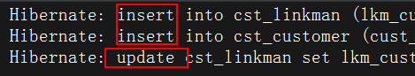
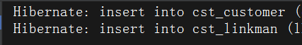

# 一、JPA 规范基本使用

## 1、导入 jar 包

```xml
<dependency>
    <groupId>junit</groupId>
    <artifactId>junit</artifactId>
    <version>4.12</version>
    <scope>test</scope>
</dependency>

<dependency>
    <groupId>org.hibernate</groupId>
    <artifactId>hibernate-entitymanager</artifactId>
    <version>5.4.10.Final</version>
</dependency>

<dependency>
    <groupId>com.mchange</groupId>
    <artifactId>c3p0</artifactId>
    <version>0.9.5.2</version>
</dependency>

<dependency>
    <groupId>mysql</groupId>
    <artifactId>mysql-connector-java</artifactId>
    <version>8.0.17</version>
</dependency>
```

## 2、JPA 核心配置文件

* 位置：**classpath 下的 META-INF 目录下** 
* 名字：**persistence.xml** 

```xml
<!--约束-->
<?xml version="1.0" encoding="UTF-8"?>
<persistence xmlns="http://java.sun.com/xml/ns/persistence" version="2.0">
    <persistence-unit name="">
        
    </persistence-unit>
</persistence>
```

* 具体配置

```xml
<?xml version="1.0" encoding="UTF-8"?>
<persistence xmlns="http://java.sun.com/xml/ns/persistence" version="2.0">
    <!--需要配置persistence-unit节点
        持久化单元：
            name：持久化单元名称(名字随意)
            transaction-type：事务管理的方式
                JTA：分布式事务管理
                RESOURCE_LOCAL：本地事务管理
    -->
    <persistence-unit name="myJPA" transaction-type="RESOURCE_LOCAL">
        <!--1、JPA实现方式(此处借助 Hibernate 实现)-->
        <provider>org.hibernate.jpa.HibernatePersistenceProvider</provider>
        <!--2、配置数据库信息-->
        <properties>
            <property name="javax.persistence.jdbc.driver" value="com.mysql.cj.jdbc.Driver"/>
            <property name="javax.persistence.jdbc.url" value="jdbc:mysql://localhost:3306/test?serverTimezone=UTC"/>
            <property name="javax.persistence.jdbc.user" value="root"/>
            <property name="javax.persistence.jdbc.password" value="123456"/>

            <!--3、配置 JPA 实现方式的配置信息，此处配置 Hibernate 的配置信息
                显示sql           ：   false|true
                自动创建数据库表  ：  hibernate.hbm2ddl.auto
                        create    : 程序运行时创建数据库表（如果有表，先删除表再创建）
                        update    ：程序运行时创建表（如果有表，不会创建表）
                        none      ：不会创建表
            -->
            <property name="hibernate.show_sql" value="true"/>
            <property name="hibernate.hbm2ddl.auto" value="update"/>
            <property name="hibernate.format_sql" value="true"/>
        </properties>
    </persistence-unit>
</persistence>
```


## 3、配置数据库表和类的对应信息

```java
@Entity
@Table(name = "user")
public class User {
    @Id
    @Column(name = "name")
    private String name;

    @Column(name = "addr")
    private String addr;
    ...
}
```


## 4、操作数据库

```java
public void test() {
    // 1、加载配置文件创建工厂(实体类管理器)对象
    EntityManagerFactory myJPA = Persistence.createEntityManagerFactory("myJPA");
    // 2、获取实体类管理器对象
    EntityManager entityManager = myJPA.createEntityManager();
    // 3、获取事务对象，开启事务管理
    EntityTransaction transaction = entityManager.getTransaction();
    transaction.begin();
    // 4、CRUD 操作
    // 保存一个用户
    User user = new User();
    user.setName("洛阳");
    user.setAddr("北莽");
    entityManager.persist(user);

    // 提交事务
    transaction.commit();

    // 释放连接
    entityManager.close();
    myJPA.close();
}
```


## 5、JPA 的 API 介绍

### Persistence 对象

​		主要作用是用于获取 `EntityManagerFactory` 对象的 。通过调用该类的 `createEntityManagerFactory` 静态方法，根据配置文件中持久化单元名称创建 `EntityManagerFactory` 

```java
EntityManagerFactory factory = Persistence.createEntityManagerFactory("myJPA");
```


### EntityManagerFactory

​		**EntityManagerFactory 接口主要用来创建 EntityManager 实例**。由于EntityManagerFactory 是一个线程安全的对象（即多个线程访问同一个EntityManagerFactory 对象不会有线程安全问题），并且 **EntityManagerFactory 的创建极其浪费资源**，所以在使用 JPA 编程时，我们可以对 EntityManagerFactory 的创建进行优化，只需要做到**一个工程只存在一个 EntityManagerFactory 即可** 

```java
//创建实体管理类对象
EntityManager em = factory.createEntityManager();
```


### EntityManager

​		在 JPA 规范中，**EntityManager 是完成持久化操作的核心对象**，我们可以通过调用 EntityManager 的方法完成获取事务，以及持久化数据库的操作

```java
// 2、获取实体类管理器对象
EntityManager entityManager = factory.createEntityManager();
// 3、获取事务对象，开启事务管理
EntityTransaction transaction = entityManager.getTransaction();
transaction.begin();
// 4、CRUD 操作
// 保存一个用户
User user = new User();
user.setName("洛阳");
user.setAddr("北莽");
entityManager.persist(user);
```

* 根据 ID 查询
  * 方式一：使用 find（） 方法
    * 这种方式会**立即向数据库发送查询语句** 
  * 方式二：使用 getReference（）方法
    * 这种方式获取的是一个动态代理对象，不会立即发送查询语句，**只有当该对象被使用的时候才会向数据库发送查询语句** 

```java
// 方式一
User user = entityManager.find(User.class, "徐凤年");
// 方式二
User user = entityManager.getReference(User.class, "徐凤年");
```

* 根据 ID 删除

```java
// 先查询
User user = entityManager.find(User.class, "徐凤年");
// 再删除
entityManager.remove(user);
```

* 更新操作（不能操作键）

```java
User user = entityManager.find(User.class, "徐凤年");
user.setAddr("北莽");
entityManager.merge(user);
```

* 分页查询

```java
String jpql = "from User";
Query query = entityManager.createQuery(jpql);
query.setFirstResult(2);
query.setMaxResults(3);
List<User> resultList = query.getResultList();
```

* 模糊查询

```java
String jpql = "from User where name like ?1";
Query query = entityManager.createQuery(jpql);
query.setParameter(1, "%徐%");
List<User> resultList = query.getResultList();
```


### EntityTransaction

在 JPA 规范中, EntityTransaction 是完成事务操作的核心对象，对于EntityTransaction 在我们的 java 代码中承接的功能比较简单

```java
begin：开启事务
commit：提交事务
rollback：回滚事务
```


# 二、Spring Data JPA

## 1、基本配置

### 所需 Jar 包

```xml
<!-- junit单元测试 -->
<dependency>
    <groupId>junit</groupId>
    <artifactId>junit</artifactId>
    <version>4.12</version>
    <scope>test</scope>
</dependency>

<dependency>
    <groupId>org.springframework</groupId>
    <artifactId>spring-test</artifactId>
    <version>5.2.0.RELEASE</version>
    <scope>test</scope>
</dependency>

<!--Spring 及 Spring Data JPA，引入 Sring Data JPA 之后会自动引入对应版本的相关依赖-->
<dependency>
    <groupId>org.springframework.data</groupId>
    <artifactId>spring-data-jpa</artifactId>
    <version>2.2.0.RELEASE</version>
</dependency>

<!-- hibernate -->
<dependency>
    <groupId>org.hibernate</groupId>
    <artifactId>hibernate-core</artifactId>
    <version>5.4.10.Final</version>
</dependency>

<!-- 数据库 -->
<dependency>
    <groupId>c3p0</groupId>
    <artifactId>c3p0</artifactId>
    <version>0.9.1.2</version>
</dependency>

<dependency>
    <groupId>mysql</groupId>
    <artifactId>mysql-connector-java</artifactId>
    <version>8.0.17</version>
</dependency>
```

### 配置文件

```xml
<!--数据库连接池-->
<bean id="dataSource" class="com.mchange.v2.c3p0.ComboPooledDataSource">
    <property name="driverClass" value="com.mysql.cj.jdbc.Driver"/>
    <property name="jdbcUrl" value="jdbc:mysql://localhost:3306/test?serverTimezone=UTC"/>
    <property name="user" value="root"/>
    <property name="password" value="123456"/>
</bean>

<!--创建 entityManagerFactory 对象交给 Spring 管理-->
<bean id="entityManagerFactory" class="org.springframework.orm.jpa.LocalContainerEntityManagerFactoryBean">
    <!--注入 dataSource-->
    <property name="dataSource" ref="dataSource"/>

    <!--实体类-->
    <property name="packagesToScan" value="com.tfc.example.entity"/>

    <!--JPA的供应商适配器-->
    <property name="jpaVendorAdapter">
        <bean class="org.springframework.orm.jpa.vendor.HibernateJpaVendorAdapter"/>
    </property>

    <!--Hibernate属性配置-->
    <property name="jpaProperties">
        <props>
            <prop key="hibernate.dialect">org.hibernate.dialect.MySQL5InnoDBDialect</prop>
            <prop key="hibernate.show_sql">true</prop>
            <prop key="hibernate.format_sql">true</prop>
            <prop key="hibernate.hbm2ddl.auto">update</prop>
        </props>
    </property>
</bean>

<!--事务管理器-->
<bean id="transactionManager" class="org.springframework.orm.jpa.JpaTransactionManager">
    <property name="entityManagerFactory" ref="entityManagerFactory"/>
</bean>

<!-- 配置支持注解的事务 -->
<tx:annotation-driven transaction-manager="transactionManager"/>

<!--整合 Spring Data JPA-->
<jpa:repositories base-package="com.tfc.example.dao"
                  transaction-manager-ref="transactionManager"
                  entity-manager-factory-ref="entityManagerFactory"/>

<!--扫描注解-->
<context:component-scan base-package="com.tfc.example"/>
```

### 实体类

```java
@Entity
@Table(name = "user")
@Proxy(lazy = false)   // 关闭延迟加载（立即向数据库发送查询语句）
public class User {

    @Id
    @GeneratedValue(strategy = GenerationType.IDENTITY)
    @Column(name = "name")
    private String name;

    @Column(name = "addr")
    private String addr;
    		...
}
```

### 接口

```java
public interface UserDao extends JpaRepository<User, String>, JpaSpecificationExecutor<User> {
}
```


### 测试

```java
@Test
public void test() {
    Optional<User> user = userDao.findById("徐凤年");
    System.out.println(user);
}
```


## 2、基本查询

### 保存、更新

**主键最好不要设置为 String 类型** 

* 如果设置了主键，则是先查询，再更新数据
* 如果没有设置主键，则根据设置主键自增原则插入一条数据

```java
@Test
public void testSave(){
    User user = new User();
    user.setAddr("西安");
    user.setName("徐凤年");
    userDao.save(user);
}
```

### 删除

* 先查询，若果有存在该数据，则删除

```java
@Test
public void testDelete(){
    userDao.deleteById("徐凤年");
}
```

### 查询所有

```java
@Test
public void testFindAll() {
    List<User> users = userDao.findAll();
    for (User user : users) {
        System.out.println(user);
    }
}
```


## 3、复杂查询

### 使用 JPQL 语句查询

1、在接口中新增方法

2、使用 @Query 注解自定义查询语句

```java
public interface UserDao extends JpaRepository<User, String>, JpaSpecificationExecutor<User> {

    /**
     * 根据客户住址查询
     */
    @Query(value = "from User where name = ?1")
    User findByName(String name);
}
```

```java
@Test
public void testFindByAddr() {
    User users = userDao.findByName("徐骁");
    System.out.println(users);
}
```


### ？占位符解释

```java
@Query(value = "from User where name = ?1 and addr = ?2")
User findByNameAndAddr(String name, String addr);
/**
	解释：?1 表示对应参数列表中的第一个参数，?2 表示对应参数列表中第二个参数，
		 参数列表中参数的位置顺序没有要求
*/
```


### 使用本地 SQL 查询

只需要在 `@Query` 注解中添加一个参数即可

* **nativeQuery = true** 

```java
@Query(value = "select * from User where name = ?1 and addr = ?2", nativeQuery = true)
User findByNameAndAddr(String name, String addr);
```


### 动态查询

1、利用匿名内部类的方式创建一个实现了 **Specification** 接口的对象

2、实现 **toPredicate**方法（构造查询条件），借助方法参数中的参数来构造查询条件

* **root**：获取需要查询的对象属性
* **CriteriaBuilder**：构造查询条件的，内部封装了很多的查询条件（模糊匹配，精准匹配）

例：

```java
@Test
public void test() {
    Specification<User> specification = new Specification<User>() {
        @Override
        public Predicate toPredicate(Root<User> root, CriteriaQuery<?> criteriaQuery, CriteriaBuilder criteriaBuilder) {
            Path<Object> name = root.get("name");
            Predicate predicate = criteriaBuilder.equal(name, "徐骁");
            return predicate;
        }
    };
    Optional<User> one = userDao.findOne(specification);
    System.out.println(one);
}
```

```java
/**
     * 多条件查询
     *      案例：根据客户名（传智播客）和客户所属行业查询（it教育）
     *
     */
@Test
public void testSpec1() {
    /**
         *  root:获取属性
         *      客户名
         *      所属行业
         *  cb：构造查询
         *      1.构造客户名的精准匹配查询
         *      2.构造所属行业的精准匹配查询
         *      3.将以上两个查询联系起来
         */
    Specification<Customer> spec = new Specification<Customer>() {
        @Override
        public Predicate toPredicate(Root<Customer> root, CriteriaQuery<?> query, CriteriaBuilder cb) {
            Path<Object> custName = root.get("custName");//客户名
            Path<Object> custIndustry = root.get("custIndustry");//所属行业

            //构造查询
            //1.构造客户名的精准匹配查询
            Predicate p1 = cb.equal(custName, "传智播客");//第一个参数，path（属性），第二个参数，属性的取值
            //2..构造所属行业的精准匹配查询
            Predicate p2 = cb.equal(custIndustry, "it教育");
            //3.将多个查询条件组合到一起：组合（满足条件一并且满足条件二：与关系，满足条件一或满足条件二即可：或关系）
            Predicate and = cb.and(p1, p2);//以与的形式拼接多个查询条件
            // cb.or();//以或的形式拼接多个查询条件
            return and;
        }
    };
    Customer customer = customerDao.findOne(spec);
    System.out.println(customer);
}
```

* 模糊查询

```java
@Test
public void testSpec3() {
    //构造查询条件
    Specification<Customer> spec = new Specification<Customer>() {
        @Override
        public Predicate toPredicate(Root<Customer> root, CriteriaQuery<?> query, CriteriaBuilder cb) {
            //查询属性：客户名
            Path<Object> custName = root.get("custName");
            //查询方式：模糊匹配
            Predicate like = cb.like(custName.as(String.class), "传智播客%");
            return like;
        }
    };
    List<Customer> list = customerDao.findAll(spec);
    for (Customer customer : list) {
        System.out.println(customer);
    }

}
```

* 添加排序功能

```java
//添加排序
//创建排序对象,需要调用构造方法实例化sort对象
//第一个参数：排序的顺序（倒序，正序）
//   Sort.Direction.DESC:倒序
//   Sort.Direction.ASC ： 升序
//第二个参数：排序的属性名称
Sort sort = new Sort(Sort.Direction.DESC,"custId");
List<Customer> list = customerDao.findAll(spec, sort);
for (Customer customer : list) {
    System.out.println(customer);
}
```

* 分页查询

```java
/**
     * 分页查询
     *      Specification: 查询条件
     *      Pageable：分页参数
     *          分页参数：查询的页码，每页查询的条数
     *          findAll(Specification,Pageable)：带有条件的分页
     *          findAll(Pageable)：没有条件的分页
     *  返回：Page（springDataJpa为我们封装好的pageBean对象，数据列表，共条数）
     */
@Test
public void testSpec4() {

    Specification spec = null;
    //PageRequest 对象是 Pageable 接口的实现类
    /**
         * 创建 PageRequest 的过程中，需要调用他的构造方法传入两个参数
         *      第一个参数：当前查询的页数（从0开始）
         *      第二个参数：每页查询的数量
         */
    Pageable pageable = new PageRequest(0,2);
    //分页查询
    Page<Customer> page = customerDao.findAll(null, pageable);
    System.out.println(page.getContent()); //得到数据集合列表
    System.out.println(page.getTotalElements());//得到总条数
    System.out.println(page.getTotalPages());//得到总页数
}
```


## 4、多表查询

**一对多** 

* 一的一方：主表
* 多的一方：从表

**多对多** 

* 中间表：中间表中最少应该由两个字段组成，这两个字段做为外键指向两张表的主键，又组成了联合主键


### 一对多

> 客户（一）联系人（多）

​		在一对多关系中，我们习惯把`一`的一方称之为主表，把`多`的一方称之为从表。**在数据库中建立一对多的关系，需要使用数据库的外键约束** 

* 实体类

```java
// 客户实体类
@Entity
@Table(name = "cst_customer")
@Lazy(value = false)
public class Customer {

    @Id
    @GeneratedValue(strategy = GenerationType.IDENTITY)
    @Column(name = "cust_id")
    private Long custId;
    @Column(name = "cust_address")
    private String custAddress;
    @Column(name = "cust_industry")
    private String custIndustry;
    @Column(name = "cust_level")
    private String custLevel;
    @Column(name = "cust_name")
    private String custName;
    @Column(name = "cust_phone")
    private String custPhone;
    @Column(name = "cust_source")
    private String custSource;

    /*
    	@OneToMany : 配置一对多关系
    		targetEntity ：对方对象的字节码对象
    	@JoinColumn : 配置外键
    		name：外键字段名称
    		referencedColumnName：参照的主表的主键字段名称
    	
    	在客户实体类上（一的一方）添加了外键了配置，所以对于客户而言，也具备了维护外键的作用
    */
    @OneToMany(targetEntity = LinkMan.class)
    @JoinColumn(name = "lkm_cust_id", referencedColumnName = "cust_id")
    private Set<LinkMan> linkMans = new HashSet<>();
     	....
}
```


```java
// 联系人实体类
@Entity
@Table(name = "cst_linkman")
@Lazy(value = false)
public class LinkMan {

    @Id
    @GeneratedValue(strategy = GenerationType.IDENTITY)
    @Column(name = "lkm_id")
    private Long lkmId; //联系人编号(主键)
    @Column(name = "lkm_name")
    private String lkmName;//联系人姓名
    @Column(name = "lkm_gender")
    private String lkmGender;//联系人性别
    @Column(name = "lkm_phone")
    private String lkmPhone;//联系人办公电话
    @Column(name = "lkm_mobile")
    private String lkmMobile;//联系人手机
    @Column(name = "lkm_email")
    private String lkmEmail;//联系人邮箱
    @Column(name = "lkm_position")
    private String lkmPosition;//联系人职位
    @Column(name = "lkm_memo")
    private String lkmMemo;//联系人备注

    /*
    	@ManyToOne : 配置一对多关系
    		targetEntity ：对方对象的字节码对象
    	@JoinColumn : 配置外键
    		name：外键字段名称
    		referencedColumnName：参照的主表的主键字段名称
    	
    	配置外键的过程，配置到了多的一方，就会在多的一方维护外键
    */
    @ManyToOne(targetEntity = Customer.class)
    @JoinColumn(name = "lkm_cust_id", referencedColumnName = "cust_id")
    private Customer customer;
        ........
}
```

* 接口

```java
public interface CustomerDao extends JpaRepository<Customer, Long>, JpaSpecificationExecutor<Customer> {
}

public interface LinkManDao extends JpaRepository<LinkMan, Long>, JpaSpecificationExecutor<LinkMan> {
}
```


* 测试

```java
@Test
public void test() {
    Customer customer = new Customer();
    customer.setCustName("徐凤年");

    LinkMan linkMan = new LinkMan();
    linkMan.setLkmName("徐骁");

    // 通过客户（一的一方）维护外键
    customer.getLinkMans().add(linkMan);

    linkManDao.save(linkMan);
    customerDao.save(customer);
}
```

* 结果



发送了三条`SQL` 语句，两条插入，一条更新，这是由于`一的一方` 在维护外键


```java
@Test
public void test() {
    Customer customer = new Customer();
    customer.setCustName("徐凤年");

    LinkMan linkMan = new LinkMan();
    linkMan.setLkmName("徐骁");

    // 通过联系人（多的一方）来维护外键
    linkMan.setCustomer(customer);

    customerDao.save(customer);
    linkManDao.save(linkMan);
}
```

* 结果



只发送了两条插入语句，因为是`多的一方` 在维护外键


可以让 `一的一方` 放弃维护外键，只让 `多的一方` 维护外键，这样就不会多出一条 `update` 语句


### 多表删除

* 从表
  * **从表数据可以随时任意删除** 
* 主表
  * 被从表数据引用时
    * 在默认情况下，它会把外键字段置为 null，然后删除主表数据
    * **如果在数据库的表结构上，外键字段有==非空约束==，默认情况就会报错了** 
    * 如果配置了放弃维护关联关系的权利，则不能删除（与外键字段是否允许为 null 没有关系）因为在删除时，它根本不会去更新从表的外键字段了
    * 使用级联删除引用
      * **==在实际开发中，级联删除请慎用！(在一对多的情况下)==** 
  * **没有从表数据引用：随便删** 


**==级联操作：操作一个对象时同时操作他所关联的对象==** 


> 级联添加：当保存一个客户的同时也会保存联系人

1、在主表上添加级联配置：即 `cascade` 属性

```java
@OneToMany(mappedBy = "customer", cascade = CascadeType.ALL)
private Set<LinkMan> linkMans = new HashSet<>();
```

* 测试

```java
@Test
@Transactional
@Rollback(false)
public void test() {
    Customer customer = new Customer();
    customer.setCustName("徐凤年");

    LinkMan linkMan = new LinkMan();
    linkMan.setLkmName("徐骁");

    customer.getLinkMans().add(linkMan);
    linkMan.setCustomer(customer);

    customerDao.save(customer);
}
```


> 级联删除：删除客户的同时也删除客户所关联的所有联系人

也需要在主表上配置 `cascade` 属性

```java
@OneToMany(mappedBy = "customer", cascade = CascadeType.ALL)
private Set<LinkMan> linkMans = new HashSet<>();
```

* 测试

```java
@Test
@Transactional
@Rollback(false)
public void test() {
    Customer customer = customerDao.getOne(1l);
    customerDao.delete(customer);
}
```


### 多对多

> 案例：用户和角色（多对多关系）

1、明确表关系：多对多关系

2、使用什么方式关联表（描述 外键 | 中间表）：中间表

3、编写实体类，在实体类中描述表关系（包含关系）

4、配置映射关系

* 实体类

```java
@Entity
@Table(name = "user")
@Lazy(value = false)
public class User {
    @Id
    @GeneratedValue(strategy = GenerationType.IDENTITY)
    @Column(name = "user_id")
    private Long userId;

    @Column(name = "name")
    private String userName;

    @Column(name = "age")
    private Integer userAge;

    @ManyToMany(targetEntity = Role.class)
    @JoinTable(name = "user_role",
            // 当前表在中间表中的外键
            joinColumns = {@JoinColumn(name = "sys_user_id", referencedColumnName = "user_id")},
            // 对方表在中间表中的外键
            inverseJoinColumns = {@JoinColumn(name = "sys_role_id", referencedColumnName = "role_id")}
    )
    private Set<Role> roles = new HashSet<>();
		    ........
}
```

```java
@Entity
@Table(name = "role")
@Lazy(value = false)
public class Role {
    @Id
    @GeneratedValue(strategy = GenerationType.IDENTITY)
    @Column(name = "role_id")
    private Long roleId;

    @Column(name = "name")
    private String roleName;

    /*@JoinTable(name = "user_role",
            // 当前表在中间表中的外键
            joinColumns = {@JoinColumn(name = "sys_role_id", referencedColumnName = "role_id")},
            // 对方表在中间表中的外键
            inverseJoinColumns = {@JoinColumn(name = "sys_user_id", referencedColumnName = "user_id")}
    )*/
    @ManyToMany(mappedBy = "roles") // 放弃维护中间表
    private Set<User> users = new HashSet<>();
        ......
}
```

* 接口

```java
public interface RoleDao extends JpaRepository<Role,Long>, JpaSpecificationExecutor<Role> {
}

public interface UserDao extends JpaRepository<User, String>, JpaSpecificationExecutor<User> {
}
```

* 测试

```java
@Test
@Transactional
@Rollback(false)
public void test() {
    User user = new User();
    user.setUserName("TFC");

    Role role = new Role();
    role.setRoleName("徐凤年");

    user.getRoles().add(role);
    role.getUsers().add(user);

    userDao.save(user);
    roleDao.save(role);
}
```


多对多也可以设置级联操作，


