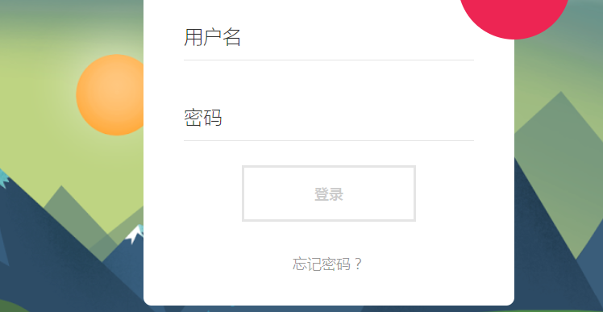
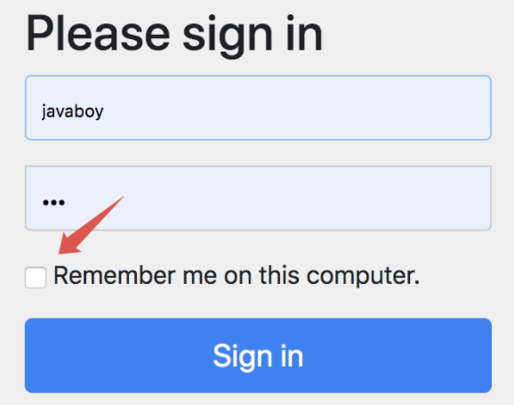
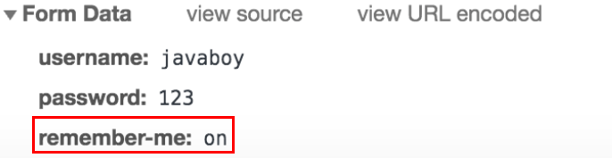

# 登录认证案例

1、新建一个 SpringBoot 项目，添加 Spring Security 和 Web 依赖

2、写一个 Controller 进行测试

```java
@RestController
public class HelloController {
    @GetMapping("/hello")
    public String hello() {
        return "hello";
    }
}
```

3、直接启动项目，这时控制台会打印这样一句内容

```java
Using generated security password: 30abfb1f-36e1-446a-a79b-f70024f589ab
```

这时 Spring Security 默认提供的一个默认登录密码（默认用户名是 **user**），**如果不进行设置的话，每次启动临时密码都不一样** 

在 Spring Security 中，默认的登录页面和登录接口都是 `/login` ，只不过一个是 get 请求（登录页面），另一个是 post 请求（登录接口）

**「大家可以看到，非常方便，一个依赖就保护了所有接口」** 


## 自定义用户

### 1、在配置文件中进行配置

```properties
spring.security.user.name=coder
spring.security.user.password=111
```

再次访问就用自定义的进行登录访问


### 2、通过配置类进行配置

密码加密方式：实现 **PasswordEncoder** 接口

Spring Security 提供了多种密码加密方案，官方推荐使用 **BCryptPasswordEncoder**，而BCryptPasswordEncoder 就是 PasswordEncoder 接口的实现类，BCryptPasswordEncoder 使用 BCrypt 强哈希函数，开发者在使用时可以选择提供 strength 和 SecureRandom 实例。strength 越大，密钥的迭代次数越多，密钥迭代次数为 2^strength。strength 取值在 4~31 之间，默认为 10

```java
public interface PasswordEncoder {
    String encode(CharSequence var1);                     // 加密

    boolean matches(CharSequence var1, String var2);      // 密码校对

    // 是否还要进行再次加密，这个一般来说就不用了
    default boolean upgradeEncoding(String encodedPassword) {
        return false;
    }
}
```

具体配置

```java
@Configuration
public class SecurityConfig extends WebSecurityConfigurerAdapter {

    @Bean
    public PasswordEncoder passwordEncoder() {
        return NoOpPasswordEncoder.getInstance();
    }

    @Override
    protected void configure(AuthenticationManagerBuilder auth) throws Exception {
        auth.inMemoryAuthentication()
                .withUser("coder")
                .password("111").roles("admin");
    }
}
```

1、首先需要继承 **WebSecurityConfigurerAdapter**，重写里面的 **configure** 方法

2、提供一个 PasswordEncoder 的实例，因为目前的案例还比较简单，因此暂时先不给密码进行加密，所以返回 NoOpPasswordEncoder 的实例即可

3、configure 方法中，我们通过 inMemoryAuthentication 来开启在内存中定义用户，withUser 中是用户名，password 中则是用户密码，roles 中是用户角色

4、如果需要配置多个用户，用 and 相连

> and 的作用

​	and 符号相当于就是 XML 标签的结束符，表示结束当前标签，这是个时候上下文会回到 inMemoryAuthentication 方法中，然后开启新用户的配置


### 3、实现UserDetailService接口

由于 Spring Security 支持多种数据源，例如内存、数据库、LDAP 等，这些不同来源的数据被共同封装成了一个 UserDetailService 接口，任何实现了该接口的对象都可以作为认证数据源

因此我们还可以通过**重写 WebSecurityConfigurerAdapter 中的 userDetailsService 方法来提供一个 UserDetailService 实例进而配置多个用户**：

```java
@Bean
protected UserDetailsService userDetailsService() {
    InMemoryUserDetailsManager manager = new InMemoryUserDetailsManager();
    manager.createUser(User.withUsername("coder").password("111").roles("admin").build());
    manager.createUser(User.withUsername("tfc").password("111").roles("user").build());
    return manager;
}
```


## 自定义登录页面

在Spring Security 的配置类 SecurityConfig 类中，继续重写它的 `configure(WebSecurity web)` 和 `configure(HttpSecurity http)` 方法，如下：

```java
@Override
public void configure(WebSecurity web) throws Exception {
    web.ignoring().antMatchers("/js/**", "/css/**", "/images/**");  // 不拦截静态资源
}

@Override
protected void configure(HttpSecurity http) throws Exception {
    http.authorizeRequests()               // 开启验证
            .anyRequest().authenticated()  // 所有请求必须验证后访问
            .and()
            .formLogin()
            .loginPage("/login.html") 
            .permitAll()
            .and()
            .csrf().disable();
}
```

设置了 loginPage("/login.html")，之后，登录接口默认也是这个，所以在 form 表单中，注意 action 为 `/login.html` 

```html
<form action="/login.html" method="post">
```


## 登录页面和登录接口

登录接口是提交登录数据的地方，就是登录页面里边的 form 表单的 action 属性对应的值

登录页面就是你看到的浏览器展示出来的页面，像下面这个：




在 Spring Security 中，如果我们不做任何配置，默认的登录页面和登录接口的地址都是 `/login`，也就是说，默认会存在如下两个请求：

- GET http://localhost:8080/login
- POST http://localhost:8080/login

如果是 GET 请求表示你想访问登录页面，如果是 POST 请求，表示你想提交登录数据

```java
.and()
.formLogin()
.loginPage("/login.html")
.permitAll()
.and()
```

当我们配置了 loginPage 为 `/login.html` 之后，这个配置从字面上理解，就是设置登录页面的地址为 `/login.html`。

实际上它还有一个隐藏的操作，就是登录接口地址也设置成 `/login.html` 了。换句话说，新的登录页面和登录接口地址都是 `/login.html`，现在存在如下两个请求：

- GET http://localhost:8080/login.html
- POST http://localhost:8080/login.html

> 分开配置登录页面和登录接口

```java
.and()
.formLogin()
.loginPage("/login.html")         // 登录页面
.loginProcessingUrl("/doLogin")   // 登录接口
.permitAll()
.and()
```

此时我们还需要修改登录页面里边的 action 属性，改为 `/doLogin`，如下：

```html
<form action="/doLogin" method="post">
<!--省略-->
</form>
```


## 登录参数

登录表单中的参数是 username 和 password，注意，默认情况下，这个不能变：

```html
<form action="/login.html" method="post">
    <input type="text" name="username" id="name">
    <input type="password" name="password" id="pass">
    <button type="submit">
      <span>登录</span>
    </button>
</form>
```

当然，这两个参数我们也可以自己配置，自己配置方式如下：

```java
.and()
.formLogin()
.loginPage("/login.html")
.loginProcessingUrl("/doLogin")
.usernameParameter("name")
.passwordParameter("passwd")
.permitAll()
.and()
```

配置完成后，也要修改一下前端页面：

```html
<form action="/login.html" method="post">
    <input type="text" name="name" id="name">
    <input type="password" name="passwd" id="pass">
    <button type="submit">
      <span>登录</span>
    </button>
</form>
```


## 登录成功回调

### 1、前后端不分登录

在 Spring Security 中，和登录成功重定向 URL 相关的方法有两个：

- defaultSuccessUrl
- successForwardUrl

首先我们在配置的时候，defaultSuccessUrl 和 successForwardUrl 只需要配置一个即可，具体配置哪个，则要看你的需求，**两个的区别如下**：

1. defaultSuccessUrl 有一个重载的方法，我们先说一个参数的 defaultSuccessUrl 方法。如果我们在 defaultSuccessUrl 中指定登录成功的跳转页面为 `/index`，此时分两种情况，如果你是直接在浏览器中输入的登录地址，登录成功后，就直接跳转到 `/index`，如果你是在浏览器中输入了其他地址，例如 `http://localhost:8080/hello`，结果因为没有登录，又重定向到登录页面，此时登录成功后，就不会来到 `/index` ，而是来到 `/hello` 页面

2. defaultSuccessUrl 还有一个重载的方法，**第二个参数如果不设置默认为 false，也就是我们上面的的情况，如果手动设置第二个参数为 true，则 defaultSuccessUrl 的效果和 successForwardUrl 一致** 

3. successForwardUrl 表示不管你是从哪里来的，登录后一律跳转到 successForwardUrl 指定的地址。例如successForwardUrl 指定的地址为 `/index` ，你在浏览器地址栏输入 `http://localhost:8080/hello`，结果因为没有登录，重定向到登录页面，当你登录成功之后，就会服务端跳转到 `/index` 页面；或者你直接就在浏览器输入了登录页面地址，登录成功后也是来到 `/index` 

相关配置如下：

```java
.and()
.formLogin()
.loginPage("/login.html")
.loginProcessingUrl("/doLogin")
.usernameParameter("name")
.passwordParameter("passwd")

.defaultSuccessUrl("/index")
.successForwardUrl("/index")

.permitAll()
.and()
```

**「注意：实际操作中，defaultSuccessUrl 和 successForwardUrl 只需要配置一个即可」** 


### 2、前后端分离的数据交互

在前后端分离这样的开发架构下，前后端的交互都是通过 JSON 来进行，**无论登录成功还是失败，都不会有什么服务端跳转或者客户端跳转之类** 

登录成功了，服务端就返回一段登录成功的提示 JSON 给前端，前端收到之后，该跳转该展示，由前端自己决定，就和后端没有关系了

登录失败了，服务端就返回一段登录失败的提示 JSON 给前端，前端收到之后，该跳转该展示，由前端自己决定，也和后端没有关系了


之前我们配置登录成功的处理是通过如下两个方法来配置的：

- defaultSuccessUrl
- successForwardUrl

**这两个都是配置跳转地址的，适用于前后端不分的开发**。除了这两个方法之外，还有一个必杀技，那就是 **successHandler** 

successHandler 的功能十分强大，甚至已经囊括了 defaultSuccessUrl 和 successForwardUrl 的功能。我们来看一下：

```java
.successHandler((req, resp, authentication) -> {
    Object principal = authentication.getPrincipal();
    resp.setContentType("application/json;charset=utf-8");
    PrintWriter out = resp.getWriter();
    out.write(new ObjectMapper().writeValueAsString(principal));
    out.flush();
    out.close();
})
```

successHandler 方法的参数是一个 **AuthenticationSuccessHandler** 对象，这个对象中我们要实现的方法是 **onAuthenticationSuccess** 

**onAuthenticationSuccess 方法有三个参数**，分别是：

- HttpServletRequest
- HttpServletResponse
- Authentication

有了前两个参数，我们就可以在这里随心所欲的返回数据了。利用 HttpServletRequest 我们可以做服务端跳转，利用 HttpServletResponse 我们可以做客户端跳转，当然，也可以返回 JSON 数据,**第三个 Authentication 参数则保存了我们刚刚登录成功的用户信息** 


## 登录失败回调

> 1、前后端部分的回调方式

与登录成功相似，登录失败也是有两个方法：

- failureForwardUrl
- failureUrl


**这两个方法在设置的时候也是设置一个即可**。failureForwardUrl 是登录失败之后会发生服务端跳转，failureUrl 则在登录失败之后，会发生重定向

> 2、前后端分离的回调方式

```java
.failureHandler((req, resp, e) -> {
    resp.setContentType("application/json;charset=utf-8");
    PrintWriter out = resp.getWriter();
    out.write(e.getMessage());
    out.flush();
    out.close();
})
```

失败的回调也是三个参数，前两个就不用说了，第三个是一个 Exception，对于登录失败，会有不同的原因，**Exception 中则保存了登录失败的原因，我们可以将之通过 JSON 返回到前端** 


## 注销登录

注销登录的默认接口是 `/logout`，我们也可以配置

```java
.and()
.logout()
.logoutUrl("/logout")
.logoutRequestMatcher(new AntPathRequestMatcher("/logout","POST"))
.logoutSuccessUrl("/index")
.deleteCookies()
.clearAuthentication(true)
.invalidateHttpSession(true)
.permitAll()
```

注销登录的配置：

1. 默认注销的 URL 是 `/logout`，是一个 GET 请求，我们可以通过 logoutUrl 方法来修改默认的注销 URL
2. logoutRequestMatcher 方法不仅可以修改注销 URL，还可以修改请求方式，实际项目中，这个方法和 logoutUrl 任意设置一个即可
3. logoutSuccessUrl 表示注销成功后要跳转的页面
4. deleteCookies 用来清除 cookie
5. clearAuthentication 和 invalidateHttpSession 分别表示清除认证信息和使 HttpSession 失效，默认可以不用配置，默认就会清除

> 前后端分离的注销方式

注销登录我们前面说过，按照前面的配置，注销登录之后，系统自动跳转到登录页面，这也是不合适的，如果是前后端分离项目，注销登录成功后返回 JSON 即可，配置如下：

```java
.and()
.logout()
.logoutUrl("/logout")
.logoutSuccessHandler((req, resp, authentication) -> {
    resp.setContentType("application/json;charset=utf-8");
    PrintWriter out = resp.getWriter();
    out.write("注销成功");
    out.flush();
    out.close();
})
.permitAll()
.and()
```


## 未认证处理方案

在前后端分离应用中，如果用户没有登录就访问一个需要认证后才能访问的页面，这个时候，我们不应该让用户重定向到登录页面，而是给用户一个尚未登录的提示，前端收到提示之后，再自行决定页面跳转

```java
.exceptionHandling()
    .authenticationEntryPoint((req, resp, authException) -> {
        resp.setContentType("application/json;charset=utf-8");
        PrintWriter out = resp.getWriter();
        out.write("尚未登录，请先登录");
        out.flush();
        out.close();
    }
);
```


# 授权

> 前提：使用基于内存的 UserDetailService 来创建用户

接下来我们准备三个测试接口，如下：

```java
@RestController
public class HelloController {
    @GetMapping("/hello")
    public String hello() {
        return "hello";
    }

    @GetMapping("/admin/hello")
    public String admin() {
        return "admin";
    }

    @GetMapping("/user/hello")
    public String user() {
        return "user";
    }
}
```

这三个测试接口，我们的规划是这样的：

1. /hello 是任何人都可以访问的接口
2. /admin/hello 是具有 admin 身份的人才能访问的接口
3. /user/hello 是具有 user 身份的人才能访问的接口
4. 所有 user 能够访问的资源，admin 都能够访问

**「注意第四条规范意味着所有具备 admin 身份的人自动具备 user 身份」** 

接下来我们来配置权限的拦截规则，在 Spring Security 的 **configure(HttpSecurity http)** 方法中，代码如下：

```java
http.authorizeRequests()
        .antMatchers("/admin/**").hasRole("admin")
        .antMatchers("/user/**").hasRole("user")
        .anyRequest().authenticated()            //这个只能写在所有权限的最后面
    ....
```

这里的匹配规则我们采用了 Ant 风格的路径匹配符，Ant 风格的路径匹配符在 Spring 家族中使用非常广泛，它的匹配规则也非常简单：

| 通配符 | 含义             |
| :----: | :--------------- |
|   **   | 匹配多层路径     |
|   *    | 匹配一层路径     |
|   ?    | 匹配任意单个字符 |

上面配置的含义是：

1. 如果请求路径满足 `/admin/**` 格式，则用户需要具备 admin 角色
2. 如果请求路径满足 `/user/**` 格式，则用户需要具备 user 角色
3. 剩余的其他格式的请求路径，只需要认证（登录）后就可以访问

注意代码中配置的三条规则的顺序非常重要，和 Shiro 类似，Spring Security 在匹配的时候也是按照从上往下的顺序来匹配，一旦匹配到了就不继续匹配了，**「所以拦截规则的顺序不能写错」** 


另一方面，如果你强制将 anyRequest 配置在 antMatchers 前面，像下面这样：

```java
http.authorizeRequests()
        .anyRequest().authenticated()
        .antMatchers("/admin/**").hasRole("admin")
        .antMatchers("/user/**").hasRole("user")
        .and()
```

此时项目在启动的时候，就会报错，会提示不能在 anyRequest 之后添加 antMatchers,**这从语义上很好理解，anyRequest 已经包含了其他请求了，在它之后如果还配置其他请求也没有任何意义** 


## 角色继承

要实现所有 user 能够访问的资源，admin 都能够访问，这涉及到另外一个知识点，叫做**角色继承** 

上级可能具备下级的所有权限，如果使用角色继承，这个功能就很好实现，我们只需要在 **SecurityConfig** 中添加如下代码来配置角色继承关系即可：

```java
@Bean
public RoleHierarchy roleHierarchy() {
    RoleHierarchyImpl hierarchy = new RoleHierarchyImpl();
    hierarchy.setHierarchy("ROLE_admin > ROLE_user");
    return hierarchy;
}
```

上面的配置表示 `ROLE_admin` 自动具备 `ROLE_user` 的权限

* 注意，在配置时，需要给角色手动加上 `ROLE_` 前缀


# 连接数据库

## 使用自带的数据源

**Spring Security** 支持多种不同的数据源，这些不同的数据源最终都将被封装成 **UserDetailsService** 的实例，项目中，我们是自己来创建一个类实现 **UserDetailsService** 接口，除了自己封装，我们也可以使用系统默认提供的 UserDetailsService，例如InMemoryUserDetailsManager，**除了InMemoryUserDetailsManager 之外，还有一个 JdbcUserDetailsManager，使用 JdbcUserDetailsManager 可以让我们通过 JDBC 的方式将数据库和 Spring Security 连接起来** 

**JdbcUserDetailsManager 自己提供了一个数据库模型，这个数据库模型保存在如下位置：** 

```xml
org/springframework/security/core/userdetails/jdbc/users.ddl
```

内容如下：这个表示 Spring Security 提供的，字段内容不能修改

```sql
create table users(
    username varchar_ignorecase(50) not null primary key,
    password varchar_ignorecase(500) not null,
    enabled boolean not null
);

create table authorities (
    username varchar_ignorecase(50) not null,
    authority varchar_ignorecase(50) not null,
    constraint fk_authorities_users foreign key(username) references users(username)
);

create unique index ix_auth_username on authorities (username,authority);
```

可以看到，脚本中有一种数据类型 **varchar_ignorecase**，这个其实是针对 **HSQLDB 数据库**创建的，而我们使用的 MySQL 并不支持这种数据类型，所以这里需要大家手动调整一下数据类型，将 varchar_ignorecase 改为 varchar 即可

> 具体配置

1、添加数据库和 jdbc 依赖

```xml
<dependency>
    <groupId>org.springframework.boot</groupId>
    <artifactId>spring-boot-starter-jdbc</artifactId>
</dependency>

<dependency>
    <groupId>mysql</groupId>
    <artifactId>mysql-connector-java</artifactId>
    <version>8.0.17</version>
</dependency>
```

2、配置数据源

```properties
spring.datasource.username=root
spring.datasource.password=123456
spring.datasource.url=jdbc:mysql://localhost:3306/test?serverTimezone=UTC
spring.datasource.driver-class-name=com.mysql.cj.jdbc.Driver
```

3、在配置类中配置 JdbcUserDetailService

```java
@Bean   //密码加密器必须要配置
public PasswordEncoder passwordEncoder() {
    return NoOpPasswordEncoder.getInstance();
}

@Autowired
DataSource dataSource;

@Bean
protected UserDetailsService userDetailsService() {
    JdbcUserDetailsManager manager = new JdbcUserDetailsManager(dataSource);
    if (!manager.userExists("coder")) {
manager.createUser(User.withUsername("coder").password("111").roles("admin").build());
    }
    if (!manager.userExists("tfc")) {
 manager.createUser(User.withUsername("tfc").password("111").roles("user").build());
    }
    return manager;
}
```

这里的 createUser、userExists 方法、还有登录验证等操作，其实都是调用 Spring Security 写好的 SQL 去判断的，我们从它的源码里就能看出来：

```java
public class JdbcUserDetailsManager extends JdbcDaoImpl implements UserDetailsManager, GroupManager {
    public static final String DEF_CREATE_USER_SQL = "insert into users (username, password, enabled) values (?,?,?)";
    public static final String DEF_DELETE_USER_SQL = "delete from users where username = ?";
    public static final String DEF_UPDATE_USER_SQL = "update users set password = ?, enabled = ? where username = ?";
    public static final String DEF_INSERT_AUTHORITY_SQL = "insert into authorities (username, authority) values (?,?)";
    public static final String DEF_DELETE_USER_AUTHORITIES_SQL = "delete from authorities where username = ?";
    public static final String DEF_USER_EXISTS_SQL = "select username from users where username = ?";
			......
}
```


## 自定义数据源

自定义授权数据库的模型。为了操作简单，这里引入 Spring DataJpa 来完成数据库操作，在数据库中创建一个空的库，就叫做 withjpa，里边什么都不用做，这样准备工作就算完成了

> 1、创建两个实体类，分别表示角色类、用户类

用户角色：

```java
@Entity(name = "t_role")
public class Role {
    @Id
    @GeneratedValue(strategy = GenerationType.IDENTITY)
    private Long id;
    private String name;
    private String nameZh;
    ......
}
```

用户：

```java
@Entity(name = "t_user")
public class User implements UserDetails {
    @Id
    @GeneratedValue(strategy = GenerationType.IDENTITY)
    private Long id;
    private String username;
    private String password;
    private boolean accountNonExpired;
    private boolean accountNonLocked;
    private boolean credentialsNonExpired;
    private boolean enabled;

    @ManyToMany(fetch = FetchType.EAGER, cascade = CascadeType.PERSIST)
    private List<Role> roles;

    @Override
    public Collection<? extends GrantedAuthority> getAuthorities() {
        List<SimpleGrantedAuthority> authorities = new ArrayList<>();
        for (Role role : getRoles()) {
            authorities.add(new SimpleGrantedAuthority(role.getName()));
        }
        return authorities;
    }

    public String getPassword() {
        return password;
    }

    @Override
    public String getUsername() {
        return username;
    }

    @Override
    public boolean isAccountNonExpired() {
        return accountNonExpired;
    }

    @Override
    public boolean isAccountNonLocked() {
        return accountNonLocked;
    }

    @Override
    public boolean isCredentialsNonExpired() {
        return credentialsNonExpired;
    }

    @Override
    public boolean isEnabled() {
        return enabled;
    }

    public Long getId() {
        return id;
    }

    public void setId(Long id) {
        this.id = id;
    }

    public void setUsername(String username) {
        this.username = username;
    }

    public void setPassword(String password) {
        this.password = password;
    }

    public void setAccountNonExpired(boolean accountNonExpired) {
        this.accountNonExpired = accountNonExpired;
    }

    public void setAccountNonLocked(boolean accountNonLocked) {
        this.accountNonLocked = accountNonLocked;
    }

    public void setCredentialsNonExpired(boolean credentialsNonExpired) {
        this.credentialsNonExpired = credentialsNonExpired;
    }

    public void setEnabled(boolean enabled) {
        this.enabled = enabled;
    }

    public List<Role> getRoles() {
        return roles;
    }

    public void setRoles(List<Role> roles) {
        this.roles = roles;
    }
}
```

用户实体类主要需要实现  UserDetails 接口，并实现接口中的方法。

这里的字段基本都好理解，几个特殊的我来稍微说一下：

1. **accountNonExpired、accountNonLocked、credentialsNonExpired、enabled** 这四个属性分别用来描述用户的状态，表示账户是否没有过期、账户是否没有被锁定、密码是否没有过期、以及账户是否可用
2. **roles** 属性表示用户的角色，**User** 和 **Role** 是多对多关系，用一个 **@ManyToMany** 注解来描述
3. **getAuthorities** 方法返回用户的角色信息，我们在这个方法中把自己的 **Role** 稍微转化一下即可


> 2、数据模型准备好之后，再来定义一个 UserDao

```java
public interface UserDao extends JpaRepository<User,Long> {
    User findUserByUsername(String username);
}
```

这里的东西很简单，我们只需要继承 JpaRepository 然后提供一个根据 username 查询 user 的方法即可

> 3、定义 UserService

```java
@Service
public class UserService implements UserDetailsService {
    @Autowired
    UserDao userDao;
    @Override
    public UserDetails loadUserByUsername(String username) throws UsernameNotFoundException {
        User user = userDao.findUserByUsername(username);
        if (user == null) {
            throw new UsernameNotFoundException("用户不存在");
        }
        return user;
    }
}
```

我们自己定义的 UserService 需要实现 UserDetailsService 接口，实现该接口，就要实现接口中的方法，也就是 loadUserByUsername ，**这个方法的参数就是用户在登录的时候传入的用户名，根据用户名去查询用户信息（查出来之后，系统会自动进行密码比对）** 

> 4、在配置类中配置 UserDetailService

```java
@Autowired
UserService userService;

@Override
protected void configure(AuthenticationManagerBuilder auth) throws Exception {
    auth.userDetailsService(userService);
}
```

大家注意，还是重写 configure 方法，只不过这次我们不是基于内存，也不是基于 JdbcUserDetailsManager，而是使用自定义的 UserService，就这样配置就 OK 了

> 5、最后，在 Spring Boot 配置文件中配置一下数据库和 JPA 的基本信息，如下

```properties
spring.datasource.driver-class-name=com.mysql.cj.jdbc.Driver
spring.datasource.url=jdbc:mysql://localhost:3306/withjpa?serverTimezone=UTC
spring.datasource.username=root
spring.datasource.password=123456

#spring data jpa
spring.jpa.show-sql=true
spring.jpa.properties.hibernate.format_sql = true
spring.jpa.hibernate.ddl-auto=update
spring.jpa.database-platform=mysql
spring.jpa.database=mysql
spring.jpa.properties.hibernate.dialect=org.hibernate.dialect.MySQL8Dialect
```

这一套组合拳下来，我们的 Spring Security 就算是接入数据库了，接下来我们来进行测试

> 6、测试

先往数据库中添加几条数据

```java
@Autowired
UserDao userDao;

@Test
void contextLoads() {
    User u1 = new User();
    u1.setUsername("coder");
    u1.setPassword("111");
    u1.setAccountNonExpired(true);
    u1.setAccountNonLocked(true);
    u1.setCredentialsNonExpired(true);
    u1.setEnabled(true);
    List<Role> rs1 = new ArrayList<>();
    Role r1 = new Role();
    r1.setName("ROLE_admin");
    r1.setNameZh("管理员");
    rs1.add(r1);
    u1.setRoles(rs1);
    userDao.save(u1);

    User u2 = new User();
    u2.setUsername("tfc");
    u2.setPassword("111");
    u2.setAccountNonExpired(true);
    u2.setAccountNonLocked(true);
    u2.setCredentialsNonExpired(true);
    u2.setEnabled(true);
    List<Role> rs2 = new ArrayList<>();
    Role r2 = new Role();
    r2.setName("ROLE_user");
    r2.setNameZh("普通用户");
    rs2.add(r2);
    u2.setRoles(rs2);
    userDao.save(u2);
}
```

登录成功后，分别访问 `/hello`，`/admin/hello` 以及 `/user/hello` 三个接口，其中：

1. `/hello` 因为登录后就可以访问，这个接口访问成功
2. `/admin/hello` 需要 admin 身份，所以访问失败
3. `/user/hello` 需要 user 身份，所以访问成功


# 添加登录验证码

## 生成验证码

利用工具类画出一个验证码图片，这个工具类很常见，网上也有很多，就是画一个简单的验证码，**通过流将验证码写到前端页面** 

```java
public class VerifyCode {
    private int width = 100;// 生成验证码图片的宽度
    private int height = 50;// 生成验证码图片的高度
    private String[] fontNames = {"宋体", "楷体", "隶书", "微软雅黑"};
    private Color bgColor = new Color(255, 255, 255);// 定义验证码图片的背景颜色为白色
    private Random random = new Random();
    private String codes = "0123456789abcdefghijklmnopqrstuvwxyzABCDEFGHIJKLMNOPQRSTUVWXYZ";
    private String text;// 记录随机字符串

    /**
     * 获取一个随意颜色
     */
    private Color randomColor() {
        int red = random.nextInt(150);
        int green = random.nextInt(150);
        int blue = random.nextInt(150);
        return new Color(red, green, blue);
    }

    /**
     * 获取一个随机字体
     */
    private Font randomFont() {
        String name = fontNames[random.nextInt(fontNames.length)];
        int style = random.nextInt(4);
        int size = random.nextInt(5) + 24;
        return new Font(name, style, size);
    }

    /**
     * 获取一个随机字符
     */
    private char randomChar() {
        return codes.charAt(random.nextInt(codes.length()));
    }

    /**
     * 创建一个空白的BufferedImage对象
     */
    private BufferedImage createImage() {
        BufferedImage image = new BufferedImage(width, height, BufferedImage.TYPE_INT_RGB);
        Graphics2D g2 = (Graphics2D) image.getGraphics();
        g2.setColor(bgColor);// 设置验证码图片的背景颜色
        g2.fillRect(0, 0, width, height);
        return image;
    }

    public BufferedImage getImage() {
        BufferedImage image = createImage();
        Graphics2D g2 = (Graphics2D) image.getGraphics();
        StringBuffer sb = new StringBuffer();
        for (int i = 0; i < 4; i++) {
            String s = randomChar() + "";
            sb.append(s);
            g2.setColor(randomColor());
            g2.setFont(randomFont());
            float x = i * width * 1.0f / 4;
            g2.drawString(s, x, height - 15);
        }
        this.text = sb.toString();
        drawLine(image);
        return image;
    }

    /**
     * 绘制干扰线
     */
    private void drawLine(BufferedImage image) {
        Graphics2D g2 = (Graphics2D) image.getGraphics();
        int num = 5;
        for (int i = 0; i < num; i++) {
            int x1 = random.nextInt(width);
            int y1 = random.nextInt(height);
            int x2 = random.nextInt(width);
            int y2 = random.nextInt(height);
            g2.setColor(randomColor());
            g2.setStroke(new BasicStroke(1.5f));
            g2.drawLine(x1, y1, x2, y2);
        }
    }

    public String getText() {
        return text;
    }

    public static void output(BufferedImage image, OutputStream out) throws IOException {
        ImageIO.write(image, "JPEG", out);
    }
}
```

接口测试

```java
@GetMapping("/vercode")
public void code(HttpServletRequest req, HttpServletResponse resp) throws IOException {
    VerifyCode vc = new VerifyCode();
    BufferedImage image = vc.getImage();
    String text = vc.getText();
    HttpSession session = req.getSession();
    session.setAttribute("index_code", text);
    VerifyCode.output(image, resp.getOutputStream());
}
```

可以生成的验证码图片直接保存到 `img` 标签中

```html
   // src 中填的是 Controller 接口
```


## 自定义过滤器

```java
public class VerifyCodeFilter extends GenericFilter {
    private String defaultFilterProcessUrl = "/doLogin";

    @Override
    public void doFilter(ServletRequest req, ServletResponse resp, FilterChain filterChain) throws IOException, ServletException {
        HttpServletRequest request = (HttpServletRequest) req;
        HttpServletResponse response = (HttpServletResponse) resp;
        //判断是否是登录请求
        if ("POST".equalsIgnoreCase(request.getMethod()) && defaultFilterProcessUrl.equals(request.getServletPath())) {
            // 验证码验证
            String requestCaptcha = request.getParameter("code");
            /**
             * 过滤器在 Controller 执行完之后执行
             * 这行代码默认已经在 Controller 中将 code 存到了 session 中
             */
            String genCaptcha = (String) request.getSession().getAttribute("index_code");
            if (StringUtils.isEmpty(requestCaptcha))
                throw new AuthenticationServiceException("验证码不能为空!");
            if (!genCaptcha.toLowerCase().equals(requestCaptcha.toLowerCase())) {
                throw new AuthenticationServiceException("验证码错误!");
            }
        }
        filterChain.doFilter(request, response);
    }
}
```

​	自定义过滤器继承自 GenericFilterBean，并实现其中的 doFilter 方法，在 doFilter 方法中，当请求方法是 POST，并且请求地址是 `/doLogin` 时，获取参数中的 code 字段值，该字段保存了用户从前端页面传来的验证码

​	然后获取 session 中保存的验证码，如果用户没有传来验证码，则抛出验证码不能为空异常，如果用户传入了验证码，则判断验证码是否正确，如果不正确则抛出异常，否则执行 `chain.doFilter(request, response);` 使请求继续向下走


## 配置过滤器

最后在 Spring Security 的配置中，配置过滤器，如下：

```java
@Configuration
publicclass SecurityConfig extends WebSecurityConfigurerAdapter {

    @Autowired
    VerifyCodeFilter verifyCodeFilter;
    ...
    ...
    @Override
    protected void configure(HttpSecurity http) throws Exception {
        // 在用户名和密码校验之前加入验证码校验
        http.addFilterBefore(verifyCodeFilter, UsernamePasswordAuthenticationFilter.class);
        http.authorizeRequests()
                .antMatchers("/admin/**").hasRole("admin")
                ...
                ...
                .permitAll()
                .and()
                .csrf().disable();
    }
}
```


# Spring Security 自动登录

要实现**"记住我"**这个功能，其实只需要其实只需要在 Spring Security 的配置中，添加如下代码即可：

```java
@Override
protected void configure(HttpSecurity http) throws Exception {
    http.authorizeRequests()
            .anyRequest().authenticated()
            .and()
            .formLogin()
            .and()
            .rememberMe()   // 重点
            .and()
            .csrf().disable();
}
```

这里只需要添加一个 `.rememberMe()` 即可，自动登录功能就成功添加进来了

> 测试

正常情况下访问任何接口都需要登录后才能访问，关闭浏览器之后也需要重新登录，**但是添加了自动登录功能之后，关闭浏览器之后不需要再次登录也能直接访问接口** 



这个时候发现，默认的登录页面多了一个选项，就是记住我。我们输入用户名密码，并且勾选上记住我这个框，然后点击登录按钮执行登录操作：



可以看到，登录数据中，除了 username 和 password 之外，还有一个 remember-me，之所以给大家看这个，是想告诉大家，**如果你你需要自定义登录页面，RememberMe 这个选项的 key 该怎么写** 

登录成功之后，就会自动跳转到 hello 接口了。我们注意，**系统访问 hello 接口的时候，携带的 cookie：**


这个值就是一个 Base64 转码后的字符串，我们可以使用网上的一些在线工具来解码，可以自己简单写两行代码来解码：

```java
@Test
void contextLoads() throws UnsupportedEncodingException {
    String s = new String(Base64.getDecoder().decode("amF2YWJveToxNTg5MTA0MDU1MzczOjI1NzhmZmJjMjY0ODVjNTM0YTJlZjkyOWFjMmVmYzQ3"), "UTF-8");
    System.out.println("s = " + s);
}
```

输出结果如下：

```java
s = javaboy:1589104055373:2578ffbc26485c534a2ef929ac2efc47
```

1. 第一段是用户名，这个无需质疑
2. 第二段看起来是一个时间戳，我们通过在线工具或者 Java 代码解析后发现，这是一个两周后的数据
3. 第三段我就不卖关子了，这是使用 MD5 散列函数算出来的值，他的明文格式是 `username + ":" + tokenExpiryTime + ":" + password + ":" + key`，最后的 key 是一个散列盐值，可以用来防治令牌被修改

由于没有设置 key，key 默认值是一个 UUID 字符串，这样会带来一个问题，就是如果服务端重启，这个 key 会变，这样就导致之前派发出去的所有 remember-me 自动登录令牌失效，所以，可以指定这个 key。指定方式如下：

```java
protected void configure(HttpSecurity http) throws Exception {
    http.authorizeRequests()
        .anyRequest().authenticated()
        .and()
        .formLogin()
        .and()
        .rememberMe()
        .key("tfc")  // 指定 key
        .tokenRepository(jdbcTokenRepository())
        .and()
        .csrf().disable();
}
```


> 总结：

在浏览器关闭后，并重新打开之后，用户再去访问 hello 接口，此时会携带着 cookie 中的 remember-me 到服务端，服务到拿到值之后，可以方便的计算出用户名和过期时间，再根据用户名查询到用户密码，然后通过 MD5 散列函数计算出散列值，再将计算出的散列值和浏览器传递来的散列值进行对比，就能确认这个令牌是否有效


