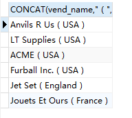
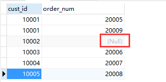

# MySQL

## 一、通配符

### 1、%

* 表示任何字符出现任意次数

```sql
select prod_id,prod_name from products where prod_name LIKE "jet%";
```

* 要点
    * **==LIKE  、 %==**
    * % 可以用在条件的任何地方：“ %ab%”

### 2、下划线 _

* 只匹配单个字符


## 二、正则表达式

基本用法

```sql
SELECT prod_name FROM products where prod_name regexp "1000" 
```

* 要点：**==regexp==**

1、|（or）表示或

```sql
SELECT prod_name FROM products where prod_name regexp "1000|2000" 
```

2、[ ] 满足其中之一

```sql
SELECT prod_name FROM products where prod_name regexp "[123] Ton" 
```

[ 0-9 ] 0 到 9 的简写

3、\\\匹配特殊字符（. - 等）

```sql
SELECT vend_name FROM vendors where vend_name REGEXP "\\."
```

4、定位符

* ^：文本的开始
* $：文本的结束


## 三、拼接字段

* 使用 **==Concat()==** 函数实现

```sql
SELECT CONCAT(vend_name,"(",vend_country,")") FROM vendors
```




## 四、函数

1、rtrim、ltrim、trim

* 去掉多余的空格

2、upper / lower

* 转换为 大写 / 小写

3、avg

* 返回某一列的平均值

```sql
SELECT AVG(prod_price) FROM products
```

4、count

* count（*）：统计表中共有多少行，不忽略 NULL
* count（column）：统计特定列共有多少行，忽略 NULL

5、max / min

* 返回某列中的最大/最小值

6、sum

* 求某一列的和


## 五、分组

* group by

```sql
SELECT vend_id, COUNT(*) FROM products GROUP BY vend_id
```

* having
    * where 过滤行，having 过滤组

```sql
SELECT vend_id, COUNT(*) FROM products GROUP BY vend_id HAVING COUNT(*)>2
```

规则

* group by 必须出现在 where 之后，order by 之前

* having 在 group 之后


## 六、联结查询

### 1、等值联结（内联结）

```sql
SELECT
	vend_name,
	prod_name,
	prod_price 
FROM
	vendors,
	products 
WHERE
	vendors.vend_id = products.vend_id 
ORDER BY
	vend_name,
	prod_name
```

* 内联结

```sql
SELECT
	vend_name,
	prod_name,
	prod_price 
FROM
	vendors
	INNER JOIN products ON vendors.vend_id = products.vend_id 
ORDER BY
	vend_name,
	prod_name
```

* 要点：**==INNER   JOIN ... ON==**


### 2、自联结

```sql
SELECT
	p1.prod_id,
	p1.prod_name 
FROM
	products AS p1,
	products AS p2 
WHERE
	p1.vend_id = p2.vend_id 
	AND p2.prod_id = "DTNTR"
```

* 要点：**给同一张表起不同的表名**


### 3、自然联结

* 排除多次出现的相同的列

```sql
SELECT
	c.*,
	o.order_num,
	o.order_date,
	oi.prod_id,
	oi.quantity,
	oi.item_price 
FROM
	customers AS c,
	orders AS o,
	orderitems AS oi 
WHERE
	c.cust_id = o.cust_id AND oi.order_num = o.order_num
```


### 4、外部联结

* 左外联结
    * 左边联结的表的所有行都会被选中，没有数据的用 NULL 表示

* 右外联结类似

```sql
SELECT
	customers.cust_id,
	orders.order_num 
FROM
	customers LEFT OUTER JOIN orders 
ON 
	customers.cust_id = orders.cust_id
```




### 5、组合查询 UNION

```sql
SELECT vend_id,prod_id,prod_price FROM products where prod_price<=5 
UNION
SELECT vend_id,prod_id,prod_price FROM products where vend_id IN(1001,1002)
```

* 合并两条语句的结果

* 要点
    * **查询的内容必须相同（vend_id , prod_id , prod_price）**
    * 具有自动去重功能


## 小知识

1、可以在 select 语句中使用操作符（+、- 、*、/）

```sql
SELECT quantity*item_price AS expanded_price FROM orderitems where order_num=20005
```

2、排除相同的值 distinct

```sql
SELECT DISTINCT prod_price FROM products
```


