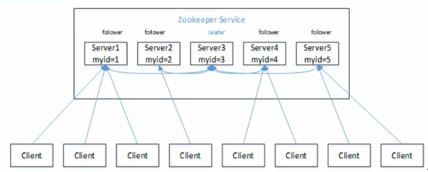
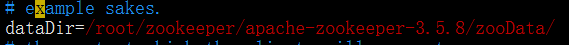
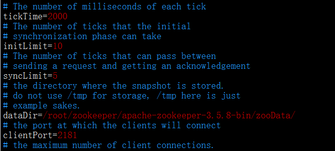
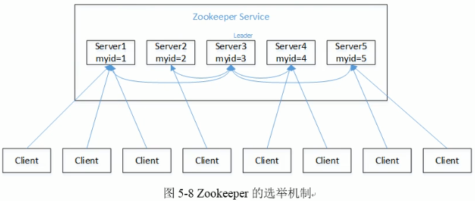
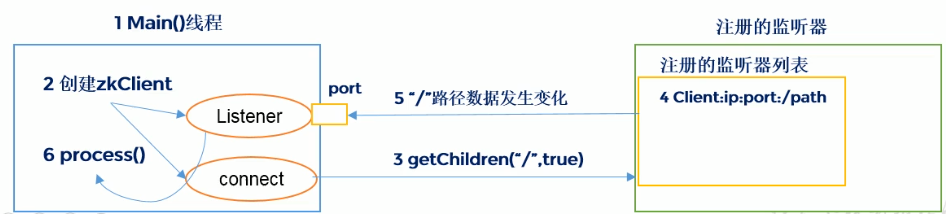
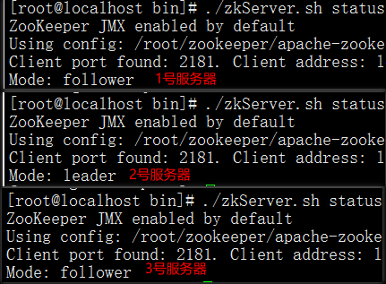

# 一、简介

## 1、概述

​		Zookeeper 从设计模式角度来理解：是一个基于观察者模式设计的分布式服务管理框架，它负责存储和管理大家都关心的数据，然后接受观察者的注册，一旦这些数据的状态发生变化，Zookeeper 就负责通知已经在 Zookeeper 上注册的那些观察者做出相应的反应


## 2、特点



1、一个领导者（Leader），多个跟随者（Follower）组成的集群

2、集群中只要有**==半数以上==**节点存活， Zookeeper 集群就能正常服务

3、全局数据一致：每个 Server 都保存有一份相同的数据副本， Client 无论连接到哪个 Server，数据都是一致的

4、更新请求顺序进行：来自同一个 Client 的更新请求**按其发送顺序依次执行** 

5、数据更新原子性：一次数据更新要么成功，要么失败

6、实时性：在一定时间范围内，Client 可以读取到最新数据


## 3、Zookeeper 的数据结构

​		ZooKeeper 数据模型的结构与 Unix 文件系统很类似，整体上可以看作是一棵树，**毎个节点称做一个 ZNode**，每一个  ZNode 默认能够存储 **==1MB==** 的数据，每个 ZNode 都可以通过其路径唯一标识


## 4、应用场景

提供的服务包括：统一命名服务、统一配置管理、统一集群管理、服务器节点动态上下线、软负载均衡等

> 同一的命名服务

在分布式环境下，经常需要对应用服务进行统一命名，便于识别。例如：IP 不容易记住，而域名容易记住


> 同一配置管理

分布式环境下，配置文件同步非常常见

1、一般要求一个集群中，所有节点的配置信息是一致的，比如 Kafka 集群

2、对配置文件修改后，希望能够快速同步到各个节点上

配置管理可交由 ZooKeeper 实现

1、可将配置信息写入 ZooKeeper 上的一个 Znode

2、各个客户端服务器监听这个 Znode

3、一旦 Znode 中的数据被修改， ZooKeeper 将通知各个服务器


> 同一集群管理

分布式环境中，时掌握每个节点的状态是必要的，可根据节点实时状态做出一些调整

ZooKeeper 可以实现实时监控节点状态变化

1、可将节点信息写入 Zookeeper 上的一个ZNod

2、监听这个 ZNode 可获取它的实时状态变化


> 服务器节点动态上下线

Zookeeper 能够对服务端进行监听，如果有服务器下线了，则通知客户端下次访问时不要访问这台服务器


> 软负载均衡

**在 Zookeeper 中记录每台服务器的访问数，让访问数最少的服务器去处理最新的客户端请求** 


# 二、下载安装

3.5.5 版本之后要下载带 bin 的那个包，另一个没有编译，无法直接使用

```
apache-zookeeper-3.5.8-bin.tar
```

1、安装 JDK

2、下载 Zookeeper 并解压

3、修改配置

（1）将解压目录中 conf 目录下的 zoo_sample.cfg 修改为 zoo.cfg

```
mv zoo_sample.cfg zoo.cfg
```

（2）打开 zoo. cfg 文件，修改 dataDir 路径（提前创建好该文件夹）




# 三、操作 Zookeeper

**进入解压目录的 bin 目录，执行以下语句** 

1、启动 Zookeeper 服务端

```shell
bin/zkServer.sh start
```

2、停止服务端

```
bin/zkServer.sh stop
```

3、启动 Zookeeper 客户端

```
bin/zkCli.sh 
```

4、退出客户端

```
quit
```

5、查看状态

```
bin/zkServer.sh status
```


# 四、配置参数的解读

配置文件位置：解压目录的 conf 目录下的 zoo.cfg 

```
/root/zookeeper/apache-zookeeper-3.5.8-bin/conf/zoo.cfg
```



`tickTime`：心跳，单位毫秒

* Zookeeper 使用的基本时间，**服务器之间**或**客户端与服务器之间**维持心跳的时间间隔

`initLimit`：Leader 和 Follower 之间**第一次**通信延迟的最大心跳次数（单位是心跳次数）

* 用它来限定集群中的 Zookeeper 服务器（Follower）连接到 Leader的时限

`syncLimit`：Leader 和 Follower 之间**正常运行之后**通信延迟的最大心跳次数（单位是心跳次数）

* 如果超过最大时间，Leader 认为 Follwer 死掉，从服务器列表中删除 Follwer

`dataDir`：数据存储目录

`clientPort`：客户端将连接的端口，也就是开放给客户端连接的端口


# 五、Zookeeper 内部原理

## 1、选举机制（重点）

半数机制：集群中**==半数以上==**机器存活，集群可用。所以 **Zookeeper 适合安装==奇数==台服务器** 

​		Zookeeper 虽然在配置文件中并没有指定 Master 和 Slave，但是 Zookeeper 工作时，是有一个节点为 Leader，其他则为 Follower，**Leader 是通过内部的选举机制临时产生的** 

> 选举过程



（1）服务器 1 启动，此时只有它一台服务器启动了，它发出去的报文没有任何响应，所以它的选举状态一直是 LOOKING 状态

（2）服务器 2 启动，它与最开始启动的服务器 1 进行通信，互相交换自己的选举结果，由于两者都没有历史数据，所以 **id 值较大的服务器 2 胜出**，但是由于没有达到超过半数以

（3）依次类推，当某个服务器得到半数以上的票时，立刻升级为 Leader，在此之后如果还有服务器启动，并且 ID 值比 Leader 的大，此时该服务器依然是 Follower。如果 Leader 宕机了，则重新选举


## 2、节点（ZNode）类型

### 持久型

> 客户端和服务器端断开连接后，创建的节点自己不删除

（1）持久化目录节点：客户端与 Zookeeper 断开连接后，该节点依旧存在

（2）持久化顺序编号目录节点：客户端与 Zookeeper 断开连接后，该节点依旧存在，只是 **Zookeeper 给该节点名称进行顺序编号** 


### 短暂型

> 客户端和服务器端断开连接后，创建的节点自己删除

（1）客户端与 Zookeeper断开连接后，该节点被删除

（2）客户端与 Zookeeper断开连接后，该节点被删除，只是 Zookeeper 给该节点名称进行顺序编号


说明：创建 znode 时设置顺序标识， znode 名称后会附加一个值，顺序号是一个**单调递增**的计数器，由父节点维护

注意：在分布式系统中，顺序号可以**被用于为所有的事件进行全局排序**，这样客户端可以通过顺序号推断事件的顺序


## 3、监听器原理

1、首先要有一个 Main 线程

2、在 main 线程中创建 Zookeeper 客户端，这时就会创建两个线程，一个负责网络连接通信（ connet），一个负责监听（ listener）

3、通过 connect 线程将注册的监听事件发送给 Zookeeper

4、将注册的监听事件添加 Zookeeper 的注册监听器列表中

5、Zookeeper 监听到有数据或路径变化，就会将这个消息发送给 listene 线程

6、listene 线程内部调用了 process（）方法




> 常见监听

1、监听节点数据的变化：

```
get path [watch]
```

2、监听子节点增减变化

```
ls  path [watch]
```


## 4、写数据流程

​		1、Client 向 ZooKeeper 的某个服务器 Server1 上写数据，发送一个写请求

​		2、如果 Server1 不是 Leader，那么 Server1 会把接受到的请求进一步转发给 Leader，因为每个 ZooKeeper 的 Server 里面有一个是 Leader，**这个 Leader 会将写请求广播给各个 Server**，比如 Server1 和 Server2，各个 Server 写成功后就会通知 Leader

​		3、当 Leader 收到大多数（半数以上）的 Server 数据写成功了，那么就说明数据写成功了。如果这里三个节点的诂，只要有两个节点数据写成功了，那么就认为数据写成功了。写成功之后， Leader 会告诉 Server1 数据写成功了

​		4、Server1 会进一步通知 Client 数据写成功了，这时就认为整个写操作成功


# 六、搭建集群

## 1、准备环境

（1）在三台 Linux 服务器上安装 Zookeeper

（2）配置服务器 ID

在每一台服务器的配置的**数据文件保存目录中**创建一个 **myid** 文件，是几号服务器就在文件中写上几就可以了，不需要多余的配置

```shell
# 文件位置
/root/zookeeper/apache-zookeeper-3.5.8-bin/zooData
touch myid

# 文件内容,是几号服务器就在文件中写上几就可以了，不需要多余的配置
1
```

（3）修改配置文件 **zoo.cfg** 

```shell
# 配置文件位置
/root/zookeeper/apache-zookeeper-3.5.8-bin/conf
```

修改内容

```shell
# 修改数据保存位置
dataDir=/root/zookeeper/apache-zookeeper-3.5.8-bin/zooData
# 增加集群配置
server.1=192.168.10.110:2888:3888
server.2=192.168.10.120:2888:3888
server.3=192.168.10.130:2888:3888
# 通配公式
server.A=B:C:D
A：表示第几号服务器
B：服务器 IP 地址
C：该服务器与 Leader 之间通信端口，这个端口用来同步数据信息
D：该服务器与其他服务器之间通信端口，万一 Leader 挂了，通过此端口来传递选举信息
```


## 2、操作集群

**==首先关闭防火墙==** 

**==只有半数以上的服务器启动了，集群才可用==** 

（1）分别启动 Zookeeper 服务端 

```shell
# 进入解压目录中的 bin 目录，执行下面的语句
./zkServer.sh start
```

（2）查看状态

```shell
# 进入解压目录中的 bin 目录，执行下面的语句
./zkServer.sh status
```

出现以下现象说明集群启动成功




## 3、客户端操作

启动客户端：进入解压目录下的 bin 目录，执下面语句

```
./zkCli.sh
```


|        命令         |                       作用                        |
| :-----------------: | :-----------------------------------------------: |
|        help         |                 显示所有操作命令                  |
|  ls  path [watch]   |    使用 ls 命令来查看当前 znode 中所包含的内容    |
| ls -s  path [watch] |      查看当前节点数据并能看到更新次数等数据       |
|       create        | 普通创建：-s含有序列，-e 临时（重启或者超时消失） |
|  get path [watch]   |                   获得节点的值                    |
|         set         |                 设置节点的具体值                  |
|        stat         |                   查看节点状态                    |
|       delete        |                     删除节点                      |
|         rmr         |                   递归删除节点                    |


