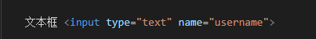

文档查阅：https://www.w3school.com.cn/tags/index.asp

# 基本结构

```html
<!--表示这是一个 html 格式的网页-->
<!DOCTYPE html>

<html lang="en">
    <!-- head 是给浏览器看的，用户看不到-->
    <head>

    </head>

    <!-- 所有需要呈现给用户的都需要放在 body 标签中-->
    <body>

    </body>
</html>
```


# 基础标签

## meta

* 只能在 head 标签中使用

> **meta** 元素可提供有关页面的元信息，比如针对搜索引擎和更新频度的描述和关键词

```html
<head>
	<meta charset="UTF-8">
	<meta name="viewport" content="width=device-width, initial-scale=1.0">
	<title>Document</title>
</head>
```


## h

* h1~h6 分别代表 1~6 级标题

```html
<h1>一级标题</h1>
<h2>二级标题</h2>
```


## p

* 段落标签


# 列表

## 无序列表

```HTML
<ul>
    <li>徐凤年</li>
    <li>徐骁</li>
    <li>姜泥</li>
</ul>
```


## 有序列表

```
<ol>
    <li>徐凤年</li>
    <li>徐骁</li>
    <li>姜泥</li>
</ol>
```

## 定义列表

用 **dl** 标签来创建一个自定义列表

> 使用 **dt** 来定义列表内容
>
> 使用 **dd** 来对内容进行解释说明

```html
<dl>
    <dt>徐凤年</dt>
    <dd>北凉王府世子</dd>
</dl>
```


# 超链接

> < a href="https://www.baidu.com">百度< /a >

**target** 属性：用来指定超链接打开位置（当前页面 / 新页面）

**_self**：默认值，在当前页面打开
**_blank**：在新窗口中打开


**当 href 属性值为 # 时**，点击直接回到顶部

> **< a href="#" >顶部< /a >** 


* 跳转到特定标签位置
    * 给目标标签设置一个 id 属性
    * 使用 href = "#id"，点击直接跳到指定位置


# 图片

> 

**width**：设置宽度     **height**：设置高度

* 设置其中一个，另一个会成比例放缩
* 不建议在 pc 端修改图片大小

**src**：图片路径

**alt**：图片描述，默认不显示，有些浏览器在图片无法加载时显示

搜索引擎会根据 alt 中的内容来搜索图片


> 图片格式 **jpg、gif、png、webp** 

jpg：颜色丰富，不支持透明，不支持动图

gif：颜色较少，支持简单透明，支持动图

png：颜色丰富，支持复杂透明，不支持动图（专为网页而生）

webp：谷歌推出的专门用于网页的一种格式

* 具备其他格式的所有优点，并且文件很小，但**兼容性不行** 


# 内联框架

* 引入其他网页

> < iframe width="" height="" src="https://www.qq.com" frameborder="0"></iframe >


# 音频

## 音乐

> < audio src="好想爱这个世界啊.mp3" controls autoplay></audio >

**controls**：是否允许用户控制播放，没有值

**autoplay**：自动播放，一般的浏览器不支持

* 顺序选择，直到有一个能用


## 视频


# CSS

## 方法

> 内联样式：样式写到了标签里面

* 问题：修改不便，如果有 100、1000 个，如果需要修改，则全部需要修改
* 开发时绝对不要使用


> 将样式写到 **head** 标签的 **style** 属性中，通过 **CSS** 选择器来为标签设置样式

* 缺点：只能在单个页面中使用，不能跨页面使用


> 外部样式表：将 CSS 样式写到一个 .css 文件中，然后在 html 文件中通过 link 标签引入


## 语法

CSS 语法由两大块组成

* 选择器：选择对应的标签
* 声明块：设置标签的样式


## 选择器

> ID 选择器：选择某一个标签进行设置

用法：# id{ }


> class 选择器：选择多个标签进行设置，ID 最好不重复，但 **class 可以重复**，class 的值可以有多个，以空格分隔，只要有符合的就会改变

用法：.red

* 以 **==.==** 开头


> 复合选择器

用法：**标签名.class名** 


> 标签中包含其他标签

子元素选择器：每一级用 > 分隔（祖先 > 后代）


后代元素选择器：每一级用空格分隔（祖先  后代）


兄弟选择器：

p **+** span ：选择相邻的后边的第一个兄弟

p **~** span：选择相邻的后边的所有兄弟


> 属性选择器

标签名 [ 属性名 ] ：选择含有指定属性的元素

标签名 [ 属性名=值 ] ：选择含有指定属性和属性值的元素

标签名 [ 属性名^=值 ] ：选择含有指定属性**以指定值开头**的元素

标签名 [ 属性名$=值 ] ：选择含有指定属性**以指定值结尾**的元素

标签名 [ 属性名*=值 ] ：选择含有指定属性**包含指定值**的元素


> 伪类选择器，以 ":" 开头

:first-child  第一个子元素

:last-child  最后一个子元素

:nth-child() 第 n 个子元素，特殊值：2n 表示偶数，2n+1 表示基数


* 在同类型中进行选择

**:first-of-type** 

**:last-of-type** 

**:nth-of-type** 


> 链接样式

a:link：没有访问过的链接

a:visited：访问过的链接


> 伪元素选择器，以 "::" 开头

**::first-letter**：表示第一个字符

**::first-line**：第一行

**::selection**：表示选中的内容

**::before、::after**：必须结合 **content** 使用


## 									布局

### 文档流

> 网页是一个多层的结构，一层叠一层，通过 CSS 可以分别为每一层来设置样式，作为用户来讲只能看到最顶上一层，这些层中，**最底下的一层称为文档流**，文档流是网页的基础，我们所创建的元素默认都是在文档流中进行排列


### 盒模型

> 内容区（**content**）、内边距（**padding**）、边框（**border**）、外边距（**margin**）


**内容区**：元素中所有的的子元素和文本内容都在内容区中排列，**内容区的大小由 width、height 两个属性来设置** 

**内边距：padding-top / botton / left / right** 

**边框**：边框属于盒子边缘，边框里边属于盒子内部，出了边框都是盒子的外部，边框的大小会影响整个盒子的大小，有默认值（**3px**）。要设置边框，需要至少设置三个样式

* 边框的宽度：**border-width** 
    * 可以指定多个值：**border-width: 10px 20px 30px 40px** 
    * 也可以这样：**border-top / left / botton / right-width** 
* 边框的颜色：**border-color** 
* 边框的样式：**border-style** 
    * **solid**：实线
    * **dotted**：点状虚线
    * **dashed**：虚线
    * **double**：双线

**外边距：margin-top / botton / left / right** 


### BFC

> **BFC(Block Formatting Context) 块级格式化环境** 

* **BFC** 是一个 **CSS** 中的一个隐含的属性，可以为一个元素开启 **BFC**
    * 开启 **BFC** 该元素会变成一个独立的布局区域
* 元素开启 **BFC** 后的特点
    1. 开启 **BFC** 的元素不会被浮动元素所覆盖
    2. 开启 **BFC** 的元素子元素和父元素外边距不会重叠
    3. 开启 **BFC** 的元素可以包含浮动的子元素
* 可以通过一些特殊方式来开启元素的 **BFC** 
    1. 设置元素的浮动（不推荐）
    2. 将元素设置为行内块元素（不推荐）
    3. 将元素的 **overflow** 设置为一个**非 visible** 的值（**推荐**）
        * 常用的方式 为元素设置 **overflow:hidden** 开启其 **BFC** 以使其可以包含浮动元素


### 定位

> 通过定位可以将元素摆放到页面的任意位置

使用 **position** 属性来设置定位，可选值：
1、**static** 默认值，元素是静止的没有开启定位
2、**relative** 开启元素的相对定位
3、**absolute** 开启元素的绝对定位
4、**fixed** 开启元素的固定定位
5、**sticky** 开启元素的粘滞定位


> 相对定位

当元素的 **position** 属性值设置为 **relative** 时则开启了元素的相对定位

1、元素开启相对定位以后，如果不设置偏移量元素不会发生任何的变化

2、相对定位是参照于元素在文档流中的位置进行定位的

3、相对定位会提升元素的层级

4、相对定位不会使元素脱离文档流

5、相对定位不会改变元素的性质块还是块，行内还是行内


* 偏移量（**offset**）：当元素开启了定位以后，可以通过偏移量来设置元素的位置

**top**：定位元素和定位位置上边的距离

**bottom**：定位元素和定位位置下边的距离
	定位元素垂直方向的位置由 **top** 和 **bottom** 两个属性来控制

**left**：定位元素和定位位置的左侧距离

**right**：定位元素和定位位置的右侧距离
	定位元素水平方向的位置由 **left** 和 **right** 两个属性控制通常情况下只会使用一个
	**left** 越大元素越靠右，**right** 越大元素越靠左


> 绝对定位：当元素的 **position**属性值设置为 **absolute** 时，则开启了元素的绝对定位

1. 开启绝对定位后，如果不设置偏移量元素的位置不会发生变化
2. 开启绝对定位后，元素会从文档流中脱离
3. 绝对定位会改变元素的性质，行内变成块，块的宽高被内容撑开
4. 绝对定位会使元素提升一个层级
5. **绝对定位元素是相对于其==包含块==进行定位的** 

* 包含块：
    * 正常情况下，包含块就是离当前元素最近的祖先块元素
    * 绝对定位的包含块：包含块就是**离它最近的开启了定位**的祖先元素，**如果所有的祖先元素都没有开启定位则==根元素==就是它的包含块** 
    * **html**（根元素、初始包含块）


> 固定定位：将元素的 **position** 属性设置为 **fixed** 则开启了元素的固定定位

​	固定定位也是一种绝对定位，所以固定定位的大部分特点都和绝对定位一样，唯一不同的是**固定定位永远参照于浏览器的视口进行定位，固定定位的元素不会随网页的滚动条滚动** 


> 粘滞定位：当元素的 **position** 属性设置为 **sticky** 时则开启了元素的粘滞定位

粘滞定位和相对定位的特点基本一致，**不同的是粘滞定位可以在元素到达某个位置时将其固定** 


## 字体

使用：**font-family** 


图标字体：以字体的形式来表示一些图标


## 背景图片

> **background-image**：设置背景图片 **background-image: url("./img/1.png")** 

1、如果背景的图片小于元素，则背景图片会自动在元素中平铺将元素铺满

2、如果背景的图片大于元素，将会一个部分背景无法完全显示

3、如果背景图片和元素一样大，则会直接正常显示


> **background-size**：设置背景图片的大小

第一个值表示宽度 ，第二个值表示高度，如果只写一个，则第二个值默认是 auto
cover：图片的比例不变，将元素铺满
contain：图片比例不变，将图片在元素中完整显示


> **background-repeat**：用来设置背景的重复方式 **background-repeat: no-repeat** 

repeat：默认值 ， 背景会沿着x轴 y轴双方向重复
repeat-x：沿着x轴方向重复
repeat-y：沿着y轴方向重复
no-repeat：背景图片不重复


> **background-position**：用来设置背景图片的位置

​	通过 **top、left、right、bottom、center** 几个表示方位的词来设置背景图片的位置，使用方位词时必须要同时指定两个值，**如果只写一个则第二个默认就是 center** 

​	还可以通过偏移量来指定背景图片的位置：**background-position: -50px 300px** 


> **background-clip**：设置背景的范围

border-box：默认值，背景会出现在边框的下边
padding-box：背景不会出现在边框，只出现在内容区和内边距
content-box：背景只会出现在内容区

> **background-origin**：背景图片的偏移量计算的原点

padding-box：默认值，background-position 从内边距处开始计算
content-box：背景图片的偏移量从内容区处计算
border-box：背景图片的变量从边框处开始计算


> **background-attachment**：背景图片是否跟随元素移动

scroll：默认值 背景图片会跟随元素移动
fixed：背景会固定在页面中，不会随元素移动


## 渐变

> **linear-gradient()**：线性渐变，颜色沿着一条直线发生变化

* **linear-gradient (to left , red , yellow)** 红色在开头，黄色在结尾，中间是过渡区域

​        我们可以指定一个渐变的方向 **to left、to right、to bottom、to top、deg（deg表示度数）**，渐变可以同时指定多个颜色，多个颜色默认情况下平均分布


> **repeating-linear-gradient()**：可以平铺（重复）的线性渐变

* **background-image: repeating-linear-gradient(to right ,red, yellow 50px)** 


> **radial-gradient()** ：径向渐变（放射性的效果）

指定渐变的位置，语法：**radial-gradient**（大小 at 位置, 颜色 位置 ,颜色 位置 ,颜色 位置...）


# 表格

**table** 表示表格，**tr** 表示一行，**td** 表示一格，用 **th** 表示行首单元格

可以将表格分为**头部（thead）、主体（tbody）、底部（tfoot）**，设置之后，不论这三者位置如何变，表格样式不会变

> **border-spacing**: 指定边框之间的距离

> **border-collapse: collapse**：设置边框的**合并** 


默认情况下元素在 **td** 中是垂直居中的 可以通过 **vertical-align** 来修改

**vertical-align: middle、text-align: center** 

​	如果表格中没有使用 **tbody** 而是直接使用 **tr**， 那么浏览器会自动创建一个 **tbody**，并且将 **tr** 全都放到 **tbody** 中，**tr**不是 **table** 的子元素


# 表单

在现实生活中表单用于提交数据，在网页中也可以使用表单，**网页中的表单用于将本地的数据提交给远程的服务器** 


文本框，注意：数据要提交到服务器中，必须要为元素指定一个 **name** 属性值




密码框


单选按钮

* 单选按钮组合的 **name** 属性值必须一样，**value** 值不一样，**checked** 表示默认选中


多选按钮

* **name** 属性值必须一样，**value** 值不一样，**checked** 表示默认选中


下拉框：**selected** 表示默认选中


提交按钮


# 过渡

> 过渡（transition）：通过过渡可以**指定一个属性发生变化时的切换方式** 

例：**transition: all 2s** 


​	**transition-property**: 指定要执行过渡的属性,多个属性间使用 "**,**" 隔开。如果所有属性都需要过渡，则使用 **all** 关键字。大部分属性都支持过渡效果，注意**过渡时必须是从一个有效数值向另外一个有效数值进行过渡** 

* **steps()** 分步执行过渡效果

**transition-duration**: 指定过渡效果的持续时间

**transition-delay**: 过渡效果的延迟，等待一段时间后在执行过渡  

​	**transition** 可以同时设置过渡相关的所有属性，只有一个要求，**如果要写延迟，则两个时间中第一个是持续时间，第二个是延迟** 


# 动画

​	动画和过渡类似，都是可以实现一些动态的效果，不同的是过渡需要在某个属性发生变化时才会触发，动画可以自动触发动态效果

> 设置动画效果，必须先要设置一个关键帧，关键帧设置了动画执行每一个步骤

```html
@keyframes test {
	/* from表示动画的开始位置 也可以使用 0% */
	from{
	margin-left: 0;
	background-color: orange;
	} 

	/* to动画的结束位置 也可以使用100%*/
	to{
	background-color: red;
	margin-left: 700px;
	}
}
```

> **animation-name**: 要对当前元素生效的关键帧的名字 --- **animation-name: test** 

> **animation-duration: 4s**: 动画的执行时间
>
> **animation-delay: 2s**：动画的延时
>
> **animation-iteration-count** 动画执行的次数
> 	infinite 无限执行
> 	2  两次

> **animation-direction**：指定动画运行的方向
> 	normal 默认值  从 from 向 to运行 每次都是这样 
> 	reverse 从 to 向 from 运行 每次都是这样 
> 	alternate 从 from 向 to运行 重复执行动画时反向执行
> 	alternate-reverse 从 to 向 from运行 重复执行动画时反向执行


> **animation-play-state**: 设置动画的执行状态 
> 	running 默认值 动画执行
> 	paused 动画暂停

> **animation-fill-mode**: 动画的填充模式
> 	none 默认值 动画执行完毕元素回到原来位置
> 	forwards 动画执行完毕元素会停止在动画结束的位置
> 	backwards 动画延时等待时，元素就会处于开始位置
> 	both 结合了forwards 和 backwards


# 变形

> 变形就是指通过CSS来改变元素的形状或位置，变形不会影响到页面的布局

**transform** 用来设置元素的变形效果：**transform: translateY(-100px)** 

平移：平移元素，百分比是**相对于自身计算的** 

​          translateX() 沿着x轴方向平移

​          translateY() 沿着y轴方向平移

​          translateZ() 沿着z轴方向平移


> 沿着z轴方向平移必须先设置一个视距才能看到效果

```html
html{
    /* 设置当前网页的视距为800px，人眼距离网页的距离 */
    perspective: 800px;
}
```

​	z 轴平移，调整元素在 z 轴的位置，**正常情况就是调整元素和人眼之间的距离**，距离越大，元素离人越近。z 轴平移属于立体效果（近大远小），**默认情况下网页是不支持透视，如果需要看见效果，必须要设置网页的视距** 


## 旋转

通过旋转可以使元素沿着 **x、y、z** 旋转指定的角度：**rotateX()、rotateY()、rotateZ()** 

> 例：transform: rotateY(180**deg**) translateZ(400px);


## 放缩

对元素进行缩放的函数：**scaleX() 水平方向缩放、scaleY() 垂直方向缩放、scale() 双方向的缩放** 

> 例：transform:scale(2) 放大两倍

**transform-origin**：放缩原点，默认值 **center** 


# 弹性盒

> 弹性盒（flex）：CSS 中的一种布局手段（**代替浮动**），可以让元素跟随页面大小而改变

flex(弹性盒、伸缩盒)


​	弹性容器：要使用弹性盒，必须先将一个元素设置为弹性容器，我们通过 **display** 来设置弹性容器，**display:flex**  设置为**块级**弹性容器，**display:inline-flex** 设置为**行内**的弹性容器

弹性元素：弹性容器的**子元素**是弹性元素（弹性项），弹性元素可以同时是弹性容器


> **flex-direction**：指定容器中弹性元素的排列方式

1、row 默认值，弹性元素在容器中水平排列（左向右）

2、row-reverse 弹性元素在容器中反向水平排列（右向左）

3、column 弹性元素纵向排列（自上向下）

4、column-reverse 弹性元素方向纵向排列（自下向上）


主轴：弹性元素的排列方向称为主轴
侧轴：与主轴垂直方向的称为侧轴


弹性**元素**的属性：

**flex-grow**：指定弹性元素的**伸展系数** 

* 当父元素有多余空间的时，子元素如何伸展
* 父元素的剩余空间，会按照比例进行分配

**flex-shrink**：指定弹性元素的**收缩系数** 

* 当父元素中的**空间不足**以容纳所有的子元素时，如果对子元素进行收缩


> 弹性容器的样式

**flex-wrap**：设置弹性元素是否在弹性容器中**自动换行** 

* **nowrap** 默认值，元素不会自动换行
* **wrap** 元素沿着**辅轴方向**自动换行
* **wrap-reverse** 元素沿着**辅轴反方向**换行


**justify-content**：如何分配**主轴**上的空白空间（主轴上的元素如何排列）

* **flex-start** 元素沿着主轴起边排列
* **flex-end** 元素沿着主轴终边排列
* **center** 元素居中排列
* **space-around** 空白分布到元素两侧
* **space-between** 空白均匀分布到元素间
* **space-evenly** 空白分布到元素的单侧


**align-items**：元素在**辅轴**上如何对齐

* **stretch** 默认值，将元素的长度设置为相同的值
* **flex-start** 元素不会拉伸，沿着辅轴起边对齐
* **flex-end** 沿着辅轴的终边对齐
* **center** 居中对齐
* **baseline** 基线对齐


> 弹性元素的样式

**flex-grow**：弹性的增长系数

**flex-shrink**：弹性元素的缩减系数


**flex-basis**：指定的是元素在主轴上的基础长度

* 如果主轴是 横向的 则 该值指定的就是元素的宽度
* 如果主轴是 纵向的 则 该值指定的是就是元素的高度
* 默认值是 **auto**，表示参考元素自身的高度或宽度，如果传递了一个具体的数值，则以该值为准


可以使用 **flex** 一次性设置弹性元素的三个样式：**flex**: 增长 缩减 基础


**order** 决定弹性元素的排列顺序，值越大越靠前


