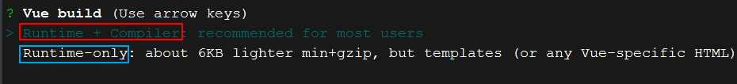

# 一、入门案例

```html
<head>
    <meta charset="UTF-8">
    <meta name="viewport" content="width=device-width, initial-scale=1.0">
    <title>Document</title>
    <script src="/js/vue.js"></script>
</head>

<body>
    <div id="aaa">{{message}}</div>   <!--这里-->
    <script>
        const app = new Vue({
            el: "#aaa",
            data: {
                message: "Hello World Vue"
            }
        })
    </script>
</body>
```


# 二、基本指令

> 如何将 data 中的文本数据插入到 HTML 的元素中？


### Mustache 语法 

也叫做**==双大括号（{{}}）==** 


### 直接写变量

```html
<body>
    <div id="aaa">{{message}}</div>
    <script>
        const app = new Vue({
            el: "#aaa",  //绑定元素
            data: {
                message: "Hello World Vue"
            }
        })
    </script>
</body>
```


### 写表达式

```html
<body>
    <div id="aaa">{{first +" == "+ last}}</div>
    <script>
        const app = new Vue({
            el: "#aaa",
            data: {
                message: "Hello World Vue",
                first: "aaa",
                last: "bbb"
            }
        })
    </script>
</body>
```


### v-once 指令

在某些情况下，我们可能不希望界面随意的改变，用 `v-once` 修饰的元素不会改变

```html
<body>
    <div id="aaa">
        <h1 v-once>{{message}}</h1>  // 用 v-once 修饰
    </div>
    <script>
        const app = new Vue({
            el: "#aaa",
            data: {
                message: "Hello World Vue"
            }
        })
    </script>
</body>
```


### v-html 指令

有时候服务器发送过的的数据就是一串 `HTML` 代码，如果直接输出不会被渲染，使用 `v-html` 指令会将数据渲染后显示

* 该指令通常跟一个 `string` 类型，会将 `string` 中的内容渲染显示出来

```html
<body>
    <div id="aaa">
        <h1 v-html="url"></h1>   <!-- v-html 指令-->
    </div>
    <script>
        const app = new Vue({
            el: "#aaa",
            data: {
                message: "Hello World Vue",
                url: "<a href='https://www.baidu.com'>百度</a>"
            }
        })
    </script>
</body>
```


### v-text 指令

将数据直接以文本显示到元素中

* 该指令通常接收一个 `string` 类型参数

```html
<body>
    <div id="aaa">
        <h1 v-text="message"></h1>
    </div>
    <script>
        const app = new Vue({
            el: "#aaa",
            data: {
                message: "Hello World Vue"
            }
        })
    </script>
</body>
```


### v-pre 指令

对元素中的内容不进行渲染，是什么就显示什么

```html
<body>
    <div id="aaa">
        <h1 v-pre>{{message}}</h1> //不会将 message 中的内容填充到元素中，直接显示{{msg}}
    </div>
    <script>
        const app = new Vue({
            el: "#aaa",
            data: {
                msg: "Hello World Vue"
            }
        })
    </script>
</body>
```


### v-for 循环指令

```html
<body>
    <div id="aaa">
        <ul>
            <!--<li v-for="(变量,下标) in 元素">{{index}}-{{item}}</li>-->
            <li v-for="(item,index) in lists">{{index}}-{{item}}</li>
        </ul>
    </div>
    <script>
        const app = new Vue({
            el: "#aaa",
            data: {
                message: "Hello World Vue",
                lists: ['海王', '徐凤年', '徐骁']
            }
        })
    </script>
</body>
```


# 三、属性绑定

## v-bind 属性绑定指令

动态绑定元素属性，如 `` 的 `src` 属性

```html
<body>
    <div id="aaa">
        
    </div>
    <script>
        const app = new Vue({
            el: "#aaa",
            data: {
                message: "Hello World Vue",
                imgUrl: "https://img10.360buyimg.com/babel/s590x470_jfs/t1/139909/20/17733/140763/5fd0a877E79d39f8d/df0fbd261e24c5c5.jpg.webp"
            }
        })
    </script>
</body>
```


## v-bind 语法糖

所谓语法糖就是简写方式

* 直接写一个 `:`，不需要写 `v-bind` 

```html
<body>
    <div id="aaa">
        
    </div>
    <script>
        const app = new Vue({
            el: "#aaa",
            data: {
                message: "Hello World Vue",
                imgUrl: "https://img10.360buyimg.com/babel/s590x470_jfs/t1/139909/20/17733/140763/5fd0a877E79d39f8d/df0fbd261e24c5c5.jpg.webp"
            }
        })
    </script>
</body>
```


## 动态绑定 class（选择器） 属性

> 直接写到元素中

```html
<style>
    .active {
        color: red;
    }
</style>

<body>
    <div id="aaa">
        <h1 v-bind:class="{active: isActive}">{{message}}</h1>
        <button v-on:click="btn">切换</button>
    </div>
    <script>
        const app = new Vue({
            el: "#aaa",
            data: {
                message: "Hello World Vue",
                isActive: true
            },
            methods: {
                btn: function () {
                    this.isActive = !this.isActive
                }
            }
        })
    </script>
</body>
```


> 写到函数中

```html
<style>
    .active {
        color: red;
    }
</style>

<body>
    <div id="aaa">
        <h1 v-bind:class="getClass()">{{message}}</h1>
        <button v-on:click="btn">切换</button>
    </div>
    <script>
        const app = new Vue({
            el: "#aaa",
            data: {
                message: "Hello World Vue",
                isActive: true
            },
            methods: {
                btn: function () {
                    this.isActive = !this.isActive
                },
                getClass: function () {                  // 写到函数中
                    return { active: this.isActive };
                }
            }
        })
    </script>
</body>
```


## 动态绑定 style

```html
<body>
    <div id="aaa">
        <h1 :style="{fontSize: size+'px'}">{{message}}</h1>
    </div>
    <script>
        const app = new Vue({
            el: "#aaa",
            data: {
                message: "Hello World Vue",
                size: 100
            }
        })
    </script>
</body>
```


# 四、计算属性

在模板中可以直接通过插值语法显示一些 `data` 中的数据，但是在某些情况，我们可能需要**对数据进行一些转化后再显示，或者需要将多个数据结合起来进行显示** 

* 比如我们有 `firstName` 和 `lastName` 两个变量，我们需要显示完整的名称
* 但是如果多个地方都需要显示完整的名称，我们就需要写多个 `{{firstName}} {{lastName}}` 

**我们可以将上面的代码换成计算属性** 

> 示例

```html
<body>
    <div id="aaa">
        <h1>{{fullName}}</h1>  <!--这里不能加（），这里当做的是一个属性，而不是调用函数-->
    </div>

    <script>
        const app = new Vue({
            el: "#aaa",
            data: {
                message: "Hello World Vue",
                firstName: "徐凤年",
                lastname: "徐骁"
            },
            computed: {    //计算属性
                fullName: function () {
                    return this.firstName + " " + this.lastname
                }
            }
        })
    </script>
</body>
```


# 五、事件监听

* 主要指令：`v-on` 指令

```html
<body>
    <div id="aaa">
        <h1>{{count}}</h1>
        <button v-on:click="add()">+</button>
        <button v-on:click="del()">-</button>
        <!--<button @click="del()">-</button> 语法糖写法--> 
    </div>

    <script>
        const app = new Vue({
            el: "#aaa",
            data: {
                count: 0,
            },
            methods: {
                add: function () {
                    this.count++
                },
                del: function () {
                    this.count--
                }
            }
        })
    </script>
</body>
```


## v-on 参数传递问题

1、若函数只有一个参数，但调用时没有传参

* 若调用时没有写`()` 这时会默认将浏览器生成的 `event` 对象传进来
* 若调用时写了`()`，这时参数是未定义

```html
<button v-on:click="del()">-</button>
<script>
    const app = new Vue({
        ...
        methods: {
            del: function (event) {
                this.count--
            }
        }
    })
</script>
```

2、若函数有多个参数，并且需要一个 `event` 参数

* 若调用时没有写 `()`，这时浏览器会将 `event` 对象传给第一个参数，其他参数是未定义
* 若调用时写了 `()`，这时必须使用 `$enent` 来传递 `event` 对象

```html
<button v-on:click="del("qqq", $event)">-</button>
<script>
    const app = new Vue({
        ...
        methods: {
            del: function (a, event) {
                this.count--
            }
        }
    })
</script>
```


## v-on 修饰符

### 1、阻止事件冒泡

```html
<body>
    <div id="aaa" @click="divClick">
        dsafsdf
        <button @click.stop="btnClick">按钮</button> <!--修饰符-->
    </div>
    <script>
        const app = new Vue({
            el: "#aaa",
            methods: {
                btnClick() {
                    console.log("btnClick");
                },
                divClick() {
                    console.log("divClick");
                }
            }
        })
    </script>
</body>
```


### 2、阻止默认行为

```html
<body>
    <div id="aaa">
        dsafsdf
        <a @click.prevent="btnClick" href="https://www.baidu.com">百度</a>
    </div>
    <script>
        const app = new Vue({
            el: "#aaa",
            methods: {
                btnClick() {
                    console.log("btnClick");
                }
            }
        })
    </script>
</body>
```


### 3、键盘监听

```html
<body>
    <div id="aaa">
        <input type="text" @keyup.enter="keyUp">
    </div>
    <script>
        const app = new Vue({
            el: "#aaa",
            methods: {
                keyUp() {
                    console.log("keyUp");
                }
            }
        })
    </script>
</body>
```


# 六、条件判断

## v-if、v-else、v-else-if

* **`v-if`** 为 **`true`** 是才显示该元素
* **`v-else`** 为 **`false`** 时显示
* `<h1 v-else-if="score>=90">aa</h1>` 

```html
<body>
    <div id="aaa">
        <h1 v-if="isShow">v-if：true</h1>
        <h1 v-else="isShow">v-if：false</h1>
    </div>
    <script>
        const app = new Vue({
            el: "#aaa",
            data: {
                isShow: true
            }
        })
    </script>
</body>
```


## v-if、v-show 的区别

* `v-if` 为 `false` 时整个元素从界面上消失 
* `v-show` 为 `false` 时添加了一个行内样式 `display: none`，元素并没有从界面上消失

选择：切换频率很高时使用 `v-show`，反之用 `v-if` 

```html
<body>
    <div id="aaa">
        <h1 v-if="isShow">v-if：true</h1>
        <h1 v-show="isShow">v-if：false</h1>
    </div>
    <script>
        const app = new Vue({
            el: "#aaa",
            data: {
                isShow: true
            }
        })
    </script>
</body>
```


# 七、循环遍历

## v-for

### 遍历数组

```html
<body>
    <div id="aaa">
        <!--(变量，索引) in 元素-->
        <h1 v-for="(item,index) in names">{{index}}-{{item}}</h1>
    </div>

    <script>
        const app = new Vue({
            el: "#aaa",
            data: {
                names: ['徐凤年', '徐骁', '吴素', '徐脂虎']
            }
        })
    </script>
</body>
```


### 遍历对象

```html
<body>
    <div id="aaa">
        <h1 v-for="(value,key,index) in user">{{index}}-{{key}}-{{value}}</h1>
    </div>
    <script>
        const app = new Vue({
            el: "#aaa",
            data: {
                user: {
                    name: "徐凤年",
                    age: 22
                }
            }
        })
    </script>
</body>
```


# 八、双向绑定：v-model

所用指令：`v-model` 

* 当 `input` 中的内容发生改变是，被绑定的数据也会发生改变

原理：监听 `input` 的输入事件（`input`）

* `<input type="text" :value="message" @input="message=$event.target.value">` 

```html
<body>
    <div id="aaa">
        <input type="text" v-model="message">
        <h2>{{message}}</h2>
    </div>

    <script>
        const app = new Vue({
            el: "#aaa",
            data: {
                message: "Hello Vue.js"
            }
        })
    </script>
</body>
```


## 单选框

> `v-model` 与单选框案例

* 效果：`h2` 中的内容随着单选框的改变而改变

注意点：

* 使用了 `v-model` 之后就有了互斥的效果，不需要 `name` 属性来实现互斥了
* 如果需要默认值，给 `sex` 一个值即可，不需要使用 `selected` 

```html
<body>
    <div id="aaa">
        <label for="man">
            <input type="radio" name="sex" id="man" value="男" v-model="sex">男
        </label>
        <label for="woman">
            <input type="radio" name="sex" id="woman" value="女" v-model="sex">女
        </label>
        <h2>您选择的性别是：{{sex}}</h2>
    </div>

    <script>
        const app = new Vue({
            el: "#aaa",
            data: {
                sex: ""
            }
        })
    </script>
</body>
```


## 复选框

> `v-model` 与复选框案例

只有一个复选框

```html
<body>
    <div id="aaa">
        <label for="agree">
            <input type="checkbox" id="agree" v-model="isAgree">同意
        </label>
        <h2>您的选择是：{{isAgree}}</h2>
        <button v-bind:disabled="!isAgree">下一步</button>
    </div>
    <script>
        const app = new Vue({
            el: "#aaa",
            data: {
                isAgree: false
            }
        })
    </script>
</body>
```


多个复选框

```html
<body>
    <div id="aaa">
        <input type="checkbox" value="篮球" v-model="hobbies">篮球
        <input type="checkbox" value="足球" v-model="hobbies">足球
        <input type="checkbox" value="乒乓球" v-model="hobbies">乒乓球
        <input type="checkbox" value="羽毛球" v-model="hobbies">羽毛球
        <h2>您的选择是：{{hobbies}}</h2>
    </div>
    <script>
        const app = new Vue({
            el: "#aaa",
            data: {
                hobbies: []
            }
        })
    </script>
</body>
```


## 选择框

单选

```html
<body>
    <div id="aaa">
        <select name="a" v-model="fruit">
            <option value="苹果">苹果</option>
            <option value="香蕉">香蕉</option>
            <option value="榴莲">榴莲</option>
            <option value="火龙果">火龙果</option>
        </select>
        <h2>您的选择是：{{fruit}}</h2>
    </div>

    <script>
        const app = new Vue({
            el: "#aaa",
            data: {
                fruit: "香蕉"
            }
        })
    </script>
</body>
```


## 修饰符

> `lazy` 修饰符

​	默认情况下， `v-model` 默认是在 `input` 事件中同步输入框的数据的，`lazy` 修饰符可以让数据在失去焦点或者敲回车时才会更新

```html
<input type="checkbox" id="agree" v-model.lazy="isAgree">同意
```

> `number` 修饰符

​	默认情况下，在输入框中无论我们输入的是字母还是数字，都会被当做字符串类型进行处理，`number` 修饰符可以让在输入框中输入的内容**自动转成数字类型** 

```html
<input type="checkbox" id="agree" v-model.number="isAgree">同意
```

> `trim` 修饰符

如果输入的内容首尾有很多空格，通常我们希望将其去除，`trim` 修饰符可以过滤内容左右两边的空格

```html
<input type="checkbox" id="agree" v-model.trim="isAgree">同意
```


# 九、组件化

## 1、基本使用

第一步：创建组件构造器

```javascript
// 1、创建组件构造器
const cpnConstructor = Vue.extend({
    template: `
    <div>
        <h1>我是标签</h1>
        <p>ttttttttttttttttt</p>
        <p>fffffffffffffffff</p>
        <p>ccccccccccccccccc</p>
    </div>`
})
```

第二步：注册组件

* 注册全局组件：在任何 `Vue` 的作用域内都可以使用

```javascript
// 第一个参数是自定义标签名，第二个参数是组件构造器
Vue.component("my-cpn", cpnConstructor)
```

* 注册局部组件：只有在当前 `Vue` 的作用域内可以使用

```javascript
const app = new Vue({
    el: "#aaa",
    data: {
    },
    components: {            //局部组件  自定义标签名：组件构造器
        cpn: cpnConstructor
    }
})
```

第三步：在 `Vue` 作用域内使用

```html
<div id="aaa">
    <my-cpn></my-cpn>
</div>
```


## 2、父、子组件

```javascript
const cpnConstructor1 = Vue.extend({       //子组件
    template: `
    <div>
        <h1>我是标签1</h1>
        <p>ttttttttttttttttt</p>
        <p>fffffffffffffffff</p>
        <p>ccccccccccccccccc</p>
    </div>`
})

const cpnConstructor2 = Vue.extend({   // 父组件
    template: `
    <div>
        <h1>我是标签2</h1>
        <p>qqqqqqqqqqqqqqqqq</p>
        <p>bbbbbbbbbbbbbbbbb</p>
        <p>wwwwwwwwwwwwwwwww</p>
        <cpn1></cpn1>
    </div>`,
    components: {
        cpn1: cpnConstructor1        // 注册子组件
    }
})

const app = new Vue({
    el: "#aaa",
    data: {
    },
    components: {
        cpn2: cpnConstructor2
    }
})
```


## 3、组件模板抽离

### 通过 `<script>` 标签抽离

```html
<body>
    <div id="aaa">
        <cpn></cpn>
    </div>
    
    <script type="text/x-template" id="x">  // type的类型必须为 "text/x-template"
        <div>                               // 模板中只能有一个根标签
            <h1>徐凤年</h1>
        	<h3>mmmmmmmmmmmmmmmmmm</h3>
        </div>
    </script>
    
    <script>
        // 1、创建组件构造器
        const cpnConstructor = Vue.extend({
            template: '#x'   // 通过 ID 来引入模板
        })

        const app = new Vue({
            el: "#aaa",
            components: {
                cpn: cpnConstructor
            }
        })
    </script>
</body>
```


### 通过 `<template>` 标签抽离

```html
<body>
    <div id="aaa">
        <cpn></cpn>
    </div>

    <template id="x">
        <div>
            <h1>徐凤年</h1>
            <h3>mmmmmmmmmmmmmmmmmm</h3>
        </div>
    </template>

    <script>
        // 1、创建组件构造器
        const cpnConstructor = Vue.extend({
            template: '#x'
        })

        const app = new Vue({
            el: "#aaa",
            components: {
                cpn: cpnConstructor
            }
        })
    </script>
</body>
```


## 4、组件数据

组件对象也有一个 `data` 属性，只是这个属性必须是一个函数，并且返回一个对象，**返回的对象中保存着数据** 

```html
<body>
    <div id="aaa">
        <cpn></cpn>
    </div>

    <template id="x">
        <div>
            <h1>{{title}}</h1>
            <h3>mmmmmmmmmmmmmmmmmm</h3>
        </div>
    </template>

    <script>
        // 1、创建组件构造器
        const cpnConstructor = Vue.extend({
            template: '#x',
            data() {                               // 组件中的数据
                return {
                    title: '徐骁'
                }
            }
        })

        const app = new Vue({
            el: "#aaa",
            components: {
                cpn: cpnConstructor
            }
        })
    </script>
</body>
```


## 5、父、子组件之间数据传递

通过 `pops` 向子组件传递数据，通过事件向父组件发送消息


### 父向子传递数据

注意点：

* 自定义标签中必须绑定数据后子组件才能使用父组件中的数据
    * `<cpn :cmovies="movies" :cname="name"></cpn>` 

```html
<body>
    <div id="aaa">
        <cpn :cmovies="movies" :cname="name"></cpn>
    </div>

    <template id="x">
        <div>
            <h1>{{cmovies}}</h1>
            <h1>{{cname}}</h1>
        </div>
    </template>

    <script>
        // 1、创建组件构造器
        const cpnConstructor = {
            template: '#x',
            props: ['cmovies', 'cname']
        }

        const app = new Vue({
            el: "#aaa",
            data: {
                movies: ['徐凤年', '徐骁', '吴素', '徐龙象'],
                name: '李淳罡'
            },
            components: {
                cpn: cpnConstructor
            }
        })
    </script>
</body>
```


> `props` 属性还能这样写

进行类型限制

所支持类型：`String`、`Number`、`Boolean`、`Array`、`Object`、`Date`、`Function`、`Symbol` 

```javascript
// 1、创建组件构造器
const cpnConstructor = {
    template: '#x',
    props: {
        // 类型限制
        cname: String,
        cmovies: []  // 数组类型
    }
}
```

提供默认值

```javascript
// 1、创建组件构造器
const cpnConstructor = {
    template: '#x',
    props: {
        // 提供默认值
        cname: {
            type: String,
            default: "TFC"
        },
        cmovies: {
            type: Array,
            default() {
                return ['aaaa', 'bbbb']  // 数组的默认值必须这样用函数返回
            }
        }
    }
}
```


### 子向父传递数据

```html
<body>
    <div id="aaa">
        // 子组件发送过来的事件，有父组件的 cpnClick 方法处理，这里不要写（），因为 Vue 会将子组件传递过来的参数传进去
        // 写了() 就传不进去了
        <cpn @itemclick="cpnClick"></cpn>
    </div>

    <template id="x">
        <div>                                 //子组件的点击事件，由子组件完成
            <button v-for="item in categories" @click="btnClick(item)">{{item.name}}</button>
        </div>
    </template>

    <script>
        // 1、子组件
        const cpnConstructor = {
            template: '#x',
            props: {
            },
            data() {
                return {
                    categories: [
                        { id: 'aaa', name: '热门推荐' },
                        { id: 'bbb', name: '手机数码' },
                        { id: 'ccc', name: '生鲜水果' }
                    ]
                }
            },
            methods: {
                btnClick(item) {
                    // 子组件发送事件让父组件知道
                    // itemClick：自定义事件名    item：参数
                    this.$emit("itemclick", item)
                }
            }
        }

        // 父组件
        const app = new Vue({
            el: "#aaa",
            data: {
            },
            components: {
                cpn: cpnConstructor
            },
            methods: {
                cpnClick(item) {
                    console.log("cpnClick", item);
                }
            }
        })
    </script>
</body>
```


## 6、父、子组件的数据双向绑定

```html
<body>
    <div id="aaa">
        <cpn :number1="num1" :number2="num2" @num1change="num1change" @num2change="num2change"></cpn>
    </div>

    <template id="x">
        <div>
            <h1>props：{{number1}}</h1>
            <h1>data：{{dnumber1}}</h1>
            //子组件数据的双向绑定由子组件做
            <input type="text" v-bind:value="dnumber1" @input="num1Input">  
            <h1>props：{{number2}}</h1>
            <h1>data：{{dnumber2}}</h1>
            <input type="text" v-bind:value="dnumber2" @input="num2Input">
        </div>
    </template>

    <script>
        // 1、子组件
        const cpnConstructor = {
            template: '#x',
            props: {
                number1: Number,
                number2: Number
            },
            data() {
                return {
                    dnumber1: this.number1,
                    dnumber2: this.number2
                }
            },
            methods: {
                num1Input(event) {
                    this.dnumber1 = event.target.value
                    // 父子组件的双向绑定，发送一个自定义事件到父组件
                    this.$emit("num1change", this.dnumber1)  
                },
                num2Input() {
                    this.dnumber2 = event.target.value
                    this.$emit("num2change", this.dnumber2)
                }
            }
        }

        // 父组件
        const app = new Vue({
            el: "#aaa",
            data: {
                num1: 1,
                num2: 0
            },
            components: {
                cpn: cpnConstructor
            },
            methods: {
                num1change(value) { // 自定义事件的处理
                    this.num1 = Number(value)
                },
                num2change(value) {
                    this.num2 = Number(value)
                }
            }
        })
    </script>
</body>

```


## 7、父组件以对象方式访问子组件

父组件访问子组件：使用 `$Children` 或 `$refs`  

> 通过 `$children` 方式（不推荐）

```html
<body>
    <div id="aaa">
        <cpn></cpn>
        <button @click="btnClick()">按钮</button>
    </div>

    <template id="x">
        <div>我是子组件</div>
    </template>

    <script>
        // 1、子组件
        const cpnConstructor = {
            template: '#x',
            methods: {
                showMessage() {
                    console.log("showMessage");
                }
            },
            data() {
                return {
                    name: "我是子组件中的 name 属性"
                }
            }
        }

        // 父组件
        const app = new Vue({
            el: "#aaa",
            methods: {
                btnClick() {
                    console.log(this.$children);
                    //用 $children 方式必须以下标方式来获取组件
                    this.$children[0].showMessage()  
                    console.log(this.$children[0].name);
                }
            },
            components: {
                cpn: cpnConstructor
            }
        })
    </script>
</body>
```

> 通过 `$refs` 方式（推荐）

```html
<body>
    <div id="aaa">
        <cpn ref="ff"></cpn>    <!--在组件中添加一个 ref 属性作为该组件的 key-->
        <button @click="btnClick()">按钮</button>
    </div>

    <template id="x">
        <div>我是子组件</div>
    </template>

    <script>
        // 1、子组件
        const cpnConstructor = {
            template: '#x',
            methods: {
                showMessage() {
                    console.log("showMessage");
                }
            },
            data() {
                return {
                    name: "我是子组件中的 name 属性"
                }
            }
        }

        // 父组件
        const app = new Vue({
            el: "#aaa",
            methods: {
                btnClick() {
                    console.log(this.$refs);
                    //通过组件的 key 来访问某个组件，弥补了下标访问的缺陷
                    this.$refs.ff.showMessage()
                    console.log(this.$refs.ff.name);
                }
            },
            components: {
                cpn: cpnConstructor
            }
        })
    </script>
</body>
```


## 8、子组件以对象方式访问父组件

**不建议子组件访问父组件** 

* 原因：复用性不强

```html
<body>
    <div id="aaa">
        <cpn></cpn>
    </div>

    <template id="x">
        <div>
            <div>我是子组件</div>
            <button @click="btnClick()">按钮</button>
        </div>
    </template>

    <script>
        // 1、子组件
        const cpnConstructor = {
            template: '#x',
            methods: {
                btnClick() {
                    console.log(this.$parent);
                }
            }
        }

        // 父组件
        const app = new Vue({
            el: "#aaa",
            components: {
                cpn: cpnConstructor
            }
        })
    </script>
</body>
```


# 十、插槽 slot

**组件的插槽也是为了让我们封装的组件更加具有扩展性，让==使用者==可以决定组件内部的一些内容到底展示什么** 

> 简单案例

```html
<body>
    <div id="aaa">
        <!--这里的按钮就会添加到插槽中，不同的内容显示也不同-->
        <cpn><button>按钮</button></cpn>
        <cpn><span>ssssss</span></cpn>
        <cpn><button>买菜</button></cpn>
        <cpn>
            <button>团购</button>  <!-- 如果有多个内容，会全部替换-->
            <h1>aaaa</h1>  
        </cpn>
    </div>

    <template id="x">
        <div>
            <h1>我是子组件</h1>
            <h2>哈哈哈哈哈</h2>
            //预留一个插槽，将来动态显示不同的内容，这里的按钮是默认值
            <slot><button>按钮</button></slot>  
        </div>
    </template>

    <script>
        // 1、子组件
        const cpnConstructor = {
            template: '#x',
        }

        // 父组件
        const app = new Vue({
            el: "#aaa",
            components: {
                cpn: cpnConstructor
            }
        })
    </script>
</body>
```


## 1、具名 slot

```html
<body>
    <div id="aaa">
        <cpn><span slot="left">sss</span></cpn>    <!--指定替换哪个插槽-->
    </div>

    <template id="x">
        <div>
            // 添加一个 name 属性为插槽起个名字，相当于 key
            <slot name="left"><button>左边</button></slot>  
            <slot name="mid"><button>中间</button></slot>
            <slot name="right"><button>右边</button></slot>
        </div>
    </template>

    <script>
        // 1、子组件
        const cpnConstructor = {
            template: '#x',
        }

        // 父组件(Vue 实例也是一个组件，且是根组件)
        const app = new Vue({
            el: "#aaa",
            components: {
                cpn: cpnConstructor
            }
        })
    </script>
</body>
```


## 2、作用域插槽

**父组件替换插槽的标签，但是内容由子组件来提供** 

```html
<body>
    <div id="aaa">
        <cpn></cpn>   <!--默认显示-->
        <cpn>                          <!--不满意默认效果，自定义数据显示效果-->
            <ul slot-scope="slot">
                <li v-for="(item,index) in slot.data">{{index}}-{{item}}</li>
            </ul>
        </cpn>
    </div>

    <template id="x">
        <div>
            <!--将数据传递到父组件，这里的 data 是任意起的，不能包含大写字符（注意）-->
            <slot :data="pLanguage">  
                <ul>
                    <li v-for="item in pLanguage">{{item}}</li>
                </ul>
            </slot>
        </div>
    </template>

    <script>
        // 1、子组件
        const cpnConstructor = {
            template: '#x',
            data() {
                return {
                    pLanguage: ['Java', 'Python', 'JavaScript', 'C++']
                }
            }
        }

        // 父组件
        const app = new Vue({
            el: "#aaa",
            components: {
                cpn: cpnConstructor
            }
        })
    </script>
</body>
```


### 指令的变化

**Vue2.6.0 中使用 v-slot 指令取代了特殊特性 slot 与slot-scope** 

1、用 v-slot:插槽名 代替 slot="插槽名"

2、用 v-slot:header="gain" 代替 slot="header" slot-scope="gain"（作用域插槽）

* gain 是任意起的，header 是插槽名

```javascript
<body>
    <div id="aaa">
        <cpn>
            //这里必须用 template 来接收插槽，指定插槽的方式也变了
            <template v-slot:main> 
                <button>代替默认的</button>
            </template>
            <template slot="b" slot-scope="slot">
                <h1 v-for="item in slot.testprop">{{item}}</h1>
            </template>
        </cpn>
    </div>

    <template id="x">
        <div>
            <slot name="main">
                <button>default</button>
            </slot>
            <slot name="test" :testprop="pLanguage">
                <h3 v-for="item in pLanguage">{{item}}</h3>
            </slot>
        </div>
    </template>

    <script>
        // 1、子组件
        const cpnConstructor = {
            template: '#x',
            data() {
                return {
                    pLanguage: ['Java', 'Python', 'JavaScript', 'C++']
                }
            },
        }

        // 父组件
        const app = new Vue({
            el: "#aaa",
            components: {
                cpn: cpnConstructor
            }
        })
    </script>
</body>
```


# 十一、模块化开发

**ES中的模块化开发** 

模块一：

```javascript
var name = "小明"
var age = 10
var flag = true

function sum(a, b) {
    return a + b
}

if (flag) {
    console.log(name, sum(10, 20));
}

// 导出
export {
    flag, sum
}
```

模块二：

```javascript
//导入
import { flag, sum } from "./aa.js"

if (flag) {
    console.log("小芳是天才", sum(100, 321));
}
```

```html
<!DOCTYPE html>
<html lang="en">

<head>
    <meta charset="UTF-8">
    <meta name="viewport" content="width=device-width, initial-scale=1.0">
    <title>Document</title>

    <!--引入 js 文件，这里的类型必须是 module-->
    <script src="./aa.js" type="module"></script>
    <script src="./bb.js" type="module"></script>
</head>
<body>
</body>
</html>
```


## 导出方式

方式一：

```javascript
var flag = true

function sum(a, b) {
    return a + b
}
// 导出
export {
    flag, sum
}
```

方式二：

```javascript
// 导出方式二
export var num = 1000
export var height = 231
```

方式三：

```javascript
// 导出方式三
export function mul(a, b) {
    return a * b
}
```

方式四：

​	某些情况下，一个模块中包含某个的功能，**但我们并不希望给这个功能命名，而且让导入者可以自己来命名**，这个时候就可以使用 `export default` 

注意：**一个文件中只能有一个 `default`**  

```javascript
// 导出
const address = "北凉王府"
export default address
// 导入：这里导入的时候就会找文件中定义的 default
import add from "./aa.js"  // 这里的 add 就是用户自定义的一个名字
```


## 导入方式

一个个导入

```javascript
import { flag, sum } from "./aa.js"
```

一次性全部导入

```javascript
import * as pt from "./aa.js"   //这里 pt 是别名
if (pt.flag) {
    console.log("小芳是天才", pt.sum(100, 321));
}
```


# 十二、Webpack

**`webpack` 依赖于 `node`环境** 

## 1、安装

```shell
npm install webpack -g
```


## 2、基本使用

模块一：`mathUtils.js` 

```javascript
function add(a, b) {
    return a + b
}

function mul(a, b) {
    return a * b
}

module.exports = {
    add, mul
}
```

模块二：`main.js` 

```javascript
const { add, mul } = require("./mathUtils.js")

console.log(add(100, 200));
console.log(mul(30, 80));
```

​	这时候如果直接引入 `main.js` 是无法执行的，因为导出方式是 `CommonJS`，浏览器识别不了，这个时候就要借助 `webpack` 进行打包成浏览器能识别的 js 文件

```js
//1、进入到项目目录
webpack ./src/main.js ./dist/bundle.js
```

执行上面命令后会生成一个 `bundle.js` 文件，该文件为打包后浏览器能识别的文件，可以直接使用


## 3、Webpack 配置

配置文件名：`webpack.config.js` 

文件内容：

* 使用 `path` 前需要使用 `npm init` 命令将当前项目初始化

```js
const path = require("path")
module.exports = {
    entry: './src/main.js', // 入口 js 文件
    output: {
        path: path.resolve(__dirname, 'dist'),  // 获取当前绝对路径，再拼接 'dist'
        filename: 'bundle.js'   // 打包后的文件名
    }
}
```

配置完上述文件后，即可在当前项目根目录下直接执行 `webpack` 命令即可


### 将 npm 和 webpack 建立联系

使用 `npm init` 命令初始化该项目后，会生成一个 `package.json` 文件，文件内容如下：

```json
{
  "name": "webpacktest",
  "version": "1.0.0",
  "description": "",
  "main": "webpack.config.js",
  "scripts": {
    "test": "echo \"Error: no test specified\" && exit 1",
    "build": "webpack"  //该内容是后来添加的
  },
  "author": "",
  "license": "ISC"
}
```

建立联系的关键就是 `scripts` 选项：

* 解释：执行 `npm run test` 就是执行 `echo \"Error: no test specified\" && exit 1` 该命令
* 故执行 `npm run build` 就是执行 `webpack` 命令

​    **注意：使用 `npm rum xxx` 优先使用本地的命令去执行，如果本地没有，就去全局找，但直接在终端中使用 `webpack` 命令是全局的** 


## 4、Loader

官方 `loader` 信息：

```
https://www.webpackjs.com/loaders/
```


在我们之前的实例中，我们主要是用 `webpack` 来处理我们写的 `js` 代码，并且 `webpack` 会自动处理 `js` 之间相关的依赖

​	但是，在开发中我们不仅仅有基本的 `js` 代码处理，我们也需要加载 `css`、图片，也包括一些高级的将 `ES6` 转成 `ES5` 代码，将 `TypeScript` 转成 `ES5` 代码，将 `scss`、`less` 转成 `css`，将 `.jsx`、`.vue` 文件转成 `js` 文件等等

​	对于 `webpack` 本身的能力来说，对于这些转化是不支持的，只需要安装 `webpack` 扩展对应的 `loader` 就可以啦


### 打包 CSS

1、通过 `npm` 安装 `loader` 

```shell
npm install --save-dev css-loader    // css-loader 值负责打包 css 文件，不负责渲染
npm install --save-dev style-loader	 // style-loader 负责渲染
```

2、在 `webpack.config.js` 文件中进行配置

```js
module: {
    rules: [
        {
            test: /\.css$/, // 正则表达式：匹配所有的 css 文件，应用到 loader 中
            use: ['style-loader', 'css-loader']  // 使用多个 loader 时，从右向左读取
        }
    ]
}
```


## 5、使用 Vue

1、在当前项目中安装 `Vue` 

```shell
npm install vue
```

2、编写 `Vue` 代码

```js
import Vue from 'vue'

new Vue({
    el: "#app",
    data: {
        message: "Hello Webpack Vue"
    }
});

<div id="app">
    <h2>{{ message }}</h2>
</div>
```

3、在 `webpack.config.js` 中添加配置

​	原因：`Vue` 有多个版本，默认用的是 `runtime-only` 这个版本，但这个版本不允许有任何的 `template` 代码（ `Vue` 实例也算一个 `template`），**使用这个版本写 Vue 代码不会有任何效果，需要使用 `runtime-compiler` 版本，这个版本能够编译 `template`**，若想使用这个版本必须添加如下配置

```js
resolve:{
    alias:{
        'vue$':'vue/dist/vue.esm.js'  //手动指定使用哪个 Vue 版本
    }
}
```


# 十三、使用.vue 文件

推导过程

1、`Vue` 实例和组件在同一位置

```js
import Vue from 'vue'

new Vue({
    el: "#app",
    template: template: `    // 这里的内容会替换挂载内容
      <div>
      	<h1>{{ message }}</h1>
      </div>
    `,
    data:{
    	message: "Hello Webpack"
	}
});
```

2、抽取成一个组件

```js
import Vue from 'vue'

const App = {
    template: `
      <div>
      <h1>{{ message }}</h1>
      </div>
    `,
    data() {
        return {
            message: "Hello Webpack"
        }
    }
}

new Vue({
    el: "#app",
    template: `
      <App></App>`,
    components: {
        App
    }
});
```

3、抽取成一个文件

```js
// App.js 文件
export default {
    template: `
      <div>
      <h1>{{ message }}</h1>
      </div>
    `,
    data() {
        return {
            message: "Hello Webpack"
        }
    }
}
```

```js
import Vue from 'vue'
import App from './vue/App.js'

new Vue({
    el: "#app",
    template: `
      <App></App>`,
    components: {
        App
    }
});
```

4、使用 `.vue` 文件进一步抽取

使用 `.vue` 文件需要安装的内容

```
npm install -D vue-loader vue-template-compiler
```

需要在 `webpack.config.js` 文件配置的内容

```js
const VueLoaderPlugin = require('vue-loader/lib/plugin.js')
module.exports = {
    ....
    module: {
        rules: [
    ......
            {
                test: /\.vue$/,
                use: ['vue-loader']
            }
    ......
        ]
    },
    plugins: [
        // 请确保引入这个插件！
        new VueLoaderPlugin()
    ]
}
```


```vue
<!--App.vue 文件-->
<template>
  <div>
    <h1 class="title">{{ message }}</h1>
  </div>
</template>

<script>
export default {
  name: "App",
  data() {
    return {
      message: "Hello Webpack"
    }
  }
}
</script>

<style scoped>
.title {
  color: red;
}
</style>
```

```js
import Vue from 'vue'
import App from './vue/App.vue'

new Vue({
    el: "#app",
    template: `
      <App></App>`,
    components: {
        App
    }
});
```


# 十四、HtmlWebpackPlugin

> 作用

1、自动生成一个 `index.html` 文件（可以指定模板来生成）

2、将打包的 `js` 文件自动通过 `<script>` 标签引入到生成的 `index.html` 文件中

> 使用

1、安装

```shell
install --save-dev html-webpack-plugin
```

2、在 `webpack.config.js` 文件中添加配置

```js
const HtmlWebpackPlugin = require('html-webpack-plugin')

plugins: [
    new HtmlWebpackPlugin({
        template: 'index.html'  //根据模板生成一个 index.html 文件
    })
],
```


# 十五、搭建本地服务器

推荐版本

```
webpack: ^4.43.0,
webpack-cli: ^3.3.12,
webpack-dev-server: ^3.11.0
```

1、安装

```shell
npm install --save-dev webpack-dev-server
```

2、在 `webpack.config.js` 文件中添加配置

```js
devServer: {
    contentBase: './dist',   //监听按个文件夹
    inline: true,            //是否实时监听
    port: 8888               //端口
}
```

```json
"scripts": {
  "test": "echo \"Error: no test specified\" && exit 1",
  "build": "webpack",
  "server": "webpack-dev-server --open"   //添加快捷启动方式
},
```

3、启动

```shell
npm run server
```


# 十六、Vue CLI

## 1、安装

​	Vue CLI 的包名称由 `vue-cli` 改成了 `@vue/cli`。 如果你已经全局安装了旧版本的 `vue-cli` (1.x 或 2.x)，你需要先通过 `npm uninstall vue-cli -g` 或 `yarn global remove vue-cli` 卸载它


安装 `Vue Cli` 需要 `Node` 环境，如果没有，需要安装一个 `node` 

> 安装 `vue cli` 

```shell
npm install -g @vue/cli

vue --version //检查版本

npm update -g @vue/cli // 升级
```


## 2、用 Vue cli 新建一个项目

> 进入某个目录，执行命令

```shell
vue create 项目名（项目名中不能包含大写字母）
```


> 使用图形化界面创建项目

```
vue ui
```


## 3、拉取 2.x 模板 (旧版本)

​	`Vue CLI >= 3` 和旧版使用了相同的 `vue` 命令，所以 Vue CLI 2 (`vue-cli`) 被覆盖了。如果你仍然需要使用旧版本的 `vue init` 功能，你可以全局安装一个桥接工具：

```bash
npm install -g @vue/cli-init

vue init webpack my-project // 创建项目
```


## 4、runtime-compiler 与 runtime-only 的区别

在利用 `vue cli` 创建项目时，有下面这个选项




主要的区别在生成的 `main.js` 文件中

> 使用 `runtime-compiler` 生成的 `main.js` 文件

使用这种方式从模板代码到最终渲染要经历下面这些过程

`template（模板代码）`  解析--> `abstract syntax tree（抽象语法树）` 编译--> `render（）函数` 渲染--> 虚拟 `DOM树` -->UI

```js
import Vue from 'vue'
import App from './App'

Vue.config.productionTip = false

new Vue({
  el: '#app',
  components: { App },  // 区别体现的地方
  template: '<App/>'
})
```


> 使用 `runtime-only` 生成的 `main.js` 文件

使用这种方式从模板代码到最终渲染要经历下面这些过程

`render（）函数` 渲染--> 虚拟 `DOM树` -->UI

这里不需要解析、编译模板代码，可以直接运行，这里的编译工作交由 `vue-template-compiler` 去做

**代码更少、性能更高** 

```js
import Vue from 'vue'
import App from './App'

Vue.config.productionTip = false

new Vue({
  el: '#app',
  render: h => h(App)   // 区别体现的地方
})
```


### render() 函数的使用

**`render()` 接收一个系统传过来的函数，这个函数专门用来渲染 `DOM` 元素** 

```js
new Vue({
  el: '#app',
  render: function (createElement) {
    // 用法一：createElement(标签名，对象（属性值），数组（标签中的内容）)
    return createElement('h2', {class: 'box'}, ['Hello World TFC'])
    // 用法二：直接传入一个组件对象
    return createElement(cpn)
  }
})
```


## 5、拉取 3.x、4.x 模板

> 命令

```bash
vue create 项目名
```


### vuex

​	如果你之前使用过 `vue.js`，你一定知道在 `vue` 中各个组件之间传值的痛苦，在 `vue`中我们可以**使用 `vuex` 来保存我们需要管理的状态值，值一旦被修改，所有引用该值的地方就会自动更新** 

```js
import Vue from 'vue'
import Vuex from 'vuex'

Vue.use(Vuex)
export default new Vuex.Store({
    state: {},
    mutations: {},
    actions: {},
    modules: {}
})
```

```js
import Vue from 'vue'
import App from './App.vue'
import store from './store'

Vue.config.productionTip = false
new Vue({
    store,
    render: h => h(App)
}).$mount('#app')
```


### 配置说明

​	`vue cli` 开发原则是无配置，所以在创建的项目中看不到配置文件，**如果想添加自己的配置，在项目根目录下创建 `vue.config.js` 文件，在里面添加自定义配置即可** 


# 十七、箭头函数

## 1、参数问题

1、两个参数

```js
<script>
    const fun = (a, b) => {
        return a + b
    }
</script>
```

2、一个参数

```js
<script>
    // 写法一
    const fun = (a) => {
        return a * a
    }
    // 写法二：括号可以省略
    const fun = a => {
        return a * a
    }
</script>
```

3、只有一行代码

```js
<script>
    const fun = (a, b) => a + b
</script>
```


## 2、`this` 问题

箭头函数中的 `this` 引用的是最近作用域中的 `this` 

* 从定义处一层层往外找，直到找到有 `this` 定义的地方

> 例一

* 打印结果都是 `window` 

```js
<script>
    setTimeout(function () {
        console.log(this)    // 打印 window
    })
    setTimeout(() => {
        console.log(this)    // 打印 window
    })
</script>
```


> 例二

```js
<script>
    const obj = {
        fun() {
            setTimeout(function () {
                console.log(this)    // 打印 window
            })
            setTimeout(() => {
                console.log(this)    // 打印 Object
            })
        }
    }
    obj.fun()
</script>
```


# 十八、前端路由

​	通过 `location.href = 'aaa'` 修改 `url` 时会刷新页面，重新向服务器发送请求，但以下面的模式改变 `url` 则不会刷新页面

## 1、hash 模式

相关方法：`location.hash = 'aaa'`，**当执行该方法后，页面不会刷新，不会向服务器发送请求** 


## 2、history 模式

### history.pushState（）

```js
history.pushState(data, title, url)
```

这种方式会将每个请求过的 `url` 压入一个栈结构

一般用法

```
history.pushState({}, '', 'aaa')
```


`history.back()` 会返回上一个 `url` 页面


### replaceState（）

**该方法不能回退** 

```
history.replaceState({}, '', 'aaa')
```


### go（）

```
history.go(-2)  // 回退两次，相当于执行了两次 history.back()
history.go(2)   // 前进两次，相当于执行了两次 history.forward()
```


## 3、Vue-router

### 安装

```bash
npm install vue-router
```


### 简单使用

一般都会在 `src` 目录下新建一个 `router` 目录，在其中新建一个 `index.js（名称任意）` 文件

1、创建组件

```js
<template>
  <div>
    <h1>我是首页 TFC</h1>
  </div>
</template>

<script>
export default {
  name: "Home"
}
</script>

<style scoped>

</style>
```

2、配置路由

```js
// 配置路由相关信息
import VueRouter from "vue-router";
import Vue from 'vue'

// 导入组件
import Home from '../components/Home'
import About from '../components/About'

// 1.通过 Vue.use(插件名) 来安装插件
Vue.use(VueRouter)

// 2.创建路由对象
const route = [
  {
    path: '/home',   // 配置路由
    component: Home
  },
  {
    path: '/about',  // 配置路由
    component: About
  }
]
const router = new VueRouter({
  routes: route
})

// 3.将 router 对象传到 Vue 实例中
export default router
```

3、在 `main.js` 中引入路由

```js
import Vue from 'vue'
import App from './App'
import router from './router/index'

Vue.config.productionTip = false

new Vue({
  el: '#app',
  router: router,
  render: h => h(App)
})
```

4、使用

```js
<template>
  <div id="app">
    <router-link to="/home">首页</router-link>
    <router-link to="/about">关于</router-link>
    <router-view></router-view>  // 当点击相关链接后，相关组件会替换该标签显示
  </div>
</template>
```


## 4、使用 history 模式

`vue-router` 默认使用 `hash` 模式，若想使用 `history` 模式，需要在 `router` 的配置文件中添加配置

```js
const router = new VueRouter({
  routes: route,
  mode: "history"   // 使用 history 模式
})
```


## 5、route-link 标签

基本用法

```html
<template>
  <div id="app">
    <router-link to="/home">首页</router-link>
    <router-link to="/about">关于</router-link>
    <router-view></router-view>  // 当点击相关链接后，相关组件会替换该标签显示
  </div>
</template>
```


### to 属性

跳转到哪个页面


### tag 属性

该标签默认最终渲染成一个 `<a>` 标签，如果想改变最终渲染方式，可以使用 `tag` 属性

```html
<router-link to="/about" tag='button'>关于</router-link>
```


### replace 属性

如果跳转到某个页面后不允许用户回退，可以使用该属性

```html
<router-link to="/about" tag='button' replace>关于</router-link>
```


### active-class 属性

当点击该标签时，`vue` 会为该标签加上一个默认的 `class`，如果不想使用默认的，可以使用该属性指定一个

```html
<router-link to="/about" tag='button' replace active-class='aaa'>关于</router-link>
```


如果有多个标签，每个手动改很麻烦，可以在路由配置中添加配置，起一个统一的名字

```js
const router = new VueRouter({
  routes: route,
  mode: "history",
  linkActiveClass: 'aaa'   // 统一类名
})
```


## 6、通过代码来实现跳转

```html
<template>
  <div id="app">
    <button @click="homeClick()">首页</button>
    <button @click="aboutClick()">关于</button>
    <router-view></router-view>
  </div>
</template>

<script>
export default {
  name: 'App',
  methods: {
    homeClick() {
      // this.$router.push('/home')  // 通过代码来实现
      this.$router.replace('/home')
    },
    aboutClick() {
      // this.$router.push('/about') // 通过代码来实现
      this.$router.replace('/about')
    }
  }
}
</script>
```


## 7、动态路由

开发中有些请求不能将 `url` 写死，比如 `user/{id}`，这里希望 `id` 是动态获取的，而不是写死的

1、新建一个 `User.vue` 组件

```html
<template>
  <h1>用户：徐凤年</h1>
</template>

<script>
export default {
  name: "User"
}
</script>

<style scoped>

</style>
```

2、配置路由

```js
// 2.创建路由对象
const route = [
    ...
    path: '/user/:userId',  //动态路由配置方式，使用：
    component: User
  }
]
```

3、使用动态路由

```html
<template>
  <div id="app">
    <router-link v-bind:to="'/user/'+userId" tag="button">用户</router-link> <!--动态获取路由-->
    <router-view></router-view>
  </div>
</template>

<script>
export default {
  name: 'App',
  data() {
    return {
      userId: 'lisi'
    }
  }
}
</script>
```


获取动态路由的参数

这里要分清楚 `router` 和 `route` 的区别

* `router` 就是我们创建的路由对象
* `route` 是处于活动状态的路由
    * 路由对象中配置了很多路由，哪个处于活跃状态，哪个就是当前 `route` 

```html
<template>
  <div>
    <h1>用户：徐凤年</h1>
    <h1>{{ userId }}</h1> <!--也可以直接这样写 {{$route.params.userId}}，这里的 userId 是路由配置中的配置的-->
  </div>
</template>

<script>
export default {
  name: "User",
  computed: {
    userId() {
      return this.$route.params.userId
    }
  }
}
</script>
```


## 8、路由懒加载

当打包构建应用时， Javascript 包会变得非常大，影响页面加载

**把不同路由对应的组件分割成不同的代码块，然后当路由==被访问==的时候才加载对应组件，这样就更加高效了** 

```js
// 路由懒加载
const Home = () => import('../components/Home')
const About = () => import('../components/About')
const User = () => import('../components/User')
```


## 9、嵌套路由

使用方法：

1、创建组件

```html
<template>
  <div>
    <ul>
      <li>新闻1</li>
    </ul>
  </div>
</template>

<script>
export default {
  name: "HomeNews"
}
</script>

<style scoped>

</style>
```

2、配置路由

```js
const route = [
  {
    path: '/home',
    component: Home,
    children: [  //嵌套路由
      {
        path: '',
        redirect: 'news'   // 嵌套路由中不用加 /
      }
      ,
      {
        path: 'news',
        component: HomeNews
      }
    ]
  },
]
```

3、显示

```html
<template>
  <div>
    <h1>我是首页 TFC</h1>
    <router-link to="/home/news" tag="button">新闻</router-link>
    <router-link to="/home/messages" tag="button">消息</router-link>
    <router-view></router-view>
  </div>
</template>
```


## 10、路由参数传递

方式一：动态路由

* 参数形式：`/user/{id}` 
* 取出参数：`$route.params` 

方式二：绑定对象

* 参数形式：`/user?name=tfc&age=21` 
* 取出参数：`$route.query` 

```html
<router-link v-bind:to="profile" tag="button">档案</router-link>  <!--这里 to 属性需要绑定一个对象-->

<script>
export default {
  name: 'App',
  data() {
    return {
      profile: {
        path: '/profile',   // 路由
        query: {            // 参数
          name: 'tfc',
          age: 21
        }
      }
    }
  }
}
</script>
```


非 `vue` 标签传递数据，如 `<button>` 

```html
<button @click="profileClick()">档案</button>

<script>
export default {
  name: 'App',
  methods: {
    profileClick() {
      this.$router.push({  // 路由跳转
        path: '/profile',
        query: {
          name: 'tfc',
          age: 22
        }
      })
    }
  }
}
</script>
```


## 11、keep-alive

`keep-aive` 是 `Vue` 内置的一个组件，**可以使被包含的组件保留状态（缓存），或避免重新渲染** 

* 将需要缓存的组件用 `<keep-alive>` 标签包起来即可

```html
<keep-alive> 
    <router-view></router-view>
</keep-alive>
```


`include` 属性

* 字符串或正则表达式，只有匹配的才缓存

`exclude` 属性

* 字符串或正则表达式，匹配的不会被缓存

**这里不要随便加空格** 

```html
<keep-alive exclude='Profile,User'>  <!--这里的名字是组件中的 name 属性-->
    <router-view></router-view>
</keep-alive>
```


# 十九、Promise

`Promise` 是**异步编程**的一种解决方案，**将请求过程和处理过程分离** 


## 1、基本使用

请求成功

```html
<script>
    new Promise((resolve, reject) => {
        //第一次网络请求(模拟)
        setTimeout(() => {
            let success = "hhhhhhhhhhhh"
            // 成功就调用 resolve() ==> then()
            resolve(success)
        }, 1000)
    }).then((data) => {                                    //链式调用
        console.log('第一次请求结果的处理', data)
        return new Promise((resolve, reject) => {
            // 第二次网络请求
            setTimeout(() => {
                resolve()
            }, 2000)
        })
    }).then(() => {
        console.log('第二次请求结果的处理')
    })
</script>
```

请求失败

```html
<script>
    new Promise((resolve, reject) => {
        //网络请求(模拟)
        setTimeout(() => {
            // 失败就调用 reject ==> catch
            let error = 'eeeeeeeeeeeeee'
            reject(error)
        }, 1000)
    }).catch((error) => {
        console.log('调用失败', error)
    })
</script>
```


另一种写法

```html
<script>
    new Promise((resolve, reject) => {
        //第一次网络请求(模拟)
        setTimeout(() => {
            let success = "hhhhhhhhhhhh"
            // 成功就调用 resolve ==> then
            // resolve(success)

            // 失败就调用 reject ==> catch
            let error = 'eeeeeeeeeeeeee'
            reject(error)
        }, 1000)
    }).then(success => {                          // 直接在 then 中同时定义成功和失败的处理逻辑
        console.log('第一次请求结果的处理', success)
    }, error => {
        console.log(error)
    })
</script>
```


## 2、添加 async、await

> **async** 

用来修饰方法，表示该方法中有异步操作，**返回值是一个 promise** 

> **await** 

用在异步操作的前面，表示该异步操作挂起，这样其他操作就有机会执行，等到异步操作执行完毕之后，返回结果

```js
async function showEditParamDialog(attr_id) {
    // 不加 await 需要在 then 中获取结果
    this.$http.get(`categories/${this.cateId}/attributes/${attr_id}`)
        .then(resp => {
        	console.log(resp);
    	})

    // 加了 await 之后可以直接拿到结果，不用再写 then 块
const{data:res}= await this.$http.get(`categories/${this.cateId}/attributes/${attr_id}`)
}

// 如果该方法中有异常，捕获即可
showEditParamDialog().catch(error=>{
    console.log(error)
})
```


# 二十、Vuex

## 1、基本使用

（1）创建 `Vuex` 对象

```js
import Vue from 'vue'
import Vuex from 'vuex'

// 1、安装插件
Vue.use(Vuex)

// 2、创建对象
const store = new Vuex.Store({
  state: {     // 状态管理
    count: 100
  }
})
export default store
```

（2）使用

```html
<template>
  <div>
    <h1>{{ $store.state.count }}</h1>   <!--引用状态管理中的值-->
  </div>
</template>
```

在不同的组件中修改状态管理的值是，所有地方都会被修改

```html
<template>
  <div id="app">
    <h1>{{ message }}</h1>
    <h2>{{ $store.state.count }}</h2>
    <button @click="$store.state.count++">+</button>   <!--修改状态管理中的值（不推荐）-->
    <button @click="$store.state.count--">-</button>

    <h1>Vuex</h1>
    <hello-vuex></hello-vuex>
  </div>
</template>
```


## 2、修改状态的值

（1）、在 `Vuex` 的 `mutations` 中定义相关方法

```js
import Vue from 'vue'
import Vuex from 'vuex'

// 1、安装插件
Vue.use(Vuex)

// 2、创建对象
const store = new Vuex.Store({
  state: {
    count: 100
  },
  mutations: {
    // 定义方法操作
    increment(state) {
      state.count++
    },
    decrement(state) {
      state.count--
    }
  }
})
export default store
```

（2）、修改值

```html
<template>
  <div id="app">
    <h1>{{ message }}</h1>
    <h2>{{ $store.state.count }}</h2>
    <button @click="addition()">+</button>
    <button @click="subtraction()">-</button>   // 调用本组件方法，本组件方法再调用 Vuex 的方法

    <h1>Vuex</h1>
    <hello-vuex></hello-vuex>
  </div>
</template>

<script>

import HelloVuex from "./components/HelloVuex";

export default {
  name: 'App',
  data() {
    return {
      message: '我是 App 组件',
    }
  },
  components: {
    HelloVuex
  },
  methods: {
    addition() {
      this.$store.commit('increment')    // 通过 $store.commit 来提交到相应方法去执行
    },
    subtraction() {
      this.$store.commit('decrement')
    }
  }
}
</script>
```


**为什么要这么复杂？** 

答案在下图中


> 解释

当你需要修改状态的值的时候，不要直接修改（虽然这样也可以，但 `vue devtools` 监控不到），正确的做法如下：

1、先进行 `Dispatch`（分发）到 `Actions` 

2、然后 `Commit` 到 `Mutations`，由其中的方法来进行真正的值修改，但通过这样修改的值能被 `vue devtools` 监控到

3、状态值被修改之后会重新进行渲染，各个地方都会同时生效


## 3、核心状态

### State：单一状态树

​	`Vuex` 使用**单一状态树**来管理所有状态值，用一个对象就包含了全部的应用层级状态。至此它便作为一个**唯一数据源**而存在。这也意味着，**每个应用将仅仅包含一个 store 实例**。单一状态树让我们能够直接地定位任一特定的状态片段


### Getters

类似于计算属性 `computed` 

有时候，我们需要**将状态值进行一些计算然后再进行使用**，这时候就需要使用 `Getters` 中的定义的方法了

```js
const store = new Vuex.Store({
  state: {
    count: 100,
    student: [
      {id: 1, age: 21},
      {id: 2, age: 23},
      {id: 3, age: 20}
    ]
  },
  mutations: {
    // 定义方法
    increment(state) {
      state.count++
    },
    decrement(state) {
      state.count--
    }
  },
  getters: {                  // 类似于计算属性
    power(state) {
      return state.count * 100
    },
    more20stu(state) {
      return state.student.filter(stu => {
        return stu.age > 20
      })
    }
  }
})
```

```html
<template>
  <div id="app">
    <h1> -------- Getters Vuex1 ----------</h1>
    <h1>{{ $store.getters.power }}</h1>

    <h1> -------- Getters Vuex2 ----------</h1>
    <h1>{{ $store.getters.more20stu }}</h1>
  </div>
</template>
```


### Mutations

​	更改 `Vuex` 的 `store` 中的状态的唯一方法是**提交 mutation**。`Vuex` 中的 `mutation` 非常类似于事件：每个 mutation 都有一个字符串的 **事件类型 (type)** 和 一个 **回调函数 (handler)**。这个回调函数就是我们实际进行状态更改的地方，并且它会接受 state 作为第一个参数，如果有多个参数，一般用对象进行传递，这个对象叫做 `payload`（负载）对象

```js
export default {
  name: 'App',
  methods: {
    addition(num) {
      this.$store.commit('increment',num)
    }
  }
}
```


```js
const store = new Vuex.Store({
  state: {
    count: 1
  },
  mutations: {
    increment (state,num) {
      // 变更状态
      state.count = state.count + num
    }
  }
})
```


> 提交风格

提交 `mutation` 的另一种方式是直接使用包含 `type` 属性的对象：

```js
store.commit({
  type: 'increment',
  amount: 10
})
```

当使用对象风格的提交方式**，整个对象都作为==负载对象==传给 mutation 函数，因此 handler 保持不变：** 

```js
mutations: {
  increment (state, payload) {
    state.count += payload.amount
  }
}
```


> **Mutation 需遵守 Vue 的响应规则** 

​	既然 Vuex 的 store 中的状态是响应式的，那么当我们变更状态时，监视状态的 Vue 组件也会自动更新。这也意味着 **Vuex 中的 mutation 也需要与使用 Vue 一样遵守一些注意事项：** 

1、最好**提前在你的 store 中`初始化`好所有所需属性** 

2、当需要在对象上添加新属性时，你应该

* 使用 `Vue.set(obj, 'newProp', 123)`, 或者
* 以新对象替换老对象。例如，利用[对象展开运算符我们可以这样写：

```js
state.obj = { ...state.obj, newProp: 123 }
```


### Actions

Action 类似于 mutation，不同在于：

* **Action 提交的是 mutation**，而不是直接变更状态
* **Action 可以包含任意异步操作，而 mutation 必须是同步方法** 

```js
const store = new Vuex.Store({
  state: {
    info: {
      name: '徐凤年',
      age: 23,
      addr: '北凉王府'
    }
  },
  mutations: {
    // 定义方法
    updateInfo(state) {
      state.info.name = '徐骁'
    }
  },
  actions: {
    aupdateInfo(context, payload) {
      console.log(payload);
      setTimeout(() => {
        context.commit('updateInfo')   // 在此处真正处理
      }, 1000)
    }
  }
})
```

```js
export default {
  name: 'App',
  methods: {
    update() {
      this.$store.dispatch('aupdateInfo', "徐骁嫡长子徐凤年在此求死")  //这里用 dispatch
    }
  }
}
```


### Module

由于使用单一状态树，应用的所有状态会集中到一个比较大的对象。当应用变得非常复杂时，**store 对象就有可能变得相当臃肿** 

​	为了解决以上问题，Vuex 允许我们将 store 分割成**模块（module）**。**每个模块拥有自己的 state、mutation、action、getter、甚至是嵌套子模块——从上至下进行同样方式的分割：** 

* **除了分割成了模块，其他操作基本相同** 

```js
const moduleA = {
  state: () => ({ ... }),
  mutations: { ... },
  actions: { ... },
  getters: { ... }
}

const moduleB = {
  state: () => ({ ... }),
  mutations: { ... },
  actions: { ... }
}

const store = new Vuex.Store({
  modules: {
    a: moduleA,  // 模块
    b: moduleB
  }
})

store.state.a // -> moduleA 的状态
store.state.b // -> moduleB 的状态
```


# 二十一、网络请求框架 axios

> 安装

```shell
npm installaxios
```


## 1、基本使用

```js
axios({
  url: 'http://123.207.32.32:8000/home/multidata',
  method: 'get'   //默认就是 get
}).then(data => {
  console.log(data)
})
```


## 2、发送并发请求

**同时发送多个请求** 

* 返回结果是一个数组

```js
axios.all(   //参数是一个数组，每个元素都是一个 axios 请求
  [
    axios({
      url: 'http://123.207.32.32:8000/home/multidata'
    }),
    axios({
      url: 'http://123.207.32.32:8000/home/data',
      params: {
        type: 'sell',
        page: 4
      }
    })
  ]
).then(results => {
  console.log(results);
})
```


## 3、axios 全局配置

有些配置重复编写，非常麻烦（比如每个请求路径都要写 `https://localhost:8080`），可以将这些配置设置成全局属性


> 方式一：

```js
axios.defaults.baseURL = 'http://123.207.32.32:8000'
axios.defaults.timeout = 5000

axios({
  url: '/home/multidata',             //配置过全局属性后就不需要写全路径了
  method: 'get'   //默认就是 get
}).then(data => {
  console.log(data)
})
```


> 方式二：

​	有时候可能会有这种情况，不同的资源在不同的服务器，不同的服务器的 `IP` 地址不同，这时候就不适合用方式一了，需要使用下面这种方式

* 创建一个全局实例，**不同的全局实例之间互补干扰** 
* 通过全局实例来发送请求

```js
const instance1 = axios.create({         // 创建一个全局实例
  baseURL: 'http://123.207.32.32:8000',
  timeout: 5000
})

instance1({                // 用全局实例来发送请求
  url: '/home/multidata',
  method: 'get'   //默认就是 get
}).then(data => {
  console.log(data)
})
```


## 4、封装网络请求

> **为什么要进行封装?** 

​	如果某天你使用的这个网络请求框架不再更新维护，这时候你需要在每个组件中进行修改，工作量大。如果进行封装后，只需要修改封装的代码，而不需要全部修改


### 封装方式一

```js
import axios from "axios";

export function request(config, success, faliure) {
  // 创建 axios
  const instance = axios.create({
    baseURL: 'http://123.207.32.32:8000',
    timeout: 5000
  })

  // 发送请求
  instance(config)
    .then(res => {
      success(res)
    })
    .catch(err => {
      faliure(err)
    })
}
```

使用

```js
import {request} from "./network/request";
request(
  {
    url: '/home/multidata'
  },
  res => {
    console.log(res)
  },
  err => {
    console.log(err)
  }
)
```


### 封装方式二

```js
import axios from "axios";

export function request(config) {   // 只有一个 config
  // 创建 axios
  const instance = axios.create({
    baseURL: 'http://123.207.32.32:8000',
    timeout: 5000
  })

  instance(config.baseConfig)
    .then(res => {
      config.success(res)
    })
    .catch(err => {
      config.faliure(err)
    })
}
```

使用

```js
import {request} from "./network/request";
request(
  {
    baseConfig: {
      url: '/home/multidata'
    },
    success(res) {
      console.log(res)
    },
    faliure(error) {
      console.log(error)
    }
  }
)
```


### 封装方式三（支持异步）

```js
import axios from "axios";

export function request(config) {
  return new Promise(((resolve, reject) => {
    // 创建 axios
    const instance = axios.create({
      baseURL: 'http://123.207.32.32:8000',
      timeout: 5000
    })
    instance(config)
      .then(res => {
        resolve(res)
      })
      .catch(err => {
        reject(err)
      })
  }))
}
```

使用

```js
import {request} from "./network/request";

request({
  url: '/home/multidata'
}).then(res => {
  console.log(res)
}).catch(error => {
  console.log(error)
})
```


### 封装方式四（推荐）

```js
import axios from "axios";

export function request(config) {
  // 创建 axios
  const instance = axios.create({
    baseURL: 'http://123.207.32.32:8000',
    timeout: 5000
  })
  return instance(config)   // axios 本身就返回一个 Promise，不需要手动再封装一层
}
```

使用

```js
import {request} from "./network/request";

request({
  url: '/home/multidata'
}).then(res => {
  console.log(res)
}).catch(error => {
  console.log(error)
})
```


## 5、axios 拦截器

> 作用

**在发送请求之前（之后）进行一些处理** 


### 请求拦截

注意点：

1、请求成功的内容就是配置内容（`config`）

2、拦截操作做完之后需要将 `config` 返回以便程序使用，不然程序无法正常运行

```js
// 1、创建 axios
const instance = axios.create({
  baseURL: 'http://123.207.32.32:8000',
  timeout: 5000
})

// 2、使用拦截器
instance.interceptors.request.use(config => {    // 请求成功(失败)拦截器
  // console.log(config)   // 请求成功后拦截的内容就是 config 配置内容
  return config         // 请求成功之后需要将 config 返回
}, error => {
  console.log(error)
})
```


### 相应拦截

注意点：

1、拦截操作完成之后需要将相应数据返回，不然程序拿不到数据

```js
// 1、创建 axios
const instance = axios.create({
  baseURL: 'http://123.207.32.32:8000',
  timeout: 5000
})

instance.interceptors.response.use(result => {
  console.log(result)
  return result.data   //拦截操作完成之后需要将相应数据返回，不然程序拿不到数据
}, error => {
  console.log(error)
})
```


# 细节

## model 属性

将父组件的数据传递到子组件，并没有实现父子组件数据的双向绑定

```html
// :model == v-bind:model，将父组件数据传递到子组件
<el-form :model="loginForm" label-width="0px" class="login_form">
    <!-- 用户名 -->
    <el-form-item>
        <el-input
                  v-model="loginForm.username"   // 使用父组件数据
                  prefix-icon="iconfont icon-user"
                  ></el-input>
    </el-form-item>
    <!-- 密码 -->
    <el-form-item>
        <el-input
                  type="password"
                  v-model="loginForm.password"
                  prefix-icon="iconfont icon-3702mima"
                  ></el-input>
    </el-form-item>
</el-form>

<script>
export default {
  data() {
    return {
      loginForm: {  // 父组件数据
        // 登录表单的数据绑定对象
        username: 'tfc',
        password: '111'
      }
    }
  }
}
</script>
```


 