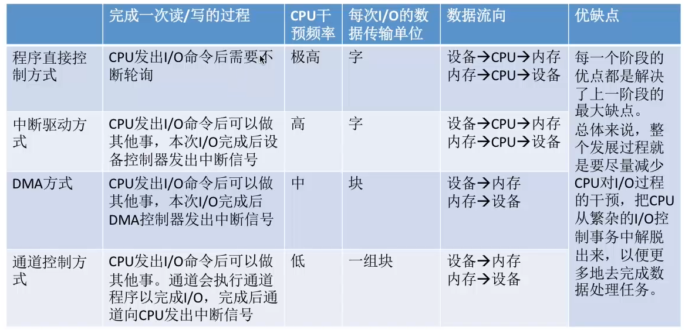

# I/O 设备管理

## 一、I/O 控制器

### 1、概念

* CPU 无法直接控制 I/O 设备的机械部件
* 因此l/O设备还要有一个 **==电子部件==** 作为 CPU 和 I/O 设备机械部件之间的 “中介”，用于现 CPU 对设备的控制
* 这个电子部件就是 I/O 控制器

### 2、功能

1. 接受和识别 CPU 发出的指令
    * 如CPU发来的read/ write命令，I/O 控制器中会有相应的**==控制寄存器==**来存放命令和参数
2. 向 CPU 报告设备的状态
    * 控制器中会有相应的**==状态寄存器==**，用于记录 I/O 设备的当前状态
    * 如：1 表示空闲，0 表示忙碌
3. 数据交换
    * I/O 控制器中会设置相应的**==数据寄存器==**
        * 输出时，数据寄存器用于暂存CPU发来的数据，之后再由控制器传送设备
        * 输入时，数据寄存器用于暂存设备发来的数据，之后CPU从数据寄存器中取走数据
4. 地址识别
    * 类似于内存的地址，为了区分设备控制器中的各个寄存器，也需要给各个寄存器设置一个特定的“地址”
    * I/O 控制器通过 CPU 提供的 “地址” 来判断 CPU 要 读/写 的是哪个寄存器

### 3、组成

1. CPU 与控制器的接口
    * 用于实现CPU与控制器之间的通信
        * CPU通过控制线发出命令
        * 通过地址线指明要操作的设备
        * 通过数据线来取出（输入）数据，或放入（输出）数据
2. I/O 逻辑
    * 负责接收和识别 CPU 的各种命令（如地址译码），并负责对设备发出命令
3. 控制器与设备的接口
    * 用于实现控制器与设备之间的通信

* 细节
    * 一个 I/O 控制器可能会对应多个设备
    * 数据寄存器、控制寄存器、状态寄存器可能有多个，且这些寄存器都要有相应的地址，才能方便CPU操作

### 4、寄存器编址方式

1. 内存镜像 I/O
    * 控制器中的寄存器与内存地址统一编址
    * 优点
        * 简化了指令。可以采用对内存进行操作的指令来对控制器进行操作

2. 寄存器独立编址
    * 控制器中的寄存器使用单独的地址
    * 缺点
        * 需要设置专门的指令来实现对控制器的操作，不仅要指明寄存器的地址，还要指明控制器的编号

## 二、I/O 控制方式

### 1、程序直接控制方式

以读操作为例

1. CPU向控制器发出读指令。于是设备启动，并且状态寄存器设为1（未就绪）
2. 轮询检查控制器的状态
    * 其实就是在不断地执行程序的循环，若状态位一直是 1，说明设备还没准备好要输入的数据，于是CPU会不断地轮询
3. 输入设备准备好数据后将数据传给控制器，并报告自身状态
4. CPU 发现设备已经就绪，即可将数据寄存器中的内容读入CPU 的寄存器中，再把 CPU 寄存器中的内容放入内存
5. 若还要继续读入数据，则CPU继续发出读指令

* CPU 干预频率
    * 很频繁，I/O 操作开始之前、完成之后需要 CPU 介入，并且在等待 I/O 完成的过程中 CPU 需要不断地轮询检查
* 数据传送单位
    * 每次读/写一个字
* 数据的流向
    * 读操作（数据输入）：I/O设备→CPU→内存
    * 写操作（数据输出）：内存→CPU→ I/O设备
    * 每个字的 读/写 都需要 CPU的帮助

* 优点
    * 实现简单。在 读/写 指令之后，加上实现循环检查的系列指令即可（因此才称为“程序直接控制方式”）
* 缺点
    * CPU和 I/O 设备只能串行工作，CPU需要一直轮询检查，长期处于“忙等”状态，**CPU利用率低**

### 2、中断驱动方式

* 引入了中断机制
    * 由于I/O 设备速度很慢，因此在CPU发出 读/写 命令后，可将等待 I/O 的进程阻塞，切换到别的进程执行
    * 当 I/O 完成后，控制器会向 CPU 发出一个中断信号，CPU检测到中断信号后，会保存当前进程的运行环境信息，转去执行中断处理程序处理该中断
    * 处理中断的过程中，CPU从 I/O 控制器读一个字的数据传送到 CPU 寄存器，再写入主存
    * 接着，CPU 恢复等待 I/O 的进程（或其他进程）的运行环境，然后继续执行

* 注意
    * CPU会在每个指令周期的末尾检查中断
    * 中断处理过程中需要保存、恢复进程的运行环境，这个过程是需要一定时间开销的。可见，如果中断发生的频率太高，也会降低系统性能

* CPU干预的频率
    * 每次 I/O 操作开始之前、完成之后需要CPU介入
    * 等待 I/O 完成的过程中 CPU 可以切换到别的进程执行
* 数据传送的单位
    * 每次读/写一个字
* 数据的流向
    * 读操作（数据输入）：I/O 设备→CPU→内存
    * 写操作（数据输出）：内存→CPU→I/O设备

* 优点
    * 与 “程序直接控制方式” 相比，在 “中断驱动方式 ”中，I/O 控制器会通过中断信号主动报告 I/O 已完成，CPU不再需要不停地轮询，CPU 和 I/O 设备可并行工作，CPU利用率得到明显提升

* 缺点
    * 每个字在 I/O 设备与内存之间的传输，都需要经过 CPU。而频繁的中断处理会消耗较多的CPU时间

### 3、DMA 方式

* 又称**==直接存储器存取==**。主要用于**块设备**的 I/O 控制

* 与 “中断驱动方式” 相比，DMA方式有这样几个改进
    1. 数据的传送单位是“块”。不再是一个字、一个字的传送
    2. 数据的流向是从设备直接放入内存，或者从内存直接到设备。不再需要经过CPU
    3. 仅在传送一个或多个数据块的开始和结束时，才需要CPU干预

* **==DMA 控制器==**

* CPU干预的频率
    * 仅在传送一个或多个数据块的开始和结束时，才需要CPU干预
* 数据传送单位
    * 每次读/写一个或多个块
        * 注意：每次读写的只能是**连续的多个块**，且这些块**读入内存后在内存中也必须是连续的**
* 数据的流向
    * 读操作（数据输入）：I/O 设备→内存
    * 写操作（数据输出）：内存→I/O设备

* 优点
    * 数据传输以“块”为单位，CPU介入频率进一步降低
    * 数据的传输不再需要先经过Cp∪再写入內存，数据传输效率进一步增加
    * CPU和 I/O 设备的并行性得到提升

* 缺点
    * CPU每发出一条 I/O 指令，**只能读/写一个或多个连续的数据块**

### 4、通道控制方式

* 通道
    * 一种**==硬件==**，可以理解为是 “弱鸡版的CPU” 
    * 通道可以识别并执行一系列**通道指令**
    * 与CPU相比，通道可以执行的指令很单一，并且**通道程序是放在主机内存中**的，也就是说通道与CPU共享内存

* 工作方式
    1. CPU向通道发出 I/O 指令。指明**通道程序**在内存中的位置，并指明要操作的是哪个 I/O 设备。之后CPU 就切换到其他进程执行了
    2. 通道执行内存中的通道程序
        * 其中指明了要读入/写出多少数据，读/写的数据应放在内存的什么位置等信息
    3. 通道执行完规定的任务后，向 CPU 发出中断信号，之后CPU对中断进行处理

* CPU 干预频率
    * 极低
    * 通道会根据 CPU 的指示执行相应的通道程序，只有完成一组数据块的读/写后才需要发出中断信号，请求CPU干预

* 数据传送单位
    * 每次读/写一组数据块
* 数据的流向
    * 读操作（数据输入）：I/O 设备→内存
    * 写操作（数据输出）：内存→I/O设备

* 优点
    * CPU、通道、VO设备可并行工作，资源利用率很高

* 缺点
    * 实现复杂，需要专门的通道硬件支持

## 三、I/O 软件层次结构

### 1、用户层软件

* 用户层软件实现了与用户交互的接口
* 用户可直接使用该层提供的、与/O操作相关的**库函数**对设备进行操作
    * printf（"hello, world"）

### 2、设备独立性软件

* 又称为设备无关性软件
* **与设备的硬件特性无关的功能**几乎都在这一层实现

* 实现的功能

    1. 向上层提供统一的**调用接口**（如read/ write系统调用）

    2. 设备的保护

        * **设备被看做是一种特殊的文件**，不同用户对各个文件的访问权限是不一样的，同理，对设备的访问权限也不一样

    3. 差错处理

        * 设备独立性软件需要对一些设备的错误进行处理

    4. 设备的分配与回收

    5. 数据缓冲区管理

        * 可以通过缓冲技术屏蔽设备之间数据交换单位大小和传输速度的差异

    6. 建立逻辑设备名到物理设备名的映射关系；根据设备类型选择调用相应的驱动程序

        * 用户或用户层软件发出 I/O 操作相关系统调用的系统调用时，需要指明此次要操作的 I/O 设备的**逻辑设备名**
            * eg：去学校打印店打印时，需要选择打印机1/打印机2/打印机3，其实这些都是逻辑设备名
        * 设备独立性软件需要通过 **“逻辑设备表**”来确定**逻辑设备对应的物理设备**，并找到该设备对应的设备驱动程序
        * 操作系统系统可以采用两种方式管理逻辑设备表（**LUT**）
            * 第一种方式，整个系统只设置一张 **LUT**，这就意味着所有用户不能使用相同的逻辑设备名，因此这种方式**只适用于单用户操作系统**
            * 第二种方式，为每个用户设置一张 **LUT**，各个用户使用的逻辑设备名可以重复，适用于多用户操作系统
                * 系统会在用户登录时为其建立一个用户管理进程，而 LUT 就存放在用户管理进程的PCB中

        

        

### 3、中断处理程序

* 当I/O任务完成时，I/O控制器会发送个中断信号，系统会根据中断信号类型找到相应的中断处理程序并执行

* 中断处理程序的处理流程如下

    

## 四、假脱机技术

### 1、什么是脱机技术

* 指的是脱离主机的控制进行输入、输出

### 2、假脱机技术

* “假脱机技术”，又称 “ SPOOLing技术” 
    * 是**用软件的方式模拟脱机技术**
* SPOOLing系统的组成如下

### 3、共享打印机原理

* 独占式设备
    * 只允许各个进程**串行使用的设备**。一段时间内只能满足一个进程的请求
* 共享设备
    * 允许多个进程“同时”使用的设备（宏观上同时使用，微观上可能是交替使用）。可以同时满足多个进程的使用请求

共享打印机原理

* 当多个用户进程提出输出打印的请求时，系统会答应它们的请求，但是并不是真正把打印机分配给他们，而是由假脱杋管理进程为每个进程做两件事
    1. 在磁盘输岀井中为进程申请一个空闲缓冲区（也就是说，这个缓冲区是在磁盘上的），并将要打印的数据送入其中
    2. 为用户进程申请一张空白的**打印请求表**，并将用户的打印请求填入表中，再将该表挂到**假脱机文件队列**上
        * 其实就是用来说明用户的打印数据存放位置等信息的
* 当打印机空闲时，输出进程会从文件队列的队头取出一张打印请求表，并根据表中的要求将要打印的数据从输出井传送到输出缓冲区，再输出到打印机进行打印。用这种方式可依次处理完全部的打印仼务

* 虽然系统中只有一个台打印机，但每个进程提出打印请求时，系统都会为在输出井中为其分配一个存储区（相当于分配了一个逻辑设备），使每个用户进程都觉得自己在独占台打印机，从而实现对打印机的共享

## 五、设备的分配与回收

### 1、设备分配因素

* 设备的固有属性
    * 设备的固有属性可分为三种：独占设备、共享设备、虛拟设备
        1. 独占设备
            * 一个时段只能分配给一个进程（如打印机
        2. 共享设备
            * 可同时分配给多个进程使用（如磁盘），各进程往往是宏观上同时共享使用设备，而微观上交替使用
        3. 虚拟设备
            * 采用 SPOOLing技术将独占设备改造成虚拟的共享设备，可同时分配给多个进程使用（如采用 SPOOLing技术实现的共享打印机）
* 设备分配算法
    * 先来先服务、优先级高者优先、短任务优先
* 设备分配中的安全性
    * 安全分配方式
        * 为进程分配一个设备后就将进程阻塞，本次 I/O 完成后才将进程唤醒
        * 优点
            * 破坏了“请求和保持”条件，不会死锁
        * 缺点
            * 对于一个进程来说，CPU和 I/O 设备只能串行工作
    * 不安全分配方式
        * 进程发出 I/O 请求后，系统为其分配  I/O 设备，进程可继续执行，之后还可以发出新的 I/O 请求。只有某个 I/O 请求**得不到满足时才将进程阻塞**
        * 优点
            * 进程的计算任务和 I/O 任务可以并行处理，使进程迅速推进
        * 缺点
            * 有可能发生死锁

### 2、设备分配方式

* 静态分配
    * 进程运待前为其分配全部所需资源，运行结束后归还资源

* 动态分配
    * 进程运行过程中动态申请设备资源

### 3、设备分配所用数据结构

* 设备控制表（DCT）
    * 系统为**每个设备**配置一张 DCT，用于记录设备情况

* 控制器控制表（COCT）
    * 每个设备控制器都会对应一张 COCT
    * 操作系统根据 COCT 的信息对控制器进行操作和管理

* 通道控制表（CHCT）
    * 每个通道都会对应一张CHCT
    * 操作系统根据CHCT的信息对通道进行操作和管理

* 系统设备表（SDT）
    * 记录了系统中全部设备的情况，每个设备对应一个表目

### 4、设备分配步骤

1. 根据进程请求的物理设备名查找**==SDT==**
    * 注：物理设备名是进程请求分配设备时提供的参数

2. 根据 **==SDT==** 找到 **==DCT==**
    * 若设备忙碌则将进程PCB挂到设备等待队列中，不忙碌则将设备分配给进程

3. 根据DCT找到 COCT
    * 若控制器忙碌则将进程 PCB 挂到控制器等待队列中，不忙碌则将控制器分配给进程

4. 根据 COCT找到 CHCT
    * 若通道忙碌则将进程 PCB 挂到通道等待队列中，不忙碌则将通道分配给进程

* 该分配方式的缺点
    1. 用户编程时必须使用“物理设备名”，底层细节对用户不透明，不方便编程
    2. 若换了一个物理设备，则程序无法运行
    3. 若进程请求的物理设备正在忙碌，则即使系统中还有同类型的设备，进程也必须阻塞等待

* 改进方法
    * 建立逻辑设备名与物理设备名的映射机制，用程时只需提供逻辑设备名
    * 步骤
        1. 根据进程请求的**逻辑设备名**查找 SDT
        2. 根据逻辑设备名遍历 SDT 表，找到用户进程指定类型的、并且空闲的设备，将其分配给该进程。操作系统在逻辑设备表（LUT）中新增一个表项
        3. 根据 DCT 找到 COCT
        4. 根据 COCT 找到 CHCT

## 六、缓冲区管理

### 1、缓冲区的作用

### 2、单缓冲

* 假设某用户进程请求某种**块设备**读入若干块的数据。若采用**单缓冲**的策略，操作系统会在主存中为其**分配一个缓冲区**（若题目中没有特别说明，一个缓冲区的大小就是一个块）
    * 注意：当缓冲区数据非空时，不能往缓冲区冲入数据，只能从缓冲区把数据传出；当缓冲区为空时，可以往缓冲区冲人数据，但必须把缓冲区充满以后，才能从缓冲区把数据传出

### 3、双缓冲

* 假设某用户进程请求某种块设备读入若干块的数据。若采用双缓冲的策略，操作系统会在主存中为其**分配两个缓冲区**（若题目中没有特别说明，一个缓冲区的大小就是一个块

