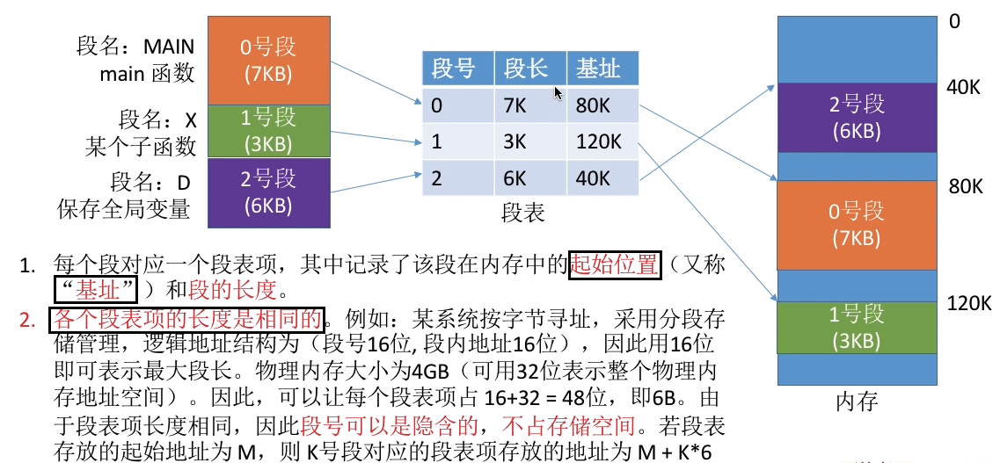
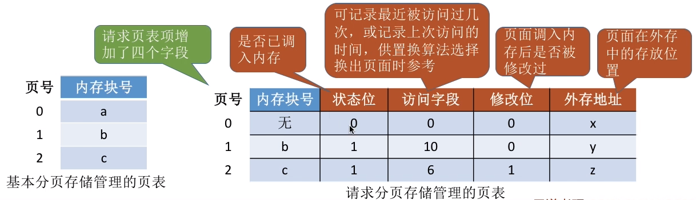

# 内存

## 一、内存的作用

### 1、什么是内存

* 内存是一种**高速存储**的硬件设备（类似内存条），用于存放数据

### 2、内存的作用

* CPU 从硬盘中读取数据很慢，导致 CPU 大部分时间处于等待状态
* 但 CPU 从内存中读取数据很快，所以程序执行前都需要放到内存中，以便 CPU 高速读取程序内容

* 存储单元

## 二、进程的运行原理

* 利用指令来运行程序

    * 以 x = x+1 为例

    

    * 我们写的代码要翻译成CPU能识别的指令。这些指令会告诉CPU应该去内存的哪个地址存/取数据这个数据应该做什么样的处理
    * 但实际在生成的机器指令的时候并不知道该进程的数据会被放到什么位置。**所以编译生成的指令中一般是使用==逻辑地址（相对地址）==**
        * 逻辑地址就是相对地址，以某个地址为参照物
        * 物理地址就是绝对地址，就是数据具体地址

### 1、从程序到程序的运行

* 编译
    * 由**编译程序**将用户源代码编译成若干个目标模块（编译就是把髙级语言翻译为机器语言）
* 链接
    * 由**链接程序**将编译后形成的一组目标模块，以及所需库函数链接在一起，形成一个完整的**装入模块**

* 装入
    * 由**装入程序**将装入模块装入内存运行

### 2、装入模块装入内存

* 核心
    * 逻辑地址到物理地址的转换
    * 转换方式
        * 绝对装入
        * 静态重定位
        * 动态重定位

+ 绝对装入
    + 在编译时，如果知道程序将放到内存中的哪个位置，编译程序将产生绝对地址的目标代码装入程序按照装入模块中的地址，将程序和数据装入内存
    + 程序中使用的绝对地址，可在编译或汇编时给出，也可由程序员直接赋予。通常情况下都是编译或汇编时再转换为绝对地址
    + 绝对装入只适合单道程序环境，灵活性低

* 静态重定位
    * 又称可重定位装入。编译、链接后的装入模块的地址都是从 0 开始的，指令中使用的地址、数据存放的地址都是相对于起始地址而言的**逻辑地址**。可根据内存的当前情况，将装入模块装入到内存的适当位置。**装入时对地址进行 “重定位”，将逻辑地址变换为物理地址**（地址变换是在装入时一次完成的）
    * 特点
        * 静态重定位的特点是在一个作业装入内存时，必须分配其要求的全部内存空间，如果没有足够的内存，就不能装入该作业
        * 作业一旦进入内存后，在运行期间就不能再移动，也不能再申请内存空间

* 动态重定位
    * 又称动态运行时装入。编译、链接后的装入模块的地址都是从 0 开始的。装入程序把装入模块装入内存后，并不会立即把逻辑地址转换为物理地址，而是把**地址转换推迟到程序真正要执行时才进行**。因此装入内存后所有的地址依然是逻辑地址。**==这种方式需要一个重定位寄存器的支持==**
    * 特点
        * 采用动态重定位时允许程序在内存中发生移动

### 3、链接的方式

* 静态链接
    * 在程序运行之前，先将各目标模块及它们所需的库函数连接成一个完整的可执行文件（装入模块），之后不再拆开
* 装入时动态链接
    * 将各目标模块装入内存时，边装入边链接的链接方式
* 运行时链接
    * 在程序执行中需要该目标模块时，才对它进行链接
    * 其优点是便于修改和更新，便于实现对目标模块的共享 

## 三、内存空间的扩充

### 1、覆盖技术

* 技术思想
    * 将程序分为多个段（多个模块），常用的段常驻内存，不常用的段在需要时调入内存
    * 内存中分为一个 **“固定区”** 和若干个 **“覆盖区”**
        * 需要常驻内存的段放在 “固定区” 中，调入后就不再调出（除非运行结束）
        * 不常用的段放在“覆盖区”，需要用到时调入内存，用不到时调出内存
    * 缺点
        * 必须由程序员声明覆盖结构，操作系统完成自动覆盖。对用户不透眀，增加了用户编程负担
        * 覆盖技术只用于早期的操作系统中，现在已成为历史

### 2、交互技术

* 技术思想
    * 内存空间紧张时，系统将内存中某些进程暂时换出外存，把外存中某些**已具备运行条件**的进程换入内存（进程在内存与磁盘间动态调度）
    * 暂时换出外存等待的进程状态为挂起状态（挂起态）
    * 注意
        * **PCB** 会常驻内有，不会被换出外存

* **应该在外存（磁盘）的什么位置保存被换出的进程**
    * 具有对换功能的操作系统中，通常把磁盘空间分为**==文件区==**和**==对换区==**两部分
        * 文件区主要用于存放文件，主要追求存储空间的利用率，因此对文件区空间的管理采用离散分配方式
        * 对焕区空间只占磁盘空间的小部分，被换出的进程数据就存放在对换区
            * 由于对换的速度直接影响到系统的整体速度，因此对换区空间的管理主要追求换入换出速度，因此通常对换区采用连续分配方式
        * 总之，对换区的 I/O 速度比文件区的更快

* 什么时候应该交换
    * 交换通常在许多进程运行且内存吃紧时进行，而系统负荷降低就暂停
        * 例如：在发现许多进程运行时经常发生缺页，就说明内存紧张，此时可以换出一些进程；如果缺页率明显下降，就可以暂停换出

* 应该换出哪些进程
    * 可优先换出阻塞进程
    * 可换出优先级低的进程
        * 为了防止优先级低的进程在被调入内存后很快又被换出，有的系统还会考虑进程在内存的驻留时间

## 四、连续分配管理

### 1、单一连续分配

* 在单一连续分配方式中，内存被分为系统区和用户区
    * 系统区通常位于内存的低地址部分，用于存放操作系统相关数据
    * 用户区用于存放用户进程相关数据
* 内存中只能有一道用户程序，用户程序独占整个用户区空间
* 优点
    * 实现简单；**无外部碎片**；可以采用覆盖技术扩充内存；不一定需要采取内存保护

* 缺点
    * 只能用于单用户、单任务的操作系统中；有**内部碎片**；存储器利用率极低

### 2、固定分区分配

* 定义
    * 为了能在内存中装入多道程序，且这些程序之间又不会相互干扰，于是**将整个用户空间划分为若干个固定大小的分区**，在每个分区中只装入一道作业
    * 这样就形成了最早的、最简单的一种可运行多道程序的内存管理方式

* 实现

    * 操作系统需要建立一个数据结构一一分区说明表，来实现各个分区的分配与回收
    * 每个表项对应一个分区，通常按分区大小排列
    * 每个表项包括对应分区的大小、起始地址、状态（是否已分配）

    

* 特点
    * 实现简单，无外部碎片
    * 当用户程序太大时，可能所有的分区都不能满足需求，此时不得不采用覆盖技术来解决，但这又会降低性能
    * 会产生内部碎片，内存利用率低

### 3、动态分区分配

* 这种分配方式不会预先划分内存分区，而是在**进程装入内存时，根据进程的大小动态地建立分区**，并使分区的大小正好适合进程的需要。因此系统分区的大小和数目是可变的

* 系统要用什么样的数据结构记录内存的使用情况

    

* 当很多个空闲分区都能满足需求时，应该选择哪个分区进行分配
    * 把一个新作业装入内存时，须按照一定的**==动态分区分配算法==**，从空闲分区表（或空闲分区链）中选出一个分区分配给该作业

* 如何进行分区的分配与回收操作
    * 以空闲分区表为例
        * 当回收一个空闲分区后，需要将相邻的前后空闲分区合并为一个空闲分区

### 4、内存碎片

* 内部碎片
    * 分配给某进程的内存区域中，如果有些部分没有用上
* 外部碎片
    * 是指内存中的某些**空闲分区由于太小而难以利用**
    * 可以通过紧凑（拼凑， Compaction）技术来解决外部碎片

## 五、动态分区分配算法

### 1、首次适应算法

1. 算法思想
    * 每次都从低地址开始查找，找到第一个能满足大小的空闲分区
2. 实现
    * 空闲分区以**==地址递增==的次序排列**。每次分配内存时顺序查找空闲分区链（或空闲分区表），找到大小能满足要求的**第一个空闲分区**

### 2、最佳适应分配

1. 算法思想
    * 由于动态分区分配是一种连续分配方式，为各进程分配的空间必须是连续的一整片区域
    * 为了保证当“大进程”到来时能有连续的大片空间，可以尽可能多地留下大片的空闲区，即，优先使用更小的空闲区
2. 实现
    * 空闲**分区按容量递==增次==序链接**
    * 每次分配内存时顺序查找空闲分区链（或空闲分区表），找到大小能满足要求的第一个空闲分区

3. 缺点
    * 每次都选最小的分区进行分配，会留下越来越多的、很小的、难以利用的内存块
    * 因此这种方法会产生很多的外部碎片

### 3、最坏适应算法

1. 算法思想
    * 为了解决最佳适应算法的问题一一即留下太多难以利用的小碎片，可以在每次分配时**优先使用最大的连续空闲区**，这样分配后剩余的空闲区就不会太小，更方便使用如何
2. 实现
    * **空闲分区按容量==递减==次序链接**
    * 每次分配内存时顺序查找空闲分区链（或空闲分区表），找到大小能满足要求的第一个空闲分区

3. 缺点
    * 每次都选最大的分区进行分配，虽然可以让分配后留下的空闲区更大，更可用，但是这种方式会导致较大的连续空闲区被迅速用完。如果之后有“大进程”到达，就没有内存分区可用了

### 4、邻近适应算法

1. 算法思想
    * 首次适应算法每次都从链头开始査找的。这可能会导致低地址部分出现很多小的空闲分区，而每次分配査找时，都要经过这些分区，因此也增加了查找的开销
    * 如果每次都从上次查找结束的位置开始检索，就能解决上述问题
2. 实现
    * 空闲分区以地址递增的顺序排列（可排成一个循环链表）
    * 每次分配内存时从上次查找结束的位置开始査找空闲分区链（或空闲分区表），找到大小能满足要求的第一个空闲分区

* 总结

## 六、非连续分配管理

### 1、基本分页存储管理

1. 思想
    * 把内存分为一个个相等的小分区，再按照分区大小**把进程拆分成一个个小部分**
        * 将内存空间分为一个个大小相等的分区（比如：每个分区 **`4KB`**），每个分区就是一个 “页框”，或称       “页帧”、“内存块”、“物理块”
        * 每个 页框 有一个编号，即 “页框号”（或者“内存块号”、“页帧号”、“物理块号”）
        * 页框号从 0 开始
        * 页框不能太大，否则可能产生过大的内部碎片
    * 将用户进程的地址空间也分为与页框大小相等的一个个区域，称为 “页” 或 “页面”
        * 每个页面也有一个编号，即 “页号”，页号也是从0开始
    * 操作系统以页框为单位为各个进程分配内存空间
        * 进程的**每个页面分别放入一个页框中**。也就是说，进程的页面与内存的页框有一一对应的关系
        * 各个页面不必连续存放，也不必按先后顺序来，可以放到不相邻的各个页框中

2. 逻辑地址与物理地址的转换
    1. 要算出逻辑地址对应的页号
        * 页号 = 逻辑地址 / 页面长度（取除法的整数部分）
    2. 要知道该页号对应的页面在内存中的起始地址
        * 由操作系统来完成
    3. 要算出逻辑地址在页面内的 “偏移量”
        * 页内偏移量 = 逻辑地址 % 页面长度（取除法的余数部分）
    4. 物理地址= 页面始址 + 页内偏移量
3. 计算中的存储方式

* 为了能知道进程的每个页面在内存中存放的位置，操作系统要为每个进程建立一张**页表**

* 基本地址变换机构
    * **用于实现逻辑地址到物理地址转换的一组硬件机构**
    * 通常会在系统中设置一个 **页表寄存器（`PTR`）**，存放 **页表在内存中的起始地址F** 和 **页表长度 M**
        * 进程未执行时，页表的起始址和页表长度放在进程控制块（PCB）中，当进程被调度时，操作系统内核会把它们放到页表寄存器中
    * 例：设页面大小为 L，逻辑地址 A 到物理地址 E 的变换过程如下
        * 计算**页号 P** 和 **页内偏移量 W**（如果用十进制数手算，则 P = A/L，W = A%L：但是在计算机实际运行时，逻辑地址结构是固定不变的，因此计算机硬件可以更快地得到二进制表示的页号、页内偏移量）
        * **比较页号 P 和页表长度 M**，若P ≥ M，则产生越界中断，否则继续执行
        * 页表中**页号 P**对应的 页表项地址 = 页表起始地址 F + 页号 P*页表项长度，取出该页表项内容 b，即为内存块号
        * 计算 E = b*L+W，用得到的物理地址 E 去访问

* 具有快表的地址变换机构
    * 局部性原理
        * 时间局部性
            * 如果执行了程序中的某条指令，那么不久后这条指令很有可能再次执行；如果某个数据被访问过，不久之后该数据很可能再次被访问。（程序中存在大量的循环）
        * 空间局部性
            * 一旦程序访问了某个存储单元，在不久之后，其附近的存储单元也很有可能被访问。（因为很多数据在内存中都是连续存放的）
    * 快表
        * 又称联想寄存器（**`TLB`**），是一种**访问速度比内存快很多的高速缓冲存储器**，用来存放当前访问的若干页表项，快加速地址变换的过程。
        * 与此对应，内存中的页表常称为慢表
        * 使用快表步骤
            1. CPU 给出逻辑地址，由某个硬件算得页号、页内偏移量，将页号与快表中的所有页号进行比较
            2. 如果找到匹配的页号，**说明要访问的页表项在快表中有副本**，则直接从中取出该页对应的内存块号，再将内存块号与页内偏移量拼接形成物理地址，最后，访问该物理地址对应的内存单元。因此，**若快表命中，则访问某个逻辑址仅需一次访存即可**
            3. 如果没有找到匹配的页号，则需要访问内存中的页表，找到对应页表项，得到页面存放的内存块号，再将内存块号与页内偏移量拼接形成物理地址，最后，访问该物理地址对应的内存单元。因此若快表未命中，则访问某个逻辑地址需要两次访存（注意：在找到页表项后，应同时将其存入快表以便后面可能的再次访问。但若快表已满，则必须按照一定的算法对旧的页表项进行替换）

### 2、基本分段存储管理

1. 基本原理

    * 进程的地址空间：按照程序自身的逻辑关系划分为若干个段，每个段都有一个段名（在低级语言中，程序员使用段名来编程），每段从0开始
    * 编址内存分配规则：以段为单位进行分配，每个段在内存中占据连续空间，但各段之间可以不相邻

    

2. 分段的基本概念

    

3. 实现

    * 程序分多个段，各段离散地装入内存，为了保证程序能正常运行，就必须能从物理内存中找到各个逻辑段的存放位置。为此，需**为每个进程建立一张段映射表**，简称 **==“段表”==**

    

    

    4. 地址变换

    

    

    

    

### 3、段页式管理方式

* 分页、分段的优缺点

* 分段 + 分页管理

    

* 段页式采用的数据结构

    

* 地址转换

## 七、虚拟内存

* 计算机中的存储器结构层次

### 1、基本概念

* 原理
    * 基于局部性原理，在程序装入时，可以将程序中很快会用到的部分装入内存，暂时用不到的部分留在外存就可以让程序开始执行
    * 在程序执行过程中，当所访问的信息不在内存时，由操作系统负责将所需信息从外存调入内存，然后继续执行程序若内存空间不够，由操作系统负责将内存中暂时用不到的信息换出到外存
    * 在操作系统的管理下，在用户看来似乎有一个比实际内存大得多的内存，这就是**==虚拟内存==**
* 特点
    * 多次性：无需在作业运行时一次性全部装入内存，而是允许被分成多次调入内存
    * 对换性：在作业运行时无需一直常驻内存，而是允许在作业运行过程中，将作业换入、换出
    * 虚拟性：从逻辑上扩充了内存的容量，使用户看到的内存容量，远大于实际的容量
* **虚拟内存的实现需要建立在离散分配的内存管理方式基础上**

* 小结

### 2、请求分页管理方式

* 页表机制
    * 与基本分页管理相比，请求分页管理中，为了实现“请求调页”，操作系统需要知道每个页面是否已经调入内存；如果还没调入，那么也需要知道该页面在外存中存放的位置
    * 当内存空间不够时，要实现 **“页面置换”**，操作系统需要通过某些指标来决定到底换出哪个页面
        * 有的页面没有被修改过，就不用再浪费时间写回外存
        * 有的页面修改过，就需要将外存中的旧数据覆盖，
        * 因此，操作系统也需要记录各个页面是否被修改的信息

* 缺页中断机构
    * 在请求分页系统中，每当要问的页面不在内存时，便产生一个缺页中断，然后由操作系统的缺页中断处理程序处理中断
    * 此时缺页的进程阻塞，放入阻塞队列，调页完成后再将其唤醒，放回就绪队列
        * 如果内存中有空闲块，则为进程分配一个空闲块，将所缺页面装入该块，并修改页表中相应的页表项
        * 如果内存中没有空闲块，则由页面置换算法选择一个页面淘汰，若该页面在内存期间被修改过，则要将其写回外存。未修改过的页面不用写回外存

* 地址变换

    * 请求分页存储管理与基本分页存储管理的主要区别
        * 在程序执行过程中，当所访问的信息不在内存时，由操作系统负责将所需信息从外存调入内存，然后继续执行程序
        * 若内存空间不够，由操作系统负责将内存中暂时用不到的信息换出到外存

    

### 3、页面置换算法

* 用页面置换算法决定应该换出哪个页面

* 最佳置换算法（OPT）
    * 每次选择淘汰的页面将是以后永不使用，或者在最长时间内不再被访问的页面，这样可以保证最低的缺页率
    * 注意
        * 这种算法需要提前知道接下来要访问的各个页面
        * 但实际上，只有在进程执行的过程中才能知道接下来会访问到的是哪个页面。操作系统无法提前预判页面访问序列
        * **因此，最佳置换算法是无法实现的**

* 先进先出置换算法（FIFO）
    * 每次选择淘汰的页面是最早进入内存的页面
    * 实现
        * 把调入内存的页面根据调入的先后顺序排成一个队列，需要换出页面时选择队头页面即可
        * 队列的最大长度取决于系统为进程分配了多少个内存块
    * **`Belady`** 异常
        * 当为进程分配的物理块数增大时，缺页次数不减反增的异常现象
        * 只有 FIFO 算法会产生 **`Belady`** 异常
    * 注意
        * FIFO 算法虽然实现简单，但是该算法与进程实际运行时的规律不适应，因为先进入的页面也有可能最经常被访问
        * 因此，**算法性能差**

* 最近最久未使用置换算法（**`LRU`**）
    * 每次淘汰的页面是**最近最久未使用的页面**
    * 实现
        * 赋予每个页面对应的页表项中，用访问字段**记录该页面自上次被访问以来所经历的时间 t**
        * 当需要淘汰一个页面时，选择现有页面中 **t** 值最大的，即最近最久未使用的页面
    * 特点
        * 该算法的实现需要专门的硬件支持，**虽然算法性能好但是实现困难，开销大**

* 时钟置换算法（CLOCK）
    * **简单的 CLOCK 算法**实现方法
        * 为每个页面设置一个访问位，再将内存中的页面都通过链接指针链接成个循环队列
        * 当某页被访问时，其访问位置为 1
        * 当需要淘汰一个页面时，只需检查页的访问位如果是 0，就选择该页换出；如果是1，则将它置为 0，暂不换岀，继续检査下一个页面
        * 若第一轮扫描中所有页面都是1，则将这些页面的访问位依次置为 0 后，再进行第二轮扫描
            * 第二轮扫描中一定会有访问位为 0 的页面，因此简单的 CLOCK 算法选择一个淘汰页面最多会经过两轮扫描
    * 改进型的时钟置换算法
        * 简单的时钟置换算法仅考虑到一个页面最近是否被访问过。事实上，如果被淘汰的页面没有被修改过就不需要执行 I/O 操作写回外存。**只有被淘汰的页面被修改过时，才需要写回外存**
        * 除了考虑一个页面最近有没有被访问过之外，操作系统还应考虑页面有没有被修改过
        * 在其他条件都相同时，应优先淘汰没有修改过的页面，避免Jo操作。这就是改进型的时钟置换算法的思想
        * 实现
            * 修改位 = 0，表示页面没有被修改过；修改位 = 1，表示页面被修改过
            * 将所有可能被置换的页面排成一个循环队列
            * 第一轮：从当前位置开始扫描到第一个（0，0）的帧用于替换。**本轮扫描不修改任何标志位**
            * 第二轮：若第一轮扫描失败，则重新扫描，査找第一个（0,1）的帧用于替换。**本轮将所有扫描过的帧访问位设为 0**
            * 第三轮：若第二轮扫描失败，则重新扫描，査找第一个（0,0）的帧用于替换。**本轮扫描不修改任何标志位**
            * 第四轮：若第三轮扫描失败则重新扫描，査找第一个（0,1）的帧用于替换
            * 由于第二轮已将所有帧的访问位设为0，因此经过第三轮、第四轮扫描定会有一个帧被选中
                * 因此**改进型 CLOCK 置换算法**选择一个淘汰页面**最多进行四轮扫描**

### 4、页面分配策略

* 驻留集

    * 指请求分页存储管理中**给进程分配的物理块的集合**

    * 在采用了虚拟存储技术的系统中，驻留集大小一般小于进程的总大小

    * 若驻留集太小，会导致缺页频繁，系统要花大量的时间来处理缺页，实际用于进程推进的时间很少

    * 驻留集太大，又会导致多道程序并发度下降，资源利用率降低

    * 驻留集分配

        * 固定分配
            * 操作系统为每个进程分配一组固定数目的物理块，在进程运行期间不再改变。即，驻留集大小不变

        * 可变分配
            * 先为每个进程分配一定数目的物理块，在进程运行期间，可根据情况做适当的增加或减少即，驻留集大小可变

* 固定分配局部置换
    * 系统为每个进程分配一定数量的物理块，在整个运行期间都不改变。若进程在运行中发生缺页，则只能从该进程在内存中的页面中选出一页换出，然后再调入需要的页面
    * 缺点
        * 很难在刚开始就确定应为每个进程分配多少个物理块才算合理

* 可变分配全局置换
    * 刚开始会为每个进程分配一定数量的物理块
    * 操作系统会保持一个空闲物理块队列
    * 当某进程发生缺页时，从空闲物理块中取出一块分配给该进程；若已无空闲物理块，则可选择个未锁定的页面换岀外存，再将该物理块分配给缺页的进程
    * 特点
        * 采用这种策略时，只要某进程发生缺页，都将获得新的物理块，仅当空闲物理块用完时，系统才选择一个未锁定的页面调岀
        * 被选择调出的页可能是系统中任何一个进程中的页，因此这个被选中的进程拥有的物理块会减少，缺页率会增加

* 可变分配局部置换
    * 刚开始会为每个进程分配一定数量的物理块
    * 当某进程发生缺页时，只允许从该进程自己的物理块中选岀一个进行换出外存
    * 如果进程在运行中频繁地缺页，系统会为该进程多分配几个物理块，直至该进程缺页率趋势适当程度
    * 反之，如果进程在运行中缺页率特别低，则可适当减少分配给该进程的物理块

* 何时调入页面
    * 预调页策略
        * 根据局部性原理，一次调入若干个相邻的页面可能比一次调入一个页面更高效
        * 但如果提前调入的页面中大多数都没被访问过，则又是低效的
        * 因此可以预测不久之后可能访问到的页面，将它们预先调入内存，但目前预测成功率只有50%左右
        * 故这种策略主要用于进程的首次调入由稈序指出应该先调入哪些部分
    * 请求调页策略
        * 进程在运行期间发现缺页时才将所缺页面调入内存
        * 这种策略调入的页面一定会被访问到，但由于每次只能调入一页，而每次调页都要磁盘 I/O 操作，因此 I/O 开销较大

* 抖动、颠簸现象
    * 刚刚换出的页面马上又要换入内存，刚刚换入的页面马上又要换出外存，这种频繁的页面调度行为称为抖动，或颠簸
    * 产生抖动的主要原因是进程频繁访问的页面数目高于可用的物理块数（分配给进程的物理块不够）
    * 工作集
        * 指在某段时间间隔里，进程实际访问页面的集合
        * 工作集大小可能小于窗口尺寸，实际痖用中，操作系统可以统计进程的工作集大小，根据工作集大小给进程分配若干内存块
            * 如：窗口尺寸为 5，经过一段时间的监测发现某进程的工作集最大为3，那么说明该进程有很好的局部性，可以给这个进程分配 3 个以上的内存块即可满足进程的运行需要
        * 一般来说，驻留集大小不能小于工作集大小，否则进程运行过程中将频繁缺页

