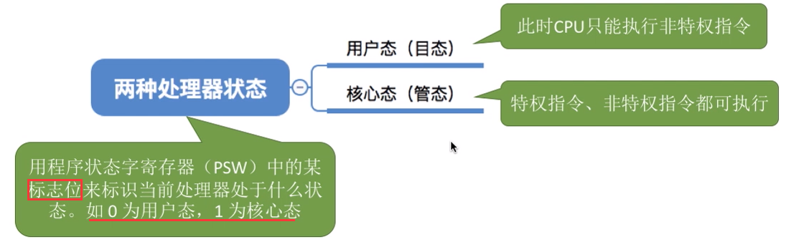
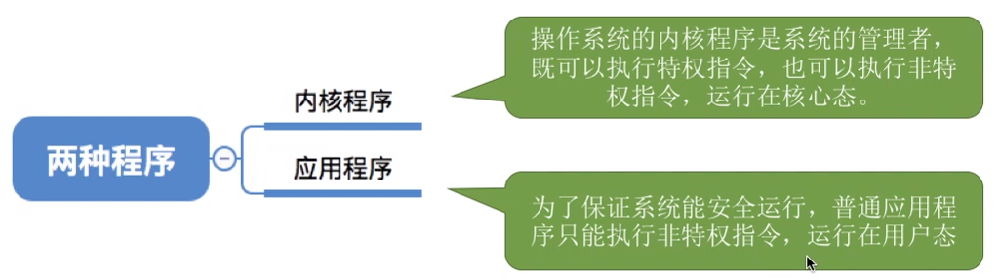

# 操作系统概述

## 一、操作系统的特征

### 1、并发

* 并发
    * 是指两个或多个事件在**同一时间间隔**内发生。这些事件**宏观上是同时发生的**，但**微观上是交替发生的**
    * 个单核处理杋（CPU）同一时刻只能执行一个程序，因此操作系统会负责协调多个程序交替执行（这些程序微观上是交替执行的，但宏观上看起来就像在同时执行）
* 并行
    * 指两个或多个事件在**同一时刻**同时发生

### 2、共享

* 共享即**资源共享**，是指系统中的资源可供内存中多个并发执行的进程**共同使用**

* 所谓的“同时”往往是宏观上的，而在微观上，这些进程可能是交替地对该资源进行访问的（即分时共享）

* 实例
    * 互斥共享方式
        * 使用 **`QQ`** 和微信视频。同一时间段内摄像头只能分配给其中一个进程
    * 同时共享方式
        * 使用 **`QQ`** 发送文件A，同时使用微信发送文件B。宏观上看，两边都在同时读取并发送文件。说明两个进程都在访问硬盘资源，从中读取数据。微观上看，两个进程是交替着访问硬盘的

### 3、虚拟

* 虚拟是指把一个物理上的实体变为若干个逻辑上的对应物。物理实体（前者）是实际存在的，而逻辑上对应物（后者）是用户感受到的

* 实例
    * 问题：既然一个程序需要被分配CPU才能正常执行，那么为什么单核CPU的电脑中能同时运行这么多个程序呢？
    * 答：这是虚拟处理器技术。实际上只有一个单核CPU，在用户看来似乎有6个CPU在同时为自己服务

### 4、异步

* 异步是指，在多道程序环境下，允许多个程序并发执行，但由于资源有限，进程的执行不是一贯到底的而是走走停停，以不可预知的速度向前推进，这就是**进程的异步性**

* 解释
    * 当所需要的资源正在被别的应用程序使用时，该进程就回阻塞，等待资源的释放，然后继续运行

## 二、操作系统的发展与分类

### 1、手工操作阶段

### 2、批处理阶段

* **单道批处理**技术

    * 引入脱机输入/输岀技术（用磁带完成），并监督程序负责控制作业的输入、输出

    

    * 主要优点
        * 缓解了一定程度的人机速度矛盾，资源利用率有所提升
    * 主要缺点
        * 内存中仅能有一道程序运行，只有该程序运行结束之后才能调入下一道程序。CPU有大量的时间是在空闲等待 I/O 完成。资源利用率依然很低

* **多道批处理**技术

    

    * 优点
        * 多道程序并发执行，共享计算机资源。**资源利用率大幅提升**，CPU 和其他资源保持“忙碌”状态，系统吞吐量增大
    * 缺点
        * 用户响应时间长，没有人机交互功能（用户提交自己的作业之后就只能等待计算机处理完成中间不能控制自己的作业执行）

### 3、分时操作系统

* 计算机**以时间片为单位**轮流为各个 用户/作业 服务，各个用户可**通过终端与计算机进行交互**
    * 优点
        * 用户请求可以被即时响应，**解决了人机交互问题**。允许多个用户同时使用一台计算机，并且用户对计算机的操作相互独立，感受不到别人的存在
    * 缺点
        * 不能优先处理一些紧急仼务。操作系统对各个 用户/作业 都是**完全公平的**，循环地为每个用户，作业服务一个时间片，不区分任务的紧急性

### 4、实时操作系统

* 优点
    * 能够优先响应一些紧急任务，某些紧急任务不需时间片排队

### 5、总结

## 三、OS 的运行机制和体系结构

### 1、什么是指令

* 处理器（CPU）能识别、执行的最基本的命令

* 问题
    * 有的指令“人畜无害”。比如：加、减、乘、除这些普通的运算指令
    * 有的指令有很高的权限。比如：**内存清零指令**。如果用户程序可以使用这个指令，就意味着一个用户可以将其他用户的内存数据随意清零，这样做显然是很危险的

* 解决办法
    * 将指定分为特权指令和非特权指令，**CUP 在运行前会判断是否是特权指令**
        * 特权指令：如内存清零指令，不允许用户程序使用
        * 非特权指令：如普通的加减运算

* CPU **如何判断**是否为特权指令
    * 将 CPU 分为用户态和核心态两种状态

    

* 总结

### 2、操作系统内核

* 内核是计算机上配置的**底层软件**，是操作系统最基本、最核心的部分
* 实现操作系统内核功能的那些程序就是**内核程序**

### 3、操作系统体系结构

* 分为**大内核、微内核**

* 类比企业管理
    * **内核**就是企业的**管理层**，负责一些重要的工作。只有管理层才能执行特权指令，普通员工只能执行非特权指令。用户态、核心态之间的切换相当于普通员工和管理层之间的工作交接
        * **大内核**：企业初创时体量不大，**管理层的人会负责大部分的事情**。优点是效率高；缺点是组织结构混乱，难以维护
        * **微内核**：随着企业体量越来越大，管裡层只负责最核心的一些工作。优点是组织结构清晰，方便维护；缺点是效率低

## 四、中断和异常

### 1、中断

* 概念
    * 当中断发生时，CPU立即进入核心态
    * 当中断发生后，当前运行的进程暂停运行，并由操作系统内核对中断进行处理
    * 对于不同的中断信号，会进行不同的处理

* 发生了中断，就意味着需要操作系统介入，开展管理工作。由于操作系统的管理工作（比如进程切换分配、     I/O设备等）需要使用特权指令，因此CPU要**从用户态转为核心态**。**==中断可以使CPU从用户态切换为核心态，使操作系统获得计算机的控制杈==**。有了中断，才能实现多道程序并发执行

### 2、中断的分类

## 五、系统调用

### 1、什么事系统调用

* 操作系统作为用户和计算杋硬件之间的接口，需要向上提供一些简单易用的服务。主要包括命令接口和程序接口。其中，**程序接口由一组系统调用组成**

* “系统调用”是操作系统提供给应用程序（程序员/编程人员）使用的接口，可以理解为一种**可供应用程序调用的特殊函数**，应用程序可以发出系统调用请求来获得操作系统的服务

