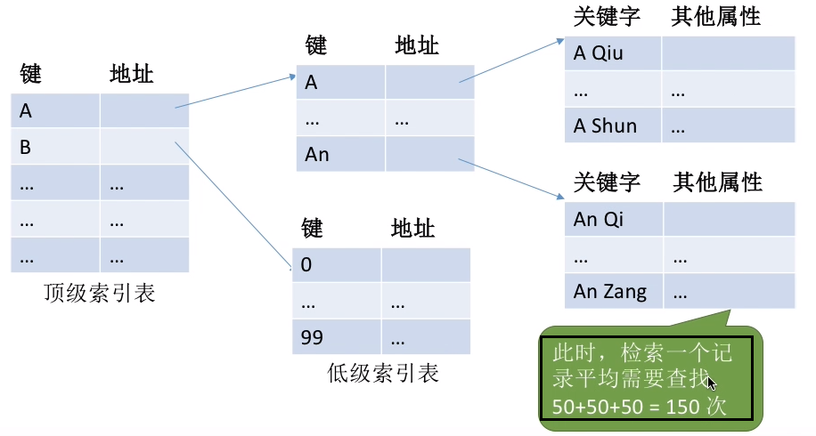
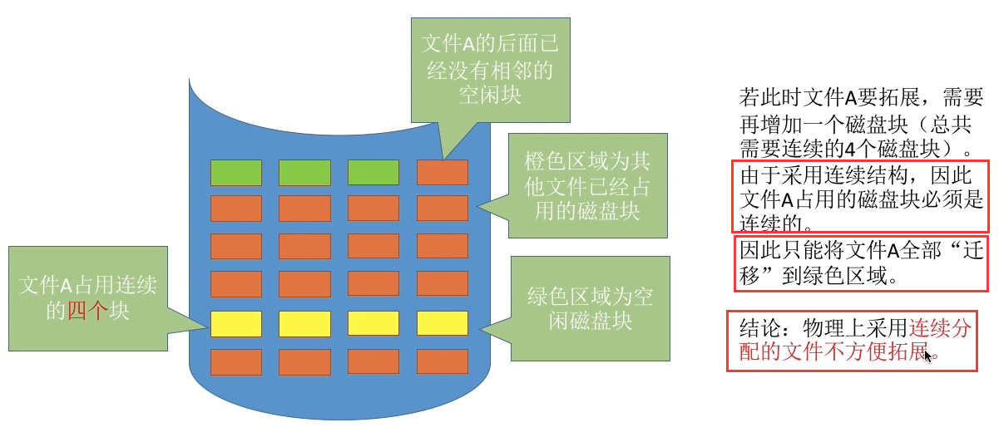
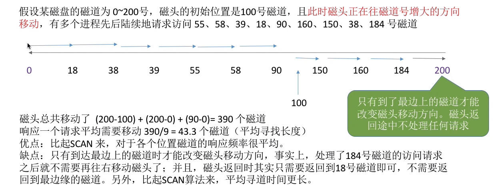

# 文件管理

## 一、文件管理概述

### 1、文件的属性

* 文件名
    * 由创建文件的用户决定文件名，主要是为了方便用户找到文件，同一目录下不允许有重名文件
* 标识符
    * 一个系统内的各文件标识符唯一，对用户来说毫无可读性
    * 因此标识符只是操作系统用于区分各个文件的一种内部名称

* 文件类型
    * 指明文件的类型

* 位置
    * 文件存放的路径（让用户使用）、在外存中的地址（操作系统使用，对用户不可见）
* 大小
* 创建时间
* 保护信息
    * 对文件进行保护的访问控制信息

## 二、文件的逻辑结构

### 1、概述

* 所谓的 **“逻辑结构”**，就是指在用户看来，文件内部的**数据应该是如何组织起来的**
* 而 **“物理结构”** 指的是在操作系统看来，文件的数据是如何存放在外存中的

### 2、无结构文件

* 文件内部的数据就是一系列二进制流或字符流组成。又称“流式文件”
* 如Windows操作系统中的 **txt** 文件

### 3、有结构文件

1. 组成
    * 由一组相似的记录组成，又称 “记录式文件”
    * 每条记录又若干个数据项组成。如：数据库表文件
    * 一般来说，每条记录有一个数据项可作为关键字
    * 根据各条记录的长度（占用的存储空间）是否相等，又可分为**定长记录**和**可变长记录**两种

2. 逻辑结构

    1. 顺序文件

        * 文件中的记录一个接一个地顺序排列（逻辑上），记录可以是定长的或可变长的
        * 各个记录在物理上可以**顺序存储**或**链式存储**

        

        * 顺序文件的分类
            * 串结构：记录之间的顺序**与类键字无关**
            * 顺序结构：记录之间的顺序**按关键字顺序排列**

​						

2. 索引文件
    * 问题：对于可变长记录文件，要找到第 i 个记录，必须先顺序第查找前 i - 1个记但是很多应用场景中，又必须使用可变长记录。如何解决这个问题
    * 解决办法：建立一个索引表
        * 索引表本身是定长记录的顺序文件。因此可以快速找到第i个记录对应的索引项
        * 可将关键字作为索引号内容，若按关键字顺序排列，则还可以支持按照关键字折半查找

​			

3. 索引顺序文件
    * 索引文件问题
        * 每个记录对应一个索引表项，因此索引表可能会很大
            * 比如：文件的每个记录平均只占 **`8B`**，而每个索引表项占 32个字节，那么索引表都要比文件内容本身大4倍，这样对存储空间的利用率就太低了
    * 解决办法
        * 索引顺序文件中，同样会为文件建立张索引表
        * 但不同的是：并不是每个记录对应一个索引表项，而是**一组记录对应一个索引表项**
        * 索引顺序文件的索引项也**不需要按关键字顺序排列**，这样**可以极大地方便新表项的插入**
    * 多级索引
        * 为了进一步提高检索效率，可以为顺序文件建立多级索引表
        * 例如，对于一个含 10 的 6 次方个记录的文件，可先为该文件建立一张低级索引表，每100个记录为一组
            * 故低级索引表中共有10000个表项
            * 再把这10000个定长记录分组，每组100个，为其建立顶级索引表，故顶级索引表中共有100个表

## 三、文件目录

### 1、文件控制块

* 目录文件中的一条记录就是一个 **“文件控制块（`FCB`）”**
    * **`FCB`** 中包含了文件的基本信息（文件名、物理地址、逻辑结构、物理结构等），存取控制信息（是否可读/可写、禁止访问的用户名单等），使用信息（如文件的建立时间、修改时间等）

### 2、目录结构

* 单级目录结构
    * 单级目录实现了“按名存取”，但是不允许文件重名
    * 在创建一个文件时，需要先检查目录表中有没有重名文件，确定不重名后才能允许建立文件，并将新文件对应的目录项插入目录表中
    * **显然，单级目录结构不适用于多用户操作系统**

* 两级目录表

    * 早期的多用户操作系统，采用两级目录结构
        * 分为**主文件目录**和**用户文件目录**
    * 缺点
        * 用户不能对自己的文件进行分类

    

* 多级目录结构

    * 用户（或用户进程）要访问某个文件时要用文件路径名标识文件，文件路径名是个字符串
    * 各级目录之间用“/”隔开。从根目录出发的路径称为**绝对路径**
    * 每次都从根目录开始査找，是很低效的。因此可以设置一个 **“当前目录”**
        * 当用户想要访问某个文件时，可以使用从当前目录出发的 **“相对路径”**
        * 引入 “当前目录” 和“相对路径”后，磁盘 I/O 的次数减少了。这就提升了访问文件的效率

* 无环图目录结构

    * 在树形目录结构的基础上，增加些指向同一节点的有向边，使整个目录成为一个**有向无环图**，可以更方便地**实现多个用户间的文件共享**
    * 特点
        * 可以用不同的文件名指向同一个文件，甚至可以指向同一个目录（共享同一目录下的所有内容）
        * 需要为每个共享结点设置一个共享计数器，用于记录此时有多少个地方在共享该结点
        * 用户提出删除结点的请求时，只是删除该用户的 **`FCB`**、并使共享计数器减 1，并不会直接删除共享结点

    

### 3、索引节点

* 定义
    * 其实在查找各级目录的过程中只需要用到“文件名”这个信息，只有文件名匹配时，才需要读出文件的其他信息
    * 因此可以考虑让目录表 “瘦身” 来提升效率
    * **除了文件名之外的文件描述信息都放到索引节点中**

* 小结

## 四、文件的物理结构

* 文件块、磁盘块
    * 类似于内存分页，**磁盘中的存储单元也会被分为一个个“块/磁盘块/物理块”**
    * 很多操作系统中，磁盘块的大小与内存块、页面的大小相同
    * 在**外存管理中**，为了方便对文件数据的管理，文件的**逻辑地址空间**也被分为了一个一个的文件“块”
        * 于是文件的逻辑地址也可以表示为（逻辑块号，块内地址）的形式

### 1、连续分配方式

* 连续分配方式要求每个文件在磁盘上**占有一组连续的块**

    

* 逻辑块号到物理块号的映射

    * 文件目录中记录存放的起始块号和长度（总共占用几个块）

    

    * 用户给出要访问的逻辑块号，操作系统找到该支件对应的目录项（**`FCB`**）
        * 物理块号 = 起始块号 + 逻辑块号

* 优点

    * 可以直接算出逻辑块号对应的物理块号
    * 连续分配支持顺序访问和直接访间（即随机访问）
    * 连续分配的文件在顺序 读/写 时速度最快
        * 读取某个磁盘块时，需要移动磁头。访问的两个磁盘块相隔越远，移动磁头所需时间就越长

* 缺点

    * 物理上采用连续分配的文件不方便拓展

        

    * 物理上采用连续分配，存储空间利用率低，会产生难以利用的磁盘碎片

        * 可以用紧凑来处理碎片，但是需要耗费很大的时间代价

    

### 2、链接分配（链表方式）

* 链接分配采取离散分配的方式，**可以为文件分配离散的磁盘块**

1. 隐式链接方式

    * 目录中记录了文件存放的起始块号和结束块号
    * 除了文件的最后个磁盘块之外，每个磁盘块中都会**保存指向下一个盘块的指针**，这些指针对用户是透明的
    * 特点
        * 采用链式分配（隐式链接）方式的文件，只支持顺序访问，不支持随机访问，**查找效率低**
        * 另外，指向下一个盘块的指针也需要耗费少量的存储空间
        * 很方便文件拓展，不会有碎片问题，**外存利用率高**

    

2. 显式链接方式

    * 把用于链接文件各物理块的指针显式地存放在一张表中，即文件分配表（**FAT**）

    

    * 特点
        * 从目录项中找到起始块号，若i>0，则查询内存中的文件分配表FAT，往后找到ⅰ号逻辑块对应的物理块号
        * 逻辑块号转换成物理块号的过程不需要读磁盘操作
        * 采用链式分配（显式链接）方式的文件，支持顺序访问，也支持随机访问
        * 由于块号转换的过程不需要访问磁盘，因此相比于隐式链接来说，访问速度快很多
        * 显然，显式链接也不会产生外部碎片，也可以很方便地对文件进行拓展
        * **文件分配表的需要占用一定的存储空间**

### 3、索引分配

* 索引分配允许文件离散地分配在各个磁盘块中，系统会为每个文件建立一张索引表
* 索引表中**记录了文件的各个逻辑块对应的物理块**
* 索引表存放的磁盘块称为**索引块**。文件数据存放的磁盘块称为**数据块**

* 逻辑块号到物理块号的转换
    * 用户给出要访问的逻辑块号 i，操作系统找到该文件对应的目录项（**`FCB`**）
    * 从目录项中可知索引表存放位置，将**索引表**从外存读入内存，并**查找索引表**即可知 i 号逻辑块在外存中的存放位置

* 特点
    * 可见，索引分配方式可以支持随机访问
    * 文件拓展也很容易实现（只需要给文件分一个空闲块，并增加一个索引表项即可）

* **==问题==**：如果索引表太大，一个索引块装不下

    * 方案一：链接方案

        * 如果索引表太大，一个索引块装不下，那么可以将多个索引块**链接起来存放**

        

        * 缺点
            * 假设磁盘块大小为 **`1KB`**，一个索引表项占 **`4B`**，则一个磁盘块只能存放256个索引项
            * 若一个文件大小为 **`256 * 256KB = 65536KB = 64MB`** 该文件共有 256 * 256 个块，也就对应256 * 256 个索引项，也就需要256个索引块来存储，这些索引块用链接方案连起来
            * 若想要访问文件的最后一个逻辑块，就必须找到最后一个索引块（第256个索引块），而各个索引块之间是用指针链接起来的，因此必须先顺序地读入前255个索引块
            * 这显然是很低效的

    * 方案二：多级索引

        * 建立多层索引
        * 使第一层索引块指向第二层的索引块。还可根据文件大小的要求再建立第三层、第四层索引块
        * 逻辑块号到物理块号的转换
            * 可根据逻辑块号算出应该査找索引表中的哪个表项
                * 如：要访问 1026 号逻辑块，则 1026/256=4,1026%256=2（举例而已）
                * 因此可以先将一级索引表调入内存，查询 **4** 号表项，将其对应的二级索引表调入内存，再查询二级索引表的 **2** 号表项即可知道 1026 号逻辑块存放的磁盘块号了
            * 采用 K 层索引结构，且顶级索引表未调入内存，则访问一个数据块只需要 K+1 次读磁盘操作
        * 缺点
            * 若文件大小不大，却用了二级索引访问方式，也需要 3 次 I/O 操作，得不偿失

    * 方案三：混合索引

        * 多种索引分配方式的结合
            * 例如，一个文件的顶级索引表中，既包含**直接地址索引（直接指向数据块）**，又包含**一级间接索引（指向单层索引表）**、还包含**两级间接索引（指向两层索引表）**
        * 特点
            * 小文件可以直接读取，不需要多次 I/O 操作

        

        

## 五、文件存储空间管理

### 1、空闲表法

* 用一张表来记录磁盘的空闲区间

* 如何分配磁盘块

    * 与动态分区分配类似

    

* 回收磁盘块

    

### 2、空闲链表法

* 空闲盘块链：以盘块为单位组成一条空闲链

    

    * 操作系统保存着链头、链尾指针
    * 分配
        * 若某文件申请K个盘块，则从链头开始依次摘下K个盘块分配，并修改空闲链的链头指针
    * 回收
        * 回收的盘块依次挂到链尾，并修改空闲链的链尾指针

* 空闲盘区链

    * 以盘区为单位组成一条空闲链

    

    * 操作系统保存着链头、链尾指针
    * 分配
        * 若某文件申请 K 个盘块，则可以采用首次适应、最佳适应等算法，从链头开始检索，按照算法规则找到一个大小符合要求的空闲盘区，分配给文件。若没有合适的连续空闲块，也可以将不同盘区的盘块同时分配给一个文件，注意分配后可能要修改相应的链指针、盘区大小等数据
    * 回收
        * 若回收区和某个空闲盘区相邻，则需要将回收区合并到空闲盘区中。若回收区没有和任何空闲区相邻，将回收区作为单独的一个空闲盘区挂到链尾

### 3、位示图法

* 每个二进制位对应一个盘块
    * 在本例中，0 代表盘块空闲，1 代表盘块已分配
* 位示图一般用连续的 **“字”** 来表示
    * 如本例中个字的字长是16位，字中的每一位对应一个盘块
    * 因此可以用（字号，位号）对应一个盘块号

* 分配
    * 若文件需要K个块
        1. 顺序扫描位示图，找到 K 个相邻或不相邻的 “0”
        2. 根据字号、位号算出对应的盘块号，将相应盘块分配给文件
        3. 相应位设置为 “1”
* 回收
    1. 根据回收的盘块号计算出对应的字号、位号
    2. 将相应二进制位设为 “0”

### 4、成组链接法

* 超级块
    * 文件卷的目录区中专门用一个磁盘块作为 **“超级块”**，当系统启动时需要将超级块读入内存。并且要保证内存与外存中的“超级块”数据一致

* 分配
    * 假设需要分配 1 个空闲块
        1. 检查第一个分组的块数是否足够。1<100，因此是足够的
        2. 分配第一个分组中的 1 个空闲块，并修改相应数据
    * 假设需要分配 100 个空闲块
        1. 检查第一个分组的块数是否足够。100=100，是足够的
        2. 分配第一个分组中的100个空闲块
            * 但是由于300号块内存放了再下一组的信息，因此300号块的数据需要复制到超级块中

* 回收
    * 假设每个分组最多为100个空闲块，此时第一个分组已有99个块，还要再回收一块
        * 将回收的空闲块插入到第一个分组中
    * 假设每个分组最多为100个空闲块，此时第一个分组已有100个块，还要再回收一块
        * 将新回收的空闲块作为一个新的分组
        * 需要将超级块中的数据**复制到新回收的块中**，并修改超级块的内容，让新回收的块成为第个分组

## 六、文件的基本操作

### 1、创建文件

* 点击新建后，图形化交互进程在背后调用了 **==“ create系统调用”==**
    1. 在外存中找到文件所需的空间
    2. 根据文件存放路径的信息找到该目录对应的目录文件，在目录中创建该文件对应的目录项。目录项中包含了文件名、文件在外存中的存放位置等信息

### 2、删除文件

* 点了“删除”之后，图形化交互进程通过操作系统提供的 “删除文件” 功能，即 **==delete系统调用==**，将文件数据从外存中删除
    1. 根据文件存放路径找到相应的目录文件，从目录中找到文件名对应的目录项
    2. 根据该目录项记录的文件在外存的存放位置、文件大小等信息，回收文件占用的磁盘块
    3. 从目录表中删除文件对应的目录项

### 3、打开文件

* 操作系统在处理 **==open系统调用==**时，主要做了几件事
    1. 根据文件存放路径找到相应的目录文件，从目录中找到文件名对应的的目录项，并检查该用户是否有指定的操作权限
    2. 将目录项**复制到内存中的 “打开文件表”** 中。并将对应表目的编号返回给用户。之后用户使用打开文件表的编号来指明要操作的文件

### 4、关闭文件

* 操作系统在处理 Close系统调用时，主要做了几件事
    1. 将进程的打开文件表相应表项删除
    2. 回收分配给该文件的内存空间等资源
    3. 系统打开文件表的打开计数器 count减1，若 count=0，则删除对应表项

### 5、读文件

1. 需要指明是哪个文件，还需要指明要读入多少数据（大小）
2. 指明读入的数据要放在内存中的什么位置
    * 操作系统在处理 read 系统调用时，会从读指针指向的外存中，将用户指定大小的数据读入用户指定的内存区域中

### 6、写文件

1. 需要指明是哪个文件，还需要指明要写出多少数据
2. 写回外存的数据放在肉存中的什么位置
3. 操作系统在处理 write 调用时，会从用户指定的内存区域中，将指定大小的数据写回写指针指向的外存

## 七、文件共享

### 1、基于索引结点的共享方式（硬链接）

* 索引节点
    * 由于检索文件时只需用到文件名，因此可以将除了文件名之外的其他信息放到索引结点中。这样目录项就只需要包含文件名、索引结点指针

* 删除时需要注意的事项
    * 索引结点中设置一个链接计数变量 count，用于表示链接到本索引结点上的用户目录项数
    * 若 count=2，说明此时有两个用户目录项链接到该索引结点上，或者说是有两个用户在共享此文件
    * 若某个用户决定“删除”该文件，则只是要把用户目录中与该文件对应的目录项删除，且索引结点的count值减 1
    * 若 count>0，说明还有别的用户要使用该文件，暂时不能把文件数据删除，否则会导致指针悬空
    * 当 count=0时系统负责删除文件

### 2、基于符号链的共享方式（软链接）

* 使用软链接时创建了一个 Link 类型的文件，文件中记录了某个文件的存放路径 **`C:/User1/a`**
* 软链接方式类似于 Windows 中的快捷方式

* 举例

* 当**`User3`** 访问 “**`ccc`**” 时，操作系统判断文件 “**`ccc`**” 属于 Link 类型文件
* 于是会根据其中记录的路径层层查找目录，最终找到 **`User1`** 的目录表中的 “a”（举例而已） 表项，于是就找到了文件 1 的索引结点

## 八、文件保护

### 1、口令保护

* 为文件设置一个“口令”（如：**`abc112233`**），用户请求访问该文件时必须提供 “口令”
    * 口令一般存放在文件对应的 **`FCB`** 或索引结点中
    * 用户访问文件前需要先输入“口令”，操作系统会将用户提供的口令与 **`FCB`** 中存储的口令**进行对比**，如果正确，则允许该用户访问丈件

* 优点
    * 保存口令的空间开销不多，验证口令的时间开销也很小

* 缺点
    * 正确的“口令”存放在系统内部，不够安全

### 2、加密保护

* 使用某个“密码”对文件进行加密，在访问文件时需要提供正确的“密码”才能对文件进行正确的解密

* 优点
    * 保密性强，不需要在系统中存储“密码”

* 缺点
    * 编码/译码，或者说加密/解密要花费一定时间

### 3、访问控制

* 在每个文件的 **`FCB`**（或索引结点）中增加一个访问控制列表，该表中记录了各个用户可以对该文件执行哪些操作

* 有的计算机可能会有很多个用户，因此访问控制列表可能会很大，可以用**精简的访问列表**解决这个间题

* 精简的访问列表
    * 以“组”为单位，标记各“组”用户可以对文件执行哪些操作
        * 如：分为系统管理员、文件主、文件主的伙伴、其他用户几个分组

## 九、文件系统的层次结构

* 用一个例子来辅助记忆文件系统的层次结构
    * 假设某用户请求删除文件 “D:/工作目录/学生信息.xx” 的最后100条记录
        1. 用户需要通过操作系统提供的接口发出上述请求-----用户接口
        2. 由于用户提供的是文件的存放路径，因此需要操作系统一层一层地查找目录，找到对应的目录项--文件目录系统
        3. 不同的用户对文件有不同的操作权限，因此为了保证安全，需要检查用户是否有访问权限存---取控制模块（存取控制验证层）
        4. 验证了用户的访问权限之后，需要把用户提供的“记录号”转变为对应的逻辑地址---逻辑文件系统与文件信息缓冲区
        5. 知道了目标记录对应的逻辑地址后，还需要转换成实际的物理地址---物理文件系统
        6. 要删除这条记录，必定要对磁盘设备发出请求---设备管理程序模块
        7. 删除这些记录后，会有一些盘块空闲，因此要将这些空闲盘块回收---辅助分配模块

## 十、磁盘的结构

### 1、磁盘、磁道、扇区

### 2、如何在磁盘中读/写数据

* 需要把“磁头”移动到想要读/写的扇区所在的磁道
* 磁盘会转起来，让目标扇区从磁头下面划过，才能完成对扇区的读/写操作

### 3、盘面、柱面

* 可用（柱面号，盘面号，扇区号）来定位任意一个 “磁盘块”

* 根据该地址读取一个“块”
    1. 根据“柱面号”移动磁臂，让磁头指向指定柱面
    2. 激活指定盘面对应的磁头
    3. 磁盘旋转的过程中，指定的扇区会从磁头下面划过，这样就完成了对指定扇区的读/写

## 十一、磁盘调度算法

### 1、一次磁盘 读/写 操作需要的时间

1. 寻找时间
    * 在读/写数据前，将磁头移动到指定磁道所花的时间
        1. 启动磁头臂是需要时间的
        2. 移动磁头也是需要时间的
2. 延迟时间
    * 通过旋转磁盘，使磁头**定位到目标扇区**所需要的时间
3. 传输时间
    * 从磁盘读出或向磁盘写入数据所经历的时间

* 延迟时间和传输时间都与磁盘转速相关，且为线性相关。而转速是硬件的固有属性，因此操作系统也无法优化延迟时间和传输时间
* 操作系统能优化的时间是磁盘寻道时间

### 2、先来先服务算法

* 根据进程请求访问磁盘的先后顺序进行调度

### 3、最短寻找时间优先（`SSTF`）

* **`SSTF`** 算法会**优先处理的磁道是与当前磁头最近的磁道**。可以保证每次的寻道时间最短，但是并不能保证总的寻道时间最短

### 4、扫描算法（SCAN）

* 只有磁头移动到最外侧磁道的时候才能往内移动，移动到最内侧磁道的时候才能往外移动。这就是扫描算法（SCAN）的思想。由于磁头移动的方式根像电梯，因此也叫电梯算法

### 5、 LOOK 调度算法

* 如果在磁头移动方向上已经没有别的请求，就可以立即改变磁头移动方向

### 6、循环扫描算法（C-SCAN）

* 只有磁头朝某个特定方向移动时才处理磁道访问请求，而返回时直接快速移动至起始端而不处理任何请求

### 7、C-LOOK 调度算法

* 如果磁头移动的方向上已经没有磁道访问请求了，就可以立即让磁头返回，并且磁头只需要返回到有磁道访问请求的位置即可

## 十二、磁盘管理

### 1、磁盘初始化

1. 进行低级格式化（物理格式化），将磁盘的各个磁道划分为扇区。
    * 一个扇区通常可分为**头、数据区域**（如 512B 大小）、**尾**三个部分组成
    * 管理扇区所需要的各种数据结构一般存放在 头、尾两个部分，包括扇区校验码（如奇偶校验、CRC 循环冗余校验码等，校验码用于校验扇区中的数据是否发生错误）

2. 将磁盘分区，每个分区由若干柱面组成（即分为我们熟悉的C盘、D盘、E盘）
3. 进行逻辑格式化，创建文件系统
    * 包括创建文件系统的根目录、初始化存储空间管理所用的数据结构

### 2、坏块的处理

* 无法正常使用的扇区就是“坏块”。这属于硬件故障，操作系统是无法修复的。应该将坏块标记出来，以免错误地使用到它
    * 对于简单的磁盘，可以在逻辑格式化时（建立文件系统时）对整个磁盘进行坏块检査，标明哪些扇区是坏扇区，比如：在FAT表上标明。（在这种方式中，坏块对操作系统不透明）
    * 对于复杂的磁盘，磁盘控制器（磁盘设备内部的一个硬件部件）会维护一个坏块链表
        * 在磁盘出厂前进行低级格式化（物理格式化）时就将坏块链进行初始化
    * 会保留一些 “备用扇区”，用于替换坏块
        * 这种方案称为扇区备用。且这种处理方式中，坏块对操作系统透明

