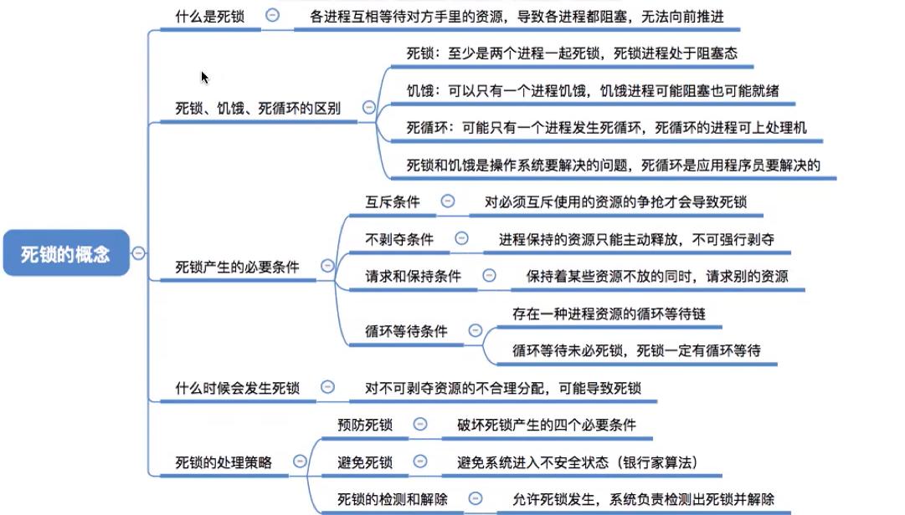
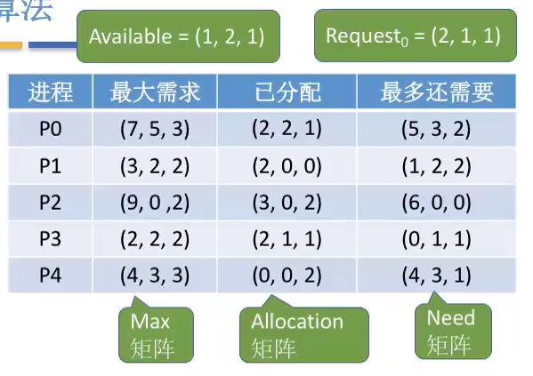
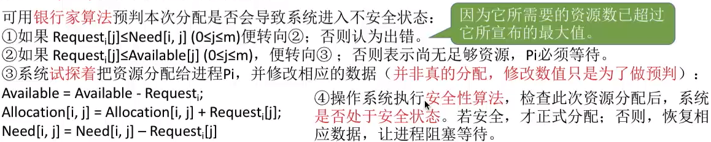
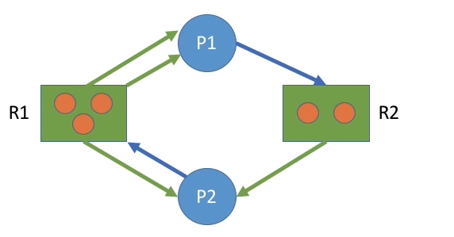
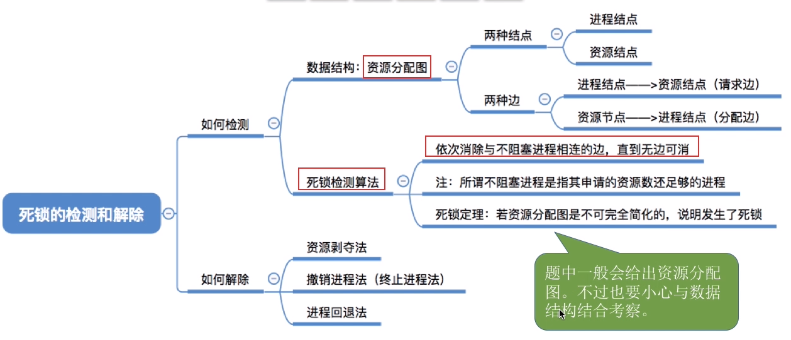

# 死锁

## 一、死锁的概念

* 对比哲学家进餐问题
    * 每个进程都在等待另一个进程的资源释放

### 1、死锁、饥饿、死循环

* 死锁
    * 各进程互相等待对方手里的资源，导致各进程都阻塞，无法向前推进的现象
* 饥饿
    * 由于长期得不到想要的资源，某进程无法向前推进的现象
* 死循环
    * 某进程执行过程中一直跳不出某个循环的现象。有时是因为程序逻辑bug导致的，有时是程序员故意设计的

### 2、产生死锁的条件

* 生死锁必须**==同时满足以下四个条件==**，只要其中任一条件不成立，死锁就不会发生
    * 互斥条件
        * 只有对必须亙斥使用的资源的争抢才会导致死锁（如哲学家的筷子、打印机设备）
    * 不剥夺条件
        * 进程所获得的资源在未使用完之前，不能由其他进程强行夺走，**只能主动释放**
    * 请求和保持条件
        * 进程已经保持了至少一个资源，但又提出了新的资源请求，而该资源又被其他进程占有，此时请求进程被阻塞，但又对自己已有的资源保持不放
    * 循环等待条件
        * 存在一种进程资源的循环等待链，链中的每一个进程已获得的资源同时被下一个进程所请求

## 二、处理死锁方案

### 1、预防死锁

* 思想
    * 破坏死锁满足的条件之一
* 破坏互斥条件
    * **互斥条件**：只有对必须互斥使用的资源的争抢才会导致死锁
    * 如果把只能互斥使用的资源改造为允许共享使用，则系统不会进入死锁状态。比如 **`SPOOLing`** 技术
        * 操作系统可以采用 **`SPOOLing`** 技术把独占设备在逻辑上改造成**共享设备**
    * 缺点
        * 并不是所有的资源都可以改造成可共享使用的资源。并且为了系统安全，很多地方还必须保护这种互斥性。因此，很多时候都无法破坏互斥条件
* 破环不剥夺条件
    * 不剥夺条件：进程所获得的资源在未使用完之前，不能由其他进程强行夺走，只能主动释放
    * 示例
        * 方案一：**当某个进程请求新的资源得不到满足时，它必须立即释放保持的所有资源**，待以后需要时再重新申请。也就是说，即使某些资源尚未使用完，也需要主动释放，从而破坏了不可剥夺条件
    * 缺点
        1. 实现起来比较复杂
        2. 释放已获得的资源可能造成前一阶段工作的失效。因此这种方法一般只适用于易保存和恢复状态的资源，如CPU
        3. 反复地申请和释放资源会增加系统开销，降低系统吞吐量
        4. 若采用方案一，意味着只要暂时得不到某个资源，之前获得的那些资源就都需要放弃，以后再重新申请。如果一直发生这样的情况，就会导致进程饥饿

* 破坏请求和保持条件
    * 请求和保持条件：进程已经保持了至少一个资源，但又提出了新的资源请求，而该资源又被其他进程占有，此时请求进程被阻塞，但又对自己已有的资源保持不放
    * 可以采用静态分配方法
        * 即进程在运行前**一次申请完它所需要的全部资源**，在它的资源未满足前，不让它投入运行。一旦投入运行后，这些资源就一直归它所有，该进程就不会再请求别的任何资源
    * 缺点
        * 有些资源可能只需要用很短的时间，因此如果进程的整个运行期间都一直保持着所有资源，就会造成严重的资源浪费，资源利用率极低
        * 另外，该策略也有可能导致某些进程饥饿

* 破坏循环等待条件
    * 循环等待条件：存在一种进程资源的循环等待链，链中的每一个进程已获得的资源同时被下一个进程所请求
    * 可采用顺序资源分配法
        * 首先给系统中的资源编号，规定每个进程必须按编号递増的顺序请求资源，**同类资源（即编号相同的资源）一次申请完**
    * 缺点
        1. 不方便增加新的设备，因为可能需要重新分配所有的编号
        2. 进程实际使用资源的顺序可能和编号递增顺序不一致，会导致资源浪费
        3. 必须按规定次序申请资源，用户编程麻烦 

### 2、避免死锁

* 什么是安全序列
    * 就是指如果**系统按照这种序列分配资源，则每个进程都能顺利完成**。只要能找出一个安全序列，系统就是安全状态
    * 当然，安全序列可能有多个
* 因此可以在资源分配之前，**预先判断这次分配是否会导致系统进入不安全状态**，以此决定是否答应资源分配请求。**这也是“银行家算法”的核心思想**

* 银行家算法

    * 假设系统中有 n 个进程，m 种资源
    * 每个进程在运行前**先声明对各种资源的最大需求数**，则可用一个 n*m 的矩阵（可用二维数组实现）表示所有进程对各种资源的最大需求数
    * 不妨称为最大需求矩阵Max,Max[ i , j ] = K表示进程 Pi 最多需要 K 个资源 `Rj`。同理，系统可以用一个n*m 的分配矩阵 **Allocation** 表示对**所有进程的资源分配情况**。Max- Allocation =**Need矩阵，表示各进程最多还需要多少各类资源**
    * 另外，还要用一个长度为 m 的**一维数组 Available**表示当前系统中还有多少可用资源
    * 某进程P向系统申请资源，可用一个长度为 m 的 **一维数组 Request **表示本次申请的各种资源量

    

    * 步骤

        

        1. 检查此次申请是否超过了之前声明的最大需求数
        2. 检査此时系统剩余的可用资源是否还能满足这次请求
        3. 试探着分配，更改各数据结构
        4. 用安全性算法检查此次分配是否会导致系统进入不安全状态
            * 安全性算法步骤
                * 检査当前的剩余可用资源是否能满足某个进程的最大需求，如果可以，就把该进程加入安全序列，并把该进程持有的资源全部回收
                * 不断重复上述过程，看最终是否能让所有进程都加入安全序列

### 3、检测和解除

* 死锁的检测

    * 用某种数据结构来保存资源的请求和分配信息
    * 提供一种算法，利用上述信息来检测系统是否已进入死锁状态

    
    * 检测死锁的算法
        * 在资源分配图中，**找出既不阻塞又不是孤点的进程Pi**
            * 即找出一条有向边与它相连，且该有向边对应资源的申请数量小于等于系统中已有空闲资源数量。如下图中，R1 没有空闲资源，R2 有个空闲资源。若所有的连接该进程的边均满足上述条件，则这个进程能继续运行直至完成，然后释放它所占有的所有资源。
        * 消去它所有的请求边和分配变，**使之称为孤立的结点**。在下图中， **`P1`** 是满足这一条件的进程结点，于是将 **`P1`** 的所有边消去
        * 进程 Pi 所释放的资源，可以唤醒某些因等待这些资源而阻塞的进程，原来的阻塞进程可能变为非阻塞进程。在下图中，**`P2`** 就满足这样的条件。进行一系列简化后，若能消去途中所有的边，则称该图是**==可完全简化==**的

    

* 死锁的解除
    * 资源剥夺法
        * 挂起（暂时放到外存上）某些死锁进程，并抢占它的资源，将这些资源分配给其他的死锁进程。但是应防止被挂起的进程长时间得不到资源而饥饿
    * 撤销进程法
        * 强制撤销部分、甚至全部死锁进程，并剥夺这些进程的资源。
        * 这种方式的优点是实现简单，但所付的代价可能会很大。因为有些进程可能已经运行了很长时间，已经接近结束了，一旦被终止可谓功亏一篑，以后还得从头再来
    * 进程回退法
        * 让一个或多个死锁进程回退到足以避免死锁的地步
        * 这就要求系统要记录进程的历史信息，设置还原点

