# 进程与线程

## 一、进程的组成和定义

### 1、进程的组成

* 程序段、数据段、PCB 三部分组成了**进程实体**（进程映像）。一般情况下，进程实体简称为进程

    * 严格来说，进程实体和进程并不一样，**==进程实体是静态的，进程则是动态的==**

    * **程序段**

        * 存放程序代码

    * **数据段**

        * 程序运行时使用、产生的运算数据。如**全局变量**、**局部变量定义的常量**就存放在数据段内

    * **PCB**

        * 系统为每个运行的程序配置一个数据结构，称为**进程控制块（PCB）**，用来描述进程的各种信息（如程序代码存放位置）

        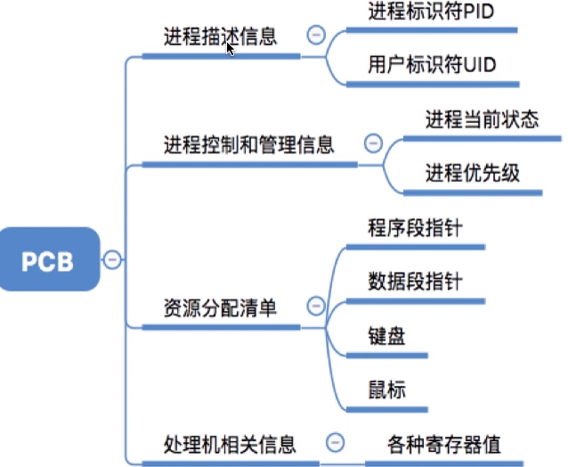

* 所谓创建进程，就是创建进程实体中的 **PCB**，撤销进程就是撤销进程实体中的 **PCB**

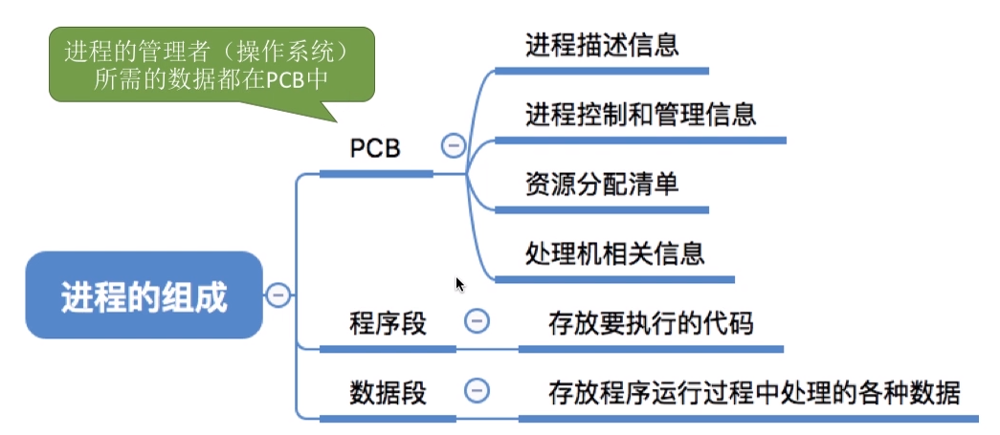

### 2、进程的定义

* 传统典型定义
    * 进程是程序的一次执行**过程**
    * 进程是一个程序及其数据在处理机上顺序执行时所发生的**活动**
    * 进程是具有独立功能的程序在数据集合上**运行的过程**，它是系统进行资源分配和调度的一个独立单位

**==进程是一个动态的过程==**

## 二、进程的组织和特征

### 1、进程组织方式

* 链接方式

    * 按照进程状态将PCB分为多个队列
    * 操作系统持有指向各个队列的指针
        * 执行指针
            * 指向当前处于**运行态**（执行态）的进程
        * 就绪队列指针
            * 指向当前处于**就绪态**的进程
        * 阻塞队列指针
            * 指向当前处于**阻塞态**的进程，很多操作系统还会根据阻塞原因不同，再分为多个阻塞队列

    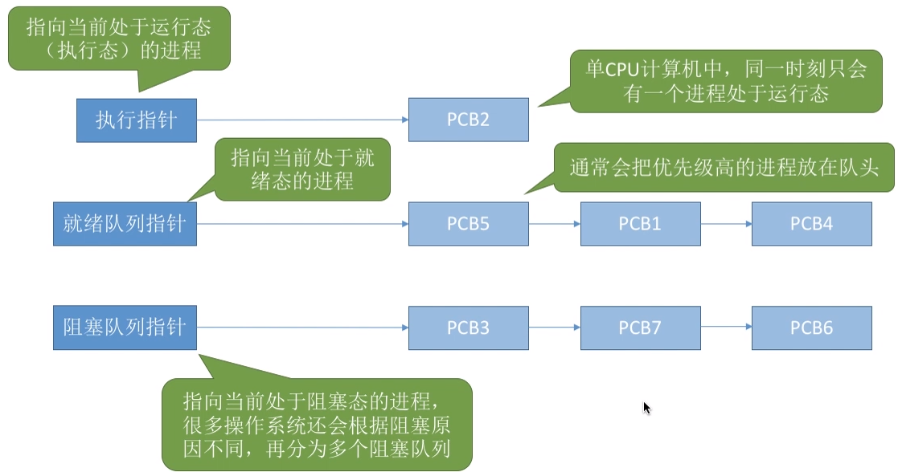

* 索引方式
    * 根据进程状态的不同，建立几张索引表
    * 操作系统持有指向各个索引表的指针
        * 执行指针
        * 就绪表指针
        * 阻塞表指针

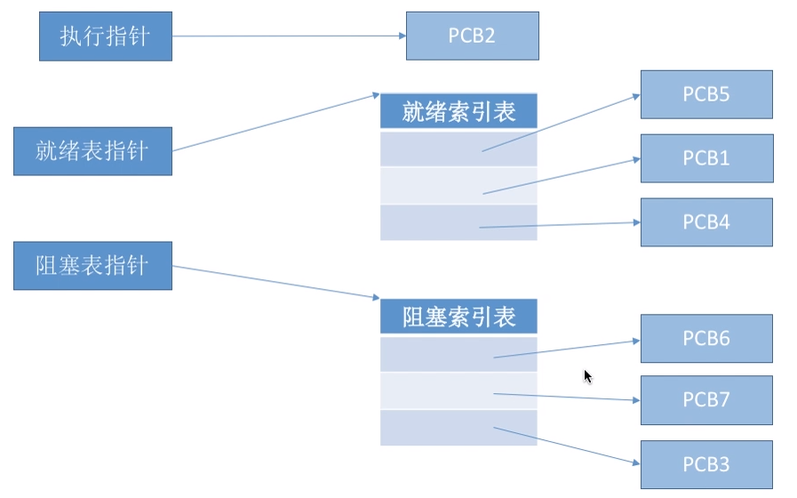

### 2、进程的特征

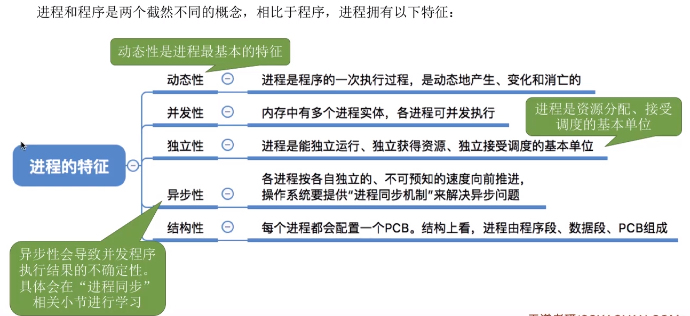

### 3、进程小结

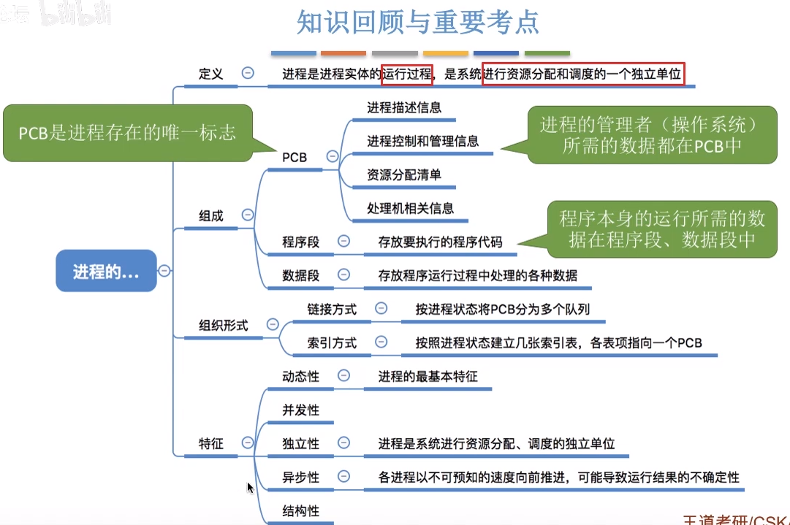

## 三、进程的状态与转换

### 1、进程的状态

* 进程的三种基本状态

    

* 另外两种状态

### 2、进程的转换

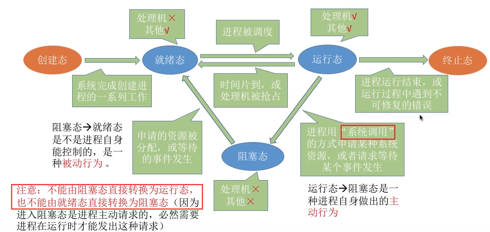

## 四、进程控制

### 1、什么是进程控制

* 进程控制的主要功能是对系统中的所有进程实施有效的管理，它具有创建新进程、撤销已有进程、实现进程状态转换等功能

* 用原语来实现进程控制
    * 原语的特点是执行期间不允许中断，只能一气呵成
        * 这种不可被中断的操作即**==原子操作==**
    * 原语采用 **==“关中断指令” 和 “开中断指令”==** 实现

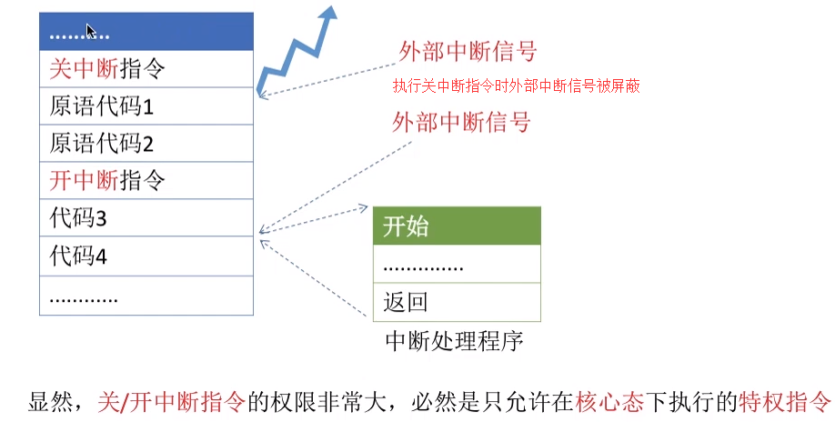

* **原语的作用**
    * 更新 PCB 中的信息（如修改进程状态标志、将运行环境保存到PCB、从PCB恢复运行环境）
        * 所有的进程控制原语一定都会**修改进程状态标志**
        * 剥夺当前运行进程的 CPU 使用权必然需要保存其运行环境
        * 某进程开始运行前必然要恢复期运行环境
    * 将PCB插入合的队列
    * 分配/回收 资源

## 五、进程通信

### 1、何为进程通信

* 进程通信就是指**进程之间的信息交换**

### 2、共享存储

* 操作系统会为共享进程分配一个共享进程空间
* 共享进程可以互相访问对方的信息，但同一时刻只能有一个进程访问

* 基于数据结构的共享
    * 比如共享空间里只能放个长度为10的数组。这种共享方式**速度慢、限制多**，是一种低级通信方式
* 基于存储区的共享
    * 在内存中画出一块共享存储区，**数据的形式、存放位置都由进程控制**，而不是操作系统。相比之下，这种共享方式**速度更快**，是一种高级通信方式

### 3、管道通信

* 管道
    * 是指用于连接读写进程的一个**共享文件**，又名 pipe 文件。其实就是在内存中**开辟个大小固定的缓冲区**

* 特点
    * 管道只能采用半双工通信，某一时间段内只能实现单向的传输。如果要实现双向同时通信，则需要设置两个管道
    * 各进程要互斥地访问管道（同一时间只能有一个进程访问）
    * 数据以**字符流**的形式写入管道，当管道写满时，写进程的 write() 系统调用将被阻塞，等待读进程将数据取走。当读进程将数据全部取走后，管道变空，此时读进程的 read() 系统调用将被阻塞
    * 如果没写满，就不允许读。如果没读空，就不允许写
    * 数据一旦被读岀，就从管道中被抛弃，这就意味着**读进程最多只能有一个**，否则可能会有读错数据的情况

### 4、消息传递

* 进程间的数据交换以**格式化的消息（ Message）为单位**。进程通过操作系统提供的 **“发送消息/接收消息”** 两个原语进行数据交换
    * 格式化的消息

    

* 消息传递方式

    * 直接通信方式

        * 消息直接挂到接收进程的消息缓冲队列上

        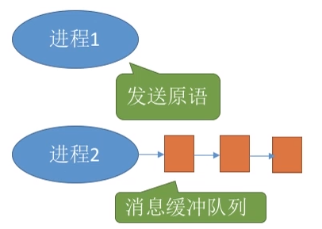

    * 间接通信方式

        * 消息要先发送到中间实体（信箱）中，因此也称“信箱通信才式”

        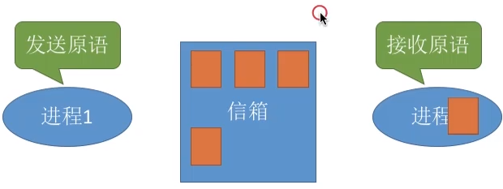

## 六、线程

### 1、什么是线程

* 有的 **进程** 可能需要“同时”做很多事，而**==传统的进程只能串行地执行一系列程序==**
* 为此，引入了 **“线程”**，来增加并发度
    * 线程是一个基本的CPU执行单元，也是程序执行流的最小单位
    * 引入线程之后，不仅是进程之间可以并发，进程内的各线程之间也可以并发，从而进一步提升了系统的并发度，使得一个进程内也可以并发处理各种任务（如 **`QQ`** 视频、文字聊天、传文件）

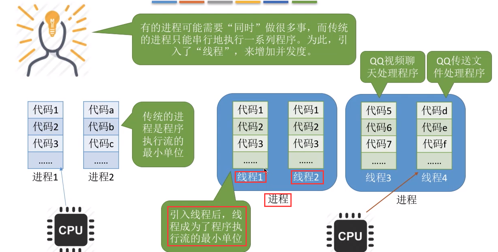

### 2、引入线程后的变化

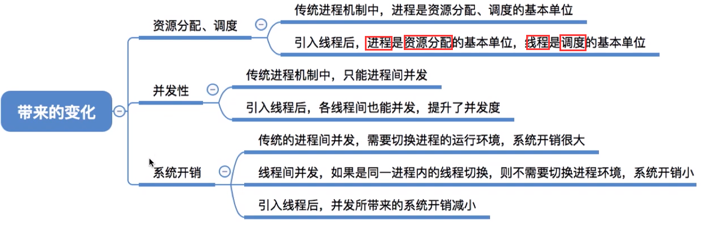

### 3、线程的属性

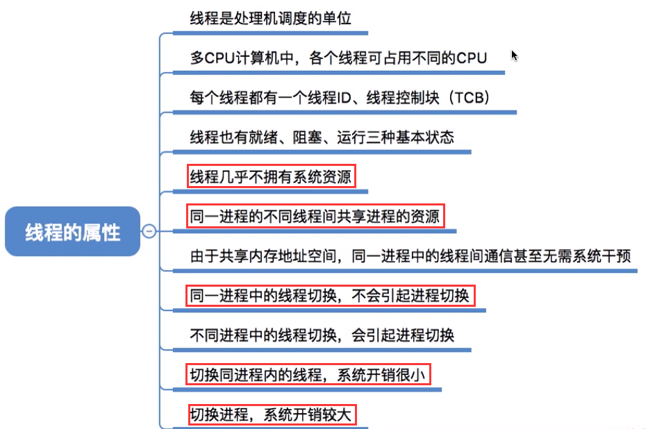

### 4、线程的实现方式

* **==用户级线程==**

    * 用户级线程由应用程序通过**==线程库==**实现
    * 所有的线程管理工作都由应用程序负责（包括线程切换）
    * 用户级线程中，线程切换可以在用户态下即可完成，无需操作系统干预
    * 在用户看来，是有多个线程。但是在操作系统内核看来，并意识不到线程的存在。（用户级线程对用户不透明，对操作系统透明）
    * 可以这样理解，**“用户级线程” 就是 “从用户视角看能看到的线程”**

    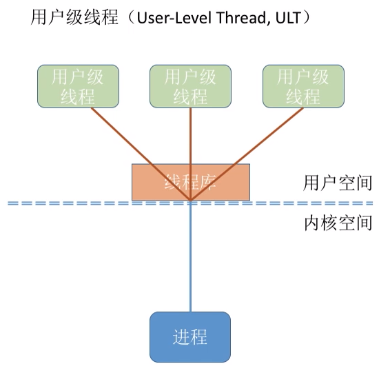

* **==内核级线程==**

    * 内核级线程的管理工作由**操作系统内核**完成
    * 线程调度、切换等工作都由内核负责，因此内核级线程的切换必然需要在核心态下才能成
    * 可以这样理解，**“内核级线程” 就是 “从操作系统内核视角看能看到的线程”**

    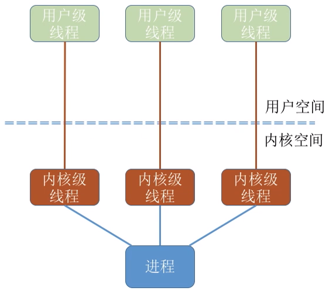

* ==**重点**==

    * 操作系统只 “看得见” 内核级线程，因此==**只有内核级线程才是处理机分配的单位**==
    * 举例
        * 下边这个模型中，该进程由**两个内核级线程，三个用户级线程**，在用户看来，这个进程中有三个线程。但即使该进程在一个 4 核处理机的计算机上运行，也最多只能被分配到两个核，**最多只能有两个用户线程并行执行**

    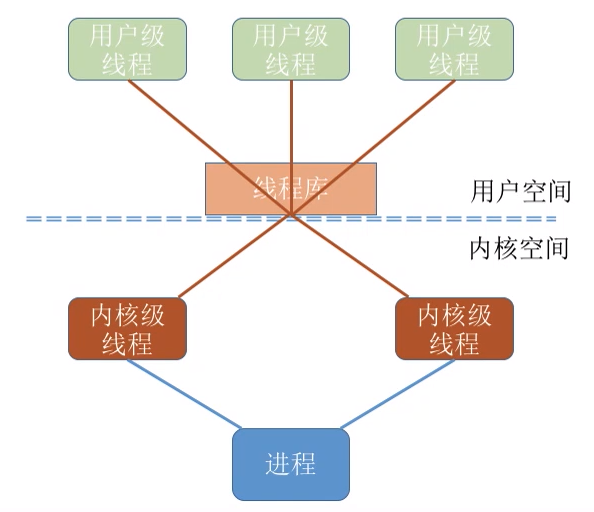

### 5、多线程模型

* 多对一模型
    * 多个用户及线程映射到一个内核级线程。每个用户进程只对应一个内核级线程
    * 优点
        * 用户级线程的切换在用户空间即可完成，不需要切换到核心态，线程管理的系统开销小，效率高
    * 缺点
        * 当一个用户级线程被阻塞后，整个进程都会被阻塞，并发度不高。多个线程不可在多核处理机上并行运行

* 一对一模型

    * 一个用户及线程映射到一个内核级线程。每个**用户进程**有与**用户级线程**同数量的内核级线程
    * 优点
        * 当一个线程被阻塞后，别的线程还可以继续执行，并发能力强。多线程可在多核处理机上并行执行
    * 缺点
        * 一个用户进程会占用多个内核级线程，线程切换由操作系统内核完成，需要切换到核心态，因此线程管理的成本高，开销大

    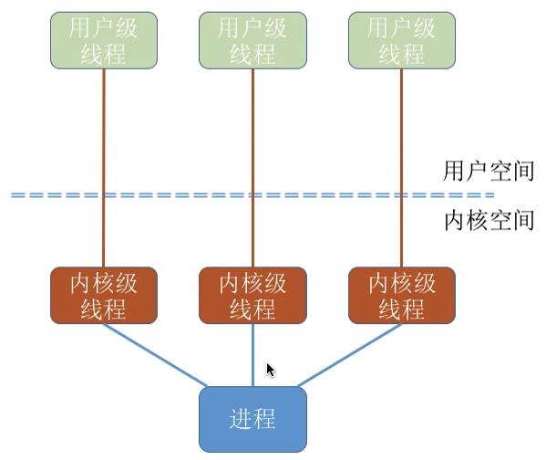

* 多对多模型

    * n 用户及线程映射到 m 个内核级线程（n>=m）。每个用户进程对应 m 个内核级线程
    * 特点
        * 克服了多对一模型并发度不高的缺点，又克服了一对一模型中一个用户进程占用太多内核级线程，开销太大的缺点

    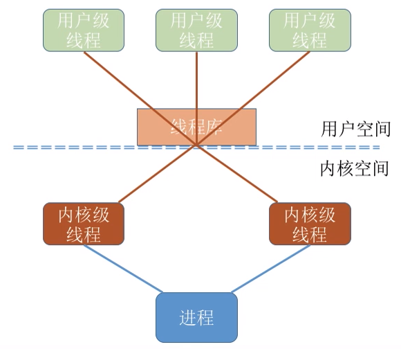

## 七、处理机调度

### 1、调度的概念

* 当有一堆任务要处理，但由于资源有限，这些事情没法同时处理。这就需要确定某种规则来决定处理这些任务的顺序，这就是 “调度” 研究的问题

* 处理机调度
    * 在多道程序系统中，进程的数量往往是多于处理机的个数的，这样不可能同时并行地处理各个进程
    * **处理杋调度**，就是从就绪队列中按照一定的算法选择一个进程并将处理机分配给它运行，以实现进程的并发执行

### 2、调度的层次

* 高级调度
    * 由于内存空间有限，有时无法将用户提交的作业全部放入内存，因此就需要确定某种规则来决定将作业调入内存的顺序
    * 高级调度（作业调度）。按一定的原则从外存上处于后备队列的作业中挑选一个（或多个）作业，给他们分配内存等必要资源，并建立相应的进程（建立PCB），以使它（们）获得竞争处理机的权利
    * 高级调度是**辅存（外存）与内存**之间的调度。每个作业只调入一次，调出一次。作业调入时会建立相应的PCB，作业调出时才撤销PCB
    * 高级调度**主要是指调入的问题**，因为**只有调入的时机需要操作系统来确定**，但调出的时机必然是作业运行结束才调出

* 中级调度
    * 引入了虚拟存储技术之后，**可将暂时不能运行的进程调至外存等待**。等它重新具备了运行条件且内存又稍有空闲时，再重新调入内存。这么做的目的是为了提高内存利用率和系统吞吐量
    * 暂时调到外存等待的进程状态为**==挂起状态==**。值得注意的是，**PCB 并不会一起调到外存**，而是会常驻内存。PCB 中会记录进程数据在外存中的存放位置，进程状态等信息，操作系统通过内存中的 PCB 来保持对各个进程的监控、管理。**被挂起的进程 PCB 会被放到的挂起队列中**
    * **中级调度**（内存调度），就是要决定将哪个处于挂起状态的进程重新调入内存
    * 一个进程可能会被多次调出、调入内存，因此中级调度发生的频率要比高级调度更高

+ 低级调度（进程调度）
    + 低级调度（进程调度），其主要仼务是按照某种方法和策略从就绪队列中选取一个进程，将处理机分配给它
    + 进程调度是操作系统中最基本的一种调度，在一般的操作系统中都必须配置进程调度
    + 进程调度的频率很高，一般**几十毫秒一次**

* 三种调度的对比

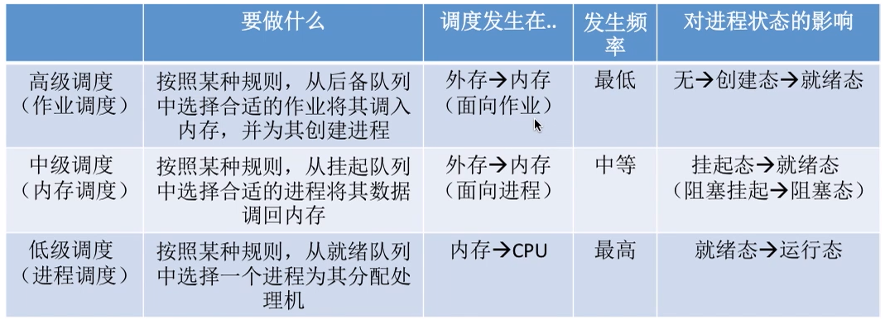

## 八、进程调度的过程

### 1、进程调度的时机

* 可以进行进程调度
    * 当前运行的进程主动放弃处理机
        * 进程正常终止
        * 运行过程中发生异常而终止
        * 进程主动请求阻塞（如等待 I/O）
    * 当前运行进程被动放弃处理机
        * 分给进程的时间片用完
        * 有更紧急的事需要处理（如 I/O 中断）
        * 有更高优先级的进程进入就绪队列

* 不能进行进程调度
    * 在处理中断的过程中
        * 中断处理过程复杂，与硬件密切相关，很难做到在中断处理过程中进行进程切换
    * 进程在**==操作系统内核程序临界区==**中
    * 在原子操作过程中（原语）
        * 原子操作不可中断，要一气呵成（如之前讲过的修改PCB中进程状态标志，并把PCB放到相应队列）

### 2、进程调度的方式

* 非剥夺调度
    * **只允许进程主动放弃处理机**。在运行过程中即便有更紧迫的任务到达，当前进程依然会继续使用处理机，直到该进程终止或主动要求进入阻塞态
    * 特点
        * 实现简单，系统开销小，但是无法及时处理紧急任务，适合于早期的批处理系统

* 剥夺调度
    * 当一个进程正在处理机上执行时，如果有一个更重要或更紧迫的进程需要使用处理机，则立即暂停正在执行的进程，将处理机分配给更重要紧迫的那个进程
    * 特点
        * 可以优先处理更紧急的进程，也可实现让各进程按时间片轮流执行的功能（通过时钟中断）。适合于分时操作系统、实时操作系统

### 3、进程的切换与过程

* 狭义的进程调度
    * 狭义的进程调度指的是从就绪队列中选中一个要运行的进程。（这个进程可以是刚刚被暂停执行的进程也可能是另一个进程，后一种情况就需要进程切换）

* 广义的进程调度
    * 包含了选择一个进程和进程切换两个步骤

* 进程切换
    * 进程切换是指一个进程让出处理机，由另一个进程占用处理机的过程
    * 过程
        * 对原来运行进程各种数据的保存
        * 对新的进程各种数据的恢复
    * 注意
        * 进程切换是有代价的，因此如果过于频繁的进行进程调度、切换，必然会使整个系统的效率降低使系统大部分时间都花在了进程切换上，而真正用于执行进程的时间减少

## 九、调度算法

### 1、评价指标

* **CPU** 利用率
    * 指CPU “忙碌” 的时间占总时间的比例

* 系统吞吐量
    * 对于计算机来说，希望能用尽可能少的时间处理完尽可能多的作业
    * **系统吞吐量：单位时间内完成作业的数量**
* 周转时间
    * 对于计算机的用户来说，他很关心自己的作业从提交到完成花了多少时间
    * **周转时间，是指从作业被提交给系统开始，到作业完成为止的这段时间间隔**
        * 作业在外存后备队列上等待作业调度（高级调度）的时间
        * 进程在就绪队列上等待进程调度（低级调度）的时间
        * 进程在CPU上执行的时间
        * 进程等待 I/O 操作完成的时间

* 有的作业运行时间短，有的作业运行时间长，因此在周转时间相同的情况下，运行时间不同的作业，给用户的感觉肯定是不一样的

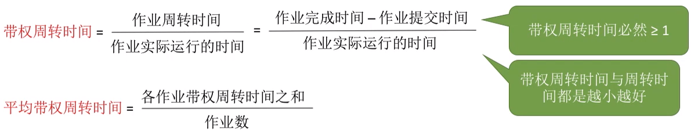

* 等待时间
    * 计算机的用户希望自己的作业尽可能少的等待处理机
    * **等待时间，指进程/作业处于等待处理机状态时间之和，等待时间越长，用户满意度越低**
        * 对于**==进程==**来说，等待时间就是指进程建立后等待被服务的时间之和，在等待 I/O 完成的期间其实进程也是在被服务的，所以不计入等待时间
        * 对于**==作业==**来说，不仅要考虑建立进程后的等待时间，还要加上作业在外存后备队列中等待的时间

* 响应时间
    * 对于计算机用户来说，会希望自己的提交的请求（比如通过键盘输入了一个调试命令）尽早地开始被系统服务、回应
    * **响应时间，指从用户提交请求到首次产生响应所用的时间**

### 2、先来先服务（FCFS）算法

* 按照到达的先后顺序调度，事实上就是等待时间越久的越优先得到服务

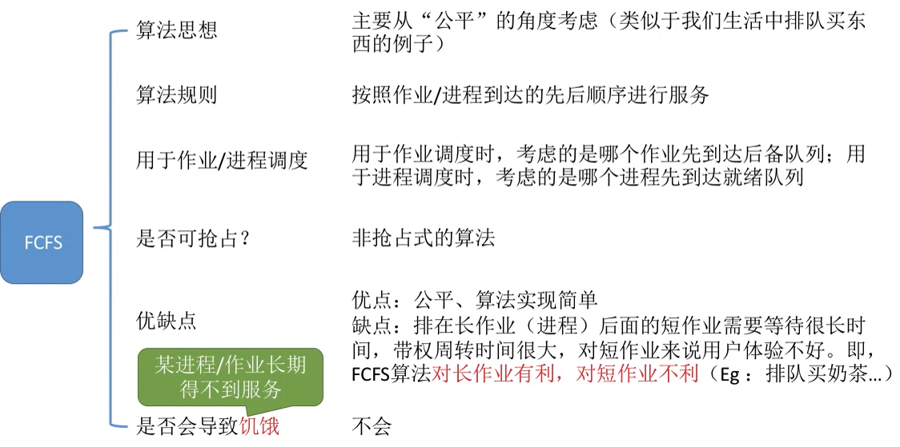

### 3、短作业有优先（SJF）算法

* 最短的作业/进程优先得到服务（**所谓“最短”，是指要求服务时间最短**）

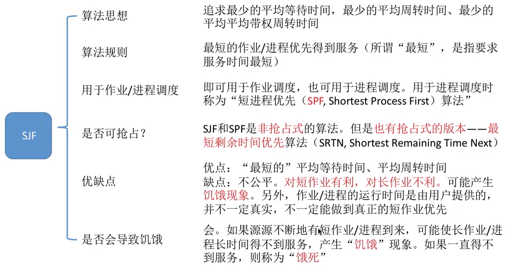

### 4、高响应比优先（HRRN）算法

* 要综合考虑作业/进程的等待时间和要求服务的时间

* 在每次调度时先计算各个 作业/进程 的==**响应比**==，选择响应比最高的作业/进程为其服务

    

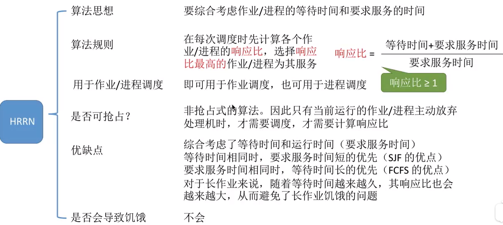

### 5、时间片轮转（RR）算法

* 公平地、轮流地为各个进程服务，让每个进程在一定时间间隔内都可以得到响应

* 按照各进程到达就绪队列的顺序，轮流让各个进程执行个时间片（如 **`100ms`**）。若进程未在一个时间片内执行完则剥夺处理机，将进程重新放到就绪队列队尾重新排队
* 注意
    * 如果时间片太大，**使得每个进程都可以在一个时间片内就完成**，则时间片轮转调度算法退化为先来先服务调度算法，并且会增大进程响应时间。因此时间片不能太大
    * 另一方面，**进程调度、切换是有时间代价的（保存、恢复运行环境）**，因此如果时间片太小，会导致进程切换过于频繁，系统会花大量的时间来处理进程切换，从而导致实际用于进程执行的时间比例减少。可见时间片也不能太小
    * 般来说，设计时间片时要让切换进程的开销占比不超过1%

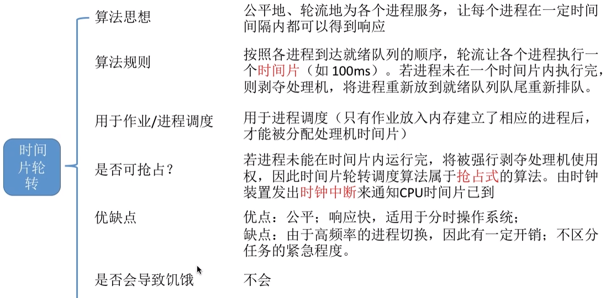

### 6、优先级调度算法

+ 随着计算机的发展，特别是实时操作系统的出现，越来越多的应用场景需要**根据任务的紧急程度**来决定处理顺序
+ 每个 作业/进程 有各自的**优先级**，调度时选择优先级最高的作业/进程

* 优先级的设置规则
    * 通常系统进程优先级高于用户进程
    * 前台进程优先级高于后台进程
    * 操作系统更偏好 I/O 型进程（或称 I/O 繁忙型进程）
* 优先级的调整
    * 如果某进程在就绪队列中等待了很长时间，则可以适当提升其优先级
    * 如果某进程占用处理机运行了很长时间，则可适当降低其优先级
    * 如果发现一个进程频繁地进行 I/O 操作，则可适当提升其优先级

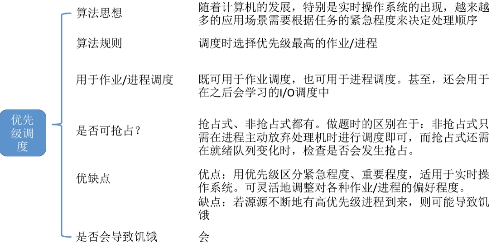

### 7、多级反馈队列算法

* 设置多级就绪队列，各级队列优先级从高到低，时间片从小到大
* 新进程到达时先进入第1级队列，按 **`FCFS`** 原则排队等待被分配时间片
* 若用完时间片进程还未结束，则进程进入下一级队列队尾。如果此时已经在最下级的队列，则重新放回最下级队列队尾
* 只有第k级队列为空时，才会为 k+1 级队头的进程分配时间片

* 被抢占处理机的进程重新放回原队列队尾

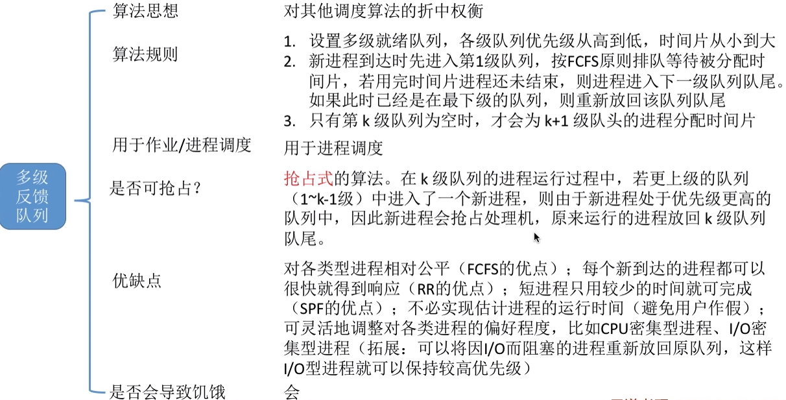

