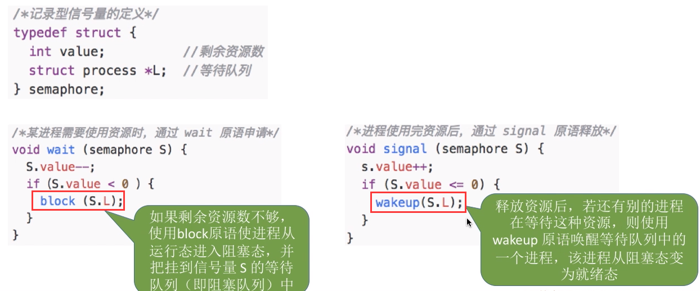

# 进程的同步、互斥

## 一、进程的同步

* 同步亦称直接制约关系，它是指为完成某种任务而建立的两个或多个进程，这些进程因为需要在某些位置上协调它们的工作次序而产生的制约关系。进程间的直接制约关系就是源于它们之间的相互合作

## 二、进程的互斥

* 我们把一个时间段内只允许一个进程使用的资源称为**==临界资源==**。许多物理设备（比如摄像头、打印机）都属于临界资源。此外还有许多变量、数据、内存缓冲区等都属于临界资源
* 对临界资源的访问，必须**互斥**地进行
    * 互斥，亦称间接制约关系。进程互斥指当一个进程访问某临界资源时，另一个想要访问该临界资源的进程必须等待。当前访问临界资源的进程访问结朿，释放该资源之后，另一个进程才能去访间临界资源

* 为了实现对临界资源的互斥访问，同时保证系统整体性能，需要遵循以下原则：
    * **空闲让进**
        * 临界区空闲时，可以允许一个请求进入临界区的进程立即进入临界区
    * **忙则等待**
        * 当已有进程进入临界区时，其他试图进入临界区的进程必须等待
    * **有限等待**
        * 对请求访问的进程，应保证能在有限时间内进入临界区（保证不会饥饿）
    * **让权等待**
        * 当进程不能进入临界区时，应立即释放处理机，防止进程忙等待

## 三、互斥的实现

### 1、软件实现

* 单标识法

    * 算法思想

        * 两个进程在访问完临界区后会把使用临界区的杈限转交给另一个进程
        * 也就是说每个进程进入临界区的权限只能被另一个进程赋予举例

    * 举例

        

        * turn的初值为0，即刚开始只允许O号进程进入临界区
        * 若 **`P1`** 先上处理机运行，则会一直卡在 ⑤。直到**`P1`**的时间片用完，发生调度，切换**`P0`**上处理机运行
        * 代码①不会卡住 **`P0`**，**`P0`** 可以正常访问临界区，在 **`P0`** 访问临界区期间即时切换回 **`P1`**，**`P1`** 依然会卡在⑤
        * 只有**`P0`** 在退出区将 turn 改为 1 后，**`P1`**才能进入临界区

    * **==问题==**

        * 如果此时允许进入临界区的进程是**`P0`**，而 **`P0`** 一直不访问临界区，那么虽然此时临界区空闲，但是并不允许**`P1`**访闯
        * 单标志法存在的主要问题是
            * **违背 “空闲让进” 原则**

* 双标志先检查法

    * 算法思想
        * 设置一个布尔型数组 flag[]，数组中各个元素用来标记各进程想进入临界区的意愿，比如
            “flag[0] = true” 意味着 0 号进程 **`P0`** 现在想要进入临界区。**每个进程在进入临界区之前先检査当前有没有别的进程想进入临界区**，如果没有，则把自身对应的标志 flag 设为 true，之后开始访问临界区

    

* 双标志后检查法

    * 算法思想
        * 双标志先检査法的改版。前一个算法的问题是先 “ 检査 ” 后 “上锁 ”，但是这两个操作又无法一气呵成，因此导致了两个进程同时进入临界区的问题。因此，人们又想到先 “上锁 ”后 “ 检查 ” 的方法，来避免上述问题

    

* Peterson 算法

    * 算法思想
        * 双标志后检査法中，两个进程都争着想进入临界区，但是谁也不让谁，最后谁都无法进入临界区。 Gary L. Peterson 想到了一种方法，如果双方都争着想进入临界区，那可以让进程尝试 “孔融让梨”，**主动让对方先使用临界区**

    

### 2、硬件实现

* 中断屏蔽方法

    * **利用 “开/关中断指令” 实现**
        * 与原语的实现思想相同，即在**某进程开始访问临界区到结束访问为止都不允许被中断**，也就不能发生进程切换，因此也不可能发生两个同时访问临界区的情况

    

    * 优点
        * 简单、高效
    * 缺点
        * 不适用于多处理机
        * 只适用于操作系统内核进程，不适用于用户进程（因为开/关中断指令只能运行在内核态，这组指令如果能让用户随意使用会很危险）

* **`TestAndSetLock`** 指令法
    * **`TSL`** 指令是用硬件实现的，执行的过程不允许被中断，只能一气呵成
    * 相比软件实现方法，**`TSL`** 指令把“上锁”和“检査”操作用硬件的方式变成了一气呵成的原子操作
        * 优点
            * 实现简单，无需像软件实现方法那样严格检査是否会有逻辑漏泂
            * 适用于多处理杋环境

* **Swap** 指令

    * 有的地方也叫 Exchange 指令，或简称 **`XCHG`** 指令
    * Swap 指令是用硬件实现的，执行的过程不允许被中断
    * 借助 C 语言描述

    

## 四、信号量机制

### 1、简介

+ 用户进程可以通过使用操作系统提供的**==一对原语==**来对**==信号量==**进行操作，**从而很方便的实现了进程互斥、进程同步**
    + 信号量
        + 信号量其实就是一个变量（可以是一个整数，也可以是更复杂的记录型变量）
        + 可以用一个信号量来表示系统中某种资源的数量，比如：系统中只有一台打印机，就可以设置一个初值为 1 的信号量
    + 一对原语
        + ==**wait(S)**== 原语和 **==signal(S)==** 原语
        + 可以把原语理解为我们自己写的函数，函数名分别为 wait 和 signal，括号里的**信号量 S** 其实就是函数调用时传入的一个参数
        + **wait、 signal** 原语常简称为 **==P、Ⅴ 操作==**（来自荷兰语 `proberen` 和 `verhogen`）。因此，做题的时候常把 wait（s）、signal（S）两个操作分别写为 P(S)、V(S)

### 2、整型信号量

* 用一个整数型的变量作为信号量，用来表示**系统中某种资源的数量**
    * 与普通整数变量的区别：对信号量的操作只有三种，即初始化、P 操作、V 操作

### 3、记录行信号量

* 整型信号量的缺陷是存在 “忙等” 问题
* 因此人们又提出了 “记录型信号量”，即**用记录型数据结构表示的信号量**

* 总结
    * P 操作
        * 对信号量 S 的一次 P 操作意味着进程请求一个资源，因此需要执行 **`S.value--`**，表示资源数减 1
        * 当**`S.value < 0`**时表示该类资源已分配完毕，因此进程应调用 **block 原语**进行**自我阻塞**（当前运行的进程从运行态→阻塞态），主动放弃处理机，并插入该类资源的**等待队列 `S.L`** 中
        * 可见，该机制遵循了 **“ 让权等待 ”**原则，不会出现“忙等”现象
    * V 操作
        * 对信号量 S 的一次Ⅴ操作意味着进程释放一个单位的该类资源，因此需要执行 **`S.value++`**，表示资源数加 1
        * 若加 1 后仍是 **`S.value <= 0`**，表示依然有进程在等待该类资源，因此应调用 **wakeup 原语**唤醒等待队列中的第个进程（被唤醒进程从阻塞态→就绪态）

## 五、用信号量机制实现互斥、同步

### 1、实现互斥

* 步骤
    * 分析并发进程的关键活动，划定临界区（如：对临界资源打印机的访问就应放在临界区）
    * 设置互斥信号量 **`mutex`**，初值为 1
    * 在临界区之前执行 P（**`mutex`**），在临界区之后执行 V（**`mutex`**）
* 注意
    * 对不同的临界资源需要设置不同的互斥信号量
    * P、V操作必须成对出现
        * 缺少 P（**`mutex`**）就不能保证临界资源的互斥访问
        * 缺少 V（**`mutex`**）会导致资源永不被释放，等待进程永不被唤醒

### 2、实现进程同步

* 进程同步：要让各并发进程按要求有序地推进

    

* 步骤

    * 分析什么地方需要实现 “同步关系”，即必须保证 “一前一后” 执行两个操作（或两句代码）
    * 设置同步信号量 S，初始为 0
    * 在 “前操作” 之后执行V（S），在 “后操作” 之前执行P（S）

    

## 六、管程

### 1、何为管程

* 信号量机制存在的问题
    * 编写程序困难、易出错

+ 管程是一种特殊的软件模块
+ 管程的组成
    1. 局部于管程的共享数据结构说明
    2. 对该数据结构进行操作的一组**过程（可以看作函数）**
    3. 对局部于管程的共享数据设置初始值的语句
+ 管程的特征
    1. 局部于管程的数据只能被局部于管程的过程所访问
    2. 一个进程只有通过调用管程内的过程才能进入管程访问共享数据
    3. 每次仅允许一个进程在管程内执行某个内部过程

