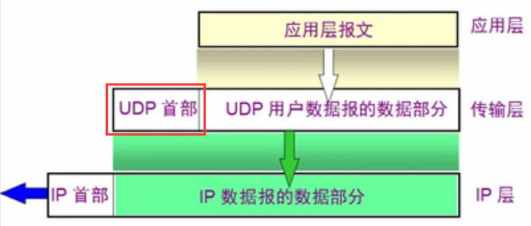
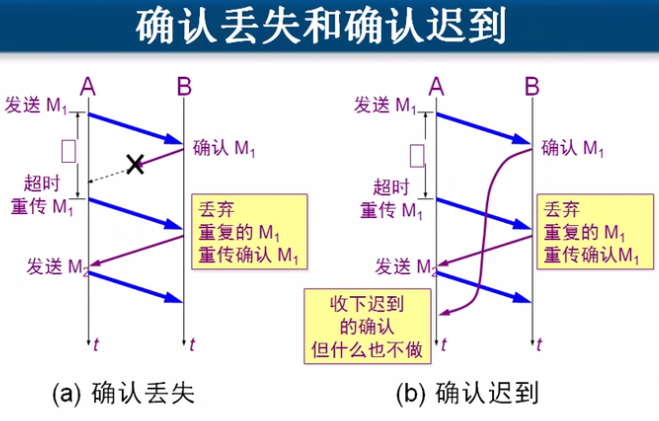

# 传输层

## 一、传输层协议

* **`TCP`** 协议
    * 需要将要传输的文件分段传输、建立会话
    * 具有流量控制功能，是可靠传输
* **`UDP`** 协议
    * 一个数据包就能够完成数据通信，不分段、不需要建立会话
    * 没有流量控制功能，是不可靠传输


## 二、`UDP` 

### 1、`UDP` 的特点

1. `UDP` 是无连接的，即发送数据之前不需要建立连接
2. `UDP` 使用尽最大努力交付，即不保证可靠交付，同时也不使用拥塞控制
3. `UDP` 是面向报文的，`UDP` 没有拥塞控制，很适合多媒体通信的要求
4. `UDP` 支持一对一、一对多、多对一和多对多的交互通信
5. `UDP` 的首部开销小，只有8个字节




### 2、`UDP` 首部格式


* **==伪首部==**

    * 伪首部的作用是用来凑够 20 个字节来结算检验和
    * 检验和计算过程

    


## 三、TCP

### 1、TCP 的特点

1. `TCP` 是面向连接的传输层协议
2. 每一条 `TCP`连接只能有两个端点
3. 每一条 `TCP` 连接只能是点对点的
4. `TCP` 提供可靠交付的服务
5. `TCP` 提供全双工通信
6. `TCP` 面向**字节流** 


### 2、可靠传输

* 原理：停等协议
    * **若 A 没有收到 B 的确认，等待一段时间后，再重新发送一次数据包** 
* 特点
    * 简单，但信道利用率低


​	


### 3、流水线传输

* 发送方可连续发送多个分组，不必每发完一个分组就停顿下来等待对方的确认
* 由于信道上一直有数据不间断地传送，这种传输方式可获得很高的信道利用率


* 实现

    * 发送方维持一个发送窗口（长度一般是 5）

* 过程

    * 发送窗口中的数据包可以连续发送，不需要等确认
    * 发送窗口中的数据包发送完之后等待数据包的确认，这时发送窗口就可以往前推进，发送剩下的数据包
    * 以此类推

    

    


### 4、累积确认

* 发送端连续发送一系列数据包之后（假设为 1 - 10），如果此时收到数据包 5 的确认，则表示接收端收到了前5 个数据包，则 1 - 4 的数据包的确认就不需要发送了


### 5、超时重传时间


## 四、TCP 的首部格式


* 序号
    * 发送的数据包的第一个字节
    * 已收到的数据包的最后一个字节 +1，表示之前的数据都已经收到

* ```
    URG、ACK、PSH、RST、SYN、FIN
    ```

    * `URG` 
        * 若该位为 1，表示该数据包优先传（发送端）
    * `PSH` 
        * 若该位为 1，则优先提交给应用程序（接收端）
    * `ACK` 
        * 若该位是 1，表示**确认号**有效，为 0，表示无效
    * `SYN` 
        * 同步字段，若为 1，表示正在建立会话
    * `RST` 
        * 若该位为 1，则表示出现严重错误（如中断），必须重新建立连接
    * `FIN` 
        * 若该位为 1，表示数据已经传完了，可以释放连接了

* 窗口
    
* 传输数据的过程中，发送端和接收端都要像对方告诉自己的缓存还有多大，以便缓存对方发送过来的数据
    
* 紧急指针
    
    * 当 `URG` 字段设为 1 的时候才起作用

## 五、流量控制

* 对象
    * 通信双方
* 原理
    * 发送端和接收端都有一个缓存窗口
    * 发送数据时双方都会告诉对方自己的缓存还有多大空间，双反以此来设置发送速度


## 六、拥塞控制

* 对象
    * 网络中的所有计算机


### 1、慢开始

* 发送方维持一个拥塞窗口 `cwnd` 
* 发送方控制拥塞窗口的原则
    * 只要网络没有出现拥塞，拥塞窗口就再增大一些（加倍），以便把更多的分组发送出去
    * 只要网络出现拥塞，拥塞窗口就减小一些，以减少注入到网络中的分组数


* 原理

    

* 拥塞避免算法

    * 让拥塞窗口 **`cwnd`**缓慢地增大，即每经过一个往返时间 **`RTT`** 就把发送方的拥塞窗口 **`cwnd`** 加 **1**，而不是加倍，使拥塞窗口 **`cwnd`** 按**线性规律缓慢增长** 

* 设置慢开始门限状态变量  `ssthresh` 

    * 当 **`cwnd < ssthresh`** 时，使用慢开始算法
    * 当 **`cwnd > ssthresh`** 时，停止使用慢开始算法而改用拥塞避免算法
    * 当 **`cwnd = ssthresh`** 时，既可使用慢开始算法，也可使用拥塞避免算法

    


* 当网络拥塞时
    * 新的  **`ssthresh`** 值是**此时拥塞窗口 `cwnd`长度的一半** 
    * 然后拥塞窗口 **`cwnd`** 长度重新置为 0


## 七、传输连接管理

### 1、三次握手建立连接


### 2、三次握手的各个状态


### 3、TCP 的连接释放


