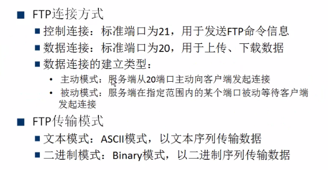
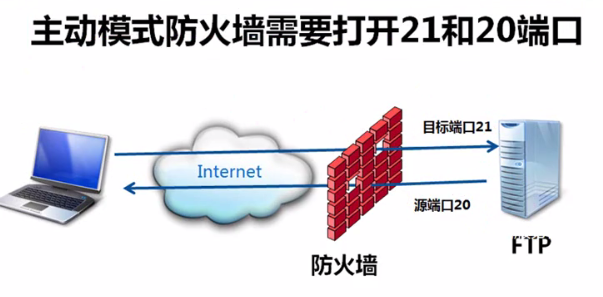
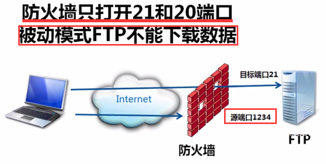

# 应用层

## 一、域名系统 DNS

### 1、作用

* 负责解析**域名**，将域名解析为 `IP` 地址

### 2、什么是域名

* 以 ` www.91xueit.com` 为例
    * 顺序：从后往前
        * `com`：顶级域名
        * `91xueit`：二级域名

### 3、域名解析过程

* 域名解析由 **` DNS`**服务器来完成
* ` DNS`服务器的组成
    * 有多个根域名服务器（负责解析顶级域名服务器）
    * 顶级域名服务器（负责解析  com、edu 等结尾的）
* 过程
    * 请求一个网址时，假设为 ` www.91xueit.com`
        * 向顶级域名服务器发送数据包，若顶级域名服务器能解析，则直接发送返回数据
        * 若顶级域名服务器解析不了，则向根域名服务器发送请求，再返回
* **==域名服务器都有缓存机制==** 

## 二、动态主机配置协议 `DHCP` 

* 作用
    * 为主机分配 ` IP`地址
* 过程
    * 向网络中发送一个广播
    * `DHCP` 服务器收到后就从地址池中拿一个分配给该主机

## 三、文件传输协议 FTP

* 服务概述

### 1、主动模式

* 主动模式需要防火墙打开 20、21 端口

### 2、被动模式

* 客户端使用什么端口来连接服务区，服务器的防火墙就需要开一个对应的端口

