# 数据链路层

## 一、基本概念

### 1、数据发送模型

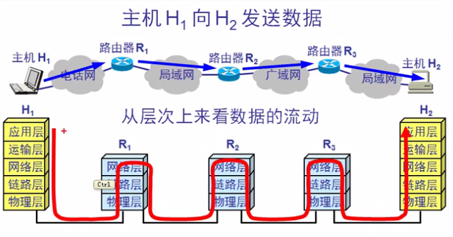

### 2、信道类型

* 点对点信道
    * 这种信道使用一对一的点对点通信方式
* 广播信道
    * 这种信道使用一对多的广播通信方式，因此过程比较复杂。广播信道上连接的主机很多，因此必须**使用专用的共享信道协议**来协调这些主机的数据发送

### 3、链路、数据链路

* 链路
    * 是一条点到点的物理线路段，中间没有任何其他的交换结点
* 数据链路
    * 除了物理线路外，还**必须有通信协议来控制这些数据的传输**。若把实现这些协议的**硬件和软件**加到链路上，就构成了数据链路
        * 现最常用的方法是使用**适配器（即网卡）**来实现这些协议的硬件和软件
        * 一般的适配器都包括了数据链路层和物理层这两层的功能

### 4、帧

* 数据链路层传输的是**==帧==** 

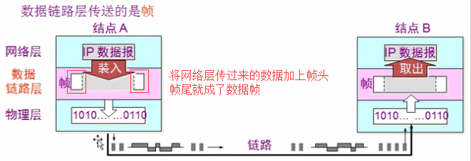

## 二、三个基本问题

### 1、封装成帧

* 概念
    * 封装成帧（ framing）就是在一段数据的前后分别添加首部和尾部，然后就构成了一个帧，确定帧的界限
    * 首部和尾部的一个重要作用就是进行帧定界

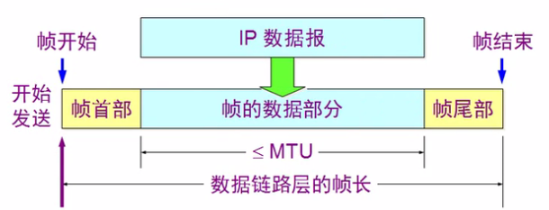

### 2、透明传输

* 使用控制字符进行帧界定

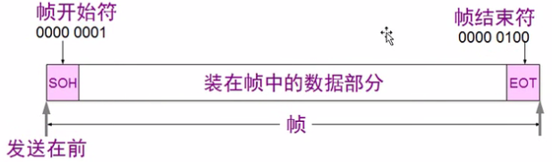

* **==若要传输的数据中出现了控制字符==** 

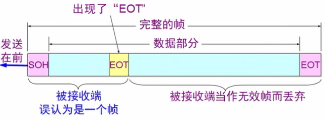

* 解决办法
    * 在数据中出现控制字符 `SOH` 或 `EOT` 的前面插入一个转义字符 `ESC` （其十六进制编码是 `1B`）
    * 接收端的数据链路层在将数据送往网络层之前删除插入的转义字符
    * 如果转义字符也出现数据当中，那么应在转义字符前插入一个转义字符。当接收端收到连续的两个转义字符时，就删除其中前面的一个

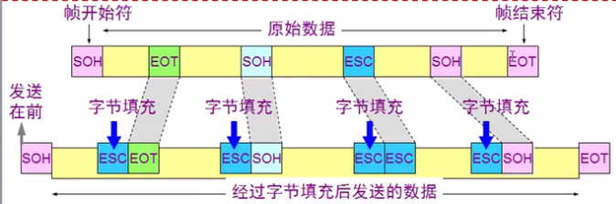

### 3、差错检测

* 概念
    * 传输过程中可能会产生比特差错：1 可能会变成 0 而 0 也可能变成 1
    * 在一段时间内，传输错误的比特占所传输比特总数的比率称为误码率
    * **为了保证数据传输的可靠性，在计算机网络传输数据时，必须采用各种差错检测措施** 

* 常用的数据链路层差错校验：**==循环冗余校验 `CRC`==** 

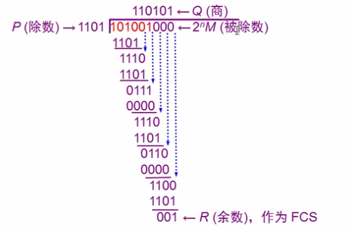

* 循环冗余校验算法过程：**以要传输的数据为  101001 为例** 
    * 发送端
        * 取一个 **==n+1==** 位的二进制数作为**==除数（1101）==**
        * 将 101001 后边加上 **==n 个 0==** 作为被除数
        * 然后做除法（不进位的加法），得到一个 n 位二进制余数 `FCS` (**帧检验序列** / **冗余码**)
        * 最后传输的数据是 101001 后边加上帧检验序列，即：**101001001**
    * 接收端
        * 将得到的数据跟**==除数（1101）==**做除法
        * 结果为 0 则表示没有错，就接收，否则丢弃
    * 特点
        * 得这种检测方法并不能确定究竞是哪二个或哪几个比特出现了差错
        * 只要经过严格的挑选，并使用**位数足够多的除数 P**，那么出现检测不到的差错的概率就很小很小

## 三、点对点信道（广域网）

### 1、使用的协议

* **`PPP`** 协议

### 2、`PPP` 协议的帧格式

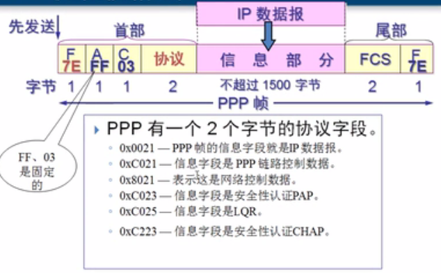

* 标志字段
    * F = `0x7E`
    * A = `0xFF`，实际上该字段并没有起作用
    * C = `0x03`

### 3、`PPP` 协议中的的透明传输

* 若在信息字段中出现标志字段的解决办法
    * 字节填充
        * 将信息字段中出现的每个 `0x7E` 字节转变成为2字节序列（`0x7D、0x5E`）
        * 若信息字段中出现一个 `0x7D` 的字节则将其转变成为 2 字节序列（`0x7D，0x5D`）
        * 若信息字段中出现 **ASCII 码**的控制字符（即数值小于 `0x20` 的字符），则在该字符前面要加入一个 `0x7D`字节，同时将该字符的编码加以改变
    * 0 比特填充
        * 发送端
            * 只要发现有 5 个连续 1，则立即填入一个0
        * 接收端
            * 对帧中的比特流进行扫描。每当发现5个连续1时，就把过个连续 1 后的一个 0 删除

## 四、广播信道（局域网）

### 1、以太网

* 集线器方式（不安全）

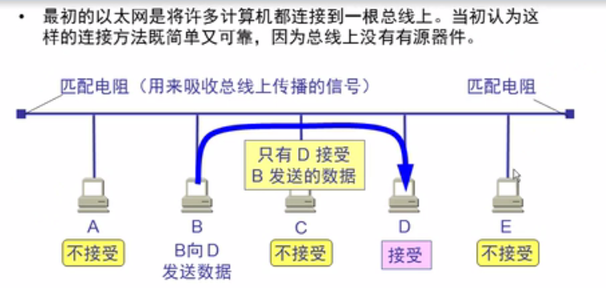

* 总线上的每一个工作的计算机都能检测到B发送的数据信号由于只有计算机D的地址与数据帧首部写入的地址一致，因此只有D才接收这个数据帧
* 其他所有的计算机（A、C、E）都检测到不是发送给它们的数据帧，因此就丢弃这个数据帧而不能够收下来具有广播特性的总线上实现了一对一的通信

* **以太网提供的服务**
    * 以太网提供的服务是不可靠的交付，即尽最大努力的交付

* 以太网的 **MAC 帧格式**

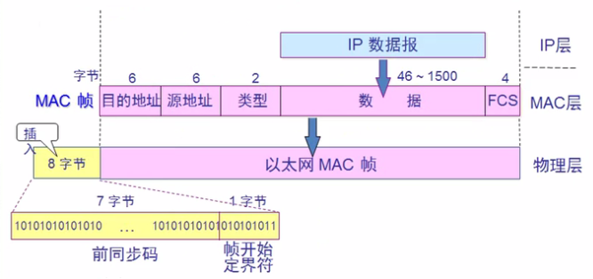

### 2、以太网协议

* 以太网使用 **`CSMA / CD`** 协议

    * **多点接入**：表示许多计算机以多点接入的方式连接在一根总线上
    * **载波监听**：是指每一个站在发送数据之前先要检测一下总线上是否有其他计算机在发送数据，如果有，则暂时不要发送数据，以免发生碰撞

    

    * 碰撞检测：就是计算机边发送数据边检测信道上的信号电压大小
        * 当几个站同时在总线上发送数据时，总线上的信号电压摆动值将会增大（互相叠加）
        * 当一个站检测到的信号电压摆动值超过一定的门限值时，就认为总线上至少有两个站同时在发送数据，表明产生了碰撞
        * 所谓“碰撞”就是发生了冲突。因此“碰撞检测”也称为“冲突检测”
    * 检测到冲突后
        * 在发生碰撞时，总线上传输的信号产生了严重的失真，无法从中恢复出有用的信息来
        * 每一个正在发送数据的站，一旦发现总线上出现了碰撞，就要立即停止发送，免得继续浪费网络资源，然后等待一段随机时间后再次发送

### 3、争用期

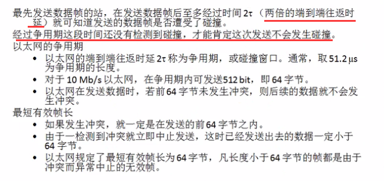

### 4、退避算法

* 全称：二进制指数类型退避算法

* 发生碰撞的站在停止发送数据后，要推迟（退避）一个随机时间才能再发送数据

    * 过程

    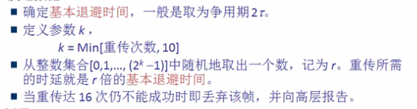

