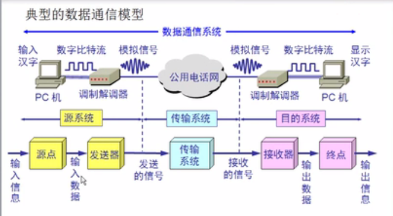

# 物理层

## 一、作用

* 物理层解决如何在连接各种计算机的传输媒体上==**传输数据比特流**==，而不是指具体的传输媒体
* 物理层的主要任务：确定传输媒体的接口的一些特性
    * 机械特性：例接口形状，大小，引线数目
    * 电气特性：例规定电压范围（`-5V` 到 `+5V`）
    * 功能特性：例规定`-5V` 表示 0，`+5V` 表示 1
    * 过程特性：也称规程特性，规定建立连接时各个相关部件的工作步骤

## 二、数据通信的基本知识

### 1、典型的数据通信模型

### 2、相关术语

* 数据：运送消息的实体
* 信号：数据的电气的或电磁的表现
* 模拟信号：代表消息的参数的取值是连续的
* 数字信号：代表消息的参数的取值是离散的
* 码元：在使用时间域的波形表示数字信号时，则代表不同离散数值的基本波形就成为码元
    * 在数字通信中常常用时间间隔相同的符号来表示一个二进制数字，这样的时间间隔内的信号称为二进制码元。而这个间隔被称为码元长度。**1 码元可以携带 `n bit` 的信息量** 

### 3、有关信道的概念

* 信道一般表示向一个方向传送信息的媒体。所以咱们说平常的通信线路往往包含一条发送信息的信道和一条接收信息的信道

* **单向通信**（单工通信）
    * 只能有一个方向的通信而没有反方向的交互
        * ==**电视台**==
* **双向交替通信**（半双工通信）
    * 通信的双方都可以发送信息，但不能双方同时发送（当然也就不能同时接收）
        * ==**对讲机**==
* **双向同时通信**（全双工通信）
    * 通信的双方可以同时发送和接收信息
        * ==**打电话**==

### 4、基带信号、带通信号

* **基带信号**（即基本频带信号）
    * **来自信源的信号**。像计算机输出的代表各种文字或图像文件的数据信号都属于基带信号。**==基带信号就是发出的信号直接表达了要传输的信息的信号==**，比如我们说话的声波就是基带信号

* **带通信号** 
    * 把基带信号经过**载波调制**后，把信号的频率范围**==搬移到较高的频段==**以便在信道中传输（即仅在一段频率范围内能够通过信道）

* 总结
    * 因此在传输距离较近时，计算机网络都采用基带传输方式
    * 由于在近距离范围内基带信号的衰减不大，从而信号内容不会发生变化。如从计算机到监视器、打印机等外设的信号就是基带传输的

* 对基带信号的几种调制方法

### 5、信道的极限容量

* 奈氏准则（**假设是在没有干扰的情况下**）
    * **在任何信道中，码元传输的速率是有上限的**，否则就会出现**码间串扰**的问题，使接收端对码元的判决（即识别）成为不可能
    * 如果信道的频带越宽，也就是能够通过的信号高频分量越多，那么就可以用更高的速率传送码元而不出现码间串扰

### 6、信噪比

* **香农公式表明：**
    * 信道的带宽或信道中的信噪比越大，则信息的极限传输速率就越高
    * **只要信息传输速率低于信道的极限信息传输速率，就一定可以找到某种办法来实现无差错的传输** 
    * 若信道带宽 ==**W**== 或==**信噪比S/N**==没有上限（当然实际信道不可能是这样的），则信道的极限信息传输速率C也就没有上限
    * 实际信道上能够达到的信息传输速率要比香农的极限传输速率低不少

* **奈氏准则和香农公式的适用范围**

## 三、物理层的传输媒体

### 1、导向传输媒体

* 传播方式
    * 电磁波沿着固体媒体传播
* 类型
    * 双绞线
        * 屏蔽双绞线 `STP` 
        * 无屏蔽双绞线 `UTP` 
    * 同轴电缆
        * 50 Ω 同轴电缆用于==**数字传输**==，多用于基带传输，也叫**基带同轴电缆** 
        * 75 Ω 同轴电缆用于==**模拟传输**==，即宽带同轴电缆
    * 光缆

## 四、信道复用技术

### 1、频分复用技术

* 用户在分配到一定的频带后，在通信过程中自始至终都占用这个频带
* 频分复用的所有用户**==在同样的时间占用不同的带宽资源==**（请注意这里的“带宽”是 **==频率带宽==** 而不是数据的发送速率）。

### 2、时分复用技术

* **时分复用的所有用户是在不同的时间占用同样的频带宽度** 

* 时分复用则是将时间划分为一段段等长的**时分复用帧**（`TDM` 帧）。每一个时分复用的用户在每一个`TDM`帧中占用固定序号的时隙
* 每一个用户所占用的时隙是**周期性地出现**（其周期就是 `TDM` 帧的长度对应的时间）

* 周期性的存取数据

### 3、统计时分复用技术

* 给每个数据加上一个标记，这样就不需要按特定的顺序放置特定的数据
* 接收端只需要按标记来接收数据就可以了

