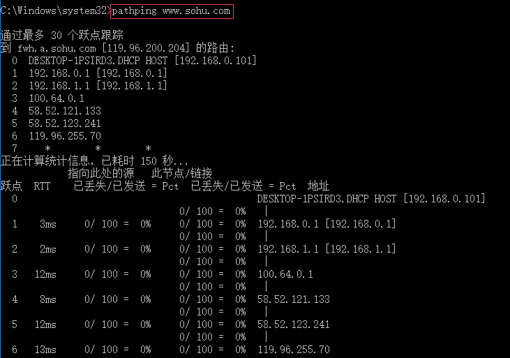
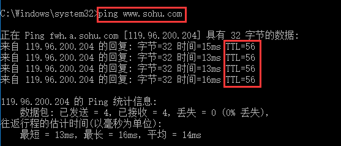

# 网络层

## 一、网络层提供的服务

* 网络层负责在不同网络之间传输数据包，不管发送的数据包是否有先后顺序，也不管重传（传输层的任务）

## 二、发送数据

### 1、发送数据步骤

* 发送端
    1. 应用程序准备要传输的文件
    2. 传输层将文件分段并编号
    3. 网络层加上源 `IP` 地址，目标 `IP` 地址
    4. 数据链路层加上源 `MAC` 地址、目标 `MAC` 地址、帧校验序列（`FCS`）

* 接收端
    * 从物理层一层一层网上传，传到应用层传递给应用程序

## 三、网络层协议

### 1、`ARP`  协议

* 作用
    * **`ARP`** 将 `IP` 地址通过广播目标 MAC 地址是 **FF-FF-FF-FF-FF** 的广播解析目标 **`IP`** 地址的 MAC 地址
    * `ARP` 协议发送一个 `ARP` 请求，这个 `ARP` 请求是一个广播数据帧，意味着局域网内，每一台机器都能收到，`ARP` 数据帧中包含着目的主机的 `IP` 地址，因为是广播发送，如果哪台主机拥有这个 `IP`，则会反馈消息，发回自己的硬件地址

### 2、`ICMP` 协议

* 全称：网际控制报文协议
* 作用
    * 用于在 **`IP`** 主机、路由器之间传递控制消息
    * 控制消息是指网络通不通、主机是否可达、路由是否可用等网络本身的消息

* 主要命令
    * **`ping`**
    * **`pathping`**：跟踪数据包路径，计算丢包情况
    * **`tracert`**：跟踪数据包路径，不计算
    * **`traceeroute`**：在路由器上使用

* 每经过一个路由器，TTL （生存周期）就减一，若减到 0，则丢失该数据包，防止数据包无限循环

### 3、`IP` 协议

* **`IP`** 数据包格式
    * 首部
        * 首部的前一部分是固定长度（共20字节），所有数据报必须具有的一部分
        * 在首部后面有一些可选字段，其长度是可变的（**大多数数据包没有这个字段**）
    * 数据

* 版本

    * 用来表示  **`TCP/IP`**  协议是哪个版本

* 首部长度

    * 表示数据包的首部有多少个字节（因为包含可变部分），剩下的就是数据部分

* 区分服务

    * 给数据包添加一个标记（例如优先发送）

* 总长度

    * 整个数据包的长度（最长为 65535 个字节）
    * 若数据包的长度大于数据链路层的帧的最大长度（1500字节），则进行分片（再分段）

* 标识

    * 用来标识分片，以便接收端重新组装

* 标志

    * 用来标识该数据包是分片还是一个完整数据包

    

    

* 片偏移

    

* 生存时间

    * 由 TTL 决定，每经过一个路由器，TTL 就减 1，若 TTL 减到了 0，就丢弃该数据包

    

* 协议
    * 表示数据是由什么协议发送的
    * 协议字段指出需要将数据交给哪一个进程

* 首部检验和

    * 用来检验数据包**==首部==**在传输过程中有没有出现错误

    

* 源地址、目标地址
    
* 就是源 **`IP`** 地址、目标 **`IP`** 地址
    
* **`IP`** 内容、作用
    
    * 作用
        * 自动获取数据包的传输路径（路由选择）
    * 静态路由
        * 需要管理员手动配置路由，比较死板，适用于小规模网络
    * 动态路由
        * 由路由选择协议**==通过广播==**来自动选择合适路由，较为灵活
        * 一般 30 秒更新一次路由表，最大规模是 15 跳

